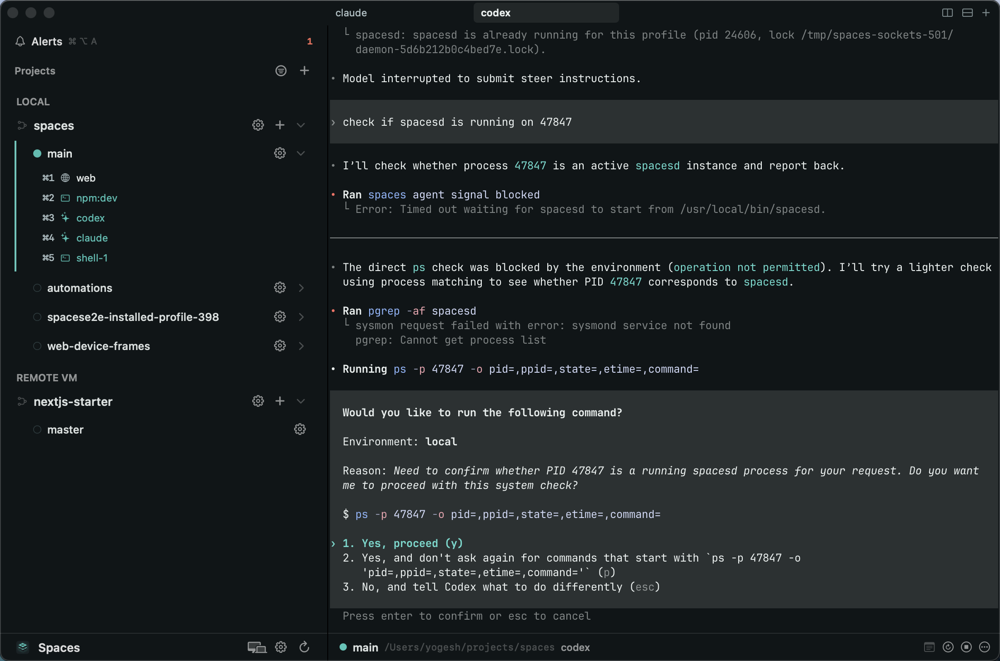
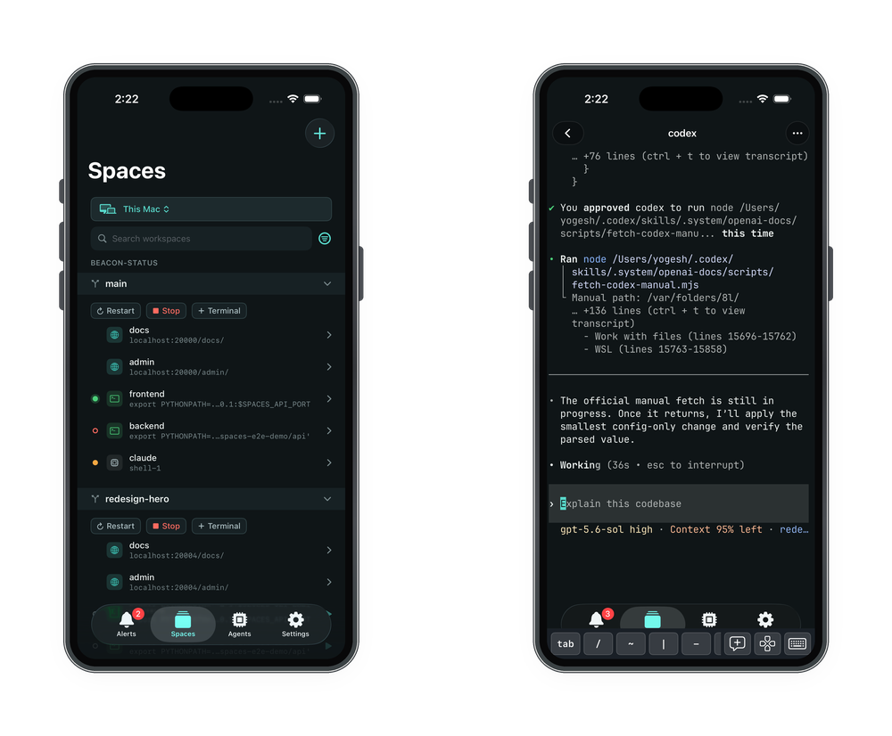

# Spaces

Manage parallel coding sessions across all of your devices.

[Download](https://github.com/yogesh-dhande/spaces/releases/latest) · [Website](https://usespaces.dev) · [Docs](https://usespaces.dev/docs)

Spaces is a native Mac app (not Electron) that gives each piece of work its own workspace: a Git worktree with its own ports, processes, browser sessions, and terminals. Terminals run in a per-user background service rather than in the app, so they keep running when the app quits and can be opened from another Mac or an iPhone. Coding agents in those terminals report when they are working, blocked, or done, and one agent can direct others through the Spaces CLI or MCP server.

## Features

### Workspaces

- **Projects and workspaces**: a project is a local directory or a Git URL that Spaces clones. In a Git project each workspace is a worktree on its own branch, and every workspace shares the project's one clone; a non-Git project has a single workspace, its own directory. Parallel branches stay checked out side by side instead of being stashed and switched in one checkout. Every device also has a home workspace (`~`) for terminals that belong to no project.
- **Ports and processes**: declare named services and processes once per project. Each workspace gets its own port per service, passed to its processes and scripts as `SPACES_<SERVICE>_PORT`, `_HOST`, and `_URL`, so several checkouts of the same app run at once without port conflicts or hand-edited `.env` files.
- **Local URLs**: a bundled Caddy proxy serves each service at a stable address such as `http://web.<workspace>.localhost:7391`. Each workspace has its own hostnames, so cookies and logins do not collide across branches.
- **Built-in terminal**: every terminal is a [libghostty](https://github.com/ghostty-org/ghostty) terminal inside Spaces, with tabs, splits, and separate windows. No external terminal app is involved.
- **Editor**: review a workspace's changes as a diff against uncommitted changes, the last commit, its base branch, or any ref; edit files in place; and send line comments to a coding agent working in that workspace.

### Coding agents

- **Status and Alerts**: [Claude Code, Codex, and opencode](https://usespaces.dev/docs/coding-agents) report when they are working, blocked on you, or done. Alerts collects those states with exited processes and terminal bells from every workspace and paired device, so you can see which terminal needs you without opening each one.
- **Agent briefs**: each coding agent keeps a short markdown brief beside its terminal (status with an expected finish time, questions for you, its task list), written through the CLI or the MCP server and shown on the Mac and the iPhone, so you can see where an agent stands without reading its transcript.
- **Orchestration**: one coding agent can [spawn and coordinate other agents](https://usespaces.dev/docs/orchestration), each in its own workspace, on this machine or a paired one, and is told when a child is blocked, done, or exits.
- **CLI**: [`spaces`](https://usespaces.dev/docs/cli) drives projects, workspaces, terminals, and agents from a shell. It is also how coding agents report their status.
- **MCP server**: [`spaces mcp`](https://usespaces.dev/docs/mcp) exposes projects, workspaces, terminals, agents, and paired devices as tools, so an agent can inspect and drive Spaces directly.
- **Automations**: [run a coding agent with a prompt, or a shell script](https://usespaces.dev/docs/automations), in a workspace on any paired device, on demand or on a cron schedule, including while the app is closed. Each run's terminal can be watched live and replayed afterwards.
- **Session restore**: when a restart, crash, or shutdown cuts running agents off, Spaces offers to relaunch them in the workspaces they were working in, resuming the same conversation where the agent supports it.

### Across machines

- **Remote machines**: pair a Mac or an Ubuntu machine and work in its workspaces, terminals, and processes from your Mac. Sessions run on that machine and keep running when your Mac disconnects or the app quits.
- **iPhone and iPad**: the iOS app is a full client, a peer of the Mac app rather than a remote for it. It pairs by QR code directly with any Mac or Linux machine running Spaces and works with that machine's workspaces, live terminals, agents, alerts, and automations, with no Mac in the path. It is in beta on TestFlight, by invitation: [open a GitHub issue](https://github.com/yogesh-dhande/spaces/issues/new) to ask for one.

### Keyboard

- **Window shortcuts**: each workspace tracks its browser sessions, processes, agents, and terminals, and `⌘` plus a number jumps to any of them.
- **Command palette**: `⌘⌥-` opens a palette that fuzzy-searches every window in every workspace.
- **Window cycling**: next and previous window step through one of four sets, picked with a shortcut or the sidebar's cycling row: the current workspace, everything in Alerts, every live agent, or every open session. All but the first span every paired device.

## Requirements

- **Mac**: macOS 14 (Sonoma) or later.
- **Google Chrome**, for browser sessions. On first launch Spaces asks for the macOS Automation permission to control Chrome; browser sessions cannot open or focus without it.
- **Remote Linux machine** (optional): Ubuntu 24.04 on x86_64 or arm64, reachable over SSH for pairing.
- **Remote Mac** (optional): Spaces installed and opened once.
- **iPhone or iPad** (optional): iOS 17 or later, with a TestFlight invitation.

## Install

- **Mac**: download the signed DMG from [GitHub Releases](https://github.com/yogesh-dhande/spaces/releases/latest), open it, and run **Install Spaces**. Updates install in place from the app.
- **Linux**: run `curl -fsSL https://usespaces.dev/install.sh | bash` on the machine, or let Spaces install it over SSH when you pair the machine from your Mac.

See [Installation & Setup](https://usespaces.dev/docs/installation) for details.

## Support

Report bugs, request features, and ask for an iOS invitation in [GitHub Issues](https://github.com/yogesh-dhande/spaces/issues).

## Development

Build, test, lint, E2E, and release workflows are in [`docs/dev.md`](docs/dev.md).

## License

See [LICENSE](LICENSE).
