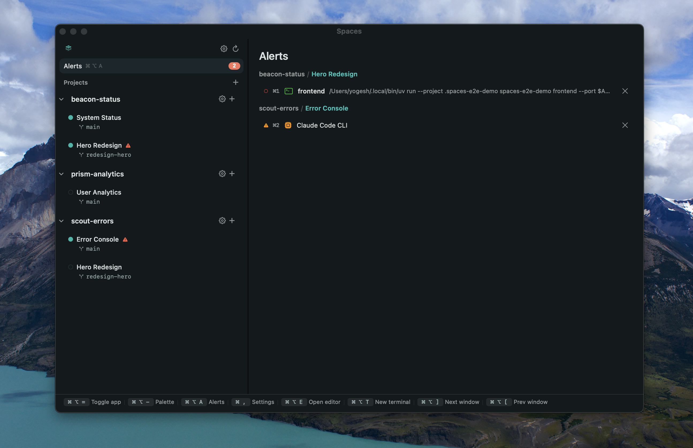
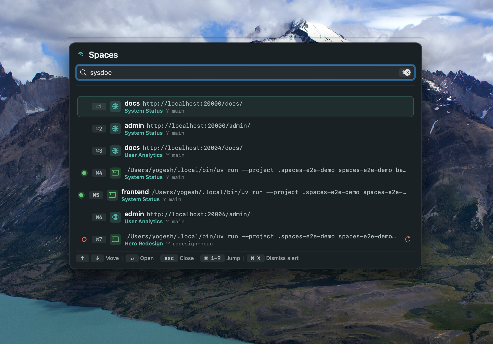
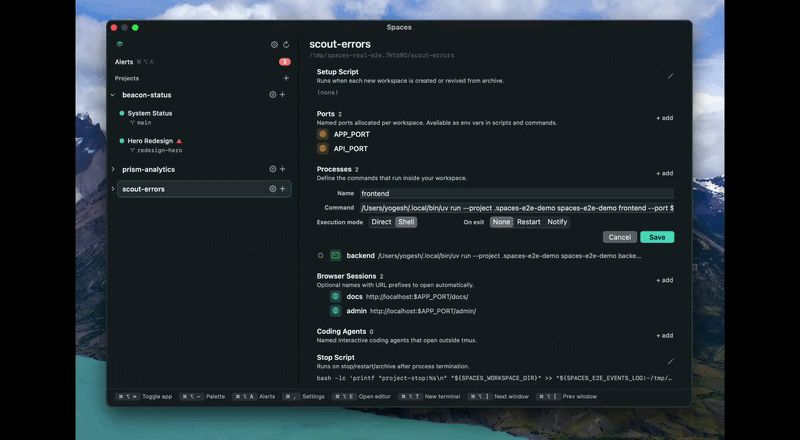
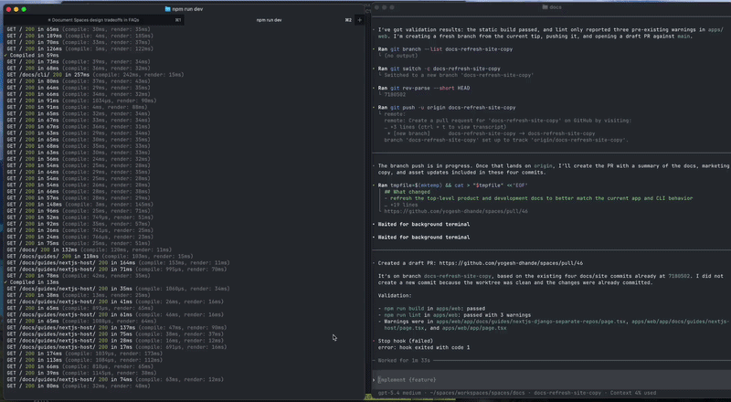
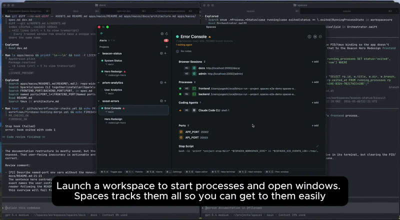

# Spaces

Multiplex your work. Not just the terminal.

Native macOS app and CLI for orchestrating parallel coding sessions. Groups terminals, editors, browser windows, and CLI coding agents (Claude Code, Codex, etc.) into per-branch workspaces with isolated ports, environment, and process trees.

[usespaces.dev](https://usespaces.dev) · [Download](https://github.com/yogesh-dhande/spaces/releases/latest) · [Docs](https://usespaces.dev/docs)




## What it does

A workspace is one feature, branch, or experiment with:

- a directory (Git worktree or separate clone)
- reserved ports exposed as named env vars (`$FRONTEND_PORT`, `$BACKEND_PORT`, ...)
- configured processes, browser URLs, and coding-agent terminals
- a tracked set of windows managed through [yabai](https://github.com/koekeishiya/yabai)

Launching a workspace starts its processes, opens its windows, and tracks them. Keyboard shortcuts focus or cycle windows scoped to the current workspace. Stopping shuts down processes and closes windows. Reopening restores state.

Worktrees, clones, and concurrent process trees stay isolated — ports are reserved by name and automatically assigned to processes when they start. You can reference them by env vars in your shell and use in browser URLs so you don't need to remember which port each service is running on.



## CLI

The `spaces` CLI is workspace-oriented and path-based. From inside a workspace directory:

```
spaces import              # register the current directory as a workspace
spaces start               # launch configured processes
spaces restart             # full stop + launch
spaces open <name>         # focus a tracked window by name
spaces signal <event>      # coding-agent lifecycle: init|start|waiting|done|exit
spaces update --notes "…"  # edit workspace metadata
```

Coding agents emit `spaces signal` events from their terminals so the GUI knows which agents are working, waiting on a human, or done. See [coding-agent integration](https://usespaces.dev/docs/coding-agents).

## Features

- Alerts view aggregating exited processes and waiting/done coding agents across all workspaces.
- Workspaces backed by Git worktrees or separate clones.
- Per-workspace named-port reservation surfaced to processes via env vars.
- Global command palette (`⌘⌥-` by default) for any window across any workspace.


- Per-workspace navigation and window cycling — focus stays inside the current workspace.


- Workspace notes — coding agents can write context (what's pending, where things broke) into a per-workspace notes field, surfaced inline in the workspace detail pane.
- One-click workspace teardown closes tracked windows and shuts down processes; relaunching restores them.
- Native AppKit binary, under 10 MB.

## How it works

- [yabai](https://github.com/koekeishiya/yabai) is the source of truth for window IDs and cross-app focus.
- Process terminals run under [tmux](https://github.com/tmux/tmux) so closing a terminal window does not kill the process; Spaces reattaches on demand when you need to look at the process output.
- Supported terminal hosts: [iTerm2](https://iterm2.com) and [Ghostty](https://ghostty.org).
- Browser sessions automate Google Chrome so you can quickly switch to view output without typing the URL or clicking through tabs.

## Requirements

- macOS 14+
- [`yabai`](https://github.com/koekeishiya/yabai), [`tmux`](https://github.com/tmux/tmux)
- [iTerm2](https://iterm2.com) or [Ghostty](https://ghostty.org)
- Google Chrome (for browser-session focus)
- Accessibility permission, granted via the in-app setup flow on first launch

## Install

Download the signed DMG from [GitHub Releases](https://github.com/yogesh-dhande/spaces/releases/latest). The installer drops `Spaces.app` and the `spaces` CLI together. In-app updates are delivered via Sparkle.

## Development

Full build, test, lint, coverage, manual E2E, and release workflows: [`dev.md`](dev.md).

## License

See [LICENSE](LICENSE).
