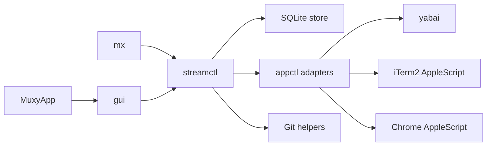

# Architecture

This document describes how Muxy is built: module boundaries, storage, runtime flows, and external integrations. User-visible behavior belongs in [spec.md](/Users/yogesh/projects/muxy/apps/macos/spec.md).

## System Overview
Muxy is a macOS Swift app and CLI built around a shared orchestration layer.

Core invariants:
- SQLite is the single source of truth for persisted model data and global preferences.
- yabai is the source of truth for window IDs and cross-app window focus.
- Workspace settings are seeded from project templates and preserved as per-workspace overrides.
- Schema changes must be additive and non-destructive.
- GUI and CLI both call the same orchestration layer instead of re-implementing behavior independently.

## Module Map

## Module Responsibilities
- `MuxyApp`: minimal app entry point that boots AppKit.
- `gui`: AppKit UI layer that renders state and dispatches actions into `streamctl`.
- `mx`: CLI entry point that exposes the same orchestrator capabilities.
- `streamctl`: core orchestration, lifecycle, validation, persistence coordination, and environment building.
- `appctl`: system adapters for shell commands, yabai, iTerm2, Chrome, and related OS integrations.

## Persistence

### Database
- Path: `~/.muxy/muxy.db`
- SQLite stores projects, workspaces, runtime state, and global settings.
- SQLite should run in WAL mode with a busy timeout so overlapping GUI, CLI, and background work does not produce avoidable lock failures.

### Migration Rules
- Migrations must preserve existing user data.
- Additive schema changes should use `CREATE TABLE IF NOT EXISTS`, `ALTER TABLE`, and backfills.
- Compatible changes must not require destructive resets.

## Data Model

### Projects
Projects persist:
- source directory and git status
- setup and stop scripts
- port definitions
- process templates
- status-check templates
- browser-session templates

### Workspaces
Workspaces persist:
- directory identity
- title, tooltip, and branch metadata
- default and archived flags
- active or inactive sidebar visibility state
- seeded per-workspace copies of launch-time settings

### Runtime Records
Runtime state persists separately from project and workspace templates:
- allocated ports
- running processes
- status-check results
- tracked windows
- tracked agent windows

This separation lets template edits coexist with current runtime state and per-workspace overrides.

## Core Flows

### Workspace Creation
1. Resolve the target project and workspace identity.
2. Create or import the workspace directory.
3. Persist the workspace and seed per-workspace settings from project templates.
4. Allocate named ports.
5. Run setup logic.

### Workspace Launch
1. Validate that the workspace is launchable.
2. Build the workspace environment, including named port variables and workspace paths.
3. Start tracked processes in dedicated terminal contexts.
4. Open tracked browser sessions.
5. Capture new windows through yabai and persist the mapping.

### Workspace Stop or Archive
1. Stop tracked processes.
2. Run the workspace stop script when appropriate.
3. Close tracked dedicated windows safely.
4. Clear runtime state.
5. Release ports.
6. Archive git worktrees when the action requires it.

### Discovery and Reconciliation
- Background worktree discovery imports valid unmanaged worktrees for known projects.
- Background reconciliation removes stale tracked windows and refreshes persisted workspace metadata from disk where needed.
- These passes should not block the main UI thread.

## Environment and Process Model
- Named port definitions are allocated per workspace and exposed as environment variables.
- Workspace processes also receive stable environment variables such as project and workspace directories.
- Setup scripts, stop scripts, process commands, and status-check commands all execute against the workspace-specific environment.

## Window and Focus Architecture
- yabai provides stable window identity and cross-app focusing.
- iTerm2 and Chrome AppleScript integrations add app-specific behavior on top of yabai, such as selecting the intended terminal session or browser target.
- Tracked windows are persisted so Muxy can refocus or clean up only the windows it owns.
- Reconciliation is required because window state can drift outside the app.

## Agent Integration
- Agent events are explicit CLI inputs that attach status to tracked workspace agent windows.
- Agent windows are stored separately from regular process windows because they carry provider and lifecycle metadata.
- Dashboard attention state is derived from runtime records rather than inferred from UI state.

## Performance Principles
- Focus and capture paths should avoid unnecessary blocking work.
- Hot paths that do not need stdout or stderr should use lightweight process spawning.
- Long-running GUI actions should execute off the main thread and reconcile state back into the UI afterward.

## External Dependencies
- macOS 14+
- yabai for window identity and focus
- iTerm2 for terminal process hosting
- Google Chrome for browser-session automation
- SQLite for local persistence
