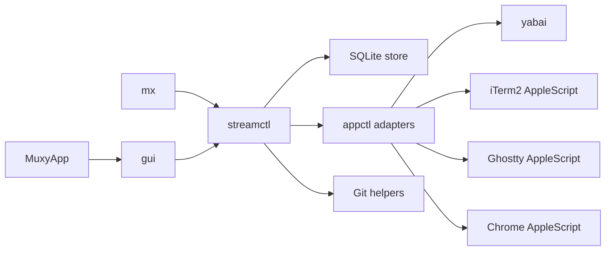

# Architecture

This document describes how Muxy is built: module boundaries, storage, runtime flows, and external integrations. User-visible behavior belongs in [spec.md](/Users/yogesh/projects/muxy/apps/macos/spec.md).

## System Overview
Muxy is a macOS Swift app and CLI built around a shared orchestration layer.

Core invariants:
- SQLite is the single source of truth for persisted model data and global preferences.
- yabai is the source of truth for window IDs and cross-app window focus.
- Workspace settings are seeded from project templates and preserved as per-workspace overrides.
- Schema changes must be additive and non-destructive.
- GUI and CLI both call the same orchestration layer instead of re-implementing behavior independently.
- `mx --json` is the supported contract for alternate clients that need Muxy-owned state or actions.
- Non-Muxy machine inspection, such as git queries or whether third-party apps are installed, remains client-owned.

## Module Map



## Module Responsibilities
- `MuxyApp`: minimal app entry point that boots AppKit.
- `gui`: AppKit UI layer that renders state and dispatches actions into `streamctl`.
- `mx`: CLI entry point that exposes the same orchestrator capabilities.
- external clients: Tauri or other frontends that invoke `mx --json` instead of reading SQLite directly.
- `streamctl`: core orchestration, lifecycle, validation, persistence coordination, and environment building.
- `appctl`: system adapters for shell commands, yabai, iTerm2, Ghostty, Chrome, and related OS integrations.

## Persistence

### Database
- Path: `~/.muxy/muxy.db`
- SQLite stores projects, workspaces, runtime state, and global settings.
- SQLite should run in WAL mode with a busy timeout so overlapping GUI, CLI, and background work does not produce avoidable lock failures.

### Migration Rules
- Migrations must preserve existing user data.
- Additive schema changes should use `CREATE TABLE IF NOT EXISTS`, `ALTER TABLE`, and backfills.
- Compatible changes must not require destructive resets.

## Data Model

### Projects
Projects persist:
- source directory and git status
- sidebar collapsed state
- setup and stop scripts
- port definitions
- process templates
- status-check templates
- browser-session templates

### Workspaces
Workspaces persist:
- directory identity
- title, tooltip, and branch metadata
- default and archived flags
- active or inactive sidebar visibility state
- explicit lifecycle state (`running` vs `stopped`)
- seeded per-workspace copies of launch-time settings

### Runtime Records
Runtime state persists separately from project and workspace templates:
- allocated ports
- running processes
- status-check results
- tracked windows
- tracked agent windows

This separation lets template edits coexist with current runtime state and per-workspace overrides.
It also lets lifecycle state stay explicit while runtime health is derived from the current runtime records.

## Core Flows

### Workspace Creation
1. Resolve the target project and workspace identity.
2. Create or import the workspace directory.
3. Persist the workspace and seed per-workspace settings from project templates.
4. Allocate named ports.
5. Run setup logic.

### Workspace Launch
1. Validate that the workspace is launchable.
2. Build the workspace environment, including named port variables and workspace paths.
3. Start tracked processes inside tmux-backed dedicated terminal contexts.
4. Open tracked browser sessions.
5. Capture new windows through yabai and persist the mapping.

### Workspace Stop or Archive
1. Stop tracked processes.
2. Run the workspace stop script when appropriate.
3. Close tracked dedicated windows safely.
4. Clear runtime state.
5. Release ports.
6. Archive git worktrees when the action requires it.

### Discovery and Reconciliation
- Background worktree discovery imports valid unmanaged worktrees for known projects.
- Background reconciliation removes stale tracked windows and refreshes persisted workspace metadata from disk where needed.
- Reconciliation may degrade runtime health, but it should not silently promote or demote workspace lifecycle state.
- Sidebar snapshot refresh can update the backing lists in the background without rebuilding the active detail pane when the current selection is still valid.
- These passes should not block the main UI thread.

## Environment and Process Model
- Named port definitions are allocated per workspace and exposed as environment variables.
- Workspace processes also receive stable environment variables such as project and workspace directories.
- Setup scripts, stop scripts, process commands, and status-check commands all execute against the workspace-specific environment.
- Process launch and terminal recovery use tmux so the process lifetime can outlive a missing terminal window and be reattached later.
- Global app settings include the selected terminal host, and both the GUI and `mx settings` read and write the same value.
- Global settings also store the shared window focus pulse color and enabled state behind window-scoped keys.
- Process templates are parsed as direct executable invocations. If a workflow needs composite shell syntax such as `cd x && y`, pipes, or redirection, it must opt in explicitly by launching a shell command such as `bash -lc "cd x && y"`.

## Window and Focus Architecture
- yabai provides stable window identity and cross-app focusing.
- iTerm2, Ghostty, and Chrome AppleScript integrations add app-specific behavior on top of yabai, such as returning launch-time terminal IDs or selecting the intended browser target.
- Terminal focus pulsing is terminal-agnostic: Muxy queries the target yabai window and briefly presents an AppKit overlay aligned to that window instead of mutating terminal-specific appearance settings.
- Tracked windows are persisted so Muxy can refocus or clean up only the windows it owns.
- Direct focus requests auto-recover stale browser-session windows by reopening and re-tracking them, while process and generic window failures still surface typed missing-window errors to the GUI.
- Window cycling is tolerant of stale tracked yabai IDs and keeps advancing until it finds the next live target.
- Reconciliation is required because window state can drift outside the app.

### Terminal Integration Contract
Muxy currently supports iTerm2 and Ghostty. A future terminal integration should plug into the same orchestration flow instead of adding one-off launch and focus paths.

Target shape:

```swift
protocol TerminalAdapter: Sendable {
    var appName: String { get }
    var bundleIdentifier: String { get }

    func isAvailable() -> Bool
    func openWindowAndRun(command: String, cwd: String, background: Bool) throws -> TerminalLaunchResult
    func focusTrackedTerminal(_ target: TerminalFocusTarget) throws -> Bool
    func listLiveTerminalIDs() throws -> Set<String>
}

struct TerminalLaunchResult: Sendable {
    let terminalID: String?
    let containerID: String?
    let fallbackYabaiWindowID: Int?
    let tabIndex: Int?
}

struct TerminalFocusTarget: Sendable {
    let terminalID: String?
    let windowID: Int?
    let tabIndex: Int?
}
```

Required behavior:
- Availability: expose a cheap `isAvailable()` check so setup validation and host selection can reject unsupported terminals early.
- Launch: create a new dedicated terminal context and run the provided command without requiring Muxy to synthesize terminal-specific shell glue outside the adapter.
- Identity: return a stable terminal-specific identifier that Muxy can persist on `RunningProcessRecord`, `WindowRecord`, and `AgentWindowRecord`.
- Focus: refocus the tracked terminal target, not just the containing yabai window, so tabbed terminals reopen the exact tracked session or surface when possible.
- Reconciliation: enumerate live terminal identifiers so Muxy can detect stale runtime records after users close windows manually.

Identity rules:
- yabai remains the source of truth for window IDs and cross-app focus.
- The terminal adapter may use a richer native identity for tracking, but that identity must be stable enough to survive normal reconciliation and refocus flows.
- If the terminal cannot provide a durable session identifier, the integration must still provide a deterministic fallback that maps back to the yabai-managed window.
- Current examples:
  `iTerm2` tracks sessions primarily by session ID and falls back to a yabai window ID.
  `Ghostty` tracks by terminal/window identity and currently resolves persisted focus through the yabai window path.

Operational requirements:
- Workspace shell launch and process launch must both work through the same adapter surface.
- Process sessions must still run under tmux so terminal closure does not kill the underlying process.
- The adapter must tolerate background launch (`background: true`) because `mx workspace up` and recovery flows may avoid stealing focus.
- The integration must not introduce window management outside yabai; any native terminal APIs are only for terminal-local actions such as opening, closing, or selecting a terminal target.

Implementation note:
- The shared launch and discovery contract now lives in `appctl` as `TerminalAdapter`, and `MuxyOrchestrator` resolves `TerminalHost` to a concrete adapter through one registry.
- The shared focus contract now also requires host-specific refocus by tracked terminal identity. iTerm2 implements that with session/tab selection, while Ghostty uses terminal identity.
- Richer iTerm2-only helpers can still exist outside the shared interface, but a new terminal should first conform to `TerminalAdapter` so launch, focus, and discovery all follow one path.

## Agent Integration
- Agent events are explicit CLI inputs that attach status to tracked workspace agent windows.
- Agent windows are stored separately from regular process windows because they carry provider and lifecycle metadata.
- Dashboard attention state is derived from runtime records rather than inferred from UI state.
- Dashboard dismissals are stored as a persisted set of attention-event IDs in SQLite global settings, then filtered in the GUI so workspace detail panes keep showing the underlying runtime rows.

## Lifecycle and Health
- Workspace lifecycle state is explicit and persisted on the workspace record.
- Runtime health is derived from runtime records, configured browser/process expectations, status-check failures, and agent waiting state.
- The GUI should render lifecycle state directly and layer runtime-health warnings on top instead of inferring lifecycle from stale runtime leftovers.

## Shortcut Architecture
- Shortcut defaults and user overrides are stored in SQLite global settings so the GUI and `mx settings` stay in sync.
- Global shortcuts use Carbon hotkey registration for actions that must work while Muxy is not frontmost.
- In-app shortcuts use an AppKit event monitor so they can respect focused text inputs and support digit-family shortcuts such as window `1` through `9`.
- Leader-based shortcuts store a suffix key spec and derive their shared modifiers from `gui_leader_hotkey`; the orchestrator resolves them to full effective hotkeys for both the GUI and CLI. Reload now uses this same leader-backed resolution path.
- Window focus shortcuts are modeled as modifier families rather than nine separate persisted bindings: one family for direct focus and one for queued multi-focus replay.
- The dashboard shares the same direct-focus shortcut family as workspace detail, and those focus shortcuts take precedence over dashboard-local create actions while the dashboard is visible.

## Performance Principles
- Focus and capture paths should avoid unnecessary blocking work.
- Hot paths that do not need stdout or stderr should use lightweight process spawning.
- Long-running GUI actions should execute off the main thread and reconcile state back into the UI afterward.

## External Client Boundary
- External clients must treat `mx --json` as the API for Muxy-owned state and mutations.
- JSON support is additive in shape evolution: new fields or commands may be added, but existing JSON fields should remain stable.
- Anything not strictly derived from Muxy persistence or orchestration stays outside the CLI contract.
- Examples of client-owned responsibilities:
  git branch discovery, tracked-file activity, and other git inspection
  checking whether iTerm2, Ghostty, tmux, or yabai are installed
  client-specific onboarding or prerequisite UX

## External Dependencies
- macOS 14+
- yabai for window identity and focus
- tmux for recoverable terminal-hosted process sessions
- iTerm2 or Ghostty for terminal process hosting
- Google Chrome for browser-session automation
- SQLite for local persistence
