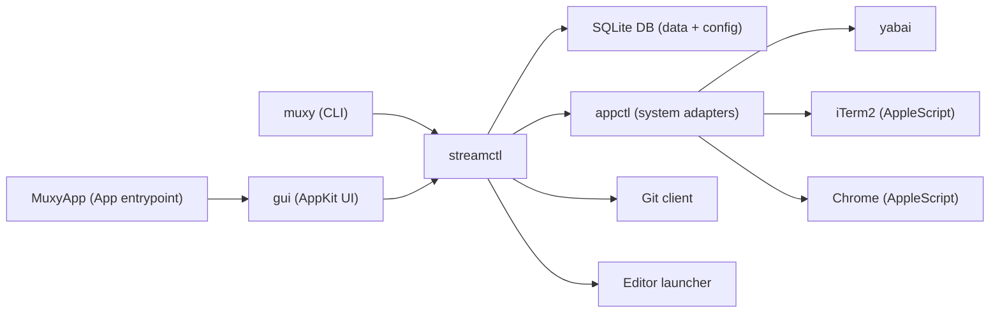
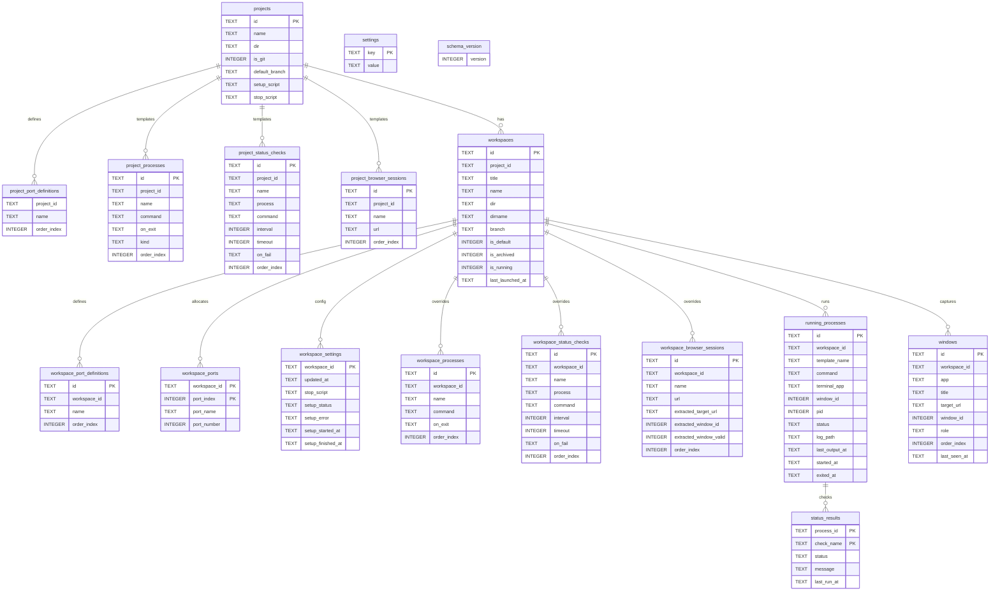
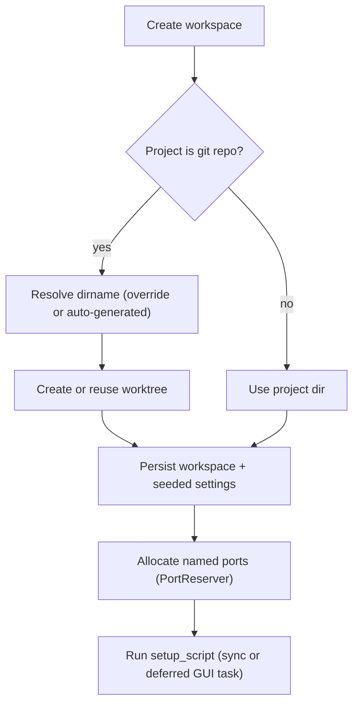
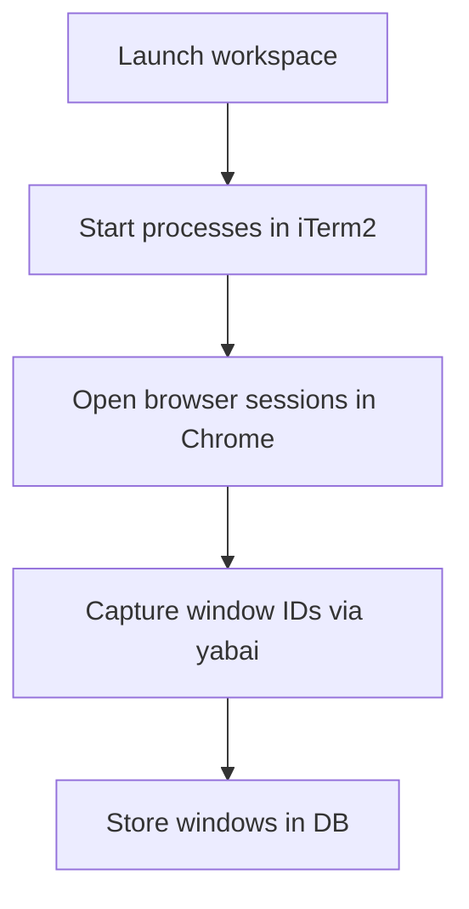
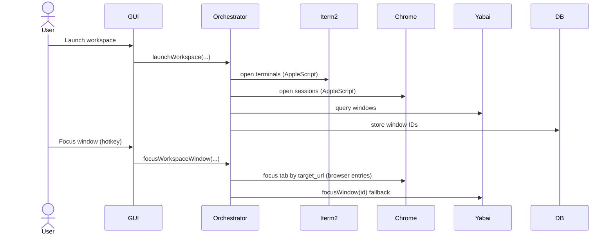

# Architecture

## Overview
`muxy` is a macOS Swift app for stream-based workspace orchestration. A stream is a captured set of windows tied to a workspace. SQLite is the single source of truth for all data including global preferences (`editor`, `port_range`).

Key invariants:
- SQLite is the single source of truth for all model data and global preferences.
- Global preferences (`editor`, `port_range`) are stored in the SQLite `settings` table.
- Workspace settings are stored in SQLite and seeded from project templates; per-workspace overrides are preserved.
- SQLite stores runtime state; schema is versioned and migrated in place with additive/non-destructive changes (currently v6).
- yabai is the source of truth for window IDs and focus.
- Stream capture must happen before a stream is shown or focused.
- Avoid window-level automation outside yabai.
- Local key monitors must not override standard text-edit shortcuts while an input has focus.

Test execution:
- Coverage runs execute Swift tests with `--parallel`.
- Coverage runs auto-detect logical CPU count for `--num-workers`.
- `MUXY_TEST_WORKERS` can override worker concurrency for local/CI stability.
- `MUXY_TEST_SKIP_BUILD=1` enables faster repeated local coverage reruns when no rebuild is needed.
- Orchestrator mock scripts cap configured test delays with `MOCK_TEST_DELAY_CAP_MS` (default `25`) to reduce artificial waiting.

## Module Map

Module responsibilities:
- `appctl`: Shell + AppleScript adapters for yabai, iTerm2, and Chrome.
- `streamctl`: Orchestration, config normalization, named port allocation (via `PortAllocator` and `PortReserver`), workspace lifecycle, and persistence.
- `gui`: AppKit UI library that calls into `streamctl`.
- `muxy`: CLI entrypoint that calls into `streamctl`.
- `MuxyApp`: GUI executable entrypoint that wires `NSApplication` to the `gui` library.

The `gui` target is the reusable UI library. `MuxyApp` is the minimal executable that boots AppKit and delegates to `gui`.

GUI interaction notes:
- Right-pane forms are hosted in a scroll view so long forms do not clip at smaller window heights.
- The "new workspace" affordance is shown in project UI only when the project is a git repository.
- Project-row plus and project-detail "New Workspace" actions open the New Workspace form.
- `cmd+n` opens the New Workspace form for the currently selected project/workspace.
- When the New Workspace form is already open, `cmd+n` creates a workspace immediately with generated defaults.
- The New Workspace form header includes a `cmd+n` quick-create hint.
- In git projects, New Workspace uses progressive disclosure: branch field first, then target/title/directory/tooltip after branch input is non-empty.
- New Project also uses progressive disclosure: source selection first, then setup script/ports/processes/browser sessions/stop script after source input is present.
- New Project and New Workspace action buttons display shortcut hints (`Return` for create, `Esc` for cancel), and `Esc` cancels either form.
- Branch and tooltip remain editable via inline labels in workspace detail, title remains editable in the workspace header, and all metadata remains editable via `mx workspace update`.
- Workspace title remains in the top header (`project / workspace`) and enters edit mode on double-click.
- Workspace detail renders inline metadata labels for branch and tooltip above lifecycle actions; double-clicking a label enters edit mode and shows per-field Save/Cancel buttons.
- Inline metadata edit mode cancels without saving when pressing `Escape` or clicking outside the field controls.
- Branch edits in workspace detail call git branch rename in the worktree (`git branch -m`) before persisting metadata.
- Newly created branches are based on the latest commit of the selected target branch.
- If the requested branch exists only on remote, the orchestrator fetches it into `refs/remotes/origin/*` before creating the worktree from `origin/<branch>`.
- If the requested branch exists locally, the local branch is used as-is (no implicit pull/rebase/merge in workspace creation).
- Workspace rows use compact card styling with status + workspace title on top.
- Project rows in the left pane show a folder icon next to the project name.
- Git workspace rows include ahead/behind commit counts vs the workspace target branch (the branch it was created from), merge-conflict status, and relative last-modified time (from latest tracked-file mtime) with tracked modified-file count.
- Workspace detail metadata shows the current branch and, when present and different, appends `forked from <target branch>`.
- Window focus shortcuts in the GUI use `cmd+1` through `cmd+9`.
- Port definitions are editable via `PortEditor` in the project detail view, the add-project form, and workspace settings.
- Status checks are configured inline under each process in the `ProcessEditor` rather than in a separate form section; the process name is implicit from the parent row.
- Browser sessions are editable via `BrowserSessionEditor` (`name` + URL prefix rows) in project detail, add-project form, and workspace settings.
- The run tab displays status check results as indented sub-rows under each process with colored dots (green/red) instead of inline badge text.
- In the run-tab Windows list, browser rows render a two-part label: browser-session name first (when configured) plus the matched URL in secondary text.
- Keyboard shortcut overrides for GUI actions are persisted in SQLite settings and editable in the GUI Settings view and CLI settings commands.
- The app provides a standard Edit menu with Copy (Cmd+C) and Select All (Cmd+A) for system clipboard support in read-only text views.

## Data Model
Global preferences (stored in SQLite `settings` table):
- Keys: `app_editor` (optional), `app_port_range_start`, `app_port_range_end`.
- Default port range: 20000–30000.
- The GUI Settings view and `mx settings set` write `editor` and `port_range`.
Project data (stored in SQLite):
- Fields: `dir`, `setup_script`, `stop_script`, `ports` (named port definitions), `processes`, `status_checks`, `browser_sessions`.
- Browser sessions include optional `name` and required URL-prefix matching at runtime.
- Script timing:
  - `setup_script` runs when a workspace is created or revived.
  - GUI creates persist workspace rows first, set setup state to `pending`, then run setup in a detached task (`running` -> `succeeded`/`failed`) so workspace rows appear without waiting for setup completion.
  - `stop_script` runs on stop/restart/archive stop phase after automatic process termination.
- Process on-exit behavior:
  - Each process has an `on_exit` setting with options: `none` (default), `restart`, `notify`.
  - When a process exits, the orchestrator detects it during status polling and applies the configured behavior.
  - `none`: Process exit is logged but no action is taken.
  - `notify`: A macOS notification is shown when the process exits.
  - `restart`: The orchestrator first terminates and waits for the tracked process PID (including runtime PID-file fallback), then restarts in the existing terminal window when safe; if shutdown does not complete, it falls back to a new terminal window.
- New projects can be created from an existing directory or by cloning a repository into a bare repo at `/Users/<username>/muxy/repos/<project_name>`.
- Removing a project clears muxy state. For git projects, muxy first removes managed worktrees with `git worktree remove --force`, then deletes related workspace directories under `/Users/<username>/muxy/workspaces`.
- The project directory is deleted only for git projects located under `/Users/<username>/muxy/repos` (plus legacy `/Users/<username>/muxy/projects`) for app-managed clones.

Workspace settings:
- Each workspace snapshots project `stop_script`, `ports` (named port definitions), `processes`, `status_checks`, and `browser_sessions` at creation.
- Snapshots are stored in the runtime DB alongside other workspace data.
- Edits to a running workspace reconcile processes and browser sessions immediately.
- Non-default workspace titles are editable after creation (GUI and CLI); default workspace title stays fixed to its initial value (`default` for directory projects, `main`/`master` for git-url imports).

Workspace identification:
- Workspaces are uniquely identified by their directory path (`dir` field).
- CLI commands accept `--dir <path>` (defaults to current directory) to identify workspaces.
- `mx workspace update [--dir <path>] [--title <title>] [--branch <branch>] [--directory-name <name>|--dirname <name>|--dir-name <name>] [--tooltip <text>|--clear-tooltip]` updates workspace metadata.
- `mx workspace up [--dir <path>] [--restart] [--tooltip [<text>]]` ensures a workspace is running and focused.
- Default `workspace up` behavior: launch when stopped; if runtime is already present, do nothing (no restart).
- `workspace up --restart` behavior: if runtime is already present, run stop then launch; if stopped, launch.
- `workspace up --tooltip [<text>]` optionally updates tooltip text when provided and displays the tooltip overlay after focus.
- `mx workspace focus` focuses the workspace window set; `--window <index>` focuses a specific tracked window.
- `mx workspace import [--dir <path>] [--title <title>] [--tooltip <text>]` registers existing git worktrees as Muxy workspaces by inferring project, branch, and title from the worktree path when a title is not provided.
- `mx discover` automatically discovers and registers all untracked worktrees for registered projects.
- Discovery-created workspaces run the same setup-script flow as any other new workspace.
- Discovery validates candidate worktrees before import (`dir` exists and is a directory, path is a git worktree, and the git common-dir resolves to the same registered project root).
- Discovery also archives non-default workspaces when their worktree is no longer valid and refreshes stored workspace branch names from current on-disk worktree metadata.
- Worktree paths for workspaces deleted from Muxy are persisted in `ignored_worktrees` and skipped by auto-discovery until the user explicitly recreates/imports that workspace.

Runtime database:
- Path: `~/.muxy/muxy.db`.
- Schema is versioned via a `schema_version` table and upgraded in place with additive migrations (no table drops). Currently at v6.
- Additive migrations explicitly backfill status-check `on_fail` columns for legacy DBs (`project_status_checks`, `workspace_status_checks`) with default `none`.
- SQLite connections enable `journal_mode=WAL`, `synchronous=NORMAL`, and a busy timeout to reduce transient lock errors when GUI/CLI background tasks overlap.

## Workspace Lifecycle
Create and prepare a workspace:

Port allocation details:
- `PortAllocator.allocatePorts` accepts `definitions: [PortDefinition]` (named port definitions from the project or workspace) instead of a fixed count.
- Ports are allocated at workspace creation and persisted in the `workspace_ports` table; they are available immediately (including during the setup script).
- `PortReserver` (singleton) re-reserves allocated ports via OS sockets on app launch so they cannot be claimed by other processes between allocation and use.
- Ports are released when a workspace is archived.
- Port definitions are configured at the project level in SQLite (stored in `project_port_definitions`) and inherited by workspaces; workspaces can override definitions.
- Named ports appear as env vars in setup scripts, stop scripts, process commands, and status check commands (e.g. `$FRONTEND_PORT`, `$API_PORT`).
- `buildWorkspaceEnv` uses named port keys from definitions instead of anonymous `PORT0`, `PORT1`, etc.
- `buildWorkspaceEnv` sets `MUXY_WORKSPACE_DIR` (workspace directory) and `MUXY_PROJECT_DIR` (project directory) for every workspace process.

Launch and capture windows:

Stop or archive:
- Stop: signal each tracked process group (`SIGINT` then `SIGTERM`), then run workspace `stop_script` (if set), then close tracked windows and clear runtime process state.
- If the workspace directory is missing at stop time, stop still succeeds, runtime/window state is cleaned up, and the stop script is skipped (GUI/CLI show an informational notice).
- Archive: reuse stop flow, run `git worktree remove --force` for git projects, release ports.
- If the git worktree directory is already missing, archive still succeeds and workspace metadata is archived.
- Archive never deletes the project directory for non-git projects.
- Browser safety invariant: stop/restart/settings reconciliation closes tracked Chrome tabs by URL prefix, never full Chrome windows.

Run/recovery semantics:
- `launchWorkspace` is only for stopped workspaces. If `is_running` is set or runtime indicators already exist (`running_processes`/`windows` rows), launch fails with "use restart".
- Launch waits for setup completion when setup state is `pending`/`running`; if setup state is `failed`, launch fails with the setup error message.
- `restartWorkspace` is the explicit recovery path and always performs stop then launch for the same workspace.
- `upWorkspace` is idempotent "ensure running": launch when stopped; if runtime is already present, either no-op (default) or restart when `restartIfRunning` is true.
- Workspace lifecycle actions are guarded by a per-workspace in-flight lock so overlapping launch/stop/restart/archive actions cannot run concurrently for the same workspace.
- GUI run controls are state-aware: show `Launch` when stopped and `Restart` when running.
- AppKit launch/restart/stop/archive button handlers dispatch lifecycle work in detached background tasks (fresh orchestrator/store instances) so long-running automation does not block the UI event loop.
- AppKit periodic process monitoring also runs in detached background tasks and now executes interval-based status checks for running workspaces, persisting fresh `status_results` and triggering `on_fail` actions (including restart) without requiring the run tab to be rendered.
- Add-workspace (`cmd+n`) UX uses local branch refs and cached workspace names for immediate form display and quick-create defaults; non-blocking branch-option refresh runs in a detached task, and branch-first progressive disclosure keeps initial render minimal.

Degraded runtime edge cases and handling:
- `is_running` can drift from real OS state because users can close windows/processes manually.
- Restart is the user-visible "bring everything back" action for partial or stale runtime state.
- Chrome session discovery and focus are URL-prefix based end-to-end; title-based fallback matching is intentionally avoided to prevent binding sessions to the wrong tab.
- On launch/restart, muxy reuses existing Chrome tabs whose URLs match configured browser-session prefixes and tracks all matching tabs for workspace cycling.
- On launch/restart, muxy may extract one matching tab per browser session into a dedicated Chrome window and persist that extracted mapping (`extracted_target_url`, `extracted_window_id`, `extracted_window_valid`).
- Browser windows store an optional `target_url`; when focusing browser entries, muxy uses AppleScript to activate the matching tab (including when multiple tracked targets share one Chrome window) before falling back to raw window focus.
- Browser focus first attempts extracted-window `yabai` focus when a valid extracted mapping exists; if the window is missing or active-tab verification fails, the mapping is marked stale (`extracted_window_valid=0`) and focus falls back to indexed-tab/URL-prefix paths without automatic re-extraction.
- If a Chrome window is tracked both as targeted browser tabs and as an untargeted browser row, untargeted rows are filtered from workspace window navigation/listing to keep forward/backward traversal deterministic.
- Workspace window navigation/listing rebuilds browser rows from live Chrome tab scans with a configurable debounce interval (default: 10 seconds, see `PollingConstants.browserWindowScanDebounceInterval`) per `(workspace_id, resolved browser-session prefixes)` key, including every tab whose URL starts with any configured browser-session URL (deduplicated by `window_id + tab URL`); tabs with missing URLs are skipped.
- Browser focus for live-scanned rows targets cached `(window_id + tab_index)` first, then verifies the focused active tab URL against workspace prefixes, refreshes the live scan once on mismatch, and falls back to URL matching if needed.
- Window-scoped Chrome AppleScript operations compare `window_id` as string for reliable tab focus/close matching.
- Live browser rows are ordered deterministically by browser-session prefix order and then tab URL so `cmd+<n>` shortcut indices stay aligned with the on-screen list even as Chrome window z-order changes.
- Window cycling tracks a workspace-local navigation pointer, and Chrome row resolution uses the frontmost active tab URL with prefix checks to keep next/previous stable.
- Window cycling order is role-grouped for consistency: all browser tabs first, then terminal windows, then other window roles. Relative navigation prefers the remembered workspace-local index once cycling begins.
- Global next/previous shortcut routing resolves focused Chrome windows by `(window_id + active tab URL prefix)` so one reused Chrome window can be safely tracked by multiple workspaces without selecting the wrong workspace.
- Optional diagnostics: `DEBUG=1` logs browser tab scan count/match/elapsed and browser focus-path timing, including indexed verification, cache hit/miss, refresh, and fallback decisions.
- Performance benchmarking: `OrchestratorTests.testBenchmarkChromeIndexedTabFocusVsYabaiWindowFocusForExtractedTabs` uses calibrated delays (~52ms tab-index focus + ~38ms active-tab verify vs ~42ms extracted-window yabai focus) and currently reports break-even at about 15 switches after extraction setup.
- Terminal capture uses both yabai snapshot-diff and running-process window IDs to avoid dropping terminals when window discovery lags.
- Editor launch is user-invoked (GUI action or global shortcut) and is not tracked in workspace window cycling.
- Window IDs can become stale across app/desktop changes; stale rows are pruned during reconciliation paths.
- Background refresh also re-reads live yabai title/app metadata for terminal rows that are not currently owned by any running process record, so fallback terminal labels remain current.
- The GUI starts a periodic detached utility-priority refresh loop (`refreshAllWorkspaceWindows`) so non-archived workspace window rows are reconciled in the background on a fixed interval (`PollingConstants.workspaceWindowRefreshInterval`).
- Each background refresh pass uses a fresh orchestrator/store instance for thread-safe off-main reconciliation and keeps AppKit interaction responsive while refresh is in-flight.
- UI data is reloaded after successful periodic refresh passes only when the user is not actively editing text fields (to avoid interrupting unsaved form edits).
- The GUI also runs periodic worktree discovery (`scanAndCreateWorkspacesFromWorktrees`) in a detached utility task using `PollingConstants.worktreeDiscoveryInterval`; newly discovered worktrees are registered as workspaces and trigger project setup scripts.
- `refreshAllWorkspaceWindows` returns a `RefreshResult` containing `didMutateDB` (whether windows were pruned or workspace running flags changed) and `trackedWindowCounts` (per-workspace tracked window counts including live browser scan results); the GUI compares both against the previous snapshot and skips `reloadData()` entirely when nothing changed, avoiding unnecessary UI rebuilds.

## Window Capture and Focus

Terminal windows opened from the GUI (Open Terminal) are captured via yabai and stored in the
windows table so they participate in workspace window cycling.

## Polling Constants
All periodic polling intervals are centralized in `PollingConstants.swift` for easy configuration:

- **Browser window scan debounce**: `browserWindowScanDebounceInterval` = 10 seconds
  - Controls how frequently Chrome tab scans are performed per workspace/browser-session-prefix combination
  - Used to debounce expensive Chrome AppleScript queries during window navigation and focus operations

- **Workspace window refresh interval**: `workspaceWindowRefreshInterval` = 10 seconds
  - Controls how frequently the GUI background reconciliation pass refreshes stored workspace windows

- **Worktree discovery interval**: `worktreeDiscoveryInterval` = 30 seconds
  - Controls how frequently the GUI background discovery pass scans git projects for new unmanaged worktrees
  - New worktrees discovered in this pass are registered as workspaces and run project setup scripts

- **Process monitor interval**: `processStatusCheckInterval` = 5 seconds
  - Controls how frequently the periodic background process monitor checks process state and due status checks

- **Status check default interval**: `statusCheckDefaultInterval` = 60 seconds
  - Default interval between status check executions for process health monitoring
  - User-configurable per status check in the GUI

- **Status check default timeout**: `statusCheckDefaultTimeout` = 5 seconds
  - Default timeout for status check command execution
  - User-configurable per status check in the GUI

These constants are referenced throughout the codebase to ensure consistent polling behavior.

## Versioning and Auto-Update
- `AppVersion.current` in `streamctl/AppVersion.swift` is the single source of truth for the version string.
- `Info.plist` contains `CFBundleShortVersionString`, `CFBundleVersion`, and `CFBundleIdentifier`.
- `UpdateChecker` (actor in `gui`) queries `https://api.github.com/repos/yogesh-dhande/agentmux/releases/latest` for new versions.
  - Checks on app launch and every 4 hours.
  - Caches results to avoid redundant API calls.
  - Compares semver tag against `AppVersion.current`.
- `AppUpdater` handles download, extraction, binary replacement, and relaunch.
  - Downloads the `.zip` release asset from GitHub.
  - Extracts via `ditto`, replaces the running executable, and relaunches.
  - Creates a backup before replacement; restores on failure.
- The app menu includes "Check for Updates..." which shows "Up to Date" or "Update Available: vX.Y.Z" based on the last check.
- CLI: `mx --version` prints the current version.

## External Dependencies
- macOS 14+
- `yabai` for window IDs, focus, and display/space metadata
- iTerm2 for terminal processes
- Google Chrome for browser sessions
- SQLite3 for runtime persistence and global preferences

### yabai Dependency Analysis

Muxy uses 7 distinct yabai commands across 35+ call sites via `YabaiAdapter`:

| Command | Purpose | Call Sites |
|---------|---------|------------|
| `query --windows` | List all windows (snapshot-diff capture) | ~13 |
| `query --windows --window` | Get focused window | ~5 |
| `query --windows --space <N>` | List windows in a space | ~1 |
| `query --spaces` | List spaces across displays | 1 |
| `query --displays` | List all displays | 1 |
| `window --focus <ID>` | Focus a window by ID | 2 |
| `window --close <ID>` | Close a window by ID | 1 |

**Core usage patterns:**
1. **Snapshot-diff capture** — list windows before an action, list after, diff to find newly created windows. Used for terminal, editor, and browser window capture during launch.
2. **Window focus fallback** — after AppleScript-based browser focus attempts, yabai provides reliable cross-app window-level focus.
3. **Window cleanup** — close tracked non-browser windows on workspace stop.
4. **Space/display enumeration** — populate configuration UI dropdowns.

**Replacement feasibility (tested against real system):**

`CGWindowListCopyWindowInfo` returns the same integer window IDs as yabai (`kCGWindowNumber` == yabai `id`), so the snapshot-diff pattern could use CGWindowList for discovery. However, CGWindowList lacks `title`, `space`, `display`, `is-visible`, `is-sticky`, and `is-native-fullscreen` fields that yabai provides.

| Feature | macOS API Alternative | Viable? |
|---------|----------------------|---------|
| Window discovery/listing | `CGWindowListCopyWindowInfo` | Partial — IDs match, but no title/space/display |
| App-level focus | `NSRunningApplication.activate()` | Yes — but focuses app, not specific window |
| Window-level focus | Accessibility API (AXUIElement raise) | Unreliable across apps; yabai is the only reliable option |
| Space assignment | None (private SPI only) | No public API |
| Display assignment | Geometry matching via `kCGWindowBounds` | Fragile workaround |
| Window close | AX close button / AppleScript | Feasible but more complex |
| Window title | AX `kAXTitleAttribute` | Requires Accessibility permission per app |

**Conclusion:** yabai cannot be fully replaced with public macOS APIs. The critical gaps are window-level focus (vs app-level), space index assignment, and reliable cross-app window title access. The query side could be partially replaced by CGWindowList for ID-based snapshot-diff, but mutations (`--focus`, `--close`) and space/display metadata have no equivalent.
