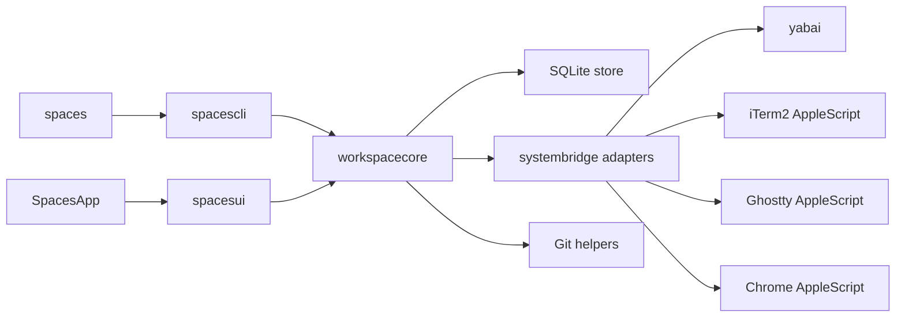
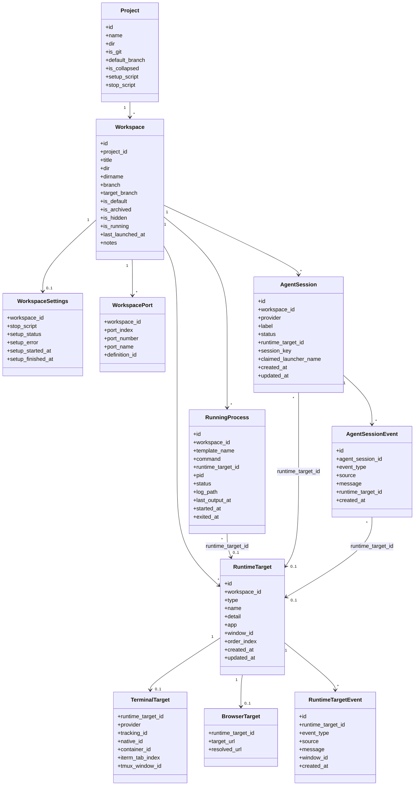

# Architecture

This document describes how Spaces is built and why: module boundaries, storage, runtime flows, external integrations, and the rationale behind the major design choices. User-visible behavior belongs in [spec.md](../spec.md). Built-in terminal integration details live in [terminal.md](terminal.md).

## System Overview
Spaces is a macOS Swift app and CLI built around a shared orchestration layer.

Core invariants:
- SQLite is the single source of truth for persisted model data and global preferences.
- yabai is the source of truth for window IDs and cross-app window focus.
- Workspace settings are seeded from project templates and preserved as per-workspace overrides.
- Schema changes must be additive and non-destructive.
- GUI and CLI both call the same orchestration layer instead of re-implementing behavior independently.

## Module Map



## Module Responsibilities
- `SpacesApp`: minimal app entry point that boots AppKit.
- `spacesui`: AppKit UI layer that renders state and dispatches actions into `workspacecore`. Shared visual language lives in `Theme.swift` (brand color tokens mirroring `apps/web/app/globals.css`) and `RowPrimitives.swift` (status dot, type icon tile, shortcut/project/branch chips, `ColoredBackgroundView` helper). The workspace detail pane is a single scrollable `NSStackView`; it stacks the header, directory meta row, inline notes editor, and five configuration sections (Processes, Browser sessions, Coding agents, Named ports, Stop script) in order. Each section is a self-contained class (e.g. `ProcessesSection.swift`) that owns its transient form state, swaps each row between collapsed and editing subviews via `NSAnimationContext`, and publishes commits through an `onCommit` closure that the host bridges to `orchestrator.updateWorkspaceSettings`. Named-port rows render the configured env-var name plus the currently reserved port number from `workspace_ports`, mirroring how browser-session rows separate configured input from resolved display output. The `⋯` overflow menu is built by the static `AppKitController.makeWorkspaceOverflowMenu(workspaceID:path:target:)`, which emits a stock `NSMenu` whose path-based items forward to `copyDirectoryPath(_:)` and `revealDirectoryInFinder(_:)`, while workspace actions use the same shared `senderIdentifier(_:)` helper for `NSMenuItem` and `NSControl` senders. Update delivery also lives here: `AppKitController` owns a programmatic `SPUStandardUpdaterController` from Sparkle, wires the application menu’s `Check for Updates...` item directly to Sparkle, and relies on one stable appcast feed configured in the app bundle metadata. That stable feed serves one universal Sparkle archive and one manual-download DMG rather than arch-specific release artifacts.
- `spaces`: executable shim that boots the declarative CLI parser.
- `spacescli`: declarative `swift-argument-parser` command tree for `spaces`, including command help, leaf validation, translation from CLI inputs into orchestration calls, and the first tmux-free `spaces terminal` session controls for `command`, `send`, `key`, `tail`, `list`, `show`, and `takeover`.
- `spacesterminalcore`: tmux-free terminal runtime primitives, PTY-session metadata persistence, per-session file layout, output tailing, backend selection, and the backend runtime interface used by `spaces terminal command|send|tail|list`.
- `spacesterminalghostty`: embedded libghostty integration, including local artifact discovery, runtime callbacks, control-plane bridging, and renderer availability against the session's declared backend.
- `spacesterminalruntime`: backend orchestration layer that is allowed to depend on both `spacesterminalcore` and `spacesterminalghostty`. It selects the concrete runtime for each terminal session so the core session model stays decoupled from any one renderer or PTY engine.
- `spacesterminalui`: native terminal-session window controllers owned by the Spaces app. The current slice opens one or more windows for a session ID, registers each local window as an owner or viewer client, and keeps those local windows attached through the same per-session control socket and attachment records used by the CLI.
- `workspacecore`: core orchestration, lifecycle, validation, persistence coordination, environment building, and the shared `AppVersion` constants consumed by both the GUI and CLI. Those constants are generated from `apps/macos/AppVersion.plist`, which is also used to generate the app bundle `Info.plist`.
- `systembridge`: system adapters for shell commands, yabai, iTerm2, Ghostty, Chrome, and related OS integrations.

### Terminal Session Slice
- The first tmux-free terminal slice is intentionally session-host first: the PTY runtime owns process lifetime and attachment state, while the app and CLI attach as clients.
- `spaces terminal command` starts a background PTY-backed session through `spacesterminalcore`, waits for the persisted session host boundary to exist, and then asks the running Spaces app to open an owner window for that session ID.
- `spaces terminal show` asks the running Spaces app to open a native session window for a specific session ID through distributed notifications.
- Each session is addressed by a stable session ID and stored under `~/.spaces/terminal/sessions/<session-id>/`.
- `metadata.json` stores launch inputs including the declared backend, `state.json` stores live runtime state including the active backend, `clients.json` and `attachments.json` store client identity and owner or viewer attachment history, `control.sock` accepts local owner commands through a small request/response protocol for text send, named-key send, takeover, and termination, and `output.log` records terminal output for `spaces terminal tail`.
- `control.sock` is also the geometry boundary for option-1 clients. Owner attachments send terminal resize commands with columns and rows so the PTY host can keep TUIs aligned with the active client window size.
- `TerminalSessionClientTransport` is the app-side client seam for this session-host model. The current local transport prefers an explicit host/client protocol over `control.sock` for attach, detach, snapshot, output-size, and output-chunk reads, falls back to persisted session files when the host is unavailable, and emits client events from a mix of local notifications and filesystem watches on the session directory so `script-pty` windows and headless clients can react to host-side updates without owning the PTY runtime.
- `TerminalSessionHostConnection` is the protocol-level boundary under that transport. The current implementation ships a local Unix-socket connection, but the transport no longer depends on `TerminalControlClient` directly, which keeps the client contract reusable for future remote-host and mobile attach paths.
- `TerminalSessionHostConnection` also ships a TCP-backed variant with request-level auth-token injection. That keeps the app-side client contract identical whether it is talking to a local `control.sock` host, a local TCP bridge, or a future remote session host.
- The terminal host/client protocol is versioned in-band. Each request carries `protocolVersion` plus `minimumSupportedProtocolVersion`, and each response returns the server protocol version, minimum supported version, optional structured error code, and optional `hello` capability payload. That keeps the existing local socket path backward compatible while giving off-box clients a negotiation point before remote Linux support exists.
- `spaces terminal proxy` is the first network-facing session bridge. It forwards the explicit host/client protocol from one local session socket onto a TCP listener with a shared auth token, which gives mobile and off-box clients a transport shape that does not depend on direct filesystem access to the session directory.
- `TerminalSessionRunner` in `spacesterminalruntime` selects a concrete backend runtime for each session. The current implementation ships `ScriptPTYTerminalSessionRuntime` for `script-pty` and `GhosttyEmbeddedTerminalSessionRuntime` for `ghostty-embedded`.
- `ScriptPTYTerminalSessionRuntime` drains unread PTY bytes before shutdown and finalizes fast command exits through `Process.terminationHandler` so `output.log` captures the last frame of short-lived commands and `state.json` does not stay pinned to `running` after the child is already gone.
- The current built-in Spaces-hosted terminal, process, and coding-agent flows default to `script-pty` so the PTY runtime survives Spaces app restart and later clients can reattach by session ID.
- `GhosttyEmbeddedSessionHost` in `spacesterminalghostty` is the first session host layer for `ghostty-embedded`. It owns one libghostty-backed session runtime, the local control socket, output logging, runtime-state refresh, and the active owner client ID for that session.
- `GhosttyEmbeddedSessionHost` coalesces `state.json` writes so steady-state sessions refresh runtime state on change and on a light heartbeat instead of rewriting session metadata every timer tick.
- `GhosttyEmbeddedSessionHost` forces one immediate layout + surface refresh when an owner surface is attached to a window, and the live view coalesces later refresh requests from both local input and fresh PTY output so first-open prompts and shell output paint without depending on a later reattach.
- `GhosttySDKCapabilityProbe` records the current public Ghostty SDK boundary in code. The bundled SDK exposes launch-owned surface configuration plus raw input, output callbacks, cell readback, and TTY inspection, but it does not expose an attach/adopt API for an externally owned PTY or session stream. That keeps libghostty viable as a local renderer while ruling it out as the current option-1 shared-session client renderer.
- The current native window keeps one shared window-controller shell but swaps its body by backend: `script-pty` uses a transport-backed terminal canvas client that renders a local `TerminalScreenBuffer` from raw output chunks and sends direct keyboard input, paste, and named keys through the session transport, while `ghostty-embedded` keeps the active owner window on the session host's libghostty surface. Passive viewer windows stay read-only and prefer a rendered snapshot of that shared libghostty surface; they fall back to chunk-backed canvas rendering only when no inspectable surface is available in-process.
- `TerminalSessionWindowController` keeps the libghostty owner path focused on the embedded surface itself while viewer windows stay passive and expose takeover without rehosting the session. Viewer metadata remains available in controller state for takeover and debugging, but healthy viewer chrome collapses down to terminal content plus the takeover affordance.
- `TerminalSessionWindowController` treats the live owner path as notification-first. Owner windows still keep a slower safety poll, while viewer and fallback windows stay on the faster refresh cadence because viewer snapshots and tailed output are both polled from shared session state rather than driven by direct input focus.
- `TerminalSessionWindowController` performs one synchronous render pass during construction, then starts its periodic refresh loop only when `show()` actually presents the window, which avoids redundant loop churn during summon and reopen.
- `TerminalSessionWindowController` does not permanently trust the backend snapshot it observed during construction. If `metadata.json` becomes readable only after the controller exists, the next refresh upgrades the controller to the persisted backend and renderer mode instead of leaving that window stuck on fallback `script-pty` chrome for the rest of its lifetime.
- `TerminalSessionWindowController` suppresses inline non-error send-status text on the active Ghostty owner path because direct typing into the live terminal surface is the interaction model there; inline status remains available for fallback flows and for real errors.
- `TerminalSessionWindowController.show()` treats an already visible window as a reuse path: it leaves the persisted frame alone, keeps the existing refresh task alive, and just brings the live terminal window forward before refreshing visible state.
- `TerminalSessionWindowController` keeps the owner Ghostty window chrome compact by hiding renderer diagnostics on the active owner path while retaining richer runtime and ownership metadata for viewer and fallback states.
- `TerminalSessionWindowController` uses a collapsing header stack so the active owner path can hide redundant in-window session identifiers and empty status rows while viewer and fallback windows continue to expose those diagnostics.
- The window shell summarizes process launch commands before rendering them into the header so large exported environment wrappers do not force process windows wider than the visible screen.
- `GhosttyEmbeddedAppService` routes libghostty runtime actions back to the owning surface so `GhosttyEmbeddedSessionHost` can track live session metadata such as title and working directory and expose that state to the shared window shell.
- `GhosttyEmbeddedTerminalView` caches surface geometry, focus, and occlusion state before calling libghostty so routine AppKit layout churn does not spam redundant surface updates during resize, focus, and window moves.
- `AppKitController` keeps a lightweight controller registry keyed by session ID and drops closed controllers so reopening a terminal window cleanly reattaches a fresh local client to the existing session host.
- Workspace-terminal opens triggered from the app run through a detached store and orchestrator snapshot instead of calling `WorkspaceOrchestrator.openWorkspaceTerminal` on the main thread. The built-in host still waits for `control.sock` plus `state.json` before it records the new terminal row, but that readiness wait happens off-main so the app window remains responsive while the embedded session boots.
- `TerminalSessionWindowController` is an attachable client rather than the session owner. Owner or viewer status is derived from persisted attachment records, `script-pty` owner windows terminate the session on explicit close but not on app termination, viewer windows expose takeover against the same control socket path used by the CLI, the terminal canvas itself is the first-responder input target for transport-backed sessions, and the controller refreshes from transport snapshots rather than reading session files ad hoc.
- The shared transcript client uses `TransportTerminalTranscriptView` as both the renderer surface and the owner-input target. That view handles direct key forwarding, extended function-key and modifier sequences, classic and SGR mouse input, alternate-scroll wheel translation, focus-report reporting, and IME composition by bridging AppKit text-input callbacks back into the same host transport used for ordinary typed text.
- `TransportTerminalTranscriptView` also treats attributed `.link` ranges as command-click targets, so the `OSC 8` hyperlink state preserved by `TerminalScreenBuffer` is actionable in the shared transcript client instead of only affecting text attributes.
- The shared transcript controller captures both bottom-offset and top-visible-content anchors before rebuilding output, then restores the viewport against the same visible transcript content after refresh so long append batches do not move a user-scrolled view to a different region of history.
- When the shared transcript view records recent local scroll interaction away from the bottom, passive output refresh uses a slower coalescing interval until that interaction quiets down. That keeps active scrollback browsing readable under high output churn without changing pinned-to-bottom follow behavior.
- When a live built-in process window is focused through the normal workspace flow, `WorkspaceOrchestrator` first uses yabai to bring the native window forward and then sends a lightweight in-process session-focus IPC so `AppKitController` can reassert first-responder focus onto the owner libghostty surface instead of reopening the session.
- `WorkspaceOrchestrator` uses two built-in readiness policies. Ad hoc built-in terminal opens still wait for a settled runtime state so the session handle can carry a stable child PID when it appears quickly. Configured workspace-process launches return as soon as the built-in control socket plus `state.json` exist, then reconcile late child PID updates from the session runtime instead of holding the whole workspace launch on the extra settle window.
- Built-in `Spaces` process and terminal focus prefers the tracked live yabai window ID when one exists, falls back to reopening the session by stable session ID only when no live native window can be focused, and either clears the stale native window binding or replaces it with the freshly observed yabai window ID during that same reopen path so the next focus targets the live window without waiting for a later refresh pass.
- When the running app already holds exactly one live owner controller for a built-in session, `AppKitController` reuses that in-memory owner controller directly during focus IPC instead of reloading attachment state from disk before it reasserts owner-surface focus.
- `spacesterminalghostty` owns path and resource discovery for a branch-local `GhosttyKit.xcframework` plus Ghostty resource bundle, the `ghostty-embedded` session runtime, the raw-output callback bridge into `output.log`, and the raw-input path used by `spaces terminal send` and `spaces terminal key`.
- The app-hosted `ghostty-embedded` path keeps `control.sock`, `output.log`, `clients.json`, and `attachments.json` as the session boundary so later owner or viewer attachment can fan out beyond the local macOS window instead of baking control into one view.
- `AppKitController` distinguishes built-in `Spaces` terminal opens and focuses from external-app window actions. External browsers, editors, Finder windows, Ghostty, and iTerm2 still use the hide-after-success path, but built-in `Spaces` terminal windows stay visible alongside the main app so focusing or opening them does not hide the window that was just summoned.
- Owner or viewer state is persisted in `attachments.json`. Both CLI and UI clients identify themselves so the session host can reject input from passive viewer windows, accept ownership transfer through `spaces terminal takeover`, and fall back to direct attachment persistence when takeover is requested after the runtime has already exited.
- The current option-1 boundary is already enough for a mobile-shaped client proof: a non-AppKit client can attach through the explicit session socket protocol, load a replay snapshot, stream incremental terminal output by byte offset, and send ownership-aware text or key input through the same host boundary without mutating session files directly.
- The current terminal slice is backend-explicit: `script-pty` and `ghostty-embedded` are both supported runtime backends. `script-pty` is the default built-in host path because it already matches the persistent session-host model, while `ghostty-embedded` remains available for local embedded rendering experiments and explicit backend selection.
- Terminal profiling treats `ghostty-embedded` as the local Mac benchmark backend. The compare harness runs the built-in profile and stress suites against both built-in backends so shared-session renderer work can be measured against the existing local libghostty path.
- The shared-session macOS client keeps its own incremental `TerminalScreenBuffer` over host `read_output_chunk` responses. That lets the fallback renderer rebuild cursor-aware visible terminal state from raw persisted bytes instead of repainting only from tailed plain-text snapshots.
- `TerminalRenderedScreen` carries whether the local replay is on the primary or alternate screen. `TerminalSessionWindowController` uses that signal to preserve selection and viewport state for ordinary output growth, but to clear selection and reset the scroll origin when a full-screen alternate-screen app swaps in or out.
- `ScriptPTYTerminalSessionRuntime` seeds the wrapped shell with a default PTY size before any AppKit client attaches. Later owner-window resize messages still take over immediately, but the default launch geometry prevents TUIs like `codex` from seeing a `0x0` terminal and painting a broken first frame before the first live resize arrives.
- `ScriptPTYTerminalSessionRuntime` also answers a small set of terminal queries directly from the PTY host boundary. The current responder covers cursor-position, primary/secondary device attributes, tracked private-mode reports, live terminal-size reports, terminal foreground/background color queries, palette-color probes, and xterm title/icon-label report queries sourced from observed `OSC 0`, `OSC 1`, and `OSC 2` state, so TUI startup handshakes can complete even when no libghostty surface is attached to the session host.
- `TerminalScreenBuffer` is the shared-session terminal state source of truth. It keeps a plain-text projection for transcript heuristics and tests, but it also preserves per-cell ANSI style state, cursor visibility, primary-screen scrollback, alternate-screen state, mouse/alternate-scroll modes, and bracketed-paste mode so the AppKit shared-session surface can render colors, full-screen TUI behavior, and terminal-aware clipboard input without depending on libghostty.
- `TerminalScreenBuffer` also preserves xterm cursor-style state from `DECSCUSR`, and the shared AppKit renderer consumes that state to draw underline and beam cursors as overlays instead of flattening every visible cursor into the same inverted block.
- `TerminalScreenBuffer` also preserves terminal-driven title state from `OSC 0`, `OSC 1`, and `OSC 2`, and the shared window-controller shell uses that buffered title for `script-pty` owner and viewer windows so transport-backed sessions follow the same title updates as live local terminals.
- `TerminalScreenBuffer` snapshots the full primary-screen cursor/save-cursor/scroll-region state before entering alternate screen, then restores that state on exit so a full-screen TUI round trip does not lose the primary screen’s cursor-restoration or region-scrolling behavior.
- `TerminalScreenBuffer` also treats xterm private mode `?1048` as an explicit save/restore cursor flow, so TUIs that save cursor state without swapping screens still land back on the correct primary-screen cell when they restore it.
- `TerminalOutputTail` keeps a separate fast-path heuristic for transcript reads. Besides plain append-only logs, it recognizes redraw boundaries such as cursor-home plus erase-display sequences, which lets `codex`-style TUI transcripts fall back to a small rendered suffix instead of replaying the full `output.log` on every tail request.
- This slice does not yet replace workspace-managed tmux process sessions or external terminal hosts.

## Persistence

### Database
- Path: `~/.spaces/spaces.db`
- SQLite stores projects, workspaces, runtime state, and global settings.
- SQLite should run in WAL mode with a busy timeout so overlapping GUI, CLI, and background work does not produce avoidable lock failures.
- `migration_state.current_version` records the canonical schema version. The active schema is version `1`.
- `PRAGMA user_version` is not used by Spaces for migration control; if present, treat it as informational only and keep it aligned with `migration_state` when inspecting or repairing a database manually.

### Migration Rules
- Fresh installs create the latest schema directly and record the current schema version.
- Existing installs should migrate in ordered `N -> N+1` steps until they reach the current schema version.
- Each migration step should run inside `BEGIN IMMEDIATE ... COMMIT`, update `migration_state` in the same transaction, and roll back on failure.
- Compatible schema changes should use additive techniques such as `CREATE TABLE IF NOT EXISTS`, `ALTER TABLE`, backfills, indexes, and table rebuilds with copy when SQLite requires them.
- Store startup validates `migration_state.current_version` against the canonical schema version and fails closed when they do not match.
- Startup runs `PRAGMA integrity_check` and fails if validation does not return `ok`.

## Data Model



### Projects
Projects persist:
- opaque project identity separate from filesystem paths
- source directory and git status
- sidebar collapsed state
- setup and stop scripts
- port definitions
- process templates

Managed clone directories under `~/spaces/repos` and managed worktree roots under `~/spaces/workspaces` must be keyed by project identity rather than project name so cleanup, retries, and same-name projects cannot collide on disk ownership.
- browser-session templates

### Workspaces
Workspaces persist:
- directory identity
- title, notes, and branch metadata
- branch identity as the unique git-workspace key, while titles remain non-unique display text
- default and archived flags
- hidden sidebar visibility state
- explicit lifecycle state (`running` vs `stopped`)
- seeded per-workspace copies of launch-time settings

### Runtime Records
Runtime state persists separately from project and workspace templates:
- allocated ports
- running processes
- runtime targets
- terminal target details
- browser target details
- agent sessions

This separation lets template edits coexist with current runtime state and per-workspace overrides.
It also lets lifecycle state stay explicit while runtime health is derived from the current runtime records.

### Runtime Target Model
- `runtime_targets` is the canonical inventory of focusable runtime items for a workspace. Each row stores only shared fields such as `type`, host app, current yabai `window_id`, ordering, and display metadata.
- `terminal_targets` extends terminal runtime targets with terminal-host identity. Current fields are the terminal provider, the hook attribution ID, the provider-native terminal ID, the provider container ID, optional iTerm tab index, and tmux window ID.
- `browser_targets` extends browser runtime targets with the configured target URL and the last resolved URL.
- `agent_sessions` models logical coding-agent sessions separately from focusable windows. Each row links to a `runtime_target` and stores only agent-session state: provider, display label, status, provider session key, claimed launcher name, and timestamps.
- `agent_session_events` records signal-driven lifecycle updates and launcher-driven agent transitions. Each event keeps the resolved runtime-target link plus a compact message containing the provider, label, tracking token, native terminal ID, provider session key, yabai window ID, and the full set of environment key names seen by `spaces signal` for that event.
- `running_processes` is the canonical process-status record. Each row links to a `runtime_target` and stores only process runtime state such as command, PID, status, log path, and timestamps.
- Runtime targets are seeded as soon as a process or agent terminal is known, even before a separate window-reconciliation pass fills in a live yabai `window_id`. That keeps process and agent rows linked to a single canonical target instead of caching terminal identity on the base row.

### Data Modeling Guidelines
- Base tables should stay generic. If a field only makes sense for one target type or one provider, it should live on a subtype table or adapter-specific runtime path rather than on a cross-cutting base record.
- `runtime_targets` is the shared focus inventory. New target kinds should extend it through subtype tables rather than by adding more nullable type-specific columns to the base row.
- Agent-session records should describe logical session state, not terminal implementation details. Terminal identity belongs on `terminal_targets`, and agent sessions should relate to that state through `runtime_targets` instead of copying terminal fields onto the session row.
- Running-process records should describe process runtime, not terminal identity. Terminal identity belongs on `terminal_targets`, and process rows should link to the relevant runtime target instead of owning terminal-specific fields.
- When a process or agent needs terminal identity before yabai has reconciled a live window, seed or reuse a `runtime_target` plus `terminal_target` record rather than persisting terminal identity on the base process or session row.
- Provider-specific naming should be avoided in shared schema. Generic fields such as `provider` and `session_key` are acceptable when the same concept exists across providers; fields named for one product should be treated as transitional and refactored away.
- Add abstractions only when current behavior needs them. Extensibility matters, but speculative tables or fields should not be added before a real workflow requires them.
- Prefer event history for debugging destructive transitions over piling more `last_*` and `*_reason` fields onto canonical state rows. When a target or session is rebound, detached, or pruned, the system should leave an inspectable event trail.
- Distinguish hook attribution identity from provider-native identity. Some hosts use one value for both, while others need separate identities for “which shell emitted this event?” and “which live host object should be focused or checked for liveness?”

### Referential Integrity
- SQLite foreign keys stay enabled for persisted parent-child relationships.
- Store-level delete-and-reinsert updates run inside immediate transactions so partial child-table replacements cannot persist if one statement fails.

## Core Flows

### Workspace Creation
1. Resolve the target project and workspace identity.
2. For git projects, treat `Create branch` as a strictly new-branch flow and reject any branch name that already exists locally, remotely, or in an archived workspace record; only the explicit existing-branch path may reuse that branch and revive its archived workspace.
3. Create or import the workspace directory.
4. Persist the workspace and seed per-workspace settings from project templates.
5. Allocate named ports.
6. Run setup logic.

### Workspace Launch
1. Validate that the workspace is launchable.
2. Build the workspace environment, including named port variables and workspace paths.
3. Start tracked processes inside tmux-backed dedicated terminal contexts, verify the tmux pane did not die immediately, and only then open the dedicated attach window.
4. Leave configured browser sessions unopened until the user focuses them.
5. Capture new terminal windows through yabai and persist the mapping.

### Workspace Stop or Archive
1. Stop tracked processes.
2. Run the workspace stop script when appropriate.
3. Close tracked dedicated windows safely.
4. Clear runtime state.
5. Release ports.
6. Archive git worktrees when the action requires it.
7. When the user opted in during archive confirmation, attempt remote-branch deletion first and local-branch deletion second, then surface any skipped or failed branch cleanup as a post-archive notice instead of rolling back the archive.

### Discovery and Reconciliation
- Background worktree discovery imports valid unmanaged worktrees for known projects.
- Background reconciliation removes stale tracked windows and refreshes persisted workspace metadata from disk where needed.
- Saving workspace settings updates persisted configuration and synchronizes named-port reservations, but it does not reconcile live runtime by auto-starting or auto-stopping processes, browser sessions, or coding agents.
- Reconciliation may degrade runtime health, but it should not silently promote or demote workspace lifecycle state.
- Sidebar snapshot refresh can update the backing lists in the background without rebuilding the active detail pane when the current selection is still valid.
- These passes should not block the main UI thread.

## Environment and Process Model
- Named port definitions are allocated per workspace and exposed as environment variables. Workspace-settings saves preserve existing allocations where possible, allocate newly added definitions immediately, and release removed definitions without waiting for the next launch.
- Workspace processes also receive stable environment variables such as project and workspace directories.
- Setup scripts, stop scripts, and process commands all execute against the workspace-specific environment.
- External-host process launch and terminal recovery use tmux so the process lifetime can outlive a missing terminal window and be reattached later.
- Built-in `Spaces` terminal sessions own their process lifetime directly through the session backend, so `TerminalHost.spaces` launch, stop, and recovery paths must not depend on tmux availability.
- Immediate external-host process-start failures should be surfaced from the recent tmux pane output itself so launch errors report the real command failure instead of a follow-on tmux attach error.
- Core external dependencies that the GUI invokes directly, such as `tmux`, `yabai`, and `git`, are resolved through a shared executable-locator path instead of relying on the Finder app environment to provide a complete `PATH`.
- Global app settings include the selected terminal host, defaulting to `Spaces`, and the GUI is the configuration surface for that value.
- App-level settings such as terminal host and shell-mode process shell are persisted in the shared store but are configured through the app rather than through `spaces`.
- Global app settings also store the app-toggle hotkey and the separate command-palette hotkey.
- Global settings also store the shared window focus pulse color and enabled state behind window-scoped keys.
- Each `ProcessTemplate` persists an `execution_mode` of `direct` or `shell`. Missing fields in older saved data decode as `direct`.
- Direct mode is parsed as an executable plus argv and rejects shell-only syntax such as pipelines, redirection, command substitution, and backticks.
- Before launching a direct-mode process, Spaces validates `$...` usage against a narrow allowlist and only interpolates simple Spaces-provided variables such as named ports and `SPACES_*` paths inside tokens without invoking a shell.
- Supported direct-mode variable references are limited to `$NAME` and `${NAME}`. Unknown variable names and unsupported shell expansion forms such as `${NAME:-fallback}`, `$$`, and `$?` fail validation against the raw user command instead of being passed through literally.
- Shell mode treats the command text as shell input and launches it through the global app `process_shell` setting with a consistent `<shell> -lc <command>` invocation. The allowed shell values are `zsh`, `bash`, and `sh`, with `zsh` as the default.
- Project and workspace editors, workspace launch, running-process restart validation, JSON import/export, and CLI text output all preserve the same execution-mode semantics.

## Window and Focus Architecture
- yabai provides stable window identity and cross-app focusing.
- iTerm2, Ghostty, and Chrome AppleScript integrations add app-specific behavior on top of yabai, such as returning launch-time terminal IDs or selecting the intended browser target.
- Browser sessions are stored as workspace configuration and only become tracked windows after an explicit focus action opens them.
- Browser-session focus uses the tracked Chrome window plus tab `1` as the fast path, instead of rescanning Chrome tabs on every focus.
- CLI workspace focus resolves explicit names instead of numeric window indexes. Those names come from the same workspace-level focus model used for browser sessions, running processes, and agent terminals, and the names must stay unique within a workspace.
- The CLI stays path-based: commands target the current working directory by default or accept an explicit workspace path argument.
- Terminal focus pulsing is terminal-agnostic: Spaces queries the target yabai window and briefly presents an AppKit overlay aligned to that window instead of mutating terminal-specific appearance settings.
- iTerm2 focus now splits into two phases: a fast AppleScript select path that returns as soon as the target session/window is brought forward, followed by a background verification pass that confirms the intended session became current without delaying the pulse overlay.
- Tracked windows are persisted so Spaces can refocus or clean up only the windows it owns.
- Direct focus requests auto-recover stale browser-session windows by reopening and re-tracking them, while process and generic window failures still surface typed missing-window errors to the GUI.
- Browser-session existence is not polled during background refresh; stale browser mappings are detected on demand when the user focuses that session.
- Window cycling is tolerant of stale tracked yabai IDs and keeps advancing until it finds the next live target.
- Reconciliation is required because window state can drift outside the app.

### Terminal Integration Contract
Spaces currently supports iTerm2 and Ghostty. A future terminal integration should plug into the same orchestration flow instead of adding one-off launch and focus paths.

Target shape:

```swift
protocol TerminalAdapter: Sendable {
    var appName: String { get }
    var bundleIdentifier: String { get }

    func isAvailable() -> Bool
    func openWindowAndRun(
        command: String,
        cwd: String,
        environment: [String: String],
        background: Bool
    ) throws -> TerminalLaunchResult
    func resolveCurrentAttributionIdentity(
        environment: [String: String],
        yabaiFocusedWindowID: Int?
    ) throws -> TerminalTrackingIdentity?
    func focusTrackedTerminal(_ target: TerminalFocusTarget) throws -> Bool
    func listLiveProviderIdentities() throws -> Set<TerminalTrackingIdentity>
}

enum TerminalTrackingIdentity: Hashable, Sendable {
    case session(String)
    case window(Int)
    case tmux(String)
}

struct TerminalLaunchResult: Sendable {
    let providerIdentity: TerminalTrackingIdentity?
    let hookAttributionID: String?
    let containerIdentity: String?
    let fallbackWindowID: Int?
}

struct TerminalFocusTarget: Sendable {
    let providerIdentity: TerminalTrackingIdentity?
    let windowID: Int?
}
```

Required behavior:
- Availability: expose a cheap `isAvailable()` check so setup validation and host selection can reject unsupported terminals early.
- Launch: create a new dedicated terminal context, inject the requested environment into the child shell, and run the provided command without requiring Spaces to synthesize host-specific shell glue outside the adapter.
- Identity: return a stable provider identity that Spaces can persist on runtime targets and process records, plus a separate hook attribution identity when the provider needs one.
- Current-context resolution: turn the current hook process environment into the attribution identity that the CLI should use for agent-event matching.
- Focus: refocus the tracked terminal target, not just the containing yabai window, so tabbed terminals reopen the exact tracked session or surface when possible.
- Reconciliation: enumerate live provider identities so Spaces can detect stale runtime records after users close windows manually.

Identity rules:
- yabai remains the source of truth for window IDs and cross-app focus.
- The terminal adapter may use a richer native identity for tracking, but that identity must be stable enough to survive normal reconciliation and refocus flows.
- If the terminal cannot provide a durable session identifier, the integration must still provide a deterministic fallback that maps back to the yabai-managed window.
- Current examples:
  `iTerm2` uses session identity for both attribution and focus, so the same provider identity usually satisfies both needs.
  `Ghostty` uses the real Ghostty terminal ID for focus and liveness, plus a separate Spaces-issued hook token for event attribution.
- Runtime target rows store a stable `name` for focus identity separately from a display `detail`, so CLI focus targets can stay deterministic while GUI rows still show live browser URLs, process commands, or terminal window titles.

Operational requirements:
- Workspace shell launch and process launch must both work through the same adapter surface.
- Process sessions must still run under tmux so terminal closure does not kill the underlying process.
- The adapter must tolerate background launch (`background: true`) because `spaces start`, `spaces restart`, and recovery flows may avoid stealing focus.
- The integration must not introduce window management outside yabai; any native terminal APIs are only for terminal-local actions such as opening, closing, or selecting a terminal target.

Implementation note:
- The shared launch and discovery contract now lives in `systembridge` as `TerminalAdapter`, and `WorkspaceOrchestrator` resolves `TerminalHost` to a concrete adapter through one registry.
- `TerminalAdapter.openWindowAndRun(...)` must inject any requested launch environment into the child shell process and return both the provider identity and the hook attribution identity needed by later reconciliation, focus, and agent-event flows.
- The shared focus contract now also requires host-specific refocus by typed tracking identity. iTerm2 implements that with session/tab selection, while Ghostty refocuses the tracked terminal by Ghostty terminal ID and only falls back to the yabai window when direct terminal focus fails.
- Richer iTerm2-only helpers can still exist outside the shared interface, but a new terminal should first conform to `TerminalAdapter` so launch, focus, and discovery all follow one path.

## Agent Integration
- Agent events are explicit CLI inputs that attach status to tracked workspace agent windows.
- `spaces signal` only resolves direct terminal environments. If the command is run from tmux, the CLI rejects it explicitly because Spaces does not support coding agents running inside tmux.
- Agent windows are stored separately from regular process windows because they carry provider and lifecycle metadata, but `init` also reconciles them against tracked terminal windows so ad-hoc agent terminals become focusable tracked rows.
- Configured agent-launcher names are treated as reserved focus labels. The launcher-owned agent instance may keep that exact label, while unrelated ad-hoc agents that report the same label are suffixed during registration so GUI rows and CLI focus targets stay unambiguous.
- Workspace launch now opens configured coding agents through the same direct-terminal path as manual agent launch. That creates the tracked agent rows eagerly, while later `spaces signal` calls still supply the actual lifecycle status.
- Alerts and numbered window shortcuts keep configured and ad-hoc agent rows in one `Coding Agents` section. Configured rows occupy their stable slots first, then unmatched ad-hoc agent rows append after them so shortcut ordering remains deterministic.
- Configured-agent relaunch is conservative: if a reserved row still points at a live tracked terminal, Spaces keeps that row and treats launch as a no-op. Only clearly stale rows are evicted and replaced.
- Agent reconciliation prefers terminal identity first:
  `iTerm2` uses the shell session ID from the environment.
  `Ghostty` keeps a Spaces-issued `terminalTrackingID` for CLI hook attribution, a separate `terminalNativeID` for the real Ghostty terminal, and a `terminalContainerID` for the Ghostty tab container used during teardown. Hook events only trust the tracking token; they do not infer the emitting shell from the frontmost Ghostty terminal or yabai window.
- Workspace-managed process terminals persist the tmux window ID on their running-process and tracked-window records so later agent events, reattachment, and exit cleanup can reconcile against the same process-backed terminal slot.
- When an agent attaches to a workspace-managed process terminal, the record keeps the tmux window ID so a later `exit` can keep an idle placeholder row instead of deleting it.
- Alerts attention state is derived from runtime records rather than inferred from UI state.
- `waiting` and `done` agent events both contribute alerts and dock attention until the user dismisses that specific attention event; the workspace row still renders the underlying agent status independently.

Ghostty-specific reconciliation:
- Ghostty AppleScript exposes stable terminal IDs through the window -> tab -> terminal graph, but does not reliably expose live terminal environment variables on current Ghostty builds.
- Because yabai window IDs can change when users retab or add tabs in Ghostty, Spaces treats the Ghostty terminal ID as the durable identity and yabai window IDs as refreshable focus bindings.
- Ghostty rows without a stored native terminal ID are not treated as live just because their tracking token still exists; only the real Ghostty terminal ID participates in liveness and retab rebinding.
- Background refresh keeps a tracked Ghostty row alive when its stored terminal ID still appears in Ghostty's live terminal graph, even if the previously stored yabai window ID has disappeared.
- Managed Ghostty terminals persist the Ghostty tab ID as `terminalContainerID` and re-resolve the current live tab by `terminalNativeID` before close/restart teardown. If older rows only have a `terminalNativeID`, Spaces recovers the current Ghostty tab from the live terminal graph instead of guessing from the focused yabai window.
- Later agent events can refresh metadata only when they present the stored tracking token and Spaces can unambiguously recover the existing native terminal ID from tracked rows.
- Focus is slightly more permissive than liveness for Ghostty: refocus still prefers `terminalNativeID`, but if the matching tracked terminal row has not been backfilled with that native ID yet, Spaces may fall back to the persisted `terminalTrackingID` for the same workspace row. This fallback is intentionally scoped to already-tracked rows and does not use the frontmost Ghostty terminal or a guessed yabai window.
- Alerts dismissals are stored as a persisted set of attention-event IDs in SQLite global settings, then filtered in the GUI so workspace detail panes keep showing the underlying runtime rows.

Terminal host notes:
- iTerm2 exposes a usable shell session ID directly (`ITERM_SESSION_ID`), so Spaces can rely on that same host-native identifier for launch tracking, hook attribution, liveness checks, and refocus.
- iTerm2 hook events without `ITERM_SESSION_ID` are treated as untracked and dropped rather than being rebound to the currently focused yabai window.
- Ghostty does not expose an equivalent shell-local native terminal ID to the running shell on this machine. That is why Ghostty needs the split between `terminalTrackingID` and `terminalNativeID`.
- Ghostty AppleScript can enumerate the real terminal graph and focus a terminal by Ghostty terminal ID, but it cannot safely tell Spaces which background shell emitted an `spaces signal`. That attribution must come from the Spaces-issued hook token.
- Ghostty direct-property or environment-variable AppleScript access has proven unreliable enough that Spaces should avoid new designs that depend on reading live terminal env vars back out of Ghostty.

## Lifecycle and Health
- Workspace lifecycle state is explicit and persisted on the workspace record.
- Runtime health is derived from runtime records, configured browser/process expectations, and agent waiting state.
- The GUI should render lifecycle state directly and layer runtime-health warnings on top instead of inferring lifecycle from stale runtime leftovers.

## Shortcut Architecture
- Shortcut defaults and user overrides are stored in SQLite global settings and edited from the GUI settings panel.
- Global shortcuts use Carbon hotkey registration for actions that must work while Spaces is not frontmost.
- The command palette is implemented as a separate AppKit panel instead of reusing the main split-view window, so the hotkey can surface a focused search field without depending on the full app shell staying visible.
- `AppKitController` treats the main Spaces window as the primary UI surface and built-in terminal windows plus the command palette as auxiliary windows. Global toggle behavior depends only on the main window's visible state and hides or summons only that window instead of app-wide unhiding or fronting every Spaces-owned window. Command-palette presentation similarly depends only on the palette panel's visible state and shows or hides only that panel without ordering the main window out. When the focused auxiliary window is a built-in terminal, the app resolves that terminal session back to its tracked workspace row before restoring the main window or choosing the command-palette context. Those hotkey paths skip the generic focused-window workspace lookup whenever the terminal session already resolves to a workspace, which keeps built-in terminal toggles from paying unnecessary focused-window tracking work. When the main window or command palette is later hidden through the same hotkey path, the controller explicitly restores focus either to the remembered built-in terminal session or to the previously frontmost non-Spaces app instead of leaving the return leg to AppKit window ordering.
- Command-palette items are built from two sources: Alerts attention entries and the same ordered workspace run-target model that powers workspace-detail numbered shortcuts. With an empty query, the panel shows Alerts attention first and then only the current workspace's run targets. Once the user types, the fuzzy matcher ranks across the full combined item set.
- Palette search uses a local multi-field fuzzy matcher over workspace title, target label, and detail text, then maps the selected row back onto the existing target-level focus/open request path.
- In-app shortcuts use an AppKit event monitor so they can respect focused text inputs and support digit-family shortcuts such as window `1` through `9`.
- Leader-based shortcuts store a suffix key spec and derive their shared modifiers from `gui_leader_hotkey`; the orchestrator resolves them to full effective hotkeys for both the GUI and CLI. Reload and the workspace terminal action use this same leader-backed resolution path.
- Window focus shortcuts are modeled as a modifier family rather than nine separate persisted bindings, with digits `1` through `9` sharing one direct-focus binding.
- Alerts shares the same direct-focus shortcut family as workspace detail, and those focus shortcuts take precedence over Alerts-local create actions while Alerts is visible.

## Performance Principles
- Focus and capture paths should avoid unnecessary blocking work.
- Hot paths that do not need stdout or stderr should use lightweight process spawning.
- Long-running GUI actions should execute off the main thread and reconcile state back into the UI afterward.

## External Dependencies
- macOS 14+
- yabai for window identity and focus
- tmux for recoverable terminal-hosted process sessions
- iTerm2 or Ghostty for terminal process hosting
- Google Chrome for browser-session automation
- SQLite for local persistence
