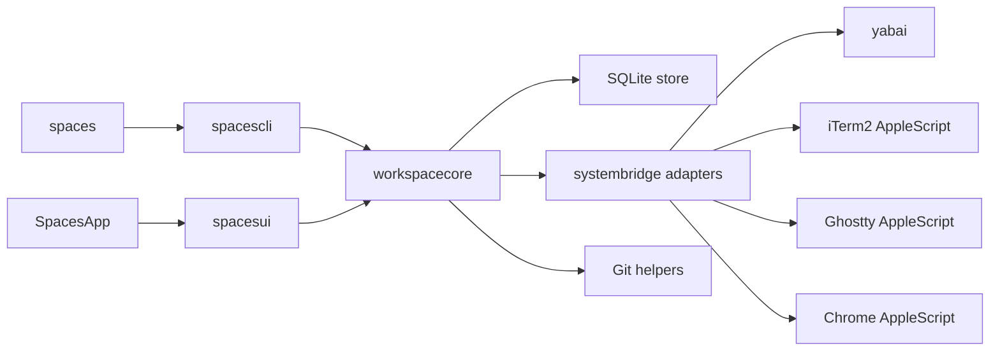

# Architecture

This document describes how Spaces is built: module boundaries, storage, runtime flows, and external integrations. User-visible behavior belongs in [spec.md](../spec.md).

## System Overview
Spaces is a macOS Swift app and CLI built around a shared orchestration layer.

Core invariants:
- SQLite is the single source of truth for persisted model data and global preferences.
- yabai is the source of truth for window IDs and cross-app window focus.
- Workspace settings are seeded from project templates and preserved as per-workspace overrides.
- Schema changes must be additive and non-destructive.
- GUI and CLI both call the same orchestration layer instead of re-implementing behavior independently.

## Module Map



## Module Responsibilities
- `SpacesApp`: minimal app entry point that boots AppKit.
- `spacesui`: AppKit UI layer that renders state and dispatches actions into `workspacecore`. Shared visual language lives in `Theme.swift` (brand color tokens mirroring `apps/web/app/globals.css`) and `RowPrimitives.swift` (status dot, type icon tile, shortcut/project/branch chips, `ColoredBackgroundView` helper). The workspace detail pane is a single scrollable `NSStackView`; it stacks the header, directory meta row, inline tooltip editor, and five configuration sections (Processes, Browser sessions, Coding agents, Named ports, Stop script) in order. Each section is a self-contained class (e.g. `ProcessesSection.swift`) that owns its transient form state, swaps each row between collapsed and editing subviews via `NSAnimationContext`, and publishes commits through an `onCommit` closure that the host bridges to `orchestrator.updateWorkspaceSettings`. Named-port rows render the configured env-var name plus the currently reserved port number from `workspace_ports`, mirroring how browser-session rows separate configured input from resolved display output. The `⋯` overflow menu is built by the static `AppKitController.makeWorkspaceOverflowMenu(workspaceID:path:target:)`, which emits a stock `NSMenu` whose path-based items forward to `copyDirectoryPath(_:)` and `revealDirectoryInFinder(_:)`, while workspace actions use the same shared `senderIdentifier(_:)` helper for `NSMenuItem` and `NSControl` senders. Update discovery also lives here: `UpdateChecker` polls the latest GitHub release API, caches the result for four hours, and hands the chosen DMG asset to `AppUpdater` for download, install, and relaunch.
- `spaces`: executable shim that boots the declarative CLI parser.
- `spacescli`: declarative `swift-argument-parser` command tree for `spaces`, including command help, leaf validation, and translation from CLI inputs into orchestration calls.
- `workspacecore`: core orchestration, lifecycle, validation, persistence coordination, and environment building.
- `systembridge`: system adapters for shell commands, yabai, iTerm2, Ghostty, Chrome, and related OS integrations.

## Persistence

### Database
- Path: `~/.spaces/spaces.db`
- SQLite stores projects, workspaces, runtime state, and global settings.
- SQLite should run in WAL mode with a busy timeout so overlapping GUI, CLI, and background work does not produce avoidable lock failures.
- `migration_state.current_version` is the authoritative forward-only schema marker.
- Migration safety snapshots are stored in `~/.spaces/backups/` and retained as a rolling set of the newest 10 migration backups.

### Migration Rules
- Migrations must preserve existing user data.
- Fresh installs create the latest schema directly and record the current schema version.
- Existing installs migrate in ordered `N -> N+1` steps until they reach the current schema version.
- Each migration step runs inside `BEGIN IMMEDIATE ... COMMIT`, updates `migration_state` in the same transaction, and rolls back on failure.
- Additive and compatible schema changes should use `CREATE TABLE IF NOT EXISTS`, `ALTER TABLE`, backfills, indexes, and table rebuilds with copy when SQLite requires them.
- Before the first migration step for an open, Spaces creates a SQLite-safe backup snapshot in `~/.spaces/backups/`.
- After migrations finish, Spaces runs `PRAGMA integrity_check` and fails startup if validation does not return `ok`.
- Compatible changes must not require destructive resets, and startup errors must not instruct users to delete `~/.spaces/spaces.db`.

## Data Model

### Projects
Projects persist:
- source directory and git status
- sidebar collapsed state
- setup and stop scripts
- port definitions
- process templates
- browser-session templates

### Workspaces
Workspaces persist:
- directory identity
- title, tooltip, and branch metadata
- default and archived flags
- hidden sidebar visibility state
- explicit lifecycle state (`running` vs `stopped`)
- seeded per-workspace copies of launch-time settings

### Runtime Records
Runtime state persists separately from project and workspace templates:
- allocated ports
- running processes
- tracked windows
- tracked agent windows

This separation lets template edits coexist with current runtime state and per-workspace overrides.
It also lets lifecycle state stay explicit while runtime health is derived from the current runtime records.

### Referential Integrity
- SQLite foreign keys stay enabled for persisted parent-child relationships.
- Store-level delete-and-reinsert updates run inside immediate transactions so partial child-table replacements cannot persist if one statement fails.

## Core Flows

### Workspace Creation
1. Resolve the target project and workspace identity.
2. Create or import the workspace directory.
3. Persist the workspace and seed per-workspace settings from project templates.
4. Allocate named ports.
5. Run setup logic.

### Workspace Launch
1. Validate that the workspace is launchable.
2. Build the workspace environment, including named port variables and workspace paths.
3. Start tracked processes inside tmux-backed dedicated terminal contexts.
4. Leave configured browser sessions unopened until the user focuses them.
5. Capture new terminal windows through yabai and persist the mapping.

### Workspace Stop or Archive
1. Stop tracked processes.
2. Run the workspace stop script when appropriate.
3. Close tracked dedicated windows safely.
4. Clear runtime state.
5. Release ports.
6. Archive git worktrees when the action requires it.

### Discovery and Reconciliation
- Background worktree discovery imports valid unmanaged worktrees for known projects.
- Background reconciliation removes stale tracked windows and refreshes persisted workspace metadata from disk where needed.
- Saving workspace settings updates persisted configuration and synchronizes named-port reservations, but it does not reconcile live runtime by auto-starting or auto-stopping processes, browser sessions, or coding agents.
- Reconciliation may degrade runtime health, but it should not silently promote or demote workspace lifecycle state.
- Sidebar snapshot refresh can update the backing lists in the background without rebuilding the active detail pane when the current selection is still valid.
- These passes should not block the main UI thread.

## Environment and Process Model
- Named port definitions are allocated per workspace and exposed as environment variables. Workspace-settings saves preserve existing allocations where possible, allocate newly added definitions immediately, and release removed definitions without waiting for the next launch.
- Workspace processes also receive stable environment variables such as project and workspace directories.
- Setup scripts, stop scripts, and process commands all execute against the workspace-specific environment.
- Process launch and terminal recovery use tmux so the process lifetime can outlive a missing terminal window and be reattached later.
- Global app settings include the selected terminal host, and the GUI is the configuration surface for that value.
- Global settings also store the shared window focus pulse color and enabled state behind window-scoped keys.
- Process templates are parsed as direct executable invocations. If a workflow needs composite shell syntax such as `cd x && y`, pipes, or redirection, it must opt in explicitly by launching a shell command such as `bash -lc "cd x && y"`.

## Window and Focus Architecture
- yabai provides stable window identity and cross-app focusing.
- iTerm2, Ghostty, and Chrome AppleScript integrations add app-specific behavior on top of yabai, such as returning launch-time terminal IDs or selecting the intended browser target.
- Browser sessions are stored as workspace configuration and only become tracked windows after an explicit focus action opens them.
- Browser-session focus uses the tracked Chrome window plus tab `1` as the fast path, instead of rescanning Chrome tabs on every focus.
- CLI workspace focus resolves explicit names instead of numeric window indexes. Those names come from the same workspace-level focus model used for browser sessions, running processes, and agent terminals, and the names must stay unique within a workspace.
- The CLI stays path-based: commands target the current working directory by default or accept an explicit workspace path argument.
- Terminal focus pulsing is terminal-agnostic: Spaces queries the target yabai window and briefly presents an AppKit overlay aligned to that window instead of mutating terminal-specific appearance settings.
- iTerm2 focus now splits into two phases: a fast AppleScript select path that returns as soon as the target session/window is brought forward, followed by a background verification pass that confirms the intended session became current without delaying the pulse overlay.
- Tracked windows are persisted so Spaces can refocus or clean up only the windows it owns.
- Direct focus requests auto-recover stale browser-session windows by reopening and re-tracking them, while process and generic window failures still surface typed missing-window errors to the GUI.
- Browser-session existence is not polled during background refresh; stale browser mappings are detected on demand when the user focuses that session.
- Window cycling is tolerant of stale tracked yabai IDs and keeps advancing until it finds the next live target.
- Reconciliation is required because window state can drift outside the app.

### Terminal Integration Contract
Spaces currently supports iTerm2 and Ghostty. A future terminal integration should plug into the same orchestration flow instead of adding one-off launch and focus paths.

Target shape:

```swift
protocol TerminalAdapter: Sendable {
    var appName: String { get }
    var bundleIdentifier: String { get }

    func isAvailable() -> Bool
    func openWindowAndRun(
        command: String,
        cwd: String,
        environment: [String: String],
        background: Bool
    ) throws -> TerminalLaunchResult
    func resolveCurrentTrackingIdentity(
        environment: [String: String],
        yabaiFocusedWindowID: Int?
    ) throws -> TerminalTrackingIdentity?
    func focusTrackedTerminal(_ target: TerminalFocusTarget) throws -> Bool
    func listLiveTrackingIdentities() throws -> Set<TerminalTrackingIdentity>
}

enum TerminalTrackingIdentity: Hashable, Sendable {
    case session(String)
    case window(Int)
    case tmux(String)
}

struct TerminalLaunchResult: Sendable {
    let trackingIdentity: TerminalTrackingIdentity?
    let hookSessionID: String?
    let containerID: String?
    let fallbackWindowID: Int?
    let tabIndex: Int?
}

struct TerminalFocusTarget: Sendable {
    let trackingIdentity: TerminalTrackingIdentity?
    let windowID: Int?
    let tabIndex: Int?
}
```

Required behavior:
- Availability: expose a cheap `isAvailable()` check so setup validation and host selection can reject unsupported terminals early.
- Launch: create a new dedicated terminal context, inject the requested environment into the child shell, and run the provided command without requiring Spaces to synthesize host-specific shell glue outside the adapter.
- Identity: return a stable `TerminalTrackingIdentity` that Spaces can persist on `RunningProcessRecord`, `WindowRecord`, and `AgentWindowRecord`.
- Current-context resolution: turn the current hook process environment plus the current yabai focus into a `TerminalTrackingIdentity` so CLI agent events do not need host-specific matching logic.
- Focus: refocus the tracked terminal target, not just the containing yabai window, so tabbed terminals reopen the exact tracked session or surface when possible.
- Reconciliation: enumerate live tracking identities so Spaces can detect stale runtime records after users close windows manually.

Identity rules:
- yabai remains the source of truth for window IDs and cross-app focus.
- The terminal adapter may use a richer native identity for tracking, but that identity must be stable enough to survive normal reconciliation and refocus flows.
- If the terminal cannot provide a durable session identifier, the integration must still provide a deterministic fallback that maps back to the yabai-managed window.
- Current examples:
  `iTerm2` tracks sessions primarily by session ID and falls back to a yabai window ID.
  `Ghostty` tracks by the real Ghostty terminal ID for focus/liveness plus a separate Spaces-issued hook token for event attribution.
- `WindowRecord` stores a stable `name` for focus identity separately from a display `detail`, so CLI focus targets can stay deterministic while GUI rows still show live browser URLs, process commands, or terminal window titles.

Operational requirements:
- Workspace shell launch and process launch must both work through the same adapter surface.
- Process sessions must still run under tmux so terminal closure does not kill the underlying process.
- The adapter must tolerate background launch (`background: true`) because `spaces workspace up` and recovery flows may avoid stealing focus.
- The integration must not introduce window management outside yabai; any native terminal APIs are only for terminal-local actions such as opening, closing, or selecting a terminal target.

Implementation note:
- The shared launch and discovery contract now lives in `systembridge` as `TerminalAdapter`, and `WorkspaceOrchestrator` resolves `TerminalHost` to a concrete adapter through one registry.
- `TerminalAdapter.openWindowAndRun(...)` must inject any requested launch environment into the child shell process and return the stable tracking identity that later hooks and focus flows should use.
- The shared focus contract now also requires host-specific refocus by typed tracking identity. iTerm2 implements that with session/tab selection, while Ghostty refocuses the tracked terminal by Ghostty terminal ID and only falls back to the yabai window when direct terminal focus fails.
- Richer iTerm2-only helpers can still exist outside the shared interface, but a new terminal should first conform to `TerminalAdapter` so launch, focus, and discovery all follow one path.

## Agent Integration
- Agent events are explicit CLI inputs that attach status to tracked workspace agent windows.
- `spaces agent event` only resolves direct terminal environments. If the command is run from tmux, the CLI rejects it explicitly because Spaces does not support coding agents running inside tmux.
- Agent windows are stored separately from regular process windows because they carry provider and lifecycle metadata, but `init` also reconciles them against tracked terminal windows so ad-hoc agent terminals become focusable tracked rows.
- Configured agent-launcher names are treated as reserved focus labels. The launcher-owned agent instance may keep that exact label, while unrelated ad-hoc agents that report the same label are suffixed during registration so GUI rows and CLI focus targets stay unambiguous.
- Workspace launch now opens configured coding agents through the same direct-terminal path as manual agent launch. That creates the tracked agent rows eagerly, while later `spaces agent event` calls still supply the actual lifecycle status.
- The dashboard and numbered window shortcuts keep configured and ad-hoc agent rows in one `Coding Agents` section. Configured rows occupy their stable slots first, then unmatched ad-hoc agent rows append after them so shortcut ordering remains deterministic.
- Configured-agent relaunch is conservative: if a reserved row still points at a live tracked terminal, Spaces keeps that row and treats launch as a no-op. Only clearly stale rows are evicted and replaced.
- Agent reconciliation prefers terminal identity first:
  `iTerm2` uses the shell session ID from the environment.
  `Ghostty` keeps a Spaces-issued `terminalTrackingID` for CLI hook attribution and a separate `terminalNativeID` for the real Ghostty terminal. Hook events only trust the tracking token; they do not infer the emitting shell from the frontmost Ghostty terminal or yabai window.
- Workspace-managed process terminals persist the tmux window ID on their running-process and tracked-window records so later agent events, reattachment, and exit cleanup can reconcile against the same process-backed terminal slot.
- When an agent attaches to a workspace-managed process terminal, the record keeps the tmux window ID so a later `exit` can keep an idle placeholder row instead of deleting it.
- Dashboard attention state is derived from runtime records rather than inferred from UI state.
- `waiting` and `done` agent events both contribute dashboard and dock attention until the user dismisses that specific attention event; the workspace row still renders the underlying agent status independently.

Ghostty-specific reconciliation:
- Ghostty AppleScript exposes stable terminal IDs through the window -> tab -> terminal graph, but does not reliably expose live terminal environment variables on current Ghostty builds.
- Because yabai window IDs can change when users retab or add tabs in Ghostty, Spaces treats the Ghostty terminal ID as the durable identity and yabai window IDs as refreshable focus bindings.
- Ghostty rows without a stored native terminal ID are not treated as live just because their tracking token still exists; only the real Ghostty terminal ID participates in liveness and retab rebinding.
- Background refresh keeps a tracked Ghostty row alive when its stored terminal ID still appears in Ghostty's live terminal graph, even if the previously stored yabai window ID has disappeared.
- Later agent events can refresh metadata only when they present the stored tracking token and Spaces can unambiguously recover the existing native terminal ID from tracked rows.
- Focus is slightly more permissive than liveness for Ghostty: refocus still prefers `terminalNativeID`, but if the matching tracked terminal row has not been backfilled with that native ID yet, Spaces may fall back to the persisted `terminalTrackingID` for the same workspace row. This fallback is intentionally scoped to already-tracked rows and does not use the frontmost Ghostty terminal or a guessed yabai window.
- Dashboard dismissals are stored as a persisted set of attention-event IDs in SQLite global settings, then filtered in the GUI so workspace detail panes keep showing the underlying runtime rows.

Terminal host notes:
- iTerm2 exposes a usable shell session ID directly (`ITERM_SESSION_ID`), so Spaces can rely on that same host-native identifier for launch tracking, hook attribution, liveness checks, and refocus.
- Ghostty does not expose an equivalent shell-local native terminal ID to the running shell on this machine. That is why Ghostty needs the split between `terminalTrackingID` and `terminalNativeID`.
- Ghostty AppleScript can enumerate the real terminal graph and focus a terminal by Ghostty terminal ID, but it cannot safely tell Spaces which background shell emitted an `spaces agent event`. That attribution must come from the Spaces-issued hook token.
- Ghostty direct-property or environment-variable AppleScript access has proven unreliable enough that Spaces should avoid new designs that depend on reading live terminal env vars back out of Ghostty.

## Lifecycle and Health
- Workspace lifecycle state is explicit and persisted on the workspace record.
- Runtime health is derived from runtime records, configured browser/process expectations, and agent waiting state.
- The GUI should render lifecycle state directly and layer runtime-health warnings on top instead of inferring lifecycle from stale runtime leftovers.

## Shortcut Architecture
- Shortcut defaults and user overrides are stored in SQLite global settings and edited from the GUI settings panel.
- Global shortcuts use Carbon hotkey registration for actions that must work while Spaces is not frontmost.
- In-app shortcuts use an AppKit event monitor so they can respect focused text inputs and support digit-family shortcuts such as window `1` through `9`.
- Leader-based shortcuts store a suffix key spec and derive their shared modifiers from `gui_leader_hotkey`; the orchestrator resolves them to full effective hotkeys for both the GUI and CLI. Reload and the workspace terminal action use this same leader-backed resolution path.
- Window focus shortcuts are modeled as modifier families rather than nine separate persisted bindings: one family for direct focus and one for queued multi-focus replay.
- The dashboard shares the same direct-focus shortcut family as workspace detail, and those focus shortcuts take precedence over dashboard-local create actions while the dashboard is visible.

## Performance Principles
- Focus and capture paths should avoid unnecessary blocking work.
- Hot paths that do not need stdout or stderr should use lightweight process spawning.
- Long-running GUI actions should execute off the main thread and reconcile state back into the UI afterward.

## External Dependencies
- macOS 14+
- yabai for window identity and focus
- tmux for recoverable terminal-hosted process sessions
- iTerm2 or Ghostty for terminal process hosting
- Google Chrome for browser-session automation
- SQLite for local persistence
