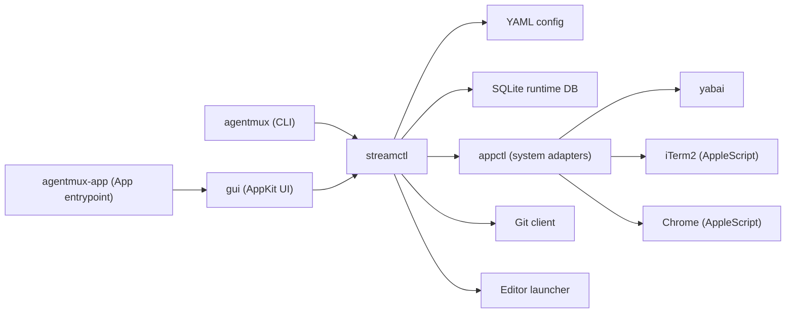
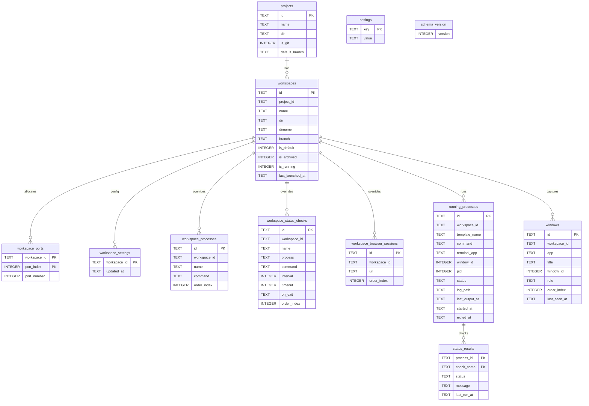
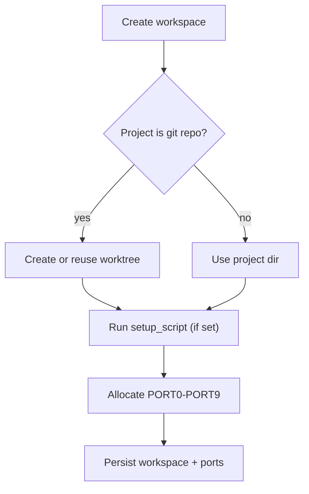
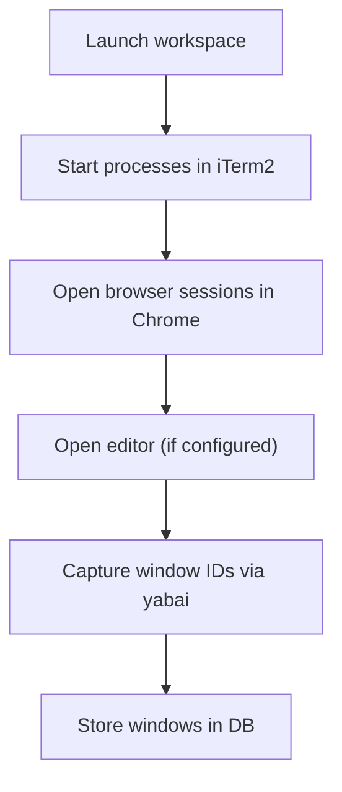
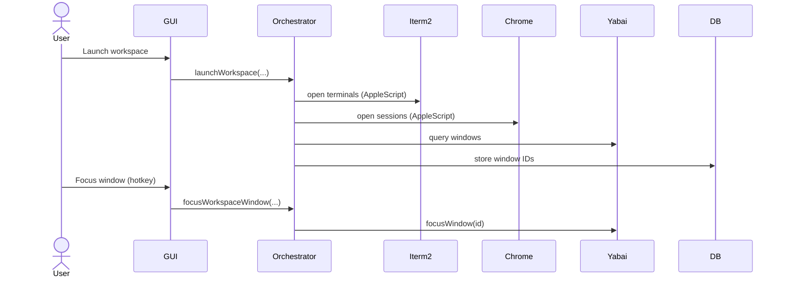

# Architecture

## Overview
`agentmux` is a macOS Swift app for stream-based workspace orchestration. A stream is a captured set of windows tied to a workspace. YAML is the source of truth for global settings and project templates, while SQLite stores runtime state plus per-workspace settings that are not written back to YAML.

Key invariants:
- YAML config is the source of truth for global settings and project templates and is normalized on load.
- Workspace settings are stored in SQLite and seeded from project templates; no YAML workspace overrides exist.
- SQLite stores runtime state and can be recreated when the schema version changes (workspace settings are re-seeded from templates).
- yabai is the source of truth for window IDs and focus.
- Stream capture must happen before a stream is shown or focused.
- Avoid window-level automation outside yabai.
- Local key monitors must not override standard text-edit shortcuts while an input has focus.

## Module Map

Module responsibilities:
- `appctl`: Shell + AppleScript adapters for yabai, iTerm2, and Chrome.
- `streamctl`: Orchestration, config normalization, port allocation, workspace lifecycle, and persistence.
- `gui`: AppKit UI library that calls into `streamctl`.
- `agentmux`: CLI entrypoint that calls into `streamctl`.
- `agentmux-app`: GUI executable entrypoint that wires `NSApplication` to the `gui` library.

The `gui` target is the reusable UI library. `agentmux-app` is the minimal executable that boots AppKit and delegates to `gui`.

GUI interaction notes:
- Right-pane forms are hosted in a scroll view so long forms do not clip at smaller window heights.
- The "new workspace" affordance is shown in project UI only when the project is a git repository.
- Window focus shortcuts in the GUI use `cmd+1` through `cmd+9`.
- Keyboard shortcut overrides for GUI actions are persisted in SQLite settings and editable in the GUI Settings view and CLI settings commands.

## Data Model
Config file:
- Path: `~/.agentmux/config.yaml`.
- Top-level fields: `editor`, `port_range`, `projects`.
- The GUI Settings view writes `editor` from installed VS Code, Cursor, or Windsurf.
- Project fields: `dir`, `setup_script`, `cleanup_script`, `processes`, `status_checks`, `browser_sessions`.
- New projects can be created from an existing directory or by cloning a repository into `/Users/<username>/agentmux/projects/<project_name>`.
- Removing a project clears agentmux state. For git projects, related workspace directories under `/Users/<username>/agentmux/workspaces` are deleted.
- The project directory is deleted only for git projects located under `/Users/<username>/agentmux/projects` (app-managed clones).

Workspace settings:
- Each workspace snapshots project `processes`, `status_checks`, and `browser_sessions` at creation.
- Snapshots are stored in the runtime DB alongside other workspace data.
- Edits are stored in SQLite only; YAML remains unchanged.
- Edits to a running workspace reconcile processes and browser sessions immediately.

Runtime database:
- Path: `~/.agentmux/agentmux.db`.
- Schema is recreated when `schema_version` changes; workspace settings are re-seeded from project templates as needed.

## Workspace Lifecycle
Create and prepare a workspace:

Launch and capture windows:

Stop or archive:
- Stop: close tracked windows, stop processes, clear runtime process state.
- Archive: stop, run `cleanup_script` (if set), remove worktree for git projects, release ports.
- Archive never deletes the project directory for non-git projects.

## Window Capture and Focus

Editor and terminal windows opened from the GUI (Open Editor/Open Terminal) are captured via yabai and stored in the
windows table so they participate in workspace window cycling.

## External Dependencies
- macOS 14+
- `yabai` for window IDs, focus, and display/space metadata
- iTerm2 for terminal processes
- Google Chrome for browser sessions
- Yams for YAML config parsing and encoding
- SQLite3 for runtime persistence
