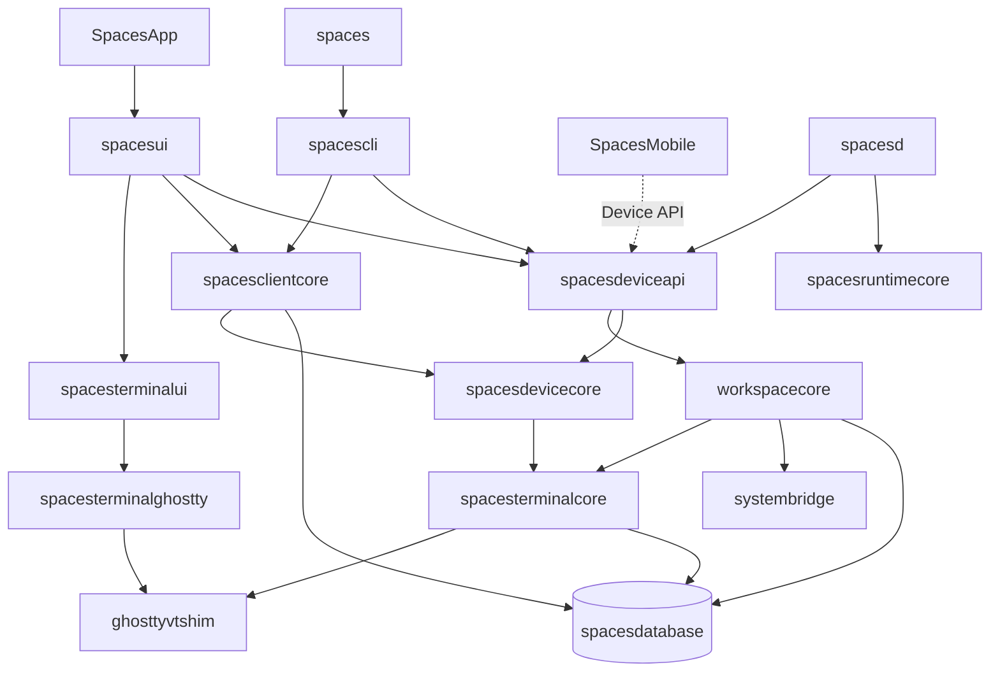
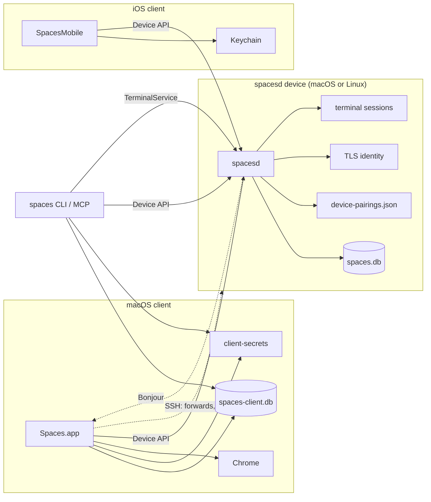
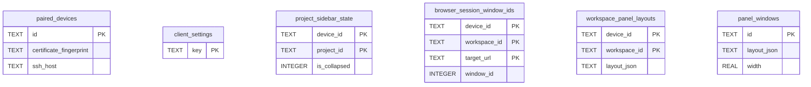

# Architecture

How Spaces is built and why: module boundaries, storage, runtime topology, and the rationale behind the major design choices. Written for a reader who needs the shape of the system and the constraints that make the code look the way it does — details inferable from the source are left to the source.

Related docs, each authoritative for its own layer:

| Doc | Owns |
| --- | --- |
| [spec.md](spec.md) | User-visible behavior and product semantics |
| [terminal.md](terminal.md) | Built-in terminal runtime, ownership, and the Ghostty boundary |
| [design.md](design.md) | Visual system and reusable interaction patterns |
| [dev.md](dev.md) | Build, install, release, and E2E workflows; concrete install paths |

## System Overview

Spaces is a macOS app, an iOS app, and a CLI, all of which are thin clients of a per-device daemon. Five invariants hold everywhere:

- SQLite is the single source of truth for persisted model data and global preferences.
- A **window is a client concept**. The daemon has no desktop session and stores no window identity; clients reconstruct windows from the overview payload.
- Workspace settings are seeded from project templates at workspace creation and preserved as per-workspace overrides after that.
- Store startup migrates older databases serially through every intermediate schema version and fails closed for versions it has no migration step for.
- Behavior lives in one orchestration layer, hosted by the daemon. Every surface — GUI, CLI, MCP, iOS — reaches it through the Device API or the local profile socket rather than re-implementing it. `Stop All and Quit` is the sole exception: it opens the local daemon store directly, because it has to coordinate the quit prompt with client-owned Chrome tab tracking that the daemon cannot see.

## Modules

One SwiftPM package (`apps/macos/Package.swift`) holds every Swift target except the iOS app, which is an Xcode target under `apps/ios`.

Dependencies flow strictly downward through the layers named in the table below.

| Module | Layer | Owns | LOC |
| --- | --- | --- | --- |
| `SpacesApp` | entry | AppKit boot, nothing else | 40 |
| `spaces` | entry | CLI shim over `spacescli` | 3 |
| `spacesd` | entry | Per-device daemon: Device API host, terminal sessions, runtimes | 1.5k |
| `spacese2e` | entry | E2E runner and screen-recorder harness | 3.5k |
| `SpacesMobile` | entry (Xcode, `apps/ios`) | iOS client; a Device API client only | 6.6k |
| `spacesui` | surface | AppKit UI, panels, sidebar, focus dispatch, updater | 23.7k |
| `spacescli` | surface | `swift-argument-parser` tree and the MCP server | 0.9k |
| `spacesterminalui` | surface | Terminal pane view controllers | 2.0k |
| `spacesdeviceapi` | service | Device API server, pairing, overview stream | 4.8k |
| `spacesclientcore` | service | Client database, device client, pairing secrets | 2.5k |
| `workspacecore` | core | Orchestration, lifecycle, environment, `AppVersion` | 9.6k |
| `spacesterminalcore` | core | Terminal primitives, theming, Caddy config, wire version | 9.7k |
| `spacesdevicecore` | core | Device API wire types, shared by daemon and every client | 2.4k |
| `spacesruntimecore` | core | Daemon-safe git helpers (no UI, Keychain, or AppKit) | 0.3k |
| `systembridge` | platform | Shell commands, AppleScript, Chrome automation | 1.5k |
| `spacesterminalghostty` | platform | Embedded libghostty host and app-side adapters | 5.8k |
| `spacesterminalmobileghostty` | platform (non-Linux) | iOS Ghostty rendering and input mapping | 1.8k |
| `ghosttyvtshim` | platform | C shim over `libghostty-vt` | — |
| `spacesdatabase` | storage | SQLite wrapper, migrator, schema, backup | 0.7k |

`AppVersion` constants are generated from `apps/macos/AppVersion.plist`, which also generates the app bundle `Info.plist`.

## Runtime Topology

Every client — the Mac app, the iOS app, and the CLI/MCP server — reaches daemon-owned state only through the Device API. `spacesd` runs on macOS and Linux and owns the daemon database, runtime files, workspace root, TLS identity, terminal sessions, and paired-client records.

| Transport | Endpoint | Auth | Clients |
| --- | --- | --- | --- |
| Device API | TLS on `host:port` | Pinned daemon cert + per-client token | app, iOS, CLI/MCP |
| TerminalService | `/tmp/spaces-sockets-<uid>/…` | Unix filesystem permissions | local app, CLI/MCP |
| Bonjour | mDNS | None — discovery only | app, iOS |
| SSH | `ssh(1)` | The user's own SSH config | macOS app only — pairing sugar, browser forwards, editor opening |

Deliberate absences:

- **No relay transport.** Direct reachability over LAN, VPN, or Tailscale is required.
- **No TCP terminal-control bridge.** Terminal control rides profile-scoped Unix sockets and the authenticated Device API.
- **Bonjour carries no trust.** It advertises host and port; authorization is the pinned certificate plus the token.
- **Pairing credentials are file-only on both sides.** The daemon keeps token *hashes* in `device-pairings.json`; the Mac stores its token in a `client-secrets` file store so the app, CLI, and MCP server can all read it headlessly; iOS uses Keychain. None of this lives in SQLite, so no SQLite backup can leak a token.
- **Spaces never installs or updates a remote daemon.** SSH is never used for provisioning.
- **Terminal control never rides SSH.** A remote pane attaches, sends input, and receives render frames over the Device API like any other command.

SSH is a macOS-client-only capability with exactly three uses, none of them load-bearing for terminal or workspace control:

| Use | Owner |
| --- | --- |
| The `--ssh` pairing convenience path | `SpacesDevicePairingClient` |
| `ssh -L` browser port forwarding | `BrowserSSHForwardManager` |
| Opening a remote folder in the editor | `EditorRemoteSSHSupport` |

Even pairing is thin sugar: `spaces device pair --ssh` validates SSH, runs `spaces device pair --json` on the remote to obtain a `spaces://pair` link, then redeems that link over the pinned-TLS Device API like any other pairing. Removing SSH would cost remote browser sessions and remote editor opening, and nothing else.

## Persistence

State lives under `~/.spaces` on both macOS and Linux — the cross-platform dev-tool dotdir convention rather than platform-native directories (`~/Library/Application Support`, XDG). This keeps one code path across platforms, keeps paths space-free for shell tooling and AF_UNIX sockets, works on headless servers, and stays discoverable for CLI users. User project data lives at the visible `~/spaces/{workspaces,repos}`, outside the profile root, because those are the user's own working files rather than app state. Concrete install locations are in [dev.md](dev.md).

### Two databases

| Database | Owner | Holds |
| --- | --- | --- |
| `spaces.db` | `spacesd` | Projects, workspaces, runtime targets, process and agent rows, terminal metadata, daemon and global settings |
| `spaces-client.db` | The macOS app | Paired-device metadata, client settings, sidebar collapse state, panel layouts and window frames, browser window IDs, dismissed alerts |

The boundary is strict. A client reads daemon-owned data over the Device API rather than by opening `spaces.db`, so the two databases are never SQL-joined; they correlate in application code by stable keys (`workspace_id`, `runtime_target_id`, terminal `session_id`/`tracking_id`). The macOS GUI hosts no in-process orchestrator: focus, cycling, runtime controls, and workspace lookups are all reconstructed from the overview, and mutations go through the Device API. `Stop All and Quit` is the one path that opens the local daemon store directly (see [System Overview](#system-overview)); direct store openers may use the current schema but never upgrade a profile owned by another live daemon process.

### Profile resolution

- `SPACES_DB_PATH` wins whenever it is set for the current process.
- Otherwise repo-local development binaries derive one profile root from the current git branch plus the canonical worktree path.
- Installed binaries fall back to `~/.spaces/`.
- The runtime root is `<profile-root>/runtime` unless `SPACES_RUNTIME_DIR` overrides it.
- Client paired-device metadata follows the resolved profile root, so separate profiles never share paired remotes. Distributed-notification IPC is likewise scoped by a token derived from the profile root.

### Migration rules

- Fresh installs create the latest schema directly and record the current version.
- Databases behind the current version upgrade serially, one version per step (`vN` → `vN+1`). There are no version-skipping steps or jump paths.
- Schema creation and migration reserve the profile's daemon instance lock for the full operation, including backup creation and every migration transaction. IPC, instance ownership, and startup serialization use the same canonical runtime profile identity, including an explicit `SPACES_RUNTIME_DIR`, so newer helpers recognize locks written by daemons that predate the migration guard. A different live owner prevents that reservation and produces guidance for the session-preserving daemon handoff; a daemon cannot start between the ownership check and the schema writes. Helpers acquire the profile launch lock before reserving the instance lock, so `TerminalService.ensureRunning` waits for an in-flight migration and launches the daemon afterward instead of spending its one spawn attempt on an instance-lock collision. After authorization, each waiter re-reads the table list and schema version and adopts work completed by the previous lock holder instead of replaying its stale migration decision. A process-local migration lock serializes helper threads before the current pid is interpreted as daemon ownership. Migration lock wait is outside the daemon startup timeout because backup duration depends on database size; the timeout begins after startup owns the launch slot. A schema version newer than the helper supports is rejected before upgrade authorization because updating the daemon cannot make that older helper compatible.
- Startup fails closed when the recorded version has no migration step, or is newer than the binary supports.
- Startup runs `PRAGMA integrity_check` and fails unless it returns `ok`.
- Migrations carry user data forward. Tables and columns nothing reads are dropped by a step and removed from the schema definitions in the same change.
- Client migrations take a timestamped metadata-only backup first and restore it on failure.

## Data Model

`DatabaseSchema.currentVersion` is `7` and `SpacesClientDatabase.currentVersion` is `2`. `migration_state.current_version` records the canonical version; `PRAGMA user_version` is not used for migration control. Migration steps run serially, one version forward each. The `v1` → `v2` step adds `agent_sessions.note` and the `agent_subscriptions` table (as a frozen snapshot of its v2 shape with the original `ON DELETE CASCADE`, since the v6 → v7 step alters that foreign key), carrying existing agent rows forward with a null note; the `v2` → `v3` step adds the `agent_pending_notifications` queue (as a frozen snapshot of its v3 shape, since a later step alters the table); the `v3` → `v4` step adds the `agent_remote_subscriptions` cross-device watch table; the `v4` → `v5` step adds `agent_pending_notifications.transition`, with pre-existing held rows carrying an empty transition so they flush normally and are never matched by the blocked-line withdrawal; the `v5` → `v6` step adds the `agent_remote_watch_baselines` table; the `v6` → `v7` step rebuilds `agent_subscriptions` with its foreign key changed from `ON DELETE CASCADE` to `ON DELETE RESTRICT`, recreating the table and copying every row (SQLite cannot alter a foreign key in place). Each takes a pre-migration backup.

Diagrams show keys and discriminating columns only — full column lists live in `DatabaseSchema.swift` and `SpacesClientDatabase.swift`.

The template and config tables mirror each other one-for-one. For each of `services`, `processes`, `browser_sessions`, and `agent_launchers` there is a `project_*` template table and a `workspace_*` config table, each a child of its parent ordered by `order_index`. Only the `processes` pair is drawn below; the other three have the same shape.

| Group | Tables | Role |
| --- | --- | --- |
| Project templates | `projects`, `project_services`, `project_processes`, `project_browser_sessions`, `project_agent_launchers` | Defaults seeded into each workspace at creation |
| Workspace config | `workspaces`, `workspace_settings`, `workspace_services`, `workspace_processes`, `workspace_browser_sessions`, `workspace_agent_launchers` | Per-workspace overrides after creation |
| Runtime records | `workspace_service_ports`, `runtime_targets`, `browser_targets`, `running_processes`, `agent_sessions`, `agent_session_events`, `agent_subscriptions`, `agent_pending_notifications`, `agent_remote_subscriptions`, `agent_remote_watch_baselines` | Live state, kept separate so template edits coexist with running processes |
| Terminal persistence | `terminal_sessions`, `terminal_runtime_states`, `terminal_clients`, `terminal_attachments`, `terminal_remote_session_states`, `terminal_agent_signal_events` | Session identity, attachments, final render state |
| Device | `settings`, `migration_state`, `ignored_worktrees` | Global preferences, schema version, discovery exclusions |

Uniqueness outside primary keys: `projects.dir`; `workspaces(project_id, branch)` for active non-empty branch names; `root_directory` on each of the three terminal tables that carry it; `agent_pending_notifications(subscriber_terminal_session_id, agent_session_id)`, which makes `INSERT OR REPLACE` coalesce a child's queued notifications to one latest-state line. Partial unique indexes on `terminal_attachments` enforce at most one active owner per root, and at most one active attachment per root/client pair.

### Window-ID ownership

There is no desktop or window-manager window identity anywhere in the daemon. Terminals, processes, and coding agents are tracked by terminal session ID; `runtime_targets` carries no `window_id` column and the device overview emits none. This is what lets a remote viewer render a device's runtime without being able to focus another desktop's windows.

The single exception is the Chrome window containing a browser session's tab, which is a client/desktop concept. The GUI records it in the client `browser_session_window_ids` table, keyed by `device_id` + `workspace_id` + resolved `target_url`, through `ClientBrowserWindowIDStore`. Several sessions in one workspace may share one Chrome window so they stay grouped as tabs.

### Runtime target model

- `runtime_targets` is the canonical inventory of focusable runtime items for a workspace: `type`, host app, durable terminal `tracking_id`, ordering, display metadata. The persisted `type` string is surfaced through the `WindowRole` typed view.
- `browser_targets` extends a browser target with its configured URL.
- `running_processes` and `agent_sessions` each link to a `runtime_target` when focusable, and each carries a durable `terminal_session_id` used for focus, restart, and final-frame viewing.
- `agent_session_events` records signal-driven lifecycle transitions, giving an inspectable trail across rebind, detach, and prune. Signal recency (`lastAgentSignalAt`) is the most recent `agent_session_events` row whose `source` is `spaces_agent_signal`, so foreground-detected rows that never signal read as never-signaled. This drives the informational `signaled=` column in `agent list`/`status` (hook health) and is distinct from `agent spawn`'s foreground-detection readiness.
- `agent_sessions.note` is an explicit, human-authored annotation for orchestration. It is written only through the annotate path (`setAgentSessionNote`); the `upsertAgentWindow` conflict clause coalesces an incoming null note back to the stored value, so a status signal never clobbers an annotation. `setAgentSessionNote` leaves `updated_at` untouched: that column is the lifecycle-state-entry time (see the `working` signal paragraph above) that macOS and iOS Alerts read as the event date and ordering key, so annotating a waiting/done agent must not make its alert appear newly occurred.
- `agent_subscriptions` is the same-device subscribe relationship an orchestrator uses to watch other agents. Its subscriber key is a **terminal session id**, not an agent id, because a subscriber may be a plain terminal with no agent row of its own; its target is an **agent session id** with an `ON DELETE RESTRICT` foreign key. The inbound edges are **not** cascaded away on delete: the single termination chokepoint (`WorkspaceOrchestrator.finalizeAgentRow`) drops them explicitly after notifying those subscribers the child exited, and RESTRICT makes any delete that bypasses the chokepoint fail loudly instead of silently stranding a watcher's notice. There is no parent/child column on `agent_sessions` — the subscription edge is the only relationship between agents. Bulk scope deletes obey the same rule: `SQLiteStore.deleteProject`/`deleteWorkspace` still issue a raw `DELETE FROM agent_sessions` for the scope, which throws under RESTRICT if the scope holds any watched agent row (including an `.exited`-kept row whose watcher has not unsubscribed), so `WorkspaceOrchestrator.removeProject` finalizes every agent row in the project through the chokepoint (`.destroyed`) BEFORE the store delete — delivering the exited notice to watchers outside the deleted scope, dropping the inbound edges so the delete succeeds, and tearing down each terminal's own watch state. `removeProject` also mutates the database before any irreversible filesystem work (worktree removal), so a failure surfaces while the worktrees are still on disk rather than after they are gone. The raw scope `DELETE FROM agent_sessions` stays as a defensive loud-failure guard: after the finalize-first pass it is a no-op, but a row that somehow survived finalization would make it throw under RESTRICT rather than strand a watcher.
- `agent_remote_subscriptions` is the cross-device counterpart: a local subscriber terminal watching a coding agent on a paired device. `agent_session_id` holds the watched child's **terminal session id on that device** — the stable cross-device handle a user addresses and a deep link targets — not a local row id, so the table deliberately has **no foreign key** (the watched agent lives in another device's database). Its lifecycle is driven by the watch service rather than a cascade: when the remote agent exits, the terminating line is delivered and the edge is dropped. Keying on the child's terminal session id also makes `agent unsubscribe --device` a local-only delete that works even when the device is offline.
- `agent_remote_watch_baselines` is the watch service's persisted per-device baseline: each watched child's last-seen `listAgentSessions` row, stored as the encoded wire row (`row_json`) because rendering an exited line needs the full row after the agent is gone. It mirrors the in-memory baseline so a restarted daemon can diff its first listing against what the previous run had reported; a row that fails to decode simply re-seeds silently. Like the edge table it has no foreign key, and the watch service drives its lifecycle (retired when a device's last edge is removed or the device unpairs).
- Targets are seeded as soon as a process or agent terminal is known, not filled in by a later window-reconciliation pass.

### Data modeling guidelines

- Base tables stay generic. A field that only makes sense for one provider belongs on an adapter-specific runtime path, not a cross-cutting base record.
- `runtime_targets` owns focus identity; process and agent rows own their configured slot state.
- Correlate and focus by durable terminal session identity, never by transient OS window handles.
- Agent rows describe logical session state, not terminal rendering internals; process rows describe process runtime and slot ownership, not window fields.
- Avoid provider-specific naming in shared schema. Generic `provider` and `session_key` are fine; a field named after one product is transitional.
- Prefer an event history for destructive transitions over piling `last_*` and `*_reason` columns onto canonical state rows.
- Add abstractions when behavior needs them. Speculative tables and fields wait for a real workflow.

Foreign keys stay enabled. Store-level delete-and-reinsert updates run inside immediate transactions so a partial child-table replacement cannot persist when one statement fails.

### Client database

Keyed by `device_id` wherever a row is scoped to a paired device, so one client database describes the local Mac and every remote it has paired with.

## Subsystems

Each section states what the subsystem is, where it lives, and the decision that governs it. The traps that shaped the code are collected in [Hard-Earned Learnings](#hard-earned-learnings).

### Panels and terminal panes

Terminal sessions present as panes inside tabbed panels, never as standalone windows. The machinery lives in `spacesui/Panels/`. `PanelLayout`/`PanelLayoutEngine` are pure value types and mutations — splits, closes with collapse, pruning, focus fallback — serialized as versioned JSON into the client database. `PanelCoordinator` (an `AppKitController` sub-controller) owns per-scope layouts and one `TerminalPaneContentController` per open session, enforcing **at most one pane per session across all panels**. `TerminalSessionPaneViewController` (`spacesterminalui`) owns all window-independent content: renderer switching, attachment lifecycle, key translation, find.

There are two `PanelScope`s: the selected workspace's panel, which fills the main window's right pane, and global panel windows (`.globalWindow(panelWindowID:)`). `PanelWindowController` is only an NSWindow shell — all layout state stays in `PanelCoordinator`. Moving a pane between them reuses the same remove-then-insert mutation that splitting uses, so the live Ghostty surface re-parents rather than being recreated. Global panel windows exist to mix workspace-bound sessions from different workspaces or devices in one window; every session is still workspace-owned. A window shell exists only while its layout has content, and every path that empties one funnels through a single dismissal that persists the deletion and closes the window.

Panes render the terminal surface only — runtime lifecycle actions live on the sidebar target rows. Lifecycle actions never remove panes; a pane keeps showing its session's final render.

`TerminalPaneBanner` (`spacesterminalui`) is that surface's only chrome. It holds two independent state layers — a *persistent* notice describing the pane (the session ended or failed, mirrored from `TerminalSessionRuntimeState.state`) and a *transient* banner describing the pane's current action (link fetch progress, error, notice) — and renders whichever wins, transient first. It lives in `spacesterminalui` rather than `spacesui` because the pane controller owns it and `spacesui` depends on `spacesterminalui`, not the reverse; `AppKitController` hands the pane's instance to that pane's `TerminalLinkOpenCoordinator` so both write to one banner. One instance per pane is what makes precedence a decision in code instead of a z-order accident, since both layers target the same corner.

Its stopped-state tint is the `statusFailed` theme token — the single tint for a stopped runtime target wherever one is reported: the Mac sidebar's exited rows and offline/warning marks, both clients' status dots, and this banner. It is a rose, deliberately distinct from the `red` token's red-orange; `red` is now reserved for attention marks that are *not* a stopped target, such as the alerts indicator. The token exists because the tint was an ad-hoc literal inside `SidebarController` that no lower module could read, and mirroring those numbers into a second module would have drifted on the next retune. iOS keeps its own literal copy, per the standing rule in `apps/ios/Sources/Theme.swift` that its tokens mirror the Mac's one-for-one.

The persistent notice exists because an exited session's pane keeps rendering its frozen final Ghostty frame, which is pixel-identical to a live terminal. `resolveVisibleRenderer` returns `.ghosttyEndedFinalRender` and the layout treats it as full-bleed exactly like `.ghosttyOwner`, so without the banner the only cue is that focus is silently dropped. Typing into such a pane pulses the banner and deliberately leaves the key event unconsumed, so the pulse stays pure emphasis and changes no routing.

Mac wheel events and iOS pan gestures send scroll deltas together with a normalized pointer position and modifier snapshot through `TerminalScrollCoalescer`, TerminalService, and the Device API. The daemon converts that position into its own headless Ghostty surface coordinates and updates Ghostty's modifiers and cursor before scrolling. Ghostty refreshes modifiers before deduplicating stationary pointer updates, so modifier-only changes still affect the next mouse report without reintroducing phantom motion. This is required for full-screen applications that enable terminal mouse reporting; raw client pixels are not transported because client and daemon display scales may differ. The pointer fields are part of wire protocol version 6, following the exact-version compatibility policy.

### Focus and window cycling

Focus is a client concern, reconstructed from the overview. One device-agnostic dispatcher resolves a focus target — a browser URL, a terminal session, or a run-process/run-agent action — from the selected workspace's overview. Sidebar target rows, numbered shortcuts, the command palette, and attention-item focus all share it, so every surface gets identical recovery and hide policy. A missing pane is simply reopened by the dispatcher; there is no separate "recover this window" prompt.

Only two leaves depend on where the workspace's daemon runs: a browser session focuses a local Chrome tab (a remote service URL routes through the SSH forward and Caddy first), and a terminal session opens or focuses its pane through `PanelCoordinator`, with local and remote panes sharing one device-backed state path.

Focusing a terminal is an owner-intent, foregrounding action symmetric with focusing a browser: it activates Spaces, cancels any pending hide-after-browser-focus task, and reclaims owner attachment. Cycling rebuilds the same ordered targets, filters to those with an already-open client window, and tracks an in-memory cursor and short-lived cycle session per workspace — no database persistence. `WorkspaceRuntimeTargetIndex` materializes the one ordering shared by sidebar rows, palette items, numbered shortcuts, and cycling. Observable cycling rules are in [spec.md](spec.md).

### Browser sessions and service routing

The macOS daemon runs a bundled Caddy reverse proxy mapping `http://<service>.<slug>.localhost:<router port>` to each service's assigned port. Routing runs only on the Mac, because that is where the browser lives; headless daemons never seed a router port. Transport is plain HTTP bound to loopback only, so there is no LAN listener, TLS material, or certificate trust to manage — Chrome and Safari treat `*.localhost` as a secure context.

For a remote workspace, `BrowserSSHForwardManager` owns one `ssh -L` process per (device, workspace) with one binding per assigned service. It writes client-owned routes into the profile route registry and asks the local daemon to reconcile Caddy; the daemon is the only component that reloads Caddy, merging daemon-owned local routes with client-owned forward routes. Remote overview updates preload forwards for running workspaces and stop them for stopped ones, with on-demand opening as the fallback.

Browser-session matching is URL-based and tolerant of equivalent host forms, normalizing scheme, host, port, and path so `google.com` and `www.google.com` resolve to one session. Focus uses the tracked Chrome window ID for the fast path, then scans all windows by URL to adopt a tab the user moved by hand, then opens into an existing tracked workspace window before creating a fresh one.

iOS cannot script Chrome or hold an SSH session, so it reaches a workspace's browser sessions through a raw byte tunnel over the Device API instead. `openServiceTunnel(workspaceID, serviceName)` resolves the service's daemon-local port and dials IPv4 and IPv6 loopback; once the daemon acknowledges, the pinned-TLS connection becomes a transparent byte pipe spliced to the service — one TLS connection per browser TCP connection, no multiplexing (TLS already gives per-stream flow control), bounded at 64 concurrent tunnels per daemon. On the phone, `BrowserProxyServer` is a fixed-port loopback reverse proxy that routes by `Host` header and requires an unguessable per-route cookie before dialing, preserving the same per-service origin identity (`<service>.<slug>.localhost`) the Mac's Caddy flow gives Chrome, so cookies and storage isolate per service. The relay does a true half-close on both platforms and is identical for local and remote workspaces, so a phone reaches a remote workspace's browser session even while the Mac is asleep. The Mac's own Chrome-plus-Caddy flow is unchanged; the tunnel is a parallel mechanism for a client that has neither.

### iOS subscription and paywall

The iOS app gates all functionality behind a StoreKit 2 auto-renewable subscription (product `dev.usespaces.spacesmobile.yearly`, subscription group `Spaces`). `SubscriptionStore` (`apps/ios/Sources/Subscription/`, `@MainActor @Observable`) is the single owner: it loads the product with `Product.products(for:)`, resolves entitlement from `Transaction.currentEntitlements`, keeps a `Transaction.updates` listener for the app's lifetime (finishing verified transactions and re-reading entitlement), and drives `purchase()` and `restore()` (`AppStore.sync()`). Its `state` is a three-case gate — `checking` (brief startup), `entitled`, `notEntitled`. `SubscriptionGateView` wraps the whole app in `SpacesMobileApp`: it renders `RootTabView` only when entitled and the non-dismissible `PaywallView` otherwise, so gating lives in exactly one place. The store is placed in the SwiftUI environment so the Settings tab's `SubscriptionSettingsSection` (status, Manage Subscription via `manageSubscriptionsSheet`, Restore Purchases) reads the same instance. When StoreKit is unreachable and no entitlement is cached, entitlement resolves to `notEntitled` and the paywall stays up with a retry affordance rather than falling through to the app — there is no offline unlock path. Every price string on the paywall is derived from the loaded product (`displayPrice` plus the introductory-offer period), never hard-coded.

A DEBUG-only launch flag, `SPACES_MOBILE_PAYWALL_BYPASS=1`, skips the paywall so the mobile e2e/demo lanes reach the app shell without a real subscription; `SubscriptionStore.paywallBypassEnabled` returns it only under `#if DEBUG`, so a release build can never be unlocked through an environment variable. The demo/e2e harnesses set it as a `SIMCTL_CHILD_` child variable (`run_mobile_terminal_demo.sh`, `e2e_mobile.sh`) and the UI tests set it in `launchEnvironment`. `apps/ios/SpacesMobile.storekit` defines the same product (yearly, $29, one-week free trial) for local runs and is wired into the SpacesMobile scheme's run options via `project.yml`'s `storeKitConfiguration`, so pressing Run purchases against the local config. `apps/ios/PrivacyInfo.xcprivacy` ships in the app bundle (declared `NSPrivacyTracking` false, no collected data, and required-reason declarations for the two APIs the app and its linked packages actually use: `NSPrivacyAccessedAPICategoryUserDefaults` reason `CA92.1` for settings storage, `NSPrivacyAccessedAPICategoryFileTimestamp` reason `C617.1` for expiring the link-preview cache in the app container). `ITSAppUsesNonExemptEncryption` is `false` in `Info.plist` since the app uses only exempt standard TLS.

### Device API and pairing

Each daemon creates or loads a self-signed TLS identity under `~/.spaces/runtime/daemon-tls` (DER on macOS loaded into a Security identity; PEM on Linux loaded into the OpenSSL listener). Every client verifies the daemon's certificate fingerprint before sending any request, then presents a per-client token issued during a short-lived pairing window. Pairing links (version 3) carry endpoint, nonce, short code, certificate fingerprint, wire-protocol version, and app version. There is no transport key.

When a remote device has no Spaces installed, pairing fails with a **structured** `remoteSpacesNotInstalled` error carrying install guidance, not a prose string, so the client renders it as an affordance. An Ubuntu 24.04 target's error carries a version-pinned `curl -fsSL https://usespaces.dev/install.sh | bash -s -- <version>` command, and `installSpacesOnRemoteDeviceAndPair` (behind the "Install Spaces over SSH" action) runs that installer over an SSH `ControlMaster` and re-pairs on success with no second user action. The single Linux install path is `scripts/spaces-install-linux.sh`, served at `https://usespaces.dev/install.sh` (copied into `apps/web/public/` by the web build's `prebuild` step, not published as a per-release asset); it verifies the release manifest's Ed25519 signature *before* trusting its version, checksums the Ubuntu 24.04 archive, and enables systemd user lingering so the daemon survives SSH disconnects.

The listener binds all IPv4 interfaces on port `47847`, overridable by `SPACES_DEVICE_API_PORT`. The resolved host and port persist in `device-api.json` under the runtime root so paired clients keep reconnecting to a stable endpoint. The daemon advertises `_spaces-device._tcp.` over Bonjour for discovery only.

The API exposes device info, pairing, paired-client management, project and workspace CRUD, terminal and process and agent lifecycle, notes, setup state, alerts, and config import/export. Requests use a typed command envelope; responses use a typed result envelope. Mutation responses carry a refreshed overview plus action-specific identifiers, which keeps clients synchronized without inferring affected rows.

Terminal link opening also rides the API. `SpacesDeviceTerminalLinkClassifier` (`spacesdevicecore`) is the single cross-platform authority that classifies a clicked string as a web URL, a loopback URL, or a file link, and classifies a file's content type into a previewable artifact kind (raster image, video, PDF, Markdown, text, HTML). A local session's file link opens directly on the Mac — any file it can open — with no round trip; a remote session's link resolves on the daemon (`resolveTerminalLink`) and streams the file to the client in authorized chunks (`readTerminalLinkChunk`) keyed by a short-lived in-memory approval, so iOS and a remote macOS pane preview the artifact without SSH. iOS routes each resolved artifact to a dedicated viewer by kind and treats every loopback link as unreachable, since it is always a separate device from the session's host.

The macOS sidebar renders one section per paired device, each with an independent load state, so one offline device never fails the whole sidebar — including the local Mac, which degrades to `.offline` like any remote. Remote sections stay live through a per-device `subscribeOverview` push stream rather than polling; a dropped stream and a failed initial connect schedule the same delayed retry. The daemon's `DeviceOverviewStreamServer` rebuilds and pushes when source data changes, coalescing bursts into one broadcast.

Alerts aggregate across devices from one client-side builder over each device's overview payload, so the local device needs no orchestrator and no protocol differs by device.

### Wire compatibility and daemon restart

Clients and per-device daemons update on independent cadences, so a client can meet a daemon running a different build. Compatibility gates on `SpacesWireProtocol.version` — a hand-maintained integer distinct from the marketing `AppVersion`, raised whenever the Device API or TerminalService contract changes. Client and daemon must match it **exactly**; there is no backwards-compatibility window.

A **frozen stable core** of commands keeps a contractually fixed shape so even an incompatible client can negotiate and recover: `daemonStatus`, `requestDaemonRestart`, and `ping`. These cases are never removed or renamed, and `TerminalServiceDaemonStatus` decodes tolerantly — every field `decodeIfPresent` with a default — so a peer with a different field set still yields a decodable status.

Failure responses carry a machine-readable `errorCode` (`SpacesDeviceErrorCode`) alongside the human message. Clients branch on the code, never on substring-matching the message: the TLS servers close a pipelined connection only on `.unauthorized`, and authentication failures route into the re-pair recovery flow.

An incompatible device is **fully blocked** — no mutations, no overview data rendered — while other paired devices stay fully functional. A daemon applies an update by `execv`-ing the staged binary at the **same pid** rather than exiting for launchd/systemd to respawn, so its shells, coding agents, and workspace processes stay children of one unbroken pid and no session is interrupted. `requestDaemonRestart` triggers this in-place handoff, so the block offers a direct Restart for a local or remote Mac with no impact warning. A Linux daemon updates by installing a fresh release, so its block shows the version-pinned install one-liner instead; the installer pokes the running daemon (`spaces daemon apply-update`) to hand off in place, preserving its sessions across the reinstall. The handoff generation guard blocks a fourth consecutive same-version exec when no intervening run lasts one minute, then resets the chain after one minute of stable post-replay runtime so later development artifacts with unchanged version metadata remain installable.

The handoff (`spacesterminalcore/DaemonHandoff.swift`, cross-compiled to Linux) quiesces each session, hands its PTY master descriptor — `FD_CLOEXEC` cleared — plus a handoff table across the `execv`, and the resuming image replays each session's `output.log` at the persisted grid size before reading the live fd, so scrollback reflows exactly as it did before. The table is consumed at most once and only when its recorded pid equals the current process, which is what separates an exec-resume (pid preserved) from a crash respawn (new pid). The old image first runs the staged binary once with `--handoff-check`, and a generation counter guards against an exec-loop between two bad builds; every failure path — rejected preflight, guard trip, or a failed transcript flush — rebinds the quiesced sessions in place and leaves the daemon fully functional. A silent handoff fires on its own when a compatible daemon reports its on-disk `installedVersion` is newer than the build it is running.

### Discovery and reconciliation

Worktree discovery is owned by `spacesd`, not the GUI, because it acts on the device's own filesystem and database and must therefore run on headless remotes too. `WorktreeDiscoveryService` runs a catch-up scan at daemon startup and installs a `FileSystemWatcher` per local git project on the repo's git common directory (FSEvents on macOS, inotify on Linux).

Sidebar refresh is **write-triggered, not file-watched**: every process that commits a database write posts a profile-scoped `IPCNotification.databaseDidChange` from the `SQLiteStore` transaction commit, and the app reloads on that signal. `SidebarReloadCoordinator` coalesces — one snapshot load at a time, one pending request merged behind it.

Owned child-process exit detection also lives in `spacesd`: `ProcessExitMonitorService` installs a `DispatchSourceProcess` per running pid and runs the orchestrator's reconcile on exit, applying the configured on-exit behavior. This is the **device-detects, client-notifies** pattern. Device-runtime watchers live in the daemon; watchers that drive only client UI state stay in `AppKitController`/`SidebarController`. When a watcher cannot be installed, the affected feature surfaces the failure instead of falling back to polling.

Reconciliation may degrade runtime health, but never silently promotes or demotes workspace lifecycle state.

### Coding agents

Agent events are explicit CLI inputs. `spaces agent signal` resolves explicit workspace and terminal-session IDs: `init` creates or attaches the originating terminal's agent row, and non-`init` events update an existing row.

`working` arrives at tool-call frequency: every provider's per-tool hook re-signals it, because approving a permission prompt resumes the agent without firing any hook of its own — the first tool call after the approval is what moves a `blocked` row back to working. A `working` signal for a row that is already spinning is suppressed as a pure no-op — the daemon chokepoint (`recordProfileAgentSignal`) returns before building the notification engine or posting the GUI-refresh notification, and `WorkspaceOrchestrator.updateAgentWindowStatus` enforces the same suppression at the store layer for every other signal surface — so `agent_session_events` records state transitions, not tool calls, and the row's `updated_at` deliberately keeps the time the agent entered working. On a real blocked→working transition the chokepoint also calls the notification engine's `childDidResumeWorking` to withdraw the child's held blocked lines (see the engine paragraph below).

An `exit` signal routes through `WorkspaceOrchestrator.handleAgentExit`, which owns the exit-status decision: a configured-launcher row records `done` (its slot stays visible for the ended session's final frame); a foreground-detection-created ad-hoc row (one promoted from a plain shell, id `terminal-agent-<sessionID>`) whose terminal session is still live but that has **never recorded a hook lifecycle signal** is silently demoted back to a plain terminal — its row is deleted and its agent-command detail cleared, with no `exited` notice, because a never-signaled detection row is pure detection state with no lifecycle history and no subscribers; any other ad-hoc row whose terminal session is still live records `exited` — this includes a detection-created row that **has** since signaled (hooks landed after detection created the row and updated it in place, so it now carries lifecycle history and possibly subscribers, and a silent delete would drop the `exited` notice its subscribers are owed) — the process is gone but the terminal survives, so the row stays addressable and a restart reuses it, and remote watchers see a real `→ exited` status transition instead of a `→ idle` change they would treat as "not started"; an ad-hoc row whose terminal has closed is deleted (its delete branch drops the row's inbound subscription edges explicitly, since the FK is `ON DELETE RESTRICT`, not CASCADE). The demote-vs-`exited` gate for a detection row is hook evidence alone (`SQLiteStore.lastAgentSignalAt`, which counts only real `spaces_agent_signal` events, never the foreground-detection events that created the row), never the row's id provenance — a signal updates the detection row in place and preserves its id, so provenance cannot tell a pure-detection row from a signaled one. The `exited` status is deliberately distinct from `idle` (which means no agent has started in that terminal yet). A later `init` in the same terminal is a fresh agent reusing it, so its row must return to `idle`: `registerAgentWindow` is the single chokepoint for that reset — both the daemon and remote `init` paths pass the preserved existing status, and register maps a preserved `exited` to `idle` (no other caller passes `exited`, since `handleAgentExit` writes it through `store.upsertAgentWindow` directly).

Independently, `TerminalForegroundAgentReconciler` in `spacesd` classifies the live foreground process of each terminal session against a known set (`codex`, `claude`, `claude-code`, `opencode`) and creates ad-hoc agent rows. The classifier matches the resolved executable basename and the POSIX `argv[0]` basename, then handles Node wrapper scripts; later arguments are ignored, so an editor or search tool that merely mentions an agent name is never promoted. Once a live session has an agent row, foreground samples never relabel or reclassify it. The one case where a live session sheds its ad-hoc classification is `reconcileTerminalForegroundAgentClassifications` observing the foreground revert to the session's own plain shell (`foregroundHasRevertedToPlainShell`): a detection-created row that never signaled is silently demoted (deleted), but a detection-created row that has since signaled runs the full hookless-exit flow instead — render/enqueue the `exited` notice to its subscribers, then `handleAgentExit` (which records `.exited`, since the terminal is still live), then tear down the reverted terminal's own outgoing watch edges and pending queue — the same gate and ordering the codex/opencode session-end sweep (`reconcileExitedSessionBackedAgentRows`) and the daemon's `.exit` signal case use, because hookless codex/opencode agents (whose first signal is `working`) never fire a session-end hook, so this reconciler is their primary exit-detection path. When a session-backed row's terminal has instead fully ended (absent from live sessions, runtime non-interactive), that single sweep — `reconcileExitedSessionBackedAgentRows` — finalizes it through the identical flow, covering both a spawned `.agent`-launch-kind session and an ad-hoc foreground-detected agent whose `.shell`-launch-kind terminal was closed; `handleAgentExit` deletes such a dead non-launcher row, so it disappears from listings and a remote overview diffs the disappearance as `exited`, matching the local `.exited` notice. This replaces an older separate sweep that silently wrote `.done` on the closed-shell row (a path predating the `.exited` status), which delivered no notice, leaked the closed terminal's watch edges, and raised a spurious "finished" alert for an agent that was actually terminated with its shell. Both reconcilers skip only rows already finalized (`agentRowIsFinalized` — `.exited`, or a recorded `exit` event), so a settled row is never re-processed and no subscriber gets a duplicate notice; a live launcher resting `.done` between turns is not finalized, but the sweep's liveness/runtime-state checks leave it untouched while its session is alive and finalize it only once its terminal has ended (and the foreground reconciler finalizes a `.done` turn-complete ad-hoc row only once its foreground has reverted to a plain shell, i.e. the agent quit after its turn).

Configured launcher rows occupy stable slots first, with unmatched ad-hoc rows appended, so shortcut ordering stays deterministic. Configured-agent relaunch is conservative: a reserved row still pointing at a live terminal makes launch a no-op, and only clearly stale rows are evicted. Alerts attention state derives from runtime records, never from UI state; dismissals persist as a set of attention-event IDs.

For those signals to fire, each agent's shell integration must call `spaces agent signal`, and `AgentHookInstaller` (`spacesterminalcore/AgentHooks/`, cross-compiled to Linux and run by the owning daemon on its own home) installs those hooks. `SupportedCodingAgentHook` owns each agent's config paths and event bindings: Claude Code and Codex share a JSON hook file (Codex additionally toggles its `hooks` feature through its own CLI), and opencode gets a Spaces-owned plugin. All three bind a per-tool `working` event — `PreToolUse` for Claude Code and Codex, `tool.execute.before` in the opencode plugin — so an agent that resumes after a permission approval re-reports working on its first tool call. Availability probes the daemon user's interactive login-shell PATH — cached briefly — so version-manager installs are detected. Generated commands end in `|| true`, discard output, and embed a `SPACES_HOOK_VERSION` marker, so a stale hook reads back as outdated and the UI offers Update; writers ensure desired state rather than appending, and follow a config's symlink chain so a dotfiles repo is not silently detached. The daemon exposes `agentHooksStatus` and `installAgentHooks` over the Device API, so one `CodingAgentsView` manages local or remote hooks. Installs are always **user-initiated** — from Settings → Coding Agents or the launch setup step, never automatic. The setup step gates on This Mac only (a paired remote may be asleep) and writes its dismissal marker only when the user explicitly skips a given hook version, never when no agent was detected, so installing an agent later still surfaces the step.

### Theming

A Spaces-owned theme model is the single source of truth for app and terminal colors. `spacesterminalcore/Theming/` holds pure value types — `ThemeID`, `ThemeColor`, `ThemeAppearanceTokens`, `GhosttyThemeExport`, `ThemeDescriptor` — plus `ThemeRegistry`, seeded with the single shipped `spaces-brand` theme. The module is UI-free; adapters convert raw color data to platform types.

Theme selection is internal-only: `ActiveTheme` binds a process-wide value at launch from the client setting `app_theme_id`, with no settings control or change notification. App appearance (light/dark/system) is separate and user-facing, sharing one vocabulary (`AppAppearanceMode`) across both apps. Because the terminal variant and the AppKit tokens both resolve off `NSApp.effectiveAppearance`, that single lever drives app chrome and terminal variant together.

Local terminals are themed by config: `GhosttyThemeConfigGenerator` regenerates `<profile-root>/ghostty/` at every embedded-app start. Remote terminals are themed **at the source** instead, because their cell colors are baked into the render frames the daemon streams; `GhosttyEmbeddedSessionCore` resolves the palette from `ThemeRegistry` and hands it to the vt shim at session creation. The daemon cannot read the client's OS appearance, so light/dark rides the `attach` request and later changes ride the `setAppearance` command.

Future public theming builds selection UI and import/export on top of this model. Raw Ghostty theme files never become the app's source of truth.

### Editor integration

The preferred editor is VS Code, Devin Desktop, or Zed. `EditorPreference` is the single source of truth for each editor's display name, bundle identifier, and launch `family`. Editors are located by bundle identifier so detection survives app renames, and launched through their own command-line tool rather than `open -b`.

The `vscode` family (VS Code and its Devin Desktop fork) reads `product.json` to resolve the CLI and per-user data directory. A remote workspace opens with `--folder-uri vscode-remote://ssh-remote+[user@]host[:port]/path`, which requires an SSH-remote extension; the fork bundles one, stock VS Code does not, so the client checks and offers to install. Zed is its own family: a fixed `Contents/MacOS/cli`, built-in SSH remoting, and a plain `ssh://` URI.

Because the CLI forwards a folder open to a running instance — which focuses the existing window — the client tracks no editor windows of its own.

### CLI and MCP server

`spacescli` exposes grouped project, workspace, agent, terminal, pairing, and MCP commands. The CLI and the MCP server share one routing rule, decided by whether the invocation names a paired device:

| Route | Taken when | Transport |
| --- | --- | --- |
| `TerminalServiceProfileCommand` | No device selector | Profile service socket to the adjacent `spacesd` |
| `SpacesDeviceClient` | `--device <name-or-id>`, or the MCP `device` argument | Device API |

The three terminal commands (`terminal list`, `terminal tail`, `terminal send`), the discovery listings `project list` and `workspace list`, the workspace lifecycle commands `workspace create`/`start`/`restart`, and the agent orchestration commands `agent spawn`, `agent list`, `agent status`, `agent annotate`, `agent interrupt`, and `agent kill` accept a device selector, so they can take the Device API route. This is the surface an orchestrator on one device needs to discover and prepare work on a paired device before spawning agents there. `agent subscribe`/`unsubscribe` accept `--device` but always target the **local** daemon over the profile socket — the device selector names where the watched child lives, not where the command runs, because the watching daemon (this machine) owns the subscriber terminal and does the watching. `agent signal` always targets the same-machine daemon and takes no `--device`: an orchestrating agent may read a peer's status but must not forge it on another device. `spaces device list` reads the client database and contacts no daemon at all.

Terminal tail replays the selected output window into a temporary `libghostty-vt` session before plain-text formatting. Suggestion suppression is enabled only when persisted session metadata identifies a coding-agent session: either the session was launched with `kind: agent`, or foreground-process classification records a supported coding agent. For those sessions, the replay renderer reads Ghostty's cursor, cell-style, and row-wrap metadata; when a visible cursor overlays the start of a faint text run, it erases that run in the temporary session and follows it only through explicit soft-wrap continuations. Ordinary terminal sessions preserve faint text under the cursor because terminal styling alone cannot establish that content is a suggestion. Stable transcript rendering does not apply this filter.

The MCP server piggybacks pending child-agent events onto tool results. At its single `tools/call` chokepoint (`SpacesMCPStdioServer.handleToolCall`), after a tool handler returns successfully, it reads `SPACES_TERMINAL_TRACKING_ID` — which it inherits because the MCP server process runs inside the orchestrator's Spaces terminal — and issues the `agentConsumePendingEvents` profile command for that terminal against the local daemon (the subscriber is always local, even for a remote-device tool call). Any drained blocks are attached to the response via `TerminalServiceProfileCommandResponse.addingPendingAgentEvents`, surfacing as `pendingAgentEvents` in the tool result JSON (nil/omitted when empty). This is the busy-time path: it drains only rows already held at tool-call time, adds no polling or timers, and never fires on an errored tool call (the `isError` path returns before it). Idle-time injection is unchanged.

The discovery listings are **overview-backed**, not new Device API commands: `project list`/`workspace list --device` read `SpacesDeviceClient.projects`/`.workspaces`, which return the `projects`/`workspaces` arrays the device overview already carries (the same payload the sidebar loads), so the remote path adds no listing RPC. Because that overview lists only active workspaces, `workspace list --device` cannot surface archived ones; rather than silently return a filtered subset that reads like the full archived listing, it rejects `--include-archived` with `--device` loudly. `workspace create`/`start`/`restart --device` route to the existing `createWorkspace`/`launchWorkspace`/`restartWorkspace` Device API mutations. One semantic difference is deliberate: local `workspace start` uses `upWorkspace(restartIfRunning: false)` (idempotent ensure-running that also restarts exited processes), while the remote `launchWorkspace` is the daemon's plain launch and errors if the workspace is already running — an orchestrator starting a freshly created workspace is unaffected, and there is no existing Device API command for the ensure-running semantics.

The agent orchestration read/annotate commands (`agent list`, `agent status`, `agent annotate`) and their MCP tools (`spaces_agent_list`, `spaces_agent_status`, `spaces_agent_annotate`) resolve the daemon-side agent view — status, note, project/workspace/branch context, and `lastAgentSignalAt` readiness — and render a `spaces://terminal/<session-id>` deep link per row (`SpacesTerminalDeepLink`). The list-row build and the annotate write both live on `WorkspaceOrchestrator` (`agentSessionRows`, `annotateAgentSession`, `sanitizedAgentNote`), so the local profile handler and the Device API handler (`listAgentSessions`/`annotateAgentSession`) map identical rows from one implementation rather than duplicating the join and sanitize logic. `agent signal` is deliberately never exposed as an MCP tool: an orchestrating agent may read peers' status but must not forge it. `status`/`annotate` default their target session to `SPACES_TERMINAL_TRACKING_ID`.

Neither wire row type renders `SpacesTerminalDeepLink` itself: `TerminalServiceAgentSessionRow` (the local daemon protocol) and `SpacesDeviceAgentSessionRow` (the Device API protocol, whose changes are deferred to issue #167) carry only `terminalSessionID`, and only the CLI's text renderer (`agentSessionRow(_:deviceID:)`) built the `open=` link, leaving `--json` and the MCP tools to emit the raw row with no link and, for a device row, no device id to reconstruct one. `AgentSessionRowJSON` (`spacescli`) closes that gap: a presentation-only struct, built from either wire row plus an optional device id, that wraps the row's fields with a rendered `open` link (`SpacesTerminalDeepLink(sessionID:deviceID:)`, session id resolved the same way the text path does — `terminalSessionID ?? id`) and a `deviceID` field. `spaces agent list`/`status --json` map into it directly. The MCP server needed a second seam beyond that struct: `TerminalServiceProfileCommandResponse` is the one wire envelope every `spaces_*` tool handler returns, so widening its `agentSessions` field's row type would ripple into every tool's JSON shape, not just the agent ones. `SpacesMCPStdioServer` instead gives tool handlers a two-case `MCPToolResponse` (`.profile` for the shared envelope, `.agentSessions` for a dedicated `MCPAgentSessionsToolResponse` carrying `AgentSessionRowJSON` rows) that the `spaces_agent_list`/`spaces_agent_status`/`spaces_agent_annotate` handlers return instead of `.profile`; both cases flow through the same pending-events piggyback and JSON encoding chokepoints, so every tool is handled identically apart from its payload type.

`agent spawn`/`interrupt`/`kill`/`subscribe`/`unsubscribe` and their MCP tools run over the same profile socket. Spawn creates an ad-hoc coding-agent terminal through `Orchestrator.createWorkspaceAgentSession`, which mirrors `createWorkspaceTerminalSession` but launches with `kind: .agent`. That kind is load-bearing: the signal chokepoint (`recordProfileAgentSignal`) drops a non-`init` first signal unless it has deterministic label evidence that the session is an agent, and a `.agent` launch configuration is that evidence — so a coding agent like Codex that emits `working` before (or instead of) `init` still registers on its first signal. Spawn gates its command first (`AgentSpawnCommandGate.resolveSpawnableAgent`): the command's executable token — parsed past leading `VAR=value` assignments and a leading `env` — must match a supported coding agent (claude, codex, or opencode), so readiness knows which foreground kind to await. This is a command-shape gate only; hooks are **not** a prerequisite.

Readiness is **foreground detection**, not a hook signal. The CLI polls `.terminalList` (every 500ms up to the `--timeout` budget) and unblocks when the spawned session's live runtime state carries a `foregroundDetectedAgentKind` — i.e. the daemon's `TerminalForegroundProcessInspector` has classified the agent process running in that terminal. Polling lives on the CLI side, not a blocking daemon RPC, because the daemon handles profile commands serially. This replaced first-signal readiness for two evidence-based reasons: Codex's interactive TUI emits no `SessionStart` hook at all (its first signal is `working` at the first prompt submission), so a promptless Codex would run the whole budget out; and Codex gates hooks behind an interactive trust review after any hook change, so hooks may be silently disabled. Detection classifies all three providers in ~1s, uniformly and without hooks. Crucially, the spawned `.agent` session has **no orchestration row** at detection time: `reconcileTerminalForegroundAgentClassifications` skips `.agent`-kind sessions (they read as having a configured owner), so ad-hoc rows are created only for `.shell` sessions and a spawned agent's row appears only on its first hook signal — which is exactly why readiness cannot depend on a row.

Spawn delivers no prompt: it returns at detection, and the orchestrator sends the prompt with `terminal send` and confirms work with `terminal tail`/`agent status`. Prompt delivery was deliberately taken out of spawn because a spawn-internal heuristic cannot see or answer the common first-run states — Claude's trust/onboarding dialog, an auth-gated opencode (which reported success with no actual work), Codex's timing flakiness — whereas the orchestrator, which drives the session anyway, can. On a detection timeout the CLI throws `AgentSpawnDetectionTimeoutError` (naming the command it awaited and pointing at `terminal tail`) and leaves the session running. The pure detection-polling logic lives in `AgentSpawnReadiness.awaitForegroundDetection` over injected clock/sleep/read closures so it is unit-tested deterministically. The CLI and the `spaces_agent_spawn` MCP tool share one `performAgentSpawn` implementation so both block identically. Auto-subscribe runs after detection but only when the child already has an agent row (resolved by terminal session id); a spawn whose agent has not signaled has no row to key the subscription on, so it is skipped cleanly.

`AgentSpawnResult` (`spacescli`) computes its `open` deep link (`SpacesTerminalDeepLink(sessionID:deviceID:)`) once, in its own initializer, so the text row (`agentSpawnResultLine`, which reads `result.open`) and `--json` (`emitJSON(result)`) can never disagree on the rendered link — the same one-computation-point pattern `AgentSessionRowJSON` uses for `list`/`status`/`annotate`. The MCP `spaces_agent_spawn` handler forwards that already-computed value onto `TerminalServiceAgentSpawnResult.open` rather than recomputing it. Unlike `TerminalServiceAgentSessionRow`/`SpacesDeviceAgentSessionRow` — which the daemon and Device API actually populate and decode, so their `open` link lives only in the CLI-only `AgentSessionRowJSON` wrapper — `TerminalServiceAgentSpawnResult` is, despite living in the shared `spacesterminalcore` wire-type module, constructed only by the MCP server: the daemon's own response to an `.agentSpawn` profile command carries `terminalSession`, never the `agentSpawn` field (see `spawnProfileAgentSession`). Being MCP-only in practice, not an actual daemon-populated wire value, makes it safe to widen with `open` directly instead of introducing a second presentation type or a parallel `MCPToolResponse` case the way the list/status/annotate rows needed.

Every agent-row termination routes through one chokepoint, `WorkspaceOrchestrator.finalizeAgentRow`, which owns the notify-before-delete and subscriber-teardown flow so no caller can drop the exited notice or leak a watch edge. It takes a reason: a `.destroyed` reason (a hard stop/destroy) unconditionally deletes the row, while an `.exited` reason (a lifecycle exit) defers the delete-vs-keep decision to `handleAgentExit` (record `done`/`exited`, silently demote, or delete). Either way, in order, it: gates on the **finalized fact** for idempotency (`agentRowIsFinalized` — the `.exited` status, OR a recorded `exit` lifecycle event via `SQLiteStore.agentSessionHasRecordedExitEvent`), so a row whose exit was already delivered is never re-notified and a repeated reconcile pass over a settled row delivers no duplicate notice or exit event. The fact is scoped to the row's current life: the restart-reuse reset reuses a kept row's id when a fresh agent inits in the same terminal, so an `exit` event only counts while no `init` event was recorded after it (compared by `rowid` insertion order, immune to same-second `created_at` ties) — a reincarnated live agent is finalizable again and its kill/sweep delivers a fresh exited notice, while the status half is already life-scoped because that reset moves `.exited` back to `.idle`. Keying on the recorded exit event rather than `.done` status is load-bearing: a configured launcher's exit is finalized to `.done` (`handleAgentExit`), but `.done` is ALSO the resting state a live launcher returns to after every completed turn — so a `.done` row with no recorded exit event is NOT finalized, and killing/sweeping it (the most common scenario: an orchestrator reviews a child that finished a turn, then kills it) still delivers its one exited notice, while a launcher whose exit was already delivered is never re-notified by a later teardown, workspace stop, or sweep. It then renders the watched child's `exited` notice to its subscribers through `AgentNotificationEngine.childDidTransition` while the inbound edges still exist (the queued notice rows have no FK and survive the delete); applies the disposition, dropping the row's inbound `agent_subscriptions` edges explicitly (the FK is `ON DELETE RESTRICT`, not CASCADE, so a delete that bypasses this chokepoint fails loudly instead of silently stranding a watcher's notice); and tears down the terminated terminal's own inbound queue and outgoing local/remote watch edges (`subscriberDidExit`). Every termination path goes through it: the macOS sidebar / Device API stop (`stopCodingAgent`) and restart (`restartCodingAgent`, which stops the old child here before relaunching a fresh session/row) via `stopCodingAgentRecord`, `agent kill`, workspace stop (`stopWorkspaceUnlocked`, per agent, since a subscriber in another workspace may be watching an agent it ends), built-in terminal teardown (`deleteAgentRows`), stale-slot relaunch (`removeStaleAgentWindow`), orphan prune (`pruneOrphanedAgentWindows`), and every hook / remote-signal / reconciler exit (the daemon `.exit` case, `recordRemoteAgentSignal`, and the foreground reconciler's shell-revert and session-ended sweeps). The never-signaled ad-hoc demote is a variant of the same door: it notifies nothing (no subscribers exist) and does not drop inbound edges, so a leftover edge on such a row makes the delete throw under RESTRICT — the enforcement working. `agent kill` is owned by `WorkspaceOrchestrator.killAgentSession`: it resolves the Spaces agent row by terminal tracking id across workspaces (`resolveSpacesAgentSession`) and stops it through that chokepoint, adding no notification of its own so a signaled child is never double-notified. Before the first signal there is no row, so the session is terminated through `terminateSpawnedAgentTerminalSession` → `deleteAgentRows`, which requires the `.agent` launch kind and still tears down the killed terminal's own outgoing watch edges (it may itself have been a subscriber of other agents even without an agent row) — a session id naming an ordinary shell or process terminal is a loud "no agent session" error rather than a termination. `interrupt` sends ESC (byte 27) over `.terminalSend`; killing a TUI is `kill`'s job. `unsubscribe` removes the edge through `deleteAgentSubscription`. `subscribe` runs `WorkspaceOrchestrator.validateAgentSubscription` before `insertAgentSubscription`: the target agent row must exist, must not run in the subscriber's own terminal, and must not close a cycle. Cycle detection treats the subscription graph as nodes = terminal session ids with edges `subscriber → the watched agent's terminal`; the proposed edge adds `subscriberTerminal → targetTerminal`, so it walks existing edges outward from `targetTerminal` (each terminal's own subscriptions, mapping each watched agent back to its terminal) and rejects the subscribe if the walk reaches `subscriberTerminal`. Enforcing acyclicity at subscribe time is what lets the injection engine deliver without loop guards. With `--device`, `subscribe`/`unsubscribe` record a **cross-device** edge instead (see below); the acyclic invariant is same-device only, because the remote's own subscription graph is not queryable locally.

The notification injection engine (`AgentNotificationEngine`, `workspacecore`) is pure logic over the store plus an injected `deliver(sessionID:line:)` closure; the daemon attaches it at the `recordProfileAgentSignal` chokepoint, wiring delivery to `submitAgentNotificationLine`, which drives the same `sendProfileTerminalInput` path a `terminal send` uses. Delivery is a **single** `sendProfileTerminalInput` with `appendNewline: true`; submit-safety lives at the session-host send chokepoint (`GhosttyEmbeddedSessionHost`/`GhosttyLinuxHeadlessSessionCore`), which for a text payload with `appendNewline` writes the text and the carriage return (0x0D) as two spaced PTY writes — the text first (as one burst, even when it spans multiple lines), then the CR after a short delay. An agent TUI (Claude Code, Codex) groups bytes arriving in one read burst into a paste, so a single text-plus-return write would leave the line unsubmitted in the composer; the spaced CR reads as a distinct Enter keystroke and submits. Every control-request input write (send text/bytes/paste, key) funnels through the session's `TerminalControlInputSequencer`, which runs writes strictly in enqueue order and spaces a submit CR on **both** sides — separated from the text it submits and holding back whatever write follows it — so sends arriving within the delay window (the notification flush delivers queued lines back-to-back like this) can never write ahead of a pending CR and merge two submissions into one pasted line with a stray Enter. Enter is a CR because shells and Claude Code accept LF or CR while Codex submits only on CR. An empty text with `appendNewline` is a bare Enter and sends the CR immediately; opaque byte payloads keep a single inline write. Because the split lives at the send chokepoint, every client (the MCP tool, the CLI, the notification engine, the Device API) gets submit-safe sends from one `appendNewline: true` call with no client-visible two-write pattern. One engine is built per signal and discarded. When a signal moves a child to blocked/done/exit, the engine renders one line per subscriber of that child and either delivers it now (subscriber idle) or coalesces it into `agent_pending_notifications`. A subscriber is idle when its own agent row is idle/done or absent (a plain terminal is always ready); spinning, waiting, and exited are busy. An exited subscriber queues rather than delivers because its terminal is a bare shell now — a delivered line would type into that shell — and its held lines flush when a new agent inits in that terminal (the exit→idle reset makes `init` the flush cue). Whether a signal flushes the *signaling* terminal's own pending queue is gated on the row's **resulting** status, not the event type (`AgentWindowStatus.leavesSubscriberIdle` is the single authority, shared with the engine's live idle check): an `init` flushes only when it leaves the row idle/done — a fresh agent, or the exited→idle reset — but a reconnecting `init` that preserves a live busy agent's spinning/waiting status (Claude Code fires `SessionStart` on auto-compact) does not, so queued child events are never delivered into a still-working agent; `done` flushes; `exit` always flushes to drain its now-undeliverable queue. The flush walks that terminal's pending queue in `created_at` order, deleting each row as it goes so a line is delivered exactly once. The busy-time counterpart is `SQLiteStore.consumePendingAgentNotifications`, which the MCP server calls at its tools/call chokepoint: it reads and deletes a subscriber's held rows in one `BEGIN IMMEDIATE` transaction, returning the rendered blocks for attachment as `pendingAgentEvents` on the tool result. Sharing the same `pendingAgentNotifications` SELECT the flush reads, and deleting the whole set atomically on the store's single connection, is what keeps the two delivery paths from ever handing out one row twice — whichever runs first claims the rows before the other can observe them, and both delete as they deliver. The notice is fully rendered at enqueue time by a pure formatter over explicit fields as one multi-line YAML-style block: a sentence first line `[spaces] <label> (<kind>) is <word>` followed by two-space-indented `key: value` continuation lines in the order `project`, `workspace`, `branch`, `session`, `note`, `link` — the `branch` line omitted when the workspace has no branch and the `note` line when the child has no note, the rest always present so an orchestrating agent parses fields rather than the deep link's URL. `session` and the `link` both target the child's terminal session id. Multi-line YAML is markedly more readable in agent transcripts than a packed single line; the deep link stays clickable because Ghostty's URL matcher charset stops at end-of-line and excludes quotes, and each continuation line is indented so — like the `[spaces]` first line — it never begins with a character an agent TUI treats as slash/command syntax; the cost is that a plain-shell subscriber echoes one junk line per continuation, acceptable because subscribers are agent TUIs first. `<kind>` is the child's detected coding-agent kind (`claude`/`codex`/`opencode`) read from its persisted foreground runtime state — never the launch title, so the kind stays distinct from `<label>` and never renders a duplicated `Reviewer (Reviewer)`; this also works at exit time, since the row is rendered before deletion, and falls back to `coding agent` when no kind is detected yet. It is the same detected kind `agent list` reports in its `agent` field (the row's `label` field separately carries the stored, workspace-unique visible name — launch-title-derived and uniquified on collision), and the cross-device path reads it straight off the `listAgentSessions` row's `agent` field. `workspace` is the workspace's full directory path (`dir`) so an orchestrator can locate the worktree on disk, with the branch carried on its own line so it is never duplicated into it. The local path reads the project name and workspace from the store, falling back to the id string for a field whose row is missing; the cross-device path reads the remaining fields straight off the `listAgentSessions` row (whose `workspaceDir` the daemon populates from the workspace record). It is a neutral event notice — it states the transition and carries the deep link as a bare reference rather than an imperative like `open: <link>`, because the subscriber is always an agent and an imperative makes the agent act on it (e.g. run `open <url>`) instead of leaving the choice to context. The `[spaces]` prefix guarantees it never begins with `#`, `/`, or `!`. Notes are stripped of control characters, trimmed, and length-capped at annotate time; labels come from launch-config titles. Both are otherwise rendered as-is aside from the shell-safety pass every free-text field goes through at render time (below). `agent_pending_notifications` deliberately has no foreign key to `agent_sessions`: for an `exit`, the finalization chokepoint renders and enqueues the notice before deleting the ad-hoc row (and dropping its inbound `agent_subscriptions` edges explicitly), and the FK-free pending row is what carries the notice past that deletion. Its unique `(subscriber, agent)` index makes `INSERT OR REPLACE` coalesce a child's repeated transitions to one latest-state line while its subscriber is busy. Each pending row also records the transition word its rendered message carries (`transition`: blocked/done/exited). That column exists for the resume path: when a blocked child starts working again (`childDidResumeWorking`, invoked by the daemon chokepoint on a real blocked→working transition and by the remote watch on a waiting→spinning diff), the engine deletes the child's held rows whose `transition` is `blocked` — a held "is blocked" line for a child that has resumed is misinformation, while held `done`/`exited` lines are terminal facts and stay. Keying the withdrawal on the recorded transition rather than message text is what keeps it structural: labels and notes render verbatim into the message, so no string match on it could be trusted. A delivery that throws means the subscriber *terminal* has ended, not just the one edge that happened to be delivering: the engine logs to stderr and tears the subscriber down the same way an explicit exit signal would (`subscriberDidExit` — see below), dropping every outgoing watch edge it holds, local and cross-device, and purging its whole pending queue, so a vanished subscriber never accumulates undeliverable state on some other, unrelated watch it also held. On the flush path this also means the loop stops at the first failing row rather than attempting the rest against a subscriber already known to be gone; the teardown purges those remaining rows itself. Every free-text field rendered into a line — label, kind, project, workspace, branch, note — is also stripped of shell metacharacters, quotes, and backslashes before interpolation, so a value originating from the watched agent cannot inject shell syntax or, via a lone unmatched quote or trailing backslash, leave a plain-shell subscriber stuck in a `quote>`/`dquote>` continuation prompt that swallows the rest of the block.

### Remote orchestration routing (`--device`)

With a device selector, the orchestration commands route through the Device API instead of the profile socket. `spawnAgentSession`, `listAgentSessions`, `annotateAgentSession`, and `killAgentSession` are dedicated Device API commands (`listAgentSessions` is marked replay-safe; the three mutations are not); interrupt reuses `sendTerminalInput` (ESC byte). Remote kill is a single `killAgentSession` command that routes through the daemon's `WorkspaceOrchestrator.killAgentSession` flow — the same notify-then-stop path the local `agent kill` uses — so a signaled child's subscribers are told it exited before its row is deleted and a not-yet-signaled `.agent`-kind session is terminated, in one call rather than the client orchestrating the steps. The server handlers run the same shared `WorkspaceOrchestrator` logic as the local path — including the identical `AgentSpawnCommandGate.resolveSpawnableAgent` command gate — so the remote surface enforces the same contracts and reports the same rows (mapped to `SpacesDeviceAgentSessionRow`). Remote spawn differs in one contract: `workspaceID` is required, because a remote client shares no working directory the daemon could infer the workspace from. Remote readiness is **detection-based**, matching the local path: the Device API carries the daemon's `foregroundDetectedAgentKind` over the wire on `SpacesDeviceTerminalSessionSummary` (populated by the overview builder from the session's live runtime state), and `performRemoteAgentSpawn` polls the device overview's terminal session summary for the spawned session id via `AgentSpawnReadiness.awaitForegroundDetection`, throwing `AgentSpawnRemoteDetectionTimeoutError` on timeout. Detection rides the *terminal summary*, not `SpacesDeviceAgentSessionRow`, because `listAgentSessions` enumerates only signaled agent rows — which do not exist for a spawned `.agent` session until its first hook signal — so a summary field is the only path that lets a pre-signal remote session report its detected kind. Like the local path, remote spawn delivers no prompt (the orchestrator sends it through the device terminal-input path) and auto-subscribes only once the child has an agent row on the device: the cross-device subscribe validates against the remote agent listing, which is empty until the first signal, so a pre-signal remote spawn is simply not auto-subscribed.

`killAgentSession` is the remote counterpart of the local `agent kill` (`.agentKill`). It carries only the terminal session id — deliberately no `workspaceID`, because the daemon resolves the owning workspace itself and a pre-signal session has no agent row to resolve it from anyway. The daemon injects an `agentSessionKiller` closure that runs `WorkspaceOrchestrator.killAgentSession(terminalSessionID:)` on the main actor; the kill routes through the stop chokepoint, whose engine delivers through the process-wide agent-notification submitter the daemon installs (delivery is the daemon-owned terminal-send path). That flow tells a signaled child's subscribers it exited before the stop deletes its row (whose FK cascade would otherwise drop the subscription edges silently), and for a not-yet-signaled session falls back to `terminateSpawnedAgentTerminalSession`, which requires the persisted launch kind to be `.agent` — a session id naming an ordinary shell or process terminal is a loud "no agent session" error, not a termination. That fallback is distinct from `stopAdHocBuiltInTerminalSession`, which gates on ad-hoc-*shell* ownership and so refuses the `.agent`-kind session the kill path accepts. A nil closure — a misconfigured daemon — makes the endpoint report itself unavailable. `stopWorkspaceTerminal` was not reused: it requires the `workspaceID` the pre-signal kill path cannot supply.

#### Cross-device subscriptions (the daemon as a device client)

A subscriber terminal can watch a coding agent on a paired device, receiving the same blocked/done/exited lines it gets for local children. The watching is done by the **subscriber's own daemon** acting as a Device API client — `spacesd` reads paired-device records and owner-only auth tokens exactly the way the CLI does, so no daemon-to-daemon peering is needed. `spaces agent subscribe <child-session> --device <name>` (and the `spaces_agent_subscribe` MCP `device` argument, and a remote `spawn`'s auto-subscribe) sends `.agentSubscribe` to the *local* daemon with the child's terminal session id and the device id; the subscriber is always the local terminal. The daemon validates the device is paired and that the child has an agent session on it (`RemoteAgentSubscriptionValidation.validate`, one `listAgentSessions(sessionID:)` call — a loud error otherwise), then records a row in `agent_remote_subscriptions` keyed on the child's terminal session id. Unsubscribe drops that row locally with no remote call, so it works even when the device is offline.

`RemoteAgentWatchService` (a `@MainActor` service owned by the daemon, started from `startDeviceRuntimeServices` and reconciled by the `databaseDidChange` observer) does the watching, modeled on the Mac sidebar's remote-overview consumer. For each device with at least one watch edge it holds one long-lived `subscribeOverview` push stream (detached connect, 5s reconnect on disconnect/failure — the stream has no built-in reconnect). The overview push is treated **purely as a change signal**: its `codingAgentRows` lack the note and status detail needed to tell blocked from waiting or to see an exit, so on each push the service pulls `listAgentSessions` (the source of truth) and diffs successive snapshots (`RemoteAgentSnapshotDiff`) to recover transitions — a status change to `waiting` is blocked, to `done` is done, and `waiting` → `spinning` is a non-notifying `resumedWorking` that only withdraws the child's held blocked line through the engine's `childDidResumeWorking`. Exit has two observable shapes, both mapped to exited: a status change to `exited` (the child's process ended but its terminal survived, so the row stays in the listing) and a previously-seen watched child that is absent from the listing (its terminal is gone). Either shape delivers exited, and because the pending queue upserts on `(subscriber, agent)`, a `waiting` → `exited` change replaces any held blocked line rather than leaving it to deliver stale. Listing pulls are serialized per device — at most one in flight, with signals arriving mid-pull coalescing into a single follow-up — so responses always apply in pull order and a slow, stale listing can never overwrite a fresher one. A pull that fails schedules its own retry through the same reconnect delay: the signal that drove it may have been the only cue for a transition, and with the stream still healthy nothing else would re-pull; the baseline does not advance on failure, so the retried listing still diffs against the last reported state. Emission is gated per-agent on a prior observation, and the per-device snapshot is **retained across disconnects and daemon restarts**: a device's very first listing seeds a baseline silently, while a freshly added edge is seeded at subscribe time with the row the cross-device subscribe validation already fetched (`RemoteAgentWatchService.seedBaseline`), so a transition — or an exit — that lands in the gap between validation and the watch's first listing (seconds-to-minutes while a cold stream dials TLS and retries) is diffed against that seed rather than silently absorbed into a fresh baseline; an existing baseline entry for an already-watched child is retained rather than clobbered by the possibly-older validation row, and the first listing after a reconnect — or after a daemon restart, whose `start()` seeds the in-memory baselines from the `agent_remote_watch_baselines` mirror the previous run persisted — diffs against the retained baseline, so a transition that happened during the outage — including an exit, whose row is simply absent from that listing — is delivered afterwards instead of being silently absorbed into a fresh baseline. The mirror is written only when a listing actually changes the baseline (an unconditional write would signal `databaseDidChange` and drive reconcile back into another pull, looping), and it is written after the transitions were delivered or queued, so a crash in between re-emits rather than silently drops. Only removing a device's last watch edge (or the device unpairing) retires its baseline, in memory and in the mirror. The service's network access goes through an injected `RemoteAgentWatchTransport` (connect + list, keyed by device id); the daemon wires the live device-client implementation (`RemoteAgentWatchLiveTransport`), and behavior tests drive connect/disconnect/listing sequences with fakes. Transitions are delivered through the **same** `AgentNotificationEngine` — its remote entry point shares the idle-gating, `agent_pending_notifications` queue/flush, and render logic with the local path, differing only in that subscribers come from `agent_remote_subscriptions` and the deep link is device-qualified (`?device=<id>`). An exited transition delivers (or queues) the line and then drops the watched agent's edge (every subscriber of that now-exited remote agent); a delivery that throws — the local subscriber terminal ended, not the watched agent — tears that subscriber down subscriber-wide through the engine's `subscriberDidExit`, the same as the local path. A device that is no longer paired has its edges dropped loudly.

**Cross-device cycle detection is not possible** and is not attempted: the acyclic invariant can only be checked against edges this daemon can see, and a paired device does not expose its own subscription graph. A pathological A-watches-B-watches-A loop across two machines is therefore the operator's responsibility.

Those `spaces://terminal/<session-id>[?device=<id>]` deep links (`SpacesTerminalDeepLink`, the single render/parse type used everywhere) are clickable end to end. The macOS app registers the `spaces` URL scheme through `CFBundleURLTypes` in the Info.plist template inside `scripts/sync-app-version.sh` — the generated `Sources/SpacesApp/Info.plist` is never hand-edited, so the scheme lives in the template or the next sync drops it (iOS registers the same scheme in its hand-maintained plist). `AppKitController.application(_:open:)` parses each incoming URL: a terminal link with no `device` (or the local device id `"local"`) opens the pane through `openTerminalSessionPane`, the exact path the `terminal show` IPC takes; a link naming a different paired device resolves that device's record and the session on it — from the device's loaded overview, else a fresh off-main Device API overview query (`resolveSessionSummaryMatchOffMain`) — then opens the session's remote-attached pane through that same `openTerminalSessionPane`, handing in a request built by `terminalSessionPaneOpenRequest(from:)` that pins the session's owning device so the pane attaches remotely instead of falling back to the local device the session-id-only resolve would pick; an unpaired/unreachable device or a session the device doesn't have surfaces a loud, specific alert; a `spaces://pair` link is redirected to the phone pairing flow rather than dropped; anything else is an "unrecognized link" alert. In-terminal clicks route through `SpacesDeviceTerminalLinkClassifier.route(for:)`, which gained a `.spacesTerminal` case classified purely by the URL scheme — Ghostty reports click kind `.unknown` for both regex-detected and OSC 8 links, so kind cannot be trusted — and `TerminalLinkOpenCoordinator` hands that case to the same `AppKitController` handler the URL scheme uses, focusing in-app with no OS round trip. Because a remote daemon prints its same-device links unqualified — it cannot know the client-side id it is paired under — an unqualified clicked link is stamped with the clicking pane's device before routing (a remote pane substitutes its own device id, a local pane leaves it nil, and an explicit `?device=` qualifier is always honored), so a same-device link printed on a remote pane resolves against that device rather than this Mac. `GhosttyTerminalLinkOpener` (the fallback opener used where no per-pane coordinator is wired) passes a `spaces://` URL to `NSWorkspace.open`, which the OS routes back to the registered scheme handler. On iOS, `RootTabView.onOpenURL` distinguishes the shared `spaces` scheme by shape (pairing vs terminal); `SpacesMobileAppModel.openTerminalDeepLink` switches to the named paired device if needed, resolves the session in the overview — refreshing once on a lookup miss, since the cached overview may predate the linked session (polling pauses while a terminal detail view is open) or a device switch just cleared it — and stages it for the Spaces tab to navigate to. The model's overview refresh is joined per connection identity: a `refresh()` call while a fetch for the same connection is in flight awaits that fetch instead of silently dropping (a deep link arriving mid-poll still resolves), and a fetch begun before the connection identity changed (device switch or removal, new settings, auth reset) discards its result rather than publishing the previous connection's overview or error under the new one. Plain-text `spaces://` links are clickable in embedded terminals because the Ghostty fork's default `url_schemes` allowlist (`src/config/url.zig`) includes `spaces://`; OSC 8 wrapping is not an alternative for notification lines, because an injected line is typed input that the orchestrator TUI echoes as plain text, so only plain-text detection can linkify it.

The profile command is a one-key-tagged union with one case per operation, and required strings are validated at wire decode, so the daemon's `runProfileCommand` destructures a payload and performs only genuinely daemon-side checks.

`spaces mcp` is a JSON-RPC stdio server that an MCP client spawns; each tool call maps onto one of those two routes. Its framing is the MCP stdio transport: newline-delimited JSON, one compact JSON-RPC message per line terminated by `\n`, read one line at a time and written back the same way (no `Content-Length` headers). stdout carries only protocol lines; diagnostics go to stderr. The loop tolerates notifications with no `id` (the client's post-`initialize` `notifications/initialized` expects no response). Claude Code registers it user-scoped (`claude mcp add spaces -s user -- <cli> mcp`), Codex through the `[mcp_servers.spaces]` table in `~/.codex/config.toml`, and opencode through a `type: "local"` entry in the `mcp` block of `~/.config/opencode/opencode.json`; Settings → MCP renders all three snippets from `MCPClientConfiguration`. Terminal send carries `TerminalProfileInput`, a tagged union of UTF-8 text or raw bytes, so the text-xor-bytes rule is structural on the wire. MCP tool descriptors colocate tool name, input schema, and handler so `tools/list` and `tools/call` cannot drift apart.

`spaces import` is deliberately not a public command: workspace creation allocates daemon state, ports, and setup state rather than passively discovering a directory.

### Environment and process model

Each service definition is allocated a local port per workspace and exposed as environment variables keyed by the uppercased service name with hyphens turned into underscores: `SPACES_<SERVICE>_PORT` (assigned daemon-local port), `SPACES_<SERVICE>_HOST` (routed hostname), and `SPACES_<SERVICE>_URL` (browser-facing URL). `_PORT` and `_HOST` come from the runtime manifest; `_URL` is added in `buildWorkspaceEnv` because it also needs the router port. Per-workspace identity is `SPACES_WORKSPACE_SLUG`, derived from the branch label (or project name) joined with a 12-character stable hash of the workspace ID.

There is no workspace-level host variable: each service already carries its own, so configs reference a concrete service (`$SPACES_WEB_URL`) rather than composing a host by hand.

Port assignments are pinned in the store. A stopped workspace additionally holds a placeholder reservation socket on each assigned port (`PortReserver`). While a workspace runs, assigned ports are best-effort environment contracts; if another process claims one first, the user resolves the conflict manually.

Setup scripts, stop scripts, process commands, and coding-agent launchers all execute on the owning daemon against the workspace environment, through the user's resolved login shell. Each workspace summary in the overview carries the full injected environment map, computed by the owning daemon through the same `buildWorkspaceEnv` used for process launch, so the settings dialog displays authoritative values for local and remote workspaces alike.

Workspace creation, launch, stop, and archive semantics are specified in [spec.md](spec.md). Two implementation patterns are worth naming: the Device API **defers setup** to a background queue with a fresh store and orchestrator, and workspace-terminal creation uses a **reservation path** that persists a `.starting` session and returns its `sessionID` before the shell backend is ready.

### Projects and `spaces.yaml`

A project's identity is a freshly minted UUID, separate from its filesystem path, so the same repository on two devices is two distinct projects and IDs never collide when one client aggregates several devices.

Because the UUID is the identity, project deletion is keyed on it: `removeProject(id:)` resolves the record by its primary key and tears it down, and the Device API delete handler uses the id it already resolved. Deletion therefore never re-resolves the project by directory, so a project whose recorded directory no longer canonicalizes to itself — for example a plain folder that later gained a Git repository (`git init`), or a directory that moved — is still removed reliably instead of a directory lookup silently matching nothing. `removeProject(dir:)` stays only for directory-scoped callers (fixture cleanup) that have no id.

Managed clone directories under `~/spaces/repos` and worktree roots under `~/spaces/workspaces` are keyed by a **deterministic hash of the project source** (directory path or Git URL), never by project name or the project UUID, so cleanup, retries, and same-name projects cannot collide on disk ownership. Replacement of an existing managed folder is limited to entries inside those managed roots, and only when SQLite has no project or workspace owner at or beneath the entry.

Project configuration round-trips through `spaces.yaml`, resolved from the default workspace directory. Schema version `1` is the only accepted version; a missing `version` reads as `1`. Missing optional keys decode to app-state defaults without rewriting the source file, and internal database IDs are never emitted.

| Key | Value |
| --- | --- |
| `version` | Always `1` |
| `setup_script`, `stop_script` | Shell strings |
| `services[]` | Unique DNS-1123 labels, validated at the import and store boundary |
| `processes[]` | `name`, `command`, `on_exit` (`none` \| `restart` \| `notify`) |
| `browser_sessions[]` | `name`, `url` |
| `agent_launchers[]` | `name`, `command` |

A non-git project owns exactly one workspace and can never create more, so its template and that workspace's settings are treated as one. `updateProjectConfig` stays a mechanical primitive honoring its `updateAllWorkspaces` flag; forcing that flag for non-git projects is a **GUI policy**, not a core behavior, which is why the sidebar's flat non-git row opens ordinary project settings.

## Hard-Earned Learnings

Non-obvious constraints that shaped the code. Each names a trap and the consequence of not knowing it. Removing the guard described here reintroduces the bug.

### Editor

- **`open -b <id> --args …` never reaches a running app.** macOS drops `--args` when the target application is already running, so a remote URI silently fails to open. Launches go through the editor's own CLI tool instead.
- **Pin `TMPDIR` when launching an editor.** Going through the CLI makes the detached editor inherit the Spaces process environment. Under a harness-scoped ephemeral `TMPDIR`, the editor writes its SSH askpass script into a directory that is later torn down, and the connection fails.
- **Devin Desktop keeps the Windsurf bundle identifier** (`com.exafunction.windsurf`) after the rebrand. Locating editors by bundle identifier rather than display name survives renames like this.
- **Stock VS Code bundles no SSH-remote extension.** The Devin fork ships `codeium.windsurf-remote-openssh`; stock VS Code ships nothing, so a `vscode-remote://` open fails unless the client checks for a provider and offers to install one.

### SSH and remote

- **Tailscale SSH returns exit 0 even when the remote command failed.** A missing `~/.spaces/bin/spaces` arrives as exit 0 with empty stdout, so not-installed detection must also inspect stderr for the shell's missing-binary text. This is safe only because there is no pairing JSON on stdout to misread.
- **Pair against the effective OpenSSH `HostName`, not daemon-advertised interface metadata.** That is what lets an SSH alias resolve to a direct LAN, VPN, or Tailscale endpoint.

### Pairing and wire compatibility

- **The pre-authentication daemon gate discloses the daemon's app version.** Accepted deliberately: rejecting an incompatible client before validating the code means the one-time pairing window is never burned on a client that could not have used it.
- **A missing `protocolVersion` must decode to `0`, not to a match.** Tolerant decoding keeps the negotiation handshake from throwing, but a daemon too old to advertise a wire version has to evaluate as incompatible rather than as compatible-by-default.
- **Frozen-core commands are never renamed or removed.** `daemonStatus`, `requestDaemonRestart`, and `ping` are the only way an incompatible client can negotiate and recover, so any client that has the feature must always be able to decode them.
- **A transient overview failure must not present the compatibility block.** The standalone handshake is the authority for the blocked case; a failed inline-overview read triggers one extra handshake — which reports compatible — rather than a false block.

### Focus and windows

- **Interactive titlebar chrome must be an `NSTitlebarAccessoryViewController`.** AppKit's titlebar left-click handling intercepts events aimed at ordinary content in that region, below anything a view can override. Content under a hidden titlebar never receives left-clicks.
- **A `.left` titlebar accessory collapses to zero width.** AppKit's private clip view sizes it to its fitting size, so the view must pin the clip to span to the titlebar's trailing edge.
- **Select the rename editor's text with `currentEditor()?.selectAll`, never `selectText(_:)`.** `selectText(_:)` ends the just-started editing session and instantly commits the rename.
- **Overview ticks on a visible panel refresh only the footer.** Re-embedding the panel view destroys transient chrome anchored inside it — notably the tab rename editor. The tab strip likewise skips rebuilds mid-rename and replays the pending state when it ends.
- **The Ghostty mirror reclaims first responder only when focus has fallen back to the window itself.** The reclaim runs on every render frame for every attached owner pane, so grabbing unconditionally would continuously steal focus from sibling panes, the tab rename editor, and sidebar editors.
- **A terminal focus that fails to foreground the app corrupts the next window cycle.** Cycle navigation resolves the current target from the focused terminal only while Spaces is active; otherwise the next cycle starts from the frontmost browser tab instead.
- **Hide the whole app rather than ordering panel windows out individually.** The hide leg takes auxiliary panel windows along and unhiding brings them back, with no per-window bookkeeping.

### Browser and Chrome

- **Once Automation permission is denied, macOS suppresses re-prompts entirely.** The setup screen can raise the system consent prompt only while the permission is undecided; after a denial it must deep-link to System Settings and poll for the change.
- **Treat an unavailable Chrome automation status as do-not-block.** When Chrome is absent or the state is indeterminate there is nothing for the user to grant, so blocking would be a dead end. Consent surfaces on first browser focus instead.
- **Run AppleScript in-process through `NSAppleScript`, not by spawning `osascript`.** A per-focus process spawn is too costly on hot paths such as Chrome tab snapshots. Tests still route through mocked `osascript` commands so they never send real Apple Events.
- **Check whether Chrome is running via `NSRunningApplication`, not via Apple Events.** Probing with Apple Events relaunches a Chrome the user has quit. Workspace teardown closes only the matching tab, never the whole window, so unrelated tabs survive.
- **Exclude longer sibling prefixes from browser-URL fallback matching.** Exact-URL matching runs first; without the exclusion, a grouped root session focuses or closes a sibling path such as `/admin`.

### Caddy, routing, and sockets

- **AF_UNIX socket paths cap at 104 bytes on macOS.** A worktree- or branch-derived runtime directory can exceed that on its own, so the Caddy admin socket is named by a stable hash of that directory and lives in the shared socket root rather than nested inside it.
- **Re-validate the `/tmp` socket root before binding.** It must be a real directory, owned by the current user, with no group or other access — otherwise a predictable `/tmp` path can be pre-squatted by another local user.
- **Wait for a live Caddy by probing the admin socket, not by reading the config file.** The generated config survives a crash or a stop, so trusting it returns focus to an unserved route. Probing makes a stale-config recovery block through the daemon's Caddy restart.
- **`CaddyRouteRegistry.upsert` must evict by registry key *or* by route host.** The key embeds the daemon-local remote port, so a service re-forwarded on a changed port leaves a stale entry that `mergedRoutes` — first route per host — keeps in front of the fresh one.
- **Disable Caddy automatic HTTPS.** This is a plain-HTTP loopback router; left on, Caddy tries to provision TLS for it.
- **Derive the dev router port from a hash of the profile root.** The well-known `7391` is production-only. Concurrent worktrees, or an installed app running beside a dev build, otherwise contend for one port.
- **Route local Caddy upstreams through `localhost`, not a loopback literal.** App servers bind either IPv4 or IPv6 loopback, and only the name reaches both.

### Theming

- **`CGColor`s snapshot the appearance at assignment and never track it.** Layer-backed views assigning `layer.backgroundColor`/`borderColor` do not recolor on a light/dark flip the way dynamic `NSColor`s do, so those sites re-apply through `bindAppearanceReactiveLayer`.
- **`setAppearance` is deliberately not owner-gated.** Appearance is a per-client view preference, so a viewer may send it. Both daemon cores treat a same-value request as a cheap no-op.
- **The appearance broadcast cannot fire-loop.** It only *reads* `NSApp.effectiveAppearance` and sends `setAppearance`; it never assigns `NSApp.appearance`. The KVO observer is required because daemon-rendered terminals have no `NSApp` of their own, so per-view `viewDidChangeEffectiveAppearance` recolors chrome but never reaches them.
- **An appearance change arriving before a pane attaches must be stored, not dropped.** `SessionAppearanceStore` records it so the pending attach carries it.
- **Embedded Ghostty loads only the Spaces-generated config, never `~/.config/ghostty`.** The embedded config also pins `font-size`, overriding personal Ghostty settings inside Spaces, so the default look stays owned by the active theme.

### Database and persistence

- **`user_title` is a separate column from the launch-time `title`.** The runtime title is continuously rewritten from Ghostty `set_title` events, so a manual rename stored there would be clobbered. Effective title resolves `user_title` → runtime title → launch title.
- **The client SQLite connection needs a busy timeout.** The app, CLI, and MCP server write pairing records from separate processes. WAL plus a busy timeout avoids lock failures that are otherwise unavoidable.
- **Check managed-directory ownership twice — at preflight and immediately before deletion.** A folder that becomes database-owned in between must be preserved.
- **Unlink a symlinked managed entry at the managed path; do not follow the link.** Following the target deletes outside the managed root.
- **`PRAGMA user_version` is not Spaces' migration control.** `migration_state.current_version` is authoritative; treat `user_version` as informational when inspecting a database by hand.
- **Delete-and-reinsert child updates run in immediate transactions.** Otherwise a partial child-table replacement persists when one statement fails.

### Device routing

- **Clear a device section's cached overview when it goes offline.** `clientWorkspaceID(forTerminalSession:)` searches section overviews directly, so a stale overview resolves an offline remote's IDs while `deviceID(forWorkspaceID:)` falls back to the local daemon — misrouting terminal cleanup to the wrong device.
- **Terminal state changes raise `TerminalOverviewSignal`, not `databaseDidChange`.** Terminal runtime, title, and exit state live outside the database, so a database-change signal never fires for them. The signal is profile-scoped across processes so a daemon-hosted server hears app-hosted session changes.

### Process and environment

- **The recovery relaunch overwrites `SPACES_DB_PATH`, `SPACES_RUNTIME_DIR`, and `SPACESD_EXECUTABLE`.** This binds the relaunched app to the same profile and keeps terminal prewarm pointed at the still-running service binary, rather than deriving a different profile or path from the app process environment.
- **Any workspace start releases every port placeholder, including a terminal-only start.** Spaces cannot know which configured or ad-hoc process will bind which service port.
- **Bound the login-shell PATH enrichment.** The lookup falls back to the inherited `PATH` plus standard package-manager locations so a slow shell startup file cannot stall app launch. The inherited `PATH` stays authoritative; login-shell entries only fill gaps.
- **Coding-agent launchers run through an inner interactive login shell.** User PATH setup and tool bootstrap from files such as `.zshrc` have to be available to the agent.

### CLI and MCP

- **The MCP argument mapping is the only layer that can reject a text-and-bytes request.** `TerminalProfileInput` makes text-xor-bytes structural on the wire, but MCP arguments arrive as untyped JSON where a caller can supply both at once, so the ambiguity has to be caught during argument mapping rather than at decode.

### Reconciliation and IPC

- **The app's own database reads must not trigger a sidebar reload.** Reload is write-triggered from the transaction commit, which catches external CLI and daemon edits without polling and avoids a file-watch feedback loop. The post is synchronous so a short-lived CLI delivers it before exiting.
- **Wake the worktree watcher only on `HEAD` and `worktrees/` changes.** Ordinary object and index churn from commits would otherwise wake it constantly. Scans are serialized because the burst of filesystem events from one worktree mutation drives overlapping scans that race on row creation.
- **A bundle-less daemon cannot post OS notifications.** The `notify` on-exit behavior is forwarded to the client through `IPCNotification.deliverUserNotification` — the device-detects, client-notifies pattern.

### Deliberately accepted trade-offs

- **Image paste is not replay-safe after an ambiguous connection failure.** Retrying can create multiple temp files and send multiple path strings to the PTY. It stays image-only rather than becoming a general remote clipboard bridge.
- **Archive skips the terminal-exit wait that a plain stop performs.** A stop waits briefly so runtime state stays consistent; archive force-removes the worktree regardless of session state, trading that consistency for speed.
- **The Device API defers workspace setup to a background queue.** A long-running setup script would otherwise block the create request past the client request timeout. The daemon captures a log tail while setup runs or fails, so a remote client can stream progress from a file it cannot read by path.

## Performance Principles

- Focus and capture paths avoid unnecessary blocking work.
- Hot paths that need neither stdout nor stderr use lightweight process spawning.
- Long-running GUI actions execute off the main thread and reconcile state back into the UI afterward.
- Terminal input hot paths avoid publishing state frames that cannot contain render updates. Live streams use in-memory subscription delivery; remote-session-state persistence is reserved for final state and explicit snapshots.

## External Dependencies

- macOS 14+
- Google Chrome, for browser-session automation
- SQLite, for local persistence
- Caddy (Apache-2.0), bundled directly rather than through Docker or Homebrew
- Built-in terminal dependencies and Ghostty fork requirements are documented in [terminal.md](terminal.md)
