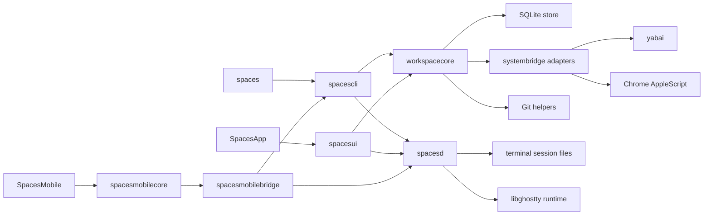
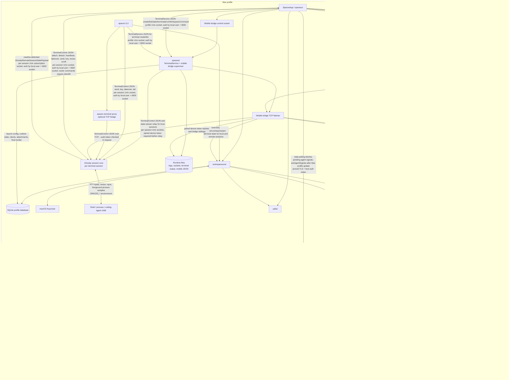

# Architecture

This document describes how Spaces is built and why: module boundaries, storage, runtime flows, external integrations, and the rationale behind the major design choices. User-visible behavior belongs in [spec.md](spec.md). Built-in terminal architecture and implementation details live in [terminal.md](terminal.md); this document names terminal modules only where they connect to the broader system.

## System Overview
Spaces is a macOS Swift app and CLI built around a shared orchestration layer.

Core invariants:
- SQLite is the single source of truth for persisted model data and global preferences.
- yabai is the source of truth for window IDs and cross-app window focus.
- Workspace settings are seeded from project templates at workspace creation and preserved as per-workspace overrides after that.
- Store startup accepts only the current app schema and fails closed for unsupported schema versions.
- GUI and CLI both call the same orchestration layer instead of re-implementing behavior independently.

## Module Map

## Runtime Process Communication

- `spacesd` is per profile. On macOS it always serves the profile Unix socket; when `SPACESD_LISTEN_PORT` is set it also serves the pinned-TLS TerminalService endpoint used by compute hosts and requires a non-empty `SPACESD_AUTH_TOKEN`.
- The mobile bridge is hosted inside `spacesd`. Its control socket is local-only and used by the Mac UI to inspect bridge status, open pairing windows, revoke devices, and rotate pairing state.
- Mobile bridge transport has two authentication layers: TLS-PSK proves possession of the pairing transport key from the QR/deep link, and the per-device auth token proves a paired first-party iOS installation. Tokens are stored only as hashes in the profile runtime.
- Mobile bridge latency shaping applies configured delay and throughput limits to discrete request/response sends and stream-final sends. Normal terminal state-stream relay frames remain ordered but are not individually delayed or throttled, so high-output terminal streams do not accumulate an artificial stop-and-wait backlog under constrained-profile tests.
- Remote mobile terminal credentials are provisioned through the authenticated Mac bridge after pairing. The Mac asks each configured remote daemon to mint a terminal-only token for the iOS installation, includes that scoped token with the pinned daemon endpoint in authorized mobile overview payloads, and never serializes the compute-host admin token.
- Remote `spacesd` transport has two authentication layers: clients pin the daemon's self-signed certificate fingerprint from `compute_hosts.daemon_certificate_fingerprint`, then include an accepted bearer token in each TerminalService request. Mac-side orchestration uses the host auth token from Keychain or the host-specific `SPACESD_AUTH_TOKEN_<HOST_ID>` environment override. iOS direct terminal access uses a scoped mobile token minted by the remote daemon for the paired installation; the remote daemon stores only token hashes and rejects that token for workspace, profile, shutdown, create, and other admin/runtime mutation commands.
- iOS direct remote terminal control uses one serialized pinned-TLS command channel per daemon endpoint. Non-stream TerminalService requests are newline-framed on that channel and must receive the expected response shape, such as `controlResponse` for control commands or `sessionState` for explicit state reads. Live render and ownership updates are delivered by the separate direct `subscribe` stream, so input, key, resize, and scroll control responses do not carry session snapshots.
- Local Unix socket transports rely on profile-scoped paths under `/tmp/spaces-terminal-sockets` and `0600` permissions. They are not cross-user or cross-profile APIs.
- Bonjour advertises only discoverability metadata for the mobile bridge. It is not used for trust or authorization.
- `spaces terminal proxy` is an explicit CLI-run TCP bridge for one terminal session. It forwards TerminalControl JSON to the local per-session socket and requires the configured shared token.

## Module Responsibilities
- `SpacesApp`: minimal app entry point that boots AppKit.
- `spacesd`: per-profile background executable for local and remote built-in terminal sessions plus the first-party mobile bridge; terminal behavior lives in [terminal.md](terminal.md).
- `spacesui`: AppKit UI layer that renders state and dispatches actions into `workspacecore`. Shared visual language lives in `Theme.swift` (brand color tokens mirroring `apps/web/app/globals.css`) and `RowPrimitives.swift` (status dot, type icon/text tile, shortcut/project/branch chips, `ColoredBackgroundView` helper). The workspace detail pane is a single scrollable `NSStackView`; it stacks the header, directory meta row, inline notes editor, and five configuration sections (Processes, Browser sessions, Coding agents, Named ports, Stop script) in order. Each section is a self-contained class (e.g. `ProcessesSection.swift`) that owns its transient form state, swaps each row between collapsed and editing subviews via `NSAnimationContext`, and publishes commits through an `onCommit` closure that the host bridges to `orchestrator.updateWorkspaceSettings`. Named-port rows render the configured env-var name plus the currently reserved port number from `workspace_ports`, mirroring how browser-session rows separate configured input from resolved display output. The `⋯` overflow menu is built by the static `AppKitController.makeWorkspaceOverflowMenu(workspaceID:path:target:)`, which emits a stock `NSMenu` whose path-based items forward to `copyDirectoryPath(_:)` and `revealDirectoryInFinder(_:)`, while workspace actions use the same shared `senderIdentifier(_:)` helper for `NSMenuItem` and `NSControl` senders. Update delivery also lives here: `AppKitController` owns a programmatic `SPUStandardUpdaterController` from Sparkle, wires the application menu’s `Check for Updates...` item directly to Sparkle, and relies on one stable appcast feed configured in the app bundle metadata. That stable feed serves one universal Sparkle archive and one manual-download DMG rather than arch-specific release artifacts.
- `spaces`: executable shim that boots the declarative CLI parser.
- `spacescli`: declarative `swift-argument-parser` command tree for `spaces`, including command help, leaf validation, translation from CLI inputs into orchestration calls, terminal and mobile subcommands, and profile or desktop-control inspection helpers used by dev and real-system workflows.
- `spacesterminalcore`: shared terminal runtime primitives and protocols; the built-in terminal control, persistence, rendering, and CLI-tail details live in [terminal.md](terminal.md).
- `spacesmobilecore`: first-party mobile bridge request and response types shared between the macOS bridge and the iOS client. The shared DTOs expose project summaries, workspace summaries, configured process rows, coding-agent rows, workspace-terminal rows, run-state values, agent activity values, workspace-creation options, mutation outputs, and legacy decode defaults without depending on `workspacecore`.
- `spacesmobilebridge`: daemon and CLI-hosted first-party TLS-PSK bridge for the iOS client. It assembles mobile overview data from `workspacecore` records and spacesd session catalogs, and routes authenticated mutation commands back through the same orchestration paths used by macOS. Terminal transport behavior lives in [terminal.md](terminal.md).
- `spacesruntimecore`: daemon-safe runtime helpers that avoid workspace, UI, Keychain, Bonjour, and AppKit dependencies. Remote daemon worktree preparation uses this target for Git command execution and fast-forward-only refresh checks.
- `spacesterminalmobileghostty`: iOS terminal adapter for Ghostty-backed mobile rendering and input mapping; details live in [terminal.md](terminal.md).
- `spacesterminalghostty`: embedded libghostty integration and app-side host adapters; details live in [terminal.md](terminal.md).
- `spacesterminalui`: native terminal-session window controllers owned by the Spaces app; details live in [terminal.md](terminal.md).
- `workspacecore`: core orchestration, lifecycle, validation, persistence coordination, environment building, and the shared `AppVersion` constants consumed by both the GUI and CLI. Those constants are generated from `apps/macos/AppVersion.plist`, which is also used to generate the app bundle `Info.plist`.
- `systembridge`: system adapters for shell commands, yabai, Chrome, and related OS integrations.

### Terminal Architecture Reference
- Built-in terminal ownership, session layout, Ghostty compatibility, macOS and iOS rendering, mobile bridge behavior, scroll rendering, CLI controls, and terminal validation live in [terminal.md](terminal.md). This document references terminal modules only where they connect to non-terminal systems.
- Ghostty action callbacks are decoded into typed events before reaching UI surfaces. `OPEN_URL` is handled only as terminal link opening, and `MOUSE_OVER_LINK` drives pointer affordance. App, window, tab, and config actions remain outside Spaces' terminal surface contract.
- macOS terminal link opening converts `http` and `https` strings to URL opens, and converts `file://` plus absolute filesystem paths to file URLs before handing them to the system workspace opener.
- The iOS Ghostty mirror registers a per-surface action handler. A terminal tap is first offered to Ghostty at the tapped cell coordinate so Ghostty can emit an `OPEN_URL` action for detected links; taps without a detected link continue through the normal input-focus path.

### Mobile Workspace Bridge
- Mobile overview construction reads projects, non-archived workspaces, workspace settings, running-process records, agent-window records, tracked terminal windows, and live terminal sessions. The builder returns project summaries plus per-workspace runtime rows that are safe for local filtering by row type, run state, and search text.
- Process rows are keyed by configured process identity and annotate live or exited runtime when a matching running-process record exists. Coding-agent rows keep configured launcher slots stable and append unmatched live agent rows after configured rows. Workspace-terminal rows exclude terminal sessions already claimed by process or agent runtime records.
- Mutation responses carry `ok`, a user-facing message, a refreshed overview, and action-specific identifiers such as `workspaceID` or `sessionID`. The refreshed overview keeps iOS state synchronized after create, run, stop, restart, or terminal-open actions without requiring the client to infer affected rows.
- Workspace creation requests use the same project and git semantics as the macOS GUI. The bridge supplies per-project creation options and accepts title, branch mode, branch name, target branch, optional directory name, and existing-branch reuse intent.
- Mobile workspace-terminal creation reserves and finishes a service-owned terminal session at the workspace root while using a no-op native window opener. This keeps the Mac window layer out of mobile-only terminal creation.
- Mobile workspace-terminal stop requests pass workspace ID and session ID into workspacecore's ad hoc built-in terminal stop path. The path rejects process- and agent-owned sessions, terminates the matching service session, removes tracked terminal rows, and can resolve live sessions by working directory when a tracked window row is already gone.
- Mobile process mutations call configured-process recovery for missing runtimes and running-process stop or restart for live runtimes.
- Mobile coding-agent mutations call the workspace agent lifecycle methods. Stop removes runtime state and terminates the backing Spaces terminal session while preserving configured launchers. Restart resolves the claimed or configured launcher ID first, falls back to launcher names only for records without an ID claim, and launches that configured row again.
- Mobile app recovery is hosted inside `spacesmobilebridge` because the daemon bridge remains reachable when `SpacesApp` has quit while `spacesd` is still running. Only the daemon-hosted bridge installs the recovery launcher; standalone `spacese2e mobile-serve` bridges reject `launchSpacesApp` because they do not have a spacesd executable context. The launcher checks `SpacesLeaseCoordinator.currentProfileAppOwner(profile:)` before spawning and treats an existing owner as success, so the command is launch-if-needed rather than force-relaunch.
- `SpacesApp` recovery resolves executables from the running service location only: sibling `SpacesApp` for SwiftPM builds, the app bundle's `Contents/MacOS/SpacesApp` when the service is in `Contents/Resources`, `/Applications/Spaces.app/Contents/MacOS/SpacesApp` for `/usr/local/bin/spacesd`, and `~/Applications/Spaces.app/Contents/MacOS/SpacesApp` for `~/.local/bin/spacesd`. The resolver intentionally avoids process-name scans, current-directory searches, `open`, service restarts, and relaunch fallbacks so recovery stays scoped to the intended install relationship.
- Terminal link preview uses authenticated bridge commands. `resolveTerminalLink` classifies direct HTTPS URLs or readable Mac files and returns metadata for image and video media; `readTerminalLinkChunk` streams approved local files by stable link ID and byte range. Relative paths resolve against the session working directory, `~` resolves to the Mac user home directory, and resolved paths must be regular readable files. The bridge records a short-lived in-memory approval for each resolved local link, chunk reads require an exact link ID and session match against that approval, and successful chunk reads refresh the approval while the transfer is active.
- Mac file serving for iOS previews is limited after symlink resolution. User home paths, workspace paths, `/tmp`, `/var/tmp`, `/private/tmp`, `/private/var/tmp`, `/opt`, and `/usr/local` are allowed; system and protected roots such as `/System`, `/Applications`, `/Library`, `/bin`, `/sbin`, `/usr/bin`, `/usr/sbin`, `/usr/lib`, `/usr/libexec`, `/usr/share`, `/etc`, `/dev`, `/cores`, `/Network`, `/Volumes`, `/private/etc`, `/private/var/db`, and `/private/var/root` are rejected.
- The iOS client sends preview metadata and chunk requests over a preview-specific command connection so file transfer cannot interleave with terminal input RPCs. Each preview request carries a generation token so overlapping taps cannot present stale metadata, downloads, or errors. Downloaded preview files are stored in a temporary cache keyed by a SHA-256 digest of the session and link metadata, direct HTTPS media URLs are downloaded to disk before being moved into that cache, stale direct-media downloads are cancelled on preview invalidation, and stale preview files are removed opportunistically. Preview files are presented with Quick Look. Direct non-media web URLs and cleartext HTTP URLs bypass the preview cache and open through UIKit.
- The recovery launch environment overwrites `SPACES_DB_PATH`, `SPACES_RUNTIME_DIR`, and `SPACESD_EXECUTABLE` with the current profile database path, runtime directory, and service executable path. This binds the relaunched app to the same profile and keeps app-side terminal prewarm pointed at the still-running service binary instead of deriving a different profile or service path from the app process environment.
- Native built-in terminal windows receive a workspace runtime-control provider from `spacesui`. The native window title owns the runtime name and the terminal UI owns the compact right-aligned action strip; `AppKitController` resolves the session back to a process, coding-agent, or ad hoc terminal row, preferring stable process template and coding-agent launcher IDs over user-editable names.
- User window close detaches process and coding-agent terminal windows while ad hoc terminal window close uses the ad hoc session stop path. Terminal-toolbar stop uses the process, coding-agent, or ad hoc lifecycle path for the selected runtime. Programmatic closes produced by stop or restart carry a termination marker through IPC so AppKit window cleanup does not recursively run close cleanup.
- Runtime-target refresh preserves live process-owned and agent-owned Spaces terminal sessions by service runtime state after their native window detaches. Preserved agent sessions clear dead native window IDs during refresh and rebind to the replacement native window when focused. Ad hoc terminal rows require an active or pending attachment and are pruned when their final local or remote attachment is gone.

### Compute Host Planning
- The Mac profile remains authoritative for projects, workspaces, host configuration, workspace creation, compute-host selection, and browser forwarding decisions.
- `compute_hosts` stores named remote hosts with SSH control fields, remote workspace root, daemon endpoint, and the daemon endpoint fingerprint carried to direct clients.
- `spacesd` creates or loads a profile-scoped self-signed TLS identity under the terminal runtime root's `daemon-tls` directory. Remote daemon clients verify the pinned SHA-256 certificate fingerprint from `SpacesDaemonEndpoint` during TLS handshake before sending newline-framed JSON requests with the configured host auth token. The Mac app stores generated per-host daemon auth tokens in Keychain under the active Spaces profile root and host ID; host-specific environment variables remain the automation override.
- `SSHConfigurationResolver` parses `ssh -G` output so Remote Hosts can treat the entered SSH alias as user-facing input while storing the resolved `HostName` as the internal daemon host when OpenSSH provides one.
- `RemoteSpacesArtifactManifestVerifier` verifies the signed `spaces-remote-artifacts.json` manifest from the current `v<AppVersion.short>` GitHub Release with the generated Ed25519 public key in `AppVersion.remoteArtifactPublicKey`. The manifest maps supported platforms to archive URLs and SHA-256 digests. The app rejects unsigned, mismatched-version, unsupported-platform, missing-artifact, and archive-checksum-mismatch states before a host record is saved.
- `ComputeHostBootstrapper` runs the Remote Hosts connect path over SSH with non-interactive host access and strict known-host checking. It probes `uname`, `sw_vers`, and `/etc/os-release`, selects only `spacesd-macos-universal`, `spacesd-ubuntu-24.04-x86_64`, or `spacesd-ubuntu-24.04-arm64`, verifies the signed manifest locally, checks remote tools and install-root writability, then feeds bootstrap input over stdin. A small remote shell wrapper reads the first stdin line into the token environment, then executes the install/start script from the remaining stdin. This keeps the daemon token out of local SSH argv and the remote daemon argv.
- Managed remote installs live under `~/.spaces/compute-hosts/<host-id>/daemon/releases/<artifact-version>/`. The bootstrap downloads the selected archive from the GitHub Release, verifies the archive SHA-256 from the signed manifest, verifies the archive's internal `SHA256SUMS`, updates stable `daemon/current`, `daemon/bin`, and profile `bin/spaces` symlinks, resolves the workspace root, prints the daemon TLS fingerprint, starts that managed `spacesd` with the selected port and token when the selected port is not already listening, and returns the fingerprint, workspace root, selected port, artifact version, and log metadata for the Mac app to verify with pinned TLS before saving the host.
- Remote daemon `ping` responses include daemon version, managed artifact version, daemon certificate fingerprint, and active session count. Remote Hosts uses that status for Check display, upgrade availability, certificate-pin reporting, and the idle precondition for lifecycle actions. When Upgrade is blocked by active remote sessions, the controller fetches the live session list over pinned TLS, presents those sessions in a confirmation alert, stops known process, agent, and ad hoc terminal runtimes through the existing orchestration paths, falls back to direct remote session termination for unmanaged sessions, then uses `shutdownIfIdle` over the pinned-TLS admin channel and polls until the daemon endpoint exits before installing the current artifact and relaunching through SSH with the saved daemon port required to be free. Reinstall applies the same reachable-idle shutdown before SSH setup and never terminates an existing listener from the setup script. Uninstall uses reachable-idle shutdown when available, still runs SSH cleanup when the daemon is already unreachable, and removes `daemon`, profile `bin/spaces`, upload artifacts, and the recorded PID file only after the remote pid and port checks confirm the daemon is stopped; profile data, workspace roots, and remote worktrees stay in place.
- Remote artifact archives contain `bin/spacesd`, `bin/spaces`, `manifest.json`, and `SHA256SUMS`. Ubuntu archives also carry `spacesd-bin`, `libghostty-vt`, and Swift runtime libraries needed on stock Ubuntu 24.04 so headless Ghostty rendering does not require a display server or Swift toolchain installation on the host.
- `compute_hosts` includes the first-class local Mac host record with ID `local`.
- `workspaces.host_id` stores immutable host assignment, and `workspaces.runtime_path` stores the runtime path used by that workspace on its assigned host.
- `ComputeHostPlanner` owns deterministic selection and manifest planning from the workspace host ID; remote daemon targets carry endpoint metadata, and local daemon targets use the profile service socket.
- Runtime manifests carry workspace ID, project ID, location, local path, remote path, branch, target branch, Git remote URL, named ports, process environment, and allowed file roots. The Mac sends that manifest to the selected remote daemon before launch.
- Remote workspace setup scripts, configured processes, coding-agent launchers, ad hoc terminals, and stop scripts are sent to the selected `spacesd` endpoint with the runtime manifest and fast-forward refresh request. Synchronous workspace command logs are allocated under the daemon terminal runtime, and daemon/listener token environment keys are scrubbed from launched child commands. The Mac persists the returned daemon session IDs and log paths in the same process, agent, and window records used for local sessions. Daemon ownership for those records is resolved from the workspace host at operation time; `runtime_target_id` remains reserved for UI and window focus targets.
- Remote configured process and coding-agent launch paths mirror returned terminal launch, runtime, attachment, and render-state metadata into the Mac profile before opening a native owner window. The native window resolves the workspace's effective daemon endpoint at open time and sends attach, takeover, input, resize, scroll, and state refresh requests to that endpoint while keeping the Mac-side terminal tables as a local mirror for window chrome, ownership UI, and ended-session reopening.
- Remote `spaces agent signal` events are queued by the remote daemon with the terminal session identity and workspace manifest context. Mac remote terminal windows fetch pending signal events during state refresh, apply them to the Mac profile's coding-agent rows, and acknowledge only the events that were handled so remote agent lifecycle state remains database-backed.
- Remote `spacesd` requires a runtime manifest for workspace commands and worktree refreshes, validates working directories against manifest allowed roots, clones a missing empty Git worktree from the provided remote URL and branch, refreshes existing worktrees through the fast-forward-only `RemoteWorkspaceGitClient` path in `spacesruntimecore`, starts Ghostty-backed sessions, and runs synchronous workspace commands with daemon-side logs. Existing non-empty non-Git paths, dirty worktrees, missing branches, divergent histories, overwrite risks, fetch failures, and checkout failures block execution instead of resetting or cleaning remote state.
- Remote worktree refresh is modeled as a fast-forward-only preflight. `RemoteWorkspaceGitClient.refreshWorktreeFastForwardOnly` fetches the workspace branch, checks for tracked dirty state and untracked overwrite risks, requires `HEAD` to be an ancestor of `origin/<branch>`, and advances with `merge --ff-only`. `RemoteWorkspaceRefreshBlock` reports dirty worktrees, overwrite risks, divergent histories, missing branches, fetch failures, and checkout failures with host, path, branch, and guidance. Destructive repair paths such as reset, stash, forced checkout, or cleanup are outside the launch path.
- The mobile overview builder attaches terminal ownership metadata to process rows, coding-agent rows, workspace terminal rows, and terminal session summaries. The Mac bridge remains the metadata and mutation authority. Remote terminal detail requests go directly from iOS to the daemon that owns the session with the scoped terminal credential provisioned through the Mac bridge.
- Direct remote terminal latency measurement keeps the command channel open across samples, validates direct response shape per command, and avoids readiness probes that enqueue state responses ahead of input/control commands. The visible-latency metric is therefore command enqueue to subscribed render visibility, with `direct_command_request` reporting only the direct pinned-TLS command round trip.
- Terminal link preview resolution lives in `spacesmobilecore` so the owning local or remote daemon can resolve file and external media links without importing the Mac mobile bridge server. Remote `spacesd` terminal service commands are scoped to terminal/session/preview operations. Project, workspace, host, and lifecycle mutations continue to enter through the Mac bridge, which resolves the effective host and forwards launch or stop requests through the compute-host runtime path.
- Editor integration derives Remote SSH URIs from host SSH metadata and the bound remote path.
- The product `spaces` CLI exposes grouped project, workspace, agent, terminal, and MCP commands. Workspace creation requires explicit project, branch, and host IDs. Grouped CLI commands and `spaces mcp` send explicit profile commands to the adjacent Mac `spacesd` over the profile service socket. MCP exposes project, workspace, and terminal list/tail/send tools; terminal send forwards either UTF-8 text or validated raw bytes through the same daemon-owned control path. Agent lifecycle signaling remains a CLI-only hook path. `spaces import` is not a public command because workspace creation creates profile state, port allocations, and setup state rather than passively discovering a directory. Automation setup, host selection, and runtime-plan inspection for compute hosts belong in `spacese2e`.

## Persistence

### Database
- Installed/default path: `~/.spaces/spaces.db`
- Repo-local development default path: `~/.spaces-dev/profiles/spaces/<branch-slug>-<worktree-hash>/spaces.db`
- SQLite stores projects, workspaces, runtime state, terminal metadata, and global settings.
- SQLite should run in WAL mode with a busy timeout so overlapping GUI, CLI, and background work does not produce avoidable lock failures.
- `migration_state.current_version` records the canonical schema version. The active schema is version `1`.
- `PRAGMA user_version` is not used by Spaces for migration control; if present, treat it as informational only and keep it aligned with `migration_state` when inspecting or repairing a database manually.

### Profile Resolution
- `SPACES_DB_PATH` wins when it is set for the current process.
- Otherwise repo-local development binaries derive one profile root from the current git branch plus the canonical worktree path.
- Installed binaries and non-dev fall back to `~/.spaces/`.
- The default runtime root is `<profile-root>/runtime`, unless `SPACES_RUNTIME_DIR` overrides it explicitly.
- Distributed notification IPC uses one profile-scoped object token derived from the resolved profile root so app, CLI, and E2E helpers only talk to the matching profile instance.

### App Ownership and Desktop Control
- App launch acquires one per-profile owner lease before the store, IPC observers, hotkeys, or windows are created.
- Duplicate app launch for the same profile fails fast and reports the existing owner pid, executable path, and profile root.
- Desktop-global control such as Carbon hotkey registration uses a separate user-global lease shared by every profile.
- When another profile already owns that lease, the second app loads normally in passive mode, keeps local in-app shortcuts, and suppresses desktop-global listeners until the lease becomes available.

### Migration Rules
- Fresh installs create the latest schema directly and record the current schema version.
- Store startup validates `migration_state.current_version` against the canonical schema version and fails closed when they do not match.
- There is no compatibility migration ladder for retired schema versions.
- Startup runs `PRAGMA integrity_check` and fails if validation does not return `ok`.

## Data Model

The canonical schema is `DatabaseSchema.currentVersion == 1`. Foreign keys below reflect the SQLite schema. Terminal tables also correlate by `session_id` and `root_directory` because they are shared by local and daemon-hosted terminal persistence paths.

```mermaid
erDiagram
  projects {
    TEXT id PK
    TEXT name
    TEXT dir
    INTEGER is_git
    TEXT default_branch
    INTEGER is_collapsed
    TEXT setup_script
    TEXT stop_script
  }

  project_port_definitions {
    TEXT id
    TEXT project_id PK
    TEXT name
    INTEGER order_index PK
  }

  project_processes {
    TEXT id PK
    TEXT project_id FK
    TEXT name
    TEXT command
    TEXT on_exit
    INTEGER order_index
  }

  project_browser_sessions {
    TEXT project_id PK
    TEXT name
    TEXT url
    INTEGER order_index PK
  }

  project_agent_launchers {
    TEXT project_id PK
    TEXT id
    TEXT name
    TEXT command
    INTEGER order_index PK
  }

  workspaces {
    TEXT id PK
    TEXT project_id FK
    TEXT host_id FK
    TEXT title
    TEXT dir
    TEXT runtime_path
    TEXT dirname
    TEXT branch
    TEXT target_branch
    INTEGER is_default
    INTEGER is_archived
    INTEGER is_hidden
    INTEGER is_running
    TEXT last_launched_at
    TEXT notes
  }

  workspace_ports {
    TEXT workspace_id PK
    INTEGER port_index PK
    INTEGER port_number
    TEXT port_name
    TEXT definition_id
  }

  workspace_port_definitions {
    TEXT id
    TEXT workspace_id PK
    TEXT name
    INTEGER order_index PK
  }

  workspace_settings {
    TEXT workspace_id PK
    TEXT stop_script
    TEXT setup_status
    TEXT setup_error
    TEXT setup_started_at
    TEXT setup_finished_at
    INTEGER setup_exit_code
    TEXT setup_log_path
  }

  workspace_processes {
    TEXT id PK
    TEXT workspace_id FK
    TEXT name
    TEXT command
    TEXT on_exit
    INTEGER order_index
  }

  workspace_browser_sessions {
    TEXT workspace_id PK
    TEXT name
    TEXT url
    TEXT extracted_target_url
    INTEGER extracted_window_id
    INTEGER extracted_window_valid
    INTEGER order_index PK
  }

  workspace_agent_launchers {
    TEXT workspace_id PK
    TEXT id
    TEXT name
    TEXT command
    INTEGER order_index PK
  }

  running_processes {
    TEXT id PK
    TEXT workspace_id FK
    TEXT template_id
    TEXT template_name
    TEXT command
    TEXT runtime_target_id FK
    TEXT terminal_session_id
    INTEGER pid
    TEXT status
    TEXT log_path
    TEXT last_output_at
    TEXT started_at
    TEXT exited_at
  }

  runtime_targets {
    TEXT id PK
    TEXT workspace_id FK
    TEXT type
    TEXT name
    TEXT detail
    TEXT app
    INTEGER window_id
    TEXT tracking_id
    INTEGER order_index
    TEXT created_at
    TEXT updated_at
  }

  browser_targets {
    TEXT runtime_target_id PK
    TEXT target_url
    TEXT resolved_url
  }

  agent_sessions {
    TEXT id PK
    TEXT workspace_id FK
    TEXT provider
    TEXT label
    TEXT status
    TEXT runtime_target_id FK
    TEXT terminal_session_id
    TEXT session_key
    TEXT claimed_launcher_id
    TEXT claimed_launcher_name
    TEXT created_at
    TEXT updated_at
  }

  runtime_target_events {
    TEXT id PK
    TEXT runtime_target_id FK
    TEXT event_type
    TEXT source
    TEXT message
    INTEGER window_id
    TEXT created_at
  }

  agent_session_events {
    TEXT id PK
    TEXT agent_session_id FK
    TEXT event_type
    TEXT source
    TEXT message
    TEXT runtime_target_id FK
    TEXT created_at
  }

  compute_hosts {
    TEXT id PK
    TEXT name
    TEXT kind
    TEXT ssh_host
    TEXT ssh_user
    INTEGER ssh_port
    TEXT workspace_root
    TEXT daemon_host
    INTEGER daemon_port
    TEXT daemon_certificate_fingerprint
    TEXT created_at
    TEXT updated_at
  }

  terminal_sessions {
    TEXT session_id PK
    TEXT root_directory
    TEXT backend
    TEXT lifetime_policy
    TEXT workspace_id
    TEXT kind
    TEXT title
    TEXT working_directory
    TEXT shell
    TEXT command
    TEXT created_at
  }

  terminal_runtime_states {
    TEXT session_id PK
    TEXT root_directory
    TEXT backend
    INTEGER service_pid
    INTEGER child_pid
    TEXT title
    TEXT working_directory
    INTEGER columns
    INTEGER rows
    TEXT state
    TEXT updated_at
    TEXT exited_at
    INTEGER foreground_pid
    TEXT foreground_executable_path
    TEXT foreground_executable_name
    TEXT foreground_argv_json
    TEXT foreground_detected_agent_kind
    TEXT foreground_display_label
    TEXT foreground_display_command
  }

  terminal_clients {
    TEXT root_directory PK
    TEXT session_id
    TEXT client_id PK
    TEXT kind
    TEXT identity_label
    TEXT identity_host_name
    TEXT identity_device_name
    TEXT identity_network_address
    TEXT connected_at
    TEXT lease_refreshed_at
    TEXT disconnected_at
  }

  terminal_attachments {
    TEXT id PK
    TEXT root_directory
    TEXT session_id
    TEXT client_id
    TEXT mode
    TEXT attached_at
    TEXT detached_at
  }

  terminal_window_frames {
    TEXT root_directory PK
    TEXT session_id
    TEXT mode PK
    REAL x
    REAL y
    REAL width
    REAL height
    TEXT updated_at
  }

  terminal_remote_session_states {
    TEXT session_id PK
    TEXT root_directory
    TEXT reason
    TEXT payload_json
    TEXT emitted_at
    TEXT updated_at
  }

  terminal_agent_signal_events {
    TEXT id PK
    TEXT root_directory
    TEXT session_id
    TEXT event_type
    TEXT workspace_id
    TEXT workspace_path
    TEXT provider
    TEXT label
    TEXT terminal_tracking_id
    TEXT terminal_native_id
    TEXT codex_thread_id
    TEXT environment_keys_json
    TEXT created_at
    TEXT acknowledged_at
  }

  ignored_worktrees {
    TEXT worktree_dir PK
    TEXT project_id FK
  }

  settings {
    TEXT key PK
    TEXT value
  }

  migration_state {
    INTEGER current_version
  }

  projects ||--o{ project_port_definitions : owns
  projects ||--o{ project_processes : owns
  projects ||--o{ project_browser_sessions : owns
  projects ||--o{ project_agent_launchers : owns
  projects ||--o{ workspaces : owns
  projects ||--o{ ignored_worktrees : owns
  compute_hosts ||--o{ workspaces : owns_runtime
  workspaces ||--o{ workspace_ports : allocates
  workspaces ||--o{ workspace_port_definitions : configures
  workspaces ||--o| workspace_settings : has
  workspaces ||--o{ workspace_processes : configures
  workspaces ||--o{ workspace_browser_sessions : configures
  workspaces ||--o{ workspace_agent_launchers : configures
  workspaces ||--o{ running_processes : runs
  workspaces ||--o{ runtime_targets : tracks
  workspaces ||--o{ agent_sessions : tracks
  workspaces ||--o{ terminal_sessions : logical_owner
  runtime_targets ||--o| browser_targets : extends
  runtime_targets ||--o{ runtime_target_events : records
  runtime_targets ||--o{ running_processes : focus_target
  runtime_targets ||--o{ agent_sessions : focus_target
  runtime_targets ||--o{ agent_session_events : referenced_by
  agent_sessions ||--o{ agent_session_events : records
  terminal_sessions ||--o| terminal_runtime_states : state
  terminal_sessions ||--o{ terminal_clients : clients
  terminal_sessions ||--o{ terminal_attachments : attachments
  terminal_sessions ||--o{ terminal_window_frames : frames
  terminal_sessions ||--o| terminal_remote_session_states : final_render
  terminal_sessions ||--o{ terminal_agent_signal_events : pending_signals
```

Notable uniqueness outside primary keys:
- `projects.dir` and `compute_hosts.name` are unique.
- `workspaces(project_id, branch, host_id)` is unique for active non-empty branch names.
- `terminal_sessions.root_directory`, `terminal_runtime_states.root_directory`, and `terminal_remote_session_states.root_directory` are unique.
- `terminal_attachments` enforces at most one active owner per root and at most one active attachment per root/client pair through partial unique indexes.

### Projects
Projects persist:
- opaque project identity separate from filesystem paths
- source directory and git status
- sidebar collapsed state
- setup and stop scripts
- port definitions
- process templates
- browser-session templates
- coding-agent launcher templates

Managed clone directories under `~/spaces/repos` and managed worktree roots under `~/spaces/workspaces` must be keyed by project identity rather than project name so cleanup, retries, and same-name projects cannot collide on disk ownership. Prepared Git imports persist normalized clone paths by resolving managed-root parents while replacement checks operate on the managed entry path. Replacement of existing managed folders is limited to entries inside those managed roots, and only when SQLite has no project or workspace owner at or beneath the entry or its resolved target. The ownership check runs during preflight and immediately before deletion so a folder that becomes database-owned is preserved. Discarding an unsaved prepared Git import also rechecks ownership before cleanup and skips paths that were registered by another process. Symlinked managed entries are unlinked at the managed path instead of following the link target, but replacement candidates below symlinked ancestors inside a managed root are rejected. Replacing an orphaned managed worktree clears any matching Git worktree registration before the folder is removed, pruning stale metadata when Git reports a corrupted or missing working tree.

Project configuration can also be represented as `spaces.yaml` through GUI-only import/export in `workspacecore`. The file is resolved from the default workspace directory: local projects use the project directory, while app-managed Git projects use the checked-out default worktree. The YAML document uses schema version `1`, treats a missing `version` as `1`, rejects versions greater than the supported schema version, and omits internal database IDs. Missing optional keys decode to app-state defaults without rewriting the source file.

The YAML schema contains:
- `version`
- `setup_script`
- `stop_script`
- `ports[].name`
- `processes[].name`, `processes[].command`, `processes[].on_exit`
- `browser_sessions[].name`, `browser_sessions[].url`
- `agent_launchers[].name`, `agent_launchers[].command`

Import uses the same project/workspace normalization paths as GUI saves so existing port, process, and coding-agent launcher IDs are preserved by name or command where possible. GUI project creation previews a local directory by loading `spaces.yaml` into a project template before persistence, then saves the reviewed settings into the project and default workspace from the visible form snapshot without re-reading `spaces.yaml`. Git project creation prepares an app-managed bare clone plus default worktree before persistence, loads `spaces.yaml` from that worktree into the reviewed settings, and persists the prepared project only after the user saves; save-time validation failures keep the prepared source staged for retry, while explicit cancel, replacing the prepared source, or quitting with the form active removes the unmanaged clone and worktree. Async cleanup tasks are registered by trimmed Git URL, and preparation awaits any registered cleanup for that URL before touching the deterministic managed paths. If an unmanaged prepared clone or worktree is still present for the same Git URL, preparation treats it as abandoned state, removes the replaceable managed directories, and clones again so retrying the URL refreshes the loaded settings instead of failing on existing paths. Local and Git preparation results are accepted only while the originating add-project form and source segment remain active, and source hydration replaces open script editors and row section drafts so the visible settings match the selected source. Existing-project GUI import validates `spaces.yaml`, projects it through the normal configuration normalization path, and hydrates the visible project-settings sections without writing to SQLite; hydration uses the row-section replace path so import and discard clear stale inline editors and pending drafts before rendering the imported or saved rows. The imported state is tracked on the project form refs, and Save prompts for whether to apply the visible template to every workspace before calling the normal project update path. The workspace-sync save choice uses the same snapshot/rollback path as direct import when applying the visible template to every workspace. The direct core import API keeps `spaces.yaml` authoritative for compatibility, and invalid YAML still uses the managed-project rollback path. Export encodes the saved project template with Yams' Codable encoder and overwrites `spaces.yaml`.

### Workspaces
Workspaces persist:
- directory identity
- title, notes, and branch metadata
- branch identity as the unique git-workspace key, while titles remain non-unique display text
- default and archived flags
- hidden sidebar visibility state
- explicit lifecycle state (`running` vs `stopped`)
- nullable compute-host override
- seeded per-workspace copies of launch-time settings, including port definitions, process rows, browser sessions, agent launchers, stop script, and setup result metadata

### Runtime Records
Runtime state persists separately from project and workspace templates:
- allocated ports
- running processes
- runtime targets
- terminal target details
- terminal session metadata, client attachments, runtime state, and remote final render-state payloads
- remote terminal agent-signal queue entries
- browser target details
- agent sessions
- compute-host records and per-workspace remote path bindings

This separation lets template edits coexist with current runtime state and per-workspace overrides.
It also lets lifecycle state stay explicit while runtime health is derived from the current runtime records.

### Runtime Target Model
- `runtime_targets` is the canonical inventory of focusable runtime items for a workspace. Each row stores shared fields such as `type`, host app, current yabai `window_id`, durable terminal `tracking_id`, ordering, and display metadata.
- `browser_targets` extends browser runtime targets with the configured target URL and the last resolved URL.
- `agent_sessions` models logical coding-agent sessions separately from focusable windows. Each row links to a `runtime_target` when the session is focusable and stores agent-session state: provider, display label, status, provider session key, claimed launcher identity, durable Spaces `terminal_session_id`, and timestamps.
- `agent_session_events` records signal-driven lifecycle updates and launcher-driven agent transitions. Lifecycle events keep the resolved runtime-target link plus a compact message containing the provider, label, tracking token, native terminal ID, provider session key, yabai window ID, and the full set of environment key names seen by `spaces agent signal` for that event.
- `running_processes` is the canonical process-status record. Each row links to a `runtime_target` when focusable and stores process runtime state such as template identity, command, PID, status, log path, durable Spaces `terminal_session_id`, and timestamps.
- Runtime targets are seeded as soon as a process or agent terminal is known, even before a separate window-reconciliation pass fills in a live yabai `window_id`. That keeps process and agent rows linked to a single canonical target instead of caching terminal identity on the base row.
- Configured process and coding-agent rows group by their reserved workspace slot and use `terminal_session_id` as the durable Spaces terminal session identity for focus, restart, final-frame viewing, and mobile overview. The linked runtime target's `tracking_id` mirrors the focusable terminal target while a window or terminal target exists. Replacement launch paths terminate and close the prior Spaces-backed session before deleting or rebinding the runtime row, which prevents orphaned configured sessions from reappearing as ad-hoc mobile rows. Exit and missing-window prune paths preserve configured coding-agent rows and their `terminal_session_id`; ad-hoc agent rows remain tied to their tracked terminal target and are removed when that target disappears.

### Data Modeling Guidelines
- Base tables should stay generic. If a field only makes sense for one provider or feature family, it should live on an adapter-specific runtime path rather than on a cross-cutting base record.
- `runtime_targets` is the shared focus inventory. It owns transient window identity and focus metadata, while process and agent rows own their configured slot state.
- The `terminal_session_id` columns on `running_processes` and `agent_sessions` are deliberate durable Spaces session ownership fields. Keep them aligned with the matching Spaces terminal launch and use `runtime_targets.tracking_id` for focus/window correlation.
- Agent-session records should describe logical session state, not terminal rendering implementation details. Provider-specific terminal metadata should stay in terminal persistence or event payloads unless the configured row needs a stable session identity.
- Running-process records should describe process runtime and configured slot ownership, not terminal rendering internals. Process rows should link to the relevant runtime target for focus behavior instead of owning window-specific fields.
- When a process or agent needs focus identity before yabai has reconciled a live window, seed or reuse a `runtime_target` record. When it needs durable final-frame or restart identity, persist the Spaces terminal session ID on the process or agent row.
- Provider-specific naming should be avoided in shared schema. Generic fields such as `provider` and `session_key` are acceptable when the same concept exists across providers; fields named for one product should be treated as transitional and refactored away.
- Add abstractions only when current behavior needs them. Extensibility matters, but speculative tables or fields should not be added before a real workflow requires them.
- Prefer event history for debugging destructive transitions over piling more `last_*` and `*_reason` fields onto canonical state rows. When a target or session is rebound, detached, or pruned, the system should leave an inspectable event trail.
- Distinguish the durable Spaces session identity used for replay, focus, and runtime correlation from transient window IDs that yabai may refresh over time.
- Persist final render-state payloads by terminal session ID. Those rows are independent of live control sockets so ended sessions can be reopened by stable identity without replaying `output.log`.

### Referential Integrity
- SQLite foreign keys stay enabled for persisted parent-child relationships.
- Store-level delete-and-reinsert updates run inside immediate transactions so partial child-table replacements cannot persist if one statement fails.

## Core Flows

### Workspace Creation
1. Resolve the target project and workspace identity.
2. For git projects, treat `Create branch` as a strictly new-branch flow and reject any branch name that already exists locally, remotely, or in an archived workspace record; only the explicit existing-branch path may reuse that branch and revive its archived workspace.
3. Create or import the workspace directory.
4. Persist the workspace and seed per-workspace settings from project templates.
5. Allocate named ports.
6. Run setup logic. Setup executes through `/bin/bash -lc`, writes merged stdout and stderr to `<profile-runtime>/workspace-setup/<workspace-id>/setup.log`, and records setup status, timestamps, exit code, and log path in `workspace_settings`.

### Workspace Launch
1. Validate that the workspace is launchable.
2. Require workspace setup status to be `succeeded`; pending, running, or failed setup blocks managed runtime launch and recovery paths.
3. Build the workspace environment, including named port variables and workspace paths.
4. Close and terminate any prior Spaces-backed configured process sessions that occupy the same workspace slots.
5. Start tracked processes inside dedicated built-in terminal sessions, wait for the session boundary to become available, and then record the terminal row plus runtime state.
6. Leave configured browser sessions unopened until the user focuses them.
7. Capture new terminal windows through yabai and persist the mapping.

### Workspace Stop or Archive
1. Stop tracked processes.
2. Run the workspace stop script when appropriate.
3. Close tracked dedicated windows safely.
4. Clear runtime state.
5. Release ports.
6. Archive git worktrees when the action requires it.
7. When the user opted in during archive confirmation, attempt remote-branch deletion first and local-branch deletion second, then surface any skipped or failed branch cleanup as a post-archive notice instead of rolling back the archive.

### Discovery and Reconciliation
- Background worktree discovery imports valid unmanaged worktrees for known projects.
- Background reconciliation removes stale tracked windows and refreshes persisted workspace metadata from disk where needed.
- Saving workspace settings updates persisted configuration and synchronizes named-port reservations, but it does not reconcile live runtime by auto-starting or auto-stopping processes, browser sessions, or coding agents.
- Reconciliation may degrade runtime health, but it should not silently promote or demote workspace lifecycle state.
- Sidebar snapshot refresh can update the backing lists in the background without rebuilding the active detail pane when the current selection is still valid.
- These passes should not block the main UI thread.

## Environment and Process Model
- Named port definitions are allocated per workspace and exposed as environment variables. Workspace-settings saves preserve existing allocations where possible, allocate newly added definitions immediately, and release removed definitions without waiting for the next launch.
- Workspace processes also receive stable environment variables such as project and workspace directories.
- Setup scripts, stop scripts, and process commands all execute against the workspace-specific environment.
- Built-in `Spaces` terminal sessions own their process lifetime directly through the session backend for launch, stop, recovery, and reopen.
- Configured process restart closes the old native Spaces terminal window and terminates the old service session before the replacement session is recorded as current. The process row remains the configured slot; the terminal session identity changes only through that explicit replacement path.
- Immediate process-start failures should be surfaced from the recent built-in session output itself so launch errors report the real command failure instead of a follow-on recovery error.
- Core external dependencies that the GUI invokes directly, such as `yabai` and `git`, are resolved through a shared executable-locator path instead of relying on the Finder app environment to provide a complete `PATH`.
- Global app settings also store the app-toggle hotkey and the separate command-palette hotkey.
- Global settings also store the shared window focus pulse color and enabled state behind window-scoped keys.
- Each `ProcessTemplate` stores name, command, kind, and on-exit behavior. Legacy persisted `execution_mode` data is ignored.
- Process commands are validated as non-empty shell command strings.
- Process launch exports the workspace environment, including named ports and `SPACES_*` directory variables, then executes the command through the user's resolved login shell.
- Project and workspace editors, workspace launch, running-process restart validation, JSON import/export, and CLI text output all preserve shell-string process semantics.
- Configured coding-agent launchers also run as shell strings through an inner interactive login shell so user shell PATH setup and tool bootstrap from files such as `.zshrc` are available.

## Window and Focus Architecture
- yabai provides stable window identity and cross-app focusing.
- Chrome integration adds browser-specific behavior on top of yabai for selecting the intended browser target.
- Browser sessions are stored as workspace configuration and only become tracked windows after an explicit focus action opens them.
- Browser-session focus uses two identity layers. `WindowRecord.windowID` stores the live yabai window ID for cross-app focus and reconciliation, while Chrome tab targeting uses Chrome's own window ID plus tab index gathered from a live tab scan.
- Browser-session matching is URL-based and tolerant of equivalent host forms. Focus, recovery, and browser-row naming all normalize scheme, host, port, and path so `google.com` and `www.google.com` resolve to the same configured session while still preferring the most specific matching session prefix.
- For remote runtime plans, configured browser URLs that resolve to a named localhost service port are rewritten to a Mac-owned SSH local forward before Chrome focus or recovery. `BrowserSSHForwardManager` owns the `ssh -L` process keyed by host and remote port; unrelated URLs and unnamed ports keep their configured address.
- Browser-session focus from a built-in terminal first tries a scanned Chrome window and tab identity for the target URL, verifies that the activated tab still belongs to the requested session, then falls back to the broader URL-scan path and finally to yabai when browser-specific targeting cannot resolve the session.
- Browser-session recovery and extracted-window reuse use the same normalized URL matcher as direct focus so reopened browser windows remain attached to the intended configured session even when Chrome canonicalizes the visible URL.
- GUI and harness workspace focus resolve explicit names instead of numeric window indexes. Those names come from the same workspace-level focus model used for browser sessions, running processes, and agent terminals, and the names must stay unique within a workspace.
- The production CLI stays path-based: commands target the current working directory by default or accept an explicit workspace path argument.
- Terminal focus pulsing is terminal-agnostic: Spaces queries the target yabai window and briefly presents an AppKit overlay aligned to that window instead of mutating terminal-specific appearance settings.
- Tracked windows are persisted so Spaces can refocus or clean up only the windows it owns.
- Direct focus requests auto-recover stale browser-session windows by reopening and re-tracking them, while process and generic window failures still surface typed missing-window errors to the GUI.
- Browser-session existence is not polled during background refresh; stale browser mappings are detected on demand when the user focuses that session.
- Window cycling is built from a dedicated workspace target list rather than raw visible windows. The ordered target set is assembled from tracked browser rows first, then live process-backed terminal targets, then remaining tracked terminal rows, then orphaned process rows, and finally agent rows. A process-backed built-in terminal contributes one logical cycle target even though process runtime and terminal window state are persisted separately.
- Current-cycle resolution prefers built-in terminal identity before external probing. When the active surface is a built-in Spaces terminal, the hotkey path passes the session identity directly into the orchestrator so cycle resolution can skip the generic yabai focused-window probe. Otherwise the orchestrator resolves the current target from the focused yabai window ID, then from the remembered navigation cursor, and finally from the frontmost Chrome URL when the active app is Chrome.
- Cycle order is frozen for a short-lived cycle session. After the first `next` or `previous`, the orchestrator snapshots the ordered target cursor list, advances within that snapshot, and reuses it for subsequent presses until the cycle session expires or focus moves outside the tracked cycle flow.
- Window cycling is tolerant of stale tracked yabai IDs and keeps advancing until it finds the next live target.
- Built-in terminal and agent targets do not use the same hide path as external targets. Cycling or focusing into a Spaces-owned terminal keeps the main window available and dismisses only the command palette if it is open, while external browser or editor focus still uses the hide-after-success flow.
- Built-in process and agent focus prefer the live native window when a tracked yabai window ID exists and only reopen the session when no live native window can be focused.
- Ended built-in process and agent focus uses the persisted Spaces terminal session identity when one exists. Focus opens or raises that ended session for final-frame viewing; it does not use focus recovery to create a replacement session.
- Reconciliation is required because window state can drift outside the app.

### Terminal Integration Contract
- Terminal-specific launch, focus, replay, recovery, ownership, rendering, and control rules live in [terminal.md](terminal.md). The window and focus architecture here records only the shared yabai and workspace-target constraints that apply across target types.

## Agent Integration
- Agent events are explicit CLI inputs that attach status to tracked workspace agent windows.
- `spaces agent signal` resolves explicit workspace and terminal-session IDs. `init` creates or attaches the originating terminal's agent row. Non-`init` events update an existing row, or establish one when configured session metadata or current terminal runtime identifies the terminal as a coding agent. The label inference path recognizes configured Spaces agent terminals and known runtime agent foreground state.
- Agent windows are stored separately from regular process windows because they carry provider and lifecycle metadata, but `init` also reconciles them against tracked terminal windows so ad-hoc agent terminals become focusable tracked rows.
- Built-in terminal runtime state records nullable foreground process metadata for the sampled foreground PID, with separate nullable classification fields for known coding-agent commands including `codex`, `claude`, `claude-code`, and `opencode`. The Ghostty host classifies only the current live foreground PID; cached child PID state is used for process liveness and is not used for agent classification. The classifier matches the resolved executable basename and the POSIX invocation basename (`argv[0]`) as command identity candidates, then handles Node wrapper script paths. Later arguments are ignored for command identity so editors, search tools, and arbitrary scripts that mention an agent name are not promoted as agents.
- The process-monitor cadence reconciles Spaces terminal sessions against foreground classifications. Terminal launch metadata identifies configured process and configured launcher sessions; `spaces agent signal` history is not used as configured ownership. Configured process sessions are skipped, configured launcher-backed agent rows are preserved, and ad-hoc agent rows are created while a known agent is foreground. `spaces agent signal` can establish an ad-hoc agent row before the polling detector observes it. Once a live terminal session has an agent row, foreground samples do not relabel, reclassify, or remove that row. Live signal-exit events record ad-hoc session-backed rows as idle, and exited ad-hoc agent sessions keep their row with a completed status so their final terminal frame remains accessible as an agent.
- Configured agent-launcher names are treated as reserved focus labels. The launcher-owned agent instance may keep that exact label, while unrelated ad-hoc agents that report the same label are suffixed during registration so GUI rows and harness focus targets stay unambiguous.
- Workspace launch opens configured coding agents through the same direct-terminal path as manual agent launch. That creates the tracked agent rows eagerly, while later `spaces agent signal` calls still supply the actual lifecycle status.
- Alerts and numbered window shortcuts keep configured and ad-hoc agent rows in one `Coding Agents` section. Configured rows occupy their stable slots first, then unmatched ad-hoc agent rows append after them so shortcut ordering remains deterministic.
- Configured-agent relaunch is conservative: if a reserved row still points at a live tracked terminal, Spaces keeps that row and treats launch as a no-op. Only clearly stale rows are evicted and replaced.
- Ended reserved agent rows keep their terminal identity for focus and final-frame viewing; explicit launcher replacement closes and terminates that stale Spaces-backed session before rebinding the reserved row.
- Configured-agent stop removes the tracked runtime row, closes the native terminal window when one is available, terminates the backing Spaces terminal session for Spaces-backed agents, and preserves the configured launcher row. Restart resolves a configured or claimed launcher ID before stop and relaunches through `launchAgentLauncher`; ad-hoc live agents without a configured or claimed launcher can stop but report restart as unsupported.
- Agent reconciliation prefers the built-in terminal session identity first.
- Alerts attention state is derived from runtime records rather than inferred from UI state.
- `waiting` and `done` agent events both contribute alerts and dock attention until the user dismisses that specific attention event; the workspace row still renders the underlying agent status independently.
- Alerts dismissals are stored as a persisted set of attention-event IDs in SQLite global settings, then filtered in the GUI so workspace detail panes keep showing the underlying runtime rows.

## Lifecycle and Health
- Workspace lifecycle state is explicit and persisted on the workspace record.
- Runtime health is derived from runtime records, configured browser/process expectations, and agent waiting state.
- The GUI should render lifecycle state directly and layer runtime-health warnings on top instead of inferring lifecycle from stale runtime leftovers.

## Shortcut Architecture
- Shortcut defaults and user overrides are stored in SQLite global settings and edited from the GUI settings panel.
- Global shortcuts use Carbon hotkey registration for actions that must work while Spaces is not frontmost.
- Carbon hotkeys are registered only while the running app owns the desktop-control lease for its user account.
- The command palette is implemented as a separate AppKit panel instead of reusing the main split-view window, so the hotkey can surface a focused search field without depending on the full app shell staying visible.
- `AppKitController` treats the main Spaces window as the primary UI surface and built-in terminal windows plus the command palette as auxiliary windows. Global toggle behavior depends only on the main window's visible state and hides or summons only that window instead of app-wide unhiding or fronting every Spaces-owned window. Command-palette presentation similarly depends only on the palette panel's visible state and shows or hides only that panel without ordering the main window out. When the focused auxiliary window is a built-in terminal, the app resolves that terminal session back to its tracked workspace row before restoring the main window or choosing the command-palette context. Those hotkey paths skip the generic focused-window workspace lookup whenever the terminal session already resolves to a workspace, which keeps built-in terminal toggles from paying unnecessary focused-window tracking work. When the main window or command palette is later hidden through the same hotkey path, the controller explicitly restores focus either to the remembered built-in terminal session or to the previously frontmost non-Spaces app instead of leaving the return leg to AppKit window ordering.
- Command-palette items are built from two sources: Alerts attention entries and the same ordered workspace run-target model that powers workspace-detail numbered shortcuts. With an empty query, the panel shows Alerts attention first and then only the current workspace's run targets. Once the user types, the fuzzy matcher ranks across the full combined item set.
- Palette search uses a local multi-field fuzzy matcher over workspace title, target label, and detail text, then maps the selected row back onto the existing target-level focus/open request path.
- In-app shortcuts use an AppKit event monitor so they can respect focused text inputs and support digit-family shortcuts such as window `1` through `9`.
- Leader-based shortcuts store a suffix key spec and derive their shared modifiers from `gui_leader_hotkey`; the orchestrator resolves them to full effective hotkeys for both the GUI and CLI. Reload and the workspace terminal action use this same leader-backed resolution path.
- Window focus shortcuts are modeled as a modifier family rather than nine separate persisted bindings, with digits `1` through `9` sharing one direct-focus binding.
- Global `Next window` and `Prev window` are reserved for cycle navigation. The main window does not reinterpret those shortcuts as sidebar selection; sidebar workspace movement stays on the unmodified up and down arrow keys when the main outline view is active.
- Global cycle hotkeys and numbered focus shortcuts share the same target-level focus implementation. Direct row clicks, Alerts shortcuts, numbered window shortcuts, command-palette execution, and `Cmd+Opt+[ ]` all converge on the same orchestrator focus paths so browser, process, terminal, and agent rows use one recovery and hide policy.
- Alerts shares the same direct-focus shortcut family as workspace detail, and those focus shortcuts take precedence over Alerts-local create actions while Alerts is visible.

## Performance Principles
- Focus and capture paths should avoid unnecessary blocking work.
- Hot paths that do not need stdout or stderr should use lightweight process spawning.
- Long-running GUI actions should execute off the main thread and reconcile state back into the UI afterward.

## External Dependencies
- macOS 14+
- yabai for window identity and focus
- built-in terminal dependencies and Ghostty fork requirements are documented in [terminal.md](terminal.md)
- Google Chrome for browser-session automation
- SQLite for local persistence
