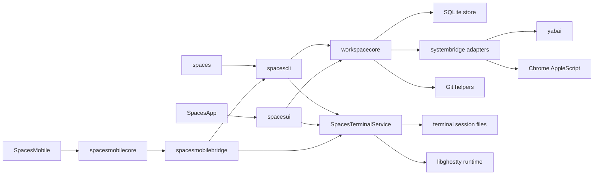
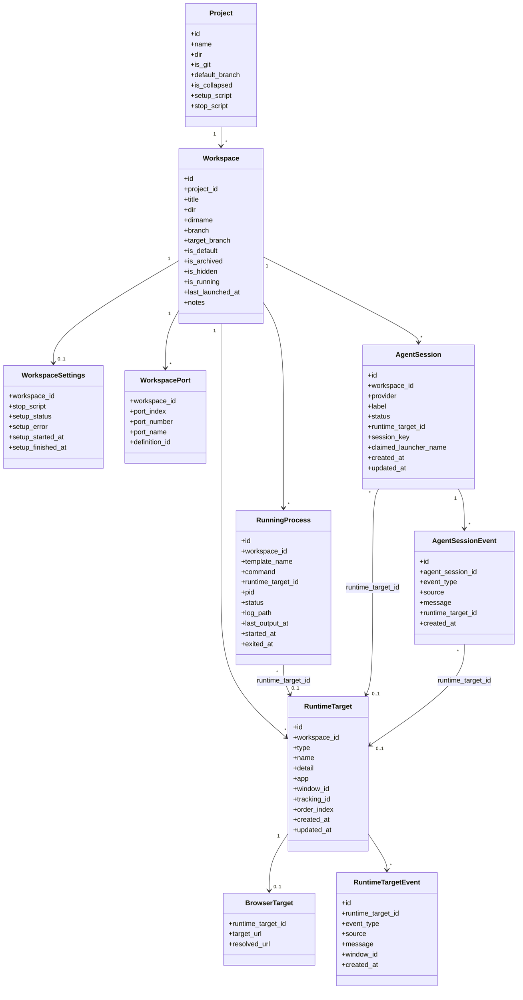

# Architecture

This document describes how Spaces is built and why: module boundaries, storage, runtime flows, external integrations, and the rationale behind the major design choices. User-visible behavior belongs in [spec.md](spec.md). Built-in terminal integration details live in [terminal.md](terminal.md).

## System Overview
Spaces is a macOS Swift app and CLI built around a shared orchestration layer.

Core invariants:
- SQLite is the single source of truth for persisted model data and global preferences.
- yabai is the source of truth for window IDs and cross-app window focus.
- Workspace settings are seeded from project templates and preserved as per-workspace overrides.
- Schema changes must be additive and non-destructive.
- GUI and CLI both call the same orchestration layer instead of re-implementing behavior independently.

## Module Map

## Module Responsibilities
- `SpacesApp`: minimal app entry point that boots AppKit.
- `SpacesTerminalService`: per-user background executable that owns live built-in terminal sessions, starts and supervises the first-party mobile bridge, boots on demand from first-party clients, and survives `SpacesApp` exit until the service itself exits or terminates a session.
- `spacesui`: AppKit UI layer that renders state and dispatches actions into `workspacecore`. Shared visual language lives in `Theme.swift` (brand color tokens mirroring `apps/web/app/globals.css`) and `RowPrimitives.swift` (status dot, type icon tile, shortcut/project/branch chips, `ColoredBackgroundView` helper). The workspace detail pane is a single scrollable `NSStackView`; it stacks the header, directory meta row, inline notes editor, and five configuration sections (Processes, Browser sessions, Coding agents, Named ports, Stop script) in order. Each section is a self-contained class (e.g. `ProcessesSection.swift`) that owns its transient form state, swaps each row between collapsed and editing subviews via `NSAnimationContext`, and publishes commits through an `onCommit` closure that the host bridges to `orchestrator.updateWorkspaceSettings`. Named-port rows render the configured env-var name plus the currently reserved port number from `workspace_ports`, mirroring how browser-session rows separate configured input from resolved display output. The `⋯` overflow menu is built by the static `AppKitController.makeWorkspaceOverflowMenu(workspaceID:path:target:)`, which emits a stock `NSMenu` whose path-based items forward to `copyDirectoryPath(_:)` and `revealDirectoryInFinder(_:)`, while workspace actions use the same shared `senderIdentifier(_:)` helper for `NSMenuItem` and `NSControl` senders. Update delivery also lives here: `AppKitController` owns a programmatic `SPUStandardUpdaterController` from Sparkle, wires the application menu’s `Check for Updates...` item directly to Sparkle, and relies on one stable appcast feed configured in the app bundle metadata. That stable feed serves one universal Sparkle archive and one manual-download DMG rather than arch-specific release artifacts.
- `spaces`: executable shim that boots the declarative CLI parser.
- `spacescli`: declarative `swift-argument-parser` command tree for `spaces`, including command help, leaf validation, translation from CLI inputs into orchestration calls, the built-in `spaces terminal` session controls for `command`, `send`, `key`, `tail`, `list`, `show`, and `takeover`, the `spaces mobile` status, standalone bridge, and TLS request harness controls, and profile or desktop-control inspection helpers used by dev and real-system workflows.
- `spacesterminalcore`: built-in terminal runtime primitives, PTY-session metadata persistence, per-session file layout, service protocol and bootstrap, render-frame payloads, output tailing, backend selection, shared terminal-grid helpers, the shared profile resolver used by the app, CLI, and E2E helpers, and the runtime interface used by `spaces terminal command|send|tail|list`.
- `spacesmobilecore`: first-party mobile bridge request and response types shared between the macOS bridge and the iOS client.
- `spacesmobilebridge`: daemon and CLI-hosted first-party TLS-PSK bridge for the iOS client, including stable bridge settings, pairing persistence, workspace or session overview shaping, Bonjour advertisement, and bridge restart supervision.
- `spacesterminalmobileghostty`: iOS terminal adapter that renders service-published Ghostty render frames through the mobile render-frame view and maps mobile keyboard, scroll, and viewport events back to the bridge.
- `spacesterminalghostty`: embedded libghostty integration for service-owned sessions, including local artifact discovery, runtime callbacks, control-plane bridging, and lightweight app-side host adapters for client windows.
- `spacesterminalui`: native terminal-session window controllers owned by the Spaces app. The terminal slice opens one or more windows for a session ID, registers each local window as an owner or viewer client, and keeps those local windows attached through the same per-session control socket and attachment records used by the CLI and service while limiting terminal rendering to the active owner.
- `workspacecore`: core orchestration, lifecycle, validation, persistence coordination, environment building, and the shared `AppVersion` constants consumed by both the GUI and CLI. Those constants are generated from `apps/macos/AppVersion.plist`, which is also used to generate the app bundle `Info.plist`.
- `systembridge`: system adapters for shell commands, yabai, Chrome, and related OS integrations.

### Terminal Session Slice
- Built-in terminal ownership is centered in `SpacesTerminalService` for workspace terminals, configured process windows, coding-agent windows, ad hoc workspace terminals, CLI sessions, and mobile-visible sessions.
- `spaces terminal command` creates persistent sessions through the service. `spaces terminal list` reads live service summaries. `spaces terminal show` asks the app to open a native client window for an existing session ID. `send`, `key`, and `takeover` operate on the session control socket that the service owns.
- Installed app bundles carry `SpacesTerminalService` next to the bundled `spaces` CLI in `Contents/Resources`, and the DMG installer copies both executables to the selected CLI install directory. `TerminalService` resolves the service from the override environment, next to the running CLI, from app-bundle resources, or from local SwiftPM build products.
- Each session is addressed by a stable session ID and stored under `~/.spaces/terminal/sessions/<session-id>/`.
- `metadata.json` stores launch inputs including backend and lifetime policy. `state.json` stores runtime state including backend, child PID, title, working directory, and last known columns and rows. `clients.json` and `attachments.json` store client identity plus owner or viewer attachment history. `control.sock` accepts local control-plane commands. `subscription.sock` carries service-published session state and Ghostty render frames for daemon-owned client windows. `output.log` records terminal output for CLI tailing and diagnostics.
- `SpacesTerminalService` runs a first-party TLS-PSK bridge for the iOS client on the stable default port `47847` when available, with `spaces mobile status` exposing address details only. If another Spaces profile owns that port, the daemon chooses and persists a deterministic profile-specific fallback port in `mobile-bridge.json` so paired devices keep a stable reconnect endpoint. The Mac app opens single-use five-minute pairing windows through the bridge control socket; each window carries an 8-digit code, nonce, profile transport key, and `spacesmobile://` link. The standalone `spaces mobile serve` path opens an ephemeral pairing window for harnesses and manual overrides. The bridge persists hash-only auth tokens plus paired-device metadata under the terminal root, uses the bundle identifier as first-party policy metadata, and forwards authenticated attach, subscribe, takeover, send, key, resize, and scroll requests into the same session boundary. Standalone bridge runs can apply test-only latency shaping to response and stream sends so harnesses can compare local and constrained iOS transport behavior without changing the daemon-supervised bridge path. Paired-device listing, revoke, and reset actions that target a running daemon are serialized on the bridge request queue so control actions drain in-flight authorization writes before changing stored pairings. Resetting all pairings removes every auth record and rotates the profile transport key. When the bridge rejects a stored device token, the iOS client clears that credential locally and routes the user back through the connection sheet instead of looping on stale auth failures.
- `SpacesMobile` keeps the bridge client, overview UI, ownership controls, and iOS-side input queue in the app target. Owner terminal content renders through `spacesterminalmobileghostty` from service-published Ghostty render frames; missing frames are handled as unavailable owner state rather than by replaying output history. Single-character owner input flushes immediately, text-plus-newline commands use one send RPC, and paste or burst text still uses the short batching window. Input performance events separate queue wait, RPC duration, render apply time, and echo-visible timing collected by the latency harnesses.
- Mobile bridge subscribed terminal streams remain full-frame streams. The relay uses large read and socket buffers for ordinary local transport, and constrained standalone bridge runs serialize shaped sends per stream so full-frame chunks stay ordered while preserving the configured network profile.
- `GhosttyEmbeddedSessionHost` in `spacesterminalghostty` is the service-owned session runtime for `ghostty-embedded`. It owns the PTY, libghostty state, output logging, runtime-state refresh, active owner identity, host-stamped lease timestamps, and lease expiry for stale remote clients. Small owner-input writes and successful scroll commands mark the next PTY output as interactive and export the render state as soon as the screen advances; paste or burst output stays on the short coalescing path. Host performance events split interactive latency into owner input activity, state change, frame export, and mirror apply timing.
- `SpacesApp` prewarms `SpacesTerminalService` after startup and uses `TerminalService.createSession` for app-created workspace terminals, process windows, and coding-agent windows. Each terminal launch path still calls the terminal service as its authoritative fallback.
- The Ghostty fork exposes additive headless-session, render-frame export, and mirror-renderer entrypoints while leaving default Ghostty app behavior untouched. The Spaces service remains the only PTY and session owner.
- Owner bootstrap uses a fresh live Ghostty render frame for macOS windows and mobile clients. V1 frames are encoded as `Data` in the existing Codable state stream and carry Ghostty-exported grid state for local mirror views. Mobile takeover responses include a post-transfer state payload when the bridge can read live terminal state. VT replay, raw output bytes, and `output.log` are not terminal-rendering fallbacks.
- Owner resync, resize, scroll, and output refreshes publish render frames or metadata only. Raw output bytes are not sent to client renderers.
- `TerminalSessionWindowController` uses `RemoteGhosttySessionHost` for built-in terminal windows. It follows the service-owned control plane, consumes the daemon render-frame stream for owner handoff compatibility and metadata, and sends terminal input through the shared serial input queue. Live non-owner windows stay on compact ownership or status UI without mounting a passive terminal surface or transcript body.
- `TerminalSessionWindowController.show()` still treats an already visible window as a reuse path: it leaves the persisted frame alone, keeps the existing refresh task alive, and just brings the live terminal window forward before refreshing visible state.
- `AppKitController` keeps a lightweight controller registry keyed by session ID and drops closed controllers so reopening a terminal window cleanly reattaches a fresh local client to the existing service-owned session.
- `AppKitController` rechecks ad hoc session teardown on attachment-state changes when no native controller remains, so ordinary ad hoc window closes can stop unclaimed sessions while app quit keeps service-owned sessions running.
- `AppKitController` disables automatic and sudden process termination during launch so macOS does not tear down `SpacesApp` while it is hidden or backgrounded but still coordinating native terminal windows, bridge clients, or remote ownership transfers.
- `AppKitController` prompts on app quit when live service sessions exist. The default action quits the app and leaves sessions running; the destructive action terminates live service sessions before quitting; cancel leaves the app running. Reopen continues to key off the stable session ID rather than an NSView identity.
- Built-in `Spaces` process and terminal focus prefers the tracked live yabai window ID when one exists, falls back to reopening the session by stable session ID only when no live native window can be focused, and either clears the stale native window binding or replaces it with the freshly observed yabai window ID during that same reopen path so the next focus targets the live window without waiting for a later refresh pass.
- `spacesterminalcore` reconstructs `spaces terminal tail` output from `output.log` with `libghostty-vt`. It also exposes a stateful VT bridge for CLI tailing and diagnostics, but terminal UI rendering stays on live Ghostty render frames and does not use raw output streams, snapshot-to-VT streams, or `output.log`.
- The macOS remote renderer and the iOS renderer share terminal-grid resolution helpers in `spacesterminalcore` for color, style, cursor, spacer, and plain-text behavior while the transport is full-frame V1 data.
- Mobile owner rendering has one bootstrap source: the Mac or service owner publishes a live Ghostty render frame, and the iOS owner initializes its rendered owner epoch from that frame. Later screen updates replace that epoch frame from the same service stream.
- The iOS renderer reports viewport geometry back to the Mac bridge for owner resizing. On iPhone it caps the reported columns to the readable inset surface width so the remote session does not keep emitting columns that render beyond the visible phone edge; iPad keeps the raw column count.
- iOS render-dump text is derived from the rendered owner surface after owner bootstrap, service frame updates, and scrollback changes. E2E checks use rendered text, readiness, event logs, screenshots, and performance events for live-output and scrollback coverage.
- `SpacesMobileBridgeServer` is the current first-party remote transport seam. `SpacesMobileBridgeSupervisor` starts it with profile-scoped settings, advertises `_spaces-mobile._tcp.` through Bonjour, exposes a private control socket for Mac-app pairing windows and device revocation, and persists a stable profile fallback port when the configured port is occupied. The transport is intentionally scoped to the Spaces iOS client rather than a third-party-stable public API.
- `AppKitController` uses the mobile bridge control socket for the sidebar Mobile Connection panel and Settings device list, so pairing links and revoke/reset actions operate on the daemon instance for the active profile. If the profile service ping socket is reachable but the mobile control socket is unavailable, the control client relaunches only when no live terminal sessions exist; otherwise the running service stays alive for session durability.
- App-created ad hoc workspace terminals use persistent service-owned sessions so app quit does not trigger service reaping. `.whileAttached` sessions are still reaped once the final live attachment detaches or expires, while service restart recovery marks abandoned `starting` or `running` sessions as failed and removes stale control sockets.
- `AppKitController` distinguishes built-in `Spaces` terminal opens and focuses from external-app window actions. External browsers, editors, and Finder windows still use the hide-after-success path, but built-in `Spaces` terminal windows stay visible alongside the main app so focusing or opening them does not hide the window that was just summoned.
- Owner or viewer state is persisted in `attachments.json`. Local attachments stay explicit, while remote attachments are treated as leases that must be refreshed by client-identified proxy or control traffic and are stamped from host time when the attach lands. Only the active owner attachment may send input or drive PTY size.
- Terminal tracking lives directly on `runtime_targets.tracking_id`; the built-in-only schema no longer keeps a separate terminal-target extension table.
- This slice is the only supported terminal path for Spaces-owned sessions and workspace-managed process terminals.

## Persistence

### Database
- Installed/default path: `~/.spaces/spaces.db`
- Repo-local development default path: `~/.spaces-dev/profiles/spaces/<branch-slug>-<worktree-hash>/spaces.db`
- SQLite stores projects, workspaces, runtime state, and global settings.
- SQLite should run in WAL mode with a busy timeout so overlapping GUI, CLI, and background work does not produce avoidable lock failures.
- `migration_state.current_version` records the canonical schema version. The active schema is version `1`.
- `PRAGMA user_version` is not used by Spaces for migration control; if present, treat it as informational only and keep it aligned with `migration_state` when inspecting or repairing a database manually.

### Profile Resolution
- `SPACES_DB_PATH` wins when it is set for the current process.
- Otherwise repo-local development binaries derive one profile root from the current git branch plus the canonical worktree path.
- Installed binaries and non-dev fall back to `~/.spaces/`.
- The default runtime root is `<profile-root>/runtime`, unless `SPACES_RUNTIME_DIR` overrides it explicitly.
- Distributed notification IPC uses one profile-scoped object token derived from the resolved profile root so app, CLI, and E2E helpers only talk to the matching profile instance.

### App Ownership and Desktop Control
- App launch acquires one per-profile owner lease before the store, IPC observers, hotkeys, or windows are created.
- Duplicate app launch for the same profile fails fast and reports the existing owner pid, executable path, and profile root.
- Desktop-global control such as Carbon hotkey registration uses a separate user-global lease shared by every profile.
- When another profile already owns that lease, the second app loads normally in passive mode, keeps local in-app shortcuts, and suppresses desktop-global listeners until the lease becomes available.

### Migration Rules
- Fresh installs create the latest schema directly and record the current schema version.
- Existing installs should migrate in ordered `N -> N+1` steps until they reach the current schema version.
- Each migration step should run inside `BEGIN IMMEDIATE ... COMMIT`, update `migration_state` in the same transaction, and roll back on failure.
- Compatible schema changes should use additive techniques such as `CREATE TABLE IF NOT EXISTS`, `ALTER TABLE`, backfills, indexes, and table rebuilds with copy when SQLite requires them.
- Store startup validates `migration_state.current_version` against the canonical schema version and fails closed when they do not match.
- Startup runs `PRAGMA integrity_check` and fails if validation does not return `ok`.

## Data Model

### Projects
Projects persist:
- opaque project identity separate from filesystem paths
- source directory and git status
- sidebar collapsed state
- setup and stop scripts
- port definitions
- process templates

Managed clone directories under `~/spaces/repos` and managed worktree roots under `~/spaces/workspaces` must be keyed by project identity rather than project name so cleanup, retries, and same-name projects cannot collide on disk ownership.
- browser-session templates

### Workspaces
Workspaces persist:
- directory identity
- title, notes, and branch metadata
- branch identity as the unique git-workspace key, while titles remain non-unique display text
- default and archived flags
- hidden sidebar visibility state
- explicit lifecycle state (`running` vs `stopped`)
- seeded per-workspace copies of launch-time settings

### Runtime Records
Runtime state persists separately from project and workspace templates:
- allocated ports
- running processes
- runtime targets
- terminal target details
- browser target details
- agent sessions

This separation lets template edits coexist with current runtime state and per-workspace overrides.
It also lets lifecycle state stay explicit while runtime health is derived from the current runtime records.

### Runtime Target Model
- `runtime_targets` is the canonical inventory of focusable runtime items for a workspace. Each row stores shared fields such as `type`, host app, current yabai `window_id`, durable terminal `tracking_id`, ordering, and display metadata.
- `browser_targets` extends browser runtime targets with the configured target URL and the last resolved URL.
- `agent_sessions` models logical coding-agent sessions separately from focusable windows. Each row links to a `runtime_target` and stores only agent-session state: provider, display label, status, provider session key, claimed launcher name, and timestamps.
- `agent_session_events` records signal-driven lifecycle updates and launcher-driven agent transitions. Each event keeps the resolved runtime-target link plus a compact message containing the provider, label, tracking token, native terminal ID, provider session key, yabai window ID, and the full set of environment key names seen by `spaces signal` for that event.
- `running_processes` is the canonical process-status record. Each row links to a `runtime_target` and stores only process runtime state such as command, PID, status, log path, and timestamps.
- Runtime targets are seeded as soon as a process or agent terminal is known, even before a separate window-reconciliation pass fills in a live yabai `window_id`. That keeps process and agent rows linked to a single canonical target instead of caching terminal identity on the base row.

### Data Modeling Guidelines
- Base tables should stay generic. If a field only makes sense for one provider or feature family, it should live on an adapter-specific runtime path rather than on a cross-cutting base record.
- `runtime_targets` is the shared focus inventory. Keep terminal identity there only because the built-in-only branch has one terminal runtime and one durable session identifier per target.
- Agent-session records should describe logical session state, not terminal implementation details. Agent sessions should relate to terminal identity through `runtime_targets` instead of copying terminal fields onto the session row.
- Running-process records should describe process runtime, not terminal identity. Process rows should link to the relevant runtime target instead of owning terminal-specific fields.
- When a process or agent needs terminal identity before yabai has reconciled a live window, seed or reuse a `runtime_target` record rather than persisting terminal identity on the base process or session row.
- Provider-specific naming should be avoided in shared schema. Generic fields such as `provider` and `session_key` are acceptable when the same concept exists across providers; fields named for one product should be treated as transitional and refactored away.
- Add abstractions only when current behavior needs them. Extensibility matters, but speculative tables or fields should not be added before a real workflow requires them.
- Prefer event history for debugging destructive transitions over piling more `last_*` and `*_reason` fields onto canonical state rows. When a target or session is rebound, detached, or pruned, the system should leave an inspectable event trail.
- Distinguish the durable Spaces session identity used for replay, focus, and runtime correlation from transient window IDs that yabai may refresh over time.

### Referential Integrity
- SQLite foreign keys stay enabled for persisted parent-child relationships.
- Store-level delete-and-reinsert updates run inside immediate transactions so partial child-table replacements cannot persist if one statement fails.

## Core Flows

### Workspace Creation
1. Resolve the target project and workspace identity.
2. For git projects, treat `Create branch` as a strictly new-branch flow and reject any branch name that already exists locally, remotely, or in an archived workspace record; only the explicit existing-branch path may reuse that branch and revive its archived workspace.
3. Create or import the workspace directory.
4. Persist the workspace and seed per-workspace settings from project templates.
5. Allocate named ports.
6. Run setup logic.

### Workspace Launch
1. Validate that the workspace is launchable.
2. Build the workspace environment, including named port variables and workspace paths.
3. Start tracked processes inside dedicated built-in terminal sessions, wait for the session boundary to become available, and then record the terminal row plus runtime state.
4. Leave configured browser sessions unopened until the user focuses them.
5. Capture new terminal windows through yabai and persist the mapping.

### Workspace Stop or Archive
1. Stop tracked processes.
2. Run the workspace stop script when appropriate.
3. Close tracked dedicated windows safely.
4. Clear runtime state.
5. Release ports.
6. Archive git worktrees when the action requires it.
7. When the user opted in during archive confirmation, attempt remote-branch deletion first and local-branch deletion second, then surface any skipped or failed branch cleanup as a post-archive notice instead of rolling back the archive.

### Discovery and Reconciliation
- Background worktree discovery imports valid unmanaged worktrees for known projects.
- Background reconciliation removes stale tracked windows and refreshes persisted workspace metadata from disk where needed.
- Saving workspace settings updates persisted configuration and synchronizes named-port reservations, but it does not reconcile live runtime by auto-starting or auto-stopping processes, browser sessions, or coding agents.
- Reconciliation may degrade runtime health, but it should not silently promote or demote workspace lifecycle state.
- Sidebar snapshot refresh can update the backing lists in the background without rebuilding the active detail pane when the current selection is still valid.
- These passes should not block the main UI thread.

## Environment and Process Model
- Named port definitions are allocated per workspace and exposed as environment variables. Workspace-settings saves preserve existing allocations where possible, allocate newly added definitions immediately, and release removed definitions without waiting for the next launch.
- Workspace processes also receive stable environment variables such as project and workspace directories.
- Setup scripts, stop scripts, and process commands all execute against the workspace-specific environment.
- Built-in `Spaces` terminal sessions own their process lifetime directly through the session backend, so launch, stop, recovery, and reopen do not depend on tmux.
- Immediate process-start failures should be surfaced from the recent built-in session output itself so launch errors report the real command failure instead of a follow-on recovery error.
- Core external dependencies that the GUI invokes directly, such as `yabai` and `git`, are resolved through a shared executable-locator path instead of relying on the Finder app environment to provide a complete `PATH`.
- App-level settings such as shell-mode process shell are persisted in the shared store but are configured through the app rather than through `spaces`.
- Global app settings also store the app-toggle hotkey and the separate command-palette hotkey.
- Global settings also store the shared window focus pulse color and enabled state behind window-scoped keys.
- Each `ProcessTemplate` persists an `execution_mode` of `direct` or `shell`. Missing fields in older saved data decode as `direct`.
- Direct mode is parsed as an executable plus argv and rejects shell-only syntax such as pipelines, redirection, command substitution, and backticks.
- Before launching a direct-mode process, Spaces validates `$...` usage against a narrow allowlist and only interpolates simple Spaces-provided variables such as named ports and `SPACES_*` paths inside tokens without invoking a shell.
- Supported direct-mode variable references are limited to `$NAME` and `${NAME}`. Unknown variable names and unsupported shell expansion forms such as `${NAME:-fallback}`, `$$`, and `$?` fail validation against the raw user command instead of being passed through literally.
- Shell mode treats the command text as shell input and launches it through the global app `process_shell` setting with a consistent `<shell> -lc <command>` invocation. The allowed shell values are `zsh`, `bash`, and `sh`, with `zsh` as the default.
- Project and workspace editors, workspace launch, running-process restart validation, JSON import/export, and CLI text output all preserve the same execution-mode semantics.
- Configured coding-agent launchers remain shell-string based rather than using process `executionMode`. Spaces wraps those launchers in an inner interactive login shell so user shell PATH setup and tool bootstrap from files such as `.zshrc` are available without changing deterministic process-launch behavior.

## Window and Focus Architecture
- yabai provides stable window identity and cross-app focusing.
- Chrome integration adds browser-specific behavior on top of yabai for selecting the intended browser target.
- Browser sessions are stored as workspace configuration and only become tracked windows after an explicit focus action opens them.
- Browser-session focus uses two identity layers. `WindowRecord.windowID` stores the live yabai window ID for cross-app focus and reconciliation, while Chrome tab targeting uses Chrome's own window ID plus tab index gathered from a live tab scan.
- Browser-session matching is URL-based and tolerant of equivalent host forms. Focus, recovery, and browser-row naming all normalize scheme, host, port, and path so `google.com` and `www.google.com` resolve to the same configured session while still preferring the most specific matching session prefix.
- Browser-session focus from a built-in terminal first tries a scanned Chrome window and tab identity for the target URL, verifies that the activated tab still belongs to the requested session, then falls back to the broader URL-scan path and finally to yabai when browser-specific targeting cannot resolve the session.
- Browser-session recovery and extracted-window reuse use the same normalized URL matcher as direct focus so reopened browser windows remain attached to the intended configured session even when Chrome canonicalizes the visible URL.
- CLI workspace focus resolves explicit names instead of numeric window indexes. Those names come from the same workspace-level focus model used for browser sessions, running processes, and agent terminals, and the names must stay unique within a workspace.
- The CLI stays path-based: commands target the current working directory by default or accept an explicit workspace path argument.
- Terminal focus pulsing is terminal-agnostic: Spaces queries the target yabai window and briefly presents an AppKit overlay aligned to that window instead of mutating terminal-specific appearance settings.
- Tracked windows are persisted so Spaces can refocus or clean up only the windows it owns.
- Direct focus requests auto-recover stale browser-session windows by reopening and re-tracking them, while process and generic window failures still surface typed missing-window errors to the GUI.
- Browser-session existence is not polled during background refresh; stale browser mappings are detected on demand when the user focuses that session.
- Window cycling is built from a dedicated workspace target list rather than raw visible windows. The ordered target set is assembled from tracked browser rows first, then live process-backed terminal targets, then remaining tracked terminal rows, then orphaned process rows, and finally agent rows. A process-backed built-in terminal contributes one logical cycle target even though process runtime and terminal window state are persisted separately.
- Current-cycle resolution prefers built-in terminal identity before external probing. When the active surface is a built-in Spaces terminal, the hotkey path passes the session identity directly into the orchestrator so cycle resolution can skip the generic yabai focused-window probe. Otherwise the orchestrator resolves the current target from the focused yabai window ID, then from the remembered navigation cursor, and finally from the frontmost Chrome URL when the active app is Chrome.
- Cycle order is frozen for a short-lived cycle session. After the first `next` or `previous`, the orchestrator snapshots the ordered target cursor list, advances within that snapshot, and reuses it for subsequent presses until the cycle session expires or focus moves outside the tracked cycle flow.
- Window cycling is tolerant of stale tracked yabai IDs and keeps advancing until it finds the next live target.
- Built-in terminal and agent targets do not use the same hide path as external targets. Cycling or focusing into a Spaces-owned terminal keeps the main window available and dismisses only the command palette if it is open, while external browser or editor focus still uses the hide-after-success flow.
- Built-in process and agent focus prefer the live native window when a tracked yabai window ID exists and only reopen the session when no live native window can be focused.
- Reconciliation is required because window state can drift outside the app.

### Terminal Integration Contract
- Spaces treats the built-in Ghostty-backed session host as the only supported terminal runtime.
- Terminal launch, focus, replay, recovery, and ownership handoff all depend on one durable Spaces session identity rather than provider-specific host identifiers.
- yabai remains the source of truth for live window IDs, but the session identity is the source of truth for replay, takeover, and process or agent attribution.
- The built-in terminal runtime must keep raw PTY output, exact input injection, and current terminal geometry available at the session boundary so the CLI, owner-seeking windows, and future remote clients can share the same control model.

## Agent Integration
- Agent events are explicit CLI inputs that attach status to tracked workspace agent windows.
- `spaces signal` only resolves direct built-in terminal environments.
- Agent windows are stored separately from regular process windows because they carry provider and lifecycle metadata, but `init` also reconciles them against tracked terminal windows so ad-hoc agent terminals become focusable tracked rows.
- Configured agent-launcher names are treated as reserved focus labels. The launcher-owned agent instance may keep that exact label, while unrelated ad-hoc agents that report the same label are suffixed during registration so GUI rows and CLI focus targets stay unambiguous.
- Workspace launch now opens configured coding agents through the same direct-terminal path as manual agent launch. That creates the tracked agent rows eagerly, while later `spaces signal` calls still supply the actual lifecycle status.
- Alerts and numbered window shortcuts keep configured and ad-hoc agent rows in one `Coding Agents` section. Configured rows occupy their stable slots first, then unmatched ad-hoc agent rows append after them so shortcut ordering remains deterministic.
- Configured-agent relaunch is conservative: if a reserved row still points at a live tracked terminal, Spaces keeps that row and treats launch as a no-op. Only clearly stale rows are evicted and replaced.
- Agent reconciliation prefers the built-in terminal session identity first.
- Alerts attention state is derived from runtime records rather than inferred from UI state.
- `waiting` and `done` agent events both contribute alerts and dock attention until the user dismisses that specific attention event; the workspace row still renders the underlying agent status independently.
- Alerts dismissals are stored as a persisted set of attention-event IDs in SQLite global settings, then filtered in the GUI so workspace detail panes keep showing the underlying runtime rows.
- Live libghostty state stays in-process inside `SpacesTerminalService`, while persisted session output plus geometry provide the tail-rendering source for `spaces terminal tail` and diagnostics.

## Lifecycle and Health
- Workspace lifecycle state is explicit and persisted on the workspace record.
- Runtime health is derived from runtime records, configured browser/process expectations, and agent waiting state.
- The GUI should render lifecycle state directly and layer runtime-health warnings on top instead of inferring lifecycle from stale runtime leftovers.

## Shortcut Architecture
- Shortcut defaults and user overrides are stored in SQLite global settings and edited from the GUI settings panel.
- Global shortcuts use Carbon hotkey registration for actions that must work while Spaces is not frontmost.
- Carbon hotkeys are registered only while the running app owns the desktop-control lease for its user account.
- The command palette is implemented as a separate AppKit panel instead of reusing the main split-view window, so the hotkey can surface a focused search field without depending on the full app shell staying visible.
- `AppKitController` treats the main Spaces window as the primary UI surface and built-in terminal windows plus the command palette as auxiliary windows. Global toggle behavior depends only on the main window's visible state and hides or summons only that window instead of app-wide unhiding or fronting every Spaces-owned window. Command-palette presentation similarly depends only on the palette panel's visible state and shows or hides only that panel without ordering the main window out. When the focused auxiliary window is a built-in terminal, the app resolves that terminal session back to its tracked workspace row before restoring the main window or choosing the command-palette context. Those hotkey paths skip the generic focused-window workspace lookup whenever the terminal session already resolves to a workspace, which keeps built-in terminal toggles from paying unnecessary focused-window tracking work. When the main window or command palette is later hidden through the same hotkey path, the controller explicitly restores focus either to the remembered built-in terminal session or to the previously frontmost non-Spaces app instead of leaving the return leg to AppKit window ordering.
- Command-palette items are built from two sources: Alerts attention entries and the same ordered workspace run-target model that powers workspace-detail numbered shortcuts. With an empty query, the panel shows Alerts attention first and then only the current workspace's run targets. Once the user types, the fuzzy matcher ranks across the full combined item set.
- Palette search uses a local multi-field fuzzy matcher over workspace title, target label, and detail text, then maps the selected row back onto the existing target-level focus/open request path.
- In-app shortcuts use an AppKit event monitor so they can respect focused text inputs and support digit-family shortcuts such as window `1` through `9`.
- Leader-based shortcuts store a suffix key spec and derive their shared modifiers from `gui_leader_hotkey`; the orchestrator resolves them to full effective hotkeys for both the GUI and CLI. Reload and the workspace terminal action use this same leader-backed resolution path.
- Window focus shortcuts are modeled as a modifier family rather than nine separate persisted bindings, with digits `1` through `9` sharing one direct-focus binding.
- Global `Next window` and `Prev window` are reserved for cycle navigation. The main window does not reinterpret those shortcuts as sidebar selection; sidebar workspace movement stays on the unmodified up and down arrow keys when the main outline view is active.
- Global cycle hotkeys and numbered focus shortcuts share the same target-level focus implementation. Direct row clicks, Alerts shortcuts, numbered window shortcuts, command-palette execution, and `Cmd+Opt+[ ]` all converge on the same orchestrator focus paths so browser, process, terminal, and agent rows use one recovery and hide policy.
- Alerts shares the same direct-focus shortcut family as workspace detail, and those focus shortcuts take precedence over Alerts-local create actions while Alerts is visible.

## Performance Principles
- Focus and capture paths should avoid unnecessary blocking work.
- Hot paths that do not need stdout or stderr should use lightweight process spawning.
- Long-running GUI actions should execute off the main thread and reconcile state back into the UI afterward.

## External Dependencies
- macOS 14+
- yabai for window identity and focus
- forked GhosttyKit plus libghostty-vt from the pinned `apps/macos/vendor/ghostty` submodule for built-in terminal ownership, render-frame export, mirror rendering, CLI tailing, and diagnostics
- Google Chrome for browser-session automation
- SQLite for local persistence
