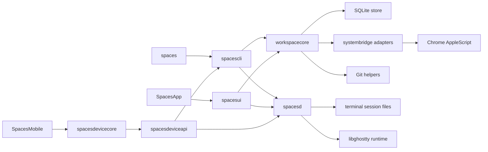
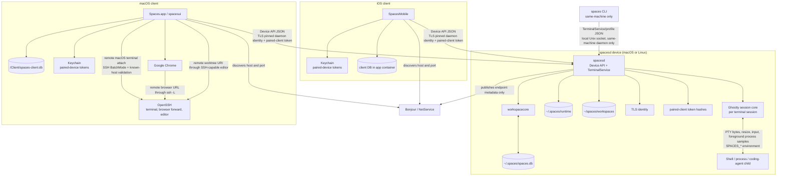
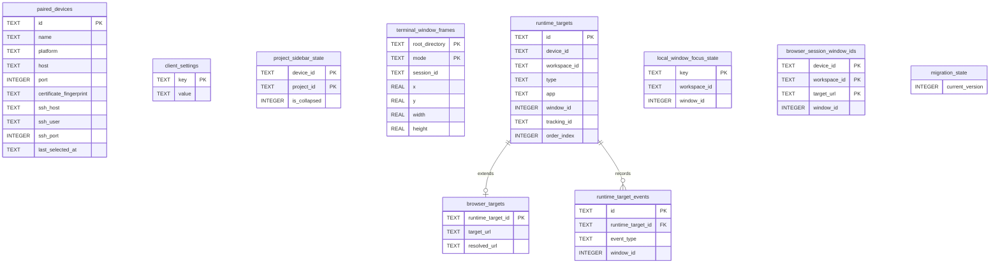

# Architecture

This document describes how Spaces is built and why: module boundaries, storage, runtime flows, external integrations, and the rationale behind the major design choices. User-visible behavior belongs in [spec.md](spec.md). Built-in terminal architecture and implementation details live in [terminal.md](terminal.md); this document names terminal modules only where they connect to the broader system.

## System Overview
Spaces is a macOS Swift app and CLI built around a shared orchestration layer.

Core invariants:
- SQLite is the single source of truth for persisted model data and global preferences.
- The macOS client tracks and focuses windows itself: its own AppKit windows for Spaces terminals, Chrome AppleScript window IDs for browser sessions, Spaces terminal session IDs for processes and coding agents, and process IDs for cleaning up non-terminal processes.
- Workspace settings are seeded from project templates at workspace creation and preserved as per-workspace overrides after that.
- Store startup accepts only the current app schema and fails closed for unsupported schema versions.
- GUI and CLI both call the same orchestration layer instead of re-implementing behavior independently.

## Module Map

## Runtime Process Communication

- `spacesd` is per device. On macOS and Linux it owns the daemon database, runtime files, workspace root, TLS identity, projects, workspaces, terminal sessions, process rows, agent rows, alerts, notes, and paired-client records.
- The Device API is hosted inside `spacesd`. It exposes device info, pairing, paired-client management, project and workspace CRUD, terminal lifecycle and control, process lifecycle, coding-agent lifecycle, notes, setup state, alerts, and configuration import/export.
- Device API transport uses two authentication layers: clients pin the daemon's self-signed TLS identity from pairing metadata, then include a per-client token issued during the short-lived pairing window. Tokens are stored only as hashes by the daemon and as secrets in the client Keychain.
- macOS and iOS clients keep only client-local metadata in SQLite: paired device list, local device label, editor preference, keyboard bindings, local window IDs, browser window mappings, and focus history; the iOS client also stores its active-device selection. Editor windows are not tracked here; the client re-focuses an open editor by re-launching the folder (see editor integration below).
- Before a client database migration, the client creates a timestamped metadata-only backup. If migration fails, it restores the latest backup and surfaces a startup error. Pairing tokens stay in Keychain and are not copied into SQLite backups.
- Direct Device API reachability is required through LAN, VPN, Tailscale, or equivalent network configuration. There is no relay transport.
- macOS remote-device pairing, terminal attach, browser forwarding, and editor opening require SSH to the same device. Remote pairing validates SSH with `BatchMode=yes` and `StrictHostKeyChecking=yes`, requires Darwin hosts to expose the DMG install markers, and probes Linux hosts for Ubuntu 24.04 on `x86_64` or `arm64`. When the Linux pairing command is missing or not responding, the client downloads the signed release manifest for the running app version, verifies it with the bundled remote-artifact Ed25519 public key, downloads and checks the matching archive, copies it over SSH, runs the included installer as the target user, and retries `~/.spaces/bin/spaces pair --json`. The Linux installer enables systemd user lingering before restarting the user service so Spaces stays available after the setup SSH command exits. Pairing then uses the Device API at the effective OpenSSH `HostName` and returned API port, so SSH aliases resolve to direct LAN, VPN, or Tailscale endpoints without using daemon-advertised interface metadata.
- iOS direct terminal control uses one serialized pinned-TLS command channel per daemon endpoint. TerminalService requests carry an optional top-level auth token and exactly one tagged command payload, so each command owns only its request-specific fields. Non-stream requests are newline-framed on that channel and must receive the expected response shape, such as `controlResponse` for control commands or `sessionState` for explicit state reads. Live render and ownership updates are delivered by the separate direct `subscribe` stream, so input, key, resize, and scroll control responses do not carry session snapshots.
- Local Unix socket transports rely on profile-scoped paths under `/tmp/spaces-terminal-sockets` and `0600` permissions. `TerminalServicePaths` and `TerminalSessionPaths` are the source of truth for resolving and hashing profile paths; real-system harnesses read those paths through `spacese2e profile-socket-paths` instead of duplicating path normalization. The same rule applies to Mac Device API client identity: harnesses read the current profile's installation ID through `spacese2e mac-client-installation-id` instead of reimplementing client profile hashing. These helpers are not cross-user or cross-profile APIs.
- Bonjour advertises only discoverability metadata for the Device API. It is not used for trust or authorization.
- `spaces terminal proxy` is an explicit CLI-run TCP bridge for one terminal session. It forwards TerminalControl JSON to the local per-session socket and requires the configured shared token.

## Module Responsibilities
- `SpacesApp`: minimal app entry point that boots AppKit.
- `spacesd`: per-device background executable for the Device API, daemon-owned project/workspace state, built-in terminal sessions, process and agent runtimes, pairing, and paired-client control; terminal behavior lives in [terminal.md](terminal.md).
- `spacesui`: AppKit UI layer that renders state and dispatches actions into `workspacecore`. Shared visual language lives in `Theme.swift` (brand color tokens mirroring `apps/web/app/globals.css`) and `RowPrimitives.swift` (status dot, type icon/text tile, shortcut/project/branch chips, `ColoredBackgroundView` helper). The right pane's footer strip carries the selected workspace's identity and actions (status dot, name, branch, selectable path, focused-pane title, notes popover, launch/restart/stop/overflow), while the sidebar footer holds the app identity row (logo, name, devices/settings/reload); pane and derived tab titles resolve through the sidebar's runtime-target names, and ⌘W closes the focused pane through the panel coordinator. Workspace configuration editing lives in the workspace settings dialog (`AppKitController+WorkspaceSettingsDialog.swift`), a free-standing form window presented through the same `presentFormWindow` chrome as project settings; it stacks the five configuration sections (Browser sessions, Processes, Coding agents, Services, Stop script) with runtime controls disabled, and each section edit commits immediately through `updateDeviceWorkspaceConfig`. Each section is a self-contained class (e.g. `ProcessesSection.swift`) that owns its transient form state, swaps each row between collapsed and editing subviews via `NSAnimationContext`, and publishes commits through an `onCommit` closure. Service rows render the DNS-label service name plus the currently assigned port number and derived routed URL from `workspace_service_ports`, mirroring how browser-session rows separate configured input from resolved display output. Runtime targets render as compact rows under every visible workspace row in the sidebar: `SidebarRuntimeTargetItem.swift` derives them from the same `workspaceShortcutTargets` ordering the numbered shortcuts and window cycling use, identified by the cycle-cursor key scheme; `SidebarController` exposes them as an `OutlineItem.runtimeTarget` child level (memoized per workspace, auto-expanded, non-selectable, with `⌘<number>` chips only on the selected workspace); left click routes through the shared `executeWindowFocusResolution` dispatcher so sidebar clicks, the command palette, numbered shortcuts, and cycling behave identically; right click builds a Start/Stop/Restart/Rename context menu calling the same Device API mutations the old detail sections used. Inline target rename follows the device-rename pattern (editor swapped into the row, commit/cancel routed through `control(_:textView:doCommandBy:)`); ad hoc terminals rename through the `renameTerminalSession` Device API command, while configured processes, coding agents, and browser sessions rename their workspace-config entry. The `⋯` overflow menu is built by the static `AppKitController.makeWorkspaceOverflowMenu(workspaceID:path:target:)`, which emits a stock `NSMenu` whose path-based items forward to `copyDirectoryPath(_:)` and `revealDirectoryInFinder(_:)`, while workspace actions use the same shared `senderIdentifier(_:)` helper for `NSMenuItem` and `NSControl` senders. Update delivery also lives here: `AppKitController` owns a programmatic `SPUStandardUpdaterController` from Sparkle, wires the application menu’s `Check for Updates...` item directly to Sparkle, and relies on one stable appcast feed configured in the app bundle metadata. That stable feed serves one universal Sparkle archive and one manual-download DMG rather than arch-specific release artifacts.
- `spaces`: executable shim that boots the declarative CLI parser.
- `spacescli`: declarative `swift-argument-parser` command tree for `spaces`, including command help, leaf validation, translation from CLI inputs into orchestration calls, terminal and mobile subcommands, and profile or desktop-control inspection helpers used by dev and real-system workflows.
- `spacesterminalcore`: shared terminal runtime primitives and protocols; the built-in terminal control, persistence, rendering, and CLI-tail details live in [terminal.md](terminal.md).
- `spacesdevicecore`: first-party Device API request and response types shared by macOS, iOS, and daemon Device API code. Requests use a typed command envelope with command-specific payloads, and responses use a typed result envelope for overview, mutation, terminal state, workspace-create options, project-preview, directory-suggestion, auth-token, and terminal-link payloads. The shared DTOs expose project summaries, workspace summaries, configured process rows, coding-agent rows, workspace-terminal rows, run-state values, agent activity values, workspace-creation options, mutation outputs, and compatibility decode defaults without depending on `workspacecore`.
- `spacesdeviceapi`: daemon-hosted first-party Device API transport and local daemon control socket. It assembles overview data from `workspacecore` records and spacesd session catalogs, routes authenticated mutation commands back through the same orchestration paths used by local daemon operations, and uses typed control commands for status, pairing windows, paired-device administration, and local-client bootstrap. Terminal transport behavior lives in [terminal.md](terminal.md).
- `spacesruntimecore`: daemon-safe runtime helpers that avoid workspace, UI, Keychain, Bonjour, and AppKit dependencies. Device-local worktree preparation uses this target for Git command execution and fast-forward-only refresh checks.
- `spacesterminalmobileghostty`: iOS terminal adapter for Ghostty-backed mobile rendering and input mapping; details live in [terminal.md](terminal.md).
- `spacesterminalghostty`: embedded libghostty integration and app-side host adapters; details live in [terminal.md](terminal.md).
- `spacesterminalui`: native terminal-session window controllers owned by the Spaces app; details live in [terminal.md](terminal.md).
- `workspacecore`: core orchestration, lifecycle, validation, persistence coordination, environment building, and the shared `AppVersion` constants consumed by both the GUI and CLI. Those constants are generated from `apps/macos/AppVersion.plist`, which is also used to generate the app bundle `Info.plist`.
- `systembridge`: system adapters for shell commands, Chrome, and related OS integrations.

### Terminal Architecture Reference
- Built-in terminal ownership, session layout, Ghostty compatibility, macOS and iOS rendering, Device API terminal behavior, scroll rendering, CLI controls, and terminal validation live in [terminal.md](terminal.md). This document references terminal modules only where they connect to non-terminal systems.
- Ghostty action callbacks are decoded into typed events before reaching UI surfaces. `OPEN_URL` is handled only as terminal link opening, and `MOUSE_OVER_LINK` drives pointer affordance. App, window, tab, and config actions remain outside Spaces' terminal surface contract.
- macOS terminal link opening converts `http` and `https` strings to URL opens, and converts `file://` plus absolute filesystem paths to file URLs before handing them to the system workspace opener.
- The iOS Ghostty mirror registers a per-surface action handler. A terminal tap is first offered to Ghostty at the tapped cell coordinate so Ghostty can emit an `OPEN_URL` action for detected links; taps without a detected link continue through the normal input-focus path.

### Device API Workspace Transport
- Mobile overview construction reads projects, non-archived workspaces, workspace settings, running-process records, agent-window records, tracked terminal windows, and live terminal sessions. The builder returns project summaries plus per-workspace runtime rows that are safe for local filtering by row type, run state, and search text.
- Process rows are keyed by configured process identity and annotate live or exited runtime when a matching running-process record exists. Coding-agent rows keep configured launcher slots stable and append unmatched live agent rows after configured rows. Workspace-terminal rows exclude terminal sessions already claimed by process or agent runtime records.
- Mutation responses carry `ok`, a user-facing message, and a typed mutation result containing a refreshed overview plus action-specific identifiers such as `workspaceID` or `sessionID`. The refreshed overview keeps clients synchronized after create, run, stop, restart, or terminal-open actions without requiring the client to infer affected rows.
- Workspace creation requests use the same project and git semantics as the macOS GUI. The Device API supplies per-project creation options and accepts branch mode, branch name, base branch, notes, and existing-branch reuse intent; the checkout directory name is generated by the daemon rather than supplied by the client.
- Folder-based project creation runs on the owning daemon. `previewProject` validates a directory path on the daemon, detects git, and returns the project name plus a project-config payload assembled from any `spaces.yaml`; `listDirectories` returns child-directory suggestions for a partial path, expanding `~` and preserving a typed tilde prefix. The macOS New Project form uses these for path autocomplete and `spaces.yaml` hydration on both the local Mac and selected remote devices, so the daemon's filesystem is the single source of truth for directory validation.
- Device API workspace-terminal creation uses workspacecore's reservation path as the singular launch path. Reservation persists the launch configuration, a `.starting` runtime state, empty terminal output and service-log files, a tracked workspace terminal window row, and workspace running state, then returns the mutation response with the reserved `sessionID` before the shell backend is ready. A background launch task uses a fresh SQLite store and orchestrator to finish daemon startup for that same session.
- Background workspace-terminal launch success updates the reserved session through normal terminal persistence, including running runtime state plus control and subscription socket availability. Launch failure writes a `.failed` runtime state, detaches clients, removes control and subscription sockets, deletes the reserved terminal window row, and clears workspace running state when no other tracked runtime indicators remain.
- macOS active-remote-device workspace-terminal opens build the local mirror window from the returned mutation session metadata, including `.starting` state, service PID, timestamps, title, working directory, and terminal kind. iOS workspace-terminal opens return the same `.starting` session to navigation immediately. Terminal detail surfaces treat a missing live state stream for a `.starting` session as pending startup and retry silently until the stream is available or the session transitions to a terminal failure state.
- macOS active-remote-device terminal focus opens a local mirror window backed by Device API terminal state and control requests for the selected session. The focus path uses workspace and terminal identities from the remote overview, so the selected workspace does not need a matching record in the local daemon database.
- Mobile workspace-terminal stop requests pass workspace ID and session ID into workspacecore's ad hoc built-in terminal stop path. The path rejects process- and agent-owned sessions, terminates the matching service session, removes tracked terminal rows, and can resolve live sessions by working directory when a tracked window row is already gone.
- Mobile process mutations call configured-process recovery for missing runtimes and running-process stop or restart for live runtimes.
- Mobile coding-agent mutations call the workspace agent lifecycle methods. Stop removes runtime state and terminates the backing Spaces terminal session while preserving configured launchers. Restart resolves the claimed or configured launcher ID first, falls back to launcher names only for records without an ID claim, and launches that configured row again.
- Terminal link preview uses authenticated Device API commands. `resolveTerminalLink` classifies direct HTTPS URLs or readable Mac files and returns metadata for image and video media; `readTerminalLinkChunk` streams approved local files by stable link ID and byte range. Relative paths resolve against the session working directory, `~` resolves to the Mac user home directory, and resolved paths must be regular readable files. The Device API records a short-lived in-memory approval for each resolved local link, chunk reads require an exact link ID and session match against that approval, and successful chunk reads refresh the approval while the transfer is active.
- Mac file serving for iOS previews is limited after symlink resolution. User home paths, workspace paths, `/tmp`, `/var/tmp`, `/private/tmp`, `/private/var/tmp`, `/opt`, and `/usr/local` are allowed; system and protected roots such as `/System`, `/Applications`, `/Library`, `/bin`, `/sbin`, `/usr/bin`, `/usr/sbin`, `/usr/lib`, `/usr/libexec`, `/usr/share`, `/etc`, `/dev`, `/cores`, `/Network`, `/Volumes`, `/private/etc`, `/private/var/db`, and `/private/var/root` are rejected.
- The iOS client sends preview metadata and chunk requests over a preview-specific command connection so file transfer cannot interleave with terminal input RPCs. Each preview request carries a generation token so overlapping taps cannot present stale metadata, downloads, or errors. Downloaded preview files are stored in a temporary cache keyed by a SHA-256 digest of the session and link metadata, direct HTTPS media URLs are downloaded to disk before being moved into that cache, stale direct-media downloads are cancelled on preview invalidation, and stale preview files are removed opportunistically. Preview files are presented with Quick Look. Direct non-media web URLs and cleartext HTTP URLs bypass the preview cache and open through UIKit.
- The recovery launch environment overwrites `SPACES_DB_PATH`, `SPACES_RUNTIME_DIR`, and `SPACESD_EXECUTABLE` with the current profile database path, runtime directory, and service executable path. This binds the relaunched app to the same profile and keeps app-side terminal prewarm pointed at the still-running service binary instead of deriving a different profile or service path from the app process environment.
- Terminal sessions present as panes inside tabbed panels, not as standalone windows. The panel machinery lives in `spacesui/Panels/`: `PanelLayout`/`PanelLayoutEngine` are pure value types and mutations (splits, closes with collapse, pruning, focus fallback) serialized as versioned JSON into the client database (`workspace_panel_layouts`, `panel_windows`); `PanelCoordinator` (an `AppKitController` sub-controller) owns per-scope layouts, views, and one `TerminalPaneContentController` per open session — enforcing at most one pane per session across all panels — and `WorkspacePanelView`/`PanelTabBarView`/`PaneTreeView`/`PaneView` render tabs and nested `NSSplitView` pane trees with stable, re-parented leaf containers so a Ghostty surface is never recreated by structural changes. The selected workspace's panel fills the main window's right pane edge to edge — workspace identity and actions live in the right pane's footer strip (status dot, name, branch, directory, notes popover, launch/restart/stop/overflow), populated by the shared detail-container preparation so the panel, loading, and setup views all carry it, while the sidebar's own footer holds the app identity row; the panel view instance survives workspace switching so reselecting restores the remembered tab and focused pane instantly, and persisted layouts reattach at first display after pruning dead sessions against the overview's session catalog. Pane splitting opens the command palette in a session-picker mode ("New terminal session" plus the sessions in scope — every loaded device's sessions for a panel window); picker rows are built around a placeholder focus request, so picker visibility bypasses the normal palette's focus-identity dedup and shows the ordered list head (`visibleSessionPickerItems`). A picked session that is already open moves to the new pane.
- Global panel windows are the second `PanelScope` (`.globalWindow(panelWindowID:)`): `PanelWindowController` is only the NSWindow shell (frame, title synced to the selected tab, close routing) while all layout state stays in `PanelCoordinator`, which owns the shells keyed by panel window id. "Open in New Window" moves a pane through the same remove-then-insert mutation splitting uses, so the live content controller — and its Ghostty surface — re-parents into the new window instead of being recreated; a session already alone in a panel window just fronts that window. A window shell exists only while its layout has content: every path that empties a global layout (closing the last tab, `⌘W` on it, moving the last pane away, the red close button, a daemon-terminated last session) funnels through one dismissal that persists the deletion and closes the window. Persistence rides the same layout-write hook as workspace panels, adding the live window frame to the `panel_windows` row.
- Panel-window startup reopen is decided per persisted row by a pure function over (row JSON, loaded device ids, live session ids): rows wait while any device their panes reference lacks a loaded overview (an offline or wire-incompatible device therefore never causes a false prune of its persisted windows), prune dead sessions once all devices are ready, delete the row when nothing survives, and otherwise reopen the window at its saved frame without stealing focus. The attempt runs after every device-section load and drains a pending list read once per launch.
- `TerminalSessionPaneViewController` (`spacesterminalui`) owns all window-independent terminal content — renderer switching, attachment lifecycle, Ghostty key translation, find, and the debug-state dump — with an embedded-hosting facade (`showEmbedded`/`hideEmbedded`/`closeEmbedded`/`focusEmbeddedTerminalInput`) that reduces the old window controller's show/close flows to their content parts. Panes render the terminal surface only: runtime lifecycle actions live on the sidebar target rows, and the embedded Ghostty config pins `font-size` to the app's text scale (overriding personal Ghostty config inside Spaces). Keyboard routing runs through the app's local event monitor: a focused pane owns every non-⌘ key via the pane's key translation, ⌘ chords run app shortcuts first, and unclaimed ⌘ chords fall through to the pane's terminal command handling.
- Window focus and cycling are client concerns, reconstructed from the overview rather than an in-process orchestrator (a "window" is per-client state). One device-agnostic dispatcher resolves a focus target — a browser URL, a terminal session, or a run-process/run-agent action — from the selected workspace's overview, shared by sidebar target rows, numbered shortcuts, the command palette, and attention-item focus. Only two leaves depend on where the workspace's daemon runs: a browser session focuses its dedicated local Chrome window — opened once and tracked client-side by resolved URL, then re-focused by window id — with a remote daemon's service URL first routed through the workspace's SSH forward and the Mac Caddy router before that local Chrome focus; a terminal session opens or focuses its pane through the panel coordinator, and local and remote panes share one device-backed state path through the owning device's Device API instead of the local daemon database. A missing pane is simply reopened by the dispatcher, so there is no separate "recover this window" prompt.
- Window cycling rebuilds the same ordered focusable targets client-side and tracks an in-memory cursor and short-lived cycle session per workspace (no database persistence). The current target is resolved from the focused built-in terminal session, then the frontmost Chrome tab URL when Chrome is focused, then the remembered cursor; the cursor and a per-burst rotation order keep rapid presses stable.
- Global window cycling resolves a focused Spaces terminal window to its terminal session workspace before consulting the focused external window. External focus resolves only through a frontmost Chrome active-tab URL that maps to a configured browser session. Remembered terminal focus and active-workspace fallback are used only while Spaces is active, so unrelated external apps and unmapped Chrome tabs leave focus unchanged.
- Explicit pane close detaches process and coding-agent sessions while an ad hoc terminal's pane close uses the ad hoc session stop path. Lifecycle actions never remove panes — the pane keeps showing the session's final render.
- Runtime-target refresh preserves live process-owned and agent-owned Spaces terminal sessions by service runtime state after their native window detaches. Preserved agent sessions clear dead native window IDs during refresh and rebind to the replacement native window when focused. Ad hoc terminal rows require an active or pending attachment and are pruned when their final local or remote attachment is gone.

### Device API and Remote Access
- Each daemon creates or loads a self-signed TLS identity under `~/.spaces/runtime/daemon-tls`. macOS stores the identity as owner-readable private-key and certificate DER files that are loaded into an in-memory Security identity at daemon startup. Pairing links carry the daemon endpoint, nonce, short code, transport key material, and certificate fingerprint so clients can pin identity before receiving a long-lived token.
- The daemon stores paired-client token hashes and device metadata under daemon-owned state. macOS and iOS store the issued token in Keychain and store non-secret paired-device metadata in the client database.
- The macOS sidebar renders one section per paired device. `AppKitController` holds a `DeviceSection` per device with an independent load state; the local device loads from the initial snapshot and each remote device's overview is fetched concurrently through `SpacesDeviceClient.overview(device:)`. When the local daemon is unreachable, the snapshot degrades the local section to `.offline` (carrying the failure reason) instead of failing wholesale, so the local Mac surfaces offline the same way a remote does; the Devices settings pane offers a Restart Local Daemon action that calls `TerminalService.relaunch()` directly (a crashed daemon has no control RPC) and then re-renders against a fresh status. The flat id-keyed `projects`/`workspacesByProject` lookups are rebuilt as the union of all loaded sections — safe because project and workspace ids are globally unique — and daemon mutations resolve their target device from the selected row, falling back to the local device. The iOS client keeps a single active-device selection. Each client stores its own paired-device metadata independently from daemon state so switching clients does not mutate any daemon's workspace records.
- Remote sidebar sections stay live through a per-paired-device overview push subscription, not polling. The initial `SpacesDeviceClient.overview(device:)` fetch gives immediate population; `SidebarController` then opens a `subscribeOverview` stream per credentialed remote and applies pushed overviews. A dropped stream and a failed initial connect both schedule the same delayed retry that reopens any paired device without a live subscription, so an offline remote recovers on its own rather than staying stale until an unrelated sidebar reload. When an established stream drops, the section also transitions to `.offline` immediately (the same path a failed overview pull takes) so the sidebar shows the offline caption instead of stale projects/alerts while the retry runs; a graceful stream close that carries no transport error falls back to a descriptive offline reason. The offline transition clears the section's cached `overview` and rows (as the reachable-but-incompatible branch does), because id-based lookups such as `clientWorkspaceID(forTerminalSession:)` search section overviews directly — leaving a stale overview would resolve an offline remote's workspace/session ids while `deviceID(forWorkspaceID:)` falls back to the local daemon, misrouting terminal cleanup. If the offline device owned the current sidebar selection, its rows leave the merged data, so the detail pane would otherwise go stale and misroute actions to the local daemon; the offline transition detects that case and falls back to the alerts view, and it rebuilds the alerts detail whenever the alerts pane is already visible so its cards and focus map drop the removed device. Remote state has no local event channel, so this push is its only freshness source.
- The daemon's `DeviceOverviewStreamServer` rebuilds and pushes a fresh overview when its source data changes, coalescing bursts into one broadcast. Database-backed changes raise `IPCNotification.databaseDidChange`; terminal runtime, title, and exit state lives outside the database and instead raises `TerminalOverviewSignal` (in-process, plus profile-scoped across processes on macOS so a daemon-hosted server hears app-hosted session changes). The overview server observes both so terminal-state-only changes still reach subscribers.
- macOS Alerts aggregate across devices from one builder: every device's attention items — local and remote alike — are derived client-side from its overview payload (exited process rows by `exitedAt`, waiting/done coding-agent rows by `updatedAt`), so the local device needs no orchestrator and no daemon protocol differs by device. Because desktop windows are client-local and absent from the overview, exited processes surface as process alerts (no per-window browser/editor icon styling) and clicking one focuses the process. The sidebar and dock badge sum every loaded device's items.
- Project and workspace creation run on the selected daemon. Git project creation can clone from a daemon-side Git URL into the daemon workspace root, and existing-path project creation validates a daemon-local path.
- Git-import preview is daemon-hosted over the Device API so it works on the device that will own the project. `prepareGitProject` clones to the final managed path on the target daemon and returns the detected `spaces.yaml` config (to pre-fill the add-project form) plus an opaque handle to the clone; if managed directories already exist it returns replacement candidates instead of cloning so the GUI can confirm first. Create passes that handle to `createProject`, which adopts the existing clone instead of re-cloning; canceling sends `discardPreparedGitProject` to delete it. The client holds and returns the handle without interpreting it (it references the daemon's on-disk clone), so the GUI never opens `spaces.db` for the import.
- Workspace planning is local to the owning daemon. Runtime manifests carry workspace ID, project ID, daemon-local path, branch, base branch, service port assignments, process environment, and allowed file roots.
- Workspace setup scripts, configured processes, coding-agent launchers, ad hoc terminals, and stop scripts execute on the owning daemon. Synchronous workspace command logs are allocated under the daemon runtime root, and daemon listener token environment keys are scrubbed from launched child commands.
- `renameTerminalSession` renames an ad hoc workspace terminal on the owning daemon. The trimmed title is written to two places: the `name` of the session's `runtime_targets` window rows (which workspace terminal rows prefer) and a dedicated `user_title` column on the daemon's `terminal_sessions` record. `user_title` is separate from the launch-time `title` because the runtime title is continuously rewritten from Ghostty set_title events; a session's effective title resolves `user_title` → runtime title → launch title, so a manual rename survives later shell title changes and session relaunches (launch-config rewrites never touch `user_title`). Configured process- and agent-owned sessions are refused — their names belong to workspace config.
- `spaces agent signal` writes agent lifecycle events to the daemon database for the workspace that owns the terminal session.
- Worktree refresh is modeled as a fast-forward-only preflight. `RemoteWorkspaceGitClient.refreshWorktreeFastForwardOnly` fetches the workspace branch, checks for tracked dirty state and untracked overwrite risks, requires `HEAD` to be an ancestor of `origin/<branch>`, and advances with `merge --ff-only`. `RemoteWorkspaceRefreshBlock` reports dirty worktrees, overwrite risks, divergent histories, missing branches, fetch failures, and checkout failures with path, branch, and guidance. Destructive repair paths such as reset, stash, forced checkout, or cleanup are outside the launch path.
- The Device API overview builder attaches terminal ownership metadata to process rows, coding-agent rows, workspace terminal rows, and terminal session summaries. Project, workspace, terminal, process, and agent mutations all enter the owning daemon through authenticated Device API requests.
- Terminal link preview resolution lives in `spacesdevicecore` so the owning daemon can resolve file and external media links without importing AppKit or UIKit surfaces.
- macOS remote-device terminal attach, browser forwarding, and editor opening use SSH to the paired device. Browser forwarding is workspace-scoped: when a remote overview reports a running workspace with assigned service ports, the Mac client allocates one local ephemeral port per service, starts one `ssh -L` process for the workspace with all of those bindings, writes client-owned Caddy routes to the profile runtime route registry, and asks the local macOS daemon to reconcile Caddy. Browser sessions that target a daemon-local service reuse that workspace forward when it is ready and open it on demand when needed. Unrelated URLs open unchanged. Editor integration derives SSH URIs from validated SSH metadata and the daemon-local workspace path.
- The preferred editor is one of VS Code, Devin Desktop, or Zed. `EditorPreference` is the single source of truth for each editor's display name, macOS bundle identifier, and launch `family`. The editor is located by bundle identifier (`NSWorkspace.urlForApplication(withBundleIdentifier:)`) so detection survives app renames — Devin Desktop keeps the legacy Windsurf identifier `com.exafunction.windsurf` after the rebrand. Launches go through the editor's command-line tool, not `open -b`: `open`'s `--args` are dropped when the editor is already running, so `open -b <id> --args …` never delivers a remote URI to a running editor. The CLI forwards the request to the running instance — which focuses the existing window for a folder, the editor focus mechanism, so the client does not track editor windows separately — or cold-launches the app. A local workspace opens with `<cli> <dir>` for every editor; remote opens differ by family. Because going through the CLI (rather than `open`/LaunchServices) makes the detached editor inherit the Spaces process environment, launches pin `TMPDIR` to the stable per-user temp directory; otherwise an editor launched while Spaces runs under a harness-scoped ephemeral `TMPDIR` (e.g. an e2e step temp) writes its SSH askpass script into a directory that is later torn down, failing the connection.
- VS Code and Devin Desktop are the `vscode` family — Visual Studio Code and a fork. `EditorRemoteSSHSupport` reads the bundle's `product.json` to resolve the CLI (`Contents/Resources/app/bin/<applicationName>`) and per-user data directory. A remote workspace opens with `<cli> --folder-uri vscode-remote://ssh-remote+[user@]host[:port]/path`, built from the paired device's SSH metadata, which the editor's SSH-remote extension resolves into a local window backed by the remote filesystem. That extension is required: the fork bundles one as a built-in (Devin Desktop ships `codeium.windsurf-remote-openssh`); stock VS Code does not, so before a remote open the client checks the bundle's built-in and the user's installed extensions for an SSH-remote provider and, when none is found, offers to install one through the editor CLI (`<cli> --install-extension ms-vscode-remote.remote-ssh`). Remote-SSH auto-detects the host platform, so no per-host platform configuration is written.
- Zed is the `zed` family. It is not a VS Code fork and has no `product.json`; its CLI is the fixed `Contents/MacOS/cli`, and SSH remoting is built in, so no extension check or install prompt applies. A remote workspace opens with `<cli> ssh://[user@]host[:port]/path`, which Zed resolves into a local window backed by the remote filesystem.
- The product `spaces` CLI exposes grouped project, workspace, agent, terminal, pairing, and MCP commands for the same-machine daemon. Workspace creation requires explicit project and branch IDs. Grouped CLI commands and `spaces mcp` send profile commands to the adjacent `spacesd` over the profile service socket. `spaces mcp` is a JSON-RPC stdio server an MCP client spawns; each tool call maps to a profile command the daemon fulfills through `runProfileCommand`. MCP exposes project, workspace, and terminal list/tail/send tools; terminal send forwards either UTF-8 text or validated raw bytes through the same daemon-owned control path. Agent lifecycle signaling remains a CLI-only hook path. The Settings MCP section builds its copyable client configuration with `MCPClientConfiguration`, which resolves the installed `spaces` CLI path from the helper path, the app bundle, and the system path. `spaces import` is not a public command because workspace creation creates daemon state, port allocations, and setup state rather than passively discovering a directory.

### Wire-Protocol Compatibility and Daemon Restart
- Client apps (macOS Sparkle, iOS App Store/TestFlight) and per-device daemons update on independent cadences, so a client can meet a daemon running a different build. Compatibility is gated on a wire-contract version (`SpacesWireProtocol.version` in `spacesterminalcore`) that is distinct from the marketing `AppVersion`. The wire version is a hand-maintained integer raised whenever the Device API / TerminalService contract changes. Client and daemon must match it exactly (lockstep — there is no backwards-compatibility window).
- The daemon advertises `protocolVersion`, its host `operatingSystem` (`macOS`/`Linux`), and restart-impact counts (`activeSessionCount`, `runningProcesses`, `activeAgents`, `waitingAgents`) on `TerminalServiceDaemonStatus`. `SpacesWireCompatibility.evaluate` compares the daemon's `protocolVersion` against the local `SpacesWireProtocol.version` and returns `compatible`, `daemonTooOld`, or `clientTooOld`.
- A **frozen stable core** of Device API commands keeps a contractually fixed request/result shape so even an incompatible client can negotiate and recover: `daemonStatus` (read version + impact), `requestDaemonRestart`, and `ping`. The macOS app and CLI also read the same status over the local TerminalService `.ping`. The stability is enforced two ways: these command/result cases are never removed or renamed (so any client that has the feature can always decode them), and `TerminalServiceDaemonStatus` decodes **tolerantly** — every field is `decodeIfPresent` with a default, so a peer whose field set differs across versions still yields a decodable status rather than throwing on the negotiation handshake. A missing `protocolVersion` decodes to `TerminalServiceDaemonStatus.unknownProtocolVersion` (`0`), which evaluates as incompatible, so a daemon too old to advertise a wire version is blocked rather than mistaken for a match.
- The daemon also rides that same status **inline on the overview response** (`SpacesDeviceOverviewPayload.daemonStatus`), derived from the records the overview already scanned, so the compatible steady state reads the compatibility verdict from one round-trip instead of paying a separate `daemonStatus` call (and a duplicate store scan) on every refresh. `SpacesDeviceClient.resolveOverview` (macOS) and `SpacesMobileAppModel.refresh` (iOS) fetch the overview first and read the inline status; they fall back to the standalone frozen-core `daemonStatus` handshake only when the overview cannot carry the verdict — a daemon too old to embed the field, or a wire-incompatible daemon whose overview does not decode at all. Because the standalone handshake is the authority for the blocked case, a transient overview failure just triggers one extra handshake (which reports `compatible`) rather than a false block; only an incompatible verdict presents the block (empty section + badge) instead of a generic offline error.
- When a device is incompatible, the client is **fully blocked for that one device** (not read-only): no mutations are issued and none of its overview data is rendered (an overview read may be attempted, but an undecodable or incompatible result is discarded in favor of the block), its detail surface shows the compatibility block with the restart-impact report, and other paired devices stay fully functional. When compatible, the client never forces a restart; if the daemon reports an older app version than the client, a quiet "update pending" indicator notes that the staged update applies on the next natural restart.
- Restart authority by device: a remote Linux daemon is refreshed from the signed release artifact before restart — `SpacesDevicePairingClient.updateRemoteLinuxDaemon` reuses the pairing install pipeline (manifest + Ed25519 verify, archive + SHA256 verify, scp, `install.sh`) so the daemon comes back on the updated binary rather than respawning the old one; it returns `false` for non-Linux devices so the macOS restart action falls back to the `requestDaemonRestart` RPC. A local or remote Mac restarts through that RPC and applies any update already staged on disk (local via Sparkle's staged `spacesd`, remote Mac via its own Sparkle). The RPC terminates the daemon gracefully so launchd `KeepAlive` / systemd `Restart=always` respawns it. iOS cannot refresh a daemon binary (no SSH): for a remote Linux daemon (identified by the status `operatingSystem`) it directs the user to update from the Mac app instead of offering a restart that would respawn the same build; for other devices it can request a restart over the RPC to apply an already-installed update. A daemon restart is destructive — it terminates the daemon's terminal, process, and coding-agent children — so every restart path first surfaces the impact counts and lets the user defer.

## Persistence

### Database
- Installed/default daemon path: `~/.spaces/spaces.db`
- Repo-local development default path: `~/.spaces-dev/profiles/spaces/<branch-slug>-<worktree-hash>/spaces.db`
- Two SQLite databases with a strict ownership boundary. The daemon database (`spaces.db`) is device-runtime state owned by `spacesd`: projects, workspaces, runtime targets, running-process and agent-session rows, terminal metadata, daemon settings, paired-client token hashes, and global settings. The macOS client database (`spaces-client.db`, under `<profile-root>/Client/`, with timestamped backups under `Client/Backups/`) is client/desktop state owned by the app: paired-device metadata, client settings, per-device sidebar collapse state, terminal window frames, browser-session window IDs, and dismissed alert attention-item ids. The macOS GUI runs no in-process orchestrator over `spaces.db`: window focus, cycling, runtime controls, and terminal/workspace lookups are all reconstructed from the overview, and daemon-owned mutations go through the Device API. A client reads daemon-owned data over the Device API (overview/mutations), never by opening `spaces.db` directly, so the two databases are never SQL-joined; they correlate in application code by stable keys (`workspace_id`, `runtime_target_id`, terminal `session_id`/`tracking_id`). See the [Client Database](#client-database) schema for the client side.
- E2E and demo harnesses may set `SPACES_CLIENT_DB_PATH` to bind Mac client metadata to an isolated profile database and `SPACES_CLIENT_SECRET_DIR` to bind paired-device tokens and transport keys to an isolated secrets directory. Installed and normal development app launches use the resolved profile client database path and Keychain-backed secrets.
- SQLite should run in WAL mode with a busy timeout so overlapping GUI, CLI, and background work does not produce avoidable lock failures.
- `migration_state.current_version` records the canonical schema version. The active daemon schema is version `3`.
- `PRAGMA user_version` is not used by Spaces for migration control; if present, treat it as informational only and keep it aligned with `migration_state` when inspecting or repairing a database manually.

### Profile Resolution
- `SPACES_DB_PATH` wins when it is set for the current process.
- Otherwise repo-local development binaries derive one profile root from the current git branch plus the canonical worktree path.
- Installed binaries and non-dev fall back to `~/.spaces/`.
- The default runtime root is `<profile-root>/runtime`, unless `SPACES_RUNTIME_DIR` overrides it explicitly. Workspaces and app-managed git clones live under `~/spaces/workspaces` and `~/spaces/repos`, separate from the `~/.spaces` state root.
- Mac client paired-device metadata follows the resolved profile root, so separate profiles do not share paired remote devices.
- Distributed notification IPC uses one profile-scoped object token derived from the resolved profile root so app, CLI, and E2E helpers only talk to the matching profile instance.
- Startup command lookup may enrich the search path from the user's login-shell PATH, but the lookup stays bounded and falls back to the inherited `PATH` plus standard package-manager locations so shell startup files cannot stall app launch. The inherited `PATH` stays authoritative; login-shell entries only fill gaps missing from the launch environment, and package-manager fallbacks remain last.

### App Ownership and Desktop Control
- App launch acquires one per-profile owner lease before the store, IPC observers, hotkeys, or windows are created.
- Duplicate app launch for the same profile fails fast and reports the existing owner pid, executable path, and profile root.
- Desktop-global control such as Carbon hotkey registration uses a separate user-global lease shared by every profile.
- When another profile already owns that lease, the second app loads normally in passive mode, keeps local in-app shortcuts, and suppresses desktop-global listeners until the lease becomes available.

### Chrome Automation Permission Gate
- Browser-session focus drives Google Chrome through AppleScript / Apple Events, so macOS requires the Automation privacy permission for Spaces to control Chrome. The app bundle declares `NSAppleEventsUsageDescription` (the consent-prompt copy) in its `Info.plist`.
- `systembridge/ChromeAutomationPermission.swift` reads the current authorization without sending a scripting command by calling `AEDeterminePermissionToAutomateTarget` for bundle id `com.google.Chrome`. It distinguishes granted, denied, and undecided states, and reports an unavailable result when Chrome is not installed or the status cannot be determined.
- `AppKitController.requiresChromeAutomationSetup(_:)` gates launch on that status. A missing-but-decidable permission presents the blocking `spacesui/ChromeAutomationSetupController.swift` screen before the main workspace UI; a granted permission, or an unavailable result, loads straight into the main UI.
- The gate treats "unavailable" as do-not-block by design: there is nothing the user can grant when Chrome is absent or the state is indeterminate, so blocking would be a dead end. Chrome's macOS consent prompt then surfaces the first time a browser session is focused.
- The setup screen's Grant Access action raises the system consent prompt only while the permission is undecided; once denied, macOS suppresses re-prompts, so the screen routes the user to System Settings ▸ Privacy & Security ▸ Automation via a deep link plus a Recheck action. The controller polls the permission and advances to the main UI as soon as it reads granted, so granting in System Settings needs no relaunch.

### Migration Rules
- Fresh installs create the latest schema directly and record the current schema version.
- Store startup validates `migration_state.current_version` against the canonical schema version and fails closed when they do not match.
- There is no compatibility migration ladder for retired schema versions.
- Startup runs `PRAGMA integrity_check` and fails if validation does not return `ok`.
- Client database migrations create a timestamped backup before applying schema steps. A failed migration restores the latest backup and reports a startup error. Client backups contain metadata only; paired-device tokens stay in Keychain.

## Data Model

The canonical daemon schema is `DatabaseSchema.currentVersion == 3`. Foreign keys below reflect the SQLite schema. Terminal tables also correlate by `session_id` and `root_directory` because they are shared by local and daemon-hosted terminal persistence paths.

```mermaid
erDiagram
  projects {
    TEXT id PK
    TEXT name
    TEXT dir
    INTEGER is_git
    TEXT default_branch
    TEXT setup_script
    TEXT stop_script
  }

  project_services {
    TEXT id
    TEXT project_id PK
    TEXT name
    INTEGER order_index PK
  }

  project_processes {
    TEXT id PK
    TEXT project_id FK
    TEXT name
    TEXT command
    TEXT on_exit
    INTEGER order_index
  }

  project_browser_sessions {
    TEXT project_id PK
    TEXT name
    TEXT url
    INTEGER order_index PK
  }

  project_agent_launchers {
    TEXT project_id PK
    TEXT id
    TEXT name
    TEXT command
    INTEGER order_index PK
  }

  workspaces {
    TEXT id PK
    TEXT project_id FK
    TEXT title
    TEXT dir
    TEXT runtime_path
    TEXT dirname
    TEXT branch
    TEXT base_branch
    INTEGER is_default
    INTEGER is_archived
    INTEGER is_hidden
    INTEGER is_running
    TEXT last_launched_at
    TEXT notes
  }

  workspace_service_ports {
    TEXT workspace_id PK
    INTEGER service_index PK
    INTEGER port
    TEXT service_name
    TEXT service_id
  }

  workspace_services {
    TEXT id
    TEXT workspace_id PK
    TEXT name
    INTEGER order_index PK
  }

  workspace_settings {
    TEXT workspace_id PK
    TEXT stop_script
    TEXT setup_status
    TEXT setup_error
    TEXT setup_started_at
    TEXT setup_finished_at
    INTEGER setup_exit_code
    TEXT setup_log_path
  }

  workspace_processes {
    TEXT id PK
    TEXT workspace_id FK
    TEXT name
    TEXT command
    TEXT on_exit
    INTEGER order_index
  }

  workspace_browser_sessions {
    TEXT workspace_id PK
    TEXT name
    TEXT url
    INTEGER order_index PK
  }

  workspace_agent_launchers {
    TEXT workspace_id PK
    TEXT id
    TEXT name
    TEXT command
    INTEGER order_index PK
  }

  running_processes {
    TEXT id PK
    TEXT workspace_id FK
    TEXT template_id
    TEXT template_name
    TEXT command
    TEXT runtime_target_id FK
    TEXT terminal_session_id
    INTEGER pid
    TEXT status
    TEXT log_path
    TEXT last_output_at
    TEXT started_at
    TEXT exited_at
  }

  runtime_targets {
    TEXT id PK
    TEXT workspace_id FK
    TEXT type
    TEXT name
    TEXT detail
    TEXT app
    TEXT tracking_id
    INTEGER order_index
    TEXT created_at
    TEXT updated_at
  }

  browser_targets {
    TEXT runtime_target_id PK
    TEXT target_url
    TEXT resolved_url
  }

  agent_sessions {
    TEXT id PK
    TEXT workspace_id FK
    TEXT provider
    TEXT label
    TEXT status
    TEXT runtime_target_id FK
    TEXT terminal_session_id
    TEXT session_key
    TEXT claimed_launcher_id
    TEXT claimed_launcher_name
    TEXT created_at
    TEXT updated_at
  }

  runtime_target_events {
    TEXT id PK
    TEXT runtime_target_id FK
    TEXT event_type
    TEXT source
    TEXT message
    INTEGER window_id
    TEXT created_at
  }

  agent_session_events {
    TEXT id PK
    TEXT agent_session_id FK
    TEXT event_type
    TEXT source
    TEXT message
    TEXT runtime_target_id FK
    TEXT created_at
  }

  terminal_sessions {
    TEXT session_id PK
    TEXT root_directory
    TEXT backend
    TEXT lifetime_policy
    TEXT workspace_id
    TEXT kind
    TEXT title
    TEXT user_title
    TEXT working_directory
    TEXT shell
    TEXT command
    TEXT created_at
  }

  terminal_runtime_states {
    TEXT session_id PK
    TEXT root_directory
    TEXT backend
    INTEGER service_pid
    INTEGER child_pid
    TEXT title
    TEXT working_directory
    INTEGER columns
    INTEGER rows
    TEXT state
    TEXT updated_at
    TEXT exited_at
    INTEGER foreground_pid
    TEXT foreground_executable_path
    TEXT foreground_executable_name
    TEXT foreground_argv_json
    TEXT foreground_detected_agent_kind
    TEXT foreground_display_label
    TEXT foreground_display_command
  }

  terminal_clients {
    TEXT root_directory PK
    TEXT session_id
    TEXT client_id PK
    TEXT kind
    TEXT identity_label
    TEXT identity_host_name
    TEXT identity_device_name
    TEXT identity_network_address
    TEXT connected_at
    TEXT lease_refreshed_at
    TEXT disconnected_at
  }

  terminal_attachments {
    TEXT id PK
    TEXT root_directory
    TEXT session_id
    TEXT client_id
    TEXT mode
    TEXT attached_at
    TEXT detached_at
  }

  terminal_window_frames {
    TEXT root_directory PK
    TEXT session_id
    TEXT mode PK
    REAL x
    REAL y
    REAL width
    REAL height
    TEXT updated_at
  }

  terminal_remote_session_states {
    TEXT session_id PK
    TEXT root_directory
    TEXT reason
    TEXT payload_json
    TEXT emitted_at
    TEXT updated_at
  }

  terminal_agent_signal_events {
    TEXT id PK
    TEXT root_directory
    TEXT session_id
    TEXT event_type
    TEXT workspace_id
    TEXT workspace_path
    TEXT provider
    TEXT label
    TEXT terminal_tracking_id
    TEXT terminal_native_id
    TEXT codex_thread_id
    TEXT environment_keys_json
    TEXT created_at
    TEXT acknowledged_at
  }

  ignored_worktrees {
    TEXT worktree_dir PK
    TEXT project_id FK
  }

  settings {
    TEXT key PK
    TEXT value
  }

  migration_state {
    INTEGER current_version
  }

  projects ||--o{ project_services : owns
  projects ||--o{ project_processes : owns
  projects ||--o{ project_browser_sessions : owns
  projects ||--o{ project_agent_launchers : owns
  projects ||--o{ workspaces : owns
  projects ||--o{ ignored_worktrees : owns
  workspaces ||--o{ workspace_service_ports : allocates
  workspaces ||--o{ workspace_services : configures
  workspaces ||--o| workspace_settings : has
  workspaces ||--o{ workspace_processes : configures
  workspaces ||--o{ workspace_browser_sessions : configures
  workspaces ||--o{ workspace_agent_launchers : configures
  workspaces ||--o{ running_processes : runs
  workspaces ||--o{ runtime_targets : tracks
  workspaces ||--o{ agent_sessions : tracks
  workspaces ||--o{ terminal_sessions : logical_owner
  runtime_targets ||--o| browser_targets : extends
  runtime_targets ||--o{ runtime_target_events : records
  runtime_targets ||--o{ running_processes : focus_target
  runtime_targets ||--o{ agent_sessions : focus_target
  runtime_targets ||--o{ agent_session_events : referenced_by
  agent_sessions ||--o{ agent_session_events : records
  terminal_sessions ||--o| terminal_runtime_states : state
  terminal_sessions ||--o{ terminal_clients : clients
  terminal_sessions ||--o{ terminal_attachments : attachments
  terminal_sessions ||--o{ terminal_window_frames : frames
  terminal_sessions ||--o| terminal_remote_session_states : final_render
  terminal_sessions ||--o{ terminal_agent_signal_events : pending_signals
```

Notable uniqueness outside primary keys:
- `projects.dir` is unique.
- `workspaces(project_id, branch)` is unique for active non-empty branch names.
- `terminal_sessions.root_directory`, `terminal_runtime_states.root_directory`, and `terminal_remote_session_states.root_directory` are unique.
- `terminal_attachments` enforces at most one active owner per root and at most one active attachment per root/client pair through partial unique indexes.

### Client Database

The diagram above is the daemon database (`spaces.db`). The macOS client keeps a separate `spaces-client.db` for client/desktop-owned state. It is keyed by `device_id` where rows are scoped to a paired device, so one client database describes the local device and every remote it has paired with.

Wired client tables: `paired_devices`, `client_settings`, `project_sidebar_state`, `terminal_window_frames` (terminal window geometry, keyed by `root_directory`+`mode`), and `browser_session_window_ids` (the dedicated Chrome window opened for a browser session, keyed by `device_id`+`workspace_id`+resolved `target_url`).

`runtime_targets`, `browser_targets`, `runtime_target_events`, and `local_window_focus_state` are defined in the client schema but are not read or written. They were scaffolded for the thin-client split and are inert.

### Window-ID ownership

There is no desktop/window-manager window identity. Spaces windows are owned by the app's own AppKit layer, and terminals, processes, and coding agents are tracked by terminal session id — not by any desktop window id. The daemon `runtime_targets` table carries pure runtime/terminal identity (`tracking_id`, `type`, `app`, `order_index`) with no `window_id` column, and the device overview emits no window IDs, so a remote viewer carries none (correct, since it cannot focus another desktop's windows).

The one window id that remains is a browser session's own Chrome window id, which is a client/desktop concept: the GUI opens one dedicated Chrome window per session, records that window's id in the client `browser_session_window_ids` table (keyed by `device_id` + `workspace_id` + the resolved `target_url`) through `ClientBrowserWindowIDStore`, and re-focuses that specific window by id thereafter — opening a fresh dedicated window only when the tracked one is gone. This is the client-state replacement for the daemon's former `workspace_browser_sessions.extracted_window_id`; the daemon, which never has a desktop session, persists no browser window identity. When a workspace stops (or restarts or is archived), the GUI closes that workspace's browser-session tabs in their tracked windows — only the matching tab, never the whole window, so any other tabs the user opened there survive — and clears the `browser_session_window_ids` rows; a stale window id is left alone unless the tracked URL is still present. Cleanup gates on Chrome already running (checked via `NSRunningApplication`, not Apple Events), so tearing down a workspace never relaunches a Chrome the user has quit; the tracking rows are cleared regardless. The cleanup runs from two disjoint triggers so it covers every initiator: the GUI's own stop/restart/archive handlers fire it eagerly (the only reliable signal for a restart's transient stop), and the sidebar's daemon-driven reload diffs the previous local runtime state against each fresh overview and fires it for any local workspace that transitioned to not-running — the channel through which stop/archive actions taken outside this GUI (the CLI, MCP, the Device API, or another device) reach the client. The teardown is idempotent (clearing the rows), so a workspace seen by both triggers closes nothing the second time. Focusing by the tracked window id (rather than scanning every Chrome window for the URL) keeps focus on the session's own window and never on an unrelated window that happens to have the same URL open.

### Projects
Projects persist:
- a globally unique opaque project identity (a freshly minted UUID) separate from filesystem paths, so the same repository on two devices is two distinct projects and project ids never collide when one client aggregates several devices
- source directory and git status
- sidebar collapsed state
- setup and stop scripts
- service definitions
- process templates
- browser-session templates
- coding-agent launcher templates

Managed clone directories under `~/spaces/repos` and managed worktree roots under `~/spaces/workspaces` must be keyed by a deterministic hash of the project source (directory path or Git URL) rather than by project name or the opaque project id so cleanup, retries, and same-name projects cannot collide on disk ownership. The project id is a random UUID and is intentionally not used for managed-directory naming; a managed Git clone's worktree root mirrors the leaf of its repos clone directory so both stay deterministic from the import URL and existing installs keep resolving to the same paths. Prepared Git imports persist normalized clone paths by resolving managed-root parents while replacement checks operate on the managed entry path. Replacement of existing managed folders is limited to entries inside those managed roots, and only when SQLite has no project or workspace owner at or beneath the entry or its resolved target. The ownership check runs during preflight and immediately before deletion so a folder that becomes database-owned is preserved. Discarding an unsaved prepared Git import also rechecks ownership before cleanup and skips paths that were registered by another process. Symlinked managed entries are unlinked at the managed path instead of following the link target, but replacement candidates below symlinked ancestors inside a managed root are rejected. Replacing an orphaned managed worktree clears any matching Git worktree registration before the folder is removed, pruning stale metadata when Git reports a corrupted or missing working tree.

Project configuration can also be represented as `spaces.yaml` through GUI-only import/export in `workspacecore`. The file is resolved from the default workspace directory: local projects use the project directory, while app-managed Git projects use the checked-out default worktree. The YAML document uses schema version `1`, treats a missing `version` as `1`, rejects any other version, and omits internal database IDs. The version `1` schema declares `services` (a list of DNS-1123 labels); there is no compatibility with any earlier schema. Missing optional keys decode to app-state defaults without rewriting the source file.

The YAML schema contains:
- `version`
- `setup_script`
- `stop_script`
- `services[]` — each entry is a unique DNS-1123 service name (lowercase letters, digits, and hyphens, starting and ending with a letter or digit, up to 63 characters)
- `processes[].name`, `processes[].command`, `processes[].on_exit` (one of `none`, `restart`, `notify`)
- `browser_sessions[].name`, `browser_sessions[].url`
- `agent_launchers[].name`, `agent_launchers[].command`

Service names are validated as unique DNS-1123 labels at the import and store boundary, so an invalid name (for example `Web`, `web_1`, `web.api`, `-web`, or `web-`) or duplicate name is rejected before it reaches persistence rather than surfacing later as an invalid route.

Import uses the same project/workspace normalization paths as GUI saves so existing service, process, and coding-agent launcher IDs are preserved by name or command where possible. GUI project creation previews a directory through the owning daemon's `previewProject` command, which loads `spaces.yaml` into a project-config payload before persistence; the form then saves the reviewed settings into the project and default workspace from the visible form snapshot without re-reading `spaces.yaml`. Because the preview runs on the daemon, folder-based creation works for both the local Mac and selected remote devices, and the New Project form opens in a standalone dialog window. The folder source is a path text field with daemon-backed directory autocomplete; the preview runs when the path is committed, and creation stays disabled until the committed path is validated. Git project creation prepares an app-managed bare clone plus default worktree before persistence, loads `spaces.yaml` from that worktree into the reviewed settings, and persists the prepared project only after the user saves; save-time validation failures keep the prepared source staged for retry, while explicit cancel, replacing the prepared source, or quitting with the form active removes the unmanaged clone and worktree. Async cleanup tasks are registered by trimmed Git URL, and preparation awaits any registered cleanup for that URL before touching the deterministic managed paths. If an unmanaged prepared clone or worktree is still present for the same Git URL, preparation treats it as abandoned state, removes the replaceable managed directories, and clones again so retrying the URL refreshes the loaded settings instead of failing on existing paths. Local and Git preparation results are accepted only while the originating add-project form and source segment remain active, and source hydration replaces open script editors and row section drafts so the visible settings match the selected source. Existing-project GUI import validates `spaces.yaml`, projects it through the normal configuration normalization path, and hydrates the visible project-settings sections without writing to SQLite; hydration uses the row-section replace path so import and discard clear stale inline editors and pending drafts before rendering the imported or saved rows. The imported state is tracked on the project form refs, and Save prompts for whether to apply the visible template to every workspace before calling the normal project update path. The workspace-sync save choice uses the same snapshot/rollback path as direct import when applying the visible template to every workspace. The direct core import API keeps `spaces.yaml` authoritative for compatibility, and invalid YAML still uses the managed-project rollback path. Export encodes the saved project template with Yams' Codable encoder and overwrites `spaces.yaml`.

### Workspaces
Workspaces persist:
- directory identity
- notes and branch metadata
- branch identity as the unique git-workspace key and the workspace's display name; non-git workspaces display the project folder name. There is no separate title column — the display name is derived (`branch` when set, otherwise the directory's last path component)
- a generated, non-conflicting managed directory name for git checkouts, chosen independently of the branch name
- default and archived flags
- hidden sidebar visibility state
- explicit lifecycle state (`running` vs `stopped`)
- daemon-local runtime path
- seeded per-workspace copies of launch-time settings, including service definitions, process rows, browser sessions, agent launchers, stop script, and setup result metadata

### Runtime Records
Runtime state persists separately from project and workspace templates:
- allocated service ports
- running processes
- runtime targets
- terminal target details
- terminal session metadata, client attachments, runtime state, and remote final render-state payloads
- remote terminal agent-signal queue entries
- browser target details
- agent sessions
- paired-client metadata and daemon identity settings

This separation lets template edits coexist with current runtime state and per-workspace overrides.
It also lets lifecycle state stay explicit while runtime health is derived from the current runtime records.

### Runtime Target Model
- `runtime_targets` is the canonical inventory of focusable runtime items for a workspace. Each row stores shared fields such as `type`, host app, durable terminal `tracking_id`, ordering, and display metadata. It carries no window id; runtime items are correlated and focused by terminal session id (see [Window-ID ownership](#window-id-ownership)).
- `browser_targets` extends browser runtime targets with the configured target URL and the last resolved URL.
- `agent_sessions` models logical coding-agent sessions separately from focusable windows. Each row links to a `runtime_target` when the session is focusable and stores agent-session state: provider, display label, status, provider session key, claimed launcher identity, durable Spaces `terminal_session_id`, and timestamps.
- `agent_session_events` records signal-driven lifecycle updates and launcher-driven agent transitions. Lifecycle events keep the resolved runtime-target link plus a compact message containing the provider, label, tracking token, native terminal ID, provider session key, and the full set of environment key names seen by `spaces agent signal` for that event.
- `running_processes` is the canonical process-status record. Each row links to a `runtime_target` when focusable and stores process runtime state such as template identity, command, PID, status, log path, durable Spaces `terminal_session_id`, and timestamps.
- Runtime targets are seeded as soon as a process or agent terminal is known, even before a separate window-reconciliation pass fills in a live `window_id`. That keeps process and agent rows linked to a single canonical target instead of caching terminal identity on the base row.
- Configured process and coding-agent rows group by their reserved workspace slot and use `terminal_session_id` as the durable Spaces terminal session identity for focus, restart, final-frame viewing, and mobile overview. The linked runtime target's `tracking_id` mirrors the focusable terminal target while a window or terminal target exists. Replacement launch paths terminate and close the prior Spaces-backed session before deleting or rebinding the runtime row, which prevents orphaned configured sessions from reappearing as ad-hoc mobile rows. Exit and missing-window prune paths preserve configured coding-agent rows and their `terminal_session_id`; ad-hoc agent rows remain tied to their tracked terminal target and are removed when that target disappears.

### Data Modeling Guidelines
- Base tables should stay generic. If a field only makes sense for one provider or feature family, it should live on an adapter-specific runtime path rather than on a cross-cutting base record.
- `runtime_targets` is the shared focus inventory. It owns transient window identity and focus metadata, while process and agent rows own their configured slot state.
- The `terminal_session_id` columns on `running_processes` and `agent_sessions` are deliberate durable Spaces session ownership fields. Keep them aligned with the matching Spaces terminal launch and use `runtime_targets.tracking_id` for focus/window correlation.
- Agent-session records should describe logical session state, not terminal rendering implementation details. Provider-specific terminal metadata should stay in terminal persistence or event payloads unless the configured row needs a stable session identity.
- Running-process records should describe process runtime and configured slot ownership, not terminal rendering internals. Process rows should link to the relevant runtime target for focus behavior instead of owning window-specific fields.
- When a process or agent needs focus identity before a live window has been reconciled, seed or reuse a `runtime_target` record. When it needs durable final-frame or restart identity, persist the Spaces terminal session ID on the process or agent row.
- Provider-specific naming should be avoided in shared schema. Generic fields such as `provider` and `session_key` are acceptable when the same concept exists across providers; fields named for one product should be treated as transitional and refactored away.
- Add abstractions only when current behavior needs them. Extensibility matters, but speculative tables or fields should not be added before a real workflow requires them.
- Prefer event history for debugging destructive transitions over piling more `last_*` and `*_reason` fields onto canonical state rows. When a target or session is rebound, detached, or pruned, the system should leave an inspectable event trail.
- Correlate and focus runtime items by the durable Spaces terminal session identity (used for replay, focus, and runtime correlation) rather than by transient OS window handles.
- Persist final render-state payloads by terminal session ID. Those rows are independent of live control sockets so ended sessions can be reopened by stable identity without replaying `output.log`.

### Referential Integrity
- SQLite foreign keys stay enabled for persisted parent-child relationships.
- Store-level delete-and-reinsert updates run inside immediate transactions so partial child-table replacements cannot persist if one statement fails.

## Core Flows

### Workspace Creation
1. Resolve the target project and workspace identity.
2. For git projects, treat `Create branch` as a strictly new-branch flow and reject any branch name that already exists locally, remotely, or in an archived workspace record; only the explicit existing-branch path may reuse that branch and revive its archived workspace.
3. Create or import the workspace directory.
4. Persist the workspace and seed per-workspace settings from project templates.
5. Allocate service ports.
6. Run setup logic. Setup executes through `/bin/bash -lc`, writes merged stdout and stderr to `<profile-runtime>/workspace-setup/<workspace-id>/setup.log`, and records setup status, timestamps, exit code, and log path in `workspace_settings`.
   - Direct orchestrator creation (CLI) runs setup synchronously by default.
   - The Device API create handler defers setup: it persists the workspace with `pending` setup state, returns the mutation response immediately, and runs the setup script on a background queue (fresh store and orchestrator, mirroring the workspace-terminal reservation path). This keeps a long-running setup script from blocking the create request past the client request timeout; the GUI navigates to the new workspace and shows the setup screen while setup runs.
   - The owning daemon includes the setup status, exit code, log path, and a tail of the setup log in the workspace overview it returns to clients. The log tail is captured by the daemon (read from `setup.log`) only while setup is `running` or `failed`, so the setup detail panel can stream live progress even for a remote workspace whose log file the client cannot read by path. The client polls the overview while setup runs.

### Workspace Launch
1. Validate that the workspace is launchable.
2. Require workspace setup status to be `succeeded`; pending, running, or failed setup blocks managed runtime launch and recovery paths.
3. Build the workspace environment, including service port and URL variables and workspace paths.
4. Close and terminate any prior Spaces-backed configured process sessions that occupy the same workspace slots.
5. Start tracked processes inside dedicated built-in terminal sessions, wait for the session boundary to become available, and then record the terminal row plus runtime state.
6. Leave configured browser sessions unopened until the user focuses them.
7. Track the new built-in terminal windows and persist the mapping.

### Workspace Stop or Archive
1. Stop tracked processes.
2. Run the workspace stop script when appropriate.
3. Close tracked dedicated windows safely.
4. Clear runtime state. A plain stop waits briefly for built-in terminal sessions to confirm exit so the workspace keeps consistent runtime state; archive skips that wait because it force-removes the worktree regardless of session state, which keeps archiving fast.
5. Release service ports.
6. Archive git worktrees when the action requires it.
7. When the user opted in during archive confirmation, attempt remote-branch deletion first and local-branch deletion second, then surface any skipped or failed branch cleanup as a post-archive notice instead of rolling back the archive.

### Discovery and Reconciliation
- Worktree discovery is owned by `spacesd`, not the GUI. Discovery acts on the device's own filesystem and database, so it runs in the daemon on every device — including headless remotes the thin-client GUI cannot reach. `WorktreeDiscoveryService` runs a catch-up scan on daemon startup (cross-platform, pure git + store) to reconcile worktrees created, removed, or branch-switched while the daemon was down, and installs a `FileSystemWatcher` per local git project on the repo's git common directory. The watcher triggers the scan/create/archive reconciliation only when `HEAD` or anything under `worktrees/` changes, so ordinary object and index churn from commits does not wake it. The watcher backend is FSEvents on macOS (one recursive watch of the common dir, filtered) and inotify on Linux (a non-recursive watch of the common dir plus the small `worktrees/` tree, reinstalled as worktrees are added or removed). Scans are serialized so the burst of filesystem events a worktree mutation emits cannot drive overlapping scans that race on row creation. The daemon reconciles the watcher set on `databaseDidChange`, so added or removed git projects start or stop being watched. Each scan writes through `SQLiteStore`, which announces `databaseDidChange`, so the GUI sidebar and remote overview subscribers refresh without coupling to the service.
- Sidebar metadata refresh is write-triggered, not file-watched. Every process that commits a database write posts a profile-scoped `IPCNotification.databaseDidChange` from the `SQLiteStore` transaction commit; the app reloads the sidebar on that signal. The writer announces the change directly, so external CLI/daemon edits are caught without polling, and the app's own database reads never trigger a reload (avoiding a file-watch feedback loop). The post is synchronous so a short-lived CLI delivers it before exiting.
- Owned child-process exit detection is owned by `spacesd`, since the daemon spawns workspace processes and detection is device-runtime work that must run on every device. `ProcessExitMonitorService` installs a `DispatchSourceProcess` (macOS) per running pid and runs the orchestrator's process-status reconcile on exit, applying the configured on-exit (notify/restart) behavior; the reconcile writes through `SQLiteStore`, so the GUI and remote overview refresh on `databaseDidChange`. The observed-pid set is reconciled on startup and on `databaseDidChange` (launches/stops change the running set). The reconcile builds a plain `WorkspaceOrchestrator`, so restart resolves through the daemon's process-wide in-process terminal launcher. A bundle-less daemon cannot post OS notifications, so the `notify` on-exit behavior is forwarded to the client through `IPCNotification.deliverUserNotification`, which the app delivers; this is the device-detects, client-notifies pattern. (Linux process-exit detection is pending the corresponding non-FSEvents mechanism.)
- Device-runtime watchers live in `spacesd` (worktree discovery), while watchers that drive only client UI state remain in `AppKitController`/`SidebarController` (the database-change sidebar reload and the process-exit observers), each with explicit start/stop lifetimes tied to its owner's lifecycle. When a watcher cannot be installed, the affected live feature surfaces the failure instead of falling back to polling.
- A reload deferred because the user is mid-edit (an open add form, unsaved project settings, or focused text input) is held and flushed at the next idle point (form close or app re-activation) rather than re-checked on a timer.
- Background reconciliation removes stale tracked windows and refreshes persisted workspace metadata from disk where needed.
- Saving workspace settings updates persisted configuration and synchronizes service port reservations, but it does not reconcile live runtime by auto-starting or auto-stopping processes, browser sessions, or coding agents.
- Reconciliation may degrade runtime health, but it should not silently promote or demote workspace lifecycle state.
- Sidebar snapshot refresh can update the backing lists in the background without rebuilding the active detail pane when the current selection is still valid.
- These passes should not block the main UI thread.
- Workspace window tracking retains its existing interval-based pass; its inputs are multi-source and have no single event to observe.

## Environment and Process Model
- Service definitions are allocated a local port per workspace and exposed as environment variables. Workspace-settings saves preserve existing allocations where possible, allocate newly added definitions immediately, and release removed definitions without waiting for the next launch.
- Port assignments are pinned in the store; a stopped workspace additionally holds a placeholder reservation socket on each assigned port (`PortReserver`) so nothing else claims it before the next launch. Placeholder reservations exist only while the workspace is stopped. Starting any workspace runtime releases the placeholders, including ad-hoc terminal-only starts, because Spaces cannot know which configured or ad-hoc process will bind which service port. While a workspace is running, assigned service ports are best-effort environment contracts; if another process claims one before the intended server binds it, the user resolves that port conflict manually. Stopping a workspace clears runtime state and attempts to reserve the assigned ports again.
- Each service contributes environment variables keyed by the uppercased service name with hyphens turned into underscores: `SPACES_<SERVICE>_PORT` (the assigned daemon-local port), `SPACES_<SERVICE>_HOST` (the routed hostname `<service>.<slug>.localhost`, without scheme or port), and `SPACES_<SERVICE>_URL` (the browser-facing `http://<service>.<slug>.localhost:<router port>` URL). The `_PORT` and `_HOST` variables come from the runtime manifest (they need only the slug); the `_URL` variable is added in `buildWorkspaceEnv` because it also needs the router port. Remote/Linux service processes receive the URL as host/origin metadata for framework host allowlists and CORS settings; the Mac app makes that URL reachable for browser sessions by forwarding the daemon-local port over SSH and routing Caddy to the Mac-local forward. Per-workspace identity is exposed as `SPACES_WORKSPACE_SLUG` (a DNS-safe slug); there is no workspace-level host variable because each service already carries its own `SPACES_<SERVICE>_HOST`/`SPACES_<SERVICE>_URL`, so configs reference a concrete service (for example `$SPACES_WEB_URL`) rather than composing a workspace host by hand.
- The workspace slug is derived from the Git branch label, or from the project name when a non-git workspace has no branch, joined with a 12-character stable hash of the workspace id. The slug is DNS-safe, stable for the workspace, and unique even when many workspaces share the same readable prefix.
- Service port assignment is computed in one place and injected into the daemon's process-launch environment. The local macOS daemon also uses those assignments for local Caddy routes through `localhost` so app servers that bind either IPv4 or IPv6 loopback are reachable. Remote browser forwarding uses the same assigned remote port as the SSH destination and registers the Mac-local forward port as the Caddy upstream.
- `SpacesDeviceAssignedPort` carries the assigned port plus a `url` field holding the derived routed URL, so clients render the Services section and overview without recomputing the host scheme.
- Device overview payloads include resolved browser-session URLs from the same workspace environment used for process launch; resolution errors fail the overview instead of dropping the resolved URL list and rendering raw `$SPACES_*` references as if they were ready to focus.
- Service definitions and their port assignments persist in the `project_services`, `workspace_services`, and `workspace_service_ports` tables. A non-destructive schema migration renames the earlier `*_port_*` tables and columns (e.g. `workspace_ports` → `workspace_service_ports`, `port_number` → `port`, `port_name` → `service_name`, `definition_id` → `service_id`) in place, preserving existing rows.
- Workspace processes also receive stable environment variables such as project and workspace directories.
- Setup scripts, stop scripts, and process commands all execute against the workspace-specific environment.
- Built-in `Spaces` terminal sessions own their process lifetime directly through the session backend for launch, stop, recovery, and reopen.
- Configured process restart closes the old native Spaces terminal window and terminates the old service session before the replacement session is recorded as current. The process row remains the configured slot; the terminal session identity changes only through that explicit replacement path.
- Immediate process-start failures should be surfaced from the recent built-in session output itself so launch errors report the real command failure instead of a follow-on recovery error.
- Core external dependencies that the GUI invokes directly, such as `git`, are resolved through a shared executable-locator path instead of relying on the Finder app environment to provide a complete `PATH`.
- Global app settings also store the app-toggle hotkey and the separate command-palette hotkey.
- Each `ProcessTemplate` stores name, command, kind, and on-exit behavior. Persisted `execution_mode` values are ignored.
- Process commands are validated as non-empty shell command strings.
- Process launch exports the workspace environment, including service port and URL variables and `SPACES_*` directory variables, then executes the command through the user's resolved login shell.
- Project and workspace editors, workspace launch, running-process restart validation, JSON import/export, and CLI text output all preserve shell-string process semantics.
- Configured coding-agent launchers also run as shell strings through an inner interactive login shell so user shell PATH setup and tool bootstrap from files such as `.zshrc` are available.

### Service Routing
- The macOS daemon (`spacesd`) runs a bundled Caddy reverse proxy that maps `http://<service>.<slug>.localhost:<router port>` to each service's assigned `localhost` port. The default router port is `8088` and is configurable. Transport is plain HTTP on that shared high port and binds only to IPv4 and IPv6 loopback, so there is no LAN listener, TLS material, certificate trust, or administrator setup; Chrome and Safari treat `*.localhost` as a secure loopback context. Chrome is the supported browser, and Firefox does not resolve arbitrary `*.localhost` names by default.
- The Caddy binary is Apache-2.0 licensed and is bundled with Spaces directly rather than through Docker or Homebrew. `apps/macos/scripts/setup_caddy.sh` fetches a pinned universal Caddy binary into `apps/macos/.local/caddy/caddy` (mirroring `setup_ghostty.sh`), and `scripts/create-app-bundle.sh` runs that setup for standard packaging before copying Caddy into the app bundle at `Contents/Resources/caddy`. The DMG installer copies the same binary to the Spaces-owned `/usr/local/bin/spaces-caddy` helper beside the installed `spacesd` daemon. The daemon probes for that helper beside its executable, at the bundle resource location, and at the repo-local `.local` path so installed and development builds both resolve it without replacing a user-managed `caddy` executable.
- The daemon generates a Caddy JSON config under the profile runtime directory, launches Caddy with a unix-socket admin endpoint, disables Caddy automatic HTTPS for this local HTTP-only server, and reloads it gracefully over that socket whenever workspace service assignments or client-owned route-registry entries change. Reconciliation is driven by `databaseDidChange` for daemon-owned local service assignments and `caddyRouteRegistryDidChange` for client-owned remote-forward routes; it also verifies that Caddy is still running, so adding, removing, or reassigning a service updates routing without restarting Caddy or interrupting unaffected routes while a killed router is relaunched on the next reconcile.
- Routing runs only on the Mac where the browser lives. Remote and Linux daemons do not run Caddy. Remote workspace processes still receive the browser-facing `SPACES_<SERVICE>_URL` value for host/origin configuration, and remote browser sessions that target those service URLs become reachable through the Mac client's SSH local forward plus Caddy route-registry entry.
- The route table reads the per-workspace `workspace_service_ports` assignments. The workspace-detail GUI section that edits services retains its internal `PortsSection`/`PortRowView` type names while presenting a "Services" label. There is no `spaces` CLI subcommand for services; service ports and URLs are surfaced through the injected environment variables and the GUI.

## Window and Focus Architecture
- The Spaces app owns window identity and cross-app focusing itself: it tracks and focuses its own AppKit terminal windows and activates Chrome for browser sessions.
- Chrome integration adds browser-specific behavior for selecting the intended browser target.
- Browser sessions are stored as workspace configuration and only become tracked windows after an explicit focus action opens them.
- Browser-session focus targets Chrome directly: `WindowRecord.windowID` stores the Chrome window ID for the session's dedicated window, and Chrome tab targeting uses that window ID plus a tab index gathered from a live tab scan.
- Browser-session matching is URL-based and tolerant of equivalent host forms. Focus, recovery, and browser-row naming all normalize scheme, host, port, and path so `google.com` and `www.google.com` resolve to the same configured session while still preferring the most specific matching session prefix.
- For remote runtime plans, configured browser URLs that resolve to a service's localhost port are opened through that service's Caddy URL, backed by a Mac-owned SSH local forward. Configured browser URLs that already use `SPACES_<SERVICE>_URL` keep that browser-facing URL while the upstream is rewritten to the forward. `BrowserSSHForwardManager` owns one `ssh -L` process per remote workspace, keyed by device and workspace, with one binding per assigned service; unrelated URLs and unmatched ports keep their configured address. Remote overview updates preload forwards for running workspaces, stop forwards for stopped/offline workspaces, and let focus fall back to opening the forward on demand. Opening a missing forward blocks (spawns `ssh`, polls the local ports, and waits for the daemon-published Caddy config to include the route), so the focus path runs `routedURL` on a detached task off the main actor; the manager guards its forward map with a lock and is `Sendable` so that offload is safe alongside the synchronous `stopAll` at app termination. The macOS daemon remains the only component that reloads Caddy after merging daemon-owned local routes with client-owned remote-forward routes.
- The client-owned route registry keeps at most one entry per route host. `CaddyRouteRegistry.upsert` evicts any prior entry with the same registry key *or* the same route host, because the key embeds the daemon-local remote port: a service re-forwarded on a changed port would otherwise leave a stale entry that `mergedRoutes` (first route per host) would keep in front of the fresh one. Registry read-modify-write mutations are serialized in-process, and workspace forward reconciliation publishes all service route updates for a workspace in one batch. Remote-browser route cleanup prunes persisted `remote-browser:<device id>:` entries by device/workspace prefix while holding the forward-manager lock and after the revision check, so force-quit leftovers are removed and older reconcile tasks cannot delete routes published by newer revisions.
- Browser-session focus from a built-in terminal first tries a scanned Chrome window and tab identity for the target URL, verifies that the activated tab still belongs to the requested session, then falls back to the broader URL-scan path when browser-specific targeting cannot resolve the session.
- Browser-session recovery and extracted-window reuse use the same normalized URL matcher as direct focus so reopened browser windows remain attached to the intended configured session even when Chrome canonicalizes the visible URL.
- GUI and harness workspace focus resolve explicit names instead of numeric window indexes. Those names come from the same workspace-level focus model used for browser sessions, running processes, and agent terminals, and the names must stay unique within a workspace.
- The production CLI stays path-based: commands target the current working directory by default or accept an explicit workspace path argument.
- Tracked windows are persisted so Spaces can refocus or clean up only the windows it owns.
- Direct focus requests auto-recover stale browser-session windows by reopening and re-tracking them, while process and generic window failures still surface typed missing-window errors to the GUI.
- Browser-session existence is not polled during background refresh; stale browser mappings are detected on demand when the user focuses that session.
- Window cycling is built from a dedicated workspace target list rather than raw visible windows. The ordered target set is assembled from tracked browser rows first, then live process-backed terminal targets, then remaining tracked terminal rows, then orphaned process rows, and finally agent rows. A process-backed built-in terminal contributes one logical cycle target even though process runtime and terminal window state are persisted separately.
- Current-cycle resolution prefers built-in terminal identity before external probing. When the active surface is a built-in Spaces terminal, the hotkey path passes the session identity directly into the orchestrator so cycle resolution can skip the generic focused-window probe. Otherwise the orchestrator resolves the current target from the focused desktop window, then from the remembered navigation cursor, and finally from the frontmost Chrome URL when the active app is Chrome.
- Cycle order is frozen for a short-lived cycle session. After the first `next` or `previous`, the orchestrator snapshots the ordered target cursor list, advances within that snapshot, and reuses it for subsequent presses until the cycle session expires or focus moves outside the tracked cycle flow.
- Window cycling is tolerant of stale tracked window IDs and keeps advancing until it finds the next live target.
- Built-in terminal and agent targets do not use the same hide path as external targets. Cycling or focusing into a Spaces-owned terminal keeps the main window available and dismisses only the command palette if it is open, while external browser or editor focus still uses the hide-after-success flow.
- Built-in process and agent focus prefer the live native window when a tracked window ID exists and only reopen the session when no live native window can be focused.
- Ended built-in process and agent focus uses the persisted Spaces terminal session identity when one exists. Focus opens or raises that ended session for final-frame viewing; it does not use focus recovery to create a replacement session.
- Reconciliation is required because window state can drift outside the app.

### Terminal Integration Contract
- Terminal-specific launch, focus, replay, recovery, ownership, rendering, and control rules live in [terminal.md](terminal.md). The window and focus architecture here records only the shared window and workspace-target constraints that apply across target types.

## Agent Integration
- Agent events are explicit CLI inputs that attach status to tracked workspace agent windows.
- `spaces agent signal` resolves explicit workspace and terminal-session IDs. `init` creates or attaches the originating terminal's agent row. Non-`init` events update an existing row, or establish one when configured session metadata or current terminal runtime identifies the terminal as a coding agent. The label inference path recognizes configured Spaces agent terminals and known runtime agent foreground state.
- Agent windows are stored separately from regular process windows because they carry provider and lifecycle metadata, but `init` also reconciles them against tracked terminal windows so ad-hoc agent terminals become focusable tracked rows.
- Built-in terminal runtime state records nullable foreground process metadata for the sampled foreground PID, with separate nullable classification fields for known coding-agent commands including `codex`, `claude`, `claude-code`, and `opencode`. The Ghostty host classifies only the current live foreground PID; cached child PID state is used for process liveness and is not used for agent classification. The classifier matches the resolved executable basename and the POSIX invocation basename (`argv[0]`) as command identity candidates, then handles Node wrapper script paths. Later arguments are ignored for command identity so editors, search tools, and arbitrary scripts that mention an agent name are not promoted as agents.
- Foreground-classification reconciliation runs on terminal runtime-state events and is owned by `spacesd`, since the daemon hosts the terminal session cores and the classification is device-runtime work. Because foreground-process changes are part of a session's runtime state, the embedded Ghostty host posts a runtime-state change that the daemon's `TerminalForegroundAgentReconciler` observes to drive the reconcile (coalesced so overlapping events collapse into one pass); the reconcile writes through `SQLiteStore`, so the GUI and remote overview refresh on `databaseDidChange`. The runtime-state notification is posted only by the macOS embedded session host, so this reconciler is macOS-only until the Linux headless core samples foreground processes. Terminal launch metadata identifies configured process and configured launcher sessions; `spaces agent signal` history is not used as configured ownership. Configured process sessions are skipped, configured launcher-backed agent rows are preserved, and ad-hoc agent rows are created while a known agent is foreground. `spaces agent signal` can establish an ad-hoc agent row before the runtime-state detector observes it. Once a live terminal session has an agent row, foreground samples do not relabel, reclassify, or remove that row. Live signal-exit events record ad-hoc session-backed rows as idle, and exited ad-hoc agent sessions keep their row with a completed status so their final terminal frame remains accessible as an agent.
- Configured agent-launcher names are treated as reserved focus labels. The launcher-owned agent instance may keep that exact label, while unrelated ad-hoc agents that report the same label are suffixed during registration so GUI rows and harness focus targets stay unambiguous.
- Workspace launch opens configured coding agents through the same direct-terminal path as manual agent launch. That creates the tracked agent rows eagerly, while later `spaces agent signal` calls still supply the actual lifecycle status.
- Alerts and numbered window shortcuts keep configured and ad-hoc agent rows in one `Coding Agents` section. Configured rows occupy their stable slots first, then unmatched ad-hoc agent rows append after them so shortcut ordering remains deterministic.
- Configured-agent relaunch is conservative: if a reserved row still points at a live tracked terminal, Spaces keeps that row and treats launch as a no-op. Only clearly stale rows are evicted and replaced.
- Ended reserved agent rows keep their terminal identity for focus and final-frame viewing; explicit launcher replacement closes and terminates that stale Spaces-backed session before rebinding the reserved row.
- Configured-agent stop removes the tracked runtime row, closes the native terminal window when one is available, terminates the backing Spaces terminal session for Spaces-backed agents, and preserves the configured launcher row. Restart resolves a configured or claimed launcher ID before stop and relaunches through `launchAgentLauncher`; ad-hoc live agents without a configured or claimed launcher can stop but report restart as unsupported.
- Agent reconciliation prefers the built-in terminal session identity first.
- Alerts attention state is derived from runtime records rather than inferred from UI state.
- `blocked` and `done` agent events both contribute alerts and dock attention until the user dismisses that specific attention event; the workspace row still renders the underlying agent status independently.
- Alerts dismissals are stored as a persisted set of attention-event IDs in SQLite global settings, then filtered in the GUI so workspace detail panes keep showing the underlying runtime rows.

## Lifecycle and Health
- Workspace lifecycle state is explicit and persisted on the workspace record.
- Runtime health is derived from runtime records, configured browser/process expectations, and agent waiting state.
- The GUI should render lifecycle state directly and layer runtime-health warnings on top instead of inferring lifecycle from stale runtime leftovers.

## Shortcut Architecture
- Shortcut defaults and user overrides are stored in SQLite global settings and edited from the GUI settings panel.
- Global shortcuts use Carbon hotkey registration for actions that must work while Spaces is not frontmost.
- Carbon hotkeys are registered only while the running app owns the desktop-control lease for its user account.
- The command palette is implemented as a separate AppKit panel instead of reusing the main split-view window, so the hotkey can surface a focused search field without depending on the full app shell staying visible.
- `AppKitController` treats the main Spaces window as the primary UI surface and the command palette plus global panel windows as auxiliary windows. Global toggle behavior depends only on the main window's visible state and orders only that window explicitly; the hide leg hides the whole app, which takes panel windows along, and unhiding brings them back without per-window bookkeeping. Command-palette presentation similarly depends only on the palette panel's visible state and shows or hides only that panel without ordering the main window out. When a terminal pane holds keyboard focus (in the main window or a panel window), hotkey paths resolve that session back to its workspace before consulting the generic focused-window lookup, which keeps terminal-focused toggles from paying unnecessary focused-window tracking work. When the main window or command palette is later hidden through the same hotkey path, the controller explicitly restores focus either to the remembered focused pane or to the previously frontmost non-Spaces app instead of leaving the return leg to AppKit window ordering.
- Command-palette items are built from two sources: Alerts attention entries and the same ordered workspace run-target model that powers workspace-detail numbered shortcuts. With an empty query, the panel shows Alerts attention first and then only the current workspace's run targets. Once the user types, the fuzzy matcher ranks across the full combined item set.
- Palette search uses a local multi-field fuzzy matcher over the workspace display name (branch or folder name), target label, and detail text, then maps the selected row back onto the existing target-level focus/open request path.
- In-app shortcuts use an AppKit event monitor so they can respect focused text inputs and support digit-family shortcuts such as window `1` through `9`.
- Leader-based shortcuts store a suffix key spec and derive their shared modifiers from `gui_leader_hotkey`; the orchestrator resolves them to full effective hotkeys for both the GUI and CLI. Reload and the workspace terminal action use this same leader-backed resolution path.
- Window focus shortcuts are modeled as a modifier family rather than nine separate persisted bindings, with digits `1` through `9` sharing one direct-focus binding.
- Global `Next window` and `Prev window` are reserved for cycle navigation. The main window does not reinterpret those shortcuts as sidebar selection; sidebar workspace movement stays on the unmodified up and down arrow keys when the main outline view is active.
- Global cycle hotkeys and numbered focus shortcuts share the same target-level focus implementation. Direct row clicks, Alerts shortcuts, numbered window shortcuts, command-palette execution, and `Cmd+Opt+[ ]` all converge on the same orchestrator focus paths so browser, process, terminal, and agent rows use one recovery and hide policy.
- Alerts shares the same direct-focus shortcut family as workspace detail, and those focus shortcuts take precedence over Alerts-local create actions while Alerts is visible.

## Performance Principles
- Focus and capture paths should avoid unnecessary blocking work.
- Hot paths that do not need stdout or stderr should use lightweight process spawning.
- Long-running GUI actions should execute off the main thread and reconcile state back into the UI afterward.
- Terminal input hot paths should avoid publishing state frames that cannot contain render updates. Live terminal streams should use in-memory subscription delivery for current frames and reserve remote-session-state persistence for final state and explicit state snapshots.

## External Dependencies
- macOS 14+
- built-in terminal dependencies and Ghostty fork requirements are documented in [terminal.md](terminal.md)
- Google Chrome for browser-session automation
- SQLite for local persistence
