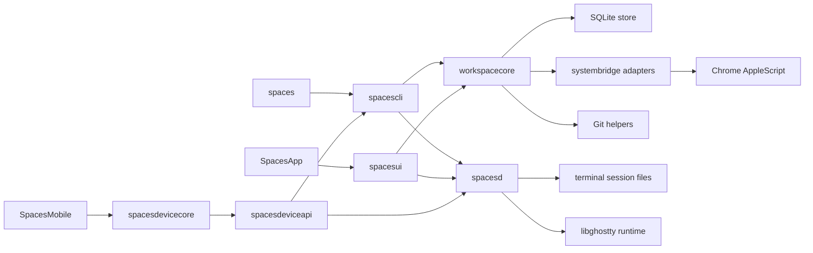
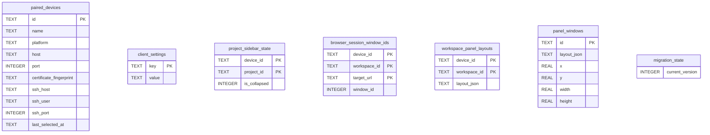

# Architecture

This document describes how Spaces is built and why: module boundaries, storage, runtime flows, external integrations, and the rationale behind the major design choices. User-visible behavior belongs in [spec.md](spec.md). Built-in terminal architecture and implementation details live in [terminal.md](terminal.md); this document names terminal modules only where they connect to the broader system.

## System Overview
Spaces is a macOS Swift app and CLI built around a shared orchestration layer.

Core invariants:
- SQLite is the single source of truth for persisted model data and global preferences.
- The macOS client tracks and focuses windows itself: its own AppKit windows for Spaces terminals, Chrome AppleScript window IDs for browser sessions, Spaces terminal session IDs for processes and coding agents, and process IDs for cleaning up non-terminal processes.
- Workspace settings are seeded from project templates at workspace creation and preserved as per-workspace overrides after that.
- Store startup migrates older databases serially through every intermediate schema version and fails closed for versions it has no migration step for.
- GUI and CLI both call the same orchestration layer instead of re-implementing behavior independently.

## Module Map

## Runtime Process Communication

```mermaid
flowchart TD
  subgraph device["spacesd device (macOS or Linux)"]
    spacesd["spacesd\nDevice API + TerminalService"]
    core["workspacecore"]
    db[("~/.spaces/spaces.db")]
    runtimeFiles[("~/.spaces/runtime")]
    workspaces[("~/spaces/workspaces")]
    tlsIdentity["TLS identity"]
    pairedClients["device-pairings.json\npaired-client token hashes (file store, not spaces.db)"]
    terminal["Ghostty session core\nper terminal session"]
    child["Shell / process / coding-agent child"]
  end

  subgraph macClient["macOS client"]
    app["Spaces.app / spacesui"]
    clientDB[("<profile-root>/Client/spaces-client.db")]
    clientSecrets["<profile-root>/client-secrets\npaired-device tokens, 0600 files"]
    chrome["Google Chrome"]
    ssh["OpenSSH\nterminal, browser forward, editor"]
  end

  subgraph ios["iOS client"]
    iosApp["SpacesMobile"]
    iosKeychain["Keychain\npaired-device tokens"]
    iosContainer[("client DB in app container")]
  end

  cli["spaces CLI / MCP server"]
  bonjour["Bonjour / NetService"]

  spacesd --> core
  core <--> db
  spacesd --> runtimeFiles
  spacesd --> workspaces
  spacesd --> tlsIdentity
  spacesd --> pairedClients
  spacesd --> terminal
  terminal <-->|PTY bytes, resize, input, foreground process samples\nSPACES_* environment| child

  app --> clientDB
  app --> clientSecrets
  app --> chrome
  app -->|Device API JSON\nTLS pinned daemon identity + paired-client token| spacesd
  iosApp --> iosContainer
  iosApp --> iosKeychain
  iosApp -->|Device API JSON\nTLS pinned daemon identity + paired-client token| spacesd
  cli -->|TerminalService/profile JSON\nlocal Unix socket| spacesd
  cli --> clientDB
  cli --> clientSecrets
  cli -->|Device API JSON\nTLS pinned daemon identity + paired-client token| spacesd
  spacesd -->|publishes endpoint metadata only| bonjour
  app -->|discovers host and port| bonjour
  iosApp -->|discovers host and port| bonjour

  app -->|remote macOS terminal attach\nSSH BatchMode + known-host validation| ssh
  chrome -->|remote browser URL through ssh -L| ssh
  app -->|remote worktree URI through SSH-capable editor| ssh
```

- `spacesd` is per device. On macOS and Linux it owns the daemon database, runtime files, workspace root, TLS identity, projects, workspaces, terminal sessions, process rows, agent rows, alerts, notes, and paired-client records.
- The Device API is hosted inside `spacesd`. It exposes device info, pairing, paired-client management, project and workspace CRUD, terminal lifecycle and control, process lifecycle, coding-agent lifecycle, notes, setup state, alerts, and configuration import/export.
- Device API transport uses two authentication layers: clients pin the daemon's self-signed TLS identity from pairing metadata, then include a per-client token issued during the short-lived pairing window. Tokens are stored only as hashes by the daemon. The macOS client stores its issued secrets as owner-only files under `<profile-root>/client-secrets` (0700 directory, 0600 files) so every client process sharing the profile — the app, the `spaces` CLI, and the MCP server — can read them headlessly; `SPACES_CLIENT_SECRET_DIR` overrides the directory for test isolation. The iOS client stores its secrets in Keychain.
- macOS and iOS clients keep only client-local metadata in SQLite: paired device list, local device label, editor preference, keyboard bindings, local window IDs, browser window mappings, and focus history; the iOS client also stores its active-device selection. Editor windows are not tracked here; the client re-focuses an open editor by re-launching the folder (see editor integration below).
- Before a client database migration, the client creates a timestamped metadata-only backup. If migration fails, it restores the latest backup and surfaces a startup error. Pairing tokens stay in the client secret store and are not copied into SQLite backups.
- The `spaces` CLI and its MCP server are Device API clients with the same per-profile identity, paired-device records, and credential files as the Mac app: `spaces device pair/list/remove` manage pairings, and `terminal list`, `terminal send text`, `terminal send bytes`, and `terminal tail` with `--device` (plus the MCP `device` arguments) ride the Device API `overview`, `sendTerminalInput`, and `tailTerminalOutput` commands. Local terminal commands without a device selector use the profile service socket and session files. The client SQLite connection sets a busy timeout because the app, CLI, and MCP server write pairing records from separate processes.
- Direct Device API reachability is required through LAN, VPN, Tailscale, or equivalent network configuration. There is no relay transport.
- macOS remote-device pairing, terminal attach, browser forwarding, and editor opening require SSH to the same device. The `--ssh` pairing path is thin sugar: it validates SSH with `BatchMode=yes` and `StrictHostKeyChecking=yes`, runs `~/.spaces/bin/spaces device pair --json` on the remote device to obtain its `spaces://pair` link, then redeems that link over the pinned-TLS Device API. Repo-local development profiles prefix that SSH pairing command with `SPACES_DB_PATH` and `SPACES_RUNTIME_DIR` for the matching remote `~/.spaces-dev/profiles/spaces/<profile-name>/` root, so the app and CLI pair with the same remote daemon that the dev launcher installed. A lightweight probe reads the remote OS (and, for Linux, the `/etc/os-release` ID and version) only to tailor install guidance whenever the remote cannot hand back a pairing window — whether `spaces` is missing outright or runs but returns no pairing metadata. The remote command's exit code is treated as unreliable because Tailscale SSH (and some other non-OpenSSH transports) report exit 0 even when the remote command failed; a missing `~/.spaces/bin/spaces` then reaches the client as exit 0 with empty stdout. Not-installed detection therefore also inspects stderr for the shell's missing-binary text (`no such file` / `not found`) when stdout carries no pairing JSON, which is safe precisely because there is no pairing JSON to misread. Pairing uses the Device API at the effective OpenSSH `HostName` and returned API port, so SSH aliases resolve to direct LAN, VPN, or Tailscale endpoints without using daemon-advertised interface metadata.
- Pairing is version-gated in both directions. The `spaces://pair` link (version 3) advertises the daemon's `SpacesWireProtocol.version` and app version; the redeeming client evaluates `SpacesWireCompatibility` and refuses an incompatible link before consuming the one-time window, and the daemon rejects a pair request whose `clientProtocolVersion` differs from its own before validating the code (an absent version reads as too old). The pre-authentication daemon gate discloses the daemon's app version, which is an accepted trade for never burning the window on an incompatible client.
- Not-installed remote-device pairing fails as a structured `remoteSpacesNotInstalled(message:linuxInstallCommand:)` error rather than a plain string, so the client can render the install command as a distinct affordance instead of parsing it out of prose. A Mac target carries no install command (a Mac is directed to install the Spaces app and open it once); an Ubuntu 24.04 target carries the version-pinned `curl -fsSL https://usespaces.dev/install.sh | bash -s -- <version>` command built from the client's own wire-protocol-compatible version, matching what the daemon compatibility block prints for an already-paired, wire-incompatible Linux device.
- `SpacesDevicePairingClient.installSpacesOnRemoteDeviceAndPair` is the recovery entry point behind the "Install Spaces over SSH" pairing action. It opens an SSH `ControlMaster` and runs the version-pinned installer (rebuilt from the client's own app version, matching the command the not-installed error carries) on the remote device with a 600-second timeout to allow for the artifact download and systemd service startup, then on success re-runs the normal `--ssh` pairing path over that same multiplexed connection so the newly installed daemon is paired without a second user action. The SSH-run form downloads `install.sh` to a temp file and executes it rather than piping `curl | bash`: under the remote `sh -c` wrapper a pipeline exits with bash's status — 0 on an empty stream — so a failed download of the installer itself would otherwise read as a successful install and fall through to a misleading pairing failure.
- The single Linux install/upgrade path is `scripts/spaces-install-linux.sh`, served at `https://usespaces.dev/install.sh`. `apps/web`'s npm `prebuild` step copies the script into `apps/web/public/install.sh` as its single publish path — the script is not uploaded as a per-release GitHub asset. The script accepts an optional version argument: omitted, it resolves the latest release by following GitHub's `releases/latest/download` redirect to the signature-verified manifest; a version argument pins that release directly. Either way it downloads the signed `spaces-remote-artifacts.json` for the resolved version, verifies its Ed25519 signature against the embedded public key (kept in sync with `AppVersion.remoteArtifactPublicKey` by a `workspacecoreTests` drift test) before trusting the manifest's `app_version`, checksums the matching Ubuntu 24.04 archive, and runs the bundled `install.sh` (which creates the managed helpers, creates the `~/.local/bin/spaces` PATH alias, and enables systemd user lingering before starting the user service so Spaces survives SSH disconnects). Verifying the signature before trusting `app_version` matters because the resolved version comes from the same manifest the signature protects — an unverified redirect target could otherwise smuggle in an arbitrary version string.
- iOS direct terminal control uses one serialized pinned-TLS command channel per daemon endpoint. TerminalService requests carry an optional top-level auth token and exactly one tagged command payload, so each command owns only its request-specific fields. Non-stream requests are newline-framed on that channel and must receive the expected response shape, such as `controlResponse` for control commands or `sessionState` for explicit state reads. Live render and ownership updates are delivered by the separate direct `subscribe` stream, so input, key, resize, and scroll control responses do not carry session snapshots.
- Terminal control uses a flat JSON request shape while `TerminalControlCommand` provides the typed view used by daemon, Device API, and session-core dispatch. Owner-client gating and post-takeover state inclusion are properties of that typed command rather than repeated raw-string checks.
- Text sends that represent paste carry `asPaste` on `TerminalControlRequest` and `SpacesDeviceTerminalControlRequest`. macOS Ghostty-backed sessions route those sends through `ghostty_surface_text`, which reads the terminal's bracketed-paste mode and applies Ghostty paste encoding. Linux headless sessions use `spaces_ghostty_vt_session_encode_paste`, which queries `GHOSTTY_MODE_BRACKETED_PASTE` from libghostty-vt and calls `ghostty_paste_encode` before writing the encoded bytes to the PTY. Raw typing, key input, CLI/MCP terminal sends, and agent-facing terminal input keep the raw-byte path.
- Local Unix socket transports rely on profile-scoped paths under the shared per-user `/tmp/spaces-sockets-<uid>/` root, created `0700` and re-validated (real directory, owned by the current user, no group/other access) before any socket binds into it, so a predictable `/tmp` path can't be pre-squatted by another local user. `TerminalServicePaths` and `TerminalSessionPaths` are the source of truth for resolving and hashing profile paths; real-system harnesses read those paths through `spacese2e profile-socket-paths` instead of duplicating path normalization. The same rule applies to Mac Device API client identity: harnesses read the current profile's installation ID through `spacese2e mac-client-installation-id` instead of reimplementing client profile hashing. These helpers are not cross-user or cross-profile APIs.
- Bonjour advertises only discoverability metadata for the Device API. It is not used for trust or authorization.
- Terminal control remains on profile-scoped Unix sockets and the authenticated Device API; the public CLI does not expose a TCP terminal-control bridge.

## Filesystem Layout
Spaces uses the cross-platform dev-tool dotdir convention (all app state under `~/.spaces` on macOS and Linux) rather than platform-native directories (`~/Library/Application Support`, XDG). This keeps the layout and code path identical across platforms, keeps paths space-free for shell tooling and AF_UNIX sockets, works on headless servers, and stays discoverable for CLI users.

- Profile roots: `~/.spaces` for installed builds; `~/.spaces-dev/profiles/spaces/<branch-slug>-<worktree-hash>` for repo-local development builds; `SPACES_DB_PATH` overrides the root explicitly for any build.
- User project data lives at the visible `~/spaces/{workspaces,repos}`, deliberately outside the profile root since it is the user's own working files, not app state.
- Sockets and lock files live under the shared, hardened `/tmp/spaces-sockets-<uid>` root, with hashed, profile-scoped filenames (see [Runtime Process Communication](#runtime-process-communication) above).
- macOS install locations: `/Applications/Spaces.app`, `/usr/local/bin` symlinks, `~/Library/LaunchAgents/dev.usespaces.spacesd.plist`, `~/.spaces/bin`.
- Linux install locations: `~/.spaces/daemon/releases/<version>` plus a `current` symlink, `~/.spaces/bin`, and the systemd user unit `~/.config/systemd/user/spacesd.service`.

## Module Responsibilities
- `SpacesApp`: minimal app entry point that boots AppKit.
- `spacesd`: per-device background executable for the Device API, daemon-owned project/workspace state, built-in terminal sessions, process and agent runtimes, pairing, and paired-client control; terminal behavior lives in [terminal.md](terminal.md).
- `spacesui`: AppKit UI layer that renders state and dispatches actions into `workspacecore`. Shared visual language lives in `Theme.swift` (brand color tokens mirroring `apps/web/app/globals.css`) and `RowPrimitives.swift` (status dot, type icon/text tile, shortcut/project/branch chips, sidebar shortcut hints, `ColoredBackgroundView` helper). The right pane's footer strip carries the selected workspace's identity and actions (status dot, name, branch, selectable path, focused-pane title, notes popover, launch/restart/stop/overflow), while the sidebar footer holds the app identity row (logo, name, devices/settings/reload); pane and derived tab titles resolve through the sidebar's runtime-target names, and ⌘W closes the focused pane through the panel coordinator. Workspace configuration editing lives in the workspace settings dialog (`AppKitController+WorkspaceSettingsDialog.swift`), a free-standing form window presented through the same `presentFormWindow` chrome as project settings; it stacks the five configuration sections (Browser sessions, Processes, Coding agents, Services, Stop script) with runtime controls disabled, and each section edit commits immediately through `updateDeviceWorkspaceConfig`. Each section is a self-contained class (e.g. `ProcessesSection.swift`) that owns its transient form state, swaps each row between collapsed and editing subviews via `NSAnimationContext`, and publishes commits through an `onCommit` closure. Service rows render the DNS-label service name plus the currently assigned port number and derived routed URL from `workspace_service_ports`, mirroring how browser-session rows separate configured input from resolved display output. Project-template service rows use the same secondary detail slot for comma-separated `SPACES_<SERVICE>_PORT` and `SPACES_<SERVICE>_URL` hints because no assigned workspace port exists yet; the service-name field's ordinary blur end-edit notification routes through the same save closure as Return and the checkmark, trimming and lowercasing before validation so valid blur edits commit once and invalid blur edits stay open. Cancel clicks and row rebuilds mark the next end-edit notification as non-committing so explicit cancel and runtime-display refreshes do not persist drafts. For a remote workspace with a live SSH forward the assigned-port text is `<remote>:<local>` (the device's assigned port and the Mac-local forwarded port, read from a lock-guarded `BrowserSSHForwardManager` snapshot); a local workspace, or a remote service without a live forward, shows the bare assigned port. Starting or stopping a forward while the workspace settings dialog is open refreshes its Services rows in place through `refreshVisibleServicePortDisplays` (a `reload` that preserves open row editors). Runtime targets render as compact rows under every visible workspace row in the sidebar: `SidebarRuntimeTargetItem.swift` derives them from the same `workspaceShortcutTargets` ordering the numbered shortcuts use; cycling applies an already-open subset, identified by the cycle-cursor key scheme; `SidebarController` exposes them as an `OutlineItem.runtimeTarget` child level (memoized per workspace, auto-expanded, non-selectable, with compact `⌘<number>` hints only on the selected workspace and state-tinted icons and titles); `SidebarOutlineView` draws the selected workspace highlight behind the workspace row and its visible runtime-target rows so the selection reads as one region; left click routes through the shared `executeWindowFocusResolution` dispatcher so sidebar clicks, the command palette, numbered shortcuts, and cycling behave identically; right click builds a Start/Stop/Restart/Rename context menu calling the same Device API mutations the old detail sections used. Inline target rename follows the device-rename pattern (editor swapped into the row, commit/cancel routed through `control(_:textView:doCommandBy:)`); ad hoc terminals rename through the `renameTerminalSession` Device API command, while configured processes, coding agents, and browser sessions rename their workspace-config entry. The `⋯` overflow menu is built by the static `AppKitController.makeWorkspaceOverflowMenu(workspaceID:path:target:)`, which emits a stock `NSMenu` whose path-based items forward to `copyDirectoryPath(_:)` and `revealDirectoryInFinder(_:)`, while workspace actions use the same shared `senderIdentifier(_:)` helper for `NSMenuItem` and `NSControl` senders. Update delivery also lives here: `AppKitController` owns a programmatic `SPUStandardUpdaterController` from Sparkle, wires the application menu’s `Check for Updates...` item directly to Sparkle, and relies on one stable appcast feed configured in the app bundle metadata. That stable feed serves one universal Sparkle archive and one manual-download DMG rather than arch-specific release artifacts.
- `spaces`: executable shim that boots the declarative CLI parser.
- `spacescli`: declarative `swift-argument-parser` command tree for `spaces`, including command help, leaf validation, translation from CLI inputs into orchestration calls, terminal and mobile subcommands, and profile or desktop-control inspection helpers used by dev and real-system workflows.
- `spacesterminalcore`: shared terminal runtime primitives and protocols; the built-in terminal control, persistence, rendering, and CLI-tail details live in [terminal.md](terminal.md).
- `spacesdevicecore`: first-party Device API request and response types shared by macOS, iOS, and daemon Device API code. Requests use a typed command envelope with command-specific payloads, and responses use a typed result envelope for overview, mutation, terminal state, workspace-create options, project-preview, directory-suggestion, auth-token, and terminal-link payloads. The shared DTOs expose project summaries, workspace summaries, configured process rows, coding-agent rows, workspace-terminal rows, run-state values, agent activity values, workspace-creation options, mutation outputs, and compatibility decode defaults without depending on `workspacecore`.
- `spacesdeviceapi`: daemon-hosted first-party Device API transport and local daemon control socket. It assembles overview data from `workspacecore` records and spacesd session catalogs, routes authenticated mutation commands back through the same orchestration paths used by local daemon operations, and uses typed control commands for status, pairing windows, paired-device administration, and local-client bootstrap. Terminal transport behavior lives in [terminal.md](terminal.md).
- `spacesruntimecore`: daemon-safe runtime helpers that avoid workspace, UI, Keychain, Bonjour, and AppKit dependencies. Device-local worktree preparation uses this target for Git command execution and fast-forward-only refresh checks.
- `spacesterminalmobileghostty`: iOS terminal adapter for Ghostty-backed mobile rendering and input mapping; details live in [terminal.md](terminal.md).
- `spacesterminalghostty`: embedded libghostty integration and app-side host adapters; details live in [terminal.md](terminal.md).
- `spacesterminalui`: native terminal-session window controllers owned by the Spaces app; details live in [terminal.md](terminal.md).
- `workspacecore`: core orchestration, lifecycle, validation, persistence coordination, environment building, and the shared `AppVersion` constants consumed by both the GUI and CLI. Those constants are generated from `apps/macos/AppVersion.plist`, which is also the source for the macOS and iOS app bundle `Info.plist` versions. All three are written by `scripts/sync-app-version.sh` (see [dev.md](dev.md)). The Mac and iPhone apps share one version because the iPhone app decides whether a daemon update is pending by comparing its own bundle version against the version the daemon reports, so independently authored client versions would make that comparison meaningless.
- `systembridge`: system adapters for shell commands, Chrome, and related OS integrations.

### Terminal Architecture Reference
- Built-in terminal ownership, session layout, Ghostty compatibility, macOS and iOS rendering, Device API terminal behavior, scroll rendering, CLI controls, and terminal validation live in [terminal.md](terminal.md). This document references terminal modules only where they connect to non-terminal systems.
- Ghostty action callbacks are decoded into typed events before reaching UI surfaces. `OPEN_URL` is handled only as terminal link opening, and `MOUSE_OVER_LINK` drives pointer affordance. App, window, tab, and config actions remain outside Spaces' terminal surface contract.
- macOS terminal link opening classifies a clicked string with `SpacesDeviceTerminalLinkClassifier.route(for:)` and dispatches a file link to `TerminalArtifactHandlerRegistry` by artifact kind rather than always handing off to the system workspace opener (see Device API Workspace Transport below for the local/remote split and the registry).
- The iOS Ghostty mirror registers a per-surface action handler. A terminal tap is first offered to Ghostty at the tapped cell coordinate so Ghostty can emit an `OPEN_URL` action for detected links; taps without a detected link continue through the normal input-focus path.

### Device API Workspace Transport
- Mobile overview construction reads projects, non-archived workspaces, workspace settings, running-process records, agent-window records, tracked terminal windows, and live terminal sessions. The builder returns project summaries plus per-workspace runtime rows that are safe for local filtering by row type, run state, and search text.
- The iOS shell is `RootTabView`: a `TabView` whose selection lives on `SpacesMobileAppModel` (`selectedTab`) so pairing links, auth recovery, and the not-paired prompt can switch tabs, with one `NavigationStack` per tab. The Alerts, Spaces, and Agents tab roots are keyed by `activeDeviceID`, which discards their retained navigation and detail state when the device changes. The Alerts, Spaces, and Agents tabs each run the shared `overviewPolling` task, which refreshes every two seconds only while the scene is active, that tab is selected, the device is paired, and no detail route is open; terminal-detail and pending-launch destinations come from the shared `terminalSessionNavigation` modifier so all three tabs open sessions the same way. Browser sessions are listed only by the Spaces tab, so `SelectedBrowserSessionRoute` and its `BrowserSessionDetailView` destination live there rather than in the shared terminal navigation, and that tab counts an open browser session as a detail route that pauses its poll. The browser proxy serves every tab, so `RootTabView` — not a tab — observes the scene phase to start it on foreground and stop it on background. Settings replaces the sheet-based devices flow: `isShowingConnectionSettings` selects the Settings tab and pushes the Paired Devices screen, and popping it clears the flag and any pending pairing link.
- The iOS Alerts tab derives attention events client-side in `SpacesMobileAttention`, a pure function over the overview payload. Recency comes only from payload fields — coding-agent `updatedAt` for waiting/finished, process `exitedAt` for exits, and the linked session's `updatedAt` for exited terminal rows and loose sessions — parsed as ISO-8601 with either fractional or whole seconds; a source without a parseable timestamp yields no event. Event identity is `source|kind|date`, so the in-memory `dismissedAlertIDs` set keeps a cleared event cleared across refreshes until the source changes state. The derivation reuses the home tab's session/row dedupe: sessions represented by a configured row never produce a second event. Agents grouping (`SpacesMobileAgentGrouping`) is likewise a pure overview function so both derivations are unit-tested without a daemon. Workspace collapse state is an in-memory `collapsedWorkspaceIDs` set on the model.
- The iOS Spaces tab's workspace-level actions reuse existing Device API commands, so they need no protocol change: Start/Stop/Restart map to `launchWorkspace`/`stopWorkspace`/`restartWorkspace`, and Hide is `updateWorkspaceMetadata` with `updatesHidden`. Hide reads a fresh overview before deciding whether to stop the workspace, then hides it, so a cached stopped row cannot conceal work another client started. Which workspaces a client lists is one rule shared by both platforms — neither archived nor hidden (`visibleWorkspaces` on iOS, `isVisibleWorkspace` in the Mac sidebar) — because `isHidden` is daemon-owned workspace state rather than a per-client view preference. A hidden workspace's loose terminal sessions are dropped with it, so hiding cannot leave its terminals behind as an orphaned group.
- Configured runtime-row rename fetches a fresh overview inside the mutation, resolves a process or coding agent by its stable config ID (or a browser session by its unique configured name), and replaces that current config with only the resolved entry renamed. Concurrent edits represented in the fresh config are preserved, and an entry removed by another client produces an error instead of mutating a different array position.
- Runtime row order is a single grouped sequence both clients follow: browser sessions, configured processes, coding agents, then ad hoc terminals. On macOS `orderedWorkspaceRunShortcutTargets` walks its interleaved process/terminal entry list twice — configured processes first, terminal windows after the agents — so each family stays contiguous, and because the sidebar rows and the `⌘1`-`⌘0` shortcuts both index into that one sequence, a row's position always matches its shortcut number.
- Process rows are keyed by configured process identity and annotate live or exited runtime when a matching running-process record exists. Coding-agent rows keep configured launcher slots stable and append unmatched live agent rows after configured rows. Workspace-terminal rows exclude terminal sessions already claimed by process or agent runtime records.
- Mutation responses carry `ok`, a user-facing message, and a typed mutation result containing a refreshed overview plus action-specific identifiers such as `workspaceID` or `sessionID`. The refreshed overview keeps clients synchronized after create, run, stop, restart, or terminal-open actions without requiring the client to infer affected rows.
- Workspace creation requests use the same project and git semantics as the macOS GUI. The Device API supplies per-project creation options and accepts branch mode, branch name, base branch, notes, and existing-branch reuse intent; the checkout directory name is generated by the daemon rather than supplied by the client.
- Folder-based project creation runs on the owning daemon. `previewProject` validates a directory path on the daemon, detects git, and returns the project name plus a project-config payload assembled from any `spaces.yaml`; `listDirectories` returns child-directory suggestions for a partial path, expanding `~` and preserving a typed tilde prefix. The macOS New Project form uses these for path autocomplete and `spaces.yaml` hydration on both the local Mac and selected remote devices, so the daemon's filesystem is the single source of truth for directory validation.
- Device API workspace-terminal creation uses workspacecore's reservation path as the singular launch path. Reservation persists the launch configuration, a `.starting` runtime state, empty terminal output and service-log files, a tracked workspace terminal window row, and workspace running state, then returns the mutation response with the reserved `sessionID` before the shell backend is ready. A background launch task uses a fresh SQLite store and orchestrator to finish daemon startup for that same session.
- Background workspace-terminal launch success updates the reserved session through normal terminal persistence, including running runtime state plus control and subscription socket availability. Launch failure writes a `.failed` runtime state, detaches clients, removes control and subscription sockets, deletes the reserved terminal window row, and clears workspace running state when no other tracked runtime indicators remain.
- macOS active-remote-device workspace-terminal opens build the local mirror window from the returned mutation session metadata, including `.starting` state, service PID, timestamps, title, working directory, and terminal kind. iOS workspace-terminal opens return the same `.starting` session to navigation immediately. Terminal detail surfaces treat a missing live state stream for a `.starting` session as pending startup and retry silently until the stream is available or the session transitions to a terminal failure state.
- macOS active-remote-device terminal focus opens a local mirror window backed by Device API terminal state and control requests for the selected session. The focus path uses workspace and terminal identities from the remote overview, so the selected workspace does not need a matching record in the local daemon database.
- Mac image paste into daemon-owned terminal windows uses the Device API `terminalPasteImage` command with `sessionID`, `clientID`, `ownerEpoch`, `fileExtension`, and binary `imageData`. The macOS pasteboard reader checks pasteboard data length before image decoding and checks image file URL size before reading file contents. Remote terminal windows dispatch the upload from an async paste callback; the blocking request-client send runs off the main actor and returns to the main actor only for status and refresh updates. This is a mutating command and is not replay-safe after an ambiguous connection failure because retrying can create multiple temp files and send multiple path strings to the PTY. The daemon validates the active owner client and render owner epoch, rejects ended or unavailable sessions, empty data, unsupported extensions, and payloads over 10 MiB, writes the payload as `/tmp/spaces-paste-<uuid>.<ext>` with owner-only permissions, then sends the resulting daemon-local path through the existing owner-gated terminal input path. This deliberately stays image-only rather than exposing a general remote clipboard bridge.
- Mobile workspace-terminal stop requests pass workspace ID and session ID into workspacecore's ad hoc built-in terminal stop path. The path rejects process- and agent-owned sessions, terminates the matching service session, removes tracked terminal rows, and can resolve live sessions by working directory when a tracked window row is already gone.
- Mobile process mutations call configured-process recovery for missing runtimes and running-process stop or restart for live runtimes.
- Mobile coding-agent mutations call the workspace agent lifecycle methods. Stop removes runtime state and terminates the backing Spaces terminal session while preserving configured launchers. Restart resolves the claimed or configured launcher ID first, falls back to launcher names only for records without an ID claim, and launches that configured row again.
- Terminal link preview uses authenticated Device API commands. `resolveTerminalLink` classifies direct HTTPS URLs or readable Mac files and returns metadata for previewable artifact kinds (raster image, video, PDF, Markdown, text, HTML); `readTerminalLinkChunk` streams approved local files by stable link ID and byte range. Relative paths resolve against the session working directory, `~` resolves to the Mac user home directory, and resolved paths must be regular readable files. The Device API records a short-lived in-memory approval for each resolved local link, chunk reads require an exact link ID and session match against that approval, and successful chunk reads refresh the approval while the transfer is active. `SpacesDeviceTerminalLinkClassifier` (`spacesdevicecore`) is the single cross-platform source for this: `artifactKind` classifies a link's content type/extension into a previewable kind through shared extension and content-type tables first, falling back to `UniformTypeIdentifiers` conformance (Apple) or hand-maintained extension sets (Linux) for image/video only; `route` separately classifies a raw link string as a web URL, a loopback URL (same-Mac dev server, resolved by a future tunnel), or a file link, so that decision cannot drift between macOS and iOS. The tables are checked before any `UniformTypeIdentifiers`/OS fallback, so a locally readable file's extension always wins over a possibly-wrong or absent server-reported content type. SVG/vector image MIME types are not previewable media. `route`'s loopback check is a pure string test on the host (`localhost`, a `127.0.0.0/8` address, `::1`, `0.0.0.0`); it does not decide whether that loopback link is safe to open, because `resolveTerminalLink` runs on the daemon, which cannot tell whether the requesting client is itself the session's local device or a separate paired device asking about someone else's `localhost`. Each client answers that question locally instead — the macOS coordinator carries an `isLocalDevice` flag, and iOS (always a separate device from the Mac) treats every loopback route as unreachable. The `pdf`/`markdown`/`text`/`html` artifact kinds and the `mediaKind` → `artifactKind` field rename belong to `SpacesWireProtocol.version = 4`.
- Mac file serving for iOS previews is limited after symlink resolution. User home paths, workspace paths, `/tmp`, `/var/tmp`, `/private/tmp`, `/private/var/tmp`, `/opt`, and `/usr/local` are allowed; system and protected roots such as `/System`, `/Applications`, `/Library`, `/bin`, `/sbin`, `/usr/bin`, `/usr/sbin`, `/usr/lib`, `/usr/libexec`, `/usr/share`, `/etc`, `/dev`, `/cores`, `/Network`, `/Volumes`, `/private/etc`, `/private/var/db`, and `/private/var/root` are rejected.
- The iOS client sends preview metadata and chunk requests over a preview-specific command connection so file transfer cannot interleave with terminal input RPCs. Each preview request carries a generation token so overlapping taps cannot present stale metadata, downloads, or errors. Downloaded preview files are stored in a temporary cache keyed by a SHA-256 digest of the session and link metadata; direct HTTPS artifact URLs are downloaded to disk and validated against the promised artifact kind before being moved into that cache, while local-file links are assembled from `readTerminalLinkChunk` responses by `SpacesDeviceTerminalLinkChunkTransfer` (`spacesdevicecore`), a platform-neutral helper shared with macOS's remote-file fetch path that writes each chunk to disk as it arrives, validates its link ID, offset, and decoded byte count, and bounds the transfer by the link's resolved byte count so a server that never signals the final chunk cannot loop forever. Direct HTTPS validation accepts a matching specific response MIME type, or a generic/plain-text response when the final or resolved URL extension confirms the promised kind; a conflicting specific response kind is rejected before caching. Both the direct-artifact and local-file downloads run as their own cancellable `Task` and are cancelled on preview invalidation; stale preview files are also removed opportunistically. Text-family artifacts (text/Markdown/HTML) are capped at 4 MiB and rejected before download when the resolved metadata reports a larger size; that size is only known for local files today, so an oversized external text-family link is caught only after downloading. The downloaded or resolved file routes to its dedicated viewer by artifact kind — image/video/PDF to Quick Look, text to the monospaced viewer, Markdown to the rendered/raw viewer, HTML to the isolated web view — and a resolved link with no artifact kind (a plain web page) also opens in that web view rather than handing off to UIKit/Safari.
- A macOS terminal-link click starts at Ghostty's `OPEN_URL` action reaching `GhosttyMirrorTerminalView`'s link handler, forwarded through a late-bound `TerminalLinkOpenHandlerBox` (the pane's session host is built before the coordinator that needs the pane's view for its banner) to a per-pane `TerminalLinkOpenCoordinator` (`spacesui`). The coordinator is built with an `isLocalDevice` flag (`resolvedDeviceID == SpacesPairedDeviceRecord.localDeviceID`) that decides which of two paths a `SpacesDeviceTerminalLinkClassifier.route(for:)` file link takes. A local session's file link is expanded by `GhosttyTerminalLinkOpener.resolvedURL` (tilde, absolute, and live-working-directory-relative paths) and opened directly through `TerminalArtifactHandlerRegistry`, with no daemon round trip and no kind/path allowlist — deliberately preserving macOS's existing "open anything local" semantics (e.g. a `.swift` path opens the user's editor) instead of restricting local opens to previewable kinds. The local working-directory provider reads the foreground process's live cwd from the OS before falling back to runtime-stream, launch, or request metadata, matching the daemon path used for cross-device resolution. A remote session's file link instead goes through `DeviceTerminalSessionStateModel`'s request sender to the Device API's `resolveTerminalLink` and, on a cache miss, `readTerminalLinkChunk` — assembled by the shared `SpacesDeviceTerminalLinkChunkTransfer` helper into a SHA-256-keyed temp cache (`SpacesTerminalLinkArtifacts`, 24h GC once per app launch) — before opening by artifact category through the same registry; `SpacesDeviceTerminalLinkResolver`'s path allowlist and previewable-kind restriction apply only to this cross-device transfer, not to local opens. `TerminalLinkActivityBanner` shows fetch progress with Cancel, a transient error, or the loopback notice over the pane; a new click or pane teardown cancels any in-flight fetch via a bumped generation counter, so a superseded fetch can never open a file or update the banner after the user moved on.
- `TerminalArtifactHandlerRegistry` (`spacesterminalghostty`) dispatches a resolved artifact URL to one handler per `TerminalArtifactCategory` — the `SpacesDeviceTerminalLinkArtifactKind` cases plus `.webURL` for a plain web link, which has no on-device preview counterpart. `defaultRegistry()` opens every category through `NSWorkspace.shared.open(_:)` except `.html` and `.webURL`, which resolve the default browser via the app registered for `https:` and open there directly, so an HTML file renders as a page instead of opening in whatever app the file's extension is otherwise associated with. The registry is built as the seam for a later per-category default-app override sourced from `ClientSettingsKey` (e.g. "always open PDFs in Preview"); no such setting exists yet, so `defaultRegistry()`'s fixed handler set is the only registry constructed.
- `TerminalWebArtifactView` (`apps/ios`) hosts HTML artifacts and external web pages in a `WKWebView` configured with a fresh `.nonPersistent()` website-data store per presentation — unlike the browser-sessions feature's web view, which deliberately persists per-service cookies and storage so a dev server keeps the user logged in across visits. A terminal-link preview can show arbitrary, untrusted content (an agent-authored file, a linked third-party page), so each presentation must not leak or reuse browsing state. A local HTML artifact loads via `loadFileURL(_:allowingReadAccessTo:)` scoped to that single file, so a sibling asset referenced by a relative path (a stylesheet, script, or image) is unreachable — HTML artifacts are treated as standalone documents, not a directory of assets. Artifact loads (`.fileURL` and `.htmlString`) install a WebKit content-rule list that blocks `http`, `https`, `ws`, and `wss` requests and the navigation delegate cancels direct network navigations; plain `.request` web page previews remove that rule and keep normal web networking. `TerminalMarkdownArtifactView` renders Markdown the same way: it builds a self-contained HTML document from a vendored markdown-it 14 (JS and CSS inlined from the app bundle, since the isolated web view has no network access) and loads it into `TerminalWebArtifactView` via `.htmlString`. `markdownit({ html: false })` keeps any raw HTML embedded in the Markdown source inert — rendered as escaped text rather than injected markup — since the source can come from an untrusted terminal session. The source is embedded into the generated `` that would break out of the script context. Raw mode reuses the plain-text viewer directly against the same downloaded file.
- The recovery launch environment overwrites `SPACES_DB_PATH`, `SPACES_RUNTIME_DIR`, and `SPACESD_EXECUTABLE` with the current profile database path, runtime directory, and service executable path. This binds the relaunched app to the same profile and keeps app-side terminal prewarm pointed at the still-running service binary instead of deriving a different profile or service path from the app process environment.
- Terminal sessions present as panes inside tabbed panels, not as standalone windows. The panel machinery lives in `spacesui/Panels/`: `PanelLayout`/`PanelLayoutEngine` are pure value types and mutations (splits, closes with collapse, pruning, focus fallback) serialized as versioned JSON into the client database (`workspace_panel_layouts`, `panel_windows`); `PanelCoordinator` (an `AppKitController` sub-controller) owns per-scope layouts, views, and one `TerminalPaneContentController` per open session — enforcing at most one pane per session across all panels — and `WorkspacePanelView`/`PanelTabBarView`/`PaneTreeView`/`PaneView` render tabs and nested `NSSplitView` pane trees with stable, re-parented leaf containers so a Ghostty surface is never recreated by structural changes. The selected workspace's panel fills the main window's right pane edge to edge — workspace identity and actions live in the right pane's footer strip (status dot, name, branch, directory, notes popover, launch/restart/stop/overflow), populated by the shared detail-container preparation so the panel, loading, and setup views all carry it, while the sidebar's own footer holds the app identity row; the panel view instance survives workspace switching so reselecting restores the remembered tab and focused pane instantly, and persisted layouts reattach at first display after pruning dead sessions against the overview's session catalog. Pane splitting opens the command palette in a session-picker mode ("New terminal session" plus the sessions in scope — every loaded device's sessions for a panel window); picker rows are built around a placeholder focus request, so picker visibility bypasses the normal palette's focus-identity dedup and shows the ordered list head (`visibleSessionPickerItems`). A picked session that is already open moves to the new pane.
- The main window's tab strip is an `NSTitlebarAccessoryViewController` (`PanelTabStripAccessoryView`) while windowed, not content under a hidden titlebar: AppKit's titlebar left-click handling intercepts events aimed at ordinary content in that region below anything a view can override, while accessories are the supported host for interactive titlebar chrome. The accessory's private clip view sizes a `.left` accessory to its fitting size (collapsing a plain container to zero width), so the view pins the clip to span to the titlebar's trailing edge once it lands right of the traffic lights; the strip inside starts at the sidebar divider and tracks it via `splitViewDidResizeSubviews`. The visible workspace panel adopts the shared strip (`WorkspacePanelView.adoptExternalTabBar`, ownership-checked so background panels never stomp it) and collapses its built-in strip. Native fullscreen hides the titlebar accessory row, so the main-window delegate releases the shared accessory and tells the visible panel to use its built-in strip at the top of the content; exiting fullscreen re-adopts the accessory. Switching to Alerts, compatibility, placeholder, loading, or setup detail releases shared ownership and clears the strip so later background renders cannot re-show stale workspace tabs. Panel windows keep the built-in strip below their titlebars. `PanelTabItemView` draws separators between neighboring tabs and keeps each close button in a fixed-width slot, fading and disabling the glyph until the tab is hovered so tab titles do not shift. Overview ticks that land on the already-visible workspace panel refresh only the footer instead of re-embedding the panel view, so transient chrome anchored inside it (the tab rename editor) survives; the tab strip also skips rebuilds while a rename is in progress and replays the pending state when it ends, and the rename editor selects its text through the field editor (`currentEditor()?.selectAll`) because `selectText(_:)` would end the just-started editing session and instantly commit.
- Global panel windows are the second `PanelScope` (`.globalWindow(panelWindowID:)`): `PanelWindowController` is only the NSWindow shell (frame, title synced to the selected tab, close routing) while all layout state stays in `PanelCoordinator`, which owns the shells keyed by panel window id. "Open in New Window" moves a pane through the same remove-then-insert mutation splitting uses, so the live content controller — and its Ghostty surface — re-parents into the new window instead of being recreated; a session already alone in a panel window just fronts that window. Every session is workspace-owned; global panel windows exist to mix workspace-bound sessions from different workspaces or devices in one window, not to host a workspace-less session. A window shell exists only while its layout has content: every path that empties a global layout (closing the last tab, `⌘W` on it, moving the last pane away, the red close button, a daemon-terminated last session) funnels through one dismissal that persists the deletion and closes the window. Persistence rides the same layout-write hook as workspace panels, adding the live window frame to the `panel_windows` row.
- Panel-window startup reopen is decided per persisted row by a pure function over (row JSON, loaded device ids, live session ids): rows wait while any device their panes reference lacks a loaded overview (an offline or wire-incompatible device therefore never causes a false prune of its persisted windows), prune dead sessions once all devices are ready, delete the row when nothing survives, and otherwise reopen the window at its saved frame without stealing focus. The attempt runs after every device-section load and drains a pending list read once per launch.
- `TerminalSessionPaneViewController` (`spacesterminalui`) owns all window-independent terminal content — renderer switching, attachment lifecycle, Ghostty key translation, find, and the debug-state dump — with an embedded-hosting facade (`showEmbedded`/`hideEmbedded`/`closeEmbedded`/`focusEmbeddedTerminalInput`) that reduces the old window controller's show/close flows to their content parts. Panes render the terminal surface only: runtime lifecycle actions live on the sidebar target rows, and the embedded Ghostty config pins `font-size` to the app's text scale (overriding personal Ghostty config inside Spaces). Keyboard routing runs through the app's local event monitor: a focused pane owns every non-⌘ key via the pane's key translation, ⌘ chords run app shortcuts first, and unclaimed ⌘ chords fall through to the pane's terminal command handling. The Ghostty mirror view reclaims first responder only when focus has fallen back to the window itself (re-parenting during mirror updates resigns it) — the reclaim runs on every render frame for every attached owner pane, so grabbing unconditionally would continuously steal focus from sibling panes and from other controls in the window (tab rename editor, sidebar editors).
- Window focus and cycling are client concerns, reconstructed from the overview rather than an in-process orchestrator (a "window" is per-client state). One device-agnostic dispatcher resolves a focus target — a browser URL, a terminal session, or a run-process/run-agent action — from the selected workspace's overview, shared by sidebar target rows, numbered shortcuts, the command palette, and attention-item focus. Only two leaves depend on where the workspace's daemon runs: a browser session focuses a local Chrome tab, with a remote daemon's service URL first routed through the workspace's SSH forward and the Mac Caddy router before that local Chrome focus; a terminal session opens or focuses its pane through the panel coordinator, and local and remote panes share one device-backed state path through the owning device's Device API instead of the local daemon database. Browser focus uses the tracked Chrome window id when available, falls through to an all-window URL scan to adopt moved tabs, and opens missing sessions into an existing tracked workspace Chrome window before creating a new Chrome window. Run-process and run-agent focus actions share one terminal-backed launch path: the Device API mutation returns the created or recovered terminal session id, the client applies the returned overview, resolves that session into a pane open request, and opens or focuses it through the same terminal-target helper. A missing pane is simply reopened by the dispatcher, so there is no separate "recover this window" prompt. Focusing a terminal target is an owner-intent, foregrounding action symmetric with focusing a browser (which activates Chrome): it brings Spaces to the front — the terminal is a pane inside the main window, so an already-visible-but-backgrounded window is still re-activated — cancels any pending "hide after browser focus" task, and reclaims owner attachment for the session (so a pane that was closed and reopened, or held by another client, reattaches as owner rather than the viewer takeover shell). App activation matters beyond ergonomics: global window-cycle navigation resolves the current cycle target from the focused built-in terminal only while the app is active, so a terminal focus that failed to foreground would make the next cycle start from the frontmost browser tab instead.
- Window cycling rebuilds the same focusable target set client-side and tracks an in-memory cursor, MRU cursor list, and short-lived cycle session per workspace (no database persistence). The current target is resolved from the focused built-in terminal session, then the frontmost Chrome tab URL when Chrome is focused, then the remembered cursor; the fresh cycle snapshot puts that current target first, follows with the workspace's recent focus order, and appends remaining open targets in numbered-shortcut order. The per-burst rotation order keeps rapid presses stable. Each cycle resolution queries the scoped Chrome snapshot for tracked browser sessions so manual browser navigation outside the app is reflected on the next cycle.
- Global window cycling resolves a focused Spaces terminal window to its terminal session workspace before consulting the focused external window. External focus resolves only through a frontmost Chrome active-tab URL that maps to a configured browser session. Remembered terminal focus and active-workspace fallback are used only while Spaces is active, so unrelated external apps and unmapped Chrome tabs leave focus unchanged.
- Explicit pane close detaches process and coding-agent sessions while an ad hoc terminal's pane close uses the ad hoc session stop path. Lifecycle actions never remove panes — the pane keeps showing the session's final render.
- Runtime-target refresh preserves live process-owned and agent-owned Spaces terminal sessions by service runtime state after their native window detaches. Preserved agent sessions clear dead native window IDs during refresh and rebind to the replacement native window when focused. Ad hoc terminal rows require an active or pending attachment and are pruned when their final local or remote attachment is gone.

### Device API and Remote Access
- Each daemon creates or loads a self-signed TLS identity under `~/.spaces/runtime/daemon-tls`. macOS stores the identity as owner-readable PKCS#1 RSA private-key DER and certificate DER files that are loaded into an in-memory Security identity at daemon startup; Linux stores PEM files loaded into the OpenSSL listener. The Device API listener presents this identity on both platforms, and every client — macOS app, iOS app, and the `spaces` CLI/MCP — verifies the daemon's certificate fingerprint before sending any request. Pairing links (version 3) carry the daemon endpoint, nonce, short code, certificate fingerprint, wire-protocol version, and app version; there is no transport key.
- The daemon stores paired-client token hashes and device metadata in its file-based `device-pairings.json` store under the daemon runtime root, not in `spaces.db`. The macOS client stores the issued token in the profile's `client-secrets` file store so the app, CLI, and MCP server can read it headlessly; the iOS client stores its issued token in Keychain. Both clients keep non-secret paired-device metadata in the client database.
- The macOS sidebar renders one section per paired device. `AppKitController` holds a `DeviceSection` per device with an independent load state; the local device loads from the initial snapshot and each remote device's overview is fetched concurrently through `SpacesDeviceClient.overview(device:)`. When the local daemon is unreachable, the snapshot degrades the local section to `.offline` (carrying the failure reason) instead of failing wholesale, so the local Mac surfaces offline the same way a remote does; the Devices settings pane offers a Restart Local Daemon action that calls `TerminalService.relaunch()` directly (a crashed daemon has no control RPC) and then re-renders against a fresh status. The flat id-keyed `projects`/`workspacesByProject` lookups are rebuilt as the union of all loaded sections — safe because project and workspace ids are globally unique — and daemon mutations resolve their target device from the selected row, falling back to the local device. The iOS client keeps a single active-device selection. Each client stores its own paired-device metadata independently from daemon state so switching clients does not mutate any daemon's workspace records.
- Remote sidebar sections stay live through a per-paired-device overview push subscription, not polling. The initial `SpacesDeviceClient.overview(device:)` fetch gives immediate population; `SidebarController` then opens a `subscribeOverview` stream per credentialed remote and applies pushed overviews. A dropped stream and a failed initial connect both schedule the same delayed retry that reopens any paired device without a live subscription, so an offline remote recovers on its own rather than staying stale until an unrelated sidebar reload. When an established stream drops, the section also transitions to `.offline` immediately (the same path a failed overview pull takes) so the sidebar shows the offline caption instead of stale projects/alerts while the retry runs; a graceful stream close that carries no transport error falls back to a descriptive offline reason. The offline transition clears the section's cached `overview` and rows (as the reachable-but-incompatible branch does), because id-based lookups such as `clientWorkspaceID(forTerminalSession:)` search section overviews directly — leaving a stale overview would resolve an offline remote's workspace/session ids while `deviceID(forWorkspaceID:)` falls back to the local daemon, misrouting terminal cleanup. If the offline device owned the current sidebar selection, its rows leave the merged data, so the detail pane would otherwise go stale and misroute actions to the local daemon; the offline transition detects that case and falls back to the alerts view, and it rebuilds the alerts detail whenever the alerts pane is already visible so its cards and focus map drop the removed device. Remote state has no local event channel, so this push is its only freshness source.
- The daemon's `DeviceOverviewStreamServer` rebuilds and pushes a fresh overview when its source data changes, coalescing bursts into one broadcast. Database-backed changes raise `IPCNotification.databaseDidChange`; terminal runtime, title, and exit state lives outside the database and instead raises `TerminalOverviewSignal` (in-process, plus profile-scoped across processes on macOS so a daemon-hosted server hears app-hosted session changes). The overview server observes both so terminal-state-only changes still reach subscribers.
- macOS Alerts aggregate across devices from one builder: every device's attention items — local and remote alike — are derived client-side from its overview payload (exited process rows by `exitedAt`, waiting/done coding-agent rows by `updatedAt`), so the local device needs no orchestrator and no daemon protocol differs by device. Because desktop windows are client-local and absent from the overview, exited processes surface as process alerts (no per-window browser/editor icon styling) and clicking one focuses the process. The sidebar and dock badge sum every loaded device's items.
- Project and workspace creation run on the selected daemon. Git project creation can clone from a daemon-side Git URL into the daemon workspace root, and existing-path project creation validates a daemon-local path.
- Git-import preview is daemon-hosted over the Device API so it works on the device that will own the project. `previewGitProject` reads the repository's `spaces.yaml` by fetching only that one file from the repository's declared default branch: `GitClient.readRemoteDefaultBranchFile` does a blobless, no-checkout, shallow clone into a temp directory, resolves the symbolic `HEAD` with `repositoryDefaultBranch`, `git show`s the single blob, and discards the temp. Create uses the same `repositoryDefaultBranch` resolver after its bare clone and creates the default worktree from that branch. A missing or unusable symbolic `HEAD` raises `Could not determine the repository's default branch.` instead of guessing a branch name. Preview returns the detected config (to pre-fill the add-project form) plus any managed directories Create would replace (a local filesystem check, no clone). Because nothing is cloned or held between preview and Create, there is no prepared-clone handle to track, no discard-on-cancel, and no restore-on-failure; the device is fixed before configuration so source validation, preview, and Create all target one daemon. The full clone happens at Create: `createProject` with a Git URL clones the repository (`prepareGitProject`) and then applies the client's reviewed config via `addPreparedGitProject`, which applies the config unconditionally — unlike `addProject(gitURL:)`, which would discard it in favor of the repo's own `spaces.yaml`. If the clone or persistence fails, the partial clone is discarded so nothing leaks.
- Workspace planning is local to the owning daemon. Runtime manifests carry workspace ID, project ID, daemon-local path, branch, base branch, service port assignments, process environment, and allowed file roots.
- Workspace setup scripts, configured processes, coding-agent launchers, ad hoc terminals, and stop scripts execute on the owning daemon. Synchronous workspace command logs are allocated under the daemon runtime root, and daemon listener token environment keys are scrubbed from launched child commands. `spaces terminal command` resolves a workspace before launch, stamps the shell session with that workspace ID, and records the same ad hoc terminal runtime target used by app-created workspace terminals.
- `renameTerminalSession` renames an ad hoc workspace terminal on the owning daemon. The trimmed title is written to two places: the `name` of the session's `runtime_targets` window rows (which workspace terminal rows prefer) and a dedicated `user_title` column on the daemon's `terminal_sessions` record. `user_title` is separate from the launch-time `title` because the runtime title is continuously rewritten from Ghostty set_title events; a session's effective title resolves `user_title` → runtime title → launch title, so a manual rename survives later shell title changes and session relaunches (launch-config rewrites never touch `user_title`). Configured process- and agent-owned sessions are refused — their names belong to workspace config.
- `spaces agent signal` writes agent lifecycle events to the daemon database for the workspace that owns the terminal session.
- Worktree refresh is modeled as a fast-forward-only preflight. `RemoteWorkspaceGitClient.refreshWorktreeFastForwardOnly` fetches the workspace branch, checks for tracked dirty state and untracked overwrite risks, requires `HEAD` to be an ancestor of `origin/<branch>`, and advances with `merge --ff-only`. `RemoteWorkspaceRefreshBlock` reports dirty worktrees, overwrite risks, divergent histories, missing branches, fetch failures, and checkout failures with path, branch, and guidance. Destructive repair paths such as reset, stash, forced checkout, or cleanup are outside the launch path.
- The Device API overview builder attaches terminal ownership metadata to process rows, coding-agent rows, workspace terminal rows, and terminal session summaries. Project, workspace, terminal, process, and agent mutations all enter the owning daemon through authenticated Device API requests.
- Terminal link preview resolution lives in `spacesdevicecore` so the owning daemon can resolve file and external media links without importing AppKit or UIKit surfaces. Resolved local-file link IDs encode the session, canonical path, artifact kind, byte count, and file modification timestamp; Mac and iOS preview caches key off that ID so a same-size file rewrite gets a distinct cache entry. Chunk downloads write into request-local temp files and move into the preview cache only after the initiating request is still current, and non-final zero-byte chunks are rejected as invalid transfers.
- macOS remote-device terminal attach, browser forwarding, and editor opening use SSH to the paired device. Browser forwarding is workspace-scoped: when a remote overview reports a running workspace with assigned service ports, the Mac client allocates one local ephemeral port per service, starts one `ssh -L` process for the workspace with all of those bindings, writes client-owned Caddy routes to the profile runtime route registry, and asks the local macOS daemon to reconcile Caddy. Browser sessions that target a daemon-local service reuse that workspace forward when it is ready and open it on demand when needed. Unrelated URLs open unchanged. Editor integration derives SSH URIs from validated SSH metadata and the daemon-local workspace path.
- The preferred editor is one of VS Code, Devin Desktop, or Zed. `EditorPreference` is the single source of truth for each editor's display name, macOS bundle identifier, and launch `family`. The editor is located by bundle identifier (`NSWorkspace.urlForApplication(withBundleIdentifier:)`) so detection survives app renames — Devin Desktop keeps the legacy Windsurf identifier `com.exafunction.windsurf` after the rebrand. Launches go through the editor's command-line tool, not `open -b`: `open`'s `--args` are dropped when the editor is already running, so `open -b <id> --args …` never delivers a remote URI to a running editor. The CLI forwards the request to the running instance — which focuses the existing window for a folder, the editor focus mechanism, so the client does not track editor windows separately — or cold-launches the app. A local workspace opens with `<cli> <dir>` for every editor; remote opens differ by family. Because going through the CLI (rather than `open`/LaunchServices) makes the detached editor inherit the Spaces process environment, launches pin `TMPDIR` to the stable per-user temp directory; otherwise an editor launched while Spaces runs under a harness-scoped ephemeral `TMPDIR` (e.g. an e2e step temp) writes its SSH askpass script into a directory that is later torn down, failing the connection.
- VS Code and Devin Desktop are the `vscode` family — Visual Studio Code and a fork. `EditorRemoteSSHSupport` reads the bundle's `product.json` to resolve the CLI (`Contents/Resources/app/bin/<applicationName>`) and per-user data directory. A remote workspace opens with `<cli> --folder-uri vscode-remote://ssh-remote+[user@]host[:port]/path`, built from the paired device's SSH metadata, which the editor's SSH-remote extension resolves into a local window backed by the remote filesystem. That extension is required: the fork bundles one as a built-in (Devin Desktop ships `codeium.windsurf-remote-openssh`); stock VS Code does not, so before a remote open the client checks the bundle's built-in and the user's installed extensions for an SSH-remote provider and, when none is found, offers to install one through the editor CLI (`<cli> --install-extension ms-vscode-remote.remote-ssh`). Remote-SSH auto-detects the host platform, so no per-host platform configuration is written.
- Zed is the `zed` family. It is not a VS Code fork and has no `product.json`; its CLI is the fixed `Contents/MacOS/cli`, and SSH remoting is built in, so no extension check or install prompt applies. A remote workspace opens with `<cli> ssh://[user@]host[:port]/path`, which Zed resolves into a local window backed by the remote filesystem.
- The product `spaces` CLI exposes grouped project, workspace, agent, terminal, pairing, and MCP commands for the same-machine daemon. Workspace creation requires explicit project and branch IDs. Grouped CLI commands and `spaces mcp` send profile commands to the adjacent `spacesd` over the profile service socket. The profile command is `TerminalServiceProfileCommand`, a one-key-tagged union with one case per operation whose payload carries only that operation's fields; required strings are enforced (trimmed, rejected when empty) at wire decode, so the daemon's `runProfileCommand` destructures payloads and performs only genuinely daemon-side checks (record existence, event-name recognition). `spaces mcp` is a JSON-RPC stdio server an MCP client spawns; each tool call maps to a profile command the daemon fulfills through `runProfileCommand`. MCP exposes project, workspace, and terminal list/tail/send tools; terminal send carries `TerminalProfileInput`, a tagged union of UTF-8 text or raw bytes, so the text-xor-bytes rule is structural on the wire and the payload flows through the same daemon-owned control path. The CLI terminal input commands use the same union through `spaces terminal send text` and `spaces terminal send bytes`, with byte values parsed as decimal `0` through `255`. Because MCP arguments are untyped JSON where both `text` and `bytes` can be supplied at once, the MCP arg mapping is the one layer that rejects that ambiguity. MCP tool descriptors colocate tool name, input schema, and handler so `tools/list` and `tools/call` stay synchronized. Agent lifecycle signaling remains a CLI-only hook path. The Settings MCP section builds its copyable client configuration with `MCPClientConfiguration`, which resolves the installed `spaces` CLI path from `~/.spaces/bin/spaces`, the app bundle, and `/usr/local/bin/spaces`; installed helpers are symlinks to the bundled resource. `spaces import` is not a public command because workspace creation creates daemon state, port allocations, and setup state rather than passively discovering a directory. `spaces daemon apply-update` sends the frozen `.applyStagedUpdate` command to the local `spacesd` and prints its synchronous response — see [Daemon Exec-in-Place Handoff](#daemon-exec-in-place-handoff) for the command's contract and its role in the Linux installer.

### iOS Browser Session Tunneling
- iOS reaches a workspace's browser sessions through a raw byte tunnel over the Device API rather than through SSH or the Mac's Caddy router. `openServiceTunnel(workspaceID, serviceName)` resolves the named service's daemon-local port against the daemon's own database and dials IPv4 loopback (`127.0.0.1:<port>`) and IPv6 loopback (`[::1]:<port>`) before reporting the service as unavailable; once the daemon sends its one `ok` response line, that same pinned-TLS connection becomes a transparent byte pipe spliced to the service for the rest of the connection's life. There is exactly one TLS connection per browser TCP connection — no multiplexing — because TCP and TLS already provide per-stream flow control and backpressure; multiplexing several browser connections onto one tunnel would mean reimplementing that flow control in Spaces for no benefit. Failures before handover return the same single Device API response line with the shared `SpacesDeviceErrorCode`: `unauthorized` for rejected pairing credentials, `notFound` for an unknown workspace or service, `serviceNotRunning` when both loopback dials are refused or do not complete within their 2-second per-dial timeout, and `busy` once `SpacesDeviceAPIServer.maxConcurrentServiceTunnels` (64) concurrent tunnels are already open — a ceiling that bounds file-descriptor and dispatch-source fan-out against a misbehaving or compromised paired client. The command is available under `SpacesWireProtocol.version = 4`, so client and daemon negotiate it under the same lockstep wire-compatibility rule as every other command; there is no partial-support fallback.
- The daemon-side relay is platform-specific because the two TLS stacks differ in what they can surface about a half-closed connection. On Darwin, the relay drives the loopback socket with a `DispatchSourceRead` and pushes into the TLS connection through `NWConnection` send-completion backpressure (the source suspends after each send and resumes only once the phone acknowledges it, so a slow phone cannot make the daemon buffer unboundedly); when the local service reaches EOF, the relay flushes any buffered bytes and then fully closes the TLS connection, because Network.framework's TLS implementation cannot express "write side closed, still readable" to the peer. On Linux, `SpacesDeviceServiceTunnelSplicer` is a single-thread `poll(2)` loop over the raw OpenSSL socket with bounded 256KiB buffers per direction (`SpacesDeviceAPIServer.serviceTunnelBufferSize`, matching the terminal stream relay's read size) — a single `SSL*` is not safe to read and write from two threads, so both directions are driven from one loop keyed on poll-derived readiness. OpenSSL `WANT_READ`/`WANT_WRITE` records the pending SSL operation and requested readiness so the loop retries the same `SSL_read` or `SSL_write` call once the socket is ready. That loop supports a true half-close: the client's EOF triggers `shutdown(loopbackFD, SHUT_WR)` once its buffered bytes drain, and the service's EOF triggers one `SSL_shutdown` once its buffered bytes reach the client, so a browser connection that finishes sending while still reading (or the reverse) behaves the same as it would talking to the service directly. Pairing revocation and daemon stop sever any live tunnels immediately. The relay design is identical for local and remote (Linux) workspaces, so a phone's browser session works with the Mac asleep — the phone talks straight to whichever daemon owns the workspace, never through the Mac.
- On the phone, `BrowserProxyServer` is a fixed-port (47898) loopback reverse proxy that routes by the inbound `Host` header and requires the route's unguessable in-memory proxy cookie before dialing. WKWebView stores that auth cookie in its website data store before navigation and then loads `http://<service>.<workspace-slug>.localhost:47898<path>` without overriding the `Cookie` header, so WebKit can attach both the proxy cookie and any existing service cookies for the same per-service origin identity (`<service>.<slug>.localhost`) the Mac's Chrome flow gets from Caddy; cookies and local storage isolate per service exactly as they do on the Mac. Cookies are host-scoped and port-blind, so sharing one fixed proxy port across services does not collapse their origins. The proxy strips its auth cookie before replaying the consumed request bytes to the workspace service. Normal HTTP requests are forwarded as exactly one request with `Connection: close`; after a `Content-Length` body drains, or after a chunked body reaches its terminating chunk and trailer terminator, the proxy half-closes the service-facing write side and relays only the response back to the browser, so a keep-alive follow-up cannot reach the service with an unsanitized auth cookie. Upgrade requests keep their upgrade headers and continue as a raw splice after the authenticated handshake. An unauthenticated, unmatched, or unreachable target renders a styled HTML error page (`BrowserProxyHTTPHead`) naming the service, workspace, and device, using a 403 for missing proxy authorization, a 503 for `serviceNotRunning`, and a 502 for every other failure.
- `BrowserProxyRoutingTable` is built by refreshing accepted active-device overviews from refreshes and mutation responses, keying every workspace service's URL host (`assignedPorts[*].url`) to that device's tunnel target. A refresh removes routes owned by that device when their hosts are absent from the latest overview, while routes for other devices stay intact until those devices are refreshed or unpaired. The workspace slug embeds a hash of the workspace ID, so two devices advertising the same service name under the same slug is astronomically unlikely; the table is last-writer-wins and reports any host it reassigns so the caller can log the collision instead of failing closed. `SpacesMobileAppModel` owns the table rather than rebuilding it from scratch each time, pushes route updates before publishing the overview that SwiftUI reads, and drops exactly one device's routes through `BrowserProxyRoutingTable.removeDevice` when that device is unpaired.
- The proxy and its open tunnels are scoped to the app's foreground lifetime: backgrounding tears them down because a suspended app cannot keep TLS connections or a loopback listener alive, and foregrounding rebinds the same fixed port. WebSockets and Server-Sent Events pass through unmodified since the tunnel is a raw splice, so a dev server's HMR or websocket clients simply reconnect on their own once the proxy is back.
- The Mac client's own browser-session flow — Chrome tabs routed through the bundled Caddy proxy, with an `ssh -L` local forward for remote workspaces — is unchanged. The iOS tunnel is a parallel mechanism for a client that cannot script Chrome or hold an SSH session of its own.

### Wire-Protocol Compatibility and Daemon Restart
- Client apps (macOS Sparkle, iOS App Store/TestFlight) and per-device daemons update on independent cadences, so a client can meet a daemon running a different build. Compatibility is gated on a wire-contract version (`SpacesWireProtocol.version` in `spacesterminalcore`) that is distinct from the marketing `AppVersion`. The wire version is a hand-maintained integer raised whenever the Device API / TerminalService contract changes. Client and daemon must match it exactly (lockstep — there is no backwards-compatibility window).
- The daemon advertises `protocolVersion`, its host `operatingSystem` (`macOS`/`Linux`), activity counts (`activeSessionCount`, `runningProcesses`, `activeAgents`, `waitingAgents`), the `version` it is running, and the `installedVersion` on its device on `TerminalServiceDaemonStatus`. `SpacesWireCompatibility.evaluate` compares the daemon's `protocolVersion` against the local `SpacesWireProtocol.version` and returns `compatible`, `daemonTooOld`, or `clientTooOld`.
- Every fact a client shows about a device is reported by that device's daemon; a client never derives one by comparing a daemon against its own build. Clients and daemons update on independent cadences, so a client's version says nothing about what is installed on the other end — an iPhone build number is unrelated to what sits on a Mac or a Linux box. `TerminalServiceDaemonStatus.isUpdatePending` is therefore computed from the daemon's own two fields (`version` < `installedVersion`) and read identically by the Mac, the iPhone, and the CLI.
- `InstalledSpacesVersion.current()` is how a daemon answers what is installed on its device, and it reads from disk on every status build rather than caching at launch — a value captured at startup could never observe an update that landed while the daemon kept running, which is the entire case it exists to detect. On macOS a Sparkle update replaces `Spaces.app` in place, and `~/.spaces/bin/spacesd` is a symlink into `Contents/Resources`, so the daemon resolves its own executable path back to the enclosing bundle and reads that bundle's `CFBundleShortVersionString`. On Linux the installer unpacks each build into `~/.spaces/daemon/releases/<version>/` and repoints `~/.spaces/daemon/current` at it while the old process keeps running from its own release directory, so the daemon reads `app_version` from `current`'s `manifest.json`. It reports `nil` when neither exists (a daemon launched straight from a development build directory), which means "nothing is staged" rather than "unknown".
- Failure responses carry a machine-readable category alongside the human-readable `message`. `SpacesDeviceAPIResponse`, `TerminalServiceResponse`, and `TerminalControlResponse` each expose an optional `errorCode` (`SpacesDeviceErrorCode`: `unauthorized`, `notFound`, `invalidArgument`, `sessionNotRunning`, `sessionNotAvailable`, `serviceNotRunning`, `ownershipRejected`, `busy`, `payloadTooLarge`, `unsupportedFormat`, `capabilityMissing`, `misroutedRequest`, `shuttingDown`, `internalError`) that is set only on failures and omitted from the wire when nil. The daemon produces it at two kinds of sites: the top-level flatten points map a thrown error to a category centrally (`SpacesDeviceAPIServer.errorCode(for:)` and `SpacesdMain.errorCode(_:)` share the `WorkspaceError` mapping), and explicit inline failures attach the matching code where they build the response. Clients branch on the code instead of substring-matching the message: the TLS servers close a pipelined connection only on `errorCode == .unauthorized` (`TerminalServiceResponse.closesConnectionAfterDelivery`), `SpacesDeviceAPIAuthentication` treats `.unauthorized` as an authentication failure that routes into the re-pair recovery flow, and `SpacesDeviceClientError.requestRejected`/`SpacesDeviceAPIClientError` carry the code forward for consumers. Message strings are unchanged; the code is the branch key.
- A **frozen stable core** of Device API commands keeps a contractually fixed request/result shape so even an incompatible client can negotiate and recover: `daemonStatus` (read version + impact), `requestDaemonRestart`, and `ping`. The macOS app and CLI also read the same status over the local TerminalService `.ping`. The stability is enforced two ways: these command/result cases are never removed or renamed (so any client that has the feature can always decode them), and `TerminalServiceDaemonStatus` decodes **tolerantly** — every field is `decodeIfPresent` with a default, so a peer whose field set differs across versions still yields a decodable status rather than throwing on the negotiation handshake. A missing `protocolVersion` decodes to `TerminalServiceDaemonStatus.unknownProtocolVersion` (`0`), which evaluates as incompatible, so a daemon too old to advertise a wire version is blocked rather than mistaken for a match.
- The daemon also rides that same status **inline on the overview response** (`SpacesDeviceOverviewPayload.daemonStatus`), derived from the records the overview already scanned, so the compatible steady state reads the compatibility verdict from one round-trip instead of paying a separate `daemonStatus` call (and a duplicate store scan) on every refresh. `SpacesDeviceClient.resolveOverview` (macOS) and `SpacesMobileAppModel.refresh` (iOS) fetch the overview first and read the inline status; they fall back to the standalone frozen-core `daemonStatus` handshake only when the overview cannot carry the verdict — a daemon too old to embed the field, or a wire-incompatible daemon whose overview does not decode at all. Because the standalone handshake is the authority for the blocked case, a transient overview failure just triggers one extra handshake (which reports `compatible`) rather than a false block; only an incompatible verdict presents the block (empty section + badge) instead of a generic offline error.
- When a device is incompatible, the client is **fully blocked for that one device** (not read-only): no mutations are issued and none of its overview data is rendered (an overview read may be attempted, but an undecodable or incompatible result is discarded in favor of the block), its detail surface shows the compatibility block, and other paired devices stay fully functional. When compatible, the client never forces a restart; if the daemon reports an older app version than the client, a quiet "update pending" indicator notes the in-place update applying in the background.
- Restart authority by device: every daemon restart goes through the `requestDaemonRestart` RPC, which triggers the daemon's own exec-in-place handoff (quiesce sessions, `execv` the staged binary at the same pid, resume — see [Daemon Exec-in-Place Handoff](#daemon-exec-in-place-handoff)), so restarting a daemon never stops its terminals, processes, or coding agents. A local or remote Mac execs whatever `~/.spaces/bin/spacesd` currently resolves to, so any update Sparkle already staged into `Spaces.app` takes effect on that restart. A Linux daemon has no staged binary of its own to exec into, so restarting it only re-execs its current release: the wire-incompatible compatibility block for a Linux daemon shows the version-pinned `curl -fsSL https://usespaces.dev/install.sh | bash -s -- <version>` command instead of a Restart button, and running it installs the new release and applies it through the same in-place handoff, preserving sessions; this already-paired, wire-incompatible case is manual, unlike the not-installed pairing-recovery flow's install-over-SSH action. The macOS app launch path repairs Spaces-owned helper symlinks and the LaunchAgent plist when the app runs from `/Applications/Spaces.app`, but it does not unload, kickstart, or restart `spacesd` itself. iOS cannot install a daemon update (no SSH): for a remote Linux daemon (identified by the status `operatingSystem`) it directs the user to update from the Mac app instead of showing a restart action that would only re-exec the same build; for other devices it can request the same in-place restart over the RPC.

### Daemon Exec-in-Place Handoff

### Daemon Exec-in-Place Handoff
- A daemon update applies by quiescing sessions and `execv`-ing the staged binary at the same pid, rather than exiting and letting `launchd`/`systemd` respawn a fresh process. `execv` replaces the running image without forking, so every child the daemon owns — shells, coding agents, workspace processes — stays a child of the same pid (`waitpid`/exit-status plumbing keeps working) and neither supervisor ever observes a stop. Because the pid never changes, the only version boundary the daemon ever crosses live is a one-shot, one-directional import taken in the moments around that single `execv` call: the handoff table (a build only ever reads a table its own prior instance wrote), the existing serial SQLite migrations, and the raw bytes of each session's `output.log`. There is no ongoing cross-version wire protocol to design or maintain for this path, unlike `SpacesWireProtocol`, which does need one because client and daemon build independently and stay connected live for arbitrary lengths of time.
- `SpacesDaemonController.performExecHandoff()` (`SpacesdMain.swift`) is the sole entry point, reachable only through `requestDaemonRestart()`. `stopSharedServices()` (factored out of `shutdown()`, which also calls `terminateAllSessions()`) stops the main listener, Device API supervisor, timers, and platform services first, so only the exec seam itself is still running while sessions quiesce. Quiesce (`GhosttyEmbeddedSessionHost.quiesceForHandoff()` on macOS, `GhosttyLinuxHeadlessSessionCore.quiesceForHandoff()` on Linux) stops each session's timers and control/state-stream servers without touching the client attachment, the child process, or the ghostty/vt session, swaps the PTY driver's output handler to an in-memory buffer, drains the main actor so already-queued output lands in `output.log` in order, then installs a direct `O_APPEND` writer so no byte written between quiesce and `execv` is lost. Each surviving session's master fd has `FD_CLOEXEC` cleared (`DaemonHandoffStore.prepareDescriptorForHandoff`) before the table is written, so the descriptor survives the exec.
- The resuming image consumes the table before `recoverStaleSessions()` runs (`resumeSessionsFromHandoffIfNeeded()`), rebuilds a session core per record through the normal launch-config path, and adopts the inherited PTY: macOS (`GhosttyEmbeddedTerminalSessionDriver.adoptFromHandoff`) and Linux (`GhosttyLinuxHeadlessSessionCore.resumeFromHandoff`, reusing `recreateVTRenderer`) both converge the terminal grid to the persisted `(columns, rows)` first, replay the full `output.log` through the same code path a live PTY byte takes, and only then start reading the live fd — replaying at the wrong size would reflow the scrollback differently than what was actually rendered before the handoff. `DaemonHandoffDecision.resumeAction` is a pure function over descriptor validity and child liveness, so a session whose inherited descriptor no longer looks like a PTY master, or whose child already exited, is finalized `.exited` through the normal teardown instead of aborting the rest of the resume.
- The handoff table (`DaemonHandoffTable`/`DaemonHandoffStore`, `spacesterminalcore/DaemonHandoff.swift`, cross-compiles for Linux) is written atomically — temp file, `fsync`, `rename` — to `TerminalServicePaths.daemonHandoffTablePath()` and consumed at most once: `consume()` always deletes on read, and only adopts a table whose `pid` equals the current process's pid, the one fact that distinguishes an exec-resume (pid preserved) from a fresh supervisor respawn after a crash (new pid), for which a leftover table must never be adopted. Format discipline keeps the reader forward-compatible with only ever-increasing writers: a reader accepts any `formatVersion <= currentFormatVersion`, and every field beyond the first version is optional, so a newer writer's table still decodes on a build that predates a later field; a golden v1 fixture carrying an unrecognized extra field is the permanent regression gate on that discipline (`DaemonHandoffTests`).
- Before touching any live session, the old image runs the staged binary once as a child with `--handoff-check <formatVersion>` (`DaemonHandoffPreflight`) and proceeds only on exit 0 — confirming the staged binary can read the table format about to be written, without an ongoing negotiation protocol. The preflight output pipe is nonblocking, so every drain returns to the poll-bounded deadline even when a staged executable writes one chunk and hangs. `requestDaemonRestart()` also refuses the handoff when `DaemonHandoffDecision.refusesExecByGenerationGuard` says so: the table carries a `generation` counter that advances by one on every handoff; once it reaches 3, a further handoff is refused only while the version that handed off to the running image equals both the running version and the installed target (an exec-loop guard between two bad builds). A genuinely different installed target always proceeds regardless of the count, so repeated same-version development handoffs cannot wedge a later upgrade. Every failure path leaves the daemon fully functional: a refused generation guard or a failed preflight returns before anything is stopped, and a failed transcript flush, descriptor preparation, table write, or returned `execv` call rebinds every quiesced session in place (`resumeInPlaceAfterFailedHandoff`) and restarts the shared services that were stopped — bytes still in the handoff buffer return to normal output delivery, and nothing is freed, so this is a rebind, not a rebuild. A resume that crashes in the new image instead falls to the ordinary supervisor respawn and `recoverStaleSessions()`, the same orphan-session recovery that predates this feature (sessions land `.failed`).
- The exec target is the raw, unresolved `argv[0]` absolutized against the current directory at `main()` start (`absoluteLaunchExecutablePath()`), before anything can `chdir`, and deliberately not `SpacesProfile.currentExecutablePath()` (which resolves symlinks to the versioned real binary): the exec target must stay the stable public path — `~/.spaces/bin/spacesd` on macOS, the release wrapper's invoked path on Linux — so a later handoff re-execs whatever that symlink or wrapper now points at instead of looping on the same old release forever. The generated Linux release wrapper matches this by invoking `exec -a "$original_invocation"` (the pre-resolution invoked path) rather than letting the child process inherit the resolved `argv[0]`, and strips any stale `releases/<version>/lib` entry from `LD_LIBRARY_PATH` on each invocation, since a handoff re-invokes the wrapper without a fresh shell ever starting.
- `.applyStagedUpdate` is a frozen `TerminalServiceCommand` case on the local (same-machine) profile socket, distinct from the Device API's frozen core: it is the one poke that asks a daemon to run its own `requestDaemonRestart()`, answered synchronously with the same respond-then-act idiom as `.shutdown`. `spaces daemon apply-update` (`SpacesCommand.swift`) sends it directly — it is not a `TerminalServiceProfileCommand` — and fails immediately with a not-running error when the socket is absent, rather than starting or retrying the daemon. The Linux installer is its only caller today: `write_linux_install_script` pokes an already-running daemon instead of using `systemctl --user restart`, since the poke preserves every session across a reinstall while a systemd-triggered restart would respawn a fresh process with none of them. Because the response only acknowledges the asynchronous request, the installer waits until systemd's preserved main pid is both responsive and executing the installed `spacesd-bin` inode under `/proc`; this proves completion even for a same-version reinstall. If the preserved pid already executes that inode when readiness times out, the installer treats it as a resuming daemon and leaves it alone because transcript replay can legitimately outlast the deadline. Any other failure after a running daemon accepts the request exits non-destructively; systemd starts the service only when no daemon pid exists.
- The silent trigger reads the daemon's own verdict, never a client-side version comparison: `AppKitController.maybeRequestSilentDaemonHandoff` fires `requestDaemonRestart()` the moment a fresh `TerminalServiceDaemonStatus` shows a compatible daemon reporting `isUpdatePending` (its `installedVersion` on disk is newer than the build it is running) — deduped for the app's lifetime by `deviceID` plus the staged `installedVersion`, so a refused or failed handoff is not retried on every subsequent status refresh. This is platform-neutral because staging is what differs, not the trigger: on macOS Sparkle stages into `Spaces.app`, while a Linux release is staged by the installer, whose `apply-update` poke is the primary path there; the app's trigger also covers a Linux daemon left running with a staged release it never execed into.

## Persistence

### Path Policy
- macOS binaries: `/Applications/Spaces.app/Contents/Resources/spaces`, `spacesd`, and `caddy` are the canonical installed binaries. `/usr/local/bin/spaces`, `/usr/local/bin/spacesd`, and `/usr/local/bin/spaces-caddy` are Spaces-owned symlinks to those resources. `~/.spaces/bin/spaces` and `~/.spaces/bin/spacesd` are per-user helper symlinks to the same resources. The per-user LaunchAgent is `~/Library/LaunchAgents/dev.usespaces.spacesd.plist` and its program is `~/.spaces/bin/spacesd`.
- Linux binaries: the signed artifact installer places each release under `~/.spaces/daemon/releases/<version>/`, points `~/.spaces/daemon/current` to that release, points `~/.spaces/bin/spacesd` and `~/.spaces/bin/spaces` to the release's wrappers, points the terminal-facing `~/.local/bin/spaces` alias to `~/.spaces/bin/spaces`, and runs `~/.config/systemd/user/spacesd.service` with `ExecStart=%h/.spaces/bin/spacesd`.
- Persistent state: installed daemon state lives under `~/.spaces`, including `spaces.db`, `runtime/`, terminal logs and session files, daemon TLS material, and helper links. The macOS client database lives under `<profile-root>/Client/spaces-client.db` with migration backups under `Client/Backups/`; installed profile roots resolve to `~/.spaces`. The macOS client stores pairing secrets in the profile's `client-secrets` file store for installed and normal development app launches (iOS uses Keychain), while E2E/demo profiles may bind the macOS secrets directory to `SPACES_CLIENT_SECRET_DIR`.
- User content: daemon-managed workspaces live under `~/spaces/workspaces/` and app-managed git clones live under `~/spaces/repos/`.
- macOS Application Support paths and Linux XDG paths are separate migration candidates. Moving installed state out of `~/.spaces` requires an explicit compatibility and migration plan.

### Database
- Installed/default daemon path: `~/.spaces/spaces.db`
- Repo-local development default path: `~/.spaces-dev/profiles/spaces/<branch-slug>-<worktree-hash>/spaces.db`
- Two SQLite databases with a strict ownership boundary. The daemon database (`spaces.db`) is device-runtime state owned by `spacesd`: projects, workspaces, runtime targets, running-process and agent-session rows, terminal metadata, daemon settings, and global settings. Paired-client token hashes live outside `spaces.db`, in the daemon's file-based `device-pairings.json` store (see [Device API and Remote Access](#device-api-and-remote-access)) — pairing credentials are file-only on both the daemon and client sides. The macOS client database (`spaces-client.db`, under `<profile-root>/Client/`, with timestamped backups under `Client/Backups/`) is client/desktop state owned by the app: paired-device metadata, client settings, per-device sidebar collapse state, panel layouts and panel-window frames, browser-session window IDs, and dismissed alert attention-item ids. The macOS GUI runs no in-process orchestrator over `spaces.db`: window focus, cycling, runtime controls, and terminal/workspace lookups are all reconstructed from the overview, and daemon-owned mutations go through the Device API. A client reads daemon-owned data over the Device API (overview/mutations), never by opening `spaces.db` directly, so the two databases are never SQL-joined; they correlate in application code by stable keys (`workspace_id`, `runtime_target_id`, terminal `session_id`/`tracking_id`). See the [Client Database](#client-database) schema for the client side.
- E2E and demo harnesses may set `SPACES_CLIENT_DB_PATH` to bind Mac client metadata to an isolated profile database and `SPACES_CLIENT_SECRET_DIR` to bind paired-device tokens to an isolated secrets directory. Installed and normal development app launches use the resolved profile client database path and the profile's `client-secrets` file store.
- SQLite should run in WAL mode with a busy timeout so overlapping GUI, CLI, and background work does not produce avoidable lock failures.
- `migration_state.current_version` records the canonical schema version; `DatabaseSchema.currentVersion` (daemon) and `SpacesClientDatabase.currentVersion` (client) are the source of truth for the active version numbers.
- `PRAGMA user_version` is not used by Spaces for migration control; if present, treat it as informational only and keep it aligned with `migration_state` when inspecting or repairing a database manually.

### Profile Resolution
- `SPACES_DB_PATH` wins when it is set for the current process.
- Otherwise repo-local development binaries derive one profile root from the current git branch plus the canonical worktree path.
- Installed binaries and non-dev fall back to `~/.spaces/`.
- The default runtime root is `<profile-root>/runtime`, unless `SPACES_RUNTIME_DIR` overrides it explicitly. Workspaces and app-managed git clones live under `~/spaces/workspaces` and `~/spaces/repos`, separate from the `~/.spaces` state root.
- Mac client paired-device metadata follows the resolved profile root, so separate profiles do not share paired remote devices.
- Distributed notification IPC uses one profile-scoped object token derived from the resolved profile root so app, CLI, and E2E helpers only talk to the matching profile instance.
- Startup command lookup may enrich the search path from the user's login-shell PATH, but the lookup stays bounded and falls back to the inherited `PATH` plus standard package-manager locations so shell startup files cannot stall app launch. The inherited `PATH` stays authoritative; login-shell entries only fill gaps missing from the launch environment, and package-manager fallbacks remain last.

### App Ownership and Desktop Control
- App launch acquires one per-profile owner lease before the store, IPC observers, hotkeys, or windows are created.
- Duplicate app launch for the same profile fails fast and reports the existing owner pid, executable path, and profile root.
- Desktop-global control such as Carbon hotkey registration uses a separate user-global lease shared by every profile.
- When another profile already owns that lease, the second app loads normally in passive mode, keeps local in-app shortcuts, and suppresses desktop-global listeners until the lease becomes available.

### Chrome Automation Permission Gate
- Browser-session focus drives Google Chrome through AppleScript / Apple Events, so macOS requires the Automation privacy permission for Spaces to control Chrome. The app bundle declares `NSAppleEventsUsageDescription` (the consent-prompt copy) in its `Info.plist`.
- `systembridge/ChromeAutomationPermission.swift` reads the current authorization without sending a scripting command by calling `AEDeterminePermissionToAutomateTarget` for bundle id `com.google.Chrome`. It distinguishes granted, denied, and undecided states, and reports an unavailable result when Chrome is not installed or the status cannot be determined.
- `AppKitController.requiresChromeAutomationSetup(_:)` gates launch on that status. A missing-but-decidable permission presents the blocking `spacesui/ChromeAutomationSetupController.swift` screen before the main workspace UI; a granted permission, or an unavailable result, loads straight into the main UI.
- The gate treats "unavailable" as do-not-block by design: there is nothing the user can grant when Chrome is absent or the state is indeterminate, so blocking would be a dead end. Chrome's macOS consent prompt then surfaces the first time a browser session is focused.
- The setup screen's Grant Access action raises the system consent prompt only while the permission is undecided; once denied, macOS suppresses re-prompts, so the screen routes the user to System Settings ▸ Privacy & Security ▸ Automation via a deep link plus a Recheck action. The controller polls the permission and advances to the main UI as soon as it reads granted, so granting in System Settings needs no relaunch.

### Migration Rules
- Fresh installs create the latest schema directly and record the current schema version.
- Databases behind the current version upgrade serially through every intermediate version at startup: each migration step moves exactly one version forward (vN to vN+1), and a database several versions behind applies each step in order. There are no version-skipping steps or jump paths.
- Startup fails closed when the recorded version has no migration step (a pre-ladder or corrupted marker) or is newer than the running binary supports.
- Migrations carry existing user data forward; tables and columns nothing reads or writes anymore are dropped by a migration step and removed from the schema definitions.
- Startup runs `PRAGMA integrity_check` and fails if validation does not return `ok`.
- Daemon migrations create a pre-migration backup for steps that require one. Client database migrations create a timestamped backup before applying schema steps; a failed migration restores the latest backup and reports a startup error. Client backups contain metadata only; the macOS client's paired-device tokens live in the `client-secrets` file store (iOS Keychain), never in SQLite backups.

## Data Model

The canonical daemon schema is `DatabaseSchema.currentVersion == 1`. Foreign keys below reflect the SQLite schema. Terminal tables also correlate by `session_id` and `root_directory` because they are shared by local and daemon-hosted terminal persistence paths.

```mermaid
erDiagram
  projects {
    TEXT id PK
    TEXT name
    TEXT dir
    INTEGER is_git
    TEXT default_branch
    TEXT setup_script
    TEXT stop_script
  }

  project_services {
    TEXT id
    TEXT project_id PK
    TEXT name
    INTEGER order_index PK
  }

  project_processes {
    TEXT id PK
    TEXT project_id FK
    TEXT name
    TEXT command
    TEXT on_exit
    INTEGER order_index
  }

  project_browser_sessions {
    TEXT project_id PK
    TEXT name
    TEXT url
    INTEGER order_index PK
  }

  project_agent_launchers {
    TEXT project_id PK
    TEXT id
    TEXT name
    TEXT command
    INTEGER order_index PK
  }

  workspaces {
    TEXT id PK
    TEXT project_id FK
    TEXT dir
    TEXT dirname
    TEXT branch
    TEXT base_branch
    INTEGER is_default
    INTEGER is_archived
    INTEGER is_hidden
    INTEGER is_running
    TEXT last_launched_at
    TEXT notes
  }

  workspace_service_ports {
    TEXT workspace_id PK
    INTEGER service_index PK
    INTEGER port
    TEXT service_name
    TEXT service_id
  }

  workspace_services {
    TEXT id
    TEXT workspace_id PK
    TEXT name
    INTEGER order_index PK
  }

  workspace_settings {
    TEXT workspace_id PK
    TEXT stop_script
    TEXT setup_status
    TEXT setup_error
    TEXT setup_started_at
    TEXT setup_finished_at
    INTEGER setup_exit_code
    TEXT setup_log_path
  }

  workspace_processes {
    TEXT id PK
    TEXT workspace_id FK
    TEXT name
    TEXT command
    TEXT on_exit
    INTEGER order_index
  }

  workspace_browser_sessions {
    TEXT workspace_id PK
    TEXT name
    TEXT url
    INTEGER order_index PK
  }

  workspace_agent_launchers {
    TEXT workspace_id PK
    TEXT id
    TEXT name
    TEXT command
    INTEGER order_index PK
  }

  running_processes {
    TEXT id PK
    TEXT workspace_id FK
    TEXT template_id
    TEXT template_name
    TEXT command
    TEXT runtime_target_id FK
    TEXT terminal_session_id
    INTEGER pid
    TEXT status
    TEXT log_path
    TEXT last_output_at
    TEXT started_at
    TEXT exited_at
  }

  runtime_targets {
    TEXT id PK
    TEXT workspace_id FK
    TEXT type
    TEXT name
    TEXT detail
    TEXT app
    TEXT tracking_id
    INTEGER order_index
    TEXT updated_at
  }

  browser_targets {
    TEXT runtime_target_id PK
    TEXT target_url
  }

  agent_sessions {
    TEXT id PK
    TEXT workspace_id FK
    TEXT provider
    TEXT label
    TEXT status
    TEXT runtime_target_id FK
    TEXT terminal_session_id
    TEXT session_key
    TEXT claimed_launcher_id
    TEXT claimed_launcher_name
    TEXT created_at
    TEXT updated_at
  }

  agent_session_events {
    TEXT id PK
    TEXT agent_session_id FK
    TEXT event_type
    TEXT source
    TEXT message
    TEXT created_at
  }

  terminal_sessions {
    TEXT session_id PK
    TEXT root_directory
    TEXT backend
    TEXT lifetime_policy
    TEXT workspace_id
    TEXT kind
    TEXT title
    TEXT user_title
    TEXT working_directory
    TEXT shell
    TEXT command
    TEXT created_at
  }

  terminal_runtime_states {
    TEXT session_id PK
    TEXT root_directory
    TEXT backend
    INTEGER service_pid
    INTEGER child_pid
    TEXT title
    TEXT working_directory
    INTEGER columns
    INTEGER rows
    TEXT state
    TEXT updated_at
    TEXT exited_at
    INTEGER foreground_pid
    TEXT foreground_executable_path
    TEXT foreground_executable_name
    TEXT foreground_argv_json
    TEXT foreground_detected_agent_kind
    TEXT foreground_display_label
    TEXT foreground_display_command
  }

  terminal_clients {
    TEXT root_directory PK
    TEXT session_id
    TEXT client_id PK
    TEXT kind
    TEXT identity_label
    TEXT identity_host_name
    TEXT identity_device_name
    TEXT identity_network_address
    TEXT connected_at
    TEXT lease_refreshed_at
    TEXT disconnected_at
  }

  terminal_attachments {
    TEXT id PK
    TEXT root_directory
    TEXT session_id
    TEXT client_id
    TEXT mode
    TEXT attached_at
    TEXT detached_at
  }

  terminal_remote_session_states {
    TEXT session_id PK
    TEXT root_directory
    TEXT payload_json
  }

  terminal_agent_signal_events {
    TEXT id PK
    TEXT root_directory
    TEXT session_id
    TEXT event_type
    TEXT workspace_id
    TEXT workspace_path
    TEXT provider
    TEXT label
    TEXT terminal_tracking_id
    TEXT environment_keys_json
    TEXT created_at
    TEXT acknowledged_at
  }

  ignored_worktrees {
    TEXT worktree_dir PK
    TEXT project_id FK
  }

  settings {
    TEXT key PK
    TEXT value
  }

  migration_state {
    INTEGER current_version
  }

  projects ||--o{ project_services : owns
  projects ||--o{ project_processes : owns
  projects ||--o{ project_browser_sessions : owns
  projects ||--o{ project_agent_launchers : owns
  projects ||--o{ workspaces : owns
  projects ||--o{ ignored_worktrees : owns
  workspaces ||--o{ workspace_service_ports : allocates
  workspaces ||--o{ workspace_services : configures
  workspaces ||--o| workspace_settings : has
  workspaces ||--o{ workspace_processes : configures
  workspaces ||--o{ workspace_browser_sessions : configures
  workspaces ||--o{ workspace_agent_launchers : configures
  workspaces ||--o{ running_processes : runs
  workspaces ||--o{ runtime_targets : tracks
  workspaces ||--o{ agent_sessions : tracks
  workspaces ||--o{ terminal_sessions : logical_owner
  runtime_targets ||--o| browser_targets : extends
  runtime_targets ||--o{ running_processes : focus_target
  runtime_targets ||--o{ agent_sessions : focus_target
  agent_sessions ||--o{ agent_session_events : records
  terminal_sessions ||--o| terminal_runtime_states : state
  terminal_sessions ||--o{ terminal_clients : clients
  terminal_sessions ||--o{ terminal_attachments : attachments
  terminal_sessions ||--o| terminal_remote_session_states : final_render
  terminal_sessions ||--o{ terminal_agent_signal_events : pending_signals
```

Notable uniqueness outside primary keys:
- `projects.dir` is unique.
- `workspaces(project_id, branch)` is unique for active non-empty branch names.
- `terminal_sessions.root_directory`, `terminal_runtime_states.root_directory`, and `terminal_remote_session_states.root_directory` are unique.
- `terminal_attachments` enforces at most one active owner per root and at most one active attachment per root/client pair through partial unique indexes.

### Client Database

The diagram above is the daemon database (`spaces.db`). The macOS client keeps a separate `spaces-client.db` for client/desktop-owned state. It is keyed by `device_id` where rows are scoped to a paired device, so one client database describes the local device and every remote it has paired with.

Client tables: `paired_devices`, `client_settings`, `project_sidebar_state`, `workspace_panel_layouts` (one versioned JSON layout document per workspace panel), `panel_windows` (extra panel windows: layout document plus window frame), and `browser_session_window_ids` (the Chrome window that contains a focused browser-session tab, keyed by `device_id`+`workspace_id`+resolved `target_url`).

### Window-ID ownership

There is no desktop/window-manager window identity. Spaces windows are owned by the app's own AppKit layer, and terminals, processes, and coding agents are tracked by terminal session id — not by any desktop window id. The daemon `runtime_targets` table carries pure runtime/terminal identity (`tracking_id`, `type`, `app`, `order_index`) with no `window_id` column, and the device overview emits no window IDs, so a remote viewer carries none (correct, since it cannot focus another desktop's windows).

The one window id that remains is the Chrome window containing a browser session's tab, which is a client/desktop concept: the GUI records that window's id in the client `browser_session_window_ids` table (keyed by `device_id` + `workspace_id` + the resolved `target_url`) through `ClientBrowserWindowIDStore`. Multiple browser sessions in one workspace may point at the same Chrome window so they stay grouped as tabs. Re-focus first uses the tracked window id for the fast path, then scans all Chrome windows by URL to adopt a matching tab the user moved by hand. When no matching tab exists, focus opens the URL as a tab in an existing tracked workspace Chrome window when one is live, otherwise in a fresh Chrome window. This is the client-state replacement for the daemon's former `workspace_browser_sessions.extracted_window_id`; the daemon, which never has a desktop session, persists no browser window identity. When a workspace stops (or restarts or is archived), the GUI closes that workspace's browser-session tabs in their tracked windows — only the matching tab, never the whole window, so any other tabs the user opened there survive — and clears the `browser_session_window_ids` rows; a stale window id is left alone unless the tracked URL is still present. Cleanup gates on Chrome already running (checked via `NSRunningApplication`, not Apple Events), so tearing down a workspace never relaunches a Chrome the user has quit; the tracking rows are cleared regardless. The cleanup runs from two disjoint triggers so it covers every initiator: the GUI's own stop/restart/archive handlers fire it eagerly (the only reliable signal for a restart's transient stop), and the sidebar's daemon-driven reload diffs the previous local runtime state against each fresh overview and fires it for any local workspace that transitioned to not-running — the channel through which stop/archive actions taken outside this GUI (the CLI, MCP, the Device API, or another device) reach the client. The teardown is idempotent (clearing the rows), so a workspace seen by both triggers closes nothing the second time. Cycling still scopes browser-session discovery to tracked Chrome window ids so unopened sessions and unrelated matching tabs stay out of the cycle set.

### Projects
Projects persist:
- a globally unique opaque project identity (a freshly minted UUID) separate from filesystem paths, so the same repository on two devices is two distinct projects and project ids never collide when one client aggregates several devices
- source directory and git status
- sidebar collapsed state
- setup and stop scripts
- service definitions
- process templates
- browser-session templates
- coding-agent launcher templates

Managed clone directories under `~/spaces/repos` and managed worktree roots under `~/spaces/workspaces` must be keyed by a deterministic hash of the project source (directory path or Git URL) rather than by project name or the opaque project id so cleanup, retries, and same-name projects cannot collide on disk ownership. The project id is a random UUID and is intentionally not used for managed-directory naming; a managed Git clone's worktree root mirrors the leaf of its repos clone directory so both stay deterministic from the import URL and existing installs keep resolving to the same paths. Prepared Git imports persist normalized clone paths by resolving managed-root parents while replacement checks operate on the managed entry path. Replacement of existing managed folders is limited to entries inside those managed roots, and only when SQLite has no project or workspace owner at or beneath the entry or its resolved target. The ownership check runs during preflight and immediately before deletion so a folder that becomes database-owned is preserved. Discarding an unsaved prepared Git import also rechecks ownership before cleanup and skips paths that were registered by another process. Symlinked managed entries are unlinked at the managed path instead of following the link target, but replacement candidates below symlinked ancestors inside a managed root are rejected. Replacing an orphaned managed worktree clears any matching Git worktree registration before the folder is removed, pruning stale metadata when Git reports a corrupted or missing working tree.

Project configuration can also be represented as `spaces.yaml` through GUI-only import/export in `workspacecore`. The file is resolved from the default workspace directory: local projects use the project directory, while app-managed Git projects use the checked-out default worktree. The YAML document uses schema version `1`, treats a missing `version` as `1`, rejects any other version, and omits internal database IDs. The version `1` schema declares `services` (a list of DNS-1123 labels); there is no compatibility with any earlier schema. Missing optional keys decode to app-state defaults without rewriting the source file.

The YAML schema contains:
- `version`
- `setup_script`
- `stop_script`
- `services[]` — each entry is a unique DNS-1123 service name (lowercase letters, digits, and hyphens, starting and ending with a letter or digit, up to 63 characters)
- `processes[].name`, `processes[].command`, `processes[].on_exit` (one of `none`, `restart`, `notify`)
- `browser_sessions[].name`, `browser_sessions[].url`
- `agent_launchers[].name`, `agent_launchers[].command`

Service names are validated as unique DNS-1123 labels at the import and store boundary, so an invalid name (for example `Web`, `web_1`, `web.api`, `-web`, or `web-`) or duplicate name is rejected before it reaches persistence rather than surfacing later as an invalid route.

A non-git project owns exactly one workspace and can never create more, so its project template and that single workspace's settings are treated as one. The core `updateProjectConfig` stays a mechanical primitive that honors its `updateAllWorkspaces` flag (its template/per-workspace isolation is intentional for git projects and covered by tests); the "non-git always syncs" decision is a GUI policy: the project settings save and spaces.yaml import paths force `updateAllWorkspaces` for a non-git project so the edits apply to that workspace through the same snapshot/rollback machinery, and skip the `Update All Workspaces` / `Project Only` prompt (there is no isolation choice to make). This is why the sidebar's flat non-git row opens ordinary project settings — the edits reach the running config — while project-level Delete and spaces.yaml import/export stay available from the same dialog. Git projects keep the template-vs-per-workspace split and honor the flag as the user chooses.

Import uses the same project/workspace normalization paths as GUI saves so existing service, process, and coding-agent launcher IDs are preserved by name or command where possible. GUI project creation previews a directory through the owning daemon's `previewProject` command, which loads `spaces.yaml` into a project-config payload before persistence; the form then saves the reviewed settings into the project and default workspace from the visible form snapshot without re-reading `spaces.yaml`. Because the preview runs on the daemon, folder-based creation works for both the local Mac and the chosen remote device, and the New Project form opens in a standalone dialog window. Adding a project is a step-by-step wizard whose steps swap content in the one dialog window: `AppKitController.addProject` shows the device step (`showAddProjectDeviceStep`) when more than one device is paired and otherwise goes straight to the source step (`showAddProjectSourceStep`), which fixes `AddProjectFieldRefs.selectedDeviceID` for the flow's lifetime so the source, autocomplete, and load all target one daemon. The source step presents two selectable rows (`AddProjectSourceKind` `.folder`/`.git`); the selected one reveals its input (a daemon-backed autocompleting path field or a Git URL), and Continue (`advanceFromSourceStep`) loads the configuration and advances to the config step (`showAddProjectConfigStep`). While the load runs, a transient loading step (`presentAddProjectLoadingStep`) replaces the source inputs so nothing is editable in flight; because no source is on screen during the fetch, the loaded config cannot describe a source different from what Create uses, so no staleness bookkeeping is needed. For a folder it calls `previewProject` on the daemon; for a repo it calls `previewGitProject` to read `spaces.yaml` from the symbolic-`HEAD` default branch (single file, no managed clone), whose `spacesYAMLFound` flag drives a gentle "not found" note (`spacesYAMLMissing`) when the repo has none. A load failure returns to the source step with the entered values intact and the error surfaced, and when the repo preview reports managed-directory replacement candidates the GUI confirms replacement before advancing (declining also returns to the source step). Because source selection is its own step, there is no source toggle to switch after the config loads. The config step shows the hydrated sections and Create; Create clones the repository (for a git source), resolves the same symbolic-`HEAD` default branch, creates the default worktree from that branch, and persists the project with the visible form snapshot — the clone is part of Create, so canceling leaves nothing to discard. Preview results are accepted only while the originating add-project form remains active, and source hydration replaces open script editors and row section drafts so the visible settings match the selected source. Existing-project GUI import validates `spaces.yaml`, projects it through the normal configuration normalization path, and hydrates the visible project-settings sections without writing to SQLite; hydration uses the row-section replace path so import and discard clear stale inline editors and pending drafts before rendering the imported or saved rows. The imported state is tracked on the project form refs, and Save prompts for whether to apply the visible template to every workspace before calling the normal project update path. The workspace-sync save choice uses the same snapshot/rollback path as direct import when applying the visible template to every workspace. The direct core import API keeps `spaces.yaml` authoritative for compatibility, and invalid YAML still uses the managed-project rollback path. Export encodes the saved project template with Yams' Codable encoder and overwrites `spaces.yaml`.

### Workspaces
Workspaces persist:
- directory identity
- notes and branch metadata
- branch identity as the unique git-workspace key and the workspace's display name; non-git workspaces display the project folder name. There is no separate title column — the display name is derived (`branch` when set, otherwise the directory's last path component)
- a generated, non-conflicting managed directory name for git checkouts, chosen independently of the branch name
- default and archived flags
- hidden sidebar visibility state
- explicit lifecycle state (`running` vs `stopped`)
- daemon-local runtime path
- seeded per-workspace copies of launch-time settings, including service definitions, process rows, browser sessions, agent launchers, stop script, and setup result metadata

### Runtime Records
Runtime state persists separately from project and workspace templates:
- allocated service ports
- running processes
- runtime targets
- terminal target details
- terminal session metadata, client attachments, runtime state, and remote final render-state payloads
- remote terminal agent-signal queue entries
- browser target details
- agent sessions
- paired-client metadata and daemon identity settings

This separation lets template edits coexist with current runtime state and per-workspace overrides.
It also lets lifecycle state stay explicit while runtime health is derived from the current runtime records.

### Runtime Target Model
- `runtime_targets` is the canonical inventory of focusable runtime items for a workspace. Each row stores shared fields such as `type`, host app, durable terminal `tracking_id`, ordering, and display metadata. The persisted `type` is a string, surfaced through the `WindowRole` typed view, which distinguishes browser targets from terminals. It carries no window id; runtime items are correlated and focused by terminal session id (see [Window-ID ownership](#window-id-ownership)).
- `browser_targets` extends browser runtime targets with the configured target URL.
- `agent_sessions` models logical coding-agent sessions separately from focusable windows. Each row links to a `runtime_target` when the session is focusable and stores agent-session state: provider, display label, status, provider session key, claimed launcher identity, durable Spaces `terminal_session_id`, and timestamps.
- `agent_session_events` records signal-driven lifecycle updates and launcher-driven agent transitions. Lifecycle events keep a compact message containing the provider, label, tracking token, provider session key, and the full set of environment key names seen by `spaces agent signal` for that event.
- `running_processes` is the canonical process-status record. Each row links to a `runtime_target` when focusable and stores process runtime state such as template identity, command, PID, status, log path, durable Spaces `terminal_session_id`, and timestamps.
- Runtime targets are seeded as soon as a process or agent terminal is known. They carry no window id (see [Window-ID ownership](#window-id-ownership)); they are correlated and focused purely by terminal-session identity (`tracking_id`), not filled in by a later window-reconciliation pass. That keeps process and agent rows linked to a single canonical target instead of caching terminal identity on the base row.
- Configured process and coding-agent rows group by their reserved workspace slot and use `terminal_session_id` as the durable Spaces terminal session identity for focus, restart, final-frame viewing, and mobile overview. The linked runtime target's `tracking_id` mirrors the focusable terminal target while a window or terminal target exists. Replacement launch paths terminate and close the prior Spaces-backed session before deleting or rebinding the runtime row, which prevents orphaned configured sessions from reappearing as ad-hoc mobile rows. Exit and missing-window prune paths preserve configured coding-agent rows and their `terminal_session_id`; ad-hoc agent rows remain tied to their tracked terminal target and are removed when that target disappears.

### Data Modeling Guidelines
- Base tables should stay generic. If a field only makes sense for one provider or feature family, it should live on an adapter-specific runtime path rather than on a cross-cutting base record.
- `runtime_targets` is the shared focus inventory. It owns transient window identity and focus metadata, while process and agent rows own their configured slot state.
- The `terminal_session_id` columns on `running_processes` and `agent_sessions` are deliberate durable Spaces session ownership fields. Keep them aligned with the matching Spaces terminal launch and use `runtime_targets.tracking_id` for focus/window correlation.
- Agent-session records should describe logical session state, not terminal rendering implementation details. Provider-specific terminal metadata should stay in terminal persistence or event payloads unless the configured row needs a stable session identity.
- Running-process records should describe process runtime and configured slot ownership, not terminal rendering internals. Process rows should link to the relevant runtime target for focus behavior instead of owning window-specific fields.
- When a process or agent needs focus identity, seed or reuse a `runtime_target` record from its terminal-session identity. When it needs durable final-frame or restart identity, persist the Spaces terminal session ID on the process or agent row.
- Provider-specific naming should be avoided in shared schema. Generic fields such as `provider` and `session_key` are acceptable when the same concept exists across providers; fields named for one product should be treated as transitional and refactored away.
- Add abstractions only when current behavior needs them. Extensibility matters, but speculative tables or fields should not be added before a real workflow requires them.
- Prefer event history for debugging destructive transitions over piling more `last_*` and `*_reason` fields onto canonical state rows. When a target or session is rebound, detached, or pruned, the system should leave an inspectable event trail.
- Correlate and focus runtime items by the durable Spaces terminal session identity (used for replay, focus, and runtime correlation) rather than by transient OS window handles.
- Persist final render-state payloads by terminal session ID. Those rows are independent of live control sockets so ended sessions can be reopened by stable identity without replaying `output.log`.

### Referential Integrity
- SQLite foreign keys stay enabled for persisted parent-child relationships.
- Store-level delete-and-reinsert updates run inside immediate transactions so partial child-table replacements cannot persist if one statement fails.

## Core Flows

### Workspace Creation
1. Resolve the target project and workspace identity.
2. For git projects, treat `Create branch` as a strictly new-branch flow and reject any branch name that already exists locally, remotely, or in an archived workspace record; only the explicit existing-branch path may reuse that branch and revive its archived workspace.
3. Create or import the workspace directory.
4. Persist the workspace and seed per-workspace settings from project templates.
5. Allocate service ports.
6. Run setup logic. Setup executes through `/bin/bash -lc`, writes merged stdout and stderr to `<profile-runtime>/workspace-setup/<workspace-id>/setup.log`, and records setup status, timestamps, exit code, and log path in `workspace_settings`.
   - Direct orchestrator creation (CLI) runs setup synchronously by default.
   - The Device API create handler defers setup: it persists the workspace with `pending` setup state, returns the mutation response immediately, and runs the setup script on a background queue (fresh store and orchestrator, mirroring the workspace-terminal reservation path). This keeps a long-running setup script from blocking the create request past the client request timeout; the GUI navigates to the new workspace and shows the setup screen while setup runs.
   - The owning daemon includes the setup status, exit code, log path, and a tail of the setup log in the workspace overview it returns to clients. The log tail is captured by the daemon (read from `setup.log`) only while setup is `running` or `failed`, so the setup detail panel can stream live progress even for a remote workspace whose log file the client cannot read by path. The client polls the overview while setup runs.

### Workspace Launch
1. Validate that the workspace is launchable.
2. Require workspace setup status to be `succeeded`; pending, running, or failed setup blocks managed runtime launch and recovery paths.
3. Build the workspace environment, including service port and URL variables and workspace paths.
4. Close and terminate any prior Spaces-backed configured process sessions that occupy the same workspace slots.
5. Start tracked processes inside dedicated built-in terminal sessions, wait for the session boundary to become available, and then record the terminal row plus runtime state.
6. Leave configured browser sessions unopened until the user focuses them.
7. Track the new built-in terminal windows and persist the mapping.

### Workspace Stop or Archive
1. Stop tracked processes.
2. Run the workspace stop script when appropriate.
3. Close tracked browser-session tabs safely.
4. Clear runtime state. A plain stop waits briefly for built-in terminal sessions to confirm exit so the workspace keeps consistent runtime state; archive skips that wait because it force-removes the worktree regardless of session state, which keeps archiving fast.
5. Release service ports.
6. Archive git worktrees when the action requires it.
7. When the user opted in during archive confirmation, attempt remote-branch deletion first and local-branch deletion second, then surface any skipped or failed branch cleanup as a post-archive notice instead of rolling back the archive.

### Quit Stop All
`Stop All and Quit` is coordinated by `AppKitController` because it combines the quit prompt, the local daemon database, built-in terminal service state, and client-owned Chrome window tracking. The clean stop path opens the current profile's local daemon store, collects non-archived local workspaces marked running plus local workspaces that own an original live built-in terminal session, resolves each selected workspace's configured browser-session URLs from the store, then calls `WorkspaceOrchestrator.stopWorkspace(workspaceID:)` once per workspace. This routes quit cleanup through the same stop semantics as the rest of the product: configured process sessions, coding-agent sessions, ad hoc terminal windows, stop scripts, runtime rows, and the workspace running flag are handled by the orchestrator. Browser-session cleanup runs synchronously for each stopped workspace, using the tracked Chrome window id plus target-URL guard and sibling configured URL exclusions before clearing client tracking rows.

The action is scoped to the local Mac daemon and does not send stop mutations to paired remote devices. After semantic stops, the app raw-terminates only original live terminal sessions that are not associated with any workspace. It then checks whether any original live session remains. A workspace stop failure or remaining original session presents a modal with Force Quit and Cancel Quit: Force Quit raw-terminates the remaining sessions, reruns browser tracking cleanup for the identified workspaces, and proceeds when termination succeeds; Cancel Quit leaves the app open with whatever runtime state remains.

### Discovery and Reconciliation
- Worktree discovery is owned by `spacesd`, not the GUI. Discovery acts on the device's own filesystem and database, so it runs in the daemon on every device — including headless remotes the thin-client GUI cannot reach. `WorktreeDiscoveryService` runs a catch-up scan on daemon startup (cross-platform, pure git + store) to reconcile worktrees created, removed, or branch-switched while the daemon was down, and installs a `FileSystemWatcher` per local git project on the repo's git common directory. The watcher triggers the scan/create/archive reconciliation only when `HEAD` or anything under `worktrees/` changes, so ordinary object and index churn from commits does not wake it. The watcher backend is FSEvents on macOS (one recursive watch of the common dir, filtered) and inotify on Linux (a non-recursive watch of the common dir plus the small `worktrees/` tree, reinstalled as worktrees are added or removed). Scans are serialized so the burst of filesystem events a worktree mutation emits cannot drive overlapping scans that race on row creation. The daemon reconciles the watcher set on `databaseDidChange`, so added or removed git projects start or stop being watched. Each scan writes through `SQLiteStore`, which announces `databaseDidChange`, so the GUI sidebar and remote overview subscribers refresh without coupling to the service.
- Sidebar metadata refresh is write-triggered, not file-watched. Every process that commits a database write posts a profile-scoped `IPCNotification.databaseDidChange` from the `SQLiteStore` transaction commit; the app reloads the sidebar on that signal. The writer announces the change directly, so external CLI/daemon edits are caught without polling, and the app's own database reads never trigger a reload (avoiding a file-watch feedback loop). The post is synchronous so a short-lived CLI delivers it before exiting. `SidebarReloadCoordinator` owns reload coalescing: one snapshot load runs at a time, a pending request is merged behind it, and the controller applies the resulting snapshot or failure.
- Owned child-process exit detection is owned by `spacesd`, since the daemon spawns workspace processes and detection is device-runtime work that must run on every device. `ProcessExitMonitorService` installs a `DispatchSourceProcess` (macOS) per running pid and runs the orchestrator's process-status reconcile on exit, applying the configured on-exit (notify/restart) behavior; the reconcile writes through `SQLiteStore`, so the GUI and remote overview refresh on `databaseDidChange`. The observed-pid set is reconciled on startup and on `databaseDidChange` (launches/stops change the running set). The reconcile builds a plain `WorkspaceOrchestrator`, so restart resolves through the daemon's process-wide in-process terminal launcher. A bundle-less daemon cannot post OS notifications, so the `notify` on-exit behavior is forwarded to the client through `IPCNotification.deliverUserNotification`, which the app delivers; this is the device-detects, client-notifies pattern. (Linux process-exit detection is pending the corresponding non-FSEvents mechanism.)
- Device-runtime watchers live in `spacesd` (worktree discovery), while watchers that drive only client UI state remain in `AppKitController`/`SidebarController` (the database-change sidebar reload and the process-exit observers), each with explicit start/stop lifetimes tied to its owner's lifecycle. When a watcher cannot be installed, the affected live feature surfaces the failure instead of falling back to polling.
- A reload deferred because the user is mid-edit (an open add form, unsaved project settings, or focused text input) is held and flushed at the next idle point (form close or app re-activation) rather than re-checked on a timer.
- Background reconciliation removes stale tracked windows and refreshes persisted workspace metadata from disk where needed.
- Saving workspace settings updates persisted configuration and synchronizes service port reservations, but it does not reconcile live runtime by auto-starting or auto-stopping processes, browser sessions, or coding agents.
- Reconciliation may degrade runtime health, but it should not silently promote or demote workspace lifecycle state.
- Sidebar snapshot refresh can update the backing lists in the background without rebuilding the active detail pane when the current selection is still valid.
- `WorkspaceRuntimeTargetIndex` materializes the shared ordering used by sidebar runtime rows, command-palette items, numbered shortcuts, and window-cycling target discovery, and exposes lookup maps by process ID, terminal session ID, agent ID, URL, and shortcut identity so those surfaces do not rescan the same overview rows differently.
- These passes should not block the main UI thread.
- Workspace window tracking retains its existing interval-based pass; its inputs are multi-source and have no single event to observe.

## Environment and Process Model
- Service definitions are allocated a local port per workspace and exposed as environment variables. Workspace-settings saves preserve existing allocations where possible, allocate newly added definitions immediately, and release removed definitions without waiting for the next launch.
- Port assignments are pinned in the store; a stopped workspace additionally holds a placeholder reservation socket on each assigned port (`PortReserver`) so nothing else claims it before the next launch. Placeholder reservations exist only while the workspace is stopped. Starting any workspace runtime releases the placeholders, including ad-hoc terminal-only starts, because Spaces cannot know which configured or ad-hoc process will bind which service port. While a workspace is running, assigned service ports are best-effort environment contracts; if another process claims one before the intended server binds it, the user resolves that port conflict manually. Stopping a workspace clears runtime state and attempts to reserve the assigned ports again.
- Each service contributes environment variables keyed by the uppercased service name with hyphens turned into underscores: `SPACES_<SERVICE>_PORT` (the assigned daemon-local port), `SPACES_<SERVICE>_HOST` (the routed hostname `<service>.<slug>.localhost`, without scheme or port), and `SPACES_<SERVICE>_URL` (the browser-facing `http://<service>.<slug>.localhost:<router port>` URL). The `_PORT` and `_HOST` variables come from the runtime manifest (they need only the slug); the `_URL` variable is added in `buildWorkspaceEnv` because it also needs the router port. Remote/Linux service processes receive the URL as host/origin metadata for framework host allowlists and CORS settings; the Mac app makes that URL reachable for browser sessions by forwarding the daemon-local port over SSH and routing Caddy to the Mac-local forward. Per-workspace identity is exposed as `SPACES_WORKSPACE_SLUG` (a DNS-safe slug); there is no workspace-level host variable because each service already carries its own `SPACES_<SERVICE>_HOST`/`SPACES_<SERVICE>_URL`, so configs reference a concrete service (for example `$SPACES_WEB_URL`) rather than composing a workspace host by hand.
- The workspace slug is derived from the Git branch label, or from the project name when a non-git workspace has no branch, joined with a 12-character stable hash of the workspace id. The slug is DNS-safe, stable for the workspace, and unique even when many workspaces share the same readable prefix.
- Service port assignment is computed in one place and injected into the daemon's process-launch environment. The local macOS daemon also uses those assignments for local Caddy routes through `localhost` so app servers that bind either IPv4 or IPv6 loopback are reachable. Remote browser forwarding uses the same assigned remote port as the SSH destination and registers the Mac-local forward port as the Caddy upstream.
- `SpacesDeviceAssignedPort` carries the assigned port plus a `url` field holding the derived routed URL, so clients render the Services section and overview without recomputing the host scheme.
- Device overview payloads include resolved browser-session URLs from the same workspace environment used for process launch; resolution errors fail the overview instead of dropping the resolved URL list and rendering raw `$SPACES_*` references as if they were ready to focus.
- Each workspace summary in the Device API overview carries the full injected environment map (`SpacesDeviceWorkspaceSummary.environment`), computed by the owning daemon through the same `buildWorkspaceEnv` used for process launch. The workspace settings dialog's read-only Environment section displays this map directly, so the values shown are authoritative for both local and remote workspaces (a remote daemon computes its own, with the router port falling back to `AppConfig.defaultRouterPort`) rather than reconstructed client-side.
- Service definitions and their port assignments persist in the `project_services`, `workspace_services`, and `workspace_service_ports` tables. A non-destructive schema migration renames the earlier `*_port_*` tables and columns (e.g. `workspace_ports` → `workspace_service_ports`, `port_number` → `port`, `port_name` → `service_name`, `definition_id` → `service_id`) in place, preserving existing rows.
- Workspace processes also receive stable environment variables such as project and workspace directories.
- Setup scripts, stop scripts, and process commands all execute against the workspace-specific environment.
- Built-in `Spaces` terminal sessions own their process lifetime directly through the session backend for launch, stop, recovery, and reopen.
- The macOS client prepares Device API terminal credentials on a detached task before constructing a terminal pane's `DeviceTerminalSessionStateModel`. The model still owns the persistent Device API request channel and live state subscription; preparation only moves credential-store and local-bootstrap work off the main actor. `PanelCoordinator` opens a `TerminalPanePlaceholderContentController` immediately for unprepared requests, then replaces it in place with the live `TerminalPaneContentController` when the prepared request is ready. Owner-intent focus/open calls made while the placeholder is visible are recorded on the placeholder and forwarded to the live controller before first live render, so a pane opened for interaction claims ownership once it can attach without flashing the manual takeover shell. Fresh ad hoc terminal opens keep a short-lived pending key per workspace or panel scope so repeated clicks or shortcuts do not create duplicate sessions before the pane is visible.
- Workspace stop, restart, and archive are daemon-owned lifecycle mutations, but terminal panes and browser tabs are client-owned surfaces. After a successful mutation response, `AppKitController` closes the workspace's open terminal panes through `PanelCoordinator` with session-termination semantics and tears down tracked browser-session tabs through the browser window store.
- Configured process restart closes the old native Spaces terminal window and terminates the old service session before the replacement session is recorded as current. The process row remains the configured slot; the terminal session identity changes only through that explicit replacement path.
- Immediate process-start failures should be surfaced from the recent built-in session output itself so launch errors report the real command failure instead of a follow-on recovery error.
- Core external dependencies that the GUI invokes directly, such as `git`, are resolved through a shared executable-locator path instead of relying on the Finder app environment to provide a complete `PATH`.
- Global app settings also store the app-toggle hotkey and the separate command-palette hotkey.
- Each `ProcessTemplate` stores name, command, kind, and on-exit behavior. Persisted `execution_mode` values are ignored.
- Process commands are validated as non-empty shell command strings.
- Process launch exports the workspace environment, including service port and URL variables and `SPACES_*` directory variables, then executes the command through the user's resolved login shell.
- Project and workspace editors, workspace launch, running-process restart validation, JSON import/export, and CLI text output all preserve shell-string process semantics.
- Configured coding-agent launchers also run as shell strings through an inner interactive login shell so user shell PATH setup and tool bootstrap from files such as `.zshrc` are available.

### Service Routing
- The macOS daemon (`spacesd`) runs a bundled Caddy reverse proxy that maps `http://<service>.<slug>.localhost:<router port>` to each service's assigned `localhost` port. The router port defaults to the well-known `7391` for the installed/production profile; dev, worktree, and explicit-database profiles instead default to a distinct port in `31000`-`40999` derived deterministically from a hash of the profile's root directory (`SpacesProfile.defaultRouterPort`), so concurrent instances (multiple worktrees, or the installed app plus a dev build) don't contend for one port. Only the macOS daemon seeds this profile default into the stored config, once at startup and only when unset, so an explicit override still wins, and the port is configurable. The router port is a Mac-only concept because only the macOS client runs Caddy; headless remote daemons never seed one and leave the stored port unset. Transport is plain HTTP on that shared high port and binds only to IPv4 and IPv6 loopback, so there is no LAN listener, TLS material, certificate trust, or administrator setup; Chrome and Safari treat `*.localhost` as a secure loopback context. Chrome is the supported browser, and Firefox does not resolve arbitrary `*.localhost` names by default.
- The Caddy binary is Apache-2.0 licensed and is bundled with Spaces directly rather than through Docker or Homebrew. `apps/macos/scripts/setup_caddy.sh` fetches a pinned universal Caddy binary into `apps/macos/.local/caddy/caddy` (mirroring `setup_ghostty.sh`), and `scripts/create-app-bundle.sh` runs that setup for standard packaging before copying Caddy into the app bundle at `Contents/Resources/caddy`. The DMG installer links the Spaces-owned `/usr/local/bin/spaces-caddy` helper to that bundled resource. The daemon probes beside its executable, through the resolved helper target, at the bundle resource location, at the system helper, and at the repo-local `.local` path so installed and development builds both resolve it without replacing a user-managed `caddy` executable.
- The daemon generates a Caddy JSON config under the profile runtime directory, launches Caddy with a unix-socket admin endpoint, disables Caddy automatic HTTPS for this local HTTP-only server, and reloads it gracefully over that socket whenever workspace service assignments or client-owned route-registry entries change. The admin socket itself lives in the shared hardened per-user Spaces socket root (`/tmp/spaces-sockets-<uid>/`, see [Runtime Process Communication](#runtime-process-communication)), named by a stable hash of the profile runtime directory rather than nested inside it, because AF_UNIX socket paths are capped at 104 bytes on macOS and a worktree/branch-derived runtime directory can exceed that on its own for a long branch name. Reconciliation is driven by `databaseDidChange` for daemon-owned local service assignments and `caddyRouteRegistryDidChange` for client-owned remote-forward routes; it also verifies that Caddy is still running, so adding, removing, or reassigning a service updates routing without restarting Caddy or interrupting unaffected routes while a killed router is relaunched on the next reconcile. Caddy lifecycle operations are serialized so daemon shutdown waits for any in-flight reconcile start/reload before stopping the router, and trailing reconcile work cannot restart it afterward.
- Routing runs only on the Mac where the browser lives. Remote and Linux daemons do not run Caddy and do not seed a router port, so their `SPACES_<SERVICE>_URL` and Device API `assignedPort.url` values fall back to the canonical `AppConfig.defaultRouterPort` as a stable client-facing host/origin identity rather than a fabricated per-profile derived port. Remote workspace processes still receive the browser-facing `SPACES_<SERVICE>_URL` value for host/origin configuration, and remote browser sessions that target those service URLs become reachable through the Mac client's SSH local forward plus Caddy route-registry entry, which rewrites the port to the Mac's own live Caddy port before navigation.
- The route table reads the per-workspace `workspace_service_ports` assignments. The workspace-detail GUI section that edits services retains its internal `PortsSection`/`PortRowView` type names while presenting a "Services" label. There is no `spaces` CLI subcommand for services; service ports and URLs are surfaced through the injected environment variables and the GUI.

## Window and Focus Architecture
- The Spaces app owns window identity and cross-app focusing itself: it tracks and focuses its own AppKit terminal windows and activates Chrome for browser sessions.
- Chrome integration adds browser-specific behavior for selecting the intended browser target.
- App-run AppleScript executes in-process through `NSAppleScript`, with scripts wrapped in AppleScript's `with timeout` block when a timeout is requested. This avoids a per-focus `osascript` process spawn on hot paths such as Chrome tab snapshots, while XCTest keeps routing through mocked `osascript` commands so tests never send real Apple Events.
- Browser sessions are stored as workspace configuration and only become tracked windows after an explicit focus action opens them.
- Browser-session focus targets Chrome directly: the client `browser_session_window_ids` table stores the Chrome window ID that currently contains the session tab, and Chrome tab targeting uses that window ID plus a tab index gathered from a live tab scan. Several session URLs for the same workspace may share one Chrome window ID.
- Browser-session tab matching runs an exact-URL pass before prefix fallback, and the fallback excludes longer tracked sibling browser-session prefixes so a grouped root session does not focus or close a sibling path such as `/admin`.
- Browser-session matching is URL-based and tolerant of equivalent host forms. Focus, recovery, and browser-row naming all normalize scheme, host, port, and path so `google.com` and `www.google.com` resolve to the same configured session while still preferring the most specific matching session prefix.
- For remote runtime plans, configured browser URLs that resolve to a service's localhost port are opened through that service's Caddy URL, backed by a Mac-owned SSH local forward. Configured browser URLs that already use `SPACES_<SERVICE>_URL` keep that browser-facing URL while the upstream is rewritten to the forward. `BrowserSSHForwardManager` owns one `ssh -L` process per remote workspace, keyed by device and workspace, with one binding per assigned service; unrelated URLs and unmatched ports keep their configured address. Remote overview updates preload forwards for running workspaces, stop forwards for stopped/offline workspaces, and let focus fall back to opening the forward on demand. Opening a missing forward blocks (spawns `ssh`, polls the local ports, and waits for the route to be both present in the daemon-published Caddy config *and* served by a live Caddy — the wait probes the admin socket rather than trusting the config file alone, so a stale-config recovery blocks through the daemon's Caddy restart instead of returning to an unserved route), so the focus path runs `routedURL` on a detached task off the main actor; the manager guards its forward map with a lock and is `Sendable` so that offload is safe alongside the synchronous `stopAll` at app termination. Route publication is change-detected: the registry write is skipped when the stored entries are unchanged, and the daemon reconcile is skipped only when the registry was unchanged *and* a live Caddy (probed by connecting to its admin socket, not by trusting the generated config file, which survives a crash or stop) is already serving the forward's routes. A stale on-disk config with a dead Caddy still notifies the daemon so it can restart/reload Caddy, so re-opening an already-served session triggers no registry write and no Caddy reload while a crashed router is still recovered. The route and focus paths log per-stage perf metrics (`browser_route` with warm/cold branch and ssh/port-wait/publish/caddy-wait stage durations, `browser_forward_reconcile` for eager preloads, and `browser_focus` for the Chrome scripting step) through the `DEBUG=1`-gated perf log. The macOS daemon remains the only component that reloads Caddy after merging daemon-owned local routes with client-owned remote-forward routes.
- The client-owned route registry keeps at most one entry per route host. `CaddyRouteRegistry.upsert` evicts any prior entry with the same registry key *or* the same route host, because the key embeds the daemon-local remote port: a service re-forwarded on a changed port would otherwise leave a stale entry that `mergedRoutes` (first route per host) would keep in front of the fresh one. Registry read-modify-write mutations are serialized in-process, and workspace forward reconciliation publishes all service route updates for a workspace in one batch. Remote-browser route cleanup prunes persisted `remote-browser:<device id>:` entries by device/workspace prefix while holding the forward-manager lock and after the revision check, so force-quit leftovers are removed and older reconcile tasks cannot delete routes published by newer revisions.
- Browser-session focus from a built-in terminal first tries a scanned Chrome window and tab identity for the target URL, verifies that the activated tab still belongs to the requested session, then falls back to the broader URL-scan path when browser-specific targeting cannot resolve the session.
- Browser-session recovery and extracted-window reuse use the same normalized URL matcher as direct focus so reopened browser windows remain attached to the intended configured session even when Chrome canonicalizes the visible URL.
- GUI and harness workspace focus resolve explicit names instead of numeric window indexes. Those names come from the same workspace-level focus model used for browser sessions, running processes, and agent terminals, and the names must stay unique within a workspace.
- The production CLI stays path-based: commands target the current working directory by default or accept an explicit workspace path argument.
- Tracked windows are persisted so Spaces can refocus or clean up only the windows it owns.
- Direct focus requests auto-recover stale browser-session tabs by adopting or reopening and re-tracking them, while process and generic window failures still surface typed missing-window errors to the GUI.
- Browser-session existence is not polled during background refresh; stale browser mappings are detected on demand when the user focuses that session.
- Window cycling is built from the same workspace target model as numbered shortcuts, then filtered to targets with an already-open client window. Browser targets come from `ClientBrowserWindowIDStore` entries whose tracked Chrome window still contains a tab matching the resolved session URL, with remote service sessions matched against the local Caddy-routed URL Chrome displays. The scoped Chrome snapshot also carries the frontmost active-tab URL for current-target resolution; unopened browser-session configuration rows, unadopted matching tabs in untracked Chrome windows, and stale tracked IDs are skipped. Terminal-backed process, ad hoc terminal, and coding-agent targets are included only when `PanelCoordinator.openTerminalSessionIDs(workspaceID:)` reports an open pane for that session. Not-yet-running process rows and configured agent launchers remain direct-focus launch actions and do not participate in cycling.
- Current-cycle resolution prefers built-in terminal identity before external probing. When the active surface is a built-in Spaces terminal, the hotkey path passes the session identity directly into the app's cycle resolver so generic focused-window probing is unnecessary. Otherwise the resolver uses the remembered navigation cursor and the frontmost Chrome URL when the active app is Chrome.
- Cycle order is frozen for a short-lived cycle session. After the first `next` or `previous`, the client snapshots the ordered target cursor list, advances within that snapshot, and reuses it for subsequent presses until the cycle session expires or focus moves outside the tracked cycle flow.
- Window cycling is tolerant of stale tracked window IDs and keeps advancing until it finds the next live target.
- `DEBUG=1` focus metrics break the user-facing routes into phases: numbered shortcuts log shortcut dispatch, target resolution, route, and total elapsed time; named and process focus log target resolution and route time; browser focus logs client database lookup/write and Chrome AppleScript time; terminal pane focus logs request resolution, existing-pane focus, pane-open, ownership request, focus observation, and total elapsed time; window cycling logs target resolution plus the client database, Chrome AppleScript, tracked-browser, and open-pane counts used to choose the target set.
- Terminal focus checks the client panel layout before resolving missing launch metadata. If the target session already has an open pane, the existing pane's state model is authoritative and the focus path skips the cold overview fetch used only to seed newly opened panes. Owner-intent focus also checks the current attachment snapshot before sending terminal control: when this Mac client is already the active owner attachment, it focuses the local pane and renderer surface without issuing another owner attach.
- Built-in terminal and agent targets do not use the same hide path as external targets. Cycling or focusing into a Spaces-owned terminal keeps the main window available and dismisses only the command palette if it is open, while external browser or editor focus still uses the hide-after-success flow.
- Built-in process and agent focus prefer the live native window when a tracked window ID exists and only reopen the session when no live native window can be focused.
- Ended built-in process and agent focus uses the persisted Spaces terminal session identity when one exists. Focus opens or raises that ended session for final-frame viewing; it does not use focus recovery to create a replacement session.
- Reconciliation is required because window state can drift outside the app.

### Terminal Integration Contract
- Terminal-specific launch, focus, replay, recovery, ownership, rendering, and control rules live in [terminal.md](terminal.md). The window and focus architecture here records only the shared window and workspace-target constraints that apply across target types.

## Agent Integration
- Agent events are explicit CLI inputs that attach status to tracked workspace agent windows.
- `spaces agent signal` resolves explicit workspace and terminal-session IDs. `init` creates or attaches the originating terminal's agent row. Non-`init` events update an existing row, or establish one when configured session metadata or current terminal runtime identifies the terminal as a coding agent. The label inference path recognizes configured Spaces agent terminals and known runtime agent foreground state.
- Agent windows are stored separately from regular process windows because they carry provider and lifecycle metadata, but `init` also reconciles them against tracked terminal windows so ad-hoc agent terminals become focusable tracked rows.
- Built-in terminal runtime state records nullable foreground process metadata for the sampled foreground PID, with separate nullable classification fields for known coding-agent commands including `codex`, `claude`, `claude-code`, and `opencode`. The Ghostty host classifies only the current live foreground PID; cached child PID state is used for process liveness and is not used for agent classification. The classifier matches the resolved executable basename and the POSIX invocation basename (`argv[0]`) as command identity candidates, then handles Node wrapper script paths. Later arguments are ignored for command identity so editors, search tools, and arbitrary scripts that mention an agent name are not promoted as agents.
- Foreground-classification reconciliation runs on terminal runtime-state events and is owned by `spacesd`, since the daemon hosts the terminal session cores and the classification is device-runtime work. Because foreground-process changes are part of a session's runtime state, the embedded Ghostty host posts a runtime-state change that the daemon's `TerminalForegroundAgentReconciler` observes to drive the reconcile (coalesced so overlapping events collapse into one pass); the reconcile writes through `SQLiteStore`, so the GUI and remote overview refresh on `databaseDidChange`. The runtime-state notification is posted only by the macOS embedded session host, so this reconciler is macOS-only until the Linux headless core samples foreground processes. Terminal launch metadata identifies configured process and configured launcher sessions; `spaces agent signal` history is not used as configured ownership. Configured process sessions are skipped, configured launcher-backed agent rows are preserved, and ad-hoc agent rows are created while a known agent is foreground. `spaces agent signal` can establish an ad-hoc agent row before the runtime-state detector observes it. Once a live terminal session has an agent row, foreground samples do not relabel, reclassify, or remove that row. Live signal-exit events record ad-hoc session-backed rows as idle, and exited ad-hoc agent sessions keep their row with a completed status so their final terminal frame remains accessible as an agent.
- Configured agent-launcher names are treated as reserved focus labels. The launcher-owned agent instance may keep that exact label, while unrelated ad-hoc agents that report the same label are suffixed during registration so GUI rows and harness focus targets stay unambiguous.
- Workspace launch opens configured coding agents through the same direct-terminal path as manual agent launch. That creates the tracked agent rows eagerly, while later `spaces agent signal` calls still supply the actual lifecycle status.
- Alerts and numbered window shortcuts keep configured and ad-hoc agent rows in one `Coding Agents` section. Configured rows occupy their stable slots first, then unmatched ad-hoc agent rows append after them so shortcut ordering remains deterministic.
- Configured-agent relaunch is conservative: if a reserved row still points at a live tracked terminal, Spaces keeps that row and treats launch as a no-op. Only clearly stale rows are evicted and replaced.
- Ended reserved agent rows keep their terminal identity for focus and final-frame viewing; explicit launcher replacement closes and terminates that stale Spaces-backed session before rebinding the reserved row.
- Configured-agent stop removes the tracked runtime row, closes the native terminal window when one is available, terminates the backing Spaces terminal session for Spaces-backed agents, and preserves the configured launcher row. Restart resolves a configured or claimed launcher ID before stop and relaunches through `launchAgentLauncher`; ad-hoc live agents without a configured or claimed launcher can stop but report restart as unsupported.
- Agent reconciliation prefers the built-in terminal session identity first.
- Alerts attention state is derived from runtime records rather than inferred from UI state.
- `blocked` and `done` agent events both contribute alerts and dock attention until the user dismisses that specific attention event; the workspace row still renders the underlying agent status independently.
- Alerts dismissals are stored as a persisted set of attention-event IDs in SQLite global settings, then filtered in the GUI so workspace detail panes keep showing the underlying runtime rows.

## Theming
- A Spaces-owned theme model is the single source of truth for app and terminal colors. `spacesterminalcore/Theming/` holds the pure value types — `ThemeID`, `ThemeColor`, `ThemeAppearanceTokens` (one semantic token set per appearance), `GhosttyThemeExport` (terminal colors plus the 16-entry ANSI palette), and `ThemeDescriptor` — and `ThemeRegistry`, seeded with the single shipped `spaces-brand` theme. The module is UI-free: adapters convert raw color data to platform types (`spacesui/Theme.swift` for AppKit; terminal-native chrome uses the `NSColor` helpers in `spacesterminalghostty`).
- Theme selection is internal-only. `ActiveTheme` is the process-wide binding: the GUI resolves the client setting `app_theme_id` (client database, `ClientSettingsKey.appThemeID`) once at launch and binds it before any token or terminal is touched; a missing or unknown id resolves to `spaces-brand`. There is no settings-panel control, CLI surface, or change notification — a different stored id takes effect on relaunch.
- App appearance (light/dark/system) is separate from theme selection and is user-facing. `AppAppearanceMode` (`spacesterminalcore/Theming/`) is the one shared vocabulary — `system`/`light`/`dark`, defaulting to `dark` — used by both apps. macOS persists it in the client database under `ClientSettingsKey.appAppearanceMode`; `AppKitController` reads it at launch and on the General settings picker's change, then sets `NSApp.appearance` (`nil` for system, `.aqua`/`.darkAqua` for the forced modes). Because the terminal light/dark variant and the AppKit `Theme` tokens both resolve off `NSApp.effectiveAppearance`, this single lever drives app chrome and terminal variant together. iOS persists the mode in `UserDefaults` via `@AppStorage(AppAppearanceStorage.key)` and applies it with `.preferredColorScheme` on the root view; the Settings tab exposes the picker.
- App chrome recolors live when the mode changes. On iOS SwiftUI re-renders the tree and the dynamic `Theme` `UIColor`s re-resolve automatically. On macOS most chrome is drawn with dynamic `NSColor`s that AppKit re-resolves when `NSApp.appearance` changes, but layer-backed views assign `CGColor`s (`layer.backgroundColor`/`borderColor`), which snapshot at assignment and do not track appearance. Those sites use `bindAppearanceReactiveLayer`, which re-applies the assignment under the view's current `effectiveAppearance` on launch and whenever `applyAppAppearance` posts `.spacesAppAppearanceDidChange`; the binder is retained by the view so its observer lifetime matches the view. Open terminals recolor live too: on macOS `applyAppAppearance` fans the resolved variant out to every open pane (`PanelCoordinator.broadcastAppearance` → `TerminalPaneContentController.applyAppearance`), and on iOS the terminal detail view observes the effective `colorScheme` and pushes changes to its live viewer model — both through the same `setAppearance` path described below.
- Embedded Ghostty terminals load only a Spaces-generated config, never the user's `~/.config/ghostty` files, so the default look is owned by the active theme and stays predictable. `GhosttyThemeConfigGenerator` regenerates `<profile-root>/ghostty/` at every embedded-app start: a root `config` (theme variant references plus the embedded settings `window-vsync = false` and `font-size = 12`) and one generated theme file per appearance under `themes/`. Both the macOS embedded service and the iOS app service load this root config.
- The root config references the generated files with Ghostty's `theme = light:<path>,dark:<path>` syntax; each Ghostty-hosting process pushes its scheme once at start through `ghostty_app_set_color_scheme` to select the variant. Terminal cell colors are rendered by the long-lived terminal service; an appearance change while a client is attached re-themes the session live via `setAppearance` (below), and dynamic app-chrome colors adapt live alongside.
- Remote terminals (sessions rendered by a Linux `spacesd` daemon through a headless `libghostty-vt` session) are themed at the source rather than through a config file, because their cell colors are baked into the render frames the daemon streams to the client. The daemon links `spacesterminalcore`, so `GhosttyEmbeddedSessionCore` resolves the `spaces-brand` palette itself from `ThemeRegistry` and hands it to the vt shim: `spaces_ghostty_vt_session_new` takes a theme argument and calls `ghostty_terminal_set` to configure the session's default foreground/background/cursor and 16-color ANSI palette (the C shim fills palette indices 16-255 with the standard xterm cube and grayscale ramp). The theme is applied at session creation and re-applied when the session is recreated on resize, so every render frame already carries Spaces colors.
- The daemon cannot read the client's OS appearance, so light/dark is carried on the attach path: the client resolves `NSApp.effectiveAppearance` to a `ThemeAppearance` and sends it on the `attach` `TerminalControlRequest` (the field rides intact inside `TerminalServiceRequest`, so no Device API type changes are needed). The Linux core adopts it (`applyThemeAppearance`), re-themes the live session through `spaces_ghostty_vt_session_set_theme`, and forces the next broadcast to be a full frame so the recolored screen reaches the client at once; unchanged appearance is a no-op. The session starts on the dark variant until the first attach, and since the session is shared across clients the most recent writer's appearance wins.
- After attach, an appearance change while the terminal is open re-themes the live session through the `setAppearance` `TerminalControlCommand` (payload: the requesting client's id, used for lease-touch/tracing only, and the new `ThemeAppearance`). It is deliberately not owner-gated — appearance is a per-client view preference — so a viewer may send it; both daemon cores treat a same-value request as a cheap no-op. The macOS daemon re-themes app-wide (last-writer-wins) and arms a full-frame rebroadcast; the Linux core re-themes the session synchronously and broadcasts a full frame immediately. Clients fan the change out to every session they are attached to and dedupe by resolved value so an unchanged appearance sends nothing: macOS routes both triggers — the General settings picker (`applyAppAppearance`) and an OS light/dark flip while the mode follows the system (an `NSApp.effectiveAppearance` KVO observer on `AppKitController`) — through one `broadcastResolvedAppAppearance` helper that resolves `NSApp.effectiveAppearance` and broadcasts through `PanelCoordinator` to each open pane's `TerminalPaneContentController`. Each session owns a shared `SessionAppearanceStore` (seeded with the launch-time variant) that both its attach closure and this broadcast path read and advance through `AppKitController.applyAppearanceToLiveSession`: a change arriving before the pane attaches is recorded in the store and carried by the pending attach rather than lost, and one arriving after re-themes the live session and dedupes against the stored value. The observer is needed because daemon-rendered terminals have no `NSApp` of their own, so per-view `viewDidChangeEffectiveAppearance` recolors app chrome but never reaches them; it cannot fire-loop because the broadcast only reads `effectiveAppearance` and sends `setAppearance`, never assigning `NSApp.appearance`. iOS `TerminalDetailView` observes the SwiftUI `colorScheme` and calls `TerminalViewerModel.sendAppearance`, which dedupes against the last value sent (from attach or a prior push) before issuing `SpacesDeviceAPIClient.setAppearance`.
- Future public theming builds selection UI and import/export on top of this model; raw Ghostty theme files never become the app's source of truth.

## Lifecycle and Health
- Workspace lifecycle state is explicit and persisted on the workspace record.
- Runtime health is derived from runtime records, configured browser/process expectations, and agent waiting state.
- The GUI should render lifecycle state directly and layer runtime-health warnings on top instead of inferring lifecycle from stale runtime leftovers.

## Shortcut Architecture
- Shortcut defaults and user overrides are stored in SQLite global settings and edited from the GUI settings panel.
- Global shortcuts use Carbon hotkey registration for actions that must work while Spaces is not frontmost.
- Carbon hotkeys are registered only while the running app owns the desktop-control lease for its user account.
- The command palette is implemented as a separate AppKit panel instead of reusing the main split-view window, so the hotkey can surface a focused search field without depending on the full app shell staying visible.
- `AppKitController` treats the main Spaces window as the primary UI surface and the command palette plus global panel windows as auxiliary windows. Global toggle behavior depends only on the main window's visible state and orders only that window explicitly; the hide leg hides the whole app, which takes panel windows along, and unhiding brings them back without per-window bookkeeping. Command-palette presentation similarly depends only on the palette panel's visible state and shows or hides only that panel without ordering the main window out. When a terminal pane holds keyboard focus (in the main window or a panel window), hotkey paths resolve that session back to its workspace before consulting the generic focused-window lookup, which keeps terminal-focused toggles from paying unnecessary focused-window tracking work. When the main window or command palette is later hidden through the same hotkey path, the controller explicitly restores focus either to the remembered focused pane or to the previously frontmost non-Spaces app instead of leaving the return leg to AppKit window ordering.
- Command-palette items are built from two sources: Alerts attention entries and the same ordered workspace run-target model that powers workspace-detail numbered shortcuts. With an empty query, the panel shows Alerts attention first and then only the current workspace's run targets. Once the user types, the fuzzy matcher ranks across the full combined item set.
- Palette search uses a local multi-field fuzzy matcher over the workspace display name (branch or folder name), target label, and detail text, then maps the selected row back onto the existing target-level focus/open request path.
- In-app shortcuts use an AppKit event monitor so they can respect focused text inputs and support digit-family shortcuts such as window `1` through `9`.
- Leader-based shortcuts store a suffix key spec and derive their shared modifiers from `gui_leader_hotkey`; the orchestrator resolves them to full effective hotkeys for both the GUI and CLI. Reload and the workspace terminal action use this same leader-backed resolution path.
- Window focus shortcuts are modeled as a modifier family rather than ten separate persisted bindings, with digits `1` through `0` sharing one direct-focus binding.
- Global `Next window` and `Prev window` are reserved for cycle navigation. The main window does not reinterpret those shortcuts as sidebar selection; sidebar workspace movement stays on the unmodified up and down arrow keys when the main outline view is active.
- Global cycle hotkeys and numbered focus shortcuts share the same target-level focus implementation. Direct row clicks, Alerts shortcuts, numbered window shortcuts, command-palette execution, and `Cmd+Opt+[ ]` all converge on the same client focus dispatcher so browser, process, terminal, and agent rows use one recovery and hide policy.
- Alerts shares the same direct-focus shortcut family as workspace detail, and those focus shortcuts take precedence over Alerts-local create actions while Alerts is visible.

## Performance Principles
- Focus and capture paths should avoid unnecessary blocking work.
- Hot paths that do not need stdout or stderr should use lightweight process spawning.
- Long-running GUI actions should execute off the main thread and reconcile state back into the UI afterward.
- Terminal input hot paths should avoid publishing state frames that cannot contain render updates. Live terminal streams should use in-memory subscription delivery for current frames and reserve remote-session-state persistence for final state and explicit state snapshots.

## External Dependencies
- macOS 14+
- built-in terminal dependencies and Ghostty fork requirements are documented in [terminal.md](terminal.md)
- Google Chrome for browser-session automation
- SQLite for local persistence
