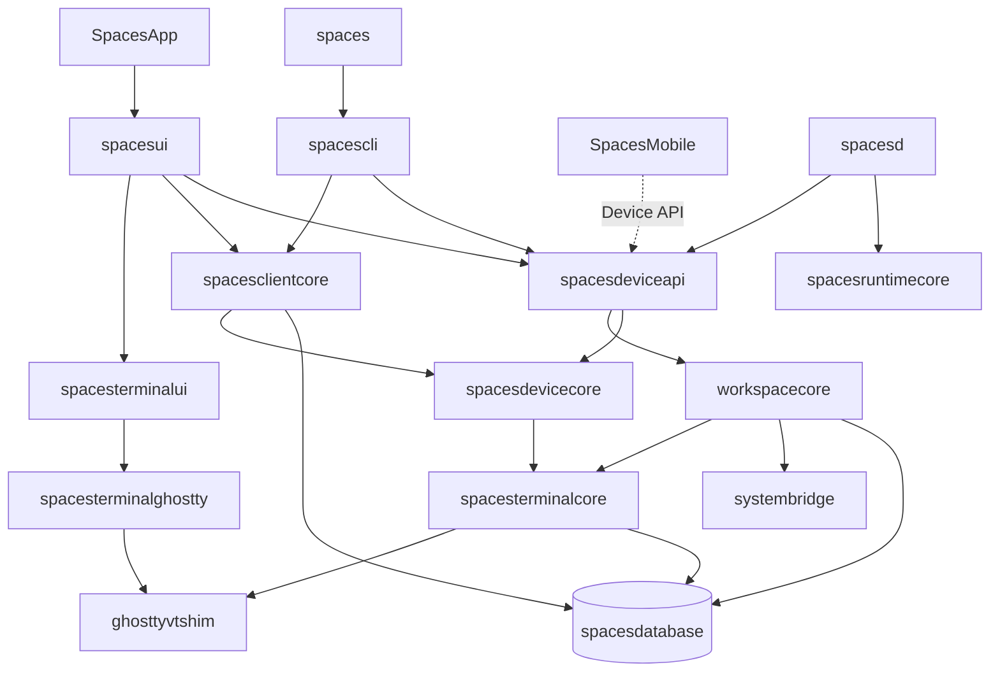
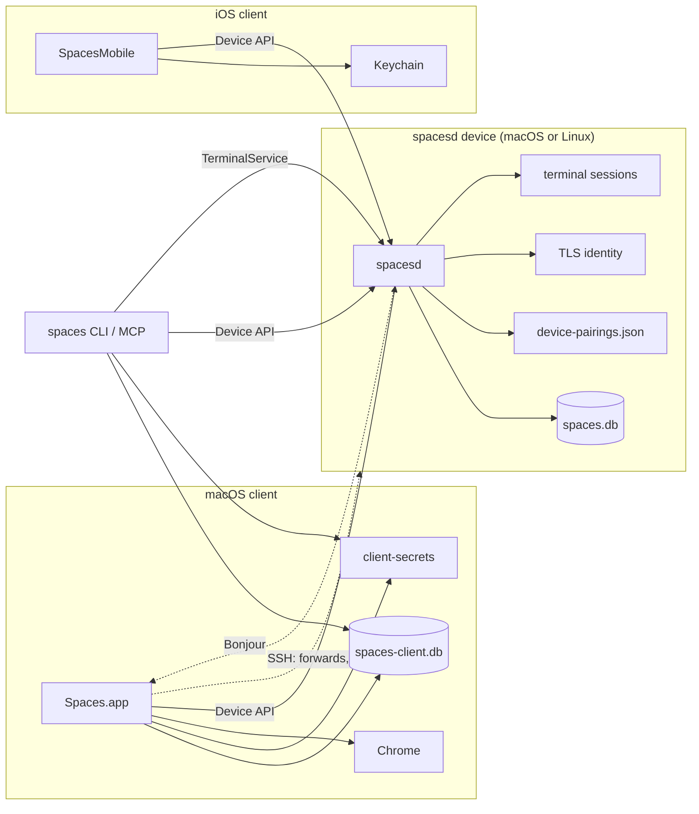
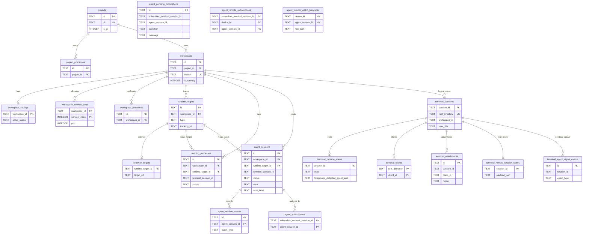
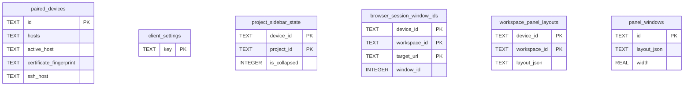

# Architecture

How Spaces is built and why: module boundaries, storage, runtime topology, and the rationale behind the major design choices. Written for a reader who needs the shape of the system and the constraints that make the code look the way it does — details inferable from the source are left to the source.

Related docs, each authoritative for its own layer:

| Doc | Owns |
| --- | --- |
| [spec.md](spec.md) | User-visible behavior and product semantics |
| [terminal.md](terminal.md) | Built-in terminal runtime, ownership, and the Ghostty boundary |
| [design.md](design.md) | Visual system and reusable interaction patterns |
| [dev.md](dev.md) | Build, install, release, and E2E workflows; concrete install paths |

## System Overview

Spaces is a macOS app, an iOS app, and a CLI, all of which are thin clients of a per-device daemon. Six invariants hold everywhere:

- SQLite is the single source of truth for persisted model data and global preferences.
- **The daemon's terminal engine owns a dedicated serial executor.** `TerminalEngineActor` (a custom global actor backed by its own dispatch queue) hosts `ghostty_app_tick`, the embedded session cores, and the PTY data path, so a busy or blocked main actor cannot stall terminal input, output, or escape-query replies. The isolation is one-way by rule: engine code may hop synchronously to the main actor when AppKit-affine work requires it, but main-actor code must never synchronously wait on the engine — that asymmetry is what makes the design deadlock-free. The daemon's main actor keeps coordination only (reconcilers, database-change handling, orchestrator work), and nothing blocking belongs on either actor: subprocesses, git, SQLite opens, FSEvents/inotify registration, socket round-trips, and PTY teardown all run on background executors or transport threads, entering an actor only for its own state.
- **A forked PTY child runs no Swift before exec.** `HostManagedPTYTerminalSessionDriver` forks every host-managed session's child from a heavily multithreaded process, and compiled Swift enters the runtime beneath arbitrary statements — lazy generic-metadata instantiation, protocol-conformance cache inserts, even an inout array-to-pointer bridge — taking process-wide runtime locks another thread can hold at the fork instant. A child that touches one parks in `futex_wait` forever without reaching exec: the session exists, the child is alive, and not a byte ever arrives. The entire pre-exec body therefore lives in a C shim (`spacesptyshim`'s `spaces_pty_child_exec`: signal resets, fd sweep, `chdir`, `execve`), and the parent materializes everything the child consumes before forking — argv, the scrubbed-and-overridden environment (built as an array for `execve` rather than mutated via `setenv`/`unsetenv` in the child), the working directory, and the fd bound, down to raw C pointer arrays so no Swift `Array` bridging remains on the child path. `GhosttyLinuxHeadlessSpawnStressTests` gates the invariant in the Linux lane by spawning through the real driver while churn threads keep the conformance cache's write lock hot.
- A **window is a client concept**. The daemon has no desktop session and stores no window identity; clients reconstruct windows from the overview payload.
- Workspace settings are seeded from project templates at workspace creation and preserved as per-workspace overrides after that.
- Store startup migrates older databases serially through every intermediate schema version and fails closed for versions it has no migration step for.
- Behavior lives in one orchestration layer, hosted by the daemon. Every surface — GUI, CLI, MCP, iOS — reaches it through the Device API or the local profile socket rather than re-implementing it. `Stop All and Quit` is the sole exception: it opens the local daemon store directly, because it has to coordinate the quit prompt with client-owned Chrome tab tracking that the daemon cannot see.

## Modules

One SwiftPM package (`apps/macos/Package.swift`) holds every Swift target except the iOS app, which is an Xcode target under `apps/ios`.

Dependencies flow strictly downward through the layers named in the table below.

| Module | Layer | Owns | LOC |
| --- | --- | --- | --- |
| `SpacesApp` | entry | AppKit boot, nothing else | 40 |
| `spaces` | entry | CLI shim over `spacescli` | 3 |
| `spacesd` | entry | Per-device daemon: Device API host, terminal sessions, runtimes | 1.5k |
| `spacese2e` | entry | E2E runner and screen-recorder harness | 3.5k |
| `SpacesMobile` | entry (Xcode, `apps/ios`) | iOS client; a Device API client only | 6.6k |
| `spacesui` | surface | AppKit UI, panels, sidebar, focus dispatch, updater | 23.7k |
| `spacescli` | surface | `swift-argument-parser` tree and the MCP server | 0.9k |
| `spacesterminalui` | surface | Terminal pane view controllers | 2.0k |
| `spacesdeviceapi` | service | Device API server, pairing, overview stream | 4.8k |
| `spacesclientcore` | service | Client database, device client, pairing secrets | 2.5k |
| `workspacecore` | core | Orchestration, lifecycle, environment, `AppVersion` | 9.6k |
| `spacesterminalcore` | core | Terminal primitives, theming, Caddy config, wire version | 9.7k |
| `spacesdevicecore` | core | Device API wire types, shared by daemon and every client | 2.4k |
| `spacesruntimecore` | core | Daemon-safe git helpers (no UI, Keychain, or AppKit) | 0.3k |
| `systembridge` | platform | Shell commands, AppleScript, Chrome automation | 1.5k |
| `spacesterminalghostty` | platform | Embedded libghostty host and app-side adapters | 5.8k |
| `spacesterminalmobileghostty` | platform (non-Linux) | iOS Ghostty rendering and input mapping | 1.8k |
| `ghosttyvtshim` | platform | C shim over `libghostty-vt` | — |
| `spacesdatabase` | storage | SQLite wrapper, migrator, schema, backup | 0.7k |

`AppVersion` constants are generated from `apps/macos/AppVersion.plist`, which also generates the app bundle `Info.plist`.

## Runtime Topology

Every client — the Mac app, the iOS app, and the CLI/MCP server — reaches daemon-owned state only through the Device API. `spacesd` runs on macOS and Linux and owns the daemon database, runtime files, workspace root, TLS identity, terminal sessions, and paired-client records.

| Transport | Endpoint | Auth | Clients |
| --- | --- | --- | --- |
| Device API | TLS on `host:port` | Pinned daemon cert + per-client token | app, iOS, CLI/MCP |
| TerminalService | `/tmp/spaces-sockets-<uid>/…` | Unix filesystem permissions | local app, CLI/MCP |
| Bonjour | mDNS | None — discovery only | app, iOS |
| SSH | `ssh(1)` | The user's own SSH config | macOS app only — pairing sugar, browser forwards, editor opening |

Deliberate absences:

- **No relay transport.** Direct reachability over LAN, VPN, or Tailscale is required.
- **No TCP terminal-control bridge.** Terminal control rides profile-scoped Unix sockets and the authenticated Device API.
- **Bonjour carries no trust.** It advertises host and port; authorization is the pinned certificate plus the token.
- **Pairing credentials are file-only on both sides.** The daemon keeps token *hashes* in `device-pairings.json`; the Mac stores its token in a `client-secrets` file store so the app, CLI, and MCP server can all read it headlessly; iOS uses Keychain. None of this lives in SQLite, so no SQLite backup can leak a token.
- **SSH provisioning is Linux-only, client-initiated, and never invisible.** The version-pinned installer runs on a remote device over SSH in exactly two places, both owned by `SpacesDevicePairingClient`: during a user-initiated pairing that finds Spaces missing on a Linux host, and from the compatibility block's Update over SSH action for a paired Linux device whose record stored SSH details. Both show an in-progress state while the installer runs and report its output on failure; nothing provisions a device in the background. It is Linux-only because macOS ships as an app bundle that Sparkle updates, driving a session-bound LaunchAgent daemon, with no headless installer artifact to run over SSH. A remote Mac that already has an update staged applies it over the Device API RPC without SSH, so the remaining Mac gaps (first install, a too-old daemon with nothing staged) are resolved on that Mac itself.
- **Terminal control never rides SSH.** A remote pane attaches, sends input, and receives render frames over the Device API like any other command.

SSH is a macOS-client-only capability with exactly four uses, none of them load-bearing for terminal or workspace control:

| Use | Owner |
| --- | --- |
| The `--ssh` pairing convenience path | `SpacesDevicePairingClient` |
| Running the Linux installer on a device (pairing recovery, Update over SSH) | `SpacesDevicePairingClient` |
| `ssh -L` browser port forwarding | `BrowserSSHForwardManager` |
| Opening a remote folder in the editor | `EditorRemoteSSHSupport` |

Even pairing is thin sugar: `spaces device pair --ssh` validates SSH, runs `spaces device pair --json` on the remote to obtain a `spaces://pair` link, then redeems that link over the pinned-TLS Device API like any other pairing. Removing SSH would cost Linux provisioning, remote browser sessions, and remote editor opening, and nothing else.

## Persistence

State lives under `~/.spaces` on both macOS and Linux — the cross-platform dev-tool dotdir convention rather than platform-native directories (`~/Library/Application Support`, XDG). This keeps one code path across platforms, keeps paths space-free for shell tooling and AF_UNIX sockets, works on headless servers, and stays discoverable for CLI users. User project data lives at the visible `~/spaces/{workspaces,repos}`, outside the profile root, because those are the user's own working files rather than app state. Concrete install locations are in [dev.md](dev.md).

### Two databases

| Database | Owner | Holds |
| --- | --- | --- |
| `spaces.db` | `spacesd` | Projects, workspaces, runtime targets, process and agent rows, terminal metadata, daemon and global settings |
| `spaces-client.db` | The macOS app | Paired-device metadata, client settings, sidebar collapse state, panel layouts and window frames, browser window IDs, dismissed alerts |

The boundary is strict. A client reads daemon-owned data over the Device API rather than by opening `spaces.db`, so the two databases are never SQL-joined; they correlate in application code by stable keys (`workspace_id`, `runtime_target_id`, terminal `session_id`/`tracking_id`). The macOS GUI hosts no in-process orchestrator: focus, cycling, runtime controls, and workspace lookups are all reconstructed from the overview, and mutations go through the Device API. `Stop All and Quit` is the one path that opens the local daemon store directly (see [System Overview](#system-overview)); direct store openers may use the current schema but never upgrade a profile owned by another live daemon process.

### Profile resolution

- A profile's IDENTITY is its resolved root, not the branch that found it. `SpacesProfile.isInstalledProfile` is true exactly when that root is `<home>/.spaces`, and every rule that treats the installed profile differently — the canonical Device API port, the well-known router port, the installed daemon binaries, the installed systemd unit — keys off it. `SpacesProfileSource` records only how the profile was discovered and is carried into error text as provenance. Reading the discovery route as identity is what let a daemon serving `~/.spaces` be classified as a development profile and assign itself a development-range Device API port.
- `SPACES_DB_PATH` names an EPHEMERAL throwaway profile and nothing else — a test run, an E2E harness, a one-off scratch root. It wins whenever it is set, and resolution REFUSES it, loudly and for every process, when the database it names is inside `~/.spaces/` or `~/.spaces-dev/profiles/`. Both real profiles are discoverable from a binary's own location with no environment at all, so a binding into one of those roots is a leak rather than a way to select a profile. The refusal precedes every side effect, so nothing is created.
- Otherwise a binary deployed *inside* a development profile root resolves to that root: a `spaces`/`spacesd` whose path carries the consecutive components `.spaces-dev/profiles/spaces/<name>` belongs to the profile at `<name>`, and the executable must sit strictly below that root. A deployed development build has no Spaces checkout to derive a profile from, so where it was installed is its only statement of which profile it serves. The match reads the binary's own location and nothing else: a deployed daemon inherits whatever `HOME` systemd or an SSH command handed it, so anchoring on a resolved home directory would make one executable resolve to different profiles depending on who started it. Where the layout nests, the outermost match wins, so content that ends up sitting inside a profile root is never mistaken for a profile of its own. The directory name is read as `<branch-slug>-<12 lowercase hex>` to recover the worktree identity the profile mirrors, which labels its Bonjour service; both halves are absent together for any other shape, since a half-parsed name would put a bogus label in that service name. Without this rule a deployed development daemon falls through to `~/.spaces/` and becomes a second daemon for the installed profile, opening the installed daemon's production database — the same hazard the repo-built rule below exists for, except that on a device the installed profile is the only thing left to fall back to.
- Otherwise repo-local development binaries derive one profile root from the current git branch plus the canonical worktree path.
- Installed binaries fall back to `~/.spaces/`.
- A binary built inside a Spaces checkout — detected by finding `apps/macos/Package.swift` above the executable — never falls back to the installed profile. When that binary reaches automatic detection (no `SPACES_DB_PATH`) and the git probe throws or returns nothing, resolution raises a descriptive startup error naming the executable, the repo root, and the git failure instead of silently resolving to `~/.spaces`. This is deliberate: a swallowed git failure once let a development daemon open the installed daemon's production database and, on a schema mismatch, crash-loop it. There is no retry or fallback — the failure is loud, and supervised callers that already catch and retry (the Device API supervisor) surface it in logs.
- A test host never resolves a live profile. Every branch of resolution funnels through one constructor, and under XCTest that constructor refuses any database inside this account's Spaces state roots — `~/.spaces/` (installed) or `~/.spaces-dev/profiles/` (per-worktree development profiles) — whichever branch produced it. It covers the branches that reach a live root with no override at all, a repo-built test binary deriving its worktree profile or a test host falling through to `~/.spaces`; an explicit `SPACES_DB_PATH` into a live root is refused earlier, for every process rather than only a test one. The account home is read from the password database rather than `HOME`, so a test that redirects `HOME` to a scratch directory is already isolated and resolves normally; containment is compared component-wise on canonical paths, so a sibling like `~/.spaces-devil` is not inside `~/.spaces-dev`. The harm being prevented is a test writing into a profile the app or daemon is actively serving: test targets create and mutate real terminal-session state through the resolved profile, and a core's final writes are still queued when its `terminate()` returns, so they can land after a per-test environment restore. The rule is static — about where the database is, not about whether something currently owns it — so the guard cannot pass or fail depending on whether a developer's app happens to be running. It refuses loudly rather than redirecting to a scratch profile, which would hide the missing isolation and leave the test asserting against a profile it never chose, and it refuses before creating any directory. Tests bind `SPACES_DB_PATH` to a database outside those roots — under the system temporary directory — for the whole test, teardown included.
- The refusals are cases of `SpacesProfileResolutionError`, not the only failure `current()` can raise, so a caller that wants to keep degrading gracefully on a genuine "no profile could be resolved" (a rare, non-fatal outcome some call sites predate the refusal and already render or fall back around) still needs a way to do that without swallowing the refusal along with it. `SpacesProfile.currentOrNilIfUnresolved()` is that one mechanism: it collapses a genuine "no profile could be resolved" to `nil` and rethrows every refusal, so a caller cannot fold "this process is not allowed to resolve one" into the same branch as "there happens to be no profile." The rule is written as everything-except-the-one-genuine-failure, so a refusal added later is loud by default. Call sites choose one of three ways to consume it, by shape rather than by module:
    - A `throws` call site uses `currentOrNilIfUnresolved()` directly and lets the refusal propagate to whatever already handles its other errors.
    - A call site with no `throws` to propagate through, where trapping is safe because it runs once per discrete action (an AppKit action, a setup step) — every current example is in `spacesui` — uses `SpacesProfile.currentOrNilOnFailureFatalOnRefusal()`, which keeps the same `nil` degrade and traps the process on a refusal instead of rendering a no-profile UI state around it; a refusal reaching a UI path means a test is running unisolated, and that is exactly the condition the guard exists to make impossible to miss.
    - A call site that is both non-throwing and too hot or too widely shared to trap on safely uses `SpacesProfile.currentOrNilLoggingRefusal()` instead: it keeps the same `nil` degrade but reports the refusal through an injectable `diagnoseRefusal` callback (stderr by default) rather than trapping. `TerminalOverviewSignal.post` fires from a detached engine-actor task on every terminal runtime-state change, and `SpacesDevicePairingClient.localMacClientInstallationID` backs a default parameter value fanned out across dozens of `SpacesDeviceClient` call sites (a default argument can never be `throws` in Swift) — trapping either would abort the one process hosting every currently running test suite over a resolution failure that, on a background-driven path like these, may not even belong to whichever test happens to be mid-flight when it fires (a session's queued persistence work can still be running after that test's own environment override has been restored).

  All three are thin wrappers around the same distinguishing logic in `nilUnlessRefused`, so "loud" is a property of that one shared decision, not a qualification that depends on whether a given call site happens to be able to throw, how hot it is, or which module it lives in.
- The runtime root is `<profile-root>/runtime` unless `SPACES_RUNTIME_DIR` overrides it.
- A launched terminal session carries the daemon's own profile environment and nothing more: `SPACES_DB_PATH` is FORWARDED when the daemon has one, never synthesized from the resolved profile. An unbound terminal is the correct state for both real profiles, because a `spaces` binary invoked inside one resolves the profile it belongs to from its own location — the installed daemon under launchd falls through to `~/.spaces`, and a repo-built or deployed binary derives its development profile from where it sits. The only profile a binary's location cannot describe is an ephemeral throwaway root, and that is exactly the case where the daemon itself was started with the variable and so passes it on. `SPACES_RUNTIME_DIR` is forwarded on the same terms, keeping the E2E harnesses that deliberately split database and runtime on the runtime root their daemon uses.
- Synthesizing the variable instead exported a `SPACES_DB_PATH` into every workspace terminal, including the installed daemon's own. Anything run inside inherited it — notably an agent hook, which fires on every tool call — and a `spaces` invocation that autostarts a daemon hands it the whole parent environment, so a daemon serving `~/.spaces` resolved itself through the explicit-path branch, was classified as a development profile, and assigned and persisted a development-range Device API port that orphaned every paired client. Profile identity belongs to the binary's location, which is why the variable is refused outright inside a live profile root.
- The accepted consequence is that agent-lifecycle reporting is supported only from installed-profile terminals. Agent hook configuration is machine-wide per agent CLI (`~/.claude/settings.json`, `~/.codex/hooks.json`) and names one absolute `spaces` build, normally the installed one; inside a development-profile terminal that build resolves the installed profile, so its agent signal is a silent no-op for a workspace id that profile has never heard of.
- A profile is served only by a daemon binary belonging to the build that asks for it, and the `spacesd` candidates a client launches are split by where each candidate comes from. `SPACESD_EXECUTABLE` wins for every profile, because it names one binary explicitly rather than substituting one silently. Candidates derived from the running executable — a sibling (also through its resolved symlink) and the running bundle's own resources — apply to every profile, since they necessarily belong to the build that is asking. The location-fixed installed links (`~/.spaces/bin/spacesd`, `/usr/local/bin/spacesd`) apply only to the installed profile — recognised by its root, so a profile that reached `~/.spaces` by any branch gets them — and the checkout-relative `.build/{debug,release}` products under the process's working directory apply only to a development profile. Neither location says anything about the other profile: the installed links always point at whatever `/Applications/Spaces.app` last installed, and the working directory is merely wherever the process happened to be started. A profile with no daemon of its own fails with `daemonNotFound`, which names the profile kind, the profile root, the branch that resolved it, and every path searched. Borrowing another build's daemon instead would start a foreign release on this profile's runtime directory and socket; it answers, but on a different wire protocol, so the client reports a wire incompatibility and the real cause — the wrong binary entirely — stays invisible. Clients treat this failure the same as any other daemon-down state: the local section degrades to offline.
- On a Linux device a profile's daemon is owned by user systemd rather than spawned by the client, and every profile on the device has a unit of its own. The installed profile's is `spacesd.service`; a deployed development profile's is the `spacesd@<profile-name>.service` instance of one shared `spacesd@.service` template whose `ExecStart` is resolved from the instance name (`%h/.spaces-dev/profiles/spaces/%i/daemon/current/bin/spacesd`). The template carries no per-profile content at all — no database, runtime, host, or port `Environment=` assignment — because the binary at that path resolves its own profile from where it lives; that is what lets one template serve every development profile and be rewritten safely on every install. The one genuinely per-target setting, the mobile-terminal performance log, arrives as a drop-in for that instance and is cleared when an install does not ask for it, so the capability cannot survive as ambient state. `TerminalService.ensureRunning` adopts a daemon that already answers its socket without going near systemd, so the common case costs one ping; otherwise it runs `systemctl --user start <unit>` and then polls for the socket over the caller's full window. A repo-built worktree profile and an ephemeral explicit database path resolve to no unit: both belong to a developer-driven process on a machine with a checkout, where whatever launched the build starts the daemon, and naming a unit for them would only ask systemd for something no install ever wrote — so a missing daemon stays the caller's error. A failing `systemctl` start is not itself fatal, because systemd reports plenty of non-failures (an already-active unit, a unit still starting) that say nothing about whether a daemon ends up answering; the poll decides, and the resulting `serviceUnavailable` names the unit that was started and produced no socket, distinguishing that from a profile with no unit to ask about.
- Client paired-device metadata follows the resolved profile root, so separate profiles never share paired remotes. Distributed-notification IPC is likewise scoped by a token derived from the profile root.
- The fixed canonical Device API port (`47847`) belongs to the installed profile alone, and for that profile it is a CONSTANT computed from identity rather than persisted state: it is neither read from nor written to `device-api.json`. There is nothing to choose and nothing to remember, so there is also nothing a mis-resolved daemon can poison — a settings file left behind by one is inert rather than permanent.
- Every other profile — development worktree, deployed development profile, ephemeral explicit database — needs a persisted assignment, because its port is a choice. A profile whose stored or freshly defaulted port equals the canonical default has never been assigned one, so it takes a port from `SpacesDeviceAPIDefaults.developmentPortRange` (`47848`–`47947`, which excludes the canonical port by starting one above it) and **persists** it into its own `device-api.json`. The port is the profile root's stable hash mapped into the range, then stepped forward with wraparound past every port a sibling profile beside that root has already recorded for itself; with every port in the range claimed the profile keeps its derived port and shares it. A stored port other than the canonical default is respected verbatim and never reassigned, so a profile's port is sticky once it has one. Persistence is the point: a paired client stores one host:port per device, so a profile whose port moved between starts would orphan every client already paired with it. The choice is deterministic rather than a bind probe, because a probe would let anything transiently holding the derived port move the profile off it permanently, while genuine runtime occupancy needs no help — the Device API supervisor's restart timer keeps retrying the bind. Reading sibling claims is best effort: a sibling with no settings file, an unreadable one, or one whose runtime root moved under `SPACES_RUNTIME_DIR` contributes nothing, and the only consequence of a missed claim is two profiles deriving one port, which the sticky assignment then keeps stable rather than making worse.
- `SPACES_DEVICE_API_PORT` is applied after either decision and never written back, so a daemon started with it (the E2E profiles, which pin a port or ask for an ephemeral one) binds the overridden port while nothing about what the profile reports changes. Under those profiles `lsof` is what answers which port a daemon actually holds.
- The resolved profile is cached per process behind a fingerprint of every input that can change while the process runs: `SPACES_DB_PATH`, `SPACES_RUNTIME_DIR`, `HOME`, and the working directory (which resolves a relative override or a relative `argv[0]`). Those keys are read with `getenv` — the C-level environment, so a `setenv` after process start invalidates the cache — and resolution re-reads the same keys the same way, so the fingerprint and the resolution can never disagree. The executable path is the one input resolved once and reused: a running process's executable cannot be swapped under it, and resolving it costs a symlink resolution. This matters because `SpacesProfile.current()` is on hot paths (every terminal-session path lookup goes through it twice), and reading the whole process environment on every call cost more than the resolution the cache exists to avoid.

### Migration rules

- Fresh installs create the latest schema directly and record the current version.
- Databases behind the current version upgrade serially, one version per step (`vN` → `vN+1`). There are no version-skipping steps or jump paths.
- Schema creation and migration reserve the profile's daemon instance lock for the full operation, including backup creation and every migration transaction. IPC, instance ownership, and startup serialization use the same canonical runtime profile identity, including an explicit `SPACES_RUNTIME_DIR`, so newer helpers recognize locks written by daemons that predate the migration guard. A different live owner prevents that reservation, and the owner's lock record — which names the schema version that owner's build maintains, declared when it took the lock — decides what happens next. An absent or lower declaration is the older daemon this guard exists for: the helper refuses immediately, naming both versions, with guidance for the session-preserving daemon handoff. A declaration at or above this build's is a daemon that will finish the schema work it started — creating a fresh profile's schema, or upgrading after an update — so the helper polls, with neither the instance lock nor the launch lock held, until the recorded version reaches the owner's declared one, and then proceeds against the owner's result and migrates nothing. It waits for the declared version rather than the first version it could open because a newer owner commits each intermediate step of its upgrade, passing through this build's version while the database is still being rewritten; the finished schema of a newer owner is then rejected as unsupported, which is the accurate report. That wait is bounded by the owner staying alive rather than by a duration, because the work waited on is proportional to database and session size; an owner that exits before recording the version returns the helper to the acquisition path, where it takes the lock and does the schema work itself. A 120-second ceiling covers an owner that stays alive without ever finishing, and reports that the daemon is still preparing the database rather than offering the handoff remedy, which would name the wrong process. A daemon cannot start between the ownership check and the schema writes. Helpers acquire the profile launch lock before reserving the instance lock, so `TerminalService.ensureRunning` waits for an in-flight migration and launches the daemon afterward instead of spending its one spawn attempt on an instance-lock collision. After authorization, each waiter re-reads the table list and schema version and adopts work completed by the previous lock holder instead of replaying its stale migration decision. A process-local migration lock serializes helper threads before the current pid is interpreted as daemon ownership. Migration lock wait is outside the daemon startup timeout because backup duration depends on database size; the timeout begins after startup owns the launch slot. A schema version newer than the helper supports is rejected before upgrade authorization because updating the daemon cannot make that older helper compatible.
- Startup fails closed when the recorded version has no migration step, or is newer than the binary supports.
- Startup runs `PRAGMA integrity_check` and fails unless it returns `ok`.
- Migrations carry user data forward. Tables and columns nothing reads are dropped by a step and removed from the schema definitions in the same change.
- Client migrations take a timestamped metadata-only backup first and restore it on failure.

## Data Model

`DatabaseSchema.currentVersion` is `13` and `SpacesClientDatabase.currentVersion` is `3`. `migration_state.current_version` records the canonical version; `PRAGMA user_version` is not used for migration control. Migration steps run serially, one version forward each. The `v1` → `v2` step adds `agent_sessions.note` and the `agent_subscriptions` table (as a frozen snapshot of its v2 shape with the original `ON DELETE CASCADE`, since the v6 → v7 step alters that foreign key), carrying existing agent rows forward with a null note; the `v2` → `v3` step adds the `agent_pending_notifications` queue (as a frozen snapshot of its v3 shape, since a later step alters the table); the `v3` → `v4` step adds the `agent_remote_subscriptions` cross-device watch table; the `v4` → `v5` step adds `agent_pending_notifications.transition`, with pre-existing held rows carrying an empty transition so they flush normally and are never matched by the blocked-line withdrawal; the `v5` → `v6` step adds the `agent_remote_watch_baselines` table; the `v6` → `v7` step rebuilds `agent_subscriptions` with its foreign key changed from `ON DELETE CASCADE` to `ON DELETE RESTRICT`, recreating the table and copying every row (SQLite cannot alter a foreign key in place); the `v7` → `v8` step adds `terminal_remote_session_states.has_final_render` and backfills it from each stored payload, so an ended pane that could replay before the upgrade still replays after it; the `v8` → `v9` step adds `terminal_runtime_states.bell_at`, left null on existing rows because nothing observed a bell before it and a synthesized timestamp would raise an unearned alert; the `v9` → `v10` step adds `agent_sessions.detected_agent_kind`, left null on existing rows, which reads as the honest `coding agent` until a detection lands; the `v10` → `v11` step retires the archived-workspace model, deleting every archived workspace row (its children cascade) and dropping `workspaces.is_archived`, rebuilding the branch-uniqueness index without its archived predicate first because SQLite refuses to drop a column an index reads, and dropping `ignored_worktrees`, whose only writer was the workspace delete it replaces. Two agent tables are cleared for the deleted workspaces ahead of the row delete: `agent_subscriptions`, whose `ON DELETE RESTRICT` foreign key would otherwise abort the upgrade on an archived workspace that still held a watched agent, and `agent_pending_notifications`, which carries no foreign key and would be orphaned; a watcher of such an agent loses that edge without an exit notice, the one thing a bulk purge cannot deliver. That step touches each table it did not create only when the table is present, so a database that legitimately never had one upgrades instead of failing on work it does not need. The `v11` → `v12` step adds `agent_sessions.user_label`, the column a user's rename of a coding-agent row is stored in, left null on existing rows so a row that was never renamed keeps reading its name from the label its agent reports; like the `v9` → `v10` step it creates the frozen pre-step (`v11`) shape of `agent_sessions` first, since the `v10` → `v11` step tolerates a missing table rather than creating one. The `v12` → `v13` step drops the agent-launcher feature: it drops `project_agent_launchers` and `workspace_agent_launchers` (`IF EXISTS`, since only the fresh-install baseline ever created them), then drops `agent_sessions.claimed_launcher_id` and `claimed_launcher_name`, carrying every existing agent row forward untouched; the column drops need no table guard because every route to `v12` carries `agent_sessions` with both columns — the `v9` → `v10` step creates the table when a chain arrives without it. A step that `ALTER`s a table its chain cannot guarantee exists creates that table's frozen pre-step shape first — `terminal_remote_session_states`, `terminal_runtime_states`, and `agent_sessions` are defined only in the fresh-schema SQL, so an early-origin chain can reach such an `ALTER` with no table to alter. Creating the table rather than making the `ALTER` conditional is what guarantees the upgraded database still HAS it; a conditional would leave a current-version profile missing an entire table. The frozen shape is always the target step's predecessor, so both arrival routes converge on one schema, and on a database that already carries the table the `CREATE` is a no-op that preserves every row. Each step takes a pre-migration backup.

Diagrams show keys and discriminating columns only — full column lists live in `DatabaseSchema.swift` and `SpacesClientDatabase.swift`.

The template and config tables mirror each other one-for-one. For each of `services`, `processes`, and `browser_sessions` there is a `project_*` template table and a `workspace_*` config table, each a child of its parent ordered by `order_index`. Only the `processes` pair is drawn below; the other two have the same shape.

| Group | Tables | Role |
| --- | --- | --- |
| Project templates | `projects`, `project_services`, `project_processes`, `project_browser_sessions` | Defaults seeded into each workspace at creation |
| Workspace config | `workspaces`, `workspace_settings`, `workspace_services`, `workspace_processes`, `workspace_browser_sessions` | Per-workspace overrides after creation |
| Runtime records | `workspace_service_ports`, `runtime_targets`, `browser_targets`, `running_processes`, `agent_sessions`, `agent_session_events`, `agent_subscriptions`, `agent_pending_notifications`, `agent_remote_subscriptions`, `agent_remote_watch_baselines` | Live state, kept separate so template edits coexist with running processes |
| Terminal persistence | `terminal_sessions`, `terminal_runtime_states`, `terminal_clients`, `terminal_attachments`, `terminal_remote_session_states`, `terminal_agent_signal_events` | Session identity, attachments, final render state (`terminal_remote_session_states.has_final_render` stores whether the payload carries a replayable frame, so the device overview answers that per ended row without decoding the payload) |
| Device | `settings`, `migration_state` | Global preferences, schema version |

Uniqueness outside primary keys: `projects.dir`; `workspaces(project_id, branch)` for non-empty branch names, so one workspace owns a branch name in a project at a time; `root_directory` on each of the three terminal tables that carry it; `agent_pending_notifications(subscriber_terminal_session_id, agent_session_id)`, which makes `INSERT OR REPLACE` coalesce a child's queued notifications to one latest-state line. Partial unique indexes on `terminal_attachments` enforce at most one active owner per root, and at most one active attachment per root/client pair.

### Window-ID ownership

There is no desktop or window-manager window identity anywhere in the daemon. Terminals, processes, and coding agents are tracked by terminal session ID; `runtime_targets` carries no `window_id` column and the device overview emits none. This is what lets a remote viewer render a device's runtime without being able to focus another desktop's windows.

The single exception is the Chrome window containing a browser session's tab, which is a client/desktop concept. The GUI records it in the client `browser_session_window_ids` table, keyed by `device_id` + `workspace_id` + resolved `target_url`, through `ClientBrowserWindowIDStore`. Several sessions in one workspace may share one Chrome window so they stay grouped as tabs.

### Runtime target model

- `runtime_targets` is the canonical inventory of focusable runtime items for a workspace: `type`, host app, durable terminal `tracking_id`, ordering, display metadata. The persisted `type` string is surfaced through the `WindowRole` typed view.
- `browser_targets` extends a browser target with its configured URL.
- `running_processes` and `agent_sessions` each link to a `runtime_target` when focusable, and each carries a durable `terminal_session_id` used for focus, restart, and final-frame viewing.
- `agent_session_events` records signal-driven lifecycle transitions, giving an inspectable trail across rebind, detach, and prune. Signal recency (`lastAgentSignalAt`) is the most recent `agent_session_events` row whose `source` is `spaces_agent_signal`, so foreground-detected rows that never signal read as never-signaled. This drives the informational `signaled=` column in `agent list`/`status` (hook health) and is distinct from `agent spawn`'s foreground-detection readiness.
- `agent_sessions.note` is an explicit, human-authored annotation for orchestration. It is written only through the annotate path (`setAgentSessionNote`); the `upsertAgentWindow` conflict clause coalesces an incoming null note back to the stored value, so a status signal never clobbers an annotation. `setAgentSessionNote` leaves `updated_at` untouched: that column is the lifecycle-state-entry time (see the `working` signal paragraph above) that macOS and iOS Alerts read as the event date and ordering key, so annotating a waiting/done agent must not make its alert appear newly occurred.
- `agent_subscriptions` is the same-device subscribe relationship an orchestrator uses to watch other agents. Its subscriber key is a **terminal session id**, not an agent id, because a subscriber may be a plain terminal with no agent row of its own; its target is an **agent session id** with an `ON DELETE RESTRICT` foreign key. The inbound edges are **not** cascaded away on delete: the single termination chokepoint (`WorkspaceOrchestrator.finalizeAgentRow`) drops them explicitly after notifying those subscribers the child exited, and RESTRICT makes any delete that bypasses the chokepoint fail loudly instead of silently stranding a watcher's notice. There is no parent/child column on `agent_sessions` — the subscription edge is the only relationship between agents. Bulk scope deletes obey the same rule: `SQLiteStore.deleteProject`/`deleteWorkspace` still issue a raw `DELETE FROM agent_sessions` for the scope, which throws under RESTRICT if the scope holds any watched agent row (including an `.exited`-kept row whose watcher has not unsubscribed), so `WorkspaceOrchestrator.removeProject` finalizes every agent row in the project through the chokepoint (`.destroyed`) BEFORE the store delete — delivering the exited notice to watchers outside the deleted scope, dropping the inbound edges so the delete succeeds, and tearing down each terminal's own watch state. `removeProject` also mutates the database before any irreversible filesystem work (worktree removal), so a failure surfaces while the worktrees are still on disk rather than after they are gone. The raw scope `DELETE FROM agent_sessions` stays as a defensive loud-failure guard: after the finalize-first pass it is a no-op, but a row that somehow survived finalization would make it throw under RESTRICT rather than strand a watcher.
- `agent_remote_subscriptions` is the cross-device counterpart: a local subscriber terminal watching a coding agent on a paired device. `agent_session_id` holds the watched child's **terminal session id on that device** — the stable cross-device handle a user addresses and a deep link targets — not a local row id, so the table deliberately has **no foreign key** (the watched agent lives in another device's database). Its lifecycle is driven by the watch service rather than a cascade: when the remote agent exits, the terminating line is delivered and the edge is dropped. Keying on the child's terminal session id also makes `agent unsubscribe --device` a local-only delete that works even when the device is offline.
- `agent_remote_watch_baselines` is the watch service's persisted per-device baseline: each watched child's last-seen `listAgentSessions` row, stored as the encoded wire row (`row_json`) because rendering an exited line needs the full row after the agent is gone. It mirrors the in-memory baseline so a restarted daemon can diff its first listing against what the previous run had reported; a row that fails to decode simply re-seeds silently. Like the edge table it has no foreign key, and the watch service drives its lifecycle (retired when a device's last edge is removed or the device unpairs).
- Targets are seeded as soon as a process or agent terminal is known, not filled in by a later window-reconciliation pass.

### Data modeling guidelines

- Base tables stay generic. A field that only makes sense for one provider belongs on an adapter-specific runtime path, not a cross-cutting base record.
- `runtime_targets` owns focus identity; process and agent rows own their configured slot state.
- Correlate and focus by durable terminal session identity, never by transient OS window handles.
- Agent rows describe logical session state, not terminal rendering internals; process rows describe process runtime and slot ownership, not window fields.
- Avoid provider-specific naming in shared schema. Generic `provider` and `session_key` are fine; a field named after one product is transitional.
- Prefer an event history for destructive transitions over piling `last_*` and `*_reason` columns onto canonical state rows.
- Add abstractions when behavior needs them. Speculative tables and fields wait for a real workflow.

Foreign keys stay enabled. Store-level delete-and-reinsert updates run inside immediate transactions so a partial child-table replacement cannot persist when one statement fails.

### Client database

Keyed by `device_id` wherever a row is scoped to a paired device, so one client database describes the local Mac and every remote it has paired with.

A paired device's Device API address is a list, not a value: `paired_devices.hosts` holds the ordered candidate addresses as a JSON array and `active_host` holds whichever of them a connection last succeeded on (always a member of `hosts`, cleared when a candidate list no longer contains it). The client's `v2` → `v3` step is what reshaped that, rebuilding the table around the pair and carrying each device's single stored `host` forward as its list's only candidate, so a device paired before the change keeps working and widens its list on its next connect.

## Subsystems

Each section states what the subsystem is, where it lives, and the decision that governs it. The traps that shaped the code are collected in [Hard-Earned Learnings](#hard-earned-learnings).

### Panels and terminal panes

Terminal sessions present as panes inside tabbed panels, never as standalone windows. The machinery lives in `spacesui/Panels/`. `PanelLayout`/`PanelLayoutEngine` are pure value types and mutations — splits, closes with collapse, pruning, focus fallback — serialized as versioned JSON into the client database. `PanelCoordinator` (an `AppKitController` sub-controller) owns per-scope layouts and one `TerminalPaneContentController` per open session, enforcing **at most one pane per session across all panels**. `TerminalSessionPaneViewController` (`spacesterminalui`) owns all window-independent content: renderer switching, attachment lifecycle, key translation, find.

There are two `PanelScope`s: the selected workspace's panel, which fills the main window's right pane, and global panel windows (`.globalWindow(panelWindowID:)`). `PanelWindowController` is only an NSWindow shell — all layout state stays in `PanelCoordinator`. Moving a pane between them reuses the same remove-then-insert mutation that splitting uses, so the live Ghostty surface re-parents rather than being recreated. Global panel windows exist to mix workspace-bound sessions from different workspaces or devices in one window; every session is still workspace-owned. A window shell exists only while its layout has content, and every path that empties one funnels through a single dismissal that persists the deletion and closes the window.

The session picker behind split-right/split-down, a workspace panel's `+`, and the new-tab shortcut (default `⌘T`) lists the scope's sidebar runtime targets rather than raw sessions: `New terminal session` first, then each workspace's ordered `orderedWorkspaceRunShortcutTargets` (the same enumeration the sidebar and the general command palette use), so the picker rows match the sidebar and stay in sidebar order. Browser targets are dropped (they cannot live in a pane), and any target whose live session already occupies a pane anywhere is dropped via `PanelCoordinator.openSessionIDs()` over in-memory layouts (no DB read; the selected workspace's layout is always restored before its panel shows, and global panel windows restore eagerly at startup, so a `.workspace`-scope picker is exact — a `.globalWindow` picker's only approximation is a session persisted in a never-selected workspace's unmaterialized layout, the same one `fillSplit`'s move branch already lives with). Targets with no session — a not-started configured process — always list. `AppKitController.sessionPickerPresentation` splits into a `nonisolated static` core that builds rows and choices from ordered `SessionPickerWorkspaceContext`s (each a workspace id plus its overview) and the occupancy set — reusing `windowShortcutTargetResolution` for per-target request building, exactly as sidebar clicks and numbered shortcuts do — so it is testable without a live controller, plus a thin instance wrapper that gathers the contexts (one workspace for a `.workspace` scope, every loaded device's workspaces in command-palette order for a `.globalWindow` scope). A `SessionPickerChoice` is one of: create a fresh session, open an existing (live or exited) session's request, or start a not-yet-running process. The start path routes through `runTerminalSessionMutation`, a mutation-only helper (factored out of `runTerminalSessionMutationAndOpenPane`, which the window-shortcut path keeps for its open step) that runs the `runWorkspaceProcess` Device API mutation and returns the resulting session's open request; the picker then lands it at its placement (the new split or new tab) rather than the sidebar's own open step. Exited targets are intentionally offered — picking one reproduces the sidebar row's ended-state pane — so there are no liveness guards. `⌘T` and a workspace panel's `+` call `presentNewTabSessionPicker`, landing the result through `PanelCoordinator.openOrFocusTerminalPane` — the same open-or-focus chokepoint sidebar clicks use, so a target that opened elsewhere while the picker was up focuses its existing pane instead of gaining a duplicate; a panel window's `+` and the `New terminal` leader shortcut call `openNewTerminalTab` directly, bypassing the picker. `fillSplit`'s remove-then-insert branch stays only as a race guard — a session opening elsewhere while the picker is up — since the picker itself does not offer targets already open in a pane.

Re-showing a session whose pane is already the focused pane of its panel's selected tab, and which already holds that session's owner attachment on a live surface, foregrounds the panel and restores the caret and stops there (`PanelCoordinator.refocusFocusedTerminalPane`, gated by the pure `AppKitController.canRefocusTerminalPaneWithoutReattaching`). The full open path's state fetch, client attach, and ownership reclaim are the work that established that attachment, so re-running them against an unchanged one buys nothing and costs a `.state` round trip with a full render-frame export, a no-op viewport resize, and a runtime-state write per switch. All three conditions are load bearing: a pane that is not focused or sits on an unselected tab has to move focus, which re-activates the content, and a pane whose session another client owns must run the full path because reclaiming that ownership is the request. Owner attachment is read from the pane itself (`TerminalSessionPaneViewController.holdsOwnerAttachedSurface`), which reports false the moment the session's active owner is another client or is not yet known.

A pane's client attach and detach are device round-trips, so neither runs on the main actor: presenting a pane records the attachment intent (`isClientAttached` / `lastRequestedAttachmentMode`, set optimistically) and hands the send to the pane's own serial control queue (`TerminalInputSerialQueue`), then continues presenting the pane's last known state. A failed attach surfaces in the pane's input status and rolls the intent back so the next show retries. Both sends share one queue per pane because the daemon must see them in issue order — a close's detach that overtook the attach it followed would leave an attachment open for a pane that is gone — while keeping one pane's slow link from delaying another's. The refresh that issues an attach deliberately finishes against the snapshot as it stands, since the request cannot be reflected in it yet; the daemon broadcasts the attachment change when the send lands, and that broadcast is what brings the pane back through refresh with an authoritative snapshot. A refresh running while an attach is outstanding therefore treats that snapshot's silence about this client as no evidence: it keeps the pending intent rather than clearing it, which is what makes a close during the attach still send its detach.

Panes render the terminal surface only — runtime lifecycle actions live on the sidebar target rows. Lifecycle actions never remove panes; a pane keeps showing its session's final render.

`TerminalPaneBanner` (`spacesterminalui`) is that surface's only chrome. It holds two independent state layers — a *persistent* notice describing the pane (a `TerminalPaneBannerNotice`: the session ended or failed, mirrored from `TerminalSessionRuntimeState.state`, or the client's state subscription to the owning device dropped) and a *transient* banner describing the pane's current action (link fetch progress, error, notice) — and renders whichever wins, transient first. It lives in `spacesterminalui` rather than `spacesui` because the pane controller owns it and `spacesui` depends on `spacesterminalui`, not the reverse; `AppKitController` hands the pane's instance to that pane's `TerminalLinkOpenCoordinator` so both write to one banner. One instance per pane is what makes precedence a decision in code instead of a z-order accident, since both layers target the same corner.

Its stopped-state tint is the `statusFailed` theme token — the single tint for a stopped runtime target wherever one is reported: the Mac sidebar's exited rows and offline/warning marks, both clients' status dots, and this banner. It is a rose, deliberately distinct from the `red` token's red-orange; `red` is now reserved for attention marks that are *not* a stopped target, such as the alerts indicator. The token exists because the tint was an ad-hoc literal inside `SidebarController` that no lower module could read, and mirroring those numbers into a second module would have drifted on the next retune. iOS keeps its own literal copy, per the standing rule in `apps/ios/Sources/Theme.swift` that its tokens mirror the Mac's one-for-one.

The persistent notice exists because an exited session's pane keeps rendering its frozen final Ghostty frame, which is pixel-identical to a live terminal. `resolveVisibleRenderer` returns `.ghosttyEndedFinalRender` and the layout treats it as full-bleed exactly like `.ghosttyOwner`, so without the banner the only cue is that focus is silently dropped. Typing into such a pane pulses the banner and deliberately leaves the key event unconsumed, so the pulse stays pure emphasis and changes no routing. The same reasoning covers a pane whose device went away: pane pruning is gated on an authoritative overview, so an open pane survives an outage intact, rendering the device's last frame with no cue that nothing behind it is live. `TerminalPaneBannerNotice.resolve` is the whole selection rule — pure, so the precedence is testable without a view tree — and it weighs the two independent facts the pane knows: what the device last reported the process is doing, and whether the client currently has a subscription to that device. A stopped session wins over a dropped subscription, because the process is gone whatever the connection does and because the daemon streams live sessions only, so an ended session's refused subscribe is the expected answer rather than an outage; every other case, including an unknown runtime state, reports the drop. The disconnected notice is persistent rather than transient (an outage lasts as long as it lasts, and a six-second auto-dismiss would lie) but drawn with the neutral notice chrome instead of the `statusFailed` stopped-state chrome, matching the sidebar's dimming of an unreachable device rather than its treatment of a crash. Typing into a disconnected pane pulses that banner and, like the ended case, changes no routing — the key still reaches the render host, whose send succeeds the moment the link is back.

Scrollback on an ended pane replays the persisted transcript client-side. The process is gone and the daemon has torn down its renderer, and the persisted final `GhosttyTerminalSnapshot` is viewport-only, so there is no live surface left to scroll. But the session's full output survives in `output.log` (`TerminalSessionPaths.outputPath`): the embedded session host coalesces PTY output before writing it, and its termination path drains that buffer to `output.log` before blocking further writes, so a command that produces output and exits immediately (its coalesced tail otherwise still pending) still persists a complete transcript rather than an empty one under a fully-rendered final frame. With the transcript intact, `RemoteGhosttySessionHost` reconstructs scrollback locally: on the first scroll of an ended pane it fetches the transcript through a read-only `terminalTranscript` Device API command (which serves the same append-only bytes `terminalTail` already exposes, so no interactivity gate and one path for local and remote devices; the command and its run-identity-bearing response are part of wire protocol version 8) and replays it into a client-local `TerminalEndedSessionScrollbackModel` — a headless `libghostty-vt` session built at the final frame's grid size and themed from the pane's current appearance. The replay seeds at the transcript bottom, so a session that exited while the user was scrolled above the bottom jumps bottom-relative (or clamps) on the first scroll gesture — the persisted `GhosttyTerminalSnapshot` is viewport-only with no scrollback offset, an accepted limitation until a scroll offset is persisted with the final frame. Scrolling runs against that replay, and each moved viewport is pushed as a `GhosttyRenderFrame` with a monotonic local revision so the mirror's frame-dedupe keeps them. The initial ended-pane paint stays the exact final daemon frame; the replay takes over only from the first scroll, and a re-served final payload cannot clobber a scrolled viewport while the replay is active. Because that same guard suppresses live-frame repaints, when the pane controller releases the mirror surface and reattaches an ended viewer, the host repaints the scrolled replay viewport itself so the recreated surface is not left blank until the next scroll. A capped transcript suffix is advanced to the next line boundary before it is returned, so the replay never starts mid-character or mid-escape-sequence; a suffix cut inside established VT state (an alternate screen, a persistent color) replays with default terminal state, an accepted limitation of capped replay that leaves the newest scrollback unaffected. A transient transcript fetch failure returns the pane to idle so the next scroll gesture retries, while a definitive result — an empty transcript, or a missing `output.log` the device reports as `sessionNotAvailable` — marks scrollback unavailable without further retries. A relaunch (the session going interactive again) discards the replay so live frames render again, and bumps a load generation so a transcript fetch still in flight for the previous run cannot install its replay under a later run that has exited again; a relaunch and second exit the client never observes interactively is caught by run identity (child PID and exit time), so an ended-to-ended transition to a different run discards the stale replay too. The transcript response itself carries the run identity it was read from, so a fetch that straddles a relaunch — the session relaunching and truncating `output.log` after the fetch starts but before this client observes a new state payload — is rejected by data rather than by state-delivery timing: a response whose run identity differs from the armed run's marks scrollback unavailable instead of installing the new run's bytes under the old run's final frame. The replay reuses the same `GhosttyVtSessionBridge` converter and theme packer, and the same `libghostty-vt` replay machinery, that the Linux daemon's handoff resume uses, so a replayed frame carries the identical cell and theme shape the daemon would have produced. Keeping the exited session out of the daemon is deliberate: the transcript survives a daemon restart, and not resurrecting a dead session means idle shutdown and daemon memory are unaffected.

A displayed pane's Ghostty mirror surface costs tens of megabytes — several IOSurface buffers sized from the pane's pixel dimensions — so `GhosttyMirrorSurfaceMRU` keeps only the most recently displayed panes' surfaces alive and frees the rest, bounding memory that would otherwise grow with every tab ever displayed. Panes order themselves by when they were last displayed, and the cap is process-wide rather than per window or per panel because the memory it bounds is process-wide. A pane counts as displayed only when it is genuinely on the screen: in a window, with that window on the screen, and with neither the pane nor any ancestor of it hidden. Both of the extra conditions fail without changing window membership. A miniaturized, ordered-out, or app-hidden window leaves every one of its views with the same non-nil `window`. And the pane controller switches a pane to its status or text renderer by hiding the container above the mirror view inside a window that stays perfectly visible — where a viewer pane, which only ever shows a takeover prompt and never live content, sits for as long as another client owns the session. Window visibility changes with no view-hierarchy event of any kind, so each pane watches its own window for it; AppKit's `viewDidHide`/`viewDidUnhide` cover the other, firing for an ancestor being hidden as well as for the view itself. A pane rejoins the order at the front whenever it becomes displayed again. The same predicate also gates building a surface at all, so a pane that is not on the screen never builds one. A displayed pane is never freed however far it has fallen down the order: it is on screen, and freeing it would blank it with nothing left to trigger a rebuild. Displayed panes claim warm slots before hidden ones do, so a split showing more panes than the cap keeps every displayed surface and the live total is `max(cap, displayed panes)`. The sweep that frees surfaces runs on the turn of the main queue *after* a pane appears or disappears rather than inside it, because a `PaneTreeView.render` that rebuilds detaches a tab's whole split root and reattaches every cached pane view within one synchronous pass: mid-pass every pane in that tab reports itself hidden, and a sweep running then would free surfaces the user is looking at on every split, close, or tab switch. At most one sweep is ever pending, so a burst of transitions collapses into one sweep of the settled state rather than a backlog. Freeing a surface is not the same as `releaseSurface`'s teardown for ownership and attachment transitions: the view keeps its container, its latest frame, and its text cache, so it rebuilds the mirror and repaints from that retained frame the moment it is displayed again. Because every frame the host applies is a materialized full grid, the retained frame alone repaints the pane — including a scrolled ended-session replay viewport — with no resync from the session host. Two consequences follow from keeping that state. A pane that holds no surface *because it is off the screen* still reports that it has terminal content to show. That is what breaks the circular dependency between the two conditions: the pane controller unhides the terminal container only for a pane that reports content, and the pane builds its surface only once that container is unhidden, so a pane holding a frame has to report content before it holds a surface or it could never be shown at all — and a re-shown pane could never be reclassified as anything but surfaceless. Only a pane that is on the screen and still holds no surface has genuinely failed to render. And an off-screen pane reports no viewport size at all rather than falling back to the pre-mirror `cellMetrics()` estimate, which measures a different font and would resize its session to a grid Ghostty never rendered at.

Viewport sizes reach the daemon only once they settle. A pane reports its grid from the middle of layout as well as at the end of it: showing a workspace's panel adds it to the detail container before the panel's edge constraints are active, and a returning pane rebuilds its evicted mirror surface from inside that `addSubview`, forcing a window-level layout pass while its subtree is still unconstrained — so the pane solves to its fitting size, reports that fraction-sized grid, and reports the real one microseconds later in the same synchronous pass. `RemoteGhosttySessionHost.handleViewportSizeChange` is the single point every measured size passes through on its way to the daemon, and it holds each one for a turn of the main actor: a measurement of a *different* size discards the pending one, so only the settled size is ever sent and a switch back to unchanged bounds sends no resize at all (the size matches what the session reports and the send is deduped away). A measurement of the size already waiting leaves that wait alone rather than restarting it — every arriving state payload re-measures the viewport, and a session under steady output delivers them continuously, so restarting the turn on each would hold a genuinely pending resize back for as long as the session keeps talking. Because the send trails the measurement by a turn, it re-checks that the pane can still measure a viewport before going out: the surface sweep frees a mirror on the view itself with nothing that tells the session host, so a pane that left the screen and lost its surface in that turn must not resize its session to a grid taken off a surface it no longer holds — the same rule that keeps an off-screen pane from reporting the `cellMetrics()` estimate. Sending the transient instead costs the session a destructive resize pair — two SIGWINCHes whose prompt redraw destroys a line of scrollback per switch, and, on a remote session, a full reflow and frame broadcast at the tiny grid that lands hundreds of milliseconds behind and renders visibly narrow. An interactive resize spans many turns and keeps flowing, each turn's final size sent on the next. The owner attach's forced send (a rebuilt surface negotiated its own grid, so the size the daemon last heard was measured against a surface that no longer exists) rides the same deferral: the force is about defeating the dedup, not about sending early. The panel is also given the detail container's frame before it joins the window, so the layout pass forced from inside `addSubview` solves against a plausible size rather than a fitting one. Both session cores hold the other end of the same rule: a resize to the grid the session already has answers without reflowing (no revision bump, no broadcast), and each carries a per-client resize serial so a size superseded by a newer one cannot arrive late and pin the session to a grid its client has already left. Those serials are scoped to an attachment rather than to a client id, and a client's attach retires the ones it sent before: a client reconnecting to a session it already owns keeps its id — the app reattaches as the same owner after a relaunch, which advances no owner epoch — while the host behind it counts serials from zero again, so carrying the previous attachment's high-water mark across would reject everything the reconnected client sends. The forced-full frame that answers an accepted resize is captured after the reflow rather than in the turn that requested it. The macOS embedded core resizes the surface, which only queues the reflow onto ghostty's io thread, so a frame captured in that same turn still carries the pre-resize grid while the payload's runtime state already reports the requested one, and the pane vetoes it as `stale_resize_grid` and paints nothing until its next paced resync. Ghostty's host-managed resize callback runs on that io thread after the terminal has been reflowed, so the core arms the requested grid before resizing the surface and broadcasts when the callback reports the terminal reached it; only the latest accepted grid stays armed, so two resizes in quick succession broadcast once, at the grid the pane ended on. The report's dimensions are a prefilter rather than the decision: the callback carries dimensions and nothing else, and one request can produce several reports, so a sequence that revisits a grid (A to B back to A) can match an older A report against the arm the newer A request left while the terminal is already on B. The arm is therefore spent only once a capture carries the armed grid, and that one capture is also the screen state the broadcast exports: a capture is the only reader of the reflowed terminal's grid, since the surface size leads the reflow, and checking one capture while the broadcast took a second would let a queued reflow apply between them and ship a frame at the grid the check had just rejected. A capture on any other grid leaves the arm in place for the report that can keep it. The Linux core reflows its vt session synchronously inside the request, so its broadcast rides the request itself.

A pane's terminal state — the catch-up `.state` render, the live subscription stream, control requests, and the ended-session transcript — routes through the owning device's pinned-TLS Device API, owned by one `DeviceTerminalSessionStateModel` (`spacesui`) per session. The pinned-TLS connect is a blocking, semaphore-gated handshake, so it must never run on the main actor: the subscription connect and its retries run off the main actor, and the pane's control requests (the owner-reclaim attach that opens the pane, the catch-up `.state`, transcript fetches) route through a request client whose endpoint is already resolved off the main actor before the pane's model is built — so a stale or unreachable endpoint never freezes the UI, it only delays that pane's updates. For the local device neither the request client nor the stream trusts the `paired_devices` row's endpoint, because the local daemon can idle-shut-down and rebind a different Device API port (always, under the `SPACES_DEVICE_API_PORT=0` E2E profiles) and can rotate its TLS identity. The pane's off-main preparation step re-resolves the daemon's current endpoint through `SpacesDeviceClient.bootstrapLocalDevice` — the same per-request resolution the CLI uses, which also ensures the daemon is running — and resolves credentials from that refreshed record so the endpoint and the pinned certificate fingerprint always come from the same bootstrap, never pairing a rotated daemon identity with a stale fingerprint. If the daemon later rebinds or rotates its certificate mid-session, a connect failure re-resolves the endpoint again and rebuilds the request client behind a lock-guarded box the pane shares, so request senders already vended to the render host follow the rebuilt client instead of targeting the cancelled stale-endpoint one. The auth token is boxed with the client and read as one pair at send time, so a recovery that finds the daemon minted a fresh token — its pairing state was reset — re-authenticates every vended sender rather than presenting the revoked token the model captured at init. Each subscription stream is tagged with a monotonic generation, and its disconnect and event callbacks carry that generation, so a superseded stream's late callback (an immediate post-connect rejection landing before the connect resumes, or a straggler after replacement) cannot tear down or feed the current stream. When the local daemon rejects a subscribe as `unauthorized` — the boxed token was revoked while the daemon stayed reachable on the same endpoint — the stream's disconnect path runs the same bootstrap before reconnecting, so the box swings to the daemon's current token and the next subscribe authenticates instead of re-presenting the revoked one on every reconnect. The ended-session transcript fetch performs this same endpoint recovery itself: it is the only request path a non-interactive session still exercises, and the stream-side recovery never runs for such a session (its reconnect is gated on interactivity), so a transcript fetch that fails against an idle-shut-down local daemon re-resolves the endpoint and retries once rather than retrying the dead endpoint on every scroll. That transcript recovery also triggers on a local certificate pin mismatch — a daemon that restarted on the same port under a rotated TLS identity — because the local control-socket bootstrap re-reads the daemon's current identity; a pin mismatch stays a hard failure for remote devices, where re-pairing is the only remedy. A transcript request the local daemon rejects as `unauthorized` triggers the same credential re-bootstrap — the endpoint is reachable but the boxed token was revoked — mirroring the stream-side unauthorized recovery. The compatibility-aware overview read behind every device refresh and every cold session resolve (`SpacesDeviceClient.resolveOverview`) carries the same recovery, and so does the sidebar's local read (`localOverview`): a Device API transport failure against the local device is read as a stale stored port rather than an absent daemon, so it re-bootstraps, retries once, and hands back the refreshed record alongside the overview. Recovery bootstraps through `bootstrapLocalClientAwaitingDeviceAPI`, which differs from the ordinary bootstrap in one way that matters here: the daemon it is recovering may be down and started by this very call, and a daemon that has just started answers its control socket before its Device API listener is bound. The ordinary bootstrap reports that window as a failure whenever the daemon hosts sessions, because its recovery for it is a relaunch and a relaunch must never be aimed at live sessions; the recovery bootstrap relaunches nothing, so it waits for the listener within a bounded budget instead. Both outcomes are logged as `terminal_device_local_endpoint_recovery`, since a recovery that quietly produces no overview is otherwise indistinguishable in the app log from a session that was never resolvable. That retry is what a terminal opened for a session no loaded overview knows about rests on — the resolve is where the session's launch configuration comes from, and a resolve that trusted only the record's port would spend its whole timeout on a daemon that has rebound and leave the pane uncreated. Only the local device takes it: a remote device's candidate addresses are already re-walked inside the connect itself (`SpacesDeviceEndpointResolver`, described under Device API and pairing), so a transport failure there means every address it knows was tried. The wire-compatibility handshake fallback applies to both. Concurrent local bootstraps cannot race each other's token mints: `bootstrapLocalDevice` serializes read-presented-token → daemon round-trip → save-returned-token as one atomic section per process, so a second bootstrap presents the token the first just persisted and the daemon keeps it — covering every GUI caller (sidebar snapshot, cold session resolve, command palette, setup) without special-casing them. On top of that, every pane-path bootstrap — the preparation step and these in-session recoveries — is coalesced through one process-wide single-flight: pane restoration prepares many panes at once and a pairing-state reset drops every open local pane's stream at once, and in both bursts one shared bootstrap round-trips the control socket and every pane installs the same refreshed record and token instead of queueing N serialized round-trips. A remote device's pinned identity is stable, so its record is trusted as-is; only the address it is dialed at is resolved per connect.

That model is also what tells a pane its device went away. A dropped stream is deliberately never reported to the model's listeners — the render host would re-register on a disconnect and pile up duplicate listeners on the one shared subscription — so the drop is published instead as `TerminalSessionStateProviding.isStateStreamDisconnected`, read synchronously and re-read on `.spacesTerminalStateStreamConnectionDidChange`, a session-scoped notification posted only when the value flips. The listener fan-out is untouched, any number of observers can watch the link, and the flag is kept out of `currentRuntimeState` so the device's last report stays exactly as the device made it: a session on an unreachable device reads as running-but-unreachable rather than as one that changed state. The flag is set where the reconnect is armed, so it means precisely what the pane's banner says — the connection dropped and a retry is coming — and an ended session, whose subscribe the daemon refuses by design and which is left disconnected on purpose, is never reported as an outage. Reconnects are paced by `TerminalStateStreamReconnectBackoff` on the shared `RemoteConnectionBackoff` curve (floor 500&nbsp;ms, ceiling 10&nbsp;s, jittered), cleared when a subscription opens: a pane holds its subscription for as long as it is open, so a flat retry cadence would be one pinned-TLS dial per pane every half second for the entire outage. The count is per session rather than per device, because a session's stream can be refused on its own terms while the device answers everything else.

The subscription is not the only thing that knows the link is gone, and it is usually the last: input rides its own connection, so when a network path dies silently nothing tears the subscription's socket down until TCP keepalive gives up 60–90 seconds later, while the very next interactive control request — typed input, a key, a scroll, a resize, a clear-screen — fails at once. Every one of those five send paths in `RemoteGhosttySessionHost` funnels its failure through one place, `reportInputFailure`: the four still chained on the serial input queue's `onError` (input, key, clear-screen, scroll — scroll reaching it only after `TerminalScrollCoalescer` flushes a batch), and resize, which runs off that queue in its own detached task and so calls it directly instead. All five report, not only the keystroke paths: a scroll or a resize that cannot reach the device proves the link is gone exactly as a keystroke does, and a user who is scrolling deserves the same prompt notice as one who is typing. `reportInputFailure` calls `inputFailureHandler` (the app wires it to `DeviceTerminalSessionStateModel.reportFailedInputSend`, `await`ed straight into from a plain `@Sendable` closure since the model is main-actor-isolated) and, only when that answers `true`, calls `TerminalInputSerialQueue.cancelAll()` — bumping the queue's generation so every task still chained behind the failed one returns without running its own send or invoking its own `onError`, discarding that pane's queued backlog instead of letting it drain and deliver late — including any Enter — once the link recovers. Only a transport failure is reported at all, classified by the shared `SpacesDeviceClient.isDeviceAPITransportFailure` — the same "did the request even arrive" rule the sidebar's reachability degrade uses. A reachable daemon that answers with a coded rejection (the session is not running, an ownership refusal, a revoked token) says nothing about the link: reporting one would put a false notice on the pane and dial a device that is answering, and it must not drop the input queued behind it. The render host flattens such a rejection into an opaque message-carrying error before it reaches the model, and that error is not a transport failure by type, so the rule holds without matching on any message.

`reportFailedInputSend`'s `true`/`false` answer is not simply `isTransportFailureEvidenceOfLostLink`'s verdict, because a transport failure is not all one thing: the interactive control path's tight deadline (`interactiveControlRequestTimeoutSeconds`, 5 s — see below) means a bare request timeout and a genuine connection-level failure both reach here as "the request never got an answer," yet only one of them is proof the link itself is down. The send path itself never touches the main actor — `TerminalInputSerialQueue.enqueue` hands off to a `Task.detached` that calls the pinned-TLS connection directly — so an app-side stall is not what produces a false timeout here. What does: interactive sends and the catch-up `.state` fetch (used for a resync) share one per-session `SpacesDeviceAPIRequestSessionClient`, whose `send` serializes every request behind one lock over one persistent connection — but it acquires that lock first and starts the per-operation deadline only afterward, inside `sendOnceLocked`, so the wait for the lock itself is unbounded and sits entirely outside every deadline: a keystroke queued behind a grid-sized resync fetch is not charged for that wait, it gets a fresh 5s clock the moment its turn comes. What actually burns that clock is the daemon's own answer running late: `SpacesPinnedTLSConnection.readLine(timeout:)` throws on a stale deadline whenever the ANSWER itself is late, and under heavy streaming the daemon's serial terminal-engine queue — effectively one core wide — is saturated, so a keystroke's response can genuinely miss the 5s deadline over a link that is otherwise live. A silently dead link (a connect that never reaches ready, or a request nothing answers) produces the identical timeout, so a timeout by itself is not evidence either way, congestion or death — treating every timeout as conclusive used to discard a pane's typed backlog on nothing more than the daemon running behind on other sessions' work. Conclusive discard comes only from the branches below: a connection-level failure, or a repeat failure during an outage the stream's own disconnect already confirmed. `SpacesDeviceClient.isDeviceAPIRequestTimeout` draws that line: it answers `true` only for the two shapes a bare timeout actually arrives as (`SpacesDeviceAPIRequestClientError.timeout` and `SpacesPinnedTLSConnectionError.timeout`, the latter being what the production request path's `sendLine`/`readLine` actually throw on a deadline — neither request client wraps it into the former), and `false` for every connection-level failure (refused, closed, every candidate address unreachable). `reportFailedInputSend` uses it only to decide its own return value, never to skip the failure-surfacing side effects below: a non-transport error (the daemon answered) is `false` and does nothing else — the input must still be delivered; a fresh transport failure (the link not already known down) still tears down the subscription and arms the paced reconnect exactly as any transport failure does, but answers `false` for a bare timeout and `true` only for a connection-level one; and an already-disconnected link (a retry is already armed, so there is no fresh reconnect work to do) is still `true` regardless of which shape this repeat failure is, because an outage some earlier conclusive failure or the stream's own disconnect already confirmed means every keystroke of it, not only the first, must keep dropping its queued input rather than buffering behind a link that is not coming back on its own. Below the fresh-failure branch, the reaction is the ordinary disconnect one, dropping the subscription and arming the same paced reconnect rather than only raising the flag, which keeps the claim falsifiable: the reconnect either succeeds and clears the notice within the backoff floor, or keeps failing and the notice was right. The stream generation is retired before that teardown, because cancelling the connection delivers one last disconnect callback that would otherwise arm a second reconnect.

Interactive control requests carry a shorter Device API deadline than everything else. `DeviceTerminalSessionStateModel.sendTerminalServiceRequest` is the one send path shared by control requests and the catch-up `.state` request, so the split is a discrimination inside that path — `controlRequestTimeoutSeconds(for:command:)` picks `interactiveControlRequestTimeoutSeconds` (5s) for the five commands above and the Device API's own per-command default (10s) for everything else, notably `.state` and the ended-pane transcript fetch (which is legitimately large and keeps its own 60s budget) — rather than a second request client or a timeout threaded through every call site. 5s is measured, not arbitrary: a healthy send over the tailnet relay takes 0.7–1.5s, so 5s keeps well over 3x headroom while halving the 10s worst-case stall a keystroke would otherwise wait out on a dead link before `reportInputFailure` ever gets a chance to fire. That deadline paces how fast a stalled send is reported and the disconnect notice goes up, but — since `isDeviceAPIRequestTimeout` above keeps a bare timeout from being conclusive on a fresh outage — it no longer by itself paces dropping queued input: only a connection-level failure does that. Still worth re-measuring actual send latency before tightening this further, though the failure mode of doing so has changed: a deadline this frequent would surface the disconnect notice, and retry the subscription, on ordinary jitter, even though it can no longer wipe out a keystroke a user is still waiting to land over it.

A payload's `reason` decides which local notification the mirror fans out, through the single table in `TerminalRemoteSessionStateNotificationRouting` (`spacesterminalcore`). The two notification families cost very different amounts to observe: a `.spacesTerminalOutputDidChange` observer refreshes only when screen content can change what its pane presents. Two renderer states it cannot change. A pane presenting the live Ghostty mirror — it holds the owner surface and that surface has a frame — has already painted the content the payload describes. A pane on the takeover status screen presents no session content at all: a mostly blank pane behind a Take Over button, shown both to a viewer watching a session another client owns and to an owner whose first frame has not landed, and its message is derived from runtime state, ownership, and metadata, each broadcast under its own reason. The one screen-content change that screen can present is the session host's surface becoming renderable, which promotes the pane to the mirror, so it refreshes only when that availability differs from the availability recorded when it last resolved what to present — a viewer parked on a chatty session refreshes on the promotion instead of on every payload. Every refresh records that availability, including the owner-surface early return and the failure path, so it describes the surface the currently presented renderer was chosen from and follows the pane through ownership changes, released surfaces, and a swapped host. The remaining renderer states re-derive what they present from the session host on each refresh and keep refreshing on screen content: an ended session's frozen final render refills the pane's copy buffer from the host snapshot as an ended-scrollback replay scrolls it, and the "render unavailable" and plain text screens are waiting for a final render that reaches them as a host snapshot without the pane ever mounting a renderable surface of its own. That final render, and a live session's first frame, arrive in the catch-up `.state` response — stamped `state_change`, a screen-content reason — so a pane that skipped it would sit on its preparing UI with the frame already applied to the hidden mirror. `.spacesTerminalRuntimeStateDidChange` drives a full pane refresh — attachment and ownership resolution, renderer selection, and tab, pane, and footer titles re-derived from the workspace's ordered runtime-target list. The screen-content reasons (`input`, `input_output`, `output`, `state_change`, `scroll`, `clear_screen`, `resize`) therefore fan out as output: they arrive at interaction frequency, applying the payload has already repainted the mirror and updated the client's cached runtime/attachment state, and every change a refresh reacts to — a runtime-state transition, an attachment or ownership change, a title or working-directory change, termination — is broadcast under its own reason (`runtime_state`, `attachment_state`, `session_metadata`, `terminated`, `initial`). The table is exhaustive over the reasons a session core emits, so a new reason cannot silently inherit the refresh path; a reason the client build does not know posts nothing, since the payload is already applied and any state change it accompanies also arrives under a known reason. Within one refresh, resolving a title for every tab, every pane's accessibility label, and the focused-pane footer would each rebuild that workspace's whole runtime-target list, so `PanelCoordinator` builds it once per title pass (`withRuntimeTargetTitlePass`) and shares a session-id-to-title map for the duration of the pass. The map is dropped when the outermost pass ends: a pass is synchronous and cannot straddle an overview update, so a shared title can never be stale.

Not every state-shaped reason pairs its own notification with `.spacesTerminalRuntimeStateDidChange`: `attachment_state` does (ownership handoffs are rare, so the doubled refresh cost is not worth removing), but `session_metadata` routes to `.spacesTerminalSessionMetadataDidChange` alone. `TerminalSessionPaneViewController` observes both `.spacesTerminalSessionMetadataDidChange` and `.spacesTerminalRuntimeStateDidChange` with the identical unconditional `refreshNow()` (gated only by session ID), so pairing `session_metadata` with the runtime-state notification would run that refresh twice per title change for no second effect — and a coding-agent session can rewrite its terminal title many times a second, so that duplicate was a real per-change cost under exactly the streaming-output load the app is otherwise trying to spend less main-thread time under. The in-process local host (`GhosttyEmbeddedSessionHost.postSessionMetadataDidChange`) never paired the two either, so the remote-mirroring routing table was the only place introducing the extra fan-out; dropping it makes the two paths agree. `TerminalRemoteStateReductionOutput.isCoalescibleOnApply` (the pipeline's barrier check — see below) is unaffected either way: it treats a reason as coalescible only when its routed notifications are exactly `[.spacesTerminalOutputDidChange]`, and `session_metadata` routing to `[.spacesTerminalSessionMetadataDidChange]` alone still fails that comparison, so it remains a barrier.

A subscribed pane's payloads run through one `TerminalRemoteStateReductionPipeline` (`spacesterminalcore`) per session, which keeps reduction and application on separate schedules. Reduction (decoding the render-update blob, applying it to the delta baseline, re-encoding the materialized full frame) is pure compute, runs off the main actor, and happens exactly once per payload in submission order across both entry points, the subscription and the direct `.state` fetch, because the reducer's baseline chain depends on seeing the same series the daemon sent. Application is latest-frame-wins: reduced outputs land in a lock-guarded mailbox that one main-actor drain task at a time empties, and each run of consecutive screen-content payloads collapses to its newest member, since a newer frame renders everything an older one would have. Which payloads may collapse is read off the notification-routing table above rather than listed a second time: a reason that posts exactly `.spacesTerminalOutputDidChange` carries nothing but screen content, while a reason that carries a transition (attachment, ownership, session metadata, runtime state, termination) is a barrier that holds its place and is always applied, and so is `clipboard_write`, whose effect is a pasteboard write whose position among the state around it matters. Collapsing never lets a frameless output absorb a pending frame-carrying one: a run collapses only when the newer entry itself carries a frame, or when the entry it is replacing never carried one either, so a frame is never silently erased from the queue with nothing left to ask the session to resend it — frameless runs (an input storm with no accompanying screen content) still collapse freely among themselves, the same as frame-carrying runs. A collapsed payload's one-shot effects ride onto the output that replaced it, the resync request a failed delta raises above all; its per-payload metrics do not survive, and the surviving apply reports how many payloads it absorbed instead. Coupling the two schedules would make the main thread the pipeline's rate limiter: a session under steady output flushes a render update every few milliseconds and each application drives a GPU draw the main thread waits on, so awaiting each apply builds an unbounded backlog of frames that never reach the screen. The draw itself is bounded the same way: `ghostty_mirror_apply_render_frame`'s own draw at apply time presents whichever cells were last *built* on the render thread, not necessarily the frame the apply just handed the mirror, so an apply with no refresh behind it draws the previous frame's cells again — a bounded, GPU-blocking cost this app cannot remove without a fork change, but not what presents the applied frame. What does present it is the deferred, coalesced presentation refresh — one task per display interval, left alone while it is pending rather than rescheduled per applied frame — which wakes the rebuild and presents its result roughly 16&nbsp;ms after the apply that needed it.

A client renders only what it holds a full frame for, so every path that could leave one without a baseline either hands over a full frame or asks the session for one. The reducer's resync request covers every way a frame is lost, not only a failed apply: a frame the host refuses because its grid disagrees with the runtime state a resize is still settling into (`stale_resize_grid`) leaves the same empty-handed client an apply failure would, and nothing else on the client rebuilds the picture. An attach that finds no frame to paint asks for one directly rather than waiting for a delta to fail against a baseline it never had — the daemon arms a full frame for a new subscriber, but a host that attaches to a model already streaming (its pane's render host is created lazily, after the model) can arrive between full frames, and the owner attach's own viewport resize announces nothing when the grid has not moved. Every client paces these requests the same way, the mac render host and the iOS viewer alike: one `.state` read per second per session, so a run of failures costs one round trip. The pacing never discards a request, because a read can answer with no render update at all — a session exports none while its capture holds nothing visible — and still stamps the window, so a resync required inside a window that repaired nothing would be lost and leave a session that emits one delta and goes quiet showing a stale grid. A suppressed request therefore arms exactly one coalesced retry at the window boundary, a request that finds a read of its own still in flight stays owed rather than treating that read as its answer, and the armed retry is dropped as soon as the session ends, the client tears the pane down, or a materialized frame lands that covers the failure the retry was armed for. Covering it is the whole of that last rule: a read already in flight when a failure arms the retry was issued before that failure was owed, so it answers with a frame the daemon captured beforehand, and that frame still applies — the failure nilled the baseline, so nothing refuses a newer revision. Retiring the retry on it would cancel a request for a gap it does not fill and park the client behind the session until some unrelated later event. So an arming failure records the ordering its read must be answered at — the failed update's owner epoch and target revision, epoch dominating, the strictest of several arms winning — and only a frame at or past that retires the retry. A failure whose target cannot be read at all (its bytes never decoded) records "unknown", which no frame satisfies, so the retry fires and costs one read: the correct price for not knowing. The daemon's side of that promise is armed whenever a subscriber's unicast initial could not carry a render update, and it is spent only by a broadcast that actually carried a full frame: a scroll is deliberately left out of the forcing rule, since its delta rewrites the viewport through scroll rects and a full grid would waste that, so it must be left out of the clearing rule too or the promise is consumed by a frame the subscriber can only drop. A direct `.state` read is ordered inside the reduction pipeline rather than at its own completion: the response describes the screen when the session was asked, it re-enters beside a stream that never stopped, and only the head of the reduce queue can see a newer stream payload that is submitted and still reducing. There its full frame must prove it is not stale against the last frame the reducer actually handed over (not the delta baseline, which also advances for frames the caller vetoed and so would refuse the very resync a veto raises): a frame from an older owner epoch is refused along with everything it rode in with, since its attachment snapshot names the owner from before a handoff and merging that would revert ownership; a same-epoch frame at or below the retained revision is refused alone, with equal accepted only while the delta baseline is nil, because byte-identical content is exactly what re-heads a chain a failed delta broke. A response whose frame was refused, like one that never carried a frame, still gets its metadata (title, working directory, runtime, attachment) considered under one rule: it merges unless the payload is stamped strictly older than the last reduced one, with millisecond ties kept. A response reporting the session ended is normally never refused, since that is the session's final word rather than a screen update to order, unless it provably describes an older run (a different child PID and a strictly earlier stamp), where honoring it would mark a relaunched live run exited. These refusals are the drops that ask for no resync: they discard what the client is already past instead of losing something it needed. On the other side of that boundary, `DeviceTerminalSessionStateModel` replays its cached payload to a newly registered listener with the render update attached only when it is a full frame: the cache is the wire payload, and a wire delta means nothing to a listener holding no baseline. The rest of the payload — runtime state, ownership, title, working directory — is always replayed, and the cache itself is untouched, since the delta is still the state the next payload merges onto.

Applied frames are not the only thing that reaches that presentation refresh, because an idle session sends none. A pane coming back on screen, and a pane whose surface is rebuilt underneath it while its view and its retained frame survive, both present what they already hold. So does a surface being told its window is visible again: occlusion is pushed on `NSWindow.didChangeOcclusionStateNotification` rather than only sampled on the pane's geometry pass, since a window is covered, uncovered, or has its occlusion corrected by AppKit a beat after being ordered in with no size, scale, screen, or window change to notice it by — and Ghostty's render thread stops rebuilding cells while a surface is occluded, so a surface left latched occluded goes on presenting stale cells while frames apply underneath it. A frame the surface refuses is re-offered on the same cadence, with a per-frame budget: a refused frame records no applied identity, so later frames are deduped against the last one that did apply and nothing else would ever come back to it, while a frame the surface can never take must stop being retried rather than wake the main actor forever.

Mirror action handlers (link clicks, search results, find-bar open) are keyed by the surface pointer the action carries, and registration returns a token that unregistration must present. Surface addresses are reused, so a pane tearing down after another has built a mirror at the same address would otherwise remove the live pane's handler.

The live `output.log` is bounded so a long-running, chatty session (build watcher, `tail -f`, verbose agent) stops growing without bound. Each append (`GhosttyEmbeddedSessionHost` on macOS, `GhosttyLinuxHeadlessSessionCore` on Linux) offers the transcript to the session's `TerminalTranscriptTrimCoordinator`, which trims it through the shared `TerminalTranscriptTrim` once it passes `TerminalScrollbackBudget.liveTranscriptTrimTriggerBytes`, keeping the newest `liveTranscriptRetainedBytes` (a small multiple of the scrollback budget). The trimmed file stays self-contained for a from-zero replay: daemon handoff resume rebuilds the renderer by replaying `output.log` from offset 0, so a naive head-drop would strip the state-establishing sequences the dropped head carried (alt-screen enter, mouse reporting, bracketed paste, DECCKM, Kitty keyboard flags, cursor position) and replay to the wrong terminal state. That handoff replay is the only from-zero replay a live session ever performs: a live resize transforms the existing renderer in place with reflow on both cores (the Linux headless core through `spaces_ghostty_vt_session_resize`, the macOS core through its GhosttyKit surface), never by replaying the transcript at the new size — a transcript's bytes are laid out for the grid they were produced on, so a replay at another width garbles the screen. Instead the trim writes a state-restoration **preamble** at the head of the retained tail: it replays the pre-trim head `[0..cut]` through a throwaway `libghostty-vt` session and serializes that session's persistent state as escape sequences (`spaces_ghostty_vt_session_state_preamble`), diffed against a fresh reference terminal at the same grid so only non-default state is emitted (no hardcoded mode-default table). Beyond the modes, Kitty flags, and cursor position it restores the scrolling region (DECSTBM/DECSLRM) and the charset designations and invocations, because a preamble is a replay **root**: the bytes after it are interpreted against the terminal it builds, and a TUI that set a scrolling region once, or an ncurses program that designated the line-drawing charset once at `enacs` and afterwards only toggles it with SO/SI, never re-emits either — so a preamble missing them renders a *wrong* screen rather than an incomplete one, and because each trim's head replay starts from the previous trim's preamble, that wrong state would be carried into every later trim. `libghostty-vt` exposes neither through `ghostty_terminal_get`; the formatter's `scrolling_region` and screen `charsets` extras are the only public path to them and always emit screen content ahead of themselves, so the shim isolates them by formatting the same terminal twice with identical options — once with the extras off, once on — and keeping the bytes the second run appended, which assumes nothing about their grammar or order. The preamble emits full-extent margins before its grid repaint, so the repaint's flow painting cannot scroll a region the terminal being replayed into already had, and the restored region after it, before the cursor position DECSTBM would otherwise move. Those neutral margins are written with the sequences' default extent parameters (`CSI r`, `CSI 1 ; 0 s`) rather than the captured grid's size, because a preamble is replayed at whatever size the terminal has then: a pinned width would survive as a stale right margin constraining everything the retained tail draws, and the region restore emits no DECSLRM to widen it back out when the captured margins were already full. DECSLRM needs its explicit `1 ; 0` form because a bare `CSI s` is read as save-cursor unless DECLRMM is set, which would clobber a saved cursor the transcript's own bytes established. The preamble also repaints the active screen's visible grid (cell text, colors, and the full text decorations — including the underline variant and underline color, blink, and overline, which the client snapshot's flag subset does not carry), so cells the dropped head drew once — a static TUI header followed by cursor-only updates elsewhere — that the retained tail never redraws are not lost to a from-zero replay starting from a blank grid. The repaint is top-down flow painting rather than per-row absolute addressing: home once, then paint rows in order separated by CR/LF up to the last row carrying content (blank interior rows contribute an EL so the row-to-line mapping cannot desync), with trailing default cells per row cleared with an EL instead of painted so a mostly-empty grid stays small. At the size the preamble was built for this cannot scroll (N rows with N−1 line feeds starting from home) and reproduces the grid exactly; replayed at a smaller grid — a handoff or ended-pane replay after the terminal was resized past the last trim — rows wrap and scroll like ordinary content instead of absolute CUPs clamping to the bottom row and destructively overwriting each other. Cell text is emitted as the full grapheme cluster (base plus combining marks, variation selectors, ZWJ sequences), and colors preserve palette semantics: palette-indexed cells are serialized as indexed SGR (`38;5;n`/`48;5;n`) so replay resolves them through the viewer's active theme palette (and re-resolves on light/dark switches), while only genuinely truecolor cells are serialized as RGB. This is inductively correct across successive trims, since each trim's head replay itself begins from the previous trim's preamble. The cut is placed by a bounded forward scan (1&nbsp;MiB) to a parser-safe boundary: immediately before the window's first ESC byte whenever the window holds any ESC, which can never sit inside a UTF-8 sequence and is safe from every original parser state (a mid-string ESC begins that string's `ESC \` terminator, a harmless no-op in ground-state replay), so the retained tail starts on a clean parser boundary — line alignment is sacrificed here, but that is cosmetic since the suffix consumers tolerate partial leading content and from-zero replay does not depend on it; only when the window holds no ESC at all (plain text) does the cut fall back to just past the next newline so replay begins on a line boundary, safe because an ESC-free window has no open OSC/DCS whose swallowed LF could land the cut mid-payload; a window with neither an ESC nor a newline (a single sequence or plain-text run longer than the scan bound, e.g. an oversized DCS/OSC payload) defers the trim to a later append, when the advancing cut offset brings a safe boundary — the oversized payload's own terminator ESC, or the next newline — into the sliding window. If the vt library cannot be loaded or the preamble cannot be built the trim throws and is skipped for that append (retried on the next one) rather than truncating without a preamble — a vt install that cannot build a preamble cannot render the session anyway. The trim never mutates `output.log` in place: it stages preamble+tail into a sibling temp file (`output.log.trim`, created fresh each time so a crashed attempt's leftover is simply overwritten), fsyncs it, then atomically renames it over `output.log` — a same-volume POSIX `rename(2)`, atomic on APFS and ext4. A daemon crash or a thrown write error (disk full) mid-trim therefore leaves either the original file or the fully bounded file, never a half-rewritten one, and on any failure before the rename the caller's append handle is untouched so its catch-and-retry is safe. Because the successful rename swaps in a fresh inode, the trim returns a fresh write handle (positioned at the new end) that each append core adopts, discarding the handle that now points at the unlinked old inode. Accepted preamble gaps, not restored: the inactive screen's grid (the render state exposes only the active screen) and scrollback content above the grid (inherent to trimming — those bytes are dropped), plus tab stops, saved-cursor (DECSC), pending-wrap at the bottom-right corner, OSC color/title overrides, pen SGR restoration, and cursor shape (the pinned `libghostty-vt` exposes no cursor-shape getter). Exact grid layout at a size other than the trim-time one is likewise not promised — how the content would lay out at another size is unknowable from the file, so a mismatched replay degrades to wrapping/scrolling, and the next trim rebuilds the preamble at the then-current size. The same acceptance covers resizes that happened *before* the trim: the head replay runs bytes produced at the old width through a throwaway session at the trim-time grid, so the serialized state reflects a flow re-layout of that older content rather than the live renderer's in-place reflow — exactly the state a from-zero replay of the untrimmed file would have reached, since the transcript records no resize events either way; the trim preserves the file-replay semantics, it does not add a new divergence. For the same reason, a from-zero handoff replay after a live in-place resize is promised only the file-replay layout, not the live renderer's reflowed one: the transcript records no resize boundaries, so bytes produced at an older grid re-lay-out at the persisted final grid, while the live reflow transformed accumulated renderer state the file never carried. In practice full-screen programs receive SIGWINCH at resize time and redraw at the new size, so the retained tail's post-resize frames dominate the replayed screen; the residual divergence is confined to geometry-dependent output never redrawn after the resize, and is accepted rather than solved with resize framing in the transcript (which would break the transcript-is-raw-VT-bytes contract every suffix consumer relies on) or a pre-exec renderer snapshot in the handoff protocol. The ended-pane `terminalTranscript` replay stays state-naive by design: it caps at `defaultMaxBytes`, seeks from the end, and tolerates a partial leading sequence, so dropping the oldest bytes still preserves its full budget of history. `spaces terminal tail` is not a suffix consumer at all — it replays the file from byte 0, so a trimmed transcript's head preamble is precisely what it starts from, and the preamble's fidelity is its correctness, not an incidental benefit.

Only the cheap ends of a trim run on the shared `TerminalEngineActor`. The head replay dominates the cost — around 150&nbsp;ms for a standard-policy transcript — and every session's PTY output, input, control requests, and state broadcasts run on that one executor, so an inline trim freezes every session for its duration each time any one chatty session produces another budget's worth of output. `TerminalTranscriptTrimCoordinator` therefore splits a trim in three: on the engine actor it plans (the trigger check plus the bounded parser-safe cut scan) and snapshots the transcript's current end; on a detached task it builds the preamble and copies the retained tail into the temp file; back on the engine actor it copies whatever the session appended since the snapshot, fsyncs, and renames. Staging is safe to run beside live appends because the transcript is strictly append-only: every byte below the snapshotted end is immutable, so the staged prefix cannot go stale however much the session writes meanwhile, and those later bytes are exactly the delta the commit copies. The delta copy and the rename belong on the engine actor for the same reason — that turn runs without suspending, so no append can slip between reading the end offset and the swap, and the renamed file ends exactly where the core believes it does. The crash-safety contract is unaffected by the split: `output.log` is untouched until the rename, and nothing fallible runs after it. A session runs at most one trim at a time — a trigger that fires while its trim is staging is dropped rather than queued, since the next append past the trigger re-evaluates against a fresher end offset anyway — and each session owns its own coordinator, so one session's trim never delays another's. A trim whose session gives up its transcript mid-staging (termination, or a handoff that hands `output.log` to the direct writer) is abandoned: the temp file is discarded and the transcript is left as it was.

`spaces terminal tail` renders a live session's screen and scrollback by replaying `output.log` from byte 0 through a `libghostty-vt` session and returning the last `--lines` rendered lines. A transcript that holds no escape sequences skips the render entirely: the tail scans back for that many newlines, which is both cheaper and exactly right, since plain text carries no terminal state to reconstruct. Everything else is replayed whole, because a terminal's screen is the accumulation of every byte before it and a transcript carries no marker that is reliably both a valid state root and a truthful history boundary. A bounded end-relative scan was tried and removed. It had two independent failure modes, and the dominant one is not a size case: a full-screen program re-homes its cursor (`ESC [ H`) as part of every repaint cycle, so the NEWEST home-like boundary in a live transcript sits a few dozen bytes from its end, and a scan rooted there replays the tail of a single repaint cycle into a blank vt. A freshly spawned, healthy agent session therefore tails as blank — or as two or three stray lines, depending only on how much output happened to follow its last home — within its first few kilobytes, seconds after `spaces agent spawn`. Measured on a captured 3.2&nbsp;KB Claude Code transcript: replaying from the newest home, 44 bytes from the end, produced zero non-blank lines, while replaying from byte 0 produced the complete 17-line panel. The second and rarer mode is the steady-state one: a program that paints its frame once and afterwards only addresses the cursor absolutely leaves its last genuine repaint receding past even the widest window, so every later tail reconstructs the screen against a blank grid. Both fall out of one rule — a replay that does not start at byte 0 has to reconstruct the state it skipped, and none of the sequences a scan can recognize reconstructs anything: a cursor home moves the cursor, and a `CSI 2J` erases cells while resetting neither the active screen, nor the margins, nor origin mode, nor the charsets. Restoring a root nearer the end instead — periodic state preambles appended into the live transcript — was tried and rejected as well: it displaces real content inside the fixed `defaultMaxBytes` window the ended-pane and Device API scrollback replays read, a separate consumer that must not be perturbed to make the tail cheaper. Cost is therefore O(transcript), bounded by the trim trigger (`liveTranscriptTrimTriggerBytes`, 30&nbsp;MB): measured on an M-series Mac at 120x40, a 30&nbsp;MB agent-TUI transcript renders in ~155&nbsp;ms and a 30&nbsp;MB shell transcript in ~45&nbsp;ms, against ~35&nbsp;ms and ~22&nbsp;ms for the windowed scan that preceded it. That is affordable because `TerminalOutputTail.tail` has exactly three callers and all three are `spaces terminal tail` — the CLI, the daemon's profile command, and the Device API — an orchestration surface polled by agents, never a render path: the live mirror is fed by the session core, and the scrollback replays read `output.log` directly without coming through the tail at all.

Closing the pane that owns an ad hoc terminal is the only thing that ends such a session, and the daemon, not the client, decides. `TerminalSessionPaneViewController.closeEmbedded` reads whether the pane held the owner attachment BEFORE detaching (the detach is what gives ownership up) and reports it through the close hook, which `AppKitController` runs once the detach has landed on the daemon; it reports the same for a pane whose session has already ended, which holds no attachment to have owned and whose explicit close is the user dismissing the dead terminal, so the ask is what removes its row. A viewer close reports neither and asks nothing, and a quit that keeps sessions running asks nothing at all. The ask is the `stopWorkspaceTerminalIfBareShell` Device API command, served by `WorkspaceOrchestrator.stopAdHocBuiltInTerminalSessionIfForegroundIsBareShell`, which terminates only when the session has no configured owner, no live owner-mode attachment survives (so ownership transferring to another local pane or another device keeps it), and its foreground is a bare shell whose own shell is holding no child process. Both of those safety gates fail closed: an attachment snapshot that cannot be read is presumed owned, and the command refuses outright during a daemon exec handoff, when the terminator no-ops and sessions are carried into the successor, so deleting their rows here would orphan a live terminal. That last read is deliberately fresh: it goes through a `BuiltInTerminalForegroundProcessSampler` seam the daemon installs (returning a `BuiltInTerminalForegroundReading`, the foreground process paired with whether the session's shell has children), which reads both from the OS at request time rather than from the foreground fields on persisted runtime state, whose sample can be a second old. A command the user launches an instant before closing the pane is invisible to that stale sample, and killing it would destroy work the user could not get back; the reverse mistake, keeping a shell that is genuinely idle, costs a stale row. The child check is what a foreground sample cannot answer at all: a shell holding a background or stopped job, or waiting on one, is the tty's foreground process with exactly an idle prompt's argv, and the work it holds shows up only as a child process. Accepted residual risk: a shell running in-process builtin work that spawns nothing still classifies as bare and is stopped. The mirror-image limitation: a shell config that keeps a persistent helper child alive at an idle prompt (a prompt daemon or async completion worker) reads as holding work, so the conditional stop keeps those sessions and the user falls back to explicit Stop; accepted until a real configuration needs a finer child classification. "Bare shell" is `TerminalBareShellForeground.isBareShell` in `spacesterminalcore`: the foreground executable basename equals the session's launch shell (accepting the login-shell `-zsh` form) and everything past `argv[0]` is flags with no `-c`, so `zsh build.sh` and `zsh -c '...'` are the user's program, not a prompt. The agent-row demotion in `foregroundHasRevertedToPlainShell` shares that one rule, so "back at a prompt" cannot mean two things. A session whose foreground cannot be resolved at all counts as bare: there is no process left to protect. Terminating this way removes every agent row bound to the session through `deleteAgentRows`, whose `.destroyed` finalization deletes even a row already recorded `.exited` (dropping its `ON DELETE RESTRICT` subscription edges first) - the user closed the terminal at a prompt, so the session and its detection history end together and no history row is left behind. The response reports the verdict as `terminatedTerminalSession`, and the client reloads its sidebar only for a true: a kept session changed nothing, and every pane close would otherwise reload. There is deliberately NO sweep for orphaned bare shells. A session closed while a program was running stays alive after that program exits, because the reason to keep it is that the user will want to reopen it and see how the program ended; an explicit close at a prompt is the single termination trigger.

Ended sessions are garbage-collected so their directory, transcript, and rows stop accumulating on disk forever. `TerminalSessionGarbageCollector`, run on the daemon's lifecycle timer (a coarse cadence alongside attachment reaping), purges a session — every `terminal_*` row keyed by its root plus the on-disk directory (`TerminalSessionPersistence.purgeSession`) — only when it is provably removed from the product: not shown, and unreferenced by any `running_processes`/`agent_sessions`/`runtime_targets` row (`SQLiteStore.terminalSessionIsReferencedByProduct`, so an exited process/agent row keeps its reopenable ended pane alive). A session is shown while it is interactive with a live service, or — for an interactive session whose service is momentarily dead (a daemon crash/handoff) — while a client still holds a live attachment to the resumable session. An ended (`.exited`/`.failed`) session is never shown: its exit path detaches every client and the ended-pane viewer is client-local (it holds no attachment row), so an attachment row that survives on an ended session is a crash leftover (an ungraceful app/daemon kill) and cannot pin it. Attachments therefore gate only interactive sessions. Each of these safety gates fails closed: for an interactive session a failure to read the attachment snapshot, and for any session a failure to check product references, is treated as "still shown"/"still referenced" rather than "no attachments"/"unreferenced", because a missed sweep costs nothing (the next tick retries) while a wrongful purge does not. A purge failure is contained per session rather than aborting the sweep: the collector reports it through an injected `onPurgeFailure` callback (the daemon logs it) and continues to the remaining sessions, leaving the failed session's rows and directory intact for retry on the next tick — otherwise one session with an undeletable directory would permanently block collection of every session ordered after it. The daemon is the sole owner of the transcript and the only party that sees authoritative cross-client attachment state, so this GC lives there rather than in a client; deleting a session's referencing row (e.g. `finalizeAgentRow`'s `.destroyed` path, or process/window removal) is what makes a session collectable, and the sweep reclaims it on the next tick. Pre-existing accumulated sessions are collected by the same rule, so no migration is needed. `purgeSession` removes the on-disk directory before the `terminal_*` rows: sessions are discovered for collection by listing `terminal_sessions` rows, so a directory-removal failure that leaves the rows intact keeps the session discoverable and the whole purge retryable on the next sweep, while removing the rows first would orphan the directory permanently the moment the deletion outlived the row that could rediscover it. An ended pane is not a live attachment — terminate detaches its clients and an ended session's control server is stopped, so it cannot pin the transcript on the daemon side. The client therefore closes an open ended pane on its own the moment the session stops being retained by its owning device: the daemon publishes its retained keep-set inline on every overview as `SpacesDeviceOverviewPayload.retainedTerminalSessionIDs`, computed in `SpacesDeviceOverviewBuilder` as the union of every live interactive session and every session referenced by a `running_processes`, `agent_sessions`, or `runtime_targets` row — the same rule the garbage collector applies through `SQLiteStore.terminalSessionIsReferencedByProduct`. It is computed from the raw product records rather than from the `sessions` list, so it never depends on a session still being live. `sessions` itself follows the same retention: `SpacesDeviceAPIServer.workspaceTerminalRows` resolves each product record's session through the live interactive catalog and, when that no longer carries it, through the persisted entry (`terminalCatalogEntry`, which reads the session's launch configuration and runtime state off disk) — for all three record kinds alike, a `running_processes` row, an `agent_sessions` row, and a terminal `runtime_targets` row. The terminal-window candidates are read together for the whole build (`TerminalSessionPersistence.endedSessionRuntimes`), because there is one per terminal window whose session has exited and the build runs several times a second on the profile database's serialized lane — the same reason `sessionIDsWithFinalRender` is one query. A device whose held sessions are all still running issues no query at all. A retained session therefore keeps its `sessions` summary after it exits, and that summary is what makes its ended pane openable at all: a client needs the session's launch configuration — its workspace and its shell — to describe the pane it opens, and the overview is its only source for them, since the per-session `state` command carries the runtime half alone. Both entry points into an ended pane read it: the cold `openTerminalSessionWindow` resolve (`resolveSessionSummaryMatchOffMain`) and the persisted-layout restore (`deviceTerminalOpenRequest`). A session the live catalog still carries is left to the ad hoc summary path instead of being claimed by its terminal-window record, because only the ad hoc summary carries the `liveTitle` the program running in it prints. Whenever an authoritative overview for a device is applied — a mutation response through `applyDeviceOverview`, the local daemon's ordinary snapshot refresh through `applySidebarDataSnapshot`, or a paired device's `applyRemoteDeviceSection` success-with-overview branch — `PanelCoordinator.pruneOpenPanes` closes every open pane owned by that device whose session id is absent from `retainedTerminalSessionIDs`. A mutation response is pruned against the device that issued it: `applyDeviceMutationResponse`/`applyDeviceOverview` take the originating device id explicitly from the call site rather than inferring it from the current selection, so a mutation that clears the selection (a remote project delete clears `selectedProjectID`/`selectedWorkspaceID`) cannot install a remote overview and its keep-set into the local section and close every live local pane. The local snapshot refresh prunes only when its overview is authoritative — reachable and wire-compatible, gated by `AppKitController.localSnapshotAuthorizesPanePrune` — because an offline or wire-incompatible local daemon carries only an empty placeholder overview. This is the same "a pane exists only while its session is retained" rule startup restore applies: `restoredWorkspacePanelLayout` and `reopenPersistedPanelWindowsIfPossible` prune persisted layouts through `PanelLayoutEngine.prunedLayout` against `OpenPanePruning.restorationKeepSet`, which reads the same `retainedTerminalSessionIDs` verdict so an ended-but-retained shell survives relaunch exactly as a live overview refresh keeps its pane open. Because the daemon owns the rule and publishes its verdict, the client never re-derives retention from overview row surfaces and so cannot drift from the collector; `OpenPanePruning.referencedTerminalSessionIDs` only parses the published field (re-trimming defensively so a malformed entry cannot inject an empty id). The close decision is the pure `OpenPanePruning.sessionsToClose`, and the teardown runs as an already-terminating close (no daemon terminate request for the gone session). Only a successfully received catalog prunes: an offline, unreachable, or wire-incompatible device carries no authoritative overview and never reaches the prune, because absence of a catalog is not evidence a row was removed. This keeps the client from ever holding an ended pane past the sweep interval before the GC purges its `output.log`, so the scrollback replay never reads a deleted transcript. Removing the row on another device drops the session from that device's catalog too, so the pane closes on this client on the next overview tick even though the removal happened elsewhere.

Every sweep over sessions — this collector, the startup stale-session repair, and the live-session catalog — reaches a session through the `root_directory` its own `terminal_sessions` row stores (`TerminalSessionPersistence.listKnownSessions` returns each row as a `KnownTerminalSession` pairing its launch configuration with those paths), never through a root re-derived from the current profile. Every per-session row is keyed by that root, so a re-derived path that does not match the stored one misses every lookup and the session is skipped on each sweep forever — rows a predecessor daemon left behind, or a session whose runtime directory moved, would accumulate with nothing able to reclaim or repair them. The stored root is trusted for identity but never for deletion: `purgeSession` removes the directory only when it is a direct child of this profile's terminal-sessions root (`TerminalSessionPaths.isProfileOwnedSessionRoot`), so a row naming a path the profile does not own is reclaimed rows-only and no sweep can ever delete a user directory. For the same reason the stale-recovery repair writes rows only and never creates the session directory. `writeRuntimeState` requires the session's own `terminal_sessions` row, as `writeRemoteSessionState` and the other per-session writes already did, so a runtime row can never outlive or precede the session row that makes it discoverable.

On top of the removed-from-product tier, the collector enforces a retention policy on ended sessions that are still referenced, because an exited process/agent row otherwise pins its transcript forever (`TerminalSessionRetentionPolicy`: a 7-day `endedSessionMaxAge` and a 2 GB `endedTranscriptByteBudget`, per daemon). A still-referenced session that has been ended (`.exited`/`.failed`) longer than the max age has its referencing product rows released and is then purged in the same sweep; the clock is the session's own end instant — the runtime row's `exitedAt`, falling back to the newest of the directory's and `output.log`'s modification times when the stamp is missing or unparseable, and a session whose end time cannot be resolved at all never age-expires (fail closed). Every whole-session lifecycle event (pane disappearing from the sidebar, rows deleted, directory purged) keys off that one clock rather than per-row timestamps, which is also why `agent_sessions` needs no exit-timestamp column. The release runs through `WorkspaceOrchestrator.releaseEndedTerminalSessionReferences` — agent rows via the `finalizeAgentRow(.destroyed)` chokepoint (subscriber notice, `agent_subscriptions` RESTRICT edges, watch teardown), process rows via the row-cleanup half of `stopRunningProcess` with the live-termination side effects suppressed, then any bare `runtime_targets` focus rows — so retention deletes rows through the same doors every other termination uses; the daemon builds that orchestrator lazily, only on a sweep that actually expires something. Release-then-purge rechecks `terminalSessionIsReferencedByProduct` in between and leaves the session for the next sweep if any reference survived. The byte budget is the backstop for bursts younger than the age limit: the sweep sums every remaining ended session's retained size — its directory bytes plus the bytes its `terminal_remote_session_states.payload_json` holds in the profile database, read for the whole sweep in one query — and, when the total exceeds the budget, evicts oldest-ended-first through the identical release→recheck→purge path until back under. Both halves are counted because the persisted final render is the larger one for a typical ended session — the retained transcript of a short-lived session is a few kilobytes at most, while its `payload_json` is a full base64 grid snapshot in the tens of kilobytes — so weighing the directory alone left the bytes an ended-session burst actually accumulates entirely uncounted, and the budget could not fire. Every ended session is an eviction candidate — an ended session is never shown, so none is exempt; only a session with an unresolvable end time is never evicted, because it cannot be ordered against the others. If evicting every eligible session still leaves the total over budget — sessions with unresolvable end times, or a contained eviction failure that kept their bytes counted — the residual is reported through `onBudgetExceeded` and the daemon logs it. Because clients close panes off the published keep-set, an expired session's pane disappears everywhere on the overview tick after its rows are released, with no client-side retention logic. The shown gate protects live interactive attachments only, and an open ENDED pane is deliberately not one: terminate detaches the session's clients and the ended viewer is client-local, so a surviving attachment row on an ended session is a stale crash leftover that cannot exempt it from expiry or eviction. Retention therefore can and does remove a session whose ended pane is still open — the pane closes on the next overview tick like any other removal — an accepted limitation: protecting it would require an ended-pane lease the client renews through the Device API while the pane is open, machinery not justified while the retention window is a week long.

Two kinds of on-disk garbage are invisible to that row-driven collector, and `TerminalSessionOrphanSweep` reclaims them on the same daemon cadence: session directories with no `terminal_sessions` row (a crash between directory creation and the row commit, or historical partial deletes), and `output.log.trim` temp files stranded by a crash between the trim's staging write and its atomic rename. Both are guarded by `TerminalSessionRetentionPolicy.orphanGracePeriod` (one hour): an entry younger than the grace may be a creation or a trim racing the sweep and is left alone, and a directory whose session id appears in either the DB's known set or the daemon's in-memory active set is never deleted regardless of age — a live core's row can lag its directory, so the DB set alone is not proof of abandonment. For a real (guarded) session directory the sweep reclaims only a stale `.trim` sibling. Attribute-read failures skip the entry (fail closed), per-entry removal failures are contained and retried next sweep, and non-directory strays at the root are never touched. The whole reclamation pass — collection, retention, orphan sweep — runs on one coarse 10-minute daemon cadence (`sessionGarbageCollectionInterval`): reclaiming disk is not latency-sensitive, and the only user-visible consequence of the coarser tick is that a removed session's transcript lingers on disk a few minutes longer.

A session's title and working directory follow the running program on both cores. The macOS host consumes Ghostty's `set_title`/`set_working_directory` surface actions; the Linux headless core registers `libghostty-vt`'s effect callbacks on its session (`spaces_ghostty_vt_session_enable_events`) and drains the events they recorded once a PTY output turn's bytes have been written. A title or pwd event carries no value — the new one is read back with `spaces_ghostty_vt_session_title` (OSC 0/2) or `spaces_ghostty_vt_session_pwd` (OSC 7) — so what the event contributes is the fact that the program reported something at all, which is the only way to tell an explicit clear from a value that was never set: the VT layer reports both as absent. Both cores carry the values in the runtime-state row and every state payload, and both announce a change under the `session_metadata` reason — the screen-content reasons an output turn otherwise broadcasts under are routed to an output-shaped refresh that never re-derives pane and tab titles, so a change carried only by the output broadcast would reach a mirroring client's cache without ever being displayed. The VT layer stores the OSC 7 payload exactly as the program sent it — it never parses the URI — so the Linux side owns the decode (`TerminalWorkingDirectoryURI`), reproducing what Ghostty's surface path does before a working directory reaches the app: `file://` and `kitty-shell-cwd://` schemes only, a host that must be `localhost` or this machine (a hostless `file:///path` is rejected, exactly as Ghostty rejects it), percent-unescaping for `file://` (the `kitty-shell-cwd` path is already unencoded), and anything else ignored. The host check matters because anything on the far end of an SSH session can emit an OSC 7 naming a path that does not exist locally. A program that sets neither — or clears its title with an empty OSC 2 payload — leaves the session reporting its launch-configuration values, while a rejected OSC 7 leaves the previously accepted directory standing (an SSH session's remote shell routinely reports its own host, and that must not disturb the local directory on display). The two values are cached on the core rather than read from the VT session at each use, because a daemon handoff rebuilds that session by replaying `output.log` and a trimmed transcript's preamble deliberately restores no title; the resumed core seeds them from the runtime-state row the pre-exec image wrote and lets the replay override with anything newer it carries. Events are opt-in per session and are enabled only after that replay finishes, so the bells, clipboard writes, and titles the replayed transcript carries do not fire a second time; the rebuilt session adopts whatever the replay re-established and never clears from it, while a live clear the program sends afterwards is honoured because it arrives as an event. The handoff-window suffix is the exception: the handoff record carries the transcript byte count at quiesce, so the resuming Linux core turns events on at that boundary and replays the bytes nothing ever parsed — the old image appended them to `output.log` unparsed — with events live, applying their title and pwd reports and answering their queries once the inherited PTY is adopted, while dropping their bells and clipboard writes as being as old as the handoff window itself.

A terminal bell becomes an alert for the session that rang it, carried as a `bell_at` timestamp on the runtime-state row and on every device-overview session summary. Both cores stamp it from the same event surfaces the title uses — Ghostty's `ring_bell` surface action on macOS, the shim's bell count on Linux — and both fold it through `TerminalBellCoalescer`, which advances the timestamp at most once per 30-second quiet window. That window is the coalescer because the timestamp is also the alert's dismissal identity: every distinct value mints a new alert, so a script ringing in a loop would otherwise re-raise an alert the user had just dismissed, while a bell after the window is a genuinely new thing to know about and returns. Alerts stay derived client-side from the overview, so there is no bell store and no expiry — a bell alert is dismissed like every other one.

The daemon stamps every bell unconditionally and each client suppresses the alert for the session it is looking at (`PanelCoordinator.focusedSessionID()` on macOS, the open terminal route on iOS). The daemon cannot make that decision: attachment is not focus — it survives tab switches and stays live behind another window — and iOS backgrounding drops the socket without detaching, so a focus flag held on the daemon would go stale pointing at a session nobody is watching, and bells for it would be silently swallowed. Suppression therefore belongs where focus is actually known, and the cost is that the same bell can be an alert on one client while being silent on another, which is exactly what "you were not looking at it" means per client.

Suppression consumes the alert rather than hiding it, because `bell_at` keeps reporting the same value: a bell merely filtered out of one derivation would return the moment focus moved or the app relaunched. The Mac builds the bell entry for every session, including the focused one, and `AlertsController.consumeFocusedSessionBellAlerts` writes the focused entry's identity into the persisted dismissed-alerts set the moment the groups are installed — the same set a click writes to, and the same set that keeps the record alive, since dismissals are pruned only when their alert is no longer derived. It consumes only the bells rung since focus arrived, tracked as a focused-session-plus-arrival-time pair refreshed on each rebuild: focusing a session is not a way to clear its alerts, so a bell it rang while the user was elsewhere waits to be dismissed like any other. That boundary crosses clocks the same way iOS's windows do and carries the same couple of seconds of tolerance. A later bell carries a new `bell_at`, hence a new identity, and alerts normally. iOS consumes with watch windows instead: it pauses overview polling while a terminal detail is open, so a bell rung during a watch is first seen after that watch ended and the session is no longer focused. A session's recent watches are kept in memory and a bell inside any of them is suppressed; dismissals persist instead — `UserDefaults`-backed id sets (`SpacesMobileDismissedAlertsStore`), one bucket per device because each device's dismissals can only be pruned against that device's own overview (a shared set would be wiped by whichever device published last, including the Demo Mac). The active device's bucket is pruned on every published overview to the events that overview still derives — the same keep-alive rule the Mac's persisted set follows — and buckets for unpaired devices are dropped, though never while Demo Mode has the paired list narrowed to the synthetic Demo Mac. The pruning derivation applies no focus or watch-window suppression and includes hidden workspaces' events: a temporarily suppressed event is still derivable, so its dismissal must survive the suppression — a hide/unhide round trip may not resurface a dismissed alert. A watch is bounded by scene phase as well as by the route, because the route survives the app leaving the foreground: backgrounding ends one and returning with the detail still open starts the next, so a single visit produces several. They are kept as a list and never merged, which is what makes the two halves of the rule work at once: the bell rung before the app went away is still covered by an earlier window when the user finally leaves the detail, and the stretch between windows — the time the screen was not theirs to see — stays uncovered, so a bell rung in it alerts. The comparison crosses clocks — `bellAt` is the daemon's, the window the phone's — so both edges carry a couple of seconds of tolerance for ordinary skew, which trades a real bell rung at a window's edge against alerting for the session the user was just looking at.

Each client also has to notice a bell at all. Terminal runtime state is not database state, so a bell raises `TerminalOverviewSignal` rather than `databaseDidChange`; the Mac app observes both and takes the same sidebar-reload path for each.

A daemon handoff rebuilds the session around a fresh core whose bell state is empty, so both cores seed `bell_at` from the persisted runtime-state row as they resume — before anything in the resume writes that row back, or the first write retracts an alert the user has not dealt with. The coalescing window is seeded with it, so the first bell after a handoff is absorbed into the alert the clients already show instead of minting a second one; on macOS that also covers the BEL the replayed transcript re-rings through the live action handler. The same rule binds every other rewrite of the row: the runtime-state upsert replaces `bell_at` with whatever it is handed, so a repair that finalizes a stranded session and an exit write that records how a session ended both carry the existing value forward rather than answering the bell on the user's behalf.

An OSC 52 clipboard write from inside a session goes to the client that owns it, never to the daemon's own pasteboard. Its own pasteboard is the wrong machine — a Linux daemon has nobody at its keyboard, and a Mac daemon serving a phone would put a session's copy on a machine the user is not typing on — so both cores resolve the active owner attachment and broadcast a `clipboard_write` state payload carrying `TerminalClipboardWritePayload{targetClientID, text}`, which the owner applies to `NSPasteboard.general` / `UIPasteboard.general`. Empty text is an OSC 52 clear and clears the owner's clipboard: a program removing content from the terminal's clipboard is asking for it to be removed from the user's. With no owner attached the write is dropped rather than queued — a copy has no destination then, and replaying it at the next attach would paste text from a session the user had walked away from.

Because it is an event rather than state, the write is exempt from the ordering rules that govern state. The mac client's shared session state model discards a payload older than the newest it has applied — the catch-up `.state` request runs on its own connection alongside the live subscription, so a response served later can carry an earlier emission time — but a discarded clipboard write would lose the user's copy with nothing to redeliver it. A `clipboard_write` payload is therefore fanned out to listeners ahead of that guard and never becomes cached state (its reason exports no screen state, and the runtime/attachment snapshot it repeats was already delivered by the output turn that carried the escape sequence), while the stream-generation guard still applies so a superseded connection cannot push a copy.

Every client applies the same split at the payload's own apply — the mac render host and the iOS viewer model each write the copy before installing any reduced state and then return, so an out-of-order `clipboard_write` cannot regress the cached title, runtime state, ownership, or the render baseline. Ownership is read from the state the client already holds rather than from the payload's own snapshot, since the question is whether this device owns the session now and an event's snapshot is no evidence of that; on iOS, reducing it first would both hand ownership back to whoever held it when the copy was made and then evaluate the copy against that stale answer, losing it.

The transport is the session state stream, which fans out to every subscriber; observers drop the payload by comparing `targetClientID` against their own attachment id. Fan-out is accepted rather than adding a unicast channel: every subscriber to a session is a device the same user paired, and the state stream is the only ordered per-session channel to a client that already exists. The reason exports no screen state (the output turn carrying the escape sequence already broadcast the frame), it is deliberately absent from the client stream's coalescing set, and the payload field is a strict one-shot — `merged(with:)` and `replacingRenderUpdate` both drop it, so it can only ever be applied from the payload that announced it and never rides a later payload or the terminated payload persisted at session exit. Size is capped at 1 MiB identically on both sides (the vt shim's `SPACES_GHOSTTY_VT_MAX_CLIPBOARD_BYTES` and `GhosttyEmbeddedClipboardWriteForwarder`), and only the standard clipboard's first `text/plain` representation is carried.

The two cores differ in where a replayed write is refused. On Linux it costs nothing new: events are opt-in and stay off across a rebuild's transcript replay, and the one stretch that does replay events-live — the handoff-window suffix — already discards the bells and clipboard writes it drains as being as old as the window itself. The macOS core replays through a live GhosttyKit surface whose runtime callbacks stay wired, so a replayed OSC 52 would re-push stale text over whatever the user has copied since — materially worse than the spurious bell alert the same replay costs. The driver's replay bracket therefore sets a nonisolated flag on the surface's userdata that the write-clipboard callback reads synchronously; the bracket closes only after the `ghostty_app_tick` that drains the surface messages the replay queued, so every replayed write has been refused before it clears. The decision has to be read at the callback rather than at delivery because the delivery hop lands on a later engine turn — the same asymmetry that leaves the bell ungated.

The same registration is what lets the daemon answer the questions a program asks its terminal. libghostty-vt ignores query sequences unless a write-pty callback is installed, so the shim collects the replies it emits — cursor position reports (DSR), mode reports (DECRQM), color queries, XTVERSION — in emission order, and the core writes them to the PTY as soon as the turn's events are drained. They bypass the input sequencer that orders user input and submits: a program blocked reading a reply must not wait behind typing. Device attributes (DA1-3) and XTWINOPS size reports take their own callbacks and are tracked separately (#375).

Those two values become what the user reads as two separate things, resolved once in `TerminalSessionTitle` and published side by side rather than folded together. The name is the rename (`terminal_sessions.user_title`) when one is stored, else the launch title; the live title is the program's last OSC 0/2 report, with a blank value at either level treated as unset so a program that clears its title stops describing itself instead of blanking the row. The durable runtime-state row stores the raw report and nothing else — `terminal_runtime_states.title` is NULL until the program sets a title and NULL again once it clears one, and a reader wanting a name applies `?? launchConfiguration.title` itself (a session's own writers must never bake that fallback into the row, or an untitled shell reads as having titled itself after its own name). The daemon applies both as `TerminalSessionCatalogEntry.name`/`.liveTitle` and carries them as separate fields on the overview's terminal rows and session summaries — a client that folded them would let a program rename the row the user named, and would also have to guess which of the two a single field currently held. Because clearing the rename is the only way back from one, an empty title on `renameTerminalSession` clears `user_title` instead of being rejected (and puts the launch-generated name back on the window record, which names the row only once the session is gone). Per-kind gating follows what a row's name already tells the user: a name that says nothing about the work in the terminal is paired with a live title, and a name that already describes it is not. Ad hoc shell rows and coding-agent rows therefore carry one, and so do the session summaries for both, which the overview builder reads off the row's claimed session; a process row and its summary are described by the command the configured entry names instead. Surfaces pair them the same way (name as the row's primary text, live title as its dimmed secondary) in the macOS sidebar row and a bell's Alerts row, each of which reads the field off the row or session summary it renders. Four surfaces pair them for shell rows only: the macOS command palette and session picker resolve an agent row's secondary text through the tracked terminal window (`WindowRecord.detail`), which a claimed agent session has none of; the iOS session list renders only ad hoc `.liveSession` summaries; and the iOS runtime rows pair a coding-agent row with its tracked window's detail text instead. Terminal rows stay ordered by name, so a program retitling itself cannot reorder a list that palette and cycling requests index into.

Titles cascade through names, not live titles: a pane shows its runtime target's name (`runtimeTargetTitlesBySessionID`, the same name the sidebar row shows), a tab shows its selected pane's (`PanelLayoutEngine.selectedPane`), and a panel window shows its selected tab's. A name changes only when the user renames it, and a rename reaches this client only in the next overview — nothing emits a pane or metadata event for it — while an overview update re-titles only the visible workspace panel. Global panel windows are therefore re-titled explicitly from `SidebarController.rebuildFlatSidebarData` (`PanelCoordinator.refreshGlobalPanelTitles`) — the one point every overview install funnels through, whether it arrived on the local snapshot, a remote pull or subscription, or a mutation response, so a rename made on another client reaches an open global panel the same way it reaches the sidebar. Workspace panels need no such pass: the visible one is re-titled in place by the workspace-detail path, and one that is not visible is re-rendered when it becomes visible. A pane whose session no runtime target claims has no name to take and falls back to the terminal's own title, which is why pane title events still refresh tab titles.

Key input is *named* by the client and *encoded* by the session host. Clients never build escape bytes: `GhosttyTerminalInputTranslator` (Mac) and the iOS key commands / accessory modifiers turn an event into a spec such as `shift+enter` or `ctrl+shift+left`, `TerminalKeyInput.resolve` parses it into a `TerminalKeySpec`, and the host encodes that against its live terminal. This has to live at the host because the correct bytes depend on state only the host holds: Shift+Enter is `CSI 13;2u` under the Kitty keyboard protocol but xterm's `CSI 27;2;13~` without it, and arrows switch between `CSI` and `SS3` forms with DECCKM. Both hosts run Ghostty's own encoder so the two platforms agree — the macOS daemon hands a `ghostty_input_key_s` to its headless surface (`ghostty_surface_key`), and the Linux daemon runs libghostty-vt's key encoder configured from the vt session (`spaces_ghostty_vt_session_encode_key`, whose options come from `ghostty_key_encoder_setopt_from_terminal`). The surface path also runs Ghostty's keybinding lookup first, which the encoder path has no equivalent of; nothing collides today because the daemon loads only the Spaces-generated config and Ghostty's macOS defaults are all `super`-modified, but a binding on an unmodified or Shift/Control chord would diverge the two hosts. A named key must carry no text and a character key must carry both its text and its unshifted codepoint: Ghostty treats text on Enter/Escape/Backspace as committed IME output and skips functional-key encoding, and it derives a ctrl chord's control byte from the text. Key writes go through the same input sequencer as text sends, so a key never overtakes the text it was meant to follow.

The spec vocabulary is part of the TerminalService wire contract, so changing it raises `SpacesWireProtocol.version` — a client and daemon that disagree about which key names exist are blocked outright by that lockstep gate rather than silently dropping keystrokes. There is deliberately one name per key: a modified key is `shift+tab`, never a second spelling such as `backtab`, because a second name would have to be kept in sync forever to buy compatibility the version gate already denies.

Two spec shapes are deliberately not key presses. `cmd+k` is an app action (clear screen and scrollback). The Mac line-editing chords — `cmd+left`/`cmd+right`/`cmd+backspace`, `opt+left`/`opt+right`/`opt+backspace`, and the iOS accessory's `opt+<letter>` — resolve to fixed readline bytes instead, because they map a macOS/iOS editing convention onto readline rather than reproducing a key a terminal user pressed, and that mapping must not drift with terminal mode. Encoding them as Alt-modified presses would also break outright: Ghostty only ESC-prefixes Alt when DECSET 1036 is set *and* `macos-option-as-alt` is enabled, so `opt+left` would produce nothing at all.

Mac wheel events and iOS pan gestures send scroll deltas together with a normalized pointer position and modifier snapshot through `TerminalScrollCoalescer`, TerminalService, and the Device API. The daemon converts that position into its own headless Ghostty surface coordinates and updates Ghostty's modifiers and cursor before scrolling. Ghostty refreshes modifiers before deduplicating stationary pointer updates, so modifier-only changes still affect the next mouse report without reintroducing phantom motion. This is required for full-screen applications that enable terminal mouse reporting; raw client pixels are not transported because client and daemon display scales may differ. The pointer fields are part of wire protocol version 6, following the exact-version compatibility policy.

Mouse *buttons* travel the same way but are never coalesced: a click is a discrete event whose press/release ordering the application depends on, so it rides the user-initiated input queue alongside keys and flushes any pending scroll batch first. The arbitration between a local text selection and an application mouse report is the substantive part. Upstream Ghostty makes that decision inside one surface, from the terminal's live mouse mode; Spaces splits selection (client) from mode (daemon), so the daemon exports the mode with every frame — `mouseReportingActive` plus the terminal's shift-capture tri-state, carried on **both** the full snapshot and the delta, because an application enabling or disabling tracking is an ordinary screen change that never forces a full frame. The client applies those flags onto its mirror terminal, which makes the mirror's own `mouseButtonCallback` reach Ghostty's decision unchanged (clearing the selection, resetting the click gesture), and then forwards the same click to the daemon whenever the mirror reports mouse capture. Shift stays the local escape hatch, exactly as upstream: Spaces leaves `mouse-shift-capture` at Ghostty's `false` default, so a shift-click selects text instead of reporting unless the terminal itself asked for shift to be captured. A click carries its own normalized pointer — unlike a scroll, which can ride whatever the pointer was last moved to, a button with no position names no cell. Link activation rides the same shift clause. Ghostty refreshes a surface's link-hover state only while the terminal is idle, or while shift is held and the terminal has not asked to capture it, and it clears shift again before matching the link's own modifier requirement, so a Mac pane follows a link under a tracking application with cmd+shift+click and the iOS tap probe (`GhosttyRemoteTerminalHostView.linkActivationMouseModifiers`) adds shift to its synthesized cmd-click whenever the mirror carries tracking. That probe runs before the tap is forwarded: it touches only the local mirror, and on a phone a tap on a URL means the link rather than the cell under it, so an application tracking the mouse loses those taps and keeps the rest. `GhosttyMirrorLinkActivationTests` pins that modifier coupling against a real mirror surface, because the coupling lives in Ghostty rather than in Spaces. The daemon's own session surface drops Ghostty's `open_url` action instead of acting on it: `spacesd` runs as a launchd GUI-session agent, so opening there would launch a browser on the session's host for a link a phone activated, and every client already runs link detection against its own mirror. The `mouseButton` command is part of wire protocol version 13, following the exact-version compatibility policy.

The two daemons encode the report through their own core, as they do for keys. The macOS daemon sets the pointer and hands the button to its headless surface (`ghostty_surface_mouse_button`), which writes the encoded report to the PTY through the same receive buffer that carries keyboard input. The Linux daemon runs libghostty-vt's mouse encoder configured from the vt session (`spaces_ghostty_vt_session_encode_mouse`, whose tracking mode and format come from `ghostty_mouse_encoder_setopt_from_terminal`). That encoder needs rendered geometry a headless session does not have, so the shim overrides its size option with a synthetic one-pixel-per-cell screen and passes cell coordinates straight through; the only consequence is that SGR-pixels reports cell granularity, which is the most a session with no rendered geometry can describe. On the same host a wheel event belongs to the application once it tracks the mouse: the vt core then reports button-four/five presses for vertical delta and button-six/seven presses for horizontal delta, leaving the local viewport alone — including Ghostty's asymmetric axis semantics, where a non-precise vertical notch runs through the cell-height normalizer (one report per resulting row) while a non-precise horizontal notch maps to exactly one report and precise horizontal deltas accumulate against the cell width.

A session that exits or crashes with tracking still enabled leaves its final frame carrying live capture flags, so both clients gate on session liveness: the macOS mirror strips the flags once the runtime state stops being interactive (restoring local text selection on the ended pane), and an iOS tap is only intercepted as a click when the pane is an interactive owner. A tap's press and release stay strictly ordered end to end — synchronous main-actor calls into one serial input queue, never one unstructured task per event, which would have no ordering guarantee between siblings.

Two arbitration simplifications are accepted by construction rather than guarded in code. The mirror restores every active tracking mode as `normal` without the report format, which would emit wrong-protocol bytes if a mirror's reports went anywhere — but Spaces mirrors run host-managed IO with no receive-buffer consumer, so the fork's `HostManaged` write path drops them; only the on/off bit changes mirror-local behavior. And the exported flag reads the terminal's application-requested mode, not the surface's effective reporting policy (`mouse-reporting=false`, `toggle_mouse_reporting`) — daemon sessions run Spaces-generated configuration that never disables reporting or binds the toggle, so the two cannot diverge. One Linux parity gap is real and tracked: the vt bridge does not yet export the shift-capture tri-state, so a Linux-hosted application requesting XTSHIFTESCAPE still loses shift-clicks to local selection on the mirror.

A snapshot cell carries its full grapheme cluster, not just a base codepoint. Both producers export the cluster's continuation codepoints (the macOS surface export reads the render state's grapheme slice; the Linux vt shim reads the row iterator's grapheme buffer, the same source its transcript preamble already replays), capped at 16 codepoints per cell — combining-mark spam past the cap degrades the cell to its base codepoint alone, on every producer and at snapshot construction, so no representable snapshot encodes a frame its own decoder rejects. In memory the cluster rides beside the cell rather than in it: a snapshot holds one `[Int: String]` table keyed by cell index, empty for the plain-text frames that are almost all of them, and the cell itself stays plain old data. That split is a performance requirement, not a style choice — the render pipeline copies whole cell arrays on nearly every frame (decode, delta apply, viewport crop), and an array of trivial elements copies with a memcpy while a single reference-holding field turns each of those copies into an element-wise retain/release pass. On the wire the cluster is sparse: two codec-private flag bits mark a cell as carrying cluster or link text, and the entries — `(offset within the block, utf8 length, bytes)`, keyed by exactly the table's key — follow the fixed 14-byte cell block, so an all-ASCII frame pays nothing. Because the tables are keyed by index, every operation that moves a cell rekeys them in step with the cell: a scroll rect moves each entry to its destination index and leaves the vacated cells with none, a replacement run carries its own run-relative entries and rewrites the text of every cell it covers (so an ASCII cell landing on a cluster cell clears it), and a viewport crop rebases into the cropped grid and drops what falls outside. The delta diff compares the tables alongside the cells — a cluster-only change, like one skin-tone modifier, is a cell change — gated on either side holding any entry at all so a plain-text frame compares exactly the four fixed-width fields it always did. On apply, the mirror surface pre-sizes the page's grapheme capacity from the frame's total and writes clusters with exact-size allocations (`setGraphemes`, not incremental appends, whose alloc-before-free churn could exceed even a correctly pre-sized page). Cells inside an OSC 8 hyperlink also carry the link target, in a second table of the same shape: the macOS export resolves each linked cell's URI from its page and dedupes by URI bytes into a per-snapshot string table (page-local hyperlink ids cannot name a link across pages), and clients read it back from the snapshot's `linkURLs`. Links are export-only — the mirror apply deliberately does not restore them into the surface, because that would buy only Ghostty's native hover underline inside mirrors at the cost of sizing two more page capacity dimensions, and Spaces resolves link opening client-side. Link targets are additionally bounded to 2,048 UTF-8 bytes at snapshot construction — the wire repeats a link's bytes on every cell of its run, and an unencodable entry would make the export throw where the daemon paths swallow the error, silencing render updates while the link stayed visible. The Linux vt render-state iterator exposes no per-cell hyperlink, so Linux sessions carry clusters but not yet links. The cluster-bearing render codec ships as wire protocol version 14 under the exact-version compatibility policy: the codec's own version byte guards persisted payloads, but only the wire-version gate keeps a mixed client/daemon pair from connecting and then rejecting every live frame.

### Sidebar outline repaints

Every applied sidebar data change — a pushed remote overview, the local snapshot, a device load-state transition — funnels through one entry point, `SidebarController.applySidebarDataChange`: re-merge the device sections, sign every logical outline row, and diff the ordered rows against the previously painted baseline (`SidebarOutlineDiff`). A row's signature (`SidebarRowSignature`) carries everything its cell renders — including the owning device's load state, which dims every row under an unreachable device — and deliberately excludes selection, which has its own row-targeted reload path. Content changes reload exactly the affected rows through their stable `OutlineItemRef` identities; only a change of shape — rows added, removed, reordered, or a project collapse flip, whose child rows are materialized solely by the wholesale path's expansion re-apply — rebuilds the outline with `reloadData()`. This matters because a paired device with live terminal sessions pushes a changed overview up to four times a second (the daemon coalesces database and terminal-runtime change signals into one push per 250ms), and a full rebuild pays tens of milliseconds of per-row-view layout per push; the diff reduces the steady state to single-row reloads. Wholesale repaints for reasons the diff does not model (selection-moving mutation responses, the local compatibility block, deletion marking) route through `fullReloadSidebarOutline`, which refreshes the stored baseline so a later diff never judges against rows older than what is painted. Signatures embed whole model values (`ProjectSummary`, `WorkspaceSummary`, `WorkspaceRuntimeStatus`) rather than the fields cells read today, so a cell that starts rendering a new field cannot silently go stale against an unchanged signature.

### Detail pane re-renders

The detail pane's `show*` methods are both the navigation entry points and the pane's re-render, so the same reload storm that drives the outline diff drives them: every applied snapshot re-presents the visible pane, and a streaming terminal produces several of those a second. The Alerts pane and the workspace pane's footer strip are built by replacing their views wholesale, which destroys the card or button under the pointer between mouse-down and mouse-up: the clicks in those surfaces simply do not land while an agent streams. Both are therefore gated on a signature of what they render. `AlertsController.AlertsRenderSignature` splits that into the pane's shape (group headers, entry identities and order, each row's icon, tint, status indicator, shortcut badge, focus target, offline dimming, and whether it carries a detail line at all) and the two strings each row displays; `alertsRenderVerdict` reads the pair as unchanged, text-only, or structural. Text-only exists because a bell alert renders its session's live title as the row's detail text, which moves as often as the terminal's title does, so those strings are written into the fields the row already has (`ClickableRowView.updateText`). The signature and the views are derived from one render plan so they cannot drift apart, and the pane is forgotten (`invalidateRenderedAlertsDetail`, called from `presentDetailPane`) the moment other content takes the detail container, so returning to Alerts always builds it. `AppKitController.WorkspaceDetailFooterSignature` does the same for the footer strip, cleared by `clearWorkspaceDetailFooter`, the only path that empties it. The focused-pane label is deliberately outside that signature: it tracks the focused terminal's live title and is refreshed in place. Appearance is outside both signatures because text is drawn in dynamic `NSColor`s and layer colors are re-resolved by `bindAppearanceReactiveLayer`, so a light/dark switch recolors views that are already on screen without any render. A `.userNavigation` presentation always renders, since reaching for a pane is how it gets built.

### Focus and window cycling

Focus is a client concern, reconstructed from the overview. One device-agnostic dispatcher resolves a focus target — a browser URL, a terminal session, or a run-process/run-agent action — from the selected workspace's overview. Sidebar target rows, numbered shortcuts, the command palette, and attention-item focus all share it, so every surface gets identical recovery and hide policy. A missing pane is simply reopened by the dispatcher; there is no separate "recover this window" prompt.

Only two leaves depend on where the workspace's daemon runs: a browser session focuses a local Chrome tab (a remote service URL routes through the SSH forward and Caddy first), and a terminal session opens or focuses its pane through `PanelCoordinator`, with local and remote panes sharing one device-backed state path.

Focusing a terminal is an owner-intent, foregrounding action symmetric with focusing a browser: it activates Spaces, cancels any pending hide-after-browser-focus task, and reclaims owner attachment. Cycling rebuilds the same ordered targets, filters to those with an already-open client window, and tracks an in-memory cursor and short-lived cycle session per workspace — no database persistence. `WorkspaceRuntimeTargetIndex` materializes the one ordering shared by sidebar rows, palette items, numbered shortcuts, and cycling. Observable cycling rules are in [spec.md](spec.md).

### Browser sessions and service routing

The macOS daemon runs a bundled Caddy reverse proxy mapping `http://<service>.<slug>.localhost:<router port>` to each service's assigned port. Routing runs only on the Mac, because that is where the browser lives; headless daemons never seed a router port. Transport is plain HTTP bound to loopback only, so there is no LAN listener, TLS material, or certificate trust to manage — Chrome and Safari treat `*.localhost` as a secure context.

For a remote workspace, `BrowserSSHForwardManager` owns one `ssh -L` process per (device, workspace) with one binding per assigned service. It writes client-owned routes into the profile route registry and asks the local daemon to reconcile Caddy; the daemon is the only component that reloads Caddy, merging daemon-owned local routes with client-owned forward routes. Remote overview updates preload forwards for running workspaces and stop them for stopped ones, with on-demand opening as the fallback.

Browser-session matching is URL-based and tolerant of equivalent host forms, normalizing scheme, host, port, and path so `google.com` and `www.google.com` resolve to one session. Focus uses the tracked Chrome window ID for the fast path, then scans all windows by URL to adopt a tab the user moved by hand, then opens into an existing tracked workspace window before creating a fresh one.

iOS cannot script Chrome or hold an SSH session, so it reaches a workspace's browser sessions through a raw byte tunnel over the Device API instead. `openServiceTunnel(workspaceID, serviceName)` resolves the service's daemon-local port and dials IPv4 and IPv6 loopback; once the daemon acknowledges, the pinned-TLS connection becomes a transparent byte pipe spliced to the service — one TLS connection per browser TCP connection, no multiplexing (TLS already gives per-stream flow control), bounded at 64 concurrent tunnels per daemon. On the phone, `BrowserProxyServer` is a fixed-port loopback reverse proxy that routes by `Host` header and requires an unguessable per-route cookie before dialing, preserving the same per-service origin identity (`<service>.<slug>.localhost`) the Mac's Caddy flow gives Chrome, so cookies and storage isolate per service. The relay does a true half-close on both platforms and is identical for local and remote workspaces, so a phone reaches a remote workspace's browser session even while the Mac is asleep. The Mac's own Chrome-plus-Caddy flow is unchanged; the tunnel is a parallel mechanism for a client that has neither.

### iOS subscription and paywall

The iOS app gates all functionality behind a StoreKit 2 auto-renewable subscription (product `dev.usespaces.spacesmobile.yearly`, subscription group `Spaces`). `SubscriptionStore` (`apps/ios/Sources/Subscription/`, `@MainActor @Observable`) is the single owner: it loads the product with `Product.products(for:)`, resolves entitlement from `Transaction.currentEntitlements`, keeps a `Transaction.updates` listener for the app's lifetime (finishing verified transactions and re-reading entitlement), and drives `purchase()` and `restore()` (`AppStore.sync()`). Its `state` is a three-case gate — `checking` (brief startup), `entitled`, `notEntitled`. `SubscriptionGateView` wraps the whole app in `SpacesMobileApp`: it renders `RootTabView` only when entitled and the non-dismissible `PaywallView` otherwise, so gating lives in exactly one place. The store is placed in the SwiftUI environment so the Settings tab's `SubscriptionSettingsSection` (status, Manage Subscription via `manageSubscriptionsSheet`, Restore Purchases) reads the same instance. When StoreKit is unreachable and no entitlement is cached, entitlement resolves to `notEntitled` and the paywall stays up with a retry affordance rather than falling through to the app — there is no offline unlock path. Every price string on the paywall is derived from the loaded product (`displayPrice` plus the introductory-offer period), never hard-coded.

`SubscriptionStore.productLoadOutcome(products:)` is a pure mapper `load()` uses to turn a successful (non-throwing) `Product.products(for:)` call into `product`/`errorMessage`: an empty array is treated as a load failure (nil product, a user-facing error) rather than silent success, since the earlier `products.first` assignment left `product` nil with `errorMessage` cleared, which stuck the paywall on "Loading subscription…" forever with no retry affordance whenever the product was momentarily absent from a storefront (e.g. while App Store Connect configuration propagates). The product's configured introductory offer (`product.subscription?.introductoryOffer`) only says a trial exists, not that this customer can still have it — a lapsed subscriber who already used the trial is not eligible again, and StoreKit will not grant a second one. `SubscriptionStore.isEligibleForIntroOffer`, resolved via `product.subscription?.isEligibleForIntroOffer` after each successful load and reset to `false` whenever there is no product, tracks per-customer eligibility; it defaults to `false` so the conservative (paid) framing shows until StoreKit confirms otherwise. `SubscriptionPricing.showsTrial(hasConfiguredFreeTrial:isEligibleForIntroOffer:)` is the single pure gate both `hasFreeTrial` and `priceLine` route through, requiring both conditions before the paywall advertises "Start Free Trial" / the trial-length price line.

A DEBUG-only launch flag, `SPACES_MOBILE_PAYWALL_BYPASS=1`, skips the paywall so the mobile e2e/demo lanes reach the app shell without a real subscription; `SubscriptionStore.paywallBypassEnabled` returns it only under `#if DEBUG`, so a release build can never be unlocked through an environment variable. The demo/e2e harnesses set it as a `SIMCTL_CHILD_` child variable (`run_mobile_terminal_demo.sh`, `e2e_mobile.sh`) and the UI tests set it in `launchEnvironment`. `apps/ios/SpacesMobile.storekit` defines the same product (yearly, $29, one-week free trial) for local runs and is wired into the SpacesMobile scheme's run options via `project.yml`'s `storeKitConfiguration`, so pressing Run purchases against the local config. `apps/ios/PrivacyInfo.xcprivacy` ships in the app bundle (declared `NSPrivacyTracking` false, no collected data, and required-reason declarations for the two APIs the app and its linked packages actually use: `NSPrivacyAccessedAPICategoryUserDefaults` reason `CA92.1` for settings storage, `NSPrivacyAccessedAPICategoryFileTimestamp` reason `C617.1` for expiring the link-preview cache in the app container). `ITSAppUsesNonExemptEncryption` is `false` in `Info.plist` since the app uses only exempt standard TLS.

### iOS Demo Mode

Demo Mode serves bundled sample data through the real client code paths so a reviewer or a Mac-less user tours the whole app with no daemon, network, or account. It exists because Spaces has no backend to host a review account and its pinned-TLS LAN pairing is unreachable from Apple's network; honest, documented sample data satisfies review without a demo Mac.

The seam is a transport protocol, not a mode flag threaded through the UI. `SpacesDeviceAPIBackend` (`apps/ios/Sources/Demo/SpacesDeviceAPITransport.swift`) abstracts request/subscribe; the production `SpacesDeviceNetworkBackend` owns the `NWConnection` guts, and `SpacesDeviceAPIClient(settings:backend:)` takes either. `DemoDeviceBackend` (`apps/ios/Sources/Demo/`) is an in-memory `actor` implementing that protocol, so `SpacesMobileAppModel`, `TerminalViewerModel`, and every view use their normal code path against it — no per-view demo branching beyond the read-only terminal treatment.

Terminals are **recorded and replayed as full frames**. The recorder (`spacese2e record-mobile-demo`, driven by `apps/macos/Tests/record_ios_demo_recording.sh`) attaches to a real daemon session, collapses the live delta stream into one steady-state frame with `GhosttyRenderUpdateApplier`, and re-encodes it through the production `GhosttyRenderUpdateBinaryCodec`. Full frames are order-independent and stateless, so replay needs no session engine: `openSessionStream` emits the recorded payload immediately, matching daemon subscribe semantics, and the frame decodes through the same `spacesterminalcore` codec the network path uses. Determinism post-processing rewrites session IDs to stable slugs and normalizes every timestamp to a signed second-offset from a fixed `referenceDate`; `DemoRecordingLibrary` **rebases** those offsets onto load-time now and patches `daemonStatus.protocolVersion` to the client's expected wire version, so the sample data never looks stale or wire-incompatible.

Recordings are captured at **iOS-native grids**, never Mac-sized: the recorder resizes each session to the exact grid the iOS viewer requests (measured from the real viewer's resize) before capturing, and stores one directory per grid (phone portrait and iPad) listed in `manifest.json`. At attach, the backend serves the recording whose grid is nearest the client's requested resize and acks the exact requested size by patching `runtimeState.columns/rows`, so phones and pads both render native-looking terminals. A Demo Mode viewer never takes ownership, so the owner resize handshake that reports the viewport for a real session never runs; instead `TerminalViewerModel.updateViewportSize` sends the resize itself and refreshes state when `isDemoMode`, so the backend learns the viewport (the host surface reports it once the first, phone-grid frame mounts) and swaps in the nearer grid. A full-frame recording always replaces the prior frame in `TerminalRemoteStateReducer`, so the refreshed grid renders with no revision bookkeeping.

Isolation is park/restore, not a wipe. `DemoModeStore` persists only its own `UserDefaults` flag and never touches the paired-device records or Keychain. Enabling parks the real device-store state in memory and swaps in a synthetic `SpacesMobileDemoDevice` ("Demo Mac", placeholder host/fingerprint/token so it reads as paired) backed by `DemoDeviceBackend`; disabling restores the parked state (or reloads it from the store on a cold launch that started in Demo Mode). A launch that lands in Demo Mode still re-saves the real settings, so the real records survive untouched across the toggle. The backend enforces read-only semantics: `send`/`key`/`takeover`/`pasteImage` return a fixed "Terminal input requires a paired Mac (Demo Mode)." rejection, pairing/create return "Not available in Demo Mode.", and run/stop/restart flip in-memory row state and return a refreshed overview for session-lifetime realism without ever executing anything. Starting a row that has no recorded session of its own (a `notStarted` process/agent, whether started directly or by a workspace launch that iterates every row) **synthesizes** consistent state: the backend mints a deterministic synthetic session id and process/agent id for the row, appends a matching session summary to the overview, and registers the synthetic id in `syntheticSessionAlias` pointing at the alphabetically-first recorded slug of the same kind and name. Every stream/state path resolves that alias, so opening the synthesized session replays the matched recording; stopping it flows through the normal path because the synthetic process/agent id is non-nil. If no recorded slug matches the row's name the mutation is declined rather than publishing a session with no recording behind it (the shipped bundle's "frontend"/"backend"/agent names always match). `TerminalViewerModel` renders the recorded frame through the same read-only, locally-scrollable surface an ended session uses and never enters the takeover/input path.

Because `DemoDeviceBackend` reports the synthetic Demo Mac as paired, views gate the controls whose backend commands it rejects rather than showing them and letting them fail: `SpacesTabView` hides New Workspace, the workspace band's Hide and Delete actions (the band then presents no context menu or swipe actions at all rather than empty ones), the Hidden workspaces section, and — via an optional `onNewTerminal` on `WorkspaceControlBar` — the New Terminal action; `SpacesMobileAppModel.canRename(row:)` returns false in Demo Mode so no row offers Rename. The lifecycle actions the backend serves (workspace and row start/stop/restart) stay visible. Mutations also guard against the connection changing underneath them: each mutation captures `overviewIdentity` before its await and `applyMutationResponse`/`reconciledSessionAfterMutationTimeout` drop the response (and skip resolving a session from it) if the identity moved on, so a mutation still in flight when the user toggles Demo Mode, switches, or removes a device cannot publish the previous backend's overview into the new connection's state.

### iOS terminal mirror

The iOS terminal renders through a Ghostty *mirror*: a native surface plus renderer that the daemon's snapshots are applied into. **Exactly one mirror, bound to one surface host view, exists per process**, owned by `GhosttySharedTerminalMirror` (`spacesterminalmobileghostty`) rather than by any terminal view. A `GhosttyRemoteTerminalHostView` that is in a window with something to render acquires it; leaving the window or SwiftUI's dismantle gives it back parked. A view that mounts while another holds it takes it over — a session swap on the same route does exactly this — and the surrendering view drops to its own black background and stops asking while the newcomer holds it, so an outgoing view mid-transition cannot trade the mirror back and forth with the incoming one. A surrendered view is entitled to the mirror again on two edges, neither of which can fire while another view holds it: re-entering a window, and being offered the mirror once it is parked with no holder at all. The second edge is what covers a terminal presented *over* another — a sheet, a non-fullscreen cover, or a split — where the covered view never leaves the window and so would otherwise stay black forever once the newcomer went away. The hand-back is completed synchronously, inside the release that parks the mirror: a terminal mounting in the same update already has an acquisition pending, and a hand-back decided against a parked mirror but carried out a turn later would take the mirror off whichever terminal had acquired it in the meantime. A covered view that is not on screen with something to render declines, and the offer falls through to the view beneath it.

Reuse rather than free is the point. A mirror's `IOSurface` and the Metal resources sized to it dominate the cost — measured at ~43.5 MB of `phys_footprint` per mirror at iPhone screen size, of which the surface itself is only about a quarter — and `ghostty_mirror_free` rebinds the renderer host while tearing down, which can block indefinitely, so freeing on back-navigation would trade unbounded memory growth for a hang. Handing one mirror over allocates and frees nothing on any navigation path: the surface host pointer never changes, so the renderer keeps its existing surface and the handover is just re-parenting that view. Nothing releases the final mirror before process exit, and nothing should — one parked mirror is the bound.

Rebinding resets what is session-specific. The surface host is hidden from the moment it is handed over until the new holder has applied a frame of its own — Ghostty's snapshot apply does a full terminal reset, so the first applied frame is the new session's alone — which is why a rebind cannot flash the previous session's content. The action-handler registration is keyed by surface, so parking unregisters it and the new holder re-registers; focus and occlusion are cleared on park and re-applied from the new holder's own size, scale, and visibility.

`TerminalViewerModel` feeds one `TerminalRemoteStateReductionPipeline` (`spacesterminalcore`), the same component the mac render host uses and with the same split described under "Panels and terminal panes": reduction runs off the main actor in submission order across every route into the model (the live subscription, the direct `.state` fetch, and the state a takeover returns), and application is latest-frame-wins through the pipeline's apply mailbox. The pipeline owns the reducer, so the render-update baseline and the previous stored payload the next reduce chains from live there; the model keeps a main-actor mirror of the payload the pipeline stored, and every view-facing property (title, ownership, viewport and snapshot geometry, ended render) reads that. Two routes read the model's own state immediately after installing a payload, takeover asking whether it actually became the owner and the connect bootstrap asking whether it is still connecting, so those await their payload's apply instead of submitting and returning; the subscription callback, which runs at the session's flush rate, submits and returns. Each route also states its own provenance, since nothing on the wire distinguishes a fetch response from a subscriber's initial: the subscription is in band, and every direct `.state` response — the connect bootstrap, a resync, the ownership handshake's owner-bootstrap read, the ended and stopped-state recovery refreshes — is out of band, ordered by the reducer against what it has already reduced. Two responses are deliberately in band despite answering a request. A takeover response is the acknowledgment of a mutation this client just made and the carrier of the attachment snapshot the takeover's outcome is read from, so a stream payload that raced it must not be able to refuse it. A Demo Mode viewport resize serves a different recording, and each recorded grid is an independent capture rather than one session's revision chain, so ordering it would refuse the very recording a shrinking viewport asked for. Every connect bootstraps from a direct read, an owner's included: `isOwner` is only ever true there on a reconnect, and an owner whose stream dropped and reconnected silently would otherwise resume the new subscription's deltas on the frame it still holds with nothing confirming that baseline. The reducer's guards catch a divergent delta and drive a resync, so that self-heals, but only after a wrong-frame window plus a round trip the read avoids; the read being out of band is what keeps it from regressing state the new subscription already delivered. A stopped viewer drops whatever the pipeline was still reducing rather than reinstating the attachment and connection state its stop tore down — except the clipboard one-shot, which the model applies unconditionally ahead of that stop check, since a copy the user made before the stop is still theirs to keep regardless of what else the payload would have changed. Losing ownership clears the frame from that main-actor mirror only: the reduction chain is left alone, and what keeps a stale frame off the screen is not `merged(with:)` scrubbing the render update out of that chain across the handoff (`ownerChanged` only gates the one merge whose incoming payload carries the new attachment snapshot, so a later frameless merge can still carry a render update stamped with the old owner epoch forward unchanged) but the owner-epoch gate on both ends of the wire: the daemon's export refuses to build a delta once its baseline's owner epoch no longer matches the frame's, forcing the first export after a handoff to a full frame, and the client's applier enforces the same equality, throwing on a delta stamped for an epoch its baseline never saw and driving a resync instead of applying it.

A frame the mirror already holds is not applied again. `ghostty_mirror_apply_render_frame` copies the whole grid and blocks on the GPU, while most of the calls that reach it are not about terminal content at all: SwiftUI re-runs `updateUIView` for any observed change (a coding agent rewriting its terminal title many times a second is enough) and UIKit re-runs `layoutSubviews` for layout and keyboard reasons of its own. `GhosttyRemoteTerminalHostView` therefore records the identity of what it last applied (render key, frame version, session revision, owner epoch, whether the pane accepts terminal input, and the cropped snapshot) and skips an apply whose identity matches. Input acceptance is part of that identity because the applied frame's mouse-capture flags are derived from it, so the same snapshot applies differently to an interactive owner and a read-only pane. Every path that gives the shared mirror up or takes it back clears the record, because an acquired surface still holds the cells its previous holder applied.

### Device API and pairing

Each daemon creates or loads a self-signed TLS identity under `~/.spaces/runtime/daemon-tls` (DER on macOS loaded into a Security identity; PEM on Linux loaded into the OpenSSL listener). Every client verifies the daemon's certificate fingerprint before sending any request, then presents a per-client token issued during a short-lived pairing window. Pairing links (version 4) carry an ordered `hosts` list — repeated `host=` query parameters, most-preferred first — alongside nonce, short code, certificate fingerprint, wire-protocol version, and app version. There is no transport key. Because the pinned-TLS handshake trusts a daemon by certificate fingerprint alone and never validates hostname, any candidate address that completes the handshake is provably the paired daemon; that is what makes advertising more than one address safe, and it is why a redeeming client can simply try `hosts` in order and adopt whichever one answers.

When a remote device has no Spaces installed, pairing fails with a **structured** `remoteSpacesNotInstalled` error carrying install guidance, not a prose string, so the client renders it as an affordance. An Ubuntu 24.04 target's error carries a version-pinned `curl -fsSL https://usespaces.dev/install.sh | bash -s -- <version>` command, and that non-nil command is what drives the automatic install: both the Mac pairing panel and `spaces device pair --ssh` catch the error, and when it carries a command they call `installSpacesOnRemoteDeviceAndPair`, which runs that installer over an SSH `ControlMaster` and pairs on success with no second user action. Rendering the command — the panel's copyable block and retry button, the CLI's manual-fallback line after a failed install — is the fallback for when the automatic run fails, not the primary path. A nil command means the device cannot be installed over SSH (a remote Mac), so that error is surfaced unchanged. The single Linux install path is `scripts/spaces-install-linux.sh`, served at `https://usespaces.dev/install.sh` (copied into `apps/web/public/` by the web build's `prebuild` step, not published as a per-release asset); it verifies the release manifest's Ed25519 signature *before* trusting its version, checksums the Ubuntu 24.04 archive, and enables systemd user lingering so the daemon survives SSH disconnects.

The listener binds all IPv4 interfaces on port `47847`, overridable by `SPACES_DEVICE_API_PORT`. That canonical port belongs to the installed profile alone, which computes it from identity and records nothing: any other profile assigns and persists a port of its own from `47848`–`47947` (see [Profile resolution](#profile-resolution) for the assignment rule), so a development daemon cannot take the well-known port from the installed one no matter how it was launched, and every profile on a device is reachable at a fixed address. A development profile's host and port persist in `device-api.json` under its runtime root so paired clients keep reconnecting to a stable endpoint. An explicit `SPACES_DEVICE_API_PORT` is applied afterward, still wins, and is never written back, so a profile launched with it bound (the E2E profiles) listens on the overridden port while its `device-api.json` holds its own assignment; `lsof` is what answers which port such a daemon actually holds. A wildcard bind advertises `SpacesDeviceAPINetworkInterfaces.pairingLinkHosts` in the pairing link: the top-ranked LAN IPv4 address, followed by a Tailscale address when one is found. A Tailscale address is recognized as an IPv4 in the CGNAT range `100.64.0.0/10` bound to a tunnel-shaped interface (point-to-point, or a known virtual/peer interface name such as `utunN` on macOS or `tailscale0` on Linux); no `tailscale` CLI call or LocalAPI socket is involved, so detection works the same way on a headless Linux daemon. A daemon pinned to a specific bind address via `SPACES_DEVICE_API_HOST` advertises exactly that one address. The daemon advertises `_spaces-device._tcp.` over Bonjour for discovery only.

`TerminalServiceDaemonStatus` (part of the frozen wire core — every field decodes with `decodeIfPresent` and a default) carries `deviceAPIAddresses: [String]`, derived from the identical `pairingLinkHosts` call so it can never disagree with what a pairing link would advertise. An empty list means **the daemon reported nothing** — a peer built before this field existed, or a construction site with no real device to query (e.g. the macOS sidebar's synthetic offline placeholder) — never that the daemon has no addresses; every reader of this field must treat `[]` as absence of information and leave any previously stored addresses alone. The daemon populates it at every status construction site that can reach a live interface enumeration: `spacesd`'s liveness-ping fast path caches the Device API's configured bind host once at startup (off the main actor) and re-derives the live address list fresh on every ping, since the bind *setting* is stable for a daemon's lifetime but the addresses it resolves to can change (e.g. Tailscale connecting); `SpacesDeviceAPIServer`'s own frozen-core and inline-overview status reads its own bound host directly.

On iOS, `SpacesMobileDeviceStore` derives a paired device's id from its certificate fingerprint and port alone (`"<fingerprint>|<port>"`), excluding the address, and `upsert` matches an existing record by fingerprint rather than id-equality; pairing the same daemon again — e.g. a QR rescan — updates that record's `hosts` in place instead of creating a duplicate, so switching addresses can never orphan the record's Keychain token or its browser-proxy routes. The primary way a record's `hosts` gains a new candidate, though, needs no rescan: `SpacesMobileAppModel` calls `SpacesMobileDeviceStore.mergeAdvertisedHosts(_:certificateFingerprint:)` with `deviceAPIAddresses` after every successful overview fetch, matching the record by fingerprint the same trimmed+lowercased way `upsert`/`recordActiveHost` do. It no-ops on an empty list (see the empty-means-no-information rule above) or when the union described below already equals the record's `hosts`; otherwise it persists that union and reports whether it actually changed anything. This is how a device paired before its Mac ever had Tailscale silently gains the tailnet fallback the moment the Mac gets one: on a change, `SpacesMobileAppModel.performRefresh` rebuilds its live `bridgeClient`/`commandChannel` from the store's updated settings — the same rebuild `selectDevice`/`applyConnectionSettings` use — right after publishing the overview that triggered it (never before, so a device switch racing the same refresh cannot be made to drop the overview the caller is waiting for; the `overviewIdentity` guard already covers that window). The rebuild deliberately leaves `overview`/`daemonStatus`/`compatibility`/`overviewIdentity` untouched, unlike an actual device switch — the daemon did not change, only the addresses it can be reached at did — so the widened `hosts` list is live for the very next request in the same session, not only after a relaunch or a device reselect.

`mergeAdvertisedHosts` unions rather than replaces: the daemon's freshly reported addresses lead, in the order it reported them (it is authoritative about reachability preference — LAN before tailnet), followed by any previously-stored address the daemon did not report this time, in its prior relative order, de-duplicated. A pure replace can permanently strand a device — e.g. the Mac's Tailscale drops briefly while the phone is on the LAN, the next overview reports the LAN address alone, and once the Mac is back on the tailnet and the phone has left the LAN, a replace would already have thrown away the only address still able to reach it. A union also protects a host that arrived some other way and is not in the daemon's own interface list — notably the SSH-resolved hostname a Mac puts first in a relayed pairing link for a remote device (`SpacesDevicePairingClient.relayedPairingHosts`) — which is exactly the address already proven reachable. The union is capped at `SpacesMobileDeviceStore.maxAdvertisedHostCandidates` (6), trimmed from the tail, so a device that roams across many networks over its lifetime cannot accumulate an unbounded candidate list that costs every future resolver race a wasted slot; because the daemon's own addresses always lead the union, a tail trim only ever drops the appended, previously-stored-but-unreported fallbacks, never one of the daemon's own current addresses. `activeHost` survives only if it is still a member of the union; otherwise the next connect re-evaluates from the top, same as `clearActiveHosts`.

`SpacesDeviceEndpointResolver.connect` races `hosts` happy-eyeballs style rather than walking them one at a time: the cached winning address (if still present) is moved to the front, the first candidate starts immediately, and each later one starts a further 250 ms after the last via a `withTaskGroup` of per-candidate connect attempts. Staggering rather than starting every candidate at once means the common at-home case — where the LAN candidate's handshake completes well inside 250 ms — never even starts the Tailscale attempt, so the daemon still sees exactly one connection per cold connect; away from home, trying the dead LAN address first costs only the 250 ms stagger instead of its whole per-candidate timeout (capped at 5 s once more than one candidate is in play). The first candidate whose pinned handshake completes wins: its result is returned to the caller and every other candidate's connection — in flight or not yet started — is cancelled before `connect` returns, since each per-candidate task cancels its own connection on every path except the one that wins (including the cancellation a losing candidate observes once the group's winner calls `cancelAll()`). The winner's address is cached and reported via `recordActiveHost`. The resolver tells a pin mismatch apart from a merely-unreachable address two ways: `SpacesDeviceAPIAuthentication.isTransportAuthenticationFailure` — the same authority `recoveryMessage(for:)` uses to route a raw transport failure into the re-pair message — recognizes the common shape, a verify-block rejection of the certificate; and a candidate whose handshake stalls without ever completing or being explicitly rejected is probed with a plain TCP connection on a timeout, catching the address that accepts TCP and then goes silent. A rejected pin can itself surface as a `.waiting` connection state carrying the rejection rather than an outright `.failed` — Network.framework treats it as retryable and would otherwise keep silently redialing it for the rest of the timeout budget — so `SpacesDeviceAPIConnectionSupport.waitUntilReady` resolves a `.waiting` state immediately when its error already matches `isTransportAuthenticationFailure`, and leaves every other `.waiting` cause to the timeout as before, since those (a momentarily unreachable route, a network interface still coming up) have a genuine chance of resolving within the budget. A mismatch on any candidate throws `transportAuthenticationFailed` (routed into re-pair recovery) even if other candidates were simply unreachable — it is the only failure a user can act on, with a dedicated recovery flow, while "unreachable" just means try again later or check Tailscale — while every candidate failing with no mismatch anywhere throws `allCandidatesUnreachable`, which names the addresses tried and points at Tailscale as the likely fix.

A resolver has exactly one warm-start mechanism: it seeds its own cached winner from the persisted `activeHost` at construction (`SpacesDeviceEndpointResolver.init`, via `SpacesMobileDeviceStore.activeHost(certificateFingerprint:)`, the read half of `recordActiveHost`'s write), accepting the seed only when it is still a member of that resolver's own `hosts`. `hosts` itself is never reordered around `activeHost` — `SpacesMobileDeviceStore.settings(from:)` always hands a device's `hosts` back in record order (daemon/pairing-link order, LAN first). A resolver captures `hosts` immutably at construction, so reordering it there too would fight the seed: a client rebuilt while `activeHost` pointed at Tailscale would carry a permanently Tailscale-first list that clearing `activeHost` and the resolver's cache on foreground could never actually undo. Keeping the warm start in the one place — the seed — means that clearing the persisted `activeHost` and the live resolver's cache genuinely restores LAN-first racing.

Commands and streams pick a candidate two different ways for the same underlying reason. `connect(timeout:queue:)` (used by the command-channel transport) can race every candidate within one call because a caller already waiting on a response is paying for the round trip regardless. `SpacesDeviceNetworkBackend.openSessionStream` cannot afford that: it must stay non-blocking so a hung endpoint never delays a `TerminalViewerModel`'s post-subscribe state refresh, which is what surfaces an authentication failure promptly against an endpoint that accepts TCP but never completes TLS. So a stream instead calls `resolver.nextStreamHost()` — the cached winner if there is one, otherwise the first candidate not already reported failed by `noteStreamFailed(host:)`, and once every candidate has failed, that failed set clears and the walk restarts from the top rather than dead-ending — and reports a failed stream through `noteStreamFailed(host:)` from its `onDisconnect` wrapper (a `nil` error is a clean, caller-initiated close and must not be read as the address failing). This is what lets a viewer that keeps reconnecting an already-attached owner — subscribing again with no intervening command request to refresh the cache — still make forward progress through every candidate instead of retrying the same dead address forever: a stream converges on the right address across reconnect attempts rather than within a single one.

The cached winner is invalidated from three places, each next to the thing that actually learned the address was no longer good rather than pushed onto every caller: a command-channel send failure (`SpacesDeviceNetworkRequestTransport.send`) clears it directly; `noteStreamFailed(host:)` clears it too, but only when the failed host was the cached winner; and the app returning to the foreground clears every paired device's persisted `activeHost` (`SpacesMobileDeviceStore.clearActiveHosts`, from `RootTabView`'s `.active` scene-phase branch) and separately resets the *live* client's resolver and command connection (`SpacesMobileAppModel.resetActiveConnectionEndpoint`, calling `SpacesDeviceAPIClient.resetEndpointResolution()` then closing the shared command channel) — the persisted store alone would leave an already-open client's in-memory cache and connection untouched until it happened to fail over on its own. That foreground reset never touches an open `TerminalViewerModel`'s own stream or command channel: a working terminal session is not interrupted just to re-prefer a lower-latency path, and that viewer's own client re-races on its own the next time its stream actually disconnects with an error. Any of these invalidations means the next `connect` (or, for a stream, the next `nextStreamHost()`) re-walks the candidates from the top, so a connection made over Tailscale away from home falls back to trying the LAN address first once the client is back on it, and a reconnect after the cached address goes dead re-races instead of retrying the same dead address indefinitely.

The raw-byte browser-proxy tunnel (`SpacesMobileAppModel.updateBrowserRoutes`) asks the live client for this same resolved address (`SpacesDeviceAPIClient.currentResolvedHost()`) rather than trusting the persisted record, falling back to the record's `activeHost` and then `settings.primaryHost` only when the client has not resolved anything yet — the service tunnel has to reach the daemon over the path the command channel actually just proved, and the persisted record can lag the live resolver by a beat. That same call also keeps `pairedDevices` — the in-memory list `ConnectionSettingsView` reads for its "Local network"/"Tailscale" address label — in sync with the live client: `recordActiveHost` writes a new winner straight to `UserDefaults`, a separate copy from `pairedDevices`, so `updateBrowserRoutes` reloads `pairedDevices` from the store whenever the live-resolved host no longer matches what the active device's row currently holds (guarded by the same connection-identity check every other publish in that refresh path uses, and skipped entirely when nothing changed, so the common steady state stays cheap).

The mac app and the `spaces` CLI resolve the same way, through their own `SpacesDeviceEndpointResolver` (`spacesdevicecore`) built on the blocking pinned-TLS connector: the same cached-winner-first ordering, 250 ms stagger, `min(timeout, 5 s)` per-candidate cap with a single candidate getting the caller's whole budget, pin-mismatch-beats-unreachable classification (including the plain-TCP probe for a stalled handshake), and the same `nextStreamHost()`/`noteStreamFailed(host:)` rotation for streams, which never race. A stream's direct dial records its address as proven exactly as a race win does, since the pin that validates the daemon is the same one: without that, a failover a stream led would stay invisible, and the next request would re-race from a candidate the stream already found dead. Rotation is driven by what the stream's ending says about the *address*, not by whether it ended with an error (`SpacesDeviceAPIStreamEndpoint.isHostTransportFailure`): a subscription the daemon refuses and a payload that will not decode both arrive over a completed pinned handshake, so they leave the resolver's opinion of the address alone, and a nil ending covers a clean peer close and this client's own teardown, neither of which indicts anything. Only a genuine transport failure — the request client's timeout, empty response, or connection failure, the pinned-TLS transport's own drops, and the raw reset shapes `SpacesPinnedTLSConnector.isClosedConnectionError` recognizes — rotates the stream and clears the shared winner. The distinction matters most for a revoked token, which refuses every reconnect identically: treating that as an address failure would walk the stream through the whole candidate list and drop the winner the request path shares, for a reason no address change can fix. `SpacesDeviceEndpointRegistry` (`spacesclientcore`) owns one resolver per pinned fingerprint and port, so a device's request transports and its overview/terminal-state streams share one cached winner: a failover a request learns steers the next stream reconnect and the reverse. Every lookup reconciles the resolver's candidates against the device's *stored* row, not against the record the caller passed. The record passed in names which resolver is wanted and seeds a newly constructed one; it is not evidence of where the device is, because callers hold their record for wildly different spans — a CLI command reads one and uses it once, while a terminal pane's model captures one when the pane opens and replays that same value on every stream reconnect for the life of the pane. Trusting the caller's copy lets the longest-lived holder narrow the shared resolver back to its oldest list on every reconnect, stripping out every address learned since. A device whose row is gone (deleted, or re-paired under a new identity) leaves the resolver's candidates untouched rather than emptied, so the attempt fails on its own terms instead of failing as "no address at all". The cached winner itself is never re-seeded from the stored `active_host`, since that column is written by the resolver and re-seeding would undo a deliberate invalidation. A proven address is persisted through `SpacesClientDatabase.setActiveHost` and seeds the resolver on the next launch. `SpacesDeviceClient` folds `deviceAPIAddresses` into the stored record and the live resolver once per overview delivery — the pull path and the subscription both — but never for the local device, which is reached over loopback and re-resolves itself through the control socket instead. The merged record is what that delivery publishes, and the sidebar adopts it as the device's record ahead of the check that skips an unchanged overview, since the record and the overview change independently: the caller's own copy predates the widening, and holding it would hand the narrower list straight back to the next `resolver(for:)` lookup, whose reconcile would strip the learned address out again. A subscription carries the merged record forward across its later deliveries for the same reason, rather than republishing the one captured when the stream opened. Redeeming a pairing link races every address the link carries through a throwaway resolver, so pairing works away from the device's LAN, and the record it writes starts from the address that answered. `host` is the one link parameter that may repeat, and a link is untrusted input, so `SpacesDevicePairingLink.parse` is where the list is trimmed, de-duplicated in place, and capped to `SpacesDeviceHostCandidates.maxCount` — the same bound the stored record and the advertised-host merge use. The cap sits in the parser because every client redeems through it (the CLI's `--link`, the Mac app's scan and deep link, the iOS scan and deep link), so one bound covers all of them and each redemption keeps treating `hosts` as already usable; every candidate is something a connect may have to walk, so an unbounded list is an unbounded connect. Producing a link is untouched, since a daemon advertises its own handful of addresses. `allCandidatesUnreachable` is classified as a transport failure, so a device none of whose addresses answer degrades to the offline section and retries, while a pinned-identity failure on any candidate still surfaces the re-pair recovery.

The Mac app also watches its own network path (`DeviceNetworkPathWatcher`, `spacesui`), whose lifecycle the sidebar owns alongside the device-reachability watchdog. An `NWPathMonitor` update is reduced to the path's satisfied status, its interface names, and its gateways, and only a path differing from the last one observed counts as a change: the monitor delivers the current path immediately on start and repeats a path on churn Spaces does not read, so acting on every callback would re-race every paired device at launch. The gateways are in that reduction because status and interfaces alone cannot see a move between two Wi-Fi networks, which keeps the path satisfied over an unchanged `{en0}` while every address on the far side changes; a different network is reached through a different router. `NSWorkspace.didWakeNotification` is the second trigger, and it forces the re-race without consulting the path at all: a Mac that sleeps at home and wakes at the office comes back on the same interface, and both routers being `192.168.1.1` is common enough that even the gateway does not separate them, so the snapshot is genuinely identical while nothing about reachability is. Waking also drops the comparison baseline, so the path reported just after it re-baselines instead of firing again for the same event. What neither trigger covers is roaming between two same-gateway networks with no path bounce and no sleep, which is left to the reachability watchdog. A real change (leaving or joining a network, waking, Tailscale coming up or down) drops everything every resolver learned about where its device is — the cached winner *and* the candidates its stream found dead (`SpacesDeviceEndpointRegistry.resetAllForNetworkChange`) — and immediately re-attempts each credentialed remote. The stream-failed set has to go with the winner: a LAN address a stream marked failed while the client was away would otherwise stay skipped once the client came home, so the stream would converge forever on the tailnet address and never re-try the one that is now correct. Per-failure invalidation keeps its ordinary meaning, since it is evidence about one address on the network in use. The re-attempt: an offline device takes the same path its Reconnect button does (`retryDeviceConnection`), and a device still reading as loaded has its overview subscription dropped through the same coordinator reset and takes a backoff-bypassing pull, without being flipped to "loading…" since its rows may well be confirmed. That subscription is dropped rather than left alone because a loaded device's stream is a long-lived socket carrying no application heartbeat: stranded on the path that went away it fails nothing until TCP keepalive gives up, and until then the device looks healthy while every pushed change is lost. Terminal-state streams are left to their own recovery, since their reconnect is armed by an observed disconnect and no entry point re-dials a live one without first tearing it down, which would raise the dropped-connection banner on a pane the user may be reading; their backoff floors at 500 ms, so they recover on their own once keepalive fails the socket, over addresses this pass has already re-proven. Each device's in-flight pull is retired first, by a per-device generation the path change and the user's Reconnect both bump: that attempt is dialing an address that belonged to the old network, and its failure lands seconds later, after the reopened subscription may already have published a healthy overview, so letting it through would flip a working device to offline until the watchdog's next tick. Only failures are held to that stamp. A success is evidence the device answered, which no change of network makes untrue, and dropping it would strand a section at "loading…" after a user retry whose own pull the in-flight guard refused. The in-flight attempt is not cancelled or replaced either, since a second concurrent dial is the connection stacking that guard exists to prevent; the reopened subscription is what replaces it. The trigger is the only thing this contributes; the reconnect machinery is the watchdog's and the subscription coordinator's. Without it the recovery is real but slow, since an offline device waits out the backoff its failures grew and a loaded device sits on a stream whose path is dead until TCP keepalive kills it about ninety seconds later, and the address a resolver proved on the network the Mac just left is exactly the one it would otherwise dial first.

The iOS paired-device list, the Mac Devices pane, and `spaces device list` all label a host by network path ("Local network" or "Tailscale") via the shared `SpacesDeviceHostAddressKind(host:)` classifier (an IPv4 in the `100.64.0.0/10` CGNAT range is Tailscale), rather than showing a bare address. Each shows the address the device is currently dialed at, which is `dialHost`: the proven `activeHost`, or the preferred candidate until one is proven. The iOS device row shows the label and address but not the port: every device shares the same default port, so it was only ever incidental detail once the row carries a descriptive label. The Mac's Devices list keeps the port it already showed, since that row also carries the SSH endpoint and reads as connection detail. The CLI row is the one place that also lists every candidate, in a trailing comma-separated column: `spaces device list` is what someone reaches for when a device answers at one address and not another, and that is invisible from the dialed address alone. The Mac's local device is exempt from the labeling, since it is reached over loopback and has no choice of path to describe.

Every pinned-TLS endpoint Spaces opens or accepts carries one shared TCP keepalive policy (`SpacesTCPKeepalive`, `spacesterminalcore`): 60s idle, then three probes 10s apart. The device-overview subscription is a long-lived stream that legitimately sits idle for minutes and carries no application-level heartbeat, so without probes a path that dies silently — a relay or VPN flap, a sleeping peer, a NAT rebind — leaves both ends parked in their receive call indefinitely and the client keeps publishing a last-known "online" verdict over permanently frozen data. Probes turn such a path into a real connection error within about a minute and a half, which feeds the existing disconnect-and-reconnect path. A keepalive *frame* on the overview stream is deliberately rejected: `SpacesDeviceOverviewStreamCodec` treats an undecodable line as a fatal stream error, so a new frame kind would break a client against a daemon on a different release train, while TCP keepalive needs no wire change at all. Darwin configures the policy through the `NWProtocolTCP.Options` every `NWParameters` is built with; Linux sets `SO_KEEPALIVE` and the matching `TCP_KEEP*` options on each dialed and accepted socket.

`SpacesDeviceAPISupervisor` health-checks the listener every 5s and rebuilds it whenever the server reports itself as not running, stopping the outgoing server first so its connections, stream relays, and observers are released instead of leaked. A listener reporting a waiting state — its port is taken, its interface is gone — counts as running for a 20s grace period and as not running past it (`SpacesDeviceAPIListenerHealth`). Waiting is frequently transient and self-resolving, so treating it as immediately fatal would fight a wait that clears on its own; treating it as permanently healthy is what leaves a stuck listener silent and unrecoverable, accepting nothing while the daemon reports itself as up. Because the overview producer's socket path is profile-global, its teardown unlinks the socket file only when that file is still the one it bound, so a replacement listener's socket survives the outgoing server's teardown.

The API exposes device info, pairing, paired-client management, project and workspace CRUD, terminal and process and agent lifecycle, notes, setup state, alerts, and config import/export. Requests use a typed command envelope; responses use a typed result envelope. Mutation responses carry a refreshed overview plus action-specific identifiers, which keeps clients synchronized without inferring affected rows.

Terminal link opening also rides the API. `SpacesDeviceTerminalLinkClassifier` (`spacesdevicecore`) is the single cross-platform authority that classifies a clicked string as a web URL, a loopback URL, or a file link, and classifies a file's content type into a previewable artifact kind (raster image, video, PDF, Markdown, text, HTML). A local session's file link opens directly on the Mac — any file it can open — with no round trip; a remote session's link resolves on the daemon (`resolveTerminalLink`) and streams the file to the client in authorized chunks (`readTerminalLinkChunk`) keyed by a short-lived in-memory approval, so iOS and a remote macOS pane preview the artifact without SSH. iOS routes each resolved artifact to a dedicated viewer by kind and treats every loopback link as unreachable, since it is always a separate device from the session's host.

The macOS sidebar renders one section per paired device, each with an independent load state, so one offline device never fails the whole sidebar — including the local Mac, which degrades to `.offline` like any remote. Remote sections stay live through a per-device `subscribeOverview` push stream rather than polling. The daemon's `DeviceOverviewStreamServer` rebuilds and pushes when source data changes, coalescing bursts into one broadcast.

An outage is a change of state, not a loss of data. A device that goes unreachable keeps its projects, workspaces, runtime state, alerts, and its last overview in its section for the whole outage, and `AppKitController.mergedSidebarData` unions every section regardless of load state, so those rows stay in the flat id-keyed sidebar data the whole app resolves ids through. Nothing about the row set is time-based: there is no grace period and no hiding, because the section returns to `.loaded` the moment an overview arrives and a recovery is usually seconds away, while erasing and restoring a subtree costs the user their place. The retained **overview** is what makes the outage browsable rather than merely visible: `deviceWorkspaceSummary` reads every detail surface out of it, and `showWorkspaceDetail` answers a miss with a loading placeholder plus a `requestSidebarReload()` — which, driven by the `refreshSelection()` that runs on every snapshot apply, would be a reload loop against a dead daemon. For the same reason the workspace-setup detail's 0.75s refresh timer is gated on the owning section being `.loaded`: its whole job is to force a remote refresh, which an unreachable device can only answer with failures. The transition still drops the section's `compatibility` and `daemonStatus` — those describe a daemon that answered, so keeping them would leave a stale Resolve button or restart block on a device that is simply gone — and it leaves the selection alone, because a selection under the device is still backed by rows and an overview. Rows of a section that is not `.loaded` render at `AppKitController.unreachableDeviceAlpha`, tooltipped with the device name, and their alerts groups carry the same dimming in the Alerts pane; the section's state and the button that recovers it live on the undimmed device header. Persisted panel windows are the one thing an outage still defers: `reopenPersistedPanelWindowsIfPossible` requires `.loaded`, since a pane needs a live daemon to attach to, and a deferred record is never pruned. Browsing an outage is not acting on it: `AppKitController.deviceForMutation` — the single resolver behind `deviceForWorkspaceMutation` and `deviceForDaemonStateMutation`, and therefore behind every per-workspace and selection-driven daemon call — refuses any section that is not `.loaded`, so an action is turned away before a dial rather than after a timeout. Resolution is deliberately still honest for reads: `deviceOwning` answers the true owner whatever its load state, because a read that refused to name an unreachable device would fall through to the local record and run against this Mac. "No section claims this id" is a third state, and it splits by device: a remote id nothing has reported is unknown and refused, while this Mac is actionable before any section exists, because its record comes from `bootstrapLocalDevice` rather than a sidebar load and an `openTerminalSessionWindow`/focus IPC routinely lands on a cold launch before the first snapshot. The visible controls consult the same `deviceAcceptsDaemonActions` predicate the chokepoint does and disable themselves, so the refusal is normally never reached — it exists for the paths a button does not gate, such as keyboard shortcuts and a dialog left open across the transition. Because that predicate is read while the detail pane is being built, a workspace detail retained across a transition would keep the controls it was built with, so a device crossing into or out of being actionable rebuilds the detail it owns (`shouldRebuildWorkspaceDetailForDeviceLoadStateChange`). It is keyed on the change in actionability, not on the load state being reported: an unreachable device repeats the same state on every probe, and rebuilding then would throw away the user's place for the whole outage. Every path that moves a device out of the actionable state owes that rebuild, including the one no pull produces: `loadRemoteDeviceSections` sets `.offline("Reconnect required")` directly for a paired remote whose token or fingerprint is gone, and consults the same rule on that transition — gated on a change there too, because that state is re-derived on every sidebar load. Terminal panes are the one place where "browse, don't act" is not a property of the device alone, because one entry point performs two operations: `canOpenOrFocusTerminalPane` separates focusing a session's existing pane, which is client-side and stays available for the whole outage (the pane reports the dropped link itself), from installing a pane the layout does not have yet, which can only work by attaching to the owning daemon. `PanelCoordinator.mayActOnTerminalPane` applies it at each door a user action can install a pane through — opening it as a tab, moving it into its own window, filling a split — and has to answer *before* the install, because installing appends the pane to the layout and persists it before credentials are prepared off the main actor: a pane admitted there is saved as a permanently failed placeholder that no reconnect retries. In `openOrFocusTerminalPane` it sits after `restoreLayoutIfNeeded` so a persisted pane counts as existing, which is what keeps a cold launch focusing it instead of refusing it. The sidebar's own "Open in New Window" item reads the same rule so it disables rather than being offered and refused. Nil at the chokepoint has two causes and `deviceUnavailableError` tells them apart: an unreachable section names its device ("… is offline."), while an id no section claims stays the not-loaded error, since a device whose rows are on screen is plainly not a Spaces that has yet to load. The local device reaches the same state from the other direction — its snapshot answers with `SpacesDeviceOverviewPayload.offlinePlaceholder`, which carries no rows — so `applySidebarDataSnapshot` retains the previous local section's rows and overview whenever the snapshot reports the daemon unreachable, and compares the outline-unchanged check against the section it installs rather than the placeholder so a daemon that stays down does not collapse expanded projects on every poll.

Recovering from an outage is a continuously restored invariant rather than a chain of events that each have to land. `RemoteOverviewSubscriptionCoordinator` owns the per-device subscription state machine — what a disconnect means, whether an arriving connect result is still wanted, when a retry is due — while `SidebarController` performs the connects, the stops, and the sidebar painting. Every failed connect and dropped stream arms that device's own bounded exponential backoff (5s doubling to 60s, jittered, reset by a connect that reaches the remote), and the device stays tracked while it waits so a reconcile cannot reopen it early. On top of that, a 15s watchdog (`PollingConstants.deviceReachabilityWatchdogInterval`) reconciles unconditionally: it reopens any device with no subscription and no attempt pending, so a disconnect callback that never fires cannot strand a device offline forever. The backoff and the watchdog overlap deliberately — the watchdog is the floor that guarantees convergence, the backoff is what keeps it from storming a remote that is genuinely down.

A device the sidebar knows is wire-incompatible is the one exception to that invariant: `SidebarController.overviewSubscriptionDesiredIDs` drops it from the reconcile's desired set, so its subscription is parked rather than retried, and `SidebarController.streamDisconnectReportsAnOutage` discards the disconnects a stream it still holds produces. Such a stream cannot succeed — the daemon's pushed overview is encoded against a different wire contract and fails to decode, killing the stream — so the pull, which falls back to the frozen-core handshake and reads the verdict from there, is the only path that describes the device, and the disconnect carries no information the verdict does not already state. Applying it would wipe that verdict and the two paths would alternate, flipping the device header between Resolve and Reconnect on every backoff interval and pulling the compatibility block out of the detail pane each time. Parking follows from the existing coordinator with no new API: the removal path stops a live subscription on the next reconcile, and an armed retry clears its device and asks for a reconcile that opens nothing. A failed *pull* is never filtered, so a wire-incompatible device that actually stops answering still transitions to offline and drops its verdict; a pull reporting a compatible daemon puts the device back in the desired set, and the next reconcile reopens its subscription.

Parked means no subscription, not unwatched: the reachability watchdog pulls blocked devices too. Its eligibility rule (`SidebarController.watchdogShouldPullSection`) covers every section that is not loaded plus every loaded section holding an incompatible verdict, because a blocked section is deliberately `.loaded` — reachable, just unusable — and would otherwise have nothing probing it at all once its stream is parked. The pull is the single path that both observes such a device dying (it fails, the section transitions to offline and drops the verdict, and the header offers Reconnect) and observes it recovering (it reports a compatible daemon, which clears the block and re-admits the device to the subscription desired set), so a daemon updated on the machine directly clears the block within a watchdog interval with no reload. The steady case has to be free: the same verdict on an already-blocked section rebuilds nothing (`SidebarController.blockedSectionRebuildsOutline`), or the user reading the block would lose scroll position and project expansion on every tick. A healthy loaded device is still skipped — its stream keeps it current, and re-dialing every paired remote on a timer is the cost the rule exists to avoid.

The watchdog also covers the two recovery paths a subscription alone cannot. A section returns to `.loaded` only when an overview actually *arrives*, and the daemon pushes on accept only if it can build one, so a stream that reconnects but has nothing to push (a transient failure building the overview, then an idle remote whose database does not change) leaves a healthy stream behind an offline header; each tick therefore forces a one-shot overview pull for every device whose section is not loaded, bypassing the freshness gate that throttles event-driven pulls. And the local device has no stream to drop and nothing that re-probes it, so a non-loaded local section re-runs the snapshot that bootstraps and reads the local daemon — the same path the Reload command uses. That recovery presupposes the section is already marked offline, which for this Mac nothing else does: the local section reaches `.offline` only through a sidebar snapshot, snapshots run on `IPCNotification.databaseDidChange`, and a daemon that died commits nothing, so a section still claiming `.loaded` would keep that claim indefinitely and the recovery above could never engage. Each tick therefore probes a local section that claims to be loaded (`LocalDaemonReachabilityProbe`) and requests the reload only when the probe contradicts it, because reloading the whole sidebar every 15s on a healthy Mac to learn the same thing is not worth its cost. The probe is the daemon's own liveness `.ping` over its unix socket, run off the main actor: it starts nothing — unlike `bootstrapLocalDevice` and the snapshot wrapping it, which route through `TerminalService.ensureRunning` and would resurrect the daemon they are meant to observe — and the daemon answers it inline on its accept queue from a lock-guarded snapshot, never reaching its main actor, so the steady-state cost is a sub-millisecond round trip per tick. Only a change of verdict acts. The reload that a lost daemon triggers is what installs the offline section, after which the not-loaded branch owns every retry and the probe stops running entirely, so an outage costs one reload rather than one per tick; equally, a probe that was wrong costs one reload, because the snapshot, not the probe, decides what the section becomes. That suppression is scoped to one epoch of the section's claim rather than to the app session: a local snapshot leaving the section loaded re-arms detection, since the daemon had to answer that snapshot. Without the re-arm, a daemon the reload restarted — `ensureRunning` starts one that is down, which the probe never observes as an answering ping — and that then dies again would be reported by nothing, leaving the section claiming `.loaded` with the reload it needs never requested. Nothing paces the probe further: the failure backoffs exist to stop a *failing dial* from being repeated at reload cadence, while this ping is bounded to one attempt in flight and pacing it would only delay the detection it exists for. Only a pull that returned data stamps the freshness window: a failed pull has nothing fresh to protect, and letting it hold the window would suppress the next 30s of attempts. A failed pull arms that device's own bounded backoff instead (`RemoteOverviewPullBackoff`, the same `RemoteConnectionBackoff` curve the subscription retries on), released by any overview that arrives from the device — pulled or pushed — so a remote that refuses connections fast is not re-dialed by every local-event reload and every tick; a per-device in-flight guard bounds how many connections a slow-to-fail device carries at once, not how often it is dialed. The pull keeps a schedule of its own rather than sharing the subscription's, because the two attempts succeed and fail independently — a reachable but wire-incompatible remote answers pulls, which is what paints its compatibility badge, while its subscription is parked entirely — so one shared failure count would either starve the pull behind a backoff its own attempts never earned or let a pull's success flatten the subscription's into a reconnect storm. Nothing re-drives a held-back pull: the hold only suppresses, and the watchdog's next tick is what attempts the device again. The watchdog probes on "not loaded" rather than "offline" so a section left at `.loading` by an attempt whose result never arrived is converged on too, and the sidebar shows device headers on the same condition so a lone unloaded device keeps the header row its caption and recovery button live in. A failure arriving for a device already shown as offline touches nothing when it carries the same reason — every probe of a device that stays down carries one — and repaints that device's header row alone when the reason changed, because the reason tooltip is copied out of the load state when the cell is built while the outline's contents are unchanged.

The offline header's button runs that same recovery for one device on demand: it clears that device's failure counts, discards and stops whatever subscription state it held, and forces both an overview pull and a fresh subscribe, bypassing the freshness gate and both backoffs because the user asking is a stronger signal than the schedule a run of failures grew. Whether a device is offered that button at all is one decision consulted by both the header that renders it and the action it fires, so it cannot appear for a state it has no way to recover — a remote missing its auth token or certificate fingerprint is recovered by pairing again, not by reconnecting. That decision also chooses the header's shape, in `SidebarDeviceSectionStatus.resolve`: an actionable outage renders the button alone, tinted `statusFailed` so it reads as the problem state and carrying the reason as its tooltip, because a red "offline" caption beside a button that fixes it stated the same fact twice; an outage with no action left keeps the caption, which is then the only thing reporting it. The title splits on which device it is — "Reconnect" for a remote, "Restart" for this Mac, whose own daemon has to be relaunched — matching the wording of the refusal an offline device gives an action reached by shortcut. It reuses the `.loading` state rather than introducing a retrying-specific one — the section genuinely is loading, and a failure arriving from `.loading` runs the full offline transition, so the caption picks up the new reason instead of being dropped as a repeat of the reason already displayed. Every subscription attempt carries a coordinator-assigned attempt id that rides in its stream callbacks, because stopping a client fires its disconnect asynchronously: without that identity, the disconnect caused by the retry's own teardown would land on the connect the retry had already started and discard a healthy subscription as dead.

Device connection transitions are traced to stderr under `DEBUG=1` (`DeviceLinkTrace`, the mechanism and `spaces: ` prefix of the background-refresh failure log): subscribe attempts and their outcomes, streams dropping, disconnects recorded mid-connect, offline transitions and reason changes, armed and user-initiated retries, watchdog decisions, and the local daemon losing and regaining contact with its liveness probe. Transitions only — a healthy device is silent, and nothing on this path logs per pushed overview, which a remote daemon sends on every database change it makes. Field reports of a device stuck offline otherwise carry no evidence of which failure path ran.

Alerts aggregate across devices from one client-side builder over each device's overview payload, so the local device needs no orchestrator and no protocol differs by device.

The iOS client's request transport (`SpacesDeviceNetworkRequestTransport`) keeps one pinned-TLS connection per command channel and redials lazily. That cached socket cannot survive process suspension — iOS tears it down in the background, and the next request on it fails with `ENOTCONN` before the transport gets a chance to reconnect — so the transport drops it on `UIApplication.didEnterBackgroundNotification`. Registering there rather than in each model covers every channel at once: the overview poll, an open terminal viewer, and one-shot mutation channels. The drop is edge-triggered, so a request already in flight when the app backgrounds fails and can redial a replacement socket that iOS then tears down as well — accepted rather than guarded, because the window is a sub-second one, the symptom is a single silent failed refresh the next poll recovers from, and refusing to dial while backgrounded would need a foreground observer plus a new refusal error that would also fail a mutation the user fired on their way out of the app. Independently, `SpacesMobileAppModel` raises the connection-error alert only once overview fetches have been failing for `refreshFailureAlertDelay` (5s), timed from the start of the run's first failed attempt rather than counted in attempts. Duration, not count, because the two failure modes are not comparable in length: a dead socket throws immediately, while a host that swallows the connection burns the request's 8s timeout — twice, counting the compatibility handshake — before throwing once, so a count-based gate would report the fast case in seconds and the slow case only after a minute. The run is tagged with the connection identity it was gathered against, so a device switch, removal, auth reset, or Demo Mode toggle starts it over without any reset site clearing it. It ends on any published fresh overview — a poll, a mutation response, or a post-timeout reconciliation — and whenever the app stops watching the connection — it backgrounds, or the overview poll pauses behind a detail route or an unselected tab — since nothing polls across those gaps and the time they consume is no evidence the connection kept failing. A refresh already in flight across such a boundary contributes no failure timing at all, because the clock keeps advancing while nothing is being watched: most of what that attempt measured is the gap, not a failing connection. Mutations do not share this tolerance: they are user-initiated and report on their first failure.

### Wire compatibility and daemon restart

Clients and per-device daemons update on independent cadences, so a client can meet a daemon running a different build. Compatibility gates on `SpacesWireProtocol.version` — a hand-maintained integer distinct from the marketing `AppVersion`, raised whenever the Device API or TerminalService contract changes. Client and daemon must match it **exactly**; there is no backwards-compatibility window.

A **frozen stable core** of commands keeps a contractually fixed shape so even an incompatible client can negotiate and recover: `daemonStatus`, `requestDaemonRestart`, and `ping`. These cases are never removed or renamed, and `TerminalServiceDaemonStatus` decodes tolerantly — every field `decodeIfPresent` with a default — so a peer with a different field set still yields a decodable status.

Failure responses carry a machine-readable `errorCode` (`SpacesDeviceErrorCode`) alongside the human message. Clients branch on the code, never on substring-matching the message: the TLS servers close a pipelined connection only on `.unauthorized`, and authentication failures route into the re-pair recovery flow.

An incompatible device is **fully blocked** — no mutations, no overview data rendered — while other paired devices stay fully functional. A daemon applies an update by `execv`-ing the staged binary at the **same pid** rather than exiting for launchd/systemd to respawn, so its shells, coding agents, and workspace processes stay children of one unbroken pid and no session is interrupted. `requestDaemonRestart` triggers this in-place handoff, which is what lets the app apply a staged update on a local or remote Mac by itself, with no impact warning and nothing interrupted. A Linux daemon updates by installing a fresh release, so its block shows the version-pinned install one-liner instead; the installer pokes the running daemon (`spaces daemon apply-update`) to hand off in place, preserving its sessions across the reinstall. When that device's pairing stored SSH details, the block also offers an Update over SSH action that runs the same installer on the device from the app, spinning until the device's next verdict reports the handoff done; the one-liner stays on screen as the fallback for a device with no stored SSH details or a run that fails. The handoff generation guard blocks a fourth consecutive same-version exec when no intervening run lasts one minute, then resets the chain after one minute of stable post-replay runtime so later development artifacts with unchanged version metadata remain installable.

The handoff (`spacesterminalcore/DaemonHandoff.swift`, cross-compiled to Linux) quiesces each session, hands its PTY master descriptor — `FD_CLOEXEC` cleared — plus a handoff table across the `execv`, and the resuming image replays each session's `output.log` at the persisted grid size before reading the live fd, rebuilding the screen and scrollback to the file-replay layout the trim preamble is designed around (after a live in-place resize this can differ from the pre-exec renderer's reflowed layout — an accepted divergence, since the transcript records no resize boundaries). The table is consumed at most once and only when its recorded pid equals the current process, which is what separates an exec-resume (pid preserved) from a crash respawn (new pid). The old image first runs the staged binary once with `--handoff-check`, and a generation counter guards against an exec-loop between two bad builds; every failure path — rejected preflight, guard trip, or a failed transcript flush — rebinds the quiesced sessions in place and leaves the daemon fully functional. A silent handoff fires on its own whenever a daemon reports its on-disk `installedVersion` is newer than the build it is running.

### Discovery and reconciliation

Worktree discovery is owned by `spacesd`, not the GUI, because it acts on the device's own filesystem and database and must therefore run on headless remotes too. `WorktreeDiscoveryService` runs a catch-up scan at daemon startup and installs a `FileSystemWatcher` per local git project on the repo's git common directory (FSEvents on macOS, inotify on Linux).

A project whose watcher install fails — its directory is gone or unmounted, so the git common dir cannot be resolved, or the OS refuses the event stream — is **quarantined**, and refresh passes (one per `databaseDidChange`) skip it. Without that, each failed install is retried on every pass: a `git rev-parse` spawn, a watcher create, a scan, and an error report per unwatchable project, indefinitely. A quarantined project costs one directory-existence check per pass, batched with the other quarantined projects into a single off-main-actor task. The quarantine lifts on the transition from absent to present, so a directory that comes back is watched again on the next pass with no user action or daemon restart; a project that was reachable when it failed is re-armed only by its project row changing or by the daemon restarting, because a "currently reachable" rule would restore the very retry storm the quarantine removes. The failure is reported once per real install attempt rather than once per pass.

Sidebar refresh is **write-triggered, not file-watched**: every process that commits a database write posts a profile-scoped `IPCNotification.databaseDidChange` from the `SQLiteStore` transaction commit, and the app reloads on that signal. `SidebarReloadCoordinator` coalesces and paces those reloads: one snapshot load at a time, one pending request merged behind it, and a minimum 250ms between reload starts. Spacing the starts rather than debouncing to the trailing edge keeps the latency-sensitive case free, since a request arriving after a quiet period starts at once, while the per-output-tick storm from a streaming terminal collapses into at most one reload per interval. The trailing request is always run, so the sidebar settles on the newest state.

Owned child-process exit detection also lives in `spacesd`: `ProcessExitMonitorService` installs a `DispatchSourceProcess` per running pid and runs the orchestrator's reconcile on exit, applying the configured on-exit behavior. That reconcile runs on its own store connection and holds no workspace lifecycle lock, so it writes its verdict through `SQLiteStore.markRunningProcessExited` — a conditional `UPDATE` that applies only while the row is still the running row it snapshotted, matched on id plus terminal session. Stopping a process deletes its `running_processes` row and restarting it rebinds the row to a fresh session, either of which can land between the reconcile's snapshot and its write; an unconditional upsert would re-insert the stopped process as a permanently exited row (the overview reports a stopped configured process as not started only while no row matches its template) or strand the restarted process as exited. A write that does not apply also skips the on-exit behavior, so a stopped process is never restarted by a stale verdict. This is the **device-detects, client-notifies** pattern. Device-runtime watchers live in the daemon; watchers that drive only client UI state stay in `AppKitController`/`SidebarController`. When a watcher cannot be installed, the affected feature surfaces the failure instead of falling back to polling.

Reconciliation may degrade runtime health, but never silently promotes or demotes workspace lifecycle state.

The daemon's two notification-driven reconcile loops — `TerminalForegroundAgentReconciler` (driven by terminal runtime state, so it fires with terminal output) and `CaddyRouterService` (driven by `databaseDidChange`, which every database write raises) — each hold a **long-lived** `SQLiteStore` instead of opening one per pass. Opening a connection per pass makes SQLite rebuild the WAL index on every open and run a full WAL checkpoint plus `fsync` on every close, which turned ordinary terminal output into sustained daemon disk I/O; a reused connection costs microseconds per pass instead of milliseconds. `DaemonReconcileStore` owns that lifetime for both: `SQLiteStore` is a plain non-`Sendable` class, so each instance is confined to one dedicated serial `.utility` queue that is the only context that ever creates, uses, or releases it, and the reconcile body is supplied once at construction so the connection never crosses an isolation boundary. Passes hold no transaction between runs, so the connection never pins a WAL read mark and — because a WAL reader re-reads the WAL header per statement — still observes writes committed meanwhile by the app, the CLI, and other daemon connections. The other, infrequent store openers (startup, worktree discovery, process-exit monitoring, remote agent watch) stay transient. Each pass still builds its own `WorkspaceOrchestrator`, whose per-instance lifecycle gates are meant to be pass-scoped.

Stopping a service is what releases its connection and takes its final WAL checkpoint, so stopping is terminal on both sides. The service latches a stopped flag on the main actor that gates both the notification handler and the coalescing loop, so a notification whose delivery was already queued when the stop ran — and a reconcile task that was committed but had not yet begun its first pass — submit nothing. `DaemonReconcileStore.close()` latches on its own queue and never reopens, so a pass that still reaches the store after a stop succeeds without touching the database rather than opening a connection nobody would ever close. That is deliberately silent: a pass arriving during shutdown is ordinary, not a fault. `close()` also waits for that release rather than enqueuing it and returning, so returning from it is what establishes the ordering: the connection is gone, and its final checkpoint taken, before the daemon does anything else. Stopping a loop is therefore two halves — a synchronous `beginStop()` that latches it, and an awaited `releaseStore()` that drains it — and the daemon's shutdown runs every service's latch before it awaits any drain. That ordering is what a suspension costs: while one loop's connection drains, a service still live would be free to start fresh work into a daemon about to exit or re-exec, so `stopSharedServices()` splits into a non-`async` phase that stops every producer of work (both request acceptors, the notification observers, worktree discovery, the remote-agent watch, the process-exit monitor, and both loops' latches) and an `async` phase that then waits for the two connection releases. The wait itself is a suspension, not a blocked thread, which is what keeps it safe. A reconcile pass ahead of the close can reach the process-wide built-in-terminal terminator, which synchronously enters the terminal engine actor, and engine-isolated code may legally hop synchronously back to the main queue. Blocking the main thread on the drain would close that ring; suspending leaves the main actor free to service the engine's hop, so the pass finishes, the release runs, and the stopping caller resumes. The guarantee matters because `spacesd` re-execs itself to apply an update, and a connection a stopped service re-opened — or one whose release was still sitting on a queue — would still be holding the database when the replacement daemon starts.

### Coding agents

`CodingAgent` (`spacesterminalcore/CodingAgents/`) is the single roster of coding agents Spaces integrates. Every per-agent fact is a facet on that enum — display name and tile text, executable names, config directory, hook event bindings and install (`AgentHooks/CodingAgent+Hooks`), foreground-detection variants (`detectionVariants`, which back `TerminalDetectedAgentKind` and the inspector's table), spawn-gate matching, the MCP client tabs in `spacesui`, and the agent list interpolated into CLI/MCP help and the spawn-gate error (`commandListText`) — and each facet is an exhaustive `switch`, so a new case fails compilation until every facet is implemented. Adding an agent: (1) add the `CodingAgent` case — its raw value is Device API wire format for hook install/status, chosen once and never renamed; (2) fill the identity facets (`displayName`, `tileText`, `executableNames` with the canonical CLI command first, `configDirectoryURL`); (3) add its `TerminalDetectedAgentKind` case(s) — raw values are persisted in `foreground_detected_agent_kind` and carried on the device-overview wire — plus `detectionVariants` and the `.agent` reverse mapping; (4) bind its hooks (`jsonEventBindings`, or an agent-specific writer like opencode's plugin); (5) add its MCP facet in `spacesui`; (6) `CodingAgentRegistryTests` pins the cross-facet invariants (gate ↔ detection agreement, disjoint detection names, distinct identity, derived help coverage) — anything missed fails there, and per-agent hook mechanics get their own tests in `AgentHookInstallerTests`.

Agent events are explicit CLI inputs. `spaces agent signal` resolves explicit workspace and terminal-session IDs: `init` creates or attaches the originating terminal's agent row, and non-`init` events update an existing row.

`working` arrives at tool-call frequency: every provider re-signals it as each tool starts and again as each tool completes. The doubling is what ends a block. Claude Code and Codex fire their pre-tool hook *before* the permission decision, so the `blocked` that a permission-gated tool raises always supersedes that same tool's `working`, and neither agent emits anything at the moment the human answers; the approved tool's post-tool hook is the earliest evidence the block ended — for Claude Code that means binding both `PostToolUse` and `PostToolUseFailure`, since it fires one or the other by outcome and a gated command is exactly the kind that fails. opencode instead reports the answer directly (`permission.replied`), so its row leaves `blocked` without waiting for the tool to finish. A `working` signal for a row that is already spinning is suppressed as a pure no-op — the daemon chokepoint (`recordProfileAgentSignal`) returns before building the notification engine or posting the GUI-refresh notification, and `WorkspaceOrchestrator.updateAgentWindowStatus` enforces the same suppression at the store layer for every other signal surface — so `agent_session_events` records state transitions, not tool calls, and the row's `updated_at` deliberately keeps the time the agent entered working. On a real blocked→working transition the chokepoint also calls the notification engine's `childDidResumeWorking` to withdraw the child's held blocked lines (see the engine paragraph below).

An `exit` signal routes through `WorkspaceOrchestrator.handleAgentExit`, which owns the exit-status decision: a foreground-detection-created ad-hoc row (one promoted from a plain shell, id `terminal-agent-<sessionID>`) whose terminal session is still live but that has **never recorded a hook lifecycle signal** is silently demoted back to a plain terminal — its row is deleted and its agent-command detail cleared, with no `exited` notice, because a never-signaled detection row is pure detection state with no lifecycle history and no subscribers; any other ad-hoc row whose terminal session is still live records `exited` — this includes a detection-created row that **has** since signaled (hooks landed after detection created the row and updated it in place, so it now carries lifecycle history and possibly subscribers, and a silent delete would drop the `exited` notice its subscribers are owed) — the process is gone but the terminal survives, so the row stays addressable and a restart reuses it, and remote watchers see a real `→ exited` status transition instead of a `→ idle` change they would treat as "not started"; an ad-hoc row whose terminal has closed is deleted (its delete branch drops the row's inbound subscription edges explicitly, since the FK is `ON DELETE RESTRICT`, not CASCADE). The demote-vs-`exited` gate for a detection row is hook evidence alone (`SQLiteStore.lastAgentSignalAt`, which counts only real `spaces_agent_signal` events, never the foreground-detection events that created the row), never the row's id provenance — a signal updates the detection row in place and preserves its id, so provenance cannot tell a pure-detection row from a signaled one. The `exited` status is deliberately distinct from `idle` (which means no agent has started in that terminal yet). A later `init` in the same terminal is a fresh agent reusing it, so its row must return to `idle`: `registerAgentWindow` is the single chokepoint for that reset — both the daemon and remote `init` paths pass the preserved existing status, and register maps a preserved `exited` to `idle` (no other caller passes `exited`, since `handleAgentExit` writes it through `store.markAgentWindowExitStatus` directly). Every status `handleAgentExit` keeps is written through that conditional `UPDATE`, which applies only while the row still exists and is still bound to the session the caller judged, and the chokepoint's `.exited` disposition additionally skips a row that is already gone. The exit reconcilers hold snapshots read on their own connection without the workspace lifecycle lock, so a stop or restart — whose own terminate is what wakes them — can delete the row underneath a pass in flight. An unconditional upsert would re-insert a row a concurrent stop had already deleted, or overwrite the fresh `idle` row a same-terminal `init` had already rebound to, with a stale exit.

Independently, `TerminalForegroundAgentReconciler` in `spacesd` classifies the live foreground process of each terminal session against the registry's detection variants (`CodingAgent.detectionVariants`, whose identities are the `TerminalDetectedAgentKind` cases) and creates ad-hoc agent rows. The classifier matches the resolved executable basename and the POSIX `argv[0]` basename, then handles Node wrapper scripts; later arguments are ignored, so an editor or search tool that merely mentions an agent name is never promoted. Once a live session has an agent row, foreground samples never relabel or reclassify it. The one case where a live session sheds its ad-hoc classification is `reconcileTerminalForegroundAgentClassifications` observing the foreground revert to the session's own plain shell (`foregroundHasRevertedToPlainShell`): a detection-created row that never signaled is silently demoted (deleted), but a detection-created row that has since signaled runs the full hookless-exit flow instead — render/enqueue the `exited` notice to its subscribers, then `handleAgentExit` (which records `.exited`, since the terminal is still live), then tear down the reverted terminal's own outgoing watch edges and pending queue — the same gate and ordering the codex/opencode session-end sweep (`reconcileExitedSessionBackedAgentRows`) and the daemon's `.exit` signal case use, because hookless codex/opencode agents (whose first signal is `working`) never fire a session-end hook, so this reconciler is their primary exit-detection path. When a session-backed row's terminal has instead fully ended (absent from live sessions, runtime non-interactive), that single sweep — `reconcileExitedSessionBackedAgentRows` — finalizes it through the identical flow, covering both a spawned `.agent`-launch-kind session and an ad-hoc foreground-detected agent whose `.shell`-launch-kind terminal was closed; `handleAgentExit` deletes that dead row, so it disappears from listings and a remote overview diffs the disappearance as `exited`, matching the local `.exited` notice. This replaces an older separate sweep that silently wrote `.done` on the closed-shell row (a path predating the `.exited` status), which delivered no notice, leaked the closed terminal's watch edges, and raised a spurious "finished" alert for an agent that was actually terminated with its shell. Both reconcilers skip only rows already finalized (`agentRowIsFinalized` — `.exited`, or a recorded `exit` event), so a settled row is never re-processed and no subscriber gets a duplicate notice; a live agent resting `.done` between turns is not finalized, but the sweep's liveness/runtime-state checks leave it untouched while its session is alive and finalize it only once its terminal has ended (and the foreground reconciler finalizes a `.done` turn-complete ad-hoc row only once its foreground has reverted to a plain shell, i.e. the agent quit after its turn).

Coding-agent shortcut rows (`orderedWorkspaceRunShortcutTargets`) list in `agentWindows` order after configured processes, so a row's shortcut number depends on when it was created rather than any configured slot. Alerts attention state derives from runtime records, never from UI state; dismissals persist as a set of attention-event IDs.

For those signals to fire, each agent's shell integration must call `spaces agent signal`, and `AgentHookInstaller` (`spacesterminalcore/AgentHooks/`, cross-compiled to Linux and run by the owning daemon on its own home) installs those hooks. `CodingAgent`'s hook facets own each agent's config paths and event bindings: Claude Code and Codex share a JSON hook file (Codex additionally toggles its `hooks` feature through its own CLI), and opencode gets a Spaces-owned plugin. All three bind per-tool `working` events — `PreToolUse` and `PostToolUse` for Claude Code and Codex, `tool.execute.before` in the opencode plugin — plus the event that ends a block: `PostToolUse` for Claude Code and Codex (the approved tool having run is the only evidence either exposes that the prompt was answered) and `permission.replied` for opencode (which reports the answer itself). Availability probes the daemon user's interactive login-shell PATH — cached briefly — so version-manager installs are detected. Generated commands end in `|| true`, discard output, and embed a `SPACES_HOOK_VERSION` marker, so a stale hook reads back as outdated and the UI offers Update; writers ensure desired state rather than appending, and follow a config's symlink chain so a dotfiles repo is not silently detached. The daemon exposes `agentHooksStatus` and `installAgentHooks` over the Device API, so one `CodingAgentsView` manages local or remote hooks. Installs are always **user-initiated** — from Settings → Coding Agents or the launch setup step, never automatic. The setup step gates on This Mac only (a paired remote may be asleep) and writes its dismissal marker only when the user explicitly skips a given hook version, never when no agent was detected, so installing an agent later still surfaces the step.

### Theming

A Spaces-owned theme model is the single source of truth for app and terminal colors. `spacesterminalcore/Theming/` holds pure value types — `ThemeID`, `ThemeColor`, `ThemeAppearanceTokens`, `GhosttyThemeExport`, `ThemeDescriptor` — plus `ThemeRegistry`, seeded with the single shipped `spaces-brand` theme. The module is UI-free; adapters convert raw color data to platform types.

Theme selection is internal-only: `ActiveTheme` binds a process-wide value at launch from the client setting `app_theme_id`, with no settings control or change notification. App appearance (light/dark/system) is separate and user-facing, sharing one vocabulary (`AppAppearanceMode`) across both apps. Because the terminal variant and the AppKit tokens both resolve off `NSApp.effectiveAppearance`, that single lever drives app chrome and terminal variant together.

Local terminals are themed by config: `GhosttyThemeConfigGenerator` regenerates the caller-supplied config root at every embedded-app start — `<profile-root>/ghostty/` on macOS, a directory inside the app's Application Support scope on iOS (an iOS app container's home root is not writable on a physical device, so a desktop-style `~/.spaces` root cannot be created there). Remote terminals are themed **at the source** instead, because their cell colors are baked into the render frames the daemon streams; `GhosttyEmbeddedSessionCore` resolves the palette from `ThemeRegistry` and hands it to the vt shim at session creation. The daemon cannot read the client's OS appearance, so light/dark rides the `attach` request and later changes ride the `setAppearance` command.

Terminal font size on iOS is a separate, non-color axis from this theme model: `TerminalFontSize` (`spacesterminalcore/Theming/`) is a plain 9–12pt enum read from a standalone `UserDefaults` key (`TerminalFontSizeStorage`, not the connection settings blob) and bound by both the Settings picker and `TerminalDetailView`, which passes it into `GhosttyRemoteTerminalView`. A change retunes the shared mirror in place through Ghostty's `set_font_size` binding action, which rebuilds the font grid on the existing surface; the mirror is not rebuilt, so the font size costs nothing in surface or renderer memory, and the render state (latest snapshot, render frame, owner epoch) is kept so the terminal repaints its current content at the new size instead of blanking. The daemon never learns about the font size directly — the retuned surface measures a new column/row grid with its own font, and that grid change reaches the daemon through the ordinary resize path. Mirror acquisition reports the viewport for exactly that reason: the pre-mirror `cellMetrics()` estimate uses a different font from the one Ghostty renders with, so a grid reported while no mirror exists would leave the daemon on the estimate until the next layout or keyboard event.

Terminal text size on macOS is the same non-color axis reached a different way. `TerminalTextSize` (`spacesterminalcore/Theming/`) is its own 9–18pt type, deliberately separate from the iOS `TerminalFontSize` picker enum so neither platform's range constrains the other, and it is moved only by the zoom keys a focused pane claims. With no picker, the type carries the clamping (`applying(_:)` resolves a step past either end to the size already in use) and the resolution of a missing, non-numeric, or out-of-range persisted value to the 12pt default. It persists per profile in the client database under `terminal_text_size`, next to `app_appearance_mode`.

The value is app-wide and lives on `AppKitController`, which loads it at launch before any pane exists and is the only writer. A pane never reaches up for it: `TerminalSessionPaneViewController.handleCommandKeyEquivalent` maps the chord through `TerminalTextZoomKeyBinding` and reports the step through an injected action, wired by `TerminalPaneContentController` back to `AppKitController.adjustTerminalTextSize`, which persists the new size and fans it out through `PanelCoordinator.broadcastTerminalTextSize` to every open pane, the same shape the appearance broadcast uses, so a zoom in the focused pane resizes text in all of them rather than only in panes opened afterwards. A step that changes nothing (zooming past an end) persists and broadcasts nothing. The zoom keys are claimed ahead of that method's ownership and renderer guards because they are a client-side display setting rather than an act on the session: a viewer pane watching a session another client owns, and a pane showing the plain-text fallback for an ended session, both zoom. What a pane cannot do is claim the chord without holding the key window's first responder, which is what the key monitor resolves a focused pane from: a pane showing an ended session's frozen final render holds none by design, and a focused find or send-input field is claimed by the monitor ahead of pane routing, so those panes take the size from the broadcast rather than starting a zoom themselves. `TerminalTextZoomKeyBinding` maps only the `=` and `-` keys held with command, with or without shift; it leaves `Cmd+0` to the app's numbered window shortcuts, so a focused terminal pane claims no digit and the key monitor's window-shortcut routing needs no special case for it. Each pane applies the size to both renderers it can present, the fallback `NSTextView`'s font and its Ghostty mirror, and pushes it again whenever a session host is resolved, since hosts are built lazily long after the pane was told what size to render at.

The size is part of mirror surface creation (`config.surface.font_size`), not only a `set_font_size` action pushed at a live surface. `GhosttyMirrorSurfaceMRU` frees and rebuilds surfaces as panes leave and re-enter the screen, and a rebuilt surface would otherwise take the generated config's baseline `font-size = 12` and silently undo the user's zoom on the first eviction. A surface that already exists is retuned in place through the binding action, which rebuilds the font grid without rebuilding the surface, and the pre-mirror `cellMetrics()` estimate measures at the current size too, so an off-screen pane cannot report a grid measured against a font Ghostty is not rendering with. As on iOS, the daemon is never told the size: the retuned surface measures a different column/row grid, and that reaches the daemon through the ordinary viewport path above. Repeated zoom presses therefore behave like a window the user is dragging: each settled grid is announced once, and the range caps a full sweep at nine of them.

Future public theming builds selection UI and import/export on top of this model. Raw Ghostty theme files never become the app's source of truth.

### Editor integration

The preferred editor is VS Code, Devin Desktop, or Zed. `EditorPreference` is the single source of truth for each editor's display name, bundle identifier, and launch `family`. Editors are located by bundle identifier so detection survives app renames, and launched through their own command-line tool rather than `open -b`.

The `vscode` family (VS Code and its Devin Desktop fork) reads `product.json` to resolve the CLI and per-user data directory. A remote workspace opens with `--folder-uri vscode-remote://ssh-remote+[user@]host[:port]/path`, which requires an SSH-remote extension; the fork bundles one, stock VS Code does not, so the client checks and offers to install. Zed is its own family: a fixed `Contents/MacOS/cli`, built-in SSH remoting, and a plain `ssh://` URI.

Because the CLI forwards a folder open to a running instance — which focuses the existing window — the client tracks no editor windows of its own.

### CLI and MCP server

`spacescli` exposes grouped project, workspace, agent, terminal, pairing, and MCP commands. The CLI and the MCP server share one routing rule, decided by whether the invocation names a paired device:

| Route | Taken when | Transport |
| --- | --- | --- |
| `TerminalServiceProfileCommand` | No device selector | Profile service socket to the adjacent `spacesd` |
| `SpacesDeviceClient` | `--device <name-or-id>`, or the MCP `device` argument | Device API |

The three terminal commands (`terminal list`, `terminal tail`, `terminal send`), the discovery listings `project list` and `workspace list`, the workspace lifecycle commands `workspace create`/`start`/`restart`, and the agent orchestration commands `agent spawn`, `agent list`, `agent status`, `agent annotate`, and `agent kill` accept a device selector, so they can take the Device API route. This is the surface an orchestrator on one device needs to discover and prepare work on a paired device before spawning agents there. `agent subscribe`/`unsubscribe` accept `--device` but always target the **local** daemon over the profile socket — the device selector names where the watched child lives, not where the command runs, because the watching daemon (this machine) owns the subscriber terminal and does the watching. `agent signal` always targets the same-machine daemon and takes no `--device`: an orchestrating agent may read a peer's status but must not forge it on another device. `spaces device list` reads the client database and contacts no daemon at all.

Terminal tail replays the selected output window into a temporary `libghostty-vt` session before plain-text formatting. Suggestion suppression is enabled only when persisted session metadata identifies a coding-agent session: either the session was launched with `kind: agent`, or foreground-process classification records a supported coding agent. For those sessions, the replay renderer reads Ghostty's cursor, cell-style, and row-wrap metadata; when a visible cursor overlays the start of a faint text run, it erases that run in the temporary session and follows it only through explicit soft-wrap continuations. Ordinary terminal sessions preserve faint text under the cursor because terminal styling alone cannot establish that content is a suggestion. Stable transcript rendering does not apply this filter.

The MCP server piggybacks pending child-agent events onto tool results. At its single `tools/call` chokepoint (`SpacesMCPStdioServer.handleToolCall`), after a tool handler returns successfully, it reads `SPACES_TERMINAL_TRACKING_ID` — which it inherits because the MCP server process runs inside the orchestrator's Spaces terminal — and issues the `agentConsumePendingEvents` profile command for that terminal against the local daemon (the subscriber is always local, even for a remote-device tool call). Any drained blocks are attached to the response via `TerminalServiceProfileCommandResponse.addingPendingAgentEvents`, surfacing as `pendingAgentEvents` in the tool result JSON (nil/omitted when empty). This is the busy-time path: it drains only rows already held at tool-call time, adds no polling or timers, and never fires on an errored tool call (the `isError` path returns before it). Idle-time injection is unchanged.

The discovery listings are **overview-backed**, not new Device API commands: `project list`/`workspace list --device` read `SpacesDeviceClient.projects`/`.workspaces`, which return the `projects`/`workspaces` arrays the device overview already carries (the same payload the sidebar loads), so the remote path adds no listing RPC. `workspace create`/`start`/`restart --device` route to the existing `createWorkspace`/`launchWorkspace`/`restartWorkspace` Device API mutations. Local `workspace start` and remote `workspace start --device` share one implementation: `WorkspaceOrchestrator.launchWorkspace` is a thin wrapper over `upWorkspace(restartIfRunning: false)`, so both the local profile path and the Device API's `handleLaunchWorkspaceRequest` (reached by every `launchWorkspace` caller, including the macOS Start action, the iOS control bar, and remote `workspace start`) get the same convergent ensure-running behavior instead of two different ones.

`upWorkspace(restartIfRunning: false)` converges the workspace toward its configured processes without disturbing anything else: a stopped workspace with no tracked runtime launches fresh through `launchWorkspaceUnlocked`, and a workspace with any tracked runtime (running or exited configured processes, or ad hoc terminals and coding-agent sessions that carry no configuration of their own) restarts its exited configured processes (`restartExitedProcesses`, matched by row, not by template) and launches any configured template that has no row at all yet (`launchMissingConfiguredProcesses`, matched by template, since issue #438's stopped-workspace-plus-ad-hoc-terminal case has zero rows for its configured processes to restart). Ad hoc terminals and coding-agent sessions are invisible to both steps, since they hold no configured-process template, so they are never a reason to refuse, restart, or stop them. `launchWorkspaceUnlocked` keeps its own "nothing must be tracked yet" guard, but every caller (`restartWorkspace` after its own stop, and `upWorkspace`'s not-already-running branch) already guarantees that before calling in, so the guard is an internal invariant rather than something Start can trigger.

The agent orchestration read/annotate commands (`agent list`, `agent status`, `agent annotate`) and their MCP tools (`spaces_agent_list`, `spaces_agent_status`, `spaces_agent_annotate`) resolve the daemon-side agent view — status, note, project/workspace/branch context, and `lastAgentSignalAt` readiness — and render a `spaces://terminal/<session-id>` deep link per row (`SpacesTerminalDeepLink`). The list-row build and the annotate write both live on `WorkspaceOrchestrator` (`agentSessionRows`, `annotateAgentSession`, `sanitizedAgentNote`), so the local profile handler and the Device API handler (`listAgentSessions`/`annotateAgentSession`) map identical rows from one implementation rather than duplicating the join and sanitize logic. `agent signal` is deliberately never exposed as an MCP tool: an orchestrating agent may read peers' status but must not forge it. `status`/`annotate` default their target session to `SPACES_TERMINAL_TRACKING_ID`.

Neither wire row type renders `SpacesTerminalDeepLink` itself: `TerminalServiceAgentSessionRow` (the local daemon protocol) and `SpacesDeviceAgentSessionRow` (the Device API protocol, whose changes are deferred to issue #167) carry only `terminalSessionID`, and only the CLI's text renderer (`agentSessionRow(_:deviceID:)`) built the `open=` link, leaving `--json` and the MCP tools to emit the raw row with no link and, for a device row, no device id to reconstruct one. `AgentSessionRowJSON` (`spacescli`) closes that gap: a presentation-only struct, built from either wire row plus an optional device id, that wraps the row's fields with a rendered `open` link (`SpacesTerminalDeepLink(sessionID:deviceID:)`, session id resolved the same way the text path does — `terminalSessionID ?? id`) and a `deviceID` field. `spaces agent list`/`status --json` map into it directly. The MCP server needed a second seam beyond that struct: `TerminalServiceProfileCommandResponse` is the one wire envelope every `spaces_*` tool handler returns, so widening its `agentSessions` field's row type would ripple into every tool's JSON shape, not just the agent ones. `SpacesMCPStdioServer` instead gives tool handlers a two-case `MCPToolResponse` (`.profile` for the shared envelope, `.agentSessions` for a dedicated `MCPAgentSessionsToolResponse` carrying `AgentSessionRowJSON` rows) that the `spaces_agent_list`/`spaces_agent_status`/`spaces_agent_annotate` handlers return instead of `.profile`; both cases flow through the same pending-events piggyback and JSON encoding chokepoints, so every tool is handled identically apart from its payload type.

`agent spawn`/`kill`/`subscribe`/`unsubscribe` and their MCP tools run over the same profile socket. Spawn creates an ad-hoc coding-agent terminal through `Orchestrator.createWorkspaceAgentSession`, which mirrors `createWorkspaceTerminalSession` but launches with `kind: .agent`. That kind is load-bearing: the signal chokepoint (`recordProfileAgentSignal`) drops a non-`init` first signal unless it has deterministic label evidence that the session is an agent, and a `.agent` launch configuration is that evidence — so a coding agent like Codex that emits `working` before (or instead of) `init` still registers on its first signal. Spawn gates its command first (`AgentSpawnCommandGate.resolveSpawnableAgent`): the command's executable token — parsed past leading `VAR=value` assignments and a leading `env` — must match a registered coding agent's executable (see `CodingAgent`), so readiness knows which foreground kind to await. This is a command-shape gate only; hooks are **not** a prerequisite.

Readiness is **foreground detection**, not a hook signal. The CLI polls the spawned session's runtime state (every 500ms up to the `--timeout` budget) and unblocks when it carries a `foregroundDetectedAgentKind` — i.e. the daemon's `TerminalForegroundProcessInspector` has classified the agent process running in that terminal. Each poll reads the run state from the same record, and a session whose child has ended (`exited`/`failed`) fails the spawn immediately. That is why the local poll reads the runtime state directly rather than `.terminalList`, which publishes only live interactive sessions: the ended child — the case worth reporting — drops out of that listing instead of reporting that it ended. The remote poll reads both fields off the device overview's terminal session summary, which keeps carrying an ended session through its terminal-window row. Polling lives on the CLI side, not a blocking daemon RPC, because the daemon handles profile commands serially. This replaced first-signal readiness for two evidence-based reasons: Codex's interactive TUI emits no `SessionStart` hook at all (its first signal is `working` at the first prompt submission), so a promptless Codex would run the whole budget out; and Codex gates hooks behind an interactive trust review after any hook change, so hooks may be silently disabled. Detection classifies all three providers in ~1s, uniformly and without hooks. Crucially, the spawned `.agent` session has **no orchestration row** at detection time: `reconcileTerminalForegroundAgentClassifications` skips `.agent`-kind sessions (they read as having a configured owner), so ad-hoc rows are created only for `.shell` sessions and a spawned agent's row appears only on its first hook signal — which is exactly why readiness cannot depend on a row.

Spawn delivers no prompt: it returns at detection, and the orchestrator sends the prompt with `terminal send` and confirms work with `terminal tail`/`agent status`. Prompt delivery was deliberately taken out of spawn because a spawn-internal heuristic cannot see or answer the common first-run states — Claude's trust/onboarding dialog, an auth-gated opencode (which reported success with no actual work), Codex's timing flakiness — whereas the orchestrator, which drives the session anyway, can. On a detection timeout the CLI throws `AgentSpawnDetectionTimeoutError` (naming the command it awaited and pointing at `terminal tail`) and leaves the session running. A child that ends first throws `AgentSpawnChildExitedError` instead, carrying the run state and the tail's last non-blank lines — where the shell's own `command not found` lands — because the two failures are indistinguishable to a detection-only poll and the exit is both the more common one and the one whose cause is already known: waiting the full budget out and then naming the classifier sends the reader after a classifier that never had a process to classify. The pure polling logic lives in `AgentSpawnReadiness.awaitReadiness`, which returns detected/ended/timed-out over injected clock/sleep/read closures so it is unit-tested deterministically; an ended state wins over a classification read in the same poll, since a session whose child is gone cannot be prompted. The CLI and the `spaces_agent_spawn` MCP tool share one `performAgentSpawn` implementation so both block identically. Auto-subscribe runs after detection but only when the child already has an agent row (resolved by terminal session id); a spawn whose agent has not signaled has no row to key the subscription on, so it is skipped cleanly.

`AgentSpawnResult` (`spacescli`) computes its `open` deep link (`SpacesTerminalDeepLink(sessionID:deviceID:)`) once, in its own initializer, so the text row (`agentSpawnResultLine`, which reads `result.open`) and `--json` (`emitJSON(result)`) can never disagree on the rendered link — the same one-computation-point pattern `AgentSessionRowJSON` uses for `list`/`status`/`annotate`. The MCP `spaces_agent_spawn` handler forwards that already-computed value onto `TerminalServiceAgentSpawnResult.open` rather than recomputing it. Unlike `TerminalServiceAgentSessionRow`/`SpacesDeviceAgentSessionRow` — which the daemon and Device API actually populate and decode, so their `open` link lives only in the CLI-only `AgentSessionRowJSON` wrapper — `TerminalServiceAgentSpawnResult` is, despite living in the shared `spacesterminalcore` wire-type module, constructed only by the MCP server: the daemon's own response to an `.agentSpawn` profile command carries `terminalSession`, never the `agentSpawn` field (see `spawnProfileAgentSession`). Being MCP-only in practice, not an actual daemon-populated wire value, makes it safe to widen with `open` directly instead of introducing a second presentation type or a parallel `MCPToolResponse` case the way the list/status/annotate rows needed.

Every agent-row termination routes through one chokepoint, `WorkspaceOrchestrator.finalizeAgentRow`, which owns the notify-before-delete and subscriber-teardown flow so no caller can drop the exited notice or leak a watch edge. It takes a reason: a `.destroyed` reason (a hard stop/destroy) unconditionally deletes the row, while an `.exited` reason (a lifecycle exit) defers the delete-vs-keep decision to `handleAgentExit` (record `exited`, silently demote, or delete). Either way, in order, it: **claims** the agent life's single exit through one conditional statement inside an immediate transaction (`SQLiteStore.claimAgentSessionExitEvent`), whose condition is the **finalized fact** — the `.exited` status, OR a recorded `exit` lifecycle event — expressed in SQL, plus the row still existing. That one statement records the exit event AND queues the already-rendered exited notice for the row's current subscribers, so a row whose exit was already delivered is never re-notified and a repeated pass over a settled row delivers no duplicate notice or exit event. Both reasons claim: a `.destroyed` reason that loses the claim announces nothing but still deletes the row and tears down watch state (which is what a destroy is for), while an `.exited` reason that loses it does nothing at all. The atomicity is load-bearing rather than defensive: the daemon runs two reconcile loops that both observe a terminal runtime-state change (`TerminalForegroundAgentReconciler` and `ProcessExitMonitorService`), each on its own connection, so a hookless agent's exit is genuinely seen twice at once — a finalized check followed by a separate write let both passes through, and each notified every subscriber and appended its own `exit` row. Winning the claim is what admits a caller to the rest of the chokepoint, so a losing pass notifies nothing and applies no disposition. `handleAgentExit` (and `recordAgentExitStatus`) therefore record no lifecycle event of their own — the claim already did — and own only the disposition. The claim also subsumes the row-still-exists guard: a row a stop/restart deleted between the reconciler's snapshot read and its verdict is not claimable, so the exit neither re-notifies nor resurrects it. The fact is scoped to the row's current life: the restart-reuse reset reuses a kept row's id when a fresh agent inits in the same terminal, so an `exit` event only counts while no `init` event was recorded after it (compared by `rowid` insertion order, immune to same-second `created_at` ties) — a reincarnated live agent is finalizable again and its kill/sweep delivers a fresh exited notice, while the status half is already life-scoped because that reset moves `.exited` back to `.idle`. Keying on the recorded exit event rather than `.done` status is load-bearing: `.done` is the resting state a live agent returns to after every completed turn, not an exit outcome — so a `.done` row with no recorded exit event is NOT finalized, and killing/sweeping it (the most common scenario: an orchestrator reviews a child that finished a turn, then kills it) still delivers its one exited notice, while an agent whose exit was already delivered is never re-notified by a later teardown, workspace stop, or sweep. Queueing the notice **inside** the claim's transaction, rather than notifying after it commits, is what keeps the exit from being dropped instead of duplicated: the recorded `exit` event is the finalized fact every other path reads, so a teardown arriving right after the commit would find the row finalized, announce nothing, and drop its inbound `agent_subscriptions` edges — and a claimant that only looked for subscribers afterwards would find none and deliver nothing at all. Committed together, the delivery obligation exists the instant the finalized fact does, and `agent_pending_notifications` carries no foreign key, so neither the edge drop nor the row delete can take it back. The claimant then delivers those queued rows (`AgentNotificationEngine.deliverClaimedExitNotices`) to whichever subscribers are idle, taking each row out of the queue before it lands (see the consume invariant below) and leaving a busy subscriber's row for its next idle flush; it renders the notice from the row as the database holds it rather than from the caller's snapshot, since a reconcile pass reaches the chokepoint holding state read passes earlier and the kind may have been persisted since; applies the disposition, dropping the row's inbound `agent_subscriptions` edges explicitly (the FK is `ON DELETE RESTRICT`, not CASCADE, so a delete that bypasses this chokepoint fails loudly instead of silently stranding a watcher's notice); and tears down the terminated terminal's own inbound queue and outgoing local/remote watch edges (`subscriberDidExit`). Every termination path goes through it: the macOS sidebar / Device API stop (`stopCodingAgent`) via `stopCodingAgentRecord`, `agent kill`, workspace stop (`stopWorkspaceUnlocked`, per agent, since a subscriber in another workspace may be watching an agent it ends), built-in terminal teardown (`deleteAgentRows`), orphan prune (`pruneOrphanedAgentWindows`), and every hook / remote-signal / reconciler exit (the daemon `.exit` case, `recordRemoteAgentSignal`, and the foreground reconciler's shell-revert and session-ended sweeps). The never-signaled ad-hoc demote is a variant of the same door: it notifies nothing (no subscribers exist) and does not drop inbound edges, so a leftover edge on such a row makes the delete throw under RESTRICT — the enforcement working. `agent kill` is owned by `WorkspaceOrchestrator.killAgentSession`: it resolves the Spaces agent row by terminal tracking id across workspaces (`resolveSpacesAgentSession`) and stops it through that chokepoint, adding no notification of its own so a signaled child is never double-notified. Before the first signal there is no row, so the session is terminated through `terminateSpawnedAgentTerminalSession` → `deleteAgentRows`, which requires the `.agent` launch kind and still tears down the killed terminal's own outgoing watch edges (it may itself have been a subscriber of other agents even without an agent row) — a session id naming an ordinary shell or process terminal is a loud "no agent session" error rather than a termination. There is no agent-scoped command for sending a key. Steering a child is `terminal send` (e.g. `terminal send bytes <session> 27` for ESC), which writes to the session's control socket and never touches an agent row, so a keystroke can never be mistaken for a lifecycle event; ending a child is `kill`'s job. `unsubscribe` removes the edge through `deleteAgentSubscription`. `subscribe` runs `WorkspaceOrchestrator.validateAgentSubscription` before `insertAgentSubscription`: the target agent row must exist, must not run in the subscriber's own terminal, and must not close a cycle. Cycle detection treats the subscription graph as nodes = terminal session ids with edges `subscriber → the watched agent's terminal`; the proposed edge adds `subscriberTerminal → targetTerminal`, so it walks existing edges outward from `targetTerminal` (each terminal's own subscriptions, mapping each watched agent back to its terminal) and rejects the subscribe if the walk reaches `subscriberTerminal`. Enforcing acyclicity at subscribe time is what lets the injection engine deliver without loop guards. With `--device`, `subscribe`/`unsubscribe` record a **cross-device** edge instead (see below); the acyclic invariant is same-device only, because the remote's own subscription graph is not queryable locally.

The notification injection engine (`AgentNotificationEngine`, `workspacecore`) is pure logic over the store plus an injected `deliver(sessionID:line:)` closure; the daemon attaches it at the `recordProfileAgentSignal` chokepoint, wiring delivery to `submitAgentNotificationLine`, which drives the same `sendProfileTerminalInput` path a `terminal send` uses. Delivery is a **single** `sendProfileTerminalInput` with `appendNewline: true`; submit-safety lives at the session-host send chokepoint (`GhosttyEmbeddedSessionHost`/`GhosttyLinuxHeadlessSessionCore`), which for a text payload with `appendNewline` writes the text as a **paste** (even when it spans multiple lines) and the carriage return (0x0D) as a second, immediately following write. An agent TUI (Claude Code, Codex, OpenCode) groups bytes arriving in one read burst into a paste, so a single text-plus-return write would leave the line unsubmitted in the composer. The paste is what separates the text from its Enter **structurally** rather than temporally: ghostty encodes the paste against the live terminal state, so an application that enabled bracketed paste (DECSET 2004) receives the text framed by paste markers — the frame closes before the CR arrives, making the CR a distinct Enter keystroke however the bytes are batched into read bursts — so neither write is delayed and the submit carries no input-pacing cost. An application with bracketed paste off receives the plain text unframed, and only time can keep the CR out of the text's read burst: both cores read the live 2004 state at the send chokepoint (the embedded core through `ghostty_surface_bracketed_paste`, the Linux core through the vt shim's mode query) and route that CR through the sequencer's separated path (`enqueueSubmitCarriageReturn`, 500&nbsp;ms on both sides, issue #187) — the case that matters is an agent TUI still initializing right after a detection-based spawn, which is already reading stdin but has not yet enabled bracketed paste. Every control-request input write (send text/bytes/paste, key) funnels through the session's `TerminalControlInputSequencer`, which runs writes strictly in enqueue order, so a submit's text and its CR stay an adjacent pair and a later send (the notification flush delivers queued lines back-to-back like this) can never write between them and merge two submissions into one pasted line with a stray Enter. `drain()` on that sequencer is what handoff quiesce awaits, so an `execv` cannot destroy a session with an unwritten CR or a partially written submitted line queued. Enter is a CR because shells and Claude Code accept LF or CR while Codex and OpenCode submit only on CR. An empty text with `appendNewline` is a bare Enter and sends the CR alone; opaque byte payloads keep a single inline write. Because the split lives at the send chokepoint, every client (the MCP tool, the CLI, the notification engine, the Device API) gets submit-safe sends from one `appendNewline: true` call with no client-visible two-write pattern. The CLI and MCP tool surface this as `--submit`/`submit` rather than `appendNewline` — the parameter submits the line with a real Enter keystroke, not a literal newline character, so the user-facing name says what it does; the wire protocol field stays `appendNewline` internally. One engine is built per signal and discarded. When a signal moves a child to blocked/done/exit, the engine renders one line per subscriber of that child and either delivers it now (subscriber idle) or coalesces it into `agent_pending_notifications`. A subscriber is idle when its own agent row is idle/done or absent (a plain terminal is always ready); spinning, waiting, and exited are busy. An exited subscriber queues rather than delivers because its terminal is a bare shell now — a delivered line would type into that shell — and its held lines flush when a new agent inits in that terminal (the exit→idle reset makes `init` the flush cue). Whether a signal flushes the *signaling* terminal's own pending queue is gated on the row's **resulting** status, not the event type (`AgentWindowStatus.leavesSubscriberIdle` is the single authority, shared with the engine's live idle check): an `init` flushes only when it leaves the row idle/done — a fresh agent, or the exited→idle reset — but a reconnecting `init` that preserves a live busy agent's spinning/waiting status (Claude Code fires `SessionStart` on auto-compact) does not, so queued child events are never delivered into a still-working agent; `done` flushes; `exit` always flushes to drain its now-undeliverable queue. The flush walks that terminal's pending queue in `created_at` order. The busy-time counterpart is `SQLiteStore.consumePendingAgentNotifications`, which the MCP server calls at its tools/call chokepoint: it reads and deletes a subscriber's held rows in one `BEGIN IMMEDIATE` transaction, returning the rendered blocks for attachment as `pendingAgentEvents` on the tool result. Every path that drains this queue — the idle flush, the exit claimant's `deliverClaimedExitNotices`, and that MCP drain — obeys one **consume invariant**: a row is read and deleted inside a single `BEGIN IMMEDIATE` transaction (`SQLiteStore.claimPendingAgentNotification` for one row, `consumePendingAgentNotifications` for a subscriber's whole queue) and only then delivered. `BEGIN IMMEDIATE` takes the write lock before the SELECT, so two drains on separate connections cannot both obtain the same row: the second blocks and then finds it gone. Reading first and delivering before deleting would reopen the duplicate the exit claim exists to close one layer down, because the delivery in between is a terminal round-trip. Consuming before delivering is the deliberate at-most-once choice: a delivery that throws means the subscriber terminal is gone, which every caller answers with `subscriberDidExit` discarding that subscriber's whole queue anyway, so the consumed row was undeliverable regardless; the residual cost is one block lost if the process dies between the commit and the send, which is preferred over injecting a block twice and making an orchestrating agent act twice on one child exit. The notice is fully rendered at enqueue time by a pure formatter over explicit fields as one multi-line YAML-style block: a sentence first line `[spaces] <label> (<kind>) is <word>` followed by two-space-indented `key: value` continuation lines in the order `project`, `workspace`, `branch`, `session`, `note`, `link` — the `branch` line omitted when the workspace has no branch and the `note` line when the child has no note, the rest always present so an orchestrating agent parses fields rather than the deep link's URL. `session` and the `link` both target the child's terminal session id. Multi-line YAML is markedly more readable in agent transcripts than a packed single line; the deep link stays clickable because Ghostty's URL matcher charset stops at end-of-line and excludes quotes, and each continuation line is indented so — like the `[spaces]` first line — it never begins with a character an agent TUI treats as slash/command syntax; the cost is that a plain-shell subscriber echoes one junk line per continuation, acceptable because subscribers are agent TUIs first. `<kind>` is the child's detected coding-agent kind (a `TerminalDetectedAgentKind` raw value) — never the launch title, so the kind stays distinct from `<label>` and never renders a duplicated `Reviewer (Reviewer)`. It is resolved by `WorkspaceOrchestrator.resolvedAgentKind`, which both notification engines and `agent list` share, and it reads the kind **persisted on the agent row** (`agent_sessions.detected_agent_kind`) before falling back to the session's live foreground runtime state, with `coding agent` for a kind that was never detected. Persisting it is what makes the exit notice honest: the kind is classified from live foreground state, and that classification is cleared exactly by the exit being reported (the foreground reverted to a plain shell, or the session is gone), so reading it live turned a known kind into the anonymous fallback at the one moment the notice is rendered. The kind is written whenever an observation carries one — foreground detection creating an ad-hoc row, every `registerAgentWindow`/`updateAgentWindowStatus` hook signal, and the foreground reconciler's own per-session pass (`refreshPersistedDetectedAgentKind`, which writes the kind column alone, with no lifecycle event and no `updated_at` bump, since learning which agent is running is not a state transition). That reconciler pass runs ahead of the loop's configured-owner skip because it is the only place that sees live foreground state for a session Spaces launched itself: a `spaces agent spawn` session registers its row when the terminal starts, before its command is running and therefore before detection can classify it, and nothing later refreshes it — the rest of that loop skips a configured or spawned session and a repeated `working` signal is a deliberate no-op. Both `agent_sessions` upsert conflict clauses `COALESCE` the kind, so an observation that saw no kind can never erase one the row already learned, while a genuinely new detection (an agent of another kind reusing the terminal) overwrites it. It is the same detected kind `agent list` reports in its `agent` field (the row's `label` field separately carries the stored, workspace-unique visible name — launch-title-derived and uniquified on collision), and the cross-device path reads it straight off the `listAgentSessions` row's `agent` field. `workspace` is the workspace's full directory path (`dir`) so an orchestrator can locate the worktree on disk, with the branch carried on its own line so it is never duplicated into it. The local path reads the project name and workspace from the store, falling back to the id string for a field whose row is missing; the cross-device path reads the remaining fields straight off the `listAgentSessions` row (whose `workspaceDir` the daemon populates from the workspace record). It is a neutral event notice — it states the transition and carries the deep link as a bare reference rather than an imperative like `open: <link>`, because the subscriber is always an agent and an imperative makes the agent act on it (e.g. run `open <url>`) instead of leaving the choice to context. The `[spaces]` prefix guarantees it never begins with `#`, `/`, or `!`. Notes are stripped of control characters, trimmed, and length-capped at annotate time; labels come from launch-config titles. Both are otherwise rendered as-is aside from the shell-safety pass every free-text field goes through at render time (below). `agent_pending_notifications` deliberately has no foreign key to `agent_sessions`: for an `exit`, the finalization chokepoint enqueues the notice in the same transaction that records the exit event — before the row, its inbound `agent_subscriptions` edges, or a concurrent teardown can remove any of them — and the FK-free pending row is what carries the notice past that deletion. Its unique `(subscriber, agent)` index makes `INSERT OR REPLACE` coalesce a child's repeated transitions to one latest-state line while its subscriber is busy. Each pending row also records the transition word its rendered message carries (`transition`: blocked/done/exited). That column exists for the resume path: when a blocked child starts working again (`childDidResumeWorking`, invoked by the daemon chokepoint on a real blocked→working transition and by the remote watch on a waiting→spinning diff), the engine deletes the child's held rows whose `transition` is `blocked` — a held "is blocked" line for a child that has resumed is misinformation, while held `done`/`exited` lines are terminal facts and stay. Keying the withdrawal on the recorded transition rather than message text is what keeps it structural: labels and notes render verbatim into the message, so no string match on it could be trusted. A delivery that throws means the subscriber *terminal* has ended, not just the one edge that happened to be delivering: the engine logs to stderr and tears the subscriber down the same way an explicit exit signal would (`subscriberDidExit` — see below), dropping every outgoing watch edge it holds, local and cross-device, and purging its whole pending queue, so a vanished subscriber never accumulates undeliverable state on some other, unrelated watch it also held. On the flush path this also means the loop stops at the first failing row rather than attempting the rest against a subscriber already known to be gone; the teardown purges those remaining rows itself. Every free-text field rendered into a line — label, kind, project, workspace, branch, note — is also stripped of shell metacharacters, quotes, and backslashes before interpolation, so a value originating from the watched agent cannot inject shell syntax or, via a lone unmatched quote or trailing backslash, leave a plain-shell subscriber stuck in a `quote>`/`dquote>` continuation prompt that swallows the rest of the block.

### Remote orchestration routing (`--device`)

With a device selector, the orchestration commands route through the Device API instead of the profile socket. `spawnAgentSession`, `listAgentSessions`, `annotateAgentSession`, and `killAgentSession` are dedicated Device API commands (`listAgentSessions` is marked replay-safe; the three mutations are not). Remote kill is a single `killAgentSession` command that routes through the daemon's `WorkspaceOrchestrator.killAgentSession` flow — the same notify-then-stop path the local `agent kill` uses — so a signaled child's subscribers are told it exited before its row is deleted and a not-yet-signaled `.agent`-kind session is terminated, in one call rather than the client orchestrating the steps. The server handlers run the same shared `WorkspaceOrchestrator` logic as the local path — including the identical `AgentSpawnCommandGate.resolveSpawnableAgent` command gate — so the remote surface enforces the same contracts and reports the same rows (mapped to `SpacesDeviceAgentSessionRow`). Remote spawn differs in one contract: `workspaceID` is required, because a remote client shares no working directory the daemon could infer the workspace from. Remote readiness is **detection-based**, matching the local path: the Device API carries the daemon's `foregroundDetectedAgentKind` over the wire on `SpacesDeviceTerminalSessionSummary` (populated by the overview builder from the session's live runtime state), and `performRemoteAgentSpawn` polls the device overview's terminal session summary for the spawned session id via `AgentSpawnReadiness.awaitReadiness`, throwing `AgentSpawnRemoteDetectionTimeoutError` on timeout and `AgentSpawnChildExitedError` when that summary reports the child ended first (the summary carries an ended session through its terminal-window row, and its tail supplies the reported output). Detection rides the *terminal summary*, not `SpacesDeviceAgentSessionRow`, because `listAgentSessions` enumerates only signaled agent rows — which do not exist for a spawned `.agent` session until its first hook signal — so a summary field is the only path that lets a pre-signal remote session report its detected kind. Like the local path, remote spawn delivers no prompt (the orchestrator sends it through the device terminal-input path) and auto-subscribes only once the child has an agent row on the device: the cross-device subscribe validates against the remote agent listing, which is empty until the first signal, so a pre-signal remote spawn is simply not auto-subscribed.

`killAgentSession` is the remote counterpart of the local `agent kill` (`.agentKill`). It carries only the terminal session id — deliberately no `workspaceID`, because the daemon resolves the owning workspace itself and a pre-signal session has no agent row to resolve it from anyway. The daemon injects an `agentSessionKiller` closure that runs `WorkspaceOrchestrator.killAgentSession(terminalSessionID:)` on the main actor; the kill routes through the stop chokepoint, whose engine delivers through the process-wide agent-notification submitter the daemon installs (delivery is the daemon-owned terminal-send path). That flow tells a signaled child's subscribers it exited before the stop deletes its row (whose FK cascade would otherwise drop the subscription edges silently), and for a not-yet-signaled session falls back to `terminateSpawnedAgentTerminalSession`, which requires the persisted launch kind to be `.agent` — a session id naming an ordinary shell or process terminal is a loud "no agent session" error, not a termination. That fallback is distinct from `stopAdHocBuiltInTerminalSession`, which gates on ad-hoc-*shell* ownership and so refuses the `.agent`-kind session the kill path accepts. A nil closure — a misconfigured daemon — makes the endpoint report itself unavailable. `stopWorkspaceTerminal` was not reused: it requires the `workspaceID` the pre-signal kill path cannot supply.

#### Cross-device subscriptions (the daemon as a device client)

A subscriber terminal can watch a coding agent on a paired device, receiving the same blocked/done/exited lines it gets for local children. The watching is done by the **subscriber's own daemon** acting as a Device API client — `spacesd` reads paired-device records and owner-only auth tokens exactly the way the CLI does, so no daemon-to-daemon peering is needed. `spaces agent subscribe <child-session> --device <name>` (and the `spaces_agent_subscribe` MCP `device` argument, and a remote `spawn`'s auto-subscribe) sends `.agentSubscribe` to the *local* daemon with the child's terminal session id and the device id; the subscriber is always the local terminal. The daemon validates the device is paired and that the child has an agent session on it (`RemoteAgentSubscriptionValidation.validate`, one `listAgentSessions(sessionID:)` call — a loud error otherwise), then records a row in `agent_remote_subscriptions` keyed on the child's terminal session id. Unsubscribe drops that row locally with no remote call, so it works even when the device is offline.

`RemoteAgentWatchService` (a `@MainActor` service owned by the daemon, started from `startDeviceRuntimeServices` and reconciled by the `databaseDidChange` observer) does the watching, modeled on the Mac sidebar's remote-overview consumer. For each device with at least one watch edge it holds one long-lived `subscribeOverview` push stream (detached connect, 5s reconnect on disconnect/failure — the stream has no built-in reconnect). The overview push is treated **purely as a change signal**: its `codingAgentRows` lack the note and status detail needed to tell blocked from waiting or to see an exit, so on each push the service pulls `listAgentSessions` (the source of truth) and diffs successive snapshots (`RemoteAgentSnapshotDiff`) to recover transitions — a status change to `waiting` is blocked, to `done` is done, and `waiting` → `spinning` is a non-notifying `resumedWorking` that only withdraws the child's held blocked line through the engine's `childDidResumeWorking`. Exit has two observable shapes, both mapped to exited: a status change to `exited` (the child's process ended but its terminal survived, so the row stays in the listing) and a previously-seen watched child that is absent from the listing (its terminal is gone). Either shape delivers exited, and because the pending queue upserts on `(subscriber, agent)`, a `waiting` → `exited` change replaces any held blocked line rather than leaving it to deliver stale. Listing pulls are serialized per device — at most one in flight, with signals arriving mid-pull coalescing into a single follow-up — so responses always apply in pull order and a slow, stale listing can never overwrite a fresher one. A pull that fails schedules its own retry through the same reconnect delay: the signal that drove it may have been the only cue for a transition, and with the stream still healthy nothing else would re-pull; the baseline does not advance on failure, so the retried listing still diffs against the last reported state. Emission is gated per-agent on a prior observation, and the per-device snapshot is **retained across disconnects and daemon restarts**: a device's very first listing seeds a baseline silently, while a freshly added edge is seeded at subscribe time with the row the cross-device subscribe validation already fetched (`RemoteAgentWatchService.seedBaseline`), so a transition — or an exit — that lands in the gap between validation and the watch's first listing (seconds-to-minutes while a cold stream dials TLS and retries) is diffed against that seed rather than silently absorbed into a fresh baseline; an existing baseline entry for an already-watched child is retained rather than clobbered by the possibly-older validation row, and the first listing after a reconnect — or after a daemon restart, whose `start()` seeds the in-memory baselines from the `agent_remote_watch_baselines` mirror the previous run persisted — diffs against the retained baseline, so a transition that happened during the outage — including an exit, whose row is simply absent from that listing — is delivered afterwards instead of being silently absorbed into a fresh baseline. The mirror is written only when a listing actually changes the baseline (an unconditional write would signal `databaseDidChange` and drive reconcile back into another pull, looping), and it is written after the transitions were delivered or queued, so a crash in between re-emits rather than silently drops. Only removing a device's last watch edge (or the device unpairing) retires its baseline, in memory and in the mirror. The service's network access goes through an injected `RemoteAgentWatchTransport` (connect + list, keyed by device id); the daemon wires the live device-client implementation (`RemoteAgentWatchLiveTransport`), and behavior tests drive connect/disconnect/listing sequences with fakes. Transitions are delivered through the **same** `AgentNotificationEngine` — its remote entry point shares the idle-gating, `agent_pending_notifications` queue/flush, and render logic with the local path, differing only in that subscribers come from `agent_remote_subscriptions` and the deep link is device-qualified (`?device=<id>`). An exited transition delivers (or queues) the line and then drops the watched agent's edge (every subscriber of that now-exited remote agent); a delivery that throws — the local subscriber terminal ended, not the watched agent — tears that subscriber down subscriber-wide through the engine's `subscriberDidExit`, the same as the local path. A device that is no longer paired has its edges dropped loudly.

**Cross-device cycle detection is not possible** and is not attempted: the acyclic invariant can only be checked against edges this daemon can see, and a paired device does not expose its own subscription graph. A pathological A-watches-B-watches-A loop across two machines is therefore the operator's responsibility.

Those `spaces://terminal/<session-id>[?device=<id>]` deep links (`SpacesTerminalDeepLink`, the single render/parse type used everywhere) are clickable end to end. The macOS app registers the `spaces` URL scheme through `CFBundleURLTypes` in the Info.plist template inside `scripts/sync-app-version.sh` — the generated `Sources/SpacesApp/Info.plist` is never hand-edited, so the scheme lives in the template or the next sync drops it (iOS registers the same scheme in its hand-maintained plist). `AppKitController.application(_:open:)` parses each incoming URL: a terminal link with no `device` (or the local device id `"local"`) opens the pane through `openTerminalSessionPane`, the exact path the `terminal show` IPC takes; a link naming a different paired device resolves that device's record and the session on it — from the device's loaded overview, else a fresh off-main Device API overview query (`resolveSessionSummaryMatchOffMain`) — then opens the session's remote-attached pane through that same `openTerminalSessionPane`, handing in a request built by `terminalSessionPaneOpenRequest(from:)` that pins the session's owning device so the pane attaches remotely instead of falling back to the local device the session-id-only resolve would pick; an unpaired/unreachable device or a session the device doesn't have surfaces a loud, specific alert; a `spaces://pair` link is redirected to the phone pairing flow rather than dropped; anything else is an "unrecognized link" alert. In-terminal clicks route through `SpacesDeviceTerminalLinkClassifier.route(for:)`, which gained a `.spacesTerminal` case classified purely by the URL scheme — Ghostty reports click kind `.unknown` for both regex-detected and OSC 8 links, so kind cannot be trusted — and `TerminalLinkOpenCoordinator` hands that case to the same `AppKitController` handler the URL scheme uses, focusing in-app with no OS round trip. Because a remote daemon prints its same-device links unqualified — it cannot know the client-side id it is paired under — an unqualified clicked link is stamped with the clicking pane's device before routing (a remote pane substitutes its own device id, a local pane leaves it nil, and an explicit `?device=` qualifier is always honored), so a same-device link printed on a remote pane resolves against that device rather than this Mac. `GhosttyTerminalLinkOpener` (the fallback opener used where no per-pane coordinator is wired) passes a `spaces://` URL to `NSWorkspace.open`, which the OS routes back to the registered scheme handler. On iOS, `RootTabView.onOpenURL` distinguishes the shared `spaces` scheme by shape (pairing vs terminal); `SpacesMobileAppModel.openTerminalDeepLink` switches to the named paired device if needed, resolves the session in the overview — refreshing once on a lookup miss, since the cached overview may predate the linked session (polling pauses while a terminal detail view is open) or a device switch just cleared it — and stages it for the Spaces tab to navigate to. The model's overview refresh is joined per connection identity: a `refresh()` call while a fetch for the same connection is in flight awaits that fetch instead of silently dropping (a deep link arriving mid-poll still resolves), and a fetch begun before the connection identity changed (device switch or removal, new settings, auth reset) discards its result rather than publishing the previous connection's overview or error under the new one. Plain-text `spaces://` links are clickable in embedded terminals because the Ghostty fork's default `url_schemes` allowlist (`src/config/url.zig`) includes `spaces://`; OSC 8 wrapping is not an alternative for notification lines, because an injected line is typed input that the orchestrator TUI echoes as plain text, so only plain-text detection can linkify it.

The profile command is a one-key-tagged union with one case per operation, and required strings are validated at wire decode, so the daemon's `runProfileCommand` destructures a payload and performs only genuinely daemon-side checks.

`spaces mcp` is a JSON-RPC stdio server that an MCP client spawns; each tool call maps onto one of those two routes. Its framing is the MCP stdio transport: newline-delimited JSON, one compact JSON-RPC message per line terminated by `\n`, read one line at a time and written back the same way (no `Content-Length` headers). stdout carries only protocol lines; diagnostics go to stderr. The loop tolerates notifications with no `id` (the client's post-`initialize` `notifications/initialized` expects no response). Claude Code registers it user-scoped (`claude mcp add spaces -s user -- <cli> mcp`), Codex through the `[mcp_servers.spaces]` table in `~/.codex/config.toml`, and opencode through a `type: "local"` entry in the `mcp` block of `~/.config/opencode/opencode.json`; Settings → MCP renders one snippet tab per registered agent, from `CodingAgent`'s MCP facets over `MCPClientConfiguration`'s builders. Terminal send carries `TerminalProfileInput`, a tagged union of UTF-8 text or raw bytes, so the text-xor-bytes rule is structural on the wire. MCP tool descriptors colocate tool name, input schema, and handler so `tools/list` and `tools/call` cannot drift apart.

An MCP server lives as long as the agent session that spawned it, which routinely outlasts a Spaces update: the app updates, the daemon exec-applies its staged build and starts speaking a newer wire protocol, and a server spawned before the update keeps executing the pre-update image while the stable path it was launched from already leads to the new build. `MCPStaleImageReload` closes that gap at the single `tools/call` failure chokepoint (`SpacesMCPStdioServer.respondToFailedToolCall`): the server answers the in-flight call and then `execv`s itself. exec preserves the process's descriptors, so stdio and the MCP transport riding it survive the swap, and the server carries no state across the MCP handshake, so the successor answers the client's next request without a fresh `initialize`. The in-flight call is answered with a retry message rather than handed to the successor: the request exists only in the old image's memory, and a handoff mechanism would buy nothing over an immediate retry. Answering first is what keeps the exec on a message boundary — the whole newline-delimited response is written before the image is replaced, so no half-written frame can desynchronize the client — and the exec additionally waits for `readBuffer` to be empty. `readMessage` drains whatever `availableData` returns, so a client that pipelined can leave further complete frames, or the front of a partial one, in this image's memory; unread bytes still in the stdin pipe are inherited by the successor, drained bytes are not. That gate defers rather than drops: a non-empty buffer records the exec target, and the read loop performs the reload at the first point every drained frame has been answered — before it would block for new input. Deferring without remembering would break the promise the retry answer makes, since a buffered frame that raises no daemon call of its own would leave the image stale and blocked until a second failure.

Two guards keep that to the one case it exists for. **Direction:** only a daemon *ahead* of this image is fixed by loading a newer image, so the decision reads `TerminalServiceDaemonWireIncompatibility.daemonSpeaksNewerProtocol` — the typed verdict, not the message prose — and leaves the daemon-is-older direction on its existing error, which correctly points at a daemon restart or `spaces daemon apply-update`. **Same image:** the `(device, inode)` identity of the binary this process loaded is read once at server construction, before any daemon call can have failed, and an exec happens only when the stable invocation path loads a different binary now. A mismatch with some other cause (a foreign daemon on this profile's socket) therefore returns the existing error instead of exec'ing, and an exec loop is impossible: every exec needs a file that differs from the one the process is running, and the successor re-reads its own identity at startup, so an unchanging install can never trigger even one reload. The daemon's own version bookkeeping is untouched; this is purely the client process refreshing its image.

Resolving "what the stable path loads now" follows each platform's update layout (`MCPStaleImageReload.currentReleaseTargets`). macOS replaces `Spaces.app` in place, so the process's own `realpath` already names the current binary and is both the exec target and the identity to compare. The Linux artifact instead unpacks each release into `<root>/releases/<version>/` and repoints `<root>/current`, and installs each binary as a `bin/<name>` wrapper script that `exec -a`s `bin/<name>-bin` with the stable invocation path preserved in argv[0] — so the running binary's own path names its own release forever and its inode never changes. A path inside a `releases/<version>/bin` tree therefore resolves against `<root>/current/bin` instead, deriving the root exactly as `InstalledSpacesVersion.installedReleaseVersion` does: the identity compared is `<root>/current/bin/<name>-bin`, and the exec target is the `<root>/current/bin/<name>` **wrapper**, because the wrapper rebuilds `LD_LIBRARY_PATH` for its own release (dropping the stale release entry this process inherited) and exec'ing the binary directly would run the new build against the old release's shared libraries. Both sides of the comparison are mapped onto the binary half of the pair, whichever half the process reports as its own path; comparing a wrapper script's inode against a binary's would differ on an untouched install and exec on every retry forever. Passing argv verbatim stays correct across that split: the kernel's `#!` handling replaces argv[0] with the wrapper path it was given while preserving argv[1...], so the `mcp` subcommand still arrives and the wrapper's own `exec -a` hands the binary an argv[0] that points through `current`.

`spaces import` is deliberately not a public command: workspace creation allocates daemon state, ports, and setup state rather than passively discovering a directory.

### Environment and process model

Each service definition is allocated a local port per workspace and exposed as environment variables keyed by the uppercased service name with hyphens turned into underscores: `SPACES_<SERVICE>_PORT` (assigned daemon-local port), `SPACES_<SERVICE>_HOST` (routed hostname), and `SPACES_<SERVICE>_URL` (browser-facing URL). `_PORT` and `_HOST` come from the runtime manifest; `_URL` is added in `buildWorkspaceEnv` because it also needs the router port. Per-workspace identity is `SPACES_WORKSPACE_SLUG`, derived from the branch label (or project name) joined with a 12-character stable hash of the workspace ID.

There is no workspace-level host variable: each service already carries its own, so configs reference a concrete service (`$SPACES_WEB_URL`) rather than composing a host by hand.

Port assignments are pinned in the store. A stopped workspace additionally holds a placeholder reservation socket on each assigned port (`PortReserver`). While a workspace runs, assigned ports are best-effort environment contracts; if another process claims one first, the user resolves the conflict manually.

Setup scripts, stop scripts, process commands, and coding-agent commands all execute on the owning daemon against the workspace environment, through the user's resolved login shell. Each workspace summary in the overview carries the full injected environment map, computed by the owning daemon through the same `buildWorkspaceEnv` used for process launch, so the settings dialog displays authoritative values for local and remote workspaces alike.

Workspace creation, launch, stop, and delete semantics are specified in [spec.md](spec.md). Three implementation patterns are worth naming: the Device API **defers setup** to a background queue with a fresh store and orchestrator, workspace-terminal creation uses a **reservation path** that persists a `.starting` session and returns its `sessionID` before the shell backend is ready, and every workspace record leaves the database through **one teardown chokepoint**.

`WorkspaceOrchestrator.deleteWorkspaceRecord` is that chokepoint: both the Delete action and the discovery scan's disposition of a workspace whose worktree is gone tear the workspace down (stop it, remove its worktree, delete branches when asked) and then call it to remove the record and everything keyed to it. It finalizes the workspace's coding-agent rows through the agent termination chokepoint before the bulk delete rather than relying on the cascade: `agent_subscriptions.agent_session_id` is `ON DELETE RESTRICT`, so a row still watched from another workspace would make the delete throw, and finalizing is what tells that watcher the agent exited and drops the edge. A stopped workspace has no agent rows left, so this normally finalizes nothing — it is what keeps the guarantee true for a row that appears between the stop and the delete, and what stops the delete from ever silently orphaning a watcher. Because there is no archived state, a workspace's branch name and checkout directory are held only while its record exists, and a database carries only workspaces the product can show. Deletion takes the worktree with the record, so nothing suppresses discovery afterwards: a worktree left standing at a deleted workspace's path is imported as new work, and hiding — which keeps the record — is what holds an existing worktree out of the sidebar.

### PTY session and leader lifetimes

A terminal session and the PTY leader `HostManagedPTYTerminalSessionDriver` forked for it are two different lifetimes, and the driver keeps the two facts apart. EOF on the PTY master says every descriptor on the slave is closed, which ends the **session**: nothing can be read from or written to that terminal again, so the master fd is released, the session is marked closed, further input is refused, a handoff snapshot returns nil, and the closed handler fires. It is not evidence the **leader** exited. The process may be mid-exit — the kernel closes an exiting process's descriptors before marking it a zombie, so a `waitpid` racing that transition truthfully reports "not exited yet" — or it may have closed its own stdio and kept running, which is what a session command that `exec`s a daemonizing program does. Only a successful `waitpid` proves the child is gone, so collecting it is the one event that clears the driver's recorded child pid. Reading EOF as the child's death is what produces a live process the product reports as gone, cannot signal, and never reaps.

Ending and collecting the leader has exactly one owner: the driver's escalation task, entered either from `terminate()` (which sends the graceful SIGHUP first) or from the read loop when its own non-blocking reap comes up empty. One flag admits a single escalation per child, so the two entries can never double-`waitpid` or signal a pid that has since been reused, and `terminate()` on an already-closed session correctly does nothing because the escalation is already running. Each escalation stage requires **both** the read loop's exit and the leader's collection before it reports the teardown done, and otherwise escalates to SIGTERM and then SIGKILL on the child's process group, so whichever of the two lags is backstopped by the other: a descendant holding the slave open is killed until `read()` returns, and a leader that outlived its PTY is stopped and collected instead of surviving unstoppable and then as a permanent zombie. The task retains the driver for its bounded run, because the owning session core drops its driver reference as soon as a session reports closed.

Reaping stays targeted for the same reason it is single-owner: the daemon installs no `SIGCHLD` handler and never sweeps with `waitpid(-1)`. It also spawns workspace processes, coding agents, automations, and Caddy, and a blanket reaper would collect their exit statuses out from under the code that waits on them.

### Daemon request server and liveness

`TerminalServiceServer` accepts on a serial queue but processes each connection on a concurrent worker queue, so one slow request never head-of-line-blocks the others. Per-client ordering still holds because a client sends one request per connection and waits for its response before opening the next. Session-mutating work still funnels through the daemon's single main actor (`runOnMainActorSynchronously`), which keeps state changes serialized; concurrency lives only at the socket layer.

The liveness `.ping` is answered off the main actor from `DaemonLivenessState`, a lock-guarded snapshot the main actor writes (the certificate fingerprint once at startup, the session count on every `sessionCores` mutation) and the connection worker reads. This is deliberate: a client's `TerminalService.ensureRunning` treats a ping that misses its short timeout as "daemon down" and races to spawn a replacement, which then loses the instance lock and leaves the client waiting out its startup timeout. If ping shared the main actor with session `.create`, a burst of concurrent `agent spawn` calls could starve pings past that timeout and make a healthy-but-busy daemon look dead. Keeping ping off the actor makes liveness independent of how busy the daemon is. The ping response still carries the full `TerminalServiceDaemonStatus` (with an eventually-consistent session count) so wire-compatibility negotiation is unchanged.

On macOS the installed profile's daemon has exactly one spawner: the per-user LaunchAgent (`dev.usespaces.spacesd`) the installer writes with `RunAtLoad` and `KeepAlive`. When `ensureRunning` reaches the point of starting a daemon, `TerminalService.resolveStartPlan` decides how: `launchctl kickstart gui/<uid>/dev.usespaces.spacesd` only when every condition for it holds, and a direct `Process` spawn of the resolved `spacesd` otherwise. Kickstart requires the installed profile, an agent plist under the home in play, no Spaces environment binding that launchd would drop, and a process whose home is the account home from the password database. Each of the last two is a way the started daemon would not be the daemon the caller needs. The bindings (`TerminalService.kickstartForbiddingEnvironmentVariables`) are the ones that change which daemon runs or how it serves this client: `SPACESD_EXECUTABLE`, `SPACES_RUNTIME_DIR`, `SPACES_CADDY_EXECUTABLE`, and the three Device API variables, any of which launchd's clean environment discards, leaving a daemon that is the wrong build or answers somewhere the caller is not watching. The home check is what the plist alone cannot cover: `kickstart` addresses the job registered in the user's GUI domain by label rather than loading the plist path that was checked, so a process running with an isolated `HOME` reaches the real account's job whatever its own home contains. Comparing the home the profile resolved from against `SpacesProfile.accountHomeDirectoryPath`, which an overridden `HOME` cannot move, is what keeps an isolated process from activating the production daemon and then polling a socket that job will never bind; an unreadable password database leaves that identity unestablished and also spawns directly. `kickstart` starts the job even while launchd holds it in respawn-throttle backoff, and does nothing when the job's process is already running, so the socket poll that follows either start method is identical. Keeping launchd the only spawner is what keeps the profile's instance lock and launchd's supervision on the same process: a client-spawned installed daemon takes that lock, launchd's own spawn then loses it and exits non-zero, and unconditional `KeepAlive` retries that loser every few seconds for as long as the client-owned daemon lives. A kickstart that `launchctl` reports as failed falls back to the direct spawn, so an unloaded or broken agent leaves the user with a working client-owned daemon instead of none. One consequence is that the installed daemon inherits launchd's per-user environment rather than the environment of whichever client happened to ask for it first. On Linux the same split is served by user systemd (`TerminalService.systemdUnitName`), which owns every profile's daemon and leaves no direct-spawn path at all.

During an exec-in-place handoff the daemon answers liveness pings with an `ok == false`, `errorCode == .handingOff` rejection instead of going quiet — it is alive, just mid-handoff. `ensureRunning` treats that response as transitional rather than dead: it waits for the replacement image to rebind the socket and answer a live pong again, instead of spawning a competing daemon that would only lose the instance lock and exit. A socket that is briefly unreachable during this wait (the old image stops its server before `execv`, and the new image needs a moment to rebind) is treated the same as another `.handingOff` reply. `TerminalServiceServer` also marks every accepted connection's descriptor close-on-exec, so a request queued behind the handoff but never served before `execv` dies at the exec boundary with a connection reset instead of hanging its caller to the full RPC timeout and leaking the descriptor into the new image.

A final shutdown (`.shutdown`, `shutdownIfIdle`) gets identical admission treatment, not a narrower one. `DaemonLivenessState.teardownRejection()` is the single predicate every command gate in `spacesd` consults — `handle(_:)`'s first line, every off-main handler (`runWorkspaceCommandOffMain`, `prepareWorkspaceOffMain`, `terminalSendOffMain`, the control/state/terminate/profile-command handlers), the session-CREATE family, and `pingResponse()` — and it returns a rejection whenever EITHER `handoffInProgress` or `shutdownInProgress` is set, with a message naming which one so a log or a curious client can tell them apart. `shutdown()` sets `shutdownInProgress` before it stops shared services, so this closes the same gap the create-only admission gate was originally built for (issue #325: `shutdownInProgress` used to feed only that one gate, so a `.runWorkspaceCommand` or similar could still be admitted and start an arbitrary command in the narrow window between `stopSharedServices()`'s intake latch and the accept source's asynchronous cancellation actually taking effect).

Every termination path funnels through one entry point, `SpacesDaemonController.shutdownOnce()`: the SIGTERM/SIGINT signal handler, AppKit's `applicationWillTerminate` (OS-driven termination such as logout), and the control socket's `.shutdown` command via `shutdownAndExit()`. Main-actor isolation makes `shutdownOnce()`'s check-and-store of its `shutdownTask` atomic, so whichever caller arrives first drives `shutdown()` to completion and every later caller awaits that same task instead of re-entering teardown against cores `shutdown()` has already terminated — launchd sending SIGTERM to a daemon that is also quitting through the control socket is the case this guards. On macOS a `DispatchSourceSignal` per signal is what makes the SIGTERM/SIGINT path reachable at all: `signal(n, SIG_IGN)` installs the ignore disposition first, since a dispatch source only observes a signal's delivery rather than overriding its default disposition, and `main()` holds the returned sources for the process's lifetime with `withExtendedLifetime` — letting them deallocate would cancel them and silently revert to ignore-only, disabling graceful shutdown with no error to signal the regression.

Teardown and the exec-in-place handoff are mutually exclusive, enforced from both sides. A signal arriving during a handoff waits: `shutdownOnce()`'s task suspends in `awaitHandoffCompletion()` until `handoffInProgress` clears, which `performExecHandoff`'s `defer` does alongside releasing the continuations parked there. A handoff triggered during a teardown is refused: `performExecHandoff` guards on `shutdownTask == nil` next to its own reentrancy guard, reading `shutdownTask` rather than `shutdownInProgress` because `shutdownOnce()` stores the task synchronously before it suspends while `shutdownInProgress` is not set until `shutdown()` itself begins. `requestDaemonRestart()` fires the handoff on a 150 ms timer, which is easily long enough to land inside a `shutdown()` suspended on a drain. Both transitions suspend repeatedly on the main actor, so without the wait a signal-handler task interleaves with the handoff's quiesce loop and `terminateAllSessions()` closes a master descriptor the handoff is still about to pass to `prepareDescriptorForHandoff` — the quiesce-versus-terminate exclusion `HostManagedPTYTerminalSessionDriver.terminate()` documents as an invariant its callers uphold. It would also let the handoff's keep-running failure path call `startSharedServices()` after teardown had already stopped everything, relaunching the router moments before `exit(0)`. Waiting is the right resolution rather than refusing the signal: a handoff that fails leaves the daemon running, so a refused signal would strand the caller against a daemon that never exits. A handoff that reaches `execv` replaces the image, so the waiting task dies with the old image and that signal is dropped — an accepted trade, since honoring it would mean either aborting a handoff past its point of no return or persisting the request across exec, and a second signal resolves it immediately.

Refuse-everything was chosen over a narrower "refuse mutations, keep answering reads" rule for two reasons. First, it is the behavior `handoffInProgress` already has, and the two latches mean the same thing to a caller for admission purposes ("this daemon is going away, refuse the request"); giving them different reach would mean a client has to know which teardown reason it is racing before it can guess whether a read might still be answered. Second, classifying "this command is safe to answer during teardown" is itself a source of the same class of bug the issue describes: a command wrongly classified as a safe read would be admitted for the rest of the daemon's life, not just today, whereas a wrongly-refused read costs one client-visible error against a daemon that was seconds from being unreachable anyway.

Admission is where the two reasons agree, but a *waiting* client cannot treat them the same, so they carry distinct wire codes (`.handingOff` vs `.shuttingDown`) rather than one shared one. `TerminalService.isTransitionalHandoffPing` — the sole thing that reads this distinction — decides whether `ensureRunning` should pause up to `handoffTransitionTimeout` (15s) for a replacement image before falling back to spawning its own daemon. A handoff means a successor really is on its way, so waiting is correct: the client would otherwise win the launch-lock race, spawn a competing daemon, and then lose the instance lock to the incoming replacement, wasting a full daemon boot. A plain shutdown means no successor is coming at all, so that same 15s wait would be a pure stall with nothing to show for it once it expires — it does not resolve into anything, it just delays the fallback spawn that was always going to happen. A shared code for both reasons cannot support this: `isTransitionalHandoffPing` would have to either wait out every ordinary daemon stop or restart for no reason, or never wait for a genuine handoff, and there is no third option once the two collapse onto one value. Distinct codes are what let `ensureRunning` skip the wait-for-a-successor on a shutdown while still waiting correctly on a handoff. Every other consumer of the response tells the two codes apart the same way — by not needing to: `LocalDaemonReachabilityProbe` treats any non-`ok` ping as "did not answer" without inspecting the code, and `waitForServiceExit` only checks whether the ping call succeeded, never the code or the `ok` field, when deciding whether the old process has finished exiting. The Device API transport (the paired-device wire surface) has its own, separate gap here — its `.ping` answers unconditionally through either teardown reason and its agent-session killer only checks the handoff latch — tracked as issue #334 rather than folded into this split.

Skipping the wait-for-a-successor is not the same as skipping every wait. The outgoing daemon still holds `TerminalServiceInstanceLock` for as long as it is alive, so a spawn racing that daemon lands on a lock it cannot take: the child's `SpacesDaemonController.init` throws `alreadyRunning` and exits immediately, and `ensureRunning`'s spawn-poll loop only pings afterward — it never retries the spawn itself — so the caller's operation fails outright even though a working daemon was moments away. `ensureRunning` closes that gap with a single gate, `waitForInstanceLockOwnerToExit`, that the launch-flock winner runs after the post-flock ping check and before computing the spawn-poll deadline (a pre-flock sighting is left alone, since every other concurrent caller is already parked on the same flock and simply adopts whatever the launch winner ends up starting). Rather than branching on the ping's `.shuttingDown` code, the gate reads `TerminalServiceInstanceLock.activeOwnerProcessID` directly — the actual contended resource — and if it names a live pid, waits for that pid to exit via `waitForServiceExit`'s dual check (the candidate pid is dead, and the socket refuses to answer even a rejection). Reading the lock instead of the ping response is what lets one gate cover both shapes an outgoing daemon can take: one still answering pings with a `.shuttingDown` rejection, and one whose accept source is already cancelled and answers no ping at all while it drains queued session persistence — a case a ping-content branch cannot see, because there is no response to inspect. When the lock file is absent or names an already-dead pid, the gate returns immediately with no wait. The wait is bounded by `shutdownExitTimeout` (5s), sized to `shutdown()`'s dominant cost — draining each live session's queued persistence writes through a SQLite connection whose busy timeout is itself 5s — rather than by `handoffTransitionTimeout`, which budgets for an exec preflight a shutdown never runs. A handoff never trips this gate into a harmful wait: the exec'd successor keeps the same pid, so the lock record it inherits still names that same live pid, and the handoff cases above already returned earlier via the `.handingOff` wait before this gate is ever reached. The launch-lock deadline that bounds the subsequent spawn-poll loop is computed after this gate, not before, so a slow-to-exit outgoing daemon narrows only its own wait and never the budget the spawn-poll needs to observe a freshly started replacement. If the outgoing daemon is still alive once `shutdownExitTimeout` elapses, `ensureRunning` spawns anyway and fails exactly as it would have without the wait — there is no retry, only the one bounded wait ahead of the one spawn attempt `ensureRunning` was already going to make.

### Ghostty resource resolution

An embedded terminal needs the Ghostty runtime resources (`SPACES_GHOSTTY_RESOURCES_DIR`/terminfo). `GhosttyEmbeddedLocator` resolves them from, in order: an explicit `SPACES_GHOSTTY_RESOURCES_DIR`, the app bundle, and — for development builds — a `.local/ghosttykit` tree. The dev-tree search is anchored to **both** the current directory and the running `spacesd` binary's own location (walking up from the executable to the `apps/macos` package directory). A `spacesd` a client spawns on demand inherits that client's working directory and environment, so anchoring resolution to the daemon binary keeps "where are my Ghostty resources" a fact the daemon derives from itself rather than one that depends on which client happened to launch it. Production installs resolve through the bundle and never reach the dev-tree search.

### Projects and `spaces.yaml`

A project's identity is a freshly minted UUID, separate from its filesystem path, so the same repository on two devices is two distinct projects and IDs never collide when one client aggregates several devices.

Because the UUID is the identity, project deletion is keyed on it: `removeProject(id:)` resolves the record by its primary key and tears it down, and the Device API delete handler uses the id it already resolved. Deletion therefore never re-resolves the project by directory, so a project whose recorded directory no longer canonicalizes to itself — for example a plain folder that later gained a Git repository (`git init`), or a directory that moved — is still removed reliably instead of a directory lookup silently matching nothing. `removeProject(dir:)` stays only for directory-scoped callers (fixture cleanup) that have no id.

Managed clone directories under `~/spaces/repos` and worktree roots under `~/spaces/workspaces` are keyed by a **deterministic hash of the project source** (directory path or Git URL), never by project name or the project UUID, so cleanup, retries, and same-name projects cannot collide on disk ownership. Replacement of an existing managed folder is limited to entries inside those managed roots, and only when SQLite has no project or workspace owner at or beneath the entry.

Project configuration round-trips through `spaces.yaml`, resolved from the default workspace directory. Schema version `1` is the only accepted version; a missing `version` reads as `1`. Missing optional keys decode to app-state defaults without rewriting the source file, and internal database IDs are never emitted.

| Key | Value |
| --- | --- |
| `version` | Always `1` |
| `setup_script`, `stop_script` | Shell strings |
| `services[]` | Unique DNS-1123 labels, validated at the import and store boundary |
| `processes[]` | `name`, `command`, `on_exit` (`none` \| `restart` \| `notify`) |
| `browser_sessions[]` | `name`, `url` |

A non-git project owns exactly one workspace and can never create more, so its template and that workspace's settings are treated as one. `updateProjectConfig` stays a mechanical primitive honoring its `updateAllWorkspaces` flag; forcing that flag for non-git projects is a **GUI policy**, not a core behavior, which is why the sidebar's flat non-git row opens ordinary project settings.

## Hard-Earned Learnings

Non-obvious constraints that shaped the code. Each names a trap and the consequence of not knowing it. Removing the guard described here reintroduces the bug.

### Editor

- **`open -b <id> --args …` never reaches a running app.** macOS drops `--args` when the target application is already running, so a remote URI silently fails to open. Launches go through the editor's own CLI tool instead.
- **Pin `TMPDIR` when launching an editor.** Going through the CLI makes the detached editor inherit the Spaces process environment. Under a harness-scoped ephemeral `TMPDIR`, the editor writes its SSH askpass script into a directory that is later torn down, and the connection fails.
- **Devin Desktop keeps the Windsurf bundle identifier** (`com.exafunction.windsurf`) after the rebrand. Locating editors by bundle identifier rather than display name survives renames like this.
- **Stock VS Code bundles no SSH-remote extension.** The Devin fork ships `codeium.windsurf-remote-openssh`; stock VS Code ships nothing, so a `vscode-remote://` open fails unless the client checks for a provider and offers to install one.

### SSH and remote

- **Tailscale SSH returns exit 0 even when the remote command failed.** A missing `~/.spaces/bin/spaces` arrives as exit 0 with empty stdout, so not-installed detection must also inspect stderr for the shell's missing-binary text. This is safe only because there is no pairing JSON on stdout to misread.
- **A `SpacesWireProtocol.version` bump has to be re-checked against the base branch before merging.** Two branches that each raise the same starting number land on the same literal, so git merges them with no conflict and two genuinely different wire contracts both claim that number. Peers then pass the exact-match compatibility gate and fail immediately afterwards on the parts that actually differ — the failure mode the version exists to prevent. Take the next unused number after merging, not before.
- **Pair against the effective OpenSSH `HostName`, not daemon-advertised interface metadata.** That is what lets an SSH alias resolve to a direct LAN, VPN, or Tailscale endpoint. `spaces device pair --json`'s `PairingWindowPayload` and the SSH pairing path's `RemotePairingMetadata` decoder must agree on the wire shape (`hosts: [String]`) byte for byte — a producer/consumer test that encodes a real `PairingWindowPayload` and decodes it through the real `RemotePairingMetadata` guards against the two drifting apart the way a hand-built test fixture cannot.
- **A relayed pairing link (`openRemotePairingWindow`, for an already-connected remote device) leads with the SSH-resolved host but keeps the remote daemon's own advertised `hosts` too, de-duplicated.** The phone scanning that QR code is a different device from the Mac generating it: the Mac's proven-routable SSH route (an alias, a jump host, a LAN the Mac happens to share with the target) is not guaranteed reachable from the phone, while the daemon's own advertised tailnet address usually is.

### Pairing and wire compatibility

- **The pre-authentication daemon gate discloses the daemon's app version.** Accepted deliberately: rejecting an incompatible client before validating the code means the one-time pairing window is never burned on a client that could not have used it.
- **A missing `protocolVersion` must decode to `0`, not to a match.** Tolerant decoding keeps the negotiation handshake from throwing, but a daemon too old to advertise a wire version has to evaluate as incompatible rather than as compatible-by-default.
- **Frozen-core commands are never renamed or removed.** `daemonStatus`, `requestDaemonRestart`, and `ping` are the only way an incompatible client can negotiate and recover, so any client that has the feature must always be able to decode them.
- **A transient overview failure must not present the compatibility block.** The standalone handshake is the authority for the blocked case; a failed inline-overview read triggers one extra handshake — which reports compatible — rather than a false block.
- **Wire compatibility alone cannot decide what to do about a daemon.** A restart re-execs whatever build is installed on the device, so with nothing newer installed it is a guaranteed no-op that leaves the user's warning in place with no way out. `DaemonUpdateRemedy.remedy(for:)` (`spacesterminalcore`) is the single decision every client reads: it takes the wire verdict and the device's own `stagedVersion`, and only a staged update means a restart resolves anything. Both clients render that one value — the macOS `CompatibilityBlockView` and the iOS `DaemonCompatibilityPresentation` — rather than each re-deriving a rule from raw version fields.
- **The CLI's own wire-incompatibility error follows the same remedy the GUI clients render.** `TerminalService.daemonWireIncompatibilityDetails` names `spaces daemon apply-update` rather than a restart whenever `DaemonUpdateRemedy.remedy(for:)` reports `.applyStagedUpdate` for the local daemon's status: that command performs the same exec-in-place handoff a restart applies, so it preserves running terminals, processes, and agents, and a restart's "stops everything" wording would be wrong advice with a staged build already installed. With nothing staged, the message keeps recommending a restart and states the sessions it would interrupt, since there is no session-preserving path to point at instead.
- **A staged update the app can apply by itself is not a question to put to the user.** `AppKitController.maybeRequestSilentDaemonHandoff` fires the `requestDaemonRestart` RPC for any device whose status yields `.applyStagedUpdate` (`silentDaemonHandoffStagedVersion`, which defers to the shared remedy), wire-incompatible ones included: the RPC rides the frozen wire core, so it crosses exactly the gap the staged build closes, and leaving that case to a button would make the user click through what the app can already do. Compatibility is therefore no part of the fire decision, and `shouldRenderCompatibilityBlock` withholds the `.applyStagedUpdate` block while the request is outstanding — the pane keeps the device's ordinary loading/offline rendering and the sidebar's "update pending" caption is the only trace. The fire is deduped per `(deviceID, stagedVersion)` attempt. A 30-second watchdog per device then re-reads the device's own status (`stagedApplyIsStillPending`) rather than the RPC's result — a refused request, a slow one, and a daemon that never returns are indistinguishable from here — and only if the device still reports that same build staged does the app mark the attempt and raise one dialog (versions, the untouched-sessions assurance, and the per-OS manual instruction, all built by `CompatibilityBlockView.stagedApplyDidNotLandCopy`, which the block's own copy also comes from). The mark moves no pane: `shouldRenderCompatibilityBlock` requires it *and* an incompatible verdict, so an already-blocked device gains a Try Again action on the block it renders anyway while a compatible device — which the app can fully use — never gets a blocking surface over a staged update, leaving the dialog as its entire surface and its "update pending" caption still true. Try Again bypasses the dedup — a user asking again is new information, a repeated status report is not — clears the mark, refires, restarts the watchdog, and takes the block back down. Every piece of that state is keyed by attempt and retired by `retireStagedApplyState` from `reconcileCompatibilityBlock`, i.e. from every path that lands a fresh verdict, once the device stops waiting on that build or starts waiting on a different one, and by `forgetDaemonUpdateProgress` when a device is unpaired, so nothing can pin a block or a watchdog. A device reporting no status at all yields no verdict: that is precisely what a daemon mid-handoff looks like, and an unreachable device already reads as offline. `showLocalDaemonCompatibilityBlock` also calls `maybeRequestSilentDaemonHandoff` directly: at cold start, the local bootstrap failing wire-incompatible throws before any `TerminalServiceDaemonStatus` reaches the app through a snapshot, so none of the snapshot-driven call sites run for the local device, and the launch path has to request the apply itself or the withheld block leaves the loading placeholder up with no apply in flight.
- **The iPhone applies a blocked device's staged build on its own too, and reports only failure.** `SpacesMobileAppModel.maybeApplyStagedUpdateAutomatically` fires from `applyCompatibility` — i.e. from every path that lands a fresh status — once per `(deviceID, stagedVersion)` attempt, and only while that device is blocked: a device the app can still use keeps the explicit Update Daemon action on its pending card, since the phone may be the only client running and nothing about that state is urgent. The automatic run and the card's button share one `performDaemonUpdate`; the trigger decides only who reports a refused request, since a user action is a control being watched while an automatic one must defer to the device's own facts and poll regardless. That poll is the watchdog: the run's verdict is the last status the device reported during it, so a device that answered nothing yields none. A verdict marks the attempt in `stagedApplyDidNotLandAttempts`, which is what puts `DaemonCompatibilityPresentation`'s staged hero and its Try Again on screen and raises `stagedApplyDidNotLandAlert` once; `retireStagedApplyState` drops both from `applyCompatibility` as soon as the device stops waiting on that build, and `forgetStagedApplyState` on unpair.
- **The staged version rides on the remedy.** `.applyStagedUpdate(installedVersion:)` carries the version a restart would apply, and `TerminalServiceDaemonStatus.stagedVersion` is the one place that decides what counts as staged (`isUpdatePending` is defined as `stagedVersion != nil`). A consumer that has been told an update is staged therefore never re-derives which one it is, and cannot reach a state where it has to invent a version to print.
- **Versions in compatibility copy are display-only.** The banners name the daemon's running build, the device's installed build, and the client's own version so the user can tell which machine is behind. None of that text feeds a decision: a client comparing its own version against a daemon's would be comparing unrelated release trains. See the Version Metadata Rules in `AGENTS.md`.
- **A Linux daemon with a staged release restarts like any other.** The Linux installer repoints the target profile's stable daemon path at the new release — `~/.spaces/bin/spacesd` for the installed profile, `daemon/current/bin/spacesd` inside the root for a deployed development profile — and systemd's `ExecStart` is that stable path, while the daemon keeps `argv[0]` unresolved, so the handoff `execv` follows the updated symlink onto the new build. The installer one-liner is for the case with nothing staged, not for Linux as such. In that case the compatibility block's Update over SSH action runs that same one-liner on the device for a record carrying SSH details, leaving the copyable command as the fallback for a link-paired device.

### Focus and windows

- **Interactive titlebar chrome must be an `NSTitlebarAccessoryViewController`.** AppKit's titlebar left-click handling intercepts events aimed at ordinary content in that region, below anything a view can override. Content under a hidden titlebar never receives left-clicks.
- **A `.left` titlebar accessory collapses to zero width.** AppKit's private clip view sizes it to its fitting size, so the view must pin the clip to span to the titlebar's trailing edge.
- **Select the rename editor's text with `currentEditor()?.selectAll`, never `selectText(_:)`.** `selectText(_:)` ends the just-started editing session and instantly commits the rename.
- **Overview ticks on a visible panel refresh only the footer.** Re-embedding the panel view destroys transient chrome anchored inside it — notably the tab rename editor. The tab strip likewise skips rebuilds mid-rename and replays the pending state when it ends.
- **A detail-pane presenter is both the navigation entry point and the pane's re-render, so dismissing a dialog window takes the caller's intent, never an inference from what changed.** Every background refresh that lands new device state re-presents the pane already on screen — `showAlertsDetail` from an overview tick, `refreshSelection` from a sidebar reload — so tearing down the free-standing New Project / New Workspace / project settings windows inside those presenters closed a dialog the user was filling in. Content changing is not evidence of navigation either: a remote device turning wire-incompatible swaps in its compatibility block, `reconcileCompatibilityBlock` clears the pane on recovery, a failed reload swaps in the error placeholder, and a workspace deleted elsewhere resolves the pane to the neutral placeholder — all without the user touching anything. `presentDetailPane` owns the teardown and requires both a `DetailPanePresentation` of `.userNavigation` and a real change of pane (`detailPanePresentationDismissesFormWindows`). The intent is threaded from the handful of entry points the user actually reaches for — sidebar row selection, the Alerts row and its shortcut, arrow navigation, the compatibility caption's button — and defaults to `.backgroundRefresh` everywhere else, because the asymmetric cost makes that the safe default: a background path mistaken for navigation destroys work, while navigation mistaken for background only leaves a dialog open a moment longer. The deferral in `canReloadAfterBackgroundWorkspaceRefresh` covers none of this, because it only holds `databaseDidChange` reloads and only once a form has registered its generation tag.
- **The Ghostty mirror reclaims first responder only when focus has fallen back to the window itself.** The reclaim runs on every render frame for every attached owner pane, so grabbing unconditionally would continuously steal focus from sibling panes, the tab rename editor, and sidebar editors.
- **`PaneTreeView` rebuilds a tab's split skeleton only when the pane tree's structure changes.** A rebuild detaches the hierarchy, which resigns any first responder inside it, and the vacancy is claimed by whichever pane's mirror reaches its reclaim first — in practice the first pane in tree order, since re-attaching sends `viewDidMoveToWindow` in that order. Rebuilding for a focus-only render would therefore hand keyboard focus to the leftmost pane while the accent bar marked the pane the user clicked. Focus, title, and weight changes reconfigure panes in place instead, leaving the hierarchy and the first responder untouched. The structural rebuilds that remain — split, close, tab switch — each push focus to the layout's focused pane afterwards through `activateFocusedPane`, so the reclaim order does not decide the outcome.
- **A terminal focus that fails to foreground the app corrupts the next window cycle.** Cycle navigation resolves the current target from the focused terminal only while Spaces is active; otherwise the next cycle starts from the frontmost browser tab instead.
- **Hide the whole app rather than ordering panel windows out individually.** The hide leg takes auxiliary panel windows along and unhiding brings them back, with no per-window bookkeeping.

### Browser and Chrome

- **Once Automation permission is denied, macOS suppresses re-prompts entirely.** The setup screen can raise the system consent prompt only while the permission is undecided; after a denial it must deep-link to System Settings and poll for the change.
- **A refused ask that leaves the passive status at `notDetermined` means macOS never showed the prompt.** A stale TCC automation record whose code-signing requirement no longer matches the running binary makes `AEDeterminePermissionToAutomateTarget(askUserIfNeeded: true)` return not-permitted without prompting, while the passive check still reads `notDetermined`. Ad-hoc signed debug builds trigger this on every rebuild because their cdhash — the TCC identity — changes each time. The setup screen classifies this as a suppressed prompt and tells the user to `tccutil reset AppleEvents <bundle id>`; dev builds avoid it by re-signing with a stable identity.
- **The setup-screen poll never regresses an ask-derived denial back to "Grant Access".** The ask result is more authoritative than a passive read, so the 1.5s poll may only advance to done or escalate an undecided state to denied — it never moves a latched `denied`/`promptSuppressed` mode back to `needsGrant`. Doing so would re-offer a Grant Access that provably does nothing (the flip-flop the latch prevents). Only manual Recheck re-applies the passive status fully, so it is the recovery path after the user resets a stale record.
- **Treat an unavailable Chrome automation status as do-not-block.** When Chrome is absent or the state is indeterminate there is nothing for the user to grant, so blocking would be a dead end. Consent surfaces on first browser focus instead.
- **Run AppleScript in-process through `NSAppleScript`, not by spawning `osascript`.** A per-focus process spawn is too costly on hot paths such as Chrome tab snapshots. Tests still route through mocked `osascript` commands so they never send real Apple Events.
- **Check whether Chrome is running via `NSRunningApplication`, not via Apple Events.** Probing with Apple Events relaunches a Chrome the user has quit. Workspace teardown closes only the matching tab, never the whole window, so unrelated tabs survive.
- **Exclude longer sibling prefixes from browser-URL fallback matching.** Exact-URL matching runs first; without the exclusion, a grouped root session focuses or closes a sibling path such as `/admin`.

### Caddy, routing, and sockets

- **AF_UNIX socket paths cap at 104 bytes on macOS.** A worktree- or branch-derived runtime directory can exceed that on its own, so the Caddy admin socket is named by a stable hash of that directory and lives in the shared socket root rather than nested inside it.
- **A listening socket's descriptor belongs to its dispatch source; its path belongs to the caller.** Every accept-source-backed listener in the daemon (per-session control/subscription sockets, the main request socket, the Device API control and overview sockets, and the TLS listeners, two of which also own an `SSL_CTX`) stops a server and drops its last reference in the same breath, so a cancel handler that reaches back through a weak `self` finds it deallocated and releases nothing — and libdispatch keeps the cancelled source alive long enough to run that handler either way. Each handler therefore captures the descriptor (and, for the TLS listeners, the `SSL_CTX`) by value and releases it there unconditionally, which is what keeps the daemon from retaining a leaked descriptor per restart for its whole lifetime, exhausting the process descriptor limit and surfacing as `EMFILE` in whatever code opened a file next. Unlinking a socket's path stays with the stop sites instead (or, where a stale path is otherwise harmless, is left for the next `start()`'s own pre-bind cleanup to clear), because the cancel handler runs asynchronously on the server's queue: a stop followed by an immediate rebind of the same path (resume-in-place after a failed exec or supervisor restart) would otherwise let the stale handler unlink the *new* server's socket file, leaving it bound to a path no client can reach. The one exception is the device-overview stream server, whose profile-global socket path can be rebound by an unrelated instance; its cancel handler compares the socket file's device/inode against the identity it bound at `start()` (also captured by value) before unlinking, rather than dropping path cleanup from the handler entirely.
- **Re-validate the `/tmp` socket root before binding.** It must be a real directory, owned by the current user, with no group or other access — otherwise a predictable `/tmp` path can be pre-squatted by another local user.
- **Wait for a live Caddy by probing the admin socket, not by reading the config file.** The generated config survives a crash or a stop, so trusting it returns focus to an unserved route. Probing makes a stale-config recovery block through the daemon's Caddy restart.
- **A reload that a confirmed-live Caddy rejects stops and restarts that instance only when `caddy validate` confirms the just-written config is itself good.** Leaving a Caddy that refused the new config running would keep it serving the previous route table until some unrelated reconcile pass happened to succeed, but stopping it over a config that is itself invalid would be worse: a fresh `caddy run` against that same bad config could not come up, turning a stale-but-working route table into a total outage. So `ensureRunning` validates first. Validate confirmed good: it stops the wedged instance (the same ladder `stop()` uses) and falls through to a fresh start with the config already written; the reload failure is still logged (exit status and a bounded stderr tail), just not thrown, since recovery already fixed the routes. Validate not confirmed good (nonzero exit, timeout, or launch failure): the live instance is left running and `ensureRunning` throws `CaddyServiceError.reloadFailed` instead, carrying the reload's exit status and the more specific of the two stderr tails.
- **`CaddyRouteRegistry.upsert` must evict by registry key *or* by route host.** The key embeds the daemon-local remote port, so a service re-forwarded on a changed port leaves a stale entry that `mergedRoutes` — first route per host — keeps in front of the fresh one.
- **Disable Caddy automatic HTTPS.** This is a plain-HTTP loopback router; left on, Caddy tries to provision TLS for it.
- **Derive the dev router port from a hash of the profile root.** The well-known `7391` is production-only. Concurrent worktrees, or an installed app running beside a dev build, otherwise contend for one port.
- **Route local Caddy upstreams through `localhost`, not a loopback literal.** App servers bind either IPv4 or IPv6 loopback, and only the name reaches both.
- **Trim the launchd stdout/stderr logs first in daemon `start()`, in place, before anything concurrent exists.** Nothing else ever rotates them, so past a size cap the daemon rewrites each to a bounded tail (`RuntimeLogTrimming`). The rewrite truncates the same inode rather than renaming a temp file over it, because launchd holds O_APPEND descriptors on these paths for the daemon's lifetime: a rename would leave them appending into an unlinked file. The read-truncate-rewrite sequence is only atomic against other writers by not having any, which is why the trim runs before the request server, Device API, and lifecycle timer start. `TerminalPerformance`'s perf.log is excluded: its writer seeks to end through an ordinary handle rather than O_APPEND, so the in-place-truncate safety argument does not hold for it.
- **Workspace-setup log directories of deleted workspaces are swept on a marker-based clock, not directory mtime.** The setup log directory is keyed per workspace and its `setup.log` is truncated in place each run, so live workspaces stay bounded, but writing the file never updates the directory's mtime; aging orphans by that mtime would erase the grace period for any workspace older than the window. Instead the first startup sweep that finds a directory with no matching workspace record writes an empty `.orphaned` marker inside it, and deletion happens only once that marker is a week old, keeping a just-deleted workspace's failed-setup log available while a discovery error referencing it is still fresh. A directory whose workspace reappears has its marker removed so a later orphaning restarts the clock. The sweep touches diagnostic files only, never database records.

### Theming

- **`CGColor`s snapshot the appearance at assignment and never track it.** Layer-backed views assigning `layer.backgroundColor`/`borderColor` do not recolor on a light/dark flip the way dynamic `NSColor`s do, so those sites re-apply through `bindAppearanceReactiveLayer`.
- **`setAppearance` is deliberately not owner-gated.** Appearance is a per-client view preference, so a viewer may send it. Both daemon cores treat a same-value request as a cheap no-op.
- **The appearance broadcast cannot fire-loop.** It only *reads* `NSApp.effectiveAppearance` and sends `setAppearance`; it never assigns `NSApp.appearance`. The KVO observer is required because daemon-rendered terminals have no `NSApp` of their own, so per-view `viewDidChangeEffectiveAppearance` recolors chrome but never reaches them.
- **An appearance change arriving before a pane attaches must be stored, not dropped.** `SessionAppearanceStore` records it so the pending attach carries it.
- **Embedded Ghostty loads only the Spaces-generated config, never `~/.config/ghostty`.** The embedded config also pins `font-size`, overriding personal Ghostty settings inside Spaces, so the default look stays owned by the active theme.

### Database and persistence

- **`user_title` is a separate column from the launch-time `title`.** The runtime title is continuously rewritten from Ghostty `set_title` events, so a manual rename stored there would be clobbered. Effective title resolves `user_title` → runtime title → launch title.
- **`agent_sessions.user_label` is a separate column from `label`.** Hook and foreground-detection writes rewrite `label` from what the agent reports, so a rename stored there would be clobbered by the next signal; the column is written only through `SQLiteStore.setAgentSessionUserLabel`, by the rename command, and neither agent upsert carries it. A coding-agent row resolves its name `user_label` → `label`, and an empty title clears the rename. `label` is never NULL for a row Spaces creates or updates: a hook `init` carries no label of its own and foreground detection cannot classify every command, so `registerAgentWindow` materializes `Coding Agent` as the row's stored label and runs it through `uniqueAgentFocusLabel` like any reported one (a second nameless agent in the workspace stores `Coding Agent-2`), and the existing-row branches apply the same default so a row stored without a label gains one on its next signal. Materializing the name at creation is what keeps one string behind every surface: the overview row, the terminal pane, `focusableWorkspaceTargets` (the names `spaces open` resolves), and the app's own name routing all read `effectiveLabel`, where a display-only placeholder would have left the daemon resolving a name the app could not match. A later hook or detection label overwrites it like any label rewrite, and a rename in `user_label` sits above it untouched. `renameAgentSession` is unconditional: every agent row renames the same way, subject only to uniqueness. A name the user sets also has to be unique among the workspace's visible rows, so the candidate runs through `validateWorkspaceFocusNames` (with the target's own name replaced by the candidate) before it is stored, the same check a config edit answers to; clearing is never refused, since a rename would otherwise be a one-way door, and instead recovers a free name: the reported label when it is still free, else the numeric-suffix variant `uniqueAgentFocusLabel` would have assigned at registration, stored as the `user_label` so the row keeps a name of its own. Name reads for display, focus, and uniqueness go through `AgentWindowRecord.effectiveLabel` (`user_label`, else `label`) so a renamed agent answers to the name on screen; only the hook/lifecycle writers read `label` directly.
- **The client SQLite connection needs a busy timeout.** The app, CLI, and MCP server write pairing records from separate processes. WAL plus a busy timeout avoids lock failures that are otherwise unavoidable.
- **Check managed-directory ownership twice — at preflight and immediately before deletion.** A folder that becomes database-owned in between must be preserved.
- **Unlink a symlinked managed entry at the managed path; do not follow the link.** Following the target deletes outside the managed root.
- **`PRAGMA user_version` is not Spaces' migration control.** `migration_state.current_version` is authoritative; treat `user_version` as informational when inspecting a database by hand.
- **Delete-and-reinsert child updates run in immediate transactions.** Otherwise a partial child-table replacement persists when one statement fails.

### Device routing

- **Keep a device section's cached overview while it is offline.** Every detail surface reads its workspace out of that overview, and the miss path asks for a sidebar reload, so dropping it turns a selected workspace on an unreachable device into a reload loop. It is safe to keep because id-to-device resolution is honest — `deviceID(forWorkspaceID:)` and `overview(forWorkspaceID:)` return nil for an id no section claims instead of answering with the local device.
- **Terminal state changes raise `TerminalOverviewSignal`, not `databaseDidChange`.** Terminal runtime, title, and exit state live outside the database, so a database-change signal never fires for them. The signal is profile-scoped across processes so a daemon-hosted server hears app-hosted session changes.

### Process and environment

- **The recovery relaunch overwrites `SPACES_DB_PATH`, `SPACES_RUNTIME_DIR`, and `SPACESD_EXECUTABLE`.** This binds the relaunched app to the same profile and keeps terminal prewarm pointed at the still-running service binary, rather than deriving a different profile or path from the app process environment.
- **Any workspace start releases every port placeholder, including a terminal-only start.** Spaces cannot know which configured or ad-hoc process will bind which service port.
- **Bound the login-shell PATH enrichment.** The lookup falls back to the inherited `PATH` plus standard package-manager locations so a slow shell startup file cannot stall app launch. The inherited `PATH` stays authoritative; login-shell entries only fill gaps.
- **Every command Spaces launches into a terminal runs through an inner interactive login shell.** Configured processes, ad-hoc `terminal command` sessions, and spawned coding agents all build their shell form with one helper (`WorkspaceOrchestrator.interactiveLoginShellCommand`, `-l -i -c`). A login shell alone reads only the profile files, while the PATH entries and version-manager shims that put a user's tools on PATH (`~/.local/bin`, nvm/fnm/asdf/volta) live in `~/.zshrc`, which is read only by an interactive shell — so without `-i` a spawned `claude` or `codex` fails with `command not found` while the same command typed into a Spaces terminal works, because a bare session is `exec <shell> -l` on a PTY and therefore interactive. A session launched with no command stays that bare login shell rather than being wrapped again.

### CLI and MCP

- **The MCP argument mapping is the only layer that can reject a text-and-bytes request.** `TerminalProfileInput` makes text-xor-bytes structural on the wire, but MCP arguments arrive as untyped JSON where a caller can supply both at once, so the ambiguity has to be caught during argument mapping rather than at decode.

### Reconciliation and IPC

- **The app's own database reads must not trigger a sidebar reload.** Reload is write-triggered from the transaction commit, which catches external CLI and daemon edits without polling and avoids a file-watch feedback loop. The post is synchronous so a short-lived CLI delivers it before exiting.
- **Wake the worktree watcher only on `HEAD` and `worktrees/` changes.** Ordinary object and index churn from commits would otherwise wake it constantly. Scans are serialized because the burst of filesystem events from one worktree mutation drives overlapping scans that race on row creation.
- **A bundle-less daemon cannot post OS notifications.** The `notify` on-exit behavior is forwarded to the client through `IPCNotification.deliverUserNotification` — the device-detects, client-notifies pattern.
- **`openTerminalSessionWindow` carries a focus intent beside its attachment mode.** The two are independent: `terminal_attachment_mode` says how the client attaches (a `.owner` open reclaims ownership from another client), while `terminal_open_focus_intent` (`TerminalOpenFocusIntent`) says what the open does to the window. The key is required: every poster states `focus` or `without_focus` explicitly, so `spaces terminal show`, `spaces://` links, the focus IPC, and the E2E harness each name their own intent rather than relying on a default. `AppKitController.terminalOpenFocusIntent(ipcRawValue:)` decodes the raw value and returns nil for a missing, blank, or unrecognized one; `handleOpenTerminalSessionWindowIPC` guards on that decode and drops the notification on nil, the same as a missing session ID — a malformed IPC is silently ignored rather than guessed at. `terminalPaneOpenAction(hasExistingPane:focusIntent:)` turns a decoded intent into what the layout does — focus the existing pane, leave it in place, open a focused tab, or install an unselected one — which `PanelCoordinator.openOrFocusTerminalPane` switches on. A non-focusing install goes through `installSessionInUnselectedTab` and `PanelLayoutEngine.appendUnselectedTab`, skipping `showPanelScope`, tab selection, and first-responder changes; a panel that had no tabs still selects the one it gets, because `normalized` requires a panel with tabs to show one. `closeTerminalSessionWindow`'s `terminal_close_disposition` (`TerminalPaneCloseDisposition`) is required the same way, decoded by `AppKitController.terminalPaneCloseDisposition(ipcRawValue:)` and guarded by `handleCloseTerminalSessionWindowIPC`.
- **The focus intent has to outlive the open call, because the pane is installed before its terminal exists.** `ensureContentController` installs a placeholder and schedules `prepareTerminalPaneOpenRequest` off the main actor; the completion (`replacePreparingContent`) re-activates the panel's focused pane so a focusing open lands the caret in the terminal it just prepared. That completion can arrive seconds after the CLI command returned, by which time the user may have clicked into the sidebar or another pane, so the intent is threaded into `scheduleTerminalPaneContentPreparation` and re-asked there through `AppKitController.terminalPanePreparationFocusAction`. That decision has three outcomes rather than two, because withholding the caret unconditionally is wrong in one case: a user who clicked into the waiting pane while it was still preparing leaves the placeholder holding first responder, and swapping the placeholder out drops it. That case restores focus to the prepared pane, which is not stealing focus but keeping focus the user already gave it; the check reads `previous.owns(responder:)` before the swap, since afterwards the placeholder's view is gone. A failed open follows the same split, for every way it can fail: `terminalPaneOpenFailureUsesModalAlert` keeps the modal for an open the user is waiting on and drops it for a programmatic one, whose pane already reports the failure in place through `TerminalPanePlaceholderContentController.fail` (the app's existing non-modal error surface, and where a user goes looking when a background launch did not come up). `reportTerminalPaneOpenFailure` is the only door to `showError` on this path, and the three ways an open fails all go through it: credential preparation returning an error, `makeTerminalPaneContent` throwing after preparation succeeded, and `mayActOnTerminalPane` refusing an install whose device is unreachable. Routing them through one funnel rather than repeating the check is what keeps a new failure mode from quietly reintroducing the modal, the same reasoning as the single close funnel above. Ownership reclaim and `activateContentIfVisible` still run for a non-focusing open: only the caret is withheld. `openOrFocusTerminalPane` passes the same intent to `restoreLayoutIfNeeded`, because adopting a workspace's persisted layout materializes content controllers whose preparations complete the same way, and a programmatic open must not move focus through the panel it had to adopt on the way in.
- **A restart's replacement claims its predecessor's pane, and the pairing has to come from the daemon because nothing else survives the stop.** A full restart (`upWorkspace(restartIfRunning:)`) deletes the process rows and then mints fresh row, window, and session ids, so the only thing linking an old session to the one taking its place is the configured process both belong to. `ReplacedTerminalSessionReservations` captures that map (`processKey -> old session id`) before `stopWorkspaceUnlocked` runs; the stop closes exactly those sessions with `TerminalPaneCloseDisposition.awaitReplacement`, and `launchProcesses` claims each entry as it launches so the replacement's open carries `terminal_open_replaces_session_id`. `restartProcessInTerminal` (the converge path, which does keep the process row) holds and names its own predecessor the same way. Client-side, `PanelCoordinator.panesHeldForReplacement` records the hold **by session id, not by placement**, because the restart this exists for usually targets a workspace the user is not viewing, whose panel has never been materialized: there is no in-memory pane to point at, only a persisted layout. All three pruning paths then honor the same id set: live overview pruning, workspace-panel restoration, and the multi-device keep-set for global panel windows, where a hold has to survive longest because such a window waits for every device it references. A predecessor whose pane lives in one of those still-pending windows has no in-memory placement for the ordinary claim, so `retargetPendingPanelWindowPane` runs the same `PanelLayoutEngine.retargetPane` against the pending record's stored layout and installs nothing: the pane comes back with the window, in its slot, carrying the replacement. That route is not gated on a hold having been recorded, since the same open-before-close ordering reaches it and the named predecessor is the only precondition that matters. Both claim routes settle through one `noteReplacedPaneClaimed`, so the claim-pending marker cannot be recorded by one of them and forgotten by the other. Reaching the coordinator at all is part of the rule: `closeTerminalSessionPane` forwards every close with its disposition whether or not the session has a pane in memory, because gating that forward on a placement swallows precisely the hold this exists for. What the absence of a placement decides there is only the reported route (`TerminalPaneCloseRoute`), where a hold recorded without a pane is a success rather than the nothing-to-do case. Live pruning skips it, and `restorationKeepSet(overview:heldForReplacementSessionIDs:)` unions it into what `restoredWorkspacePanelLayout` keeps, so the persisted pane survives until the replacement's open restores the layout and claims it. That open is what materializes the panel in the first place (`openOrFocusTerminalPane` calls `restoreLayoutIfNeeded` before looking for a placement), so the in-memory claim path runs unchanged and there is exactly one retarget mechanism rather than a second one operating on the persisted representation. The hold is deliberately not persisted: it is an in-flight promise about one restart, and an app relaunch that lands between the stop and the claim correctly falls back to pruning the dead pane. `PanelLayoutEngine.retargetPane` points the pane at the new session, and nothing else in the layout moves because `selectedTabID`, `focusedPaneID`, and `lastFocusedPaneID` all reference pane ids rather than sessions. The one thing a retarget does move is the caret, and only when the predecessor already had it: swapping the content tears the predecessor's view out and the first responder goes with it, so a background restart of the pane the user is typing in would otherwise drop keyboard routing. `terminalPaneRetargetMovesKeyboardFocusToReplacement` gates that on an `owns(responder:)` check read before the swap, the same shape as the preparation-completion rule below, and a replacement still preparing takes the caret on its placeholder so the second swap carries it across too. Overview pruning skips a held session, since the stop already deleted its row and the prune would otherwise close the pane out from under the replacement.
- **Only an orchestrator that will post the replacement's open may ask a client to hold a pane.** The opener and the closer are wired independently, and the Device API injects a no-op opener while leaving the closer at its real IPC-posting default, so a restart served there would send a hold whose releasing open can never arrive; overview pruning skips held panes, so the client would show the terminated session for good. `WorkspaceOrchestrator.deliversTerminalWindowOpens` is the single flag both hold paths read: `replacedTerminalSessionReservations` returns an empty set and `replacedTerminalSessionID(for:)` returns nil when it is false, so `launchProcesses` and `restartProcessInTerminal` both fall back to plain teardown closes. It defaults to true (the daemon's profile orchestrator uses the default IPC opener), is false at all three `SpacesDeviceAPIServer` construction sites next to the no-op opener they explain, and is forced false off Darwin, where there is no client at all.
- **The hold is a three-state machine per session id, and every transition is enumerable.** States are *absent*, *held* (`PanelCoordinator.panesHeldForReplacement`), *release pending* (`pendingReplacementReleases`), and *claim pending* (`pendingReplacementClaims`). Events are the daemon's `awaitReplacement` close (hold), a replacement open that claims the pane (claim), and a release, which is either a `teardown` close or a replacement open that ended any other way.

  | state | hold | claim | release |
  |---|---|---|---|
  | absent | held; cancel the session's in-flight preparation | claim pending; retarget the still-placed pane | release pending |
  | held | held (idempotent) | absent; retarget the pane in place | absent; tear the pane down |
  | release pending | absent; tear down immediately rather than hold for a replacement that already failed | absent; clear the marker | release pending (idempotent) |
  | claim pending | absent; consume the marker and do nothing else | claim pending (idempotent) | absent; clear the marker |

  A replacement's open protects its own named predecessor for the duration of any restoration it triggers, through a call-scoped `additionalKeepSessionIDs` rather than a recorded hold. Processed before its predecessor's close, there is no hold yet and the stop has already dropped the row from the overview, so an unprotected restore would prune the very pane the open is about to claim. Keeping that protection out of `panesHeldForReplacement` is deliberate: that set means only what the daemon asked the client to hold, and overloading it would make a successful early claim look like the ordinary order and skip the claim-pending marker the late close needs.

  A pane is also removed from *held* when the user closes it, so the table cannot outlive the pane it describes. The two pending states exist because the close and its replacement's open are independent IPCs that can be processed in either order, and each ordering breaks differently. An open processed first that then *fails* would have its release discarded, leaving the arriving hold with nothing to settle it. An open processed first that *succeeds* retargets the still-placed pane straight away, so the arriving hold names a pane that has already moved on: recording it would strand a dead id in every keep-set, and treating it as ordinary and tearing it down would kill the pane the replacement is now living in, which is why that transition does nothing at all. `AppKitController.terminalPaneHoldAction` is the pure decision covering all three orders, with a pending claim winning over a pending release because a claim that succeeded is authoritative about where the pane went. Both marker sets share one recorder and one bound, so a message that never arrives cannot grow either set without limit.
- **A replacement's open either claims the hold or releases it, exactly once, on every path.** Once the daemon has launched a replacement it has consumed that reservation, so it sends no teardown for the old session, and overview pruning skips held panes: the open is the only thing left that can end the hold. It can still fail on the client, at the cold session resolve (an open racing session creation, a transient Device API failure) or at the install itself (an unreachable device refusing it, content that cannot be built), and any such exit would strand the terminated predecessor on screen for good. `openTerminalSessionPane` enforces the invariant in one `defer` rather than per exit, since the ways an open can fail are open-ended: `heldPredecessorSessionToRelease` names the orphan and `PanelCoordinator.releasePaneHeldForReplacement` closes it as the ordinary terminating teardown it would have been, caret untouched. Settling is judged on the action the open took, not on it having worked, which is why `openOrFocusTerminalPane` answers a `TerminalPaneOpenAction?` rather than a Bool: an open that succeeded by installing a fresh pane never touched the hold (the predecessor's pane had been closed before the restart, so there was nothing to claim) and still owes the release, and counting it as settled left that id in every restoration keep-set for the life of the app. Only `.claimReplacedPane` settles. The early `refocusFocusedTerminalPane` return likewise does not: it means the session already had its own pane, so a predecessor's hold would still be waiting.
- **Closing a session's pane cancels its in-flight content preparation, whatever the close does with the pane.** The cancel is one unconditional statement at the top of `closePane(forSessionID:)`, ahead of the disposition branch, because every close by session id ends the session: a hold keeps the pane but not the session, and a preparation left running would land after the stop and, carrying the original open's focus intent, move the caret or raise a failure modal for a terminal that no longer exists.
- **A stop closes each session id exactly once, whichever of its loops reaches it first.** `stopWorkspaceUnlocked` walks four overlapping sets of rows (running processes, agent sessions, tracked terminal windows, live ad hoc shells), and one session can appear in several: a configured process whose command runs a coding agent has both a `running_processes` row and an `agent_sessions` row naming the same terminal. Closing it twice is not harmless once a restart is holding its pane, because the second close carries a plain teardown and the client honors it, dropping the pane the replacement is about to claim. Every loop routes through one `closeBuiltInTerminalSessionOnce`, which makes the invariant structural instead of a guard each loop has to remember, and resolves the disposition per session rather than per loop so the hold belongs to whichever loop owns the replacement pairing no matter which one gets there first. Deduplicating the close does not skip the row work: the agent row is finalized by the stop's own deletions, separately from closing its terminal.
- **A hold is recorded when it is sent, not when it is captured.** `ReplacedTerminalSessionReservations.closeDisposition(for:)` is the only place a hold is registered, so what the restart releases can never drift from what actually went out. This is what makes the release safe to arm before the stop: `stopWorkspaceUnlocked` can fail at its opening daemon-handoff guard having closed nothing (its sessions are deliberately left alive to be carried across the exec into the successor daemon), and it can also fail part way through with some holds already sent (its stop script throws, or the handoff re-check at the row-mutation boundary rejects). Releasing captured-but-unheld sessions would close live panes in the first case; arming the release only after the stop returns would leak held panes in the second.
- **The hold is bounded by the restart, not by a clock, and ends two different ways.** A wall-clock bound would either cut a slow launch short or leave a dead pane held for the length of the guess, and only the daemon can know a replacement stopped being on its way. A template whose launch was attempted has already had its open posted, so the client retargeted the held pane onto the replacement and `launchSpacesTerminalSession`'s own failure close cleans that pane up under the *new* session id. A template the batch never reached has no open at all, so the restart releases it under the old id on the way out (`releaseUnclaimedReplacedTerminalSessions` in a `defer`). The claim is read from the layout rather than from the held-pane table, which makes the outcome the same whichever order the two IPCs arrive in: a close that lands first leaves the pane held and still placed, and an open that lands first finds it still placed and retargets it, after which the late close finds no placement for the predecessor and does nothing.
- **A close the daemon drove does not move the caret; a close the user performed does.** `PanelCoordinator.removePane` is the single removal funnel and takes that decision as a parameter: `closePane(scope:paneID:)` (close button, `Cmd+W`) passes true, and `closePane(forSessionID:sessionIsTerminating:)` asks `AppKitController.terminalPaneCloseMovesKeyboardFocus`, which reads `sessionIsTerminating` as "the user did not ask for this". The orchestrator's `builtInTerminalWindowCloser` always stamps that flag, and so does the overview-driven `pruneOpenPanes`. Without the split, a programmatic `workspace restart` closed every one of a workspace's panes in a row and each close pulled the caret into the next survivor. The remaining panes still run: `mutateLayout` re-activates them whenever the removal changed which tab is selected, so withholding the caret withholds exactly that.
- **Only the daemon's profile-command orchestrator can open a pane, which is why configured-process launches are the ones that ask for a non-focusing open.** `SpacesDeviceAPIServer.deviceOrchestrator` wires a no-op window opener, since a Device API request may come from an iPhone, another Mac, or the local app, and a request over the wire is not authority to open a pane on this machine's desktop — in-app Start and Restart therefore reach process launch with no opener at all. The daemon's `makeProfileOrchestrator` keeps the default IPC-posting opener, so `spaces workspace start`/`restart` and their MCP tools are the only route from a configured-process launch to a pane in the app. `WorkspaceOrchestrator.configuredProcessOpenFocusIntent` names that: every configured-process launch site (`launchProcesses`, `launchConfiguredProcess`, `restartProcessInTerminal`) passes it, while `finishReservedWorkspaceTerminalLaunch` — the ad hoc terminal and coding-agent path, opened one at a time by someone about to type in it — passes `.focus`.

### iOS list rendering

- **The Spaces tab's List is real `Section`s — one per workspace band, loose-terminal group, and the hidden section — never one flat implicit section.** With everything as sibling rows of one section (~50 rows assembled from multi-row `@ViewBuilder` funcs and sibling `ForEach`es), removing a workspace crashed UIKit with an `NSInternalInconsistencyException` batch-update count assert, deterministically and with the list at rest: the collection view's bookkeeping ran exactly one item short of the data source's row count and unchanged rows were re-identified as insert+delete pairs — with row identities instrumented as provably unique, stable, and identically ordered across the final updates, so the defect is framework-level and the flat shape is what triggers it. Sections scope each workspace's add/remove to its own section and the crash disappears. The boundary is precise and was re-proven after the restructure: removing or adding a whole section is safe, but changing the row count *within* a section that stays on screen still asserts (`attempt to delete item 6 from section 3 which only contains 6 items`) with our identities dumped as correct — which is why iOS's delete marking dims a workspace's rows in place instead of collapsing them (the Mac's outline view has no such defect and does collapse). Animation is not the variable — wrapping the publishes in `withAnimation` asserts identically. The precise trigger inside a surviving section is not fully pinned: the delete-marking variants that collapsed a workspace's rows at confirm (a multi-row removal landing together with the sheet dismissal and content updates across the list) asserted every time, while a single runtime row removed from a surviving workspace section by an ordinary poll publish — a session ending mid-scroll — is clean, proven by the `session-end-scroll` lane with identity dumps showing exactly that shape twice. The working rules: whole-section inserts/removals are always safe, so rows that come and go as units are their own header-less sections (each hidden workspace row, each loose session row — visually neutral because `bandListRow` zeroes insets, separators, and backgrounds and `listSectionSpacing(0)` removes the gaps); workspace sections keep band + control bar + runtime rows together because their proven churn (session end) is clean; and the delete marking changes no row counts at all. Any new design that removes several rows from a surviving section in one publish must be proven in the lanes first. Rows also carry explicit `.id(SpacesListRowID…)` values so each row's identity is a stated fact, and a DEBUG-only, env-gated dump (`SPACES_MOBILE_LIST_IDENTITY_DUMP=1`, read by the mobile e2e console capture) prints the flattened identity list per content evaluation — it is what separated "our identity bug" from "framework bookkeeping" and stays for the next such hunt.
- **`.destructive` in a `swipeActions` tray is only for an action that removes its row from the data synchronously with the tap.** A destructive swipe action is a promise to the collection view that the row is going away, and it drops that item from its own bookkeeping the moment the button is tapped. The Spaces tab's workspace Delete keeps its row: it opens a confirmation sheet, and the band stays listed through the confirmation, through the pending-deletion mark, and until a refreshed overview stops carrying the workspace. Carrying the role there leaves the collection view one item short in that workspace's section from the tap onward, and the update that finally removes the workspace walks off the end (`attempt to delete item 8 from section 6 which only contains 8 items before the update`) — raised long after the tap that caused it, with the list's own rows provably unchanged, uniquely identified, and identically ordered across the update that first diverged, which is exactly what made it read as a framework bookkeeping fault. The swipe Delete is therefore roleless and tinted red by hand; the same Delete in the long-press menu keeps `.destructive`, because a menu makes no such promise and never desyncs. Hide follows the same rule for the same reason (it confirms first). The Alerts tab's dismiss does remove its event in the same tap and keeps the role. The divergence is directly observable rather than inferred: the DEBUG dump below prints the list's per-section counts beside `UICollectionView.numberOfItems(inSection:)` for every collection view in the key window, and the first update where the two disagree is the one that lost the row.
- **The `workspace-delete-tab-lists` mobile lane is the gate for both rules above.** It deletes a workspace that owns rows only a running session puts there — a live coding-agent row and a workspace terminal whose command has exited — so several rows leave a section that is still listed, and it visits the Agents and Alerts tabs first so all three banded lists apply the same diff (a `TabView` keeps a visited tab's collection view alive). `workspace-delete-scroll` cannot catch it: its target's rows are all configured, so that section's item count never moves.

- **A session whose workspace is not in the overview is rendered nowhere.** Loose terminal groups and attention events both require the session's workspace record to exist (and not be hidden): a deleted workspace's leftover ended sessions must not re-home into a loose band keyed by the dead workspace id — that band would collide with the workspace band being removed in the same update — and must not raise alerts for a workspace the user just removed.

### Workspace delete marking

Both clients mark a workspace pending deletion instead of removing it optimistically: an in-memory pending set (`AppKitController.workspaceIDsPendingDeletion`, `SpacesMobileAppModel` on iOS) is consumed only by row presentation — collapsed to the band with children hidden without clearing the user's expansion state, dimmed, spinner, interactions refused — and never filters the underlying data. Filtering was tried first on the Mac and rejected: the workspace legitimately stays in every overview until the daemon confirms, so removal-by-filter either flickers (a one-shot removal resurrected by the next refresh — the original defect) or demands the pending set thread through every derivation that mentions the workspace. Marking leaves all derivations untouched, makes failure a pure un-mark beside the error alert, and lets the row leave the list exactly once, from the authoritative post-delete overview.

### Deliberately accepted trade-offs

- **Image paste is not replay-safe after an ambiguous connection failure.** Retrying can create multiple temp files and send multiple path strings to the PTY. It stays image-only rather than becoming a general remote clipboard bridge.
- **Delete skips the terminal-exit wait that a plain stop performs.** A stop waits briefly so runtime state stays consistent; delete force-removes the worktree regardless of session state, trading that consistency for speed. The workspace is being removed, so there is no state left for the wait to keep consistent.
- **The Device API defers workspace setup to a background queue.** A long-running setup script would otherwise block the create request past the client request timeout. The daemon captures a log tail while setup runs or fails, so a remote client can stream progress from a file it cannot read by path.
- **Workspace and project deletion answer from their own serial teardown queue.** Every Device API connection is served on the one serial `spaces.device.api` queue (macOS starts each `NWConnection` on it; Linux's per-client threads funnel through it), so a seconds-long archive — stop the workspace, remove the worktree, delete branches — parked every other client's overview poll behind it and read as a connection error on the phone right as the delete landed. `archiveWorkspace` and `deleteProject` divert to `spaces.device.api.workspace-teardown` with their own per-queue store and orchestrator (the same async-response shape agent-hook commands use), keeping the response synchronous with its branch-deletion notice while polls keep flowing. The teardown queue is serial on purpose: two teardowns in one repository must not race the git index. What keeps the two queues coherent is the orchestrator's process-wide, fail-fast lifecycle gating — the shared serial queue used to be the only serialization between requests, so moving teardown off it required making the gates real: every mutation that creates or edits state under a specific workspace takes that workspace's gate, workspace creation takes its project's gate, a project teardown claims the project gate plus every workspace gate before any destructive work, and the workspace-scoped mutations that write to the project's shared git state — archive's worktree/branch removal and the metadata branch rename — claim the project gate and then their workspace gate, so they can never overlap a same-project create or an update-all config write (lock order: project, then workspaces — both gates throw instead of waiting, so the order is about never leaving a teardown half-claimed, not deadlock). A mutation racing a teardown fails loudly with "already in progress". The deferred background half of a reserved terminal launch stays ungated and instead re-checks its window record around the launch, terminating the session it started if a teardown landed in between; reconcilers that only mark rows exited stay ungated because self-healing must not fail fast — with one exception: the exit monitor's automatic `onExit: restart` relaunch is a launch, not a marking, so it takes the workspace gate and skips silently when the gate is busy (a teardown holding it means the process must stay dead; anything else retries on the next monitor tick). Project-record mutations funnel through the gated `updateProjectConfig`; the create paths stay ungated because they upsert under a freshly minted id no teardown can hold. Workspace setup also stays ungated — a long setup script must not make delete fail fast, and its trigger already runs under the workspace gate inside launch — so each setup state write is instead an existence-check-plus-write in one immediate transaction; workspace creation likewise holds the project gate only for its structural half (record, worktree, seeded settings, ports) and runs a requested setup script after releasing it, the same split the Device API's deferred-setup create always had: a setup finishing after its workspace was deleted writes nothing, and the script itself, which nothing retains a handle to, is left to fail on its removed working directory.
- **No overview-derived side effect applies once a fresher one has landed.** `SpacesMobileAppModel` keeps a mutation generation beside `overviewIdentity`: every applied mutation response, post-mutation reconciliation fetch, and mutation-timeout recovery fetch bumps it, marking itself as the new authoritative fact any older, still-in-flight fetch must yield to. Every one of those fetches — the ordinary poll (`performRefresh`), a mutation's own refreshed overview (`applyMutationResponse`), a delete's reconciliation refetches (`reconcileWorkspaceDeletionOutcome`), and a run/restart timeout's recovery fetch (`reconciledSessionAfterMutationTimeout`) — snapshots the generation immediately before its fetch (or, for a caller with no separate fetch of its own, immediately before the first side effect), and every side effect that fetch can produce — publishing the overview, merging it into the browser routing table, pushing the updated table to the proxy, restoring a row's session from it — is re-validated against that snapshot immediately before it runs, not only once after the fetch returns: a fresher fetch's own side effects can land during any single await between two of an older fetch's own side effects, and skipping a re-check at one of them would let the older data win there while newer data already won everywhere else. The route merge and proxy push live inside the shared `updateBrowserRoutes`, so its own two awaits (a live-host resolve, the proxy push) are guarded once, centrally, rather than by each of its four callers. `isOverviewFetchCurrent(identity:mutationGeneration:)` is the one shared check every hard-bail use of the invariant calls; `reconcileWorkspaceDeletionOutcome` and `reconciledSessionAfterMutationTimeout` check the generation half on its own where a fresher unrelated fact should skip only that fetch's publish, not invalidate the delete-outcome or session-lookup evidence the same fetch already gathered. That evidence is read from the data the fetch or mutation response already holds, never from the model's published `overview` — `performMutationReturningSession` resolves a session from `response.overview`, and `reconciledSessionAfterMutationTimeout` from its own `refreshedOverview` (`terminalSession(for:in:)`/`refreshedSession(forRowID:in:)` take the overview to search explicitly, defaulting to the published one for every other, UI-facing caller), because whether a caller's own action produced a session is a fact about that response, independent of whether its publish happened to lose the ordering race against a fresher, unrelated one.
- **A client-side delete queue is keyed per daemon, not global, and closes a false-failure race the daemon's own comment already half-accepts.** The daemon runs every `archiveWorkspace`/`deleteProject` request off one serial per-daemon teardown queue and registers a workspace as tearing down only once its request is dequeued (`workspaceTeardownQueue`/`withTeardownRegistered` on the daemon side, `resolveDeferredWorkspaceDeletions`'s neighboring comment on iOS). Two such requests from the same client can therefore both be waiting on that queue at once; if the first is still occupying it past the client's 30s request timeout, the second — still queued, still unregistered — times out too and reconciles to a reported failure, even though the daemon goes on to delete it once its turn comes. `SpacesMobileAppModel.pendingDeleteChains` closes this for same-client deletes by chaining each `deleteWorkspace` call's `archiveWorkspace` request behind whatever the client already has queued for the same daemon, keyed by the `overviewIdentity` snapshot captured when the delete was issued — the model's existing per-connection identity, not a new one — so a delete against one device is never held up by one still resolving against another; a switch away and back to the same device mid-delete keys two chain entries for what is really one daemon, a narrower instance of the same accepted race rather than a new one. The queue's own pending-deletion mark is set synchronously when `deleteWorkspace` is called, before it queues, so a queued delete's row reads as deleting immediately regardless of when its request actually goes out. A delete whose reconciliation lands on `.unknown` (the daemon still working, no verdict reached) releases its chain entry anyway rather than waiting for `resolveDeferredWorkspaceDeletions` to settle it, so a queued successor can still hit the same false-failure shape if the predecessor's teardown is still running; this residual window needs one teardown to outlast two stacked 30s request timeouts plus a second queued delete, and it self-corrects the same way the daemon-side cross-client version does, since the workspace's own teardown and the next overview settle it regardless of what any client believed.
- **Both clients reconcile an indeterminate delete instead of trusting it.** On one connection the daemon answers requests in order, so a delete outlasting the next 2-second overview poll would time the poll out, and the transport's recovery close would abort the delete client-side while the daemon kept deleting. The delete therefore runs on a private channel closed when it resolves. A timeout or transport failure is an indeterminate outcome, not a failure: the workspace stays marked as deleting while the model refetches the overview on the private channel (bounded attempts), un-marking silently once the workspace is gone and surfacing the error only when a fetched overview proves it still listed. A reconciliation whose every fetch also failed proves nothing: the outcome is unknown, the mark stays, and the next successfully published overview settles it — because fabricating a verdict from failed fetches would hand the user back an actionable row for a workspace the daemon may already have deleted. "Present" is itself judged against a daemon-reported fact rather than inferred: the overview lists the workspace ids whose teardown is currently in flight (a reference-counted registry the archive and project-delete handlers hold around their work, so an archive queued inside a project delete cannot drop the other's claim), and a workspace still listed in the overview only reads as delete-failed when its id is NOT in that set — listed and still tearing down stays unknown, since a stop script can legitimately outlive both the request timeout and the probe budget, and calling that "failed" would let the user resume work in a workspace the daemon is committed to destroying. The awaiting state is in-memory per run on both clients; a relaunch refetches reality. The discriminator for "the daemon actually rejected this" is two-part, shared by both clients as `SpacesDeviceErrorCode.isRequestVerdict`: the error must carry a daemon code (the client attaches one only when a daemon `ok: false` response arrives, so a codeless error is by construction a transport-side throw), and the code must be a verdict about the request — unauthorized, not-found, invalid-argument, handing-off — rather than `internalError`, which the daemon also returns for a delete that succeeded and then failed building its refreshed overview. Everything else reconciles, including unknown codes from a newer daemon: reconciling a refusal costs one extra overview read, while reporting a completed delete as refused shows the user a row that lies. Pre-send and post-send failures are indistinguishable at the transport, and a pre-send failure simply reconciles to "still present" and errors then. A delete abandoned by a device switch clears its mark at the delete site — the mark is keyed by workspace id, so clearing is unconditionally safe, and the set's lifecycle stays owned by the one method that populates it. The Mac applies the same rule through `WorkspaceDeletionReconciler` (an I/O-free loop over injected fetch/apply closures, feeding the same `applyDeviceOverview` path successful mutations use): a codeless failure keeps the sidebar's deleting mark and reconciles, only a daemon-coded rejection restores the row immediately, and a lost branch-deletion report surfaces the same unknown-outcome notice as iOS. What a row renders is a wider predicate than what reconciliation keys on: each client marks a workspace deleting when it is in the union of the deletes that client issued (its own in-memory pending set, which the reconciliation and deferred-resolution paths own) and the teardown-in-flight ids the owning device's current overview reports, so a delete started on any client marks the row on all of them, and the same union gates the re-entrant delete and hide guards. The teardown-in-flight ids are a required overview key, so the wire protocol version covers them and a client and daemon that disagree about the field never pass the lockstep gate.

## Performance Principles

- The daemon renders nothing. Every terminal session spacesd hosts is a headless Ghostty session (`ghostty_session_new_headless`): terminal state, the io thread, and the shared font grid, with no renderer thread, no Metal objects, and no platform view. Panes and remote clients repaint from render frames the engine exports by reading terminal state under the state mutex, so daemon-side drawing machinery has no consumer — a rendered session in the daemon paid a full cell rebuild plus a Metal render pass into an offscreen IOSurface per PTY output batch, ~4.9 MB of GPU memory, and two extra threads (`renderer`, `cf_release`) per session, roughly half the daemon's non-idle CPU under multi-pane load. Renderer notifications inside termio are structural no-ops for a headless session (a null endpoint, never a send nothing drains — a real send would wedge on the bounded renderer mailbox), and incremental scrollback compression runs on the io thread, the only thread that mutates a headless session's terminal. The session keeps real font-grid cell metrics and reports a fixed 2.0 content scale, so grid geometry and the pixel-sized facts the child process sees (PTY winsize pixels, mode-2048 size reports, kitty graphics placement) are unchanged by the session having no view.
- Focus and capture paths avoid unnecessary blocking work.
- Hot paths that need neither stdout nor stderr use lightweight process spawning.
- Long-running GUI actions execute off the main thread and reconcile state back into the UI afterward.
- Terminal input hot paths avoid publishing state frames that cannot contain render updates. Live streams use in-memory subscription delivery; remote-session-state persistence is reserved for final state and explicit snapshots.
- Render-update blobs are decoded at most once per distinct payload. `GhosttyRenderUpdateBinaryCodec` decodes inside a single raw-buffer pass (no per-integer generic `Data` reads), and `GhosttyRenderUpdateDecodeCache` memoizes decode by blob identity because `GhosttyRemoteSessionStatePayload`'s computed accessors (`renderSnapshot`, `renderOwnerEpoch`, …) sit on per-keystroke client paths that would otherwise re-run an O(grid) decode per read. A payload's render update is held in whichever form its producer has it (`GhosttyRenderUpdateBody`): a payload off a wire or off disk holds the encoded blob and reads through that cache, while a payload the client-side state reducer produced holds the materialized full frame as a value and encodes it only if the payload is serialized. Nothing on the client's path wants those bytes (it reads the frame, the grid, the owner epoch, and hands the frame to its caller directly), so applying a state event costs one decode of the incoming (usually delta) blob, zero decodes of the materialized result, and no re-serialization of the full grid. The bytes are unchanged where they are actually needed: the body runs the same codec on demand, so a reduced payload that is written to disk or sent to a device subscriber carries exactly the blob an eager encode produced. Transport line framing (`LineFrameBuffer`) scans each buffered byte at most once across `popLine` calls, so a large state line arriving in many TCP chunks stays linear.
- The terminal database is opened once per process, not once per call. Every terminal read and write funnels through `TerminalSessionPersistence`, and two connections owned by `TerminalDatabaseConnection` — one for reads, one for writes, each confined to its own serial queue — serve all of them for the process's life. A connection per call charged each read and write `sqlite3_open_v2`, three connection pragmas whose first re-parses the whole schema, the migrator's `sqlite_master` and `migration_state` probes, and a close whose final WAL checkpoint copied the log back into the database and fsynced it; the setup and teardown cost an order of magnitude more than the statement they wrapped, and the 1 Hz per-session refresh paid it on the same serial engine queue that carries keystrokes. Reads and writes are separate connections because the engine reads durable state inline and those reads must never wait for a writer stuck on the database's write lock — WAL gives exactly that concurrency, and one shared connection would have taken it away. Serialization per connection is what makes reuse correct rather than merely fast: a transaction belongs to the connection, so two callers sharing one would interleave `BEGIN`/`COMMIT` and commit each other's half-written work — `SQLITE_OPEN_FULLMUTEX` prevents data races inside SQLite but says nothing about transaction scope. Mutations get their transaction from the write funnel rather than opening one themselves, so a mutation cannot end up on the read connection by omission. Every unit of work commits or rolls back before it returns, so neither connection holds a read mark between calls and both observe other processes' commits exactly as a fresh connection would. A connection is released as soon as a unit of work fails with a fault SQLite reported, so a transient fault cannot outlive the statement that hit it, and the daemon releases both before its `execv` handoff so the final checkpoint happens there rather than being lost with the process image. Every reader shares that one read connection, so a read closure returns raw rows and nothing else — decoding, path resolution, and any other CPU or filesystem work run after the closure returns the connection to the lane, the same shape `TerminalSessionCatalog.listLiveSessions` uses. A WAL read never waits on the write lock, but it does wait on whatever the closure ahead of it in the lane is doing, so work that does not need the connection left inside one would reintroduce the same engine-stalls-behind-unrelated-work coupling the per-core persistence queue exists to remove — only for reads instead of writes.
- Liveness is filtered before sessions are expanded. `TerminalSessionCatalog.listLiveSessions` reads every session row joined to its runtime state in one query, restricted in SQL to the states `TerminalSessionState.isInteractive` covers, and only the rows whose recorded service process still exists are turned into entries. Asking each stored session for its runtime state first made the cost proportional to every session the device had ever created — the device-API overview rebuilds this several times a second, and the CLI's `terminal list` runs it on the daemon's main actor — while the answer is proportional to the live ones. The SQL state filter is derived from the enum rather than written out, so it cannot drift from the liveness rule the caller still applies in full.
- An idle session writes nothing. A runtime-state refresh persists only when the state says something the stored row does not, judged on every field except `updated_at`; there is no periodic rewrite of an unchanged row. Only the events that can actually move that state force a refresh past the signature gate: an `attach` control forces one when it changed the session's attachments and leaves the gate in charge when it did not, so re-attaching the same client in the same mode — what every refocus of an already-open pane does — spends no write. Nothing reads that column as a freshness signal — session liveness comes from the service pid, stale recovery from pid liveness, garbage collection from `exited_at`, client liveness from `terminal_clients.lease_refreshed_at` — so a timed rewrite committed a transaction per session every few seconds purely to move a timestamp its readers only display. Anything that actually changes, including the session exiting, changes the signature and writes immediately.
- The stale-client sweep asks memory before it asks the database. It runs once a second per live session, and it first checks the in-memory attachment snapshot for any attached client whose liveness the lease decides at all; a session attached only by a local window (which is lease-exempt) or by nobody has none, which is most sessions and most ticks. The snapshot is authoritative for the question by the same single-writer invariant that lets owner gating read it — a lease-governed client can only appear through an attach on the session's own core, which invalidates the snapshot — so the check can only skip a tick that had nothing to expire. The snapshot alone is not enough, though: deciding to expire a client marks it detached in that same snapshot immediately, before its durable detach commits, so a tick landing in that gap would see nothing left to expire even though the decision is still unresolved. The gate also checks for a still-pending expiry and takes the slow path whenever one exists, so the pending marker survives until the write reports back — dropping it early would let a heartbeat that should veto the pending detach (see the client-lease bullet below) arrive after the marker was already gone and get rejected as durably disconnected instead.
- Path components are taken as string arithmetic, not through `URL`. `URL(fileURLWithPath:)` costs a `stat` to classify the path and a `getcwd` to resolve a relative one, and the foreground-process inspector was constructing one per argv element of every inspected process, once a second per live session.
- The terminal engine avoids durable SQLite writes inline. Each session core owns a serial background persistence queue (the shared `TerminalCorePersistenceQueue` in `spacesterminalcore`, used by both the macOS embedded core and the Linux headless core) with latest-wins coalescing per key; the engine's in-memory state stays authoritative for reads and broadcasts while the database converges as a durable mirror. The macOS core queues client-lease touches, runtime-state persists, stale-client expiry detaches, and termination payloads; the Linux core queues runtime-state persists and termination writes, while its client-attachment control writes remain inline on the engine because owner gating still reads durable attachment rows directly. SQLite WAL reads never block on a competing writer, so reads stay inline on the engine. Handoff, termination, and daemon shutdown drain the queue — the exited-state write retries in place inside its queue slot so later-enqueued items and drains always observe it — so a successor daemon, the overview, and the post-exit database always see a complete mirror. This keeps a concurrent writer holding the SQLite write lock (up to the busy timeout) from stalling terminal input. A queued write carries the database it belongs to, resolved when the write is enqueued rather than when the queue reaches it, so it always commits to the profile that was current when the engine produced that state.
- The attachment lease speaks only for clients that can vanish without detaching. `TerminalClientKind.livenessDependsOnLease` is the single declaration of which kinds those are, and the two liveness readers of `lease_refreshed_at` derive their kind filter from it: `liveAttachments` counts a local window client live while attached whatever its lease says, and `staleRemoteClients` never returns one — so the expiry compare-and-set downstream of it never sees one either. The macOS embedded core therefore performs no durable lease write for a local window client at all — its heartbeats are answered from in-memory attachment state, so the write would carry information no reader consults and only contend for the profile database's write lock. The Linux headless core still writes for every kind because its heartbeat answers "are you still attached" from that write's own result, and its lease writes are already bounded by the relays' twenty-second heartbeat cadence.
- A daemon answers state reads about its own sessions from memory, not over a socket. Both request paths — the local RPC and the Device API — first ask the live in-process core for the session's current payload (`currentOneShotStatePayload`, the same self-contained frame a fresh subscriber's initial state carries, including arming the next broadcast to be full when the export could not produce a render update) and fall through to the persisted/socket read only for a session this daemon does not host. Dialing the session's own subscription socket instead would make the daemon ask itself for a frame it already holds, paying a unix connect, a socket export, and a decode on every pane attach and every terminal state refresh. On top of that, the controls that change who is attached — `attach`, `detach`, `takeover` — carry the resulting session state on their response (`TerminalControlCommand.includesSessionStateOnSuccess`), so a client applies the new ownership from the control it just made instead of following it with a second request that exports the frame again.
- `SpacesDeviceTerminalPerformanceLogger` resolves its log path once, from the process's environment at first access, rather than per call. `ProcessInfo.processInfo.environment` materializes the entire process environment dictionary on every access, and the terminal engine's session-state-change path calls into this logger on every output tick; reading the environment there per call rather than once measured at 70-80% of the serial terminal-engine queue's CPU with logging switched off. Because the resolved path is a `static let`, exporting the log-path variable after the process has already started has no effect on that process — matching the existing `SPACES_MOBILE_TERMINAL_TRACE` flag, which is resolved the same way. The wrapper functions that build each log event (`logMobileTakeoverPerformance` in the macOS and Linux terminal engine cores) take their attribute dictionaries as `@autoclosure` parameters and check `isEnabled()` before forcing them, so a disabled logger costs one boolean check per call site and never constructs the event or its attributes.
- Client attachment leases are refreshed in memory on every control request but written durably at most once per coalescing interval per client (`TerminalClientLeaseTouchCoalescer`, one quarter of `remoteClientLeaseInterval` so the two cannot drift apart if the lease is retuned). Every control request from an attached client — each keystroke, paste, resize, and heartbeat — is a lease touch, and one `BEGIN IMMEDIATE` write per keystroke contends with every other writer on the profile database for no added information: a second touch inside the window says exactly what the first already said. The in-memory half is never skipped, so a core's own stale-client expiry, owner gating, and broadcasts stay exact; only readers of the durable `lease_refreshed_at` (the daemon's inactive-session reaper, the session garbage collector, a core reseeding after handoff) see the lag. A client's record is dropped wherever its durable row is rewritten — attach, detach, stale expiry, and termination's detach-all — so no attachment inherits the previous one's write and the lag never survives a reattachment. The consequence is timing, not correctness: a client that dies without detaching is detected up to one coalescing interval after the lease itself elapses, and because the window runs from the last write PERFORMED rather than the last touch offered, skipped touches cannot compound that delay.

## External Dependencies

- macOS 14+
- Google Chrome, for browser-session automation
- SQLite, for local persistence
- Caddy (Apache-2.0), bundled directly rather than through Docker or Homebrew
- Built-in terminal dependencies and Ghostty fork requirements are documented in [terminal.md](terminal.md)
