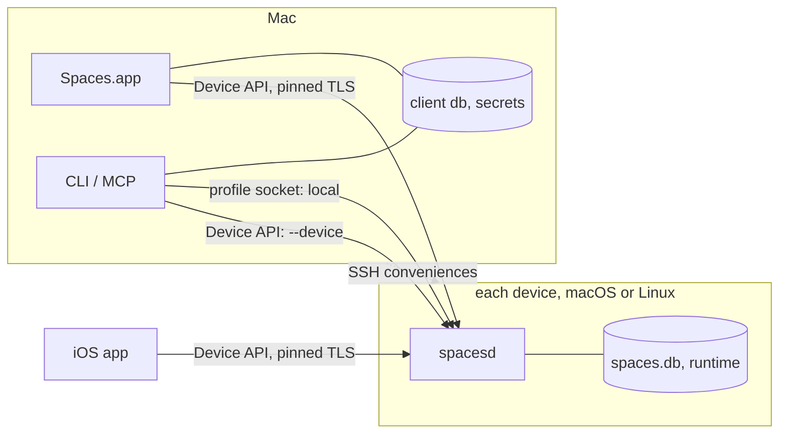

# Architecture

How Spaces is built and why: the pieces, where they live, how data flows, what is persisted where, and the invariants a change must keep. What the source states is left to the source. Related: [spec.md](spec.md) (behavior), [design.md](design.md) (visual system), [dev.md](dev.md) (build, release, QA, E2E, paths, Ghostty artifacts).

## System Overview

Spaces is thin clients over one daemon per device.

- **Clients**: the macOS app (`SpacesApp`, `spacesui`), the iOS app (`SpacesMobile`, `apps/ios`), and the `spaces` CLI with its MCP server, `spaces mcp` (`spacescli`). They hold only client state: layouts, window handles, paired devices, credentials.
- **Daemon**: `spacesd`, one per profile on each macOS or Linux device. It owns the daemon database, workspaces and their processes, terminal sessions (PTYs plus embedded libghostty cores), agents, automations, the TLS identity, and paired clients. Behavior lives in one orchestration layer, `WorkspaceOrchestrator` and its services (`workspacecore`), hosted by the daemon.
- **Supervision**: a LaunchAgent for the installed macOS daemon, user systemd on Linux, the requesting client (`TerminalService.ensureRunning`) for development profiles; see [Daemon request server and liveness](#daemon-request-server-and-liveness).

Invariants:

- SQLite is the single source of truth for persisted model data and global preferences.
- **Engine isolation.** The daemon's terminal engine runs on `TerminalEngineActor` (its own serial queue), so a busy main actor cannot stall terminal I/O. The engine may hop synchronously to main, never the reverse, which prevents deadlock. Blocking work (subprocesses, git, SQLite opens and durable writes, socket round-trips, PTY teardown) runs on neither actor. A session core's in-memory state is authoritative; the database converges behind it.
- **No Swift in a forked child.** Any Swift runtime entry after fork can deadlock on a lock another thread held, so the PTY child's pre-exec body is C (`spacesptyshim`) and `HostManagedPTYTerminalSessionDriver` prepares argv, envp, and cwd before forking.
- **A window is a client concept.** The daemon has no desktop session and stores no window identity; clients rebuild windows from the device overview.
- **One `SQLiteStore` connection, and the `WorkspaceOrchestrator` on it, belongs to one execution context.** Neither is `Sendable` or synchronized; concurrency means another connection. Across connections, the orchestrator's static per-key lifecycle gates and SQLite WAL coordinate.
- `Stop All and Quit` is the one client path that opens the daemon store directly, because it coordinates with Chrome tab tracking only the client has.

## Modules

`apps/macos/Package.swift` holds every Swift target and is the source of truth for dependencies. The iOS Xcode project (`apps/ios/project.yml`) links `spacesdevicecore`, `spacesterminalcore`, and `spacesterminalmobileghostty`. On Linux the package declares only the daemon artifact: `spacesd`, `spaces`, and their libraries.

| Module | Owns |
| --- | --- |
| `SpacesApp`, `spaces`, `spacesd`, `spacese2e` | Entry points (`spacese2e`: E2E and QA harness) |
| `spacesui`, `spacesterminalui` | Mac UI and terminal panes; bundles the Editor web app (`apps/macos/CodePaneWeb`) |
| `spacescli` | Commands and MCP server |
| `spacesdeviceapi`, `spacesdevicecore` | Device API server, pairing, overview stream; shared wire types |
| `spacesclientcore` | Client database, `SpacesDeviceClient`, pairing, credentials |
| `workspacecore` | `WorkspaceOrchestrator`, `SQLiteStore`, lifecycle, environment |
| `spacesterminalcore` | Terminal primitives, `SpacesProfile`, `TerminalService` (local daemon client), wire version, agent roster and hooks, theming |
| `spacesdatabase` | SQLite wrapper, daemon schema, migrator, backups |
| `spacesterminalghostty`, `spacesterminalmobileghostty` | libghostty hosting (GhosttyKit on macOS, headless `libghostty-vt` on Linux) and the PTY driver; iOS rendering |
| `spacesruntimecore`, `systembridge` | Daemon-safe git; shell, AppleScript, Chrome |
| `ghosttyvtshim`, `spacesptyshim` | C shims: `libghostty-vt`, PTY child |

## Runtime Topology

| Transport | Auth | Used by |
| --- | --- | --- |
| Device API (TLS, `host:port`) | Pinned daemon certificate plus per-client token | Mac app and iOS for every device, the Mac's own included; CLI/MCP `--device`; iOS browser-proxy tunnels |
| Profile Unix sockets (`/tmp/spaces-sockets-<uid>/`) | Filesystem permissions | Local CLI/MCP commands; the Mac app's daemon lifecycle, local token bootstrap, and quit handling |

- `SpacesDeviceAPICommand.descriptor` (`spacesdevicecore`) is the one switch giving each command its wire key, serial lane, and client timeout.
- **No relay**: devices must be directly reachable (LAN, VPN, Tailscale). Terminal control never rides SSH or a TCP bridge.
- **Credentials are files, never SQLite**, so no database backup leaks a token: hashes in the daemon's `device-pairings.json`, tokens in the Mac's `client-secrets/` (headless-readable by app, CLI, MCP), Keychain on iOS. Neither side rewrites them on every request.
- **SSH** (Mac app and CLI only) carries nothing load-bearing: `--ssh` pairing and the user-initiated Linux installer (`SpacesDevicePairingClient`; Linux-only because a Mac updates through Sparkle), `ssh -L` browser forwards (`BrowserSSHForwardManager`), remote editor folders (`EditorRemoteSSHSupport`).

## Persistence

Profile state lives under `~/.spaces` on both platforms (one code path, space-free paths for shells and AF_UNIX sockets, headless-friendly). The user's files live at `~/spaces/{workspaces,repos}`, outside any profile.

### Two databases

| Under the profile root | Owner | Holds |
| --- | --- | --- |
| `spaces.db` | `spacesd` | Projects, workspaces, runtime, agent, terminal, automation rows; restore offers; settings |
| `runtime/terminal/` | `spacesd` | TLS identity, `device-pairings.json`, `device-api.json` |
| `Client/spaces-client.db` | Mac app, CLI, MCP | Paired devices, client settings, sidebar and panel state, window and owner ids, Editor state |
| `client-secrets/` | Mac app, CLI, MCP | Device API tokens |

Clients never open `spaces.db` (Stop All and Quit aside): they read daemon state over the Device API and correlate it with client rows by stable keys (`workspace_id`, `runtime_target_id`, terminal `session_id`/`tracking_id`). The Mac app hosts no orchestrator.

### Profile resolution

A profile is one root holding both databases, client secrets, and `runtime/` (or `SPACES_RUNTIME_DIR`). `SpacesProfile.current()` takes the first match:

1. `SPACES_DB_PATH`, an ephemeral profile (tests, E2E, QA). Refused before any side effect inside `~/.spaces/` or `~/.spaces-dev/profiles/`: real profiles resolve from binary location, and a leaked binding makes a daemon serving `~/.spaces` take a development port, orphaning its paired clients.
2. A binary under `.spaces-dev/profiles/spaces/<name>/` serves that profile, judged by executable path alone because a deployed daemon inherits an arbitrary `HOME`.
3. A binary in a Spaces checkout (macOS) derives `~/.spaces-dev/profiles/spaces/<branch-slug>-<worktree-hash>` from git. A failed probe is a startup error, never a fall-through that would open (and on schema mismatch crash-loop) the installed database.
4. Otherwise `~/.spaces`.

Rules:

- **Identity is the root, not the branch.** `isInstalledProfile` (root is `<home>/.spaces`) gates the canonical port, router port, installed binaries, and systemd unit. `SpacesProfileSource` is only provenance.
- **Tests never resolve a live profile.** Under XCTest, a database or runtime directory in either live root is refused by location, never redirected; the account home comes from `getpwuid_r`, so a redirected `HOME` isolates. (A core's final writes can land after `terminate()` and after a per-test environment restore.)
- **Refusals stay loud.** `currentOrNilIfUnresolved()` maps only a genuine no-profile failure (a failed git probe) to `nil`; its non-throwing variants trap or log a refusal instead.
- **Terminals inherit `SPACES_DB_PATH` and `SPACES_RUNTIME_DIR`, never synthesize them.** Accepted consequence: agent hooks name the installed `spaces`, so agent reporting works only from installed-profile terminals.
- **A profile runs only its own build's daemon.** `TerminalService.resolveExecutableURL` tries `SPACESD_EXECUTABLE`, then binaries beside or bundled with the caller, then installed links (installed profile only) or checkout `.build` products (development only), else `daemonNotFound`. A borrowed build would answer on another wire version and hide the cause.
- **Linux units**: `spacesd.service` (installed), `spacesd@<name>.service` from one environment-free template (deployed development), none otherwise. After `systemctl --user start`, the socket poll decides.
- **Ports.** The installed profile's `47847` is a constant, never stored in `device-api.json`. Other profiles persist one from `SpacesDeviceAPIDefaults.developmentPortRange` (root hash, stepped past siblings' ports inside `.spaces-dev/profiles/spaces/`), sticky because paired clients store one host:port, and deterministic so a transient holder cannot move it.
- Client data, secrets, and distributed-notification names are scoped by the profile root.

### QA profile

`spacese2e qa-profile` ([dev.md](dev.md)) runs the installed build on `~/.spaces-dev/qa`, beside `~/.spaces-dev/profiles` so `SPACES_DB_PATH` can name it. `QAProfileSeed` copies both databases with SQLite's online backup API (safe while the installed daemon serves them), skips `runtime/` and `client-secrets/` so identity is fresh, and strips rows naming anything the installed profile owns.

### Migration rules

- A fresh database gets the latest schema. An older one upgrades one version per step through every intermediate version, each step in a transaction after a backup (restored on failure for the client database). A missing step, a newer version, or no `migration_state` marker fails closed. The daemon database must pass `PRAGMA integrity_check` after a create or migration.
- `migration_state.current_version` is authoritative; `PRAGMA user_version` is unused.
- A step touching a table early schemas may lack first creates its frozen predecessor shape, so every route converges.
- Data carries forward. Renamed persisted enum values are rewritten by a step, not aliased in decoders, since disk rows get no handshake. A step that drops unread tables or columns also removes them from the schema definitions.
- **Only the owner upgrades** (`ProfileDatabaseMigrationGuard`). Schema work holds the daemon instance lock; a helper facing a live owner refuses if the owner declares an older schema and otherwise waits for the owner's upgrade, migrating nothing.

## Data Model

Schemas: `DatabaseSchema` (`spacesdatabase`), `SpacesClientDatabase` (`spacesclientcore`). Foreign keys are on; delete-and-reinsert updates run in immediate transactions.

| Group | Tables |
| --- | --- |
| Project templates, seeded into a workspace once | `projects`, `project_{services,processes,browser_sessions}` |
| Workspace overrides | `workspaces`, `workspace_{settings,services,processes,browser_sessions}` |
| Runtime (apart from config so edits coexist with running work) | `workspace_service_ports`, `runtime_targets`, `browser_targets`, `running_processes`, `agent_sessions`, `agent_session_events`, `agent_subscriptions`, `agent_pending_notifications`, `agent_remote_{subscriptions,watch_baselines}` |
| Terminal | `terminal_{sessions,runtime_states,clients,attachments,remote_session_states,agent_signal_events}` |
| Automations, restore, Editor | `automations`, `automation_runs`, `restorable_sessions`, `workspace_review_comments` |
| Device | `settings`, `migration_state` |

Unique beyond primary keys: `projects.dir`; `workspaces(project_id, branch)` for non-empty branches; `root_directory` on the session, runtime-state, and remote-state tables; one pending notification per subscriber and agent (`INSERT OR REPLACE` keeps the latest); one active owner attachment per root, one active attachment per root and client.

### Window-ID ownership

The daemon tracks terminals, processes, and agents by terminal session id; `runtime_targets` has no window column and the overview emits none, so a remote viewer cannot focus another desktop's windows. The one persisted window handle, the Chrome window holding a browser session's tab, is client-side (`browser_session_window_ids`, `ClientBrowserWindowIDStore`).

### Runtime target model

- `runtime_targets` inventories a workspace's focusable items (type, app, durable `tracking_id`, order) through `WindowRole`, seeded as soon as the terminal exists. Process and agent rows link to one and carry a durable `terminal_session_id` for focus, restart, and final frames.
- `agent_sessions.updated_at` marks entry into the current lifecycle state (the alert time clients show); `brief` and `user_label` writes leave it alone.
- `agent_sessions.brief` (the agent's markdown brief) and `brief_updated_at` (display-only; nothing orders or gates on it) have one writer, `SQLiteStore.setAgentSessionBrief`, reached only through `WorkspaceOrchestrator.writeAgentBrief`/`clearAgentBrief`, which sanitize first (`sanitizedAgentBrief`); a clear writes the empty document, and one that sanitizes to nothing stores NULL. Neither upsert (`upsertAgentWindow`, `upsertDetectedAgentWindow`) names the brief columns: an agent often writes its brief moments before a hook signal lands on another connection, and the signal upserts a record built from a snapshot read before that write, so carrying the brief would put the older document back.
- **Agent rows are deleted only via `WorkspaceOrchestrator.finalizeAgentRow`**, which notifies watchers and drops edges. `agent_subscriptions` (terminal session subscribes to agent) is `ON DELETE RESTRICT`, so a bypassing delete fails loudly; project and workspace deletion finalize agents first ([Agent-row termination chokepoint](#agent-row-termination-chokepoint)).
- The cross-device `agent_remote_*` tables key on the child's terminal session id on its device, have no foreign keys, and belong to `RemoteAgentWatchService`.

### Data modeling guidelines

- Base tables stay generic and provider-neutral; process and agent rows never carry window or rendering fields; correlate by terminal session identity, never OS window handles.
- Prefer event history over `last_*`/`*_reason` columns; add schema only for a real workflow.

### Client database

Device-scoped rows key on `device_id`, so one database covers the local Mac and every paired remote. `paired_devices.hosts` is the ordered address list; `active_host`, the last one that connected, is always a member.

## Subsystems

Each section states what the subsystem is, where it lives, and the decision that governs it. Traps that shaped the code are in [Hard-Earned Learnings](#hard-earned-learnings).

### Terminal sessions (daemon)

Every terminal is a session a daemon hosts; clients only mirror it (the Mac client is under [Panels and terminal panes](#panels-and-terminal-panes), the iOS one under [iOS terminal mirror](#ios-terminal-mirror)). `spacesd` owns every session, whether workspace, process, coding-agent, automation, or CLI-created, and outlives the app. `ghostty-embedded` is the only `TerminalSessionBackendKind`: the macOS daemon hosts each session on a headless GhosttyKit surface (`GhosttyEmbeddedSessionHost`), the Linux daemon on a `libghostty-vt` session (`GhosttyLinuxHeadlessSessionCore`), and both publish the same render updates. `libghostty-vt`, built from the same fork, also serves `spaces terminal tail`, client-local scrollback, the transcript trim's state preamble, and the Linux key and mouse encoders.

The fork is pinned by the `apps/macos/vendor/ghostty` submodule and adds headless-session, render-frame, and mirror-renderer entry points without changing Ghostty's default behavior (artifact workflow and required exports: [dev.md](dev.md)). Spaces artifacts build with `-Dsentry=false`: the reporter's init thread snapshots `environ` while `ghostty_init` calls `setenv` on the calling thread, a use-after-free that segfaults the daemon and the iOS app, and Spaces configures no DSN, so the reporter has nothing to offer.

Restore offers after a daemon exit are under [Session restore](#session-restore); the exec-in-place handoff that carries live sessions across a daemon update is under [Wire compatibility and daemon restart](#wire-compatibility-and-daemon-restart).

#### Ownership and gating

Exactly one client holds the owner attachment, and only it may drive the PTY: `TerminalControlCommand.requiresOwnerClientID` gates `send`, `key`, `clearScreen`, `resize`, `scroll`, `scrollToBottom`, and `mouseButton`, each also epoch-gated when the client sends the owner epoch it has cached (a request with none is not). Ownership moves only by explicit takeover, across devices included. Any attached client may send `setAppearance` (a per-client view preference: last writer wins, a same-value request is a no-op) and the selection commands ([Shared terminal selection](#shared-terminal-selection)).

- **The live core is the authority.** A live session core's in-memory attachment snapshot decides gating and every broadcast. The core is the only writer of a live session's client and attachment rows; SQLite is its write-behind mirror, which a fresh core (daemon restart, exec handoff) reseeds from. Control gating reads the core, never the mirror, because a not-yet-committed attach would reject the owner a broadcast just announced.
- `TerminalControlRequest` is the flat JSON on a session's control socket; `TerminalControlCommand` is its typed view and the one place that decides owner gating and which commands echo the resulting session state (`includesSessionStateOnSuccess`: `attach`, `detach`, `takeover`), so a client applies that state without a second `.state` round trip.
- **Orchestrator commands.** `sendTerminalInput` and `tailTerminalOutput` are token-authorized but deliberately not owner- or attachment-gated, because orchestrator agents drive sessions they never render.
- **Image paste** (`terminalPasteImage`) extends the owner boundary to images: the Device API handler refuses ended sessions and payloads over 10 MiB, checks owner and epoch against the durable mirror (the one ownership check that does not read the core; the `send` it forwards is gated by the core again), writes a user-only `/tmp/spaces-paste-<uuid>.<ext>`, and injects only that path through the owner-gated `send`.

#### Attachments and leases

- **Every client kind holds a lease.** `TerminalClientKind` names locality only: `local` is this Mac's pane on its own daemon, `remote` is anything across a network hop, a Mac pane on another device's session included. Every kind is live only while attached, connected, and refreshed within `remoteClientLeaseInterval` (60 s) (`TerminalSessionAttachmentSnapshot.liveAttachments`, `TerminalSessionPersistence.staleRemoteClients`), because a force-quit app leaves the same ghost attachment over a Unix socket as over the network. Only activity that names a client refreshes its lease; refreshing on any activity would keep a disconnected client's lease alive forever.
- **Heartbeats.** A Mac pane heartbeats every 20 s (`TerminalPaneService.RemoteTerminalWindowClientStore`) under a `ProcessInfo` background activity, so App Nap cannot starve it while the app is in the background; the Device API's subscription relay heartbeats at the same period for its stream. Lease touches reach memory on every request and the database at most once per quarter interval ([Performance Principles](#performance-principles)).
- **Daemon start wipes every client and attachment row** (`TerminalSessionPersistence.clearAllClientsAndAttachments`, first thing in `SpacesdMain.start()`), since no client transport survives the process, whether it restarts or `execv`s. Clients re-attach from the fresh snapshot in the role they held (Mac `refreshNow`, iOS `TerminalReattachCheckAfterReconnect`), and only when that snapshot no longer names them, since a `.viewer` attach would demote an owner.
- **Detached-client recovery.** Stale-client expiry broadcasts the post-expiry attachment state (`postAttachmentStateDidChange` at the end of `expireStaleRemoteClientsIfNeeded`), and a client reacts to a snapshot that lacks its attachment (Mac `TerminalSessionPaneViewController.refreshNow`, iOS `TerminalViewerModel.applyReducedState`), so recovery adds nothing to the wire. Invariants:
  - Attachment identity is the per-attach `connectedAt`, carried with fractional seconds and ordered past the last value published for that client, so two attaches in one burst never share an identity. The macOS daemon mints it (`GhosttyEmbeddedSessionHost.clientForAttachLease`) while the lease stays the server's grant time, because the stale-client sweep measures liveness against the lease.
  - Only session-stream payloads confirm an attachment (iOS `hasSnapshotConfirmedAttachment`). A command's own answer and a direct `.state` read are silent, since either can land ahead of an older stream payload; a subscription's first payload may report a loss, since the daemon builds it after the acknowledged attach.
  - Every loss path records one reclaim intent (`pendingExpiredAttachmentReclaim` on iOS), settled once under the ownerless-only rule, so one loss makes one re-attach and one ownership decision.
  - A failed re-attach hands off to `scheduleReconnect` and is never retried in place.
  - A client attached across an exec handoff gets no snapshot (the handoff closes and rebinds the session's sockets), so it recovers by noticing its closed stream and redialing.

#### Storage

SQLite holds the canonical record: launch configuration (`terminal_sessions`: backend, lifetime policy, workspace, kind, shell, command, launch command, user title), runtime state (`terminal_runtime_states`: state, service and child pids, title, working directory, grid, foreground process, bell), client identities and lease timestamps (`terminal_clients`), owner and viewer attachment history (`terminal_attachments`), and the final render payload (`terminal_remote_session_states`). The session directory `<runtime>/terminal/sessions/<session-id>/` holds `output.log`, the transcript. A session's control and subscription sockets and the profile's `service-<hash>.sock` (create, list, terminate) live in the shared socket root under hashed names ([Sockets](#sockets)). A live core writes through `TerminalSessionPersistence`'s own connections and a per-core write-behind queue ([Performance Principles](#performance-principles)), not `SQLiteStore`, so its changes raise `TerminalOverviewSignal` rather than `databaseDidChange` ([Sidebar refresh](#sidebar-refresh)).

#### Lifecycle

`TerminalSessionState` is `starting`, `running`, `exited`, or `failed`, and the first two are interactive. A session goes `starting` to `running` when its shell is up, to `failed` on a launch failure, and to `exited` when its child exits or it is stopped. Every session the product creates is `persistent`: it outlives every client and an app quit. At daemon start, `TerminalSessionStaleRecovery` repairs rows a vanished daemon left `starting` or `running` (a dead service pid is `failed`; a row an exec predecessor under the same pid failed to finalize is `exited`) and unlinks the sockets of every session that is not live.

- **Termination runs in a fixed order**: flush buffered output into `output.log` (a command that prints and exits at once would otherwise leave no transcript to scroll), write the exited state, detach every client in memory and in the mirror, build and broadcast the final `terminated` payload, and only then tear down the renderer, since a frame captured after teardown is empty.
- **An ended session is read-only** even if stale rows still name an owner. Its `.state` response and any `subscribe` are served from the persisted final payload, and the subscription completes after sending it.
- **Closing an ad hoc terminal's pane** is the only thing that ends it, and the daemon decides. `closeEmbedded` reads owner status before detaching and asks after the detach lands (an ended pane asks too, to remove its row); `stopWorkspaceTerminalIfBareShell` terminates only with no configured owner, no surviving owner attachment, and a bare-shell foreground whose shell has no child. Gates fail closed (refused during exec handoff), and the foreground is sampled fresh from the OS (`BuiltInTerminalForegroundProcessSampler`) because persisted foreground fields lag. `TerminalBareShellForeground.isBareShell` is shared with agent-row demotion. There is deliberately no orphan bare-shell sweep.

#### Reclaiming ended sessions

- **Garbage collection** (`TerminalSessionGarbageCollector`) purges a session only when not shown and unreferenced by `running_processes` / `agent_sessions` / `runtime_targets` (`SQLiteStore.terminalSessionIsReferencedByProduct`). Only interactive sessions can be pinned by attachments. Checks fail closed; purge failures are contained per session. `purgeSession` removes the directory before the rows so a failure stays rediscoverable.
- **Retention** (`TerminalSessionRetentionPolicy`): referenced ended sessions past 7 days (clocked on `exitedAt`, never expiring when unresolvable), then oldest-first beyond a 2 GB budget (directory bytes plus `terminal_remote_session_states.payload_json`), are released through `WorkspaceOrchestrator.releaseEndedTerminalSessionReferences` (the ordinary termination doors), rechecked, and purged. Open ended panes are not protected (accepted).
- **`TerminalSessionOrphanSweep`** removes row-less session directories and stranded `output.log.trim` files after a 1-hour grace, never for a session known to the DB or the daemon's active set. All reclamation runs every 10 minutes.
- **Stored roots.** Sweeps reach sessions through each row's stored `root_directory` (`listKnownSessions`), never a re-derived path that would miss its rows forever; deletion is still limited to profile-owned roots (`isProfileOwnedSessionRoot`). `writeRuntimeState` requires the session row.
- Clients prune open panes against the daemon's retained set ([Pruning panes against the daemon](#pruning-panes-against-the-daemon)), so no pane outlives its transcript.

#### PTY driver: session and leader lifetimes

`HostManagedPTYTerminalSessionDriver` forks each session's child, whose pre-exec body is C (the no-Swift-after-fork invariant is under [System Overview](#system-overview)). Sessions run the account's login shell, falling back to `/bin/zsh` on macOS and `/bin/bash` on Linux; `forkpty` needs `libutil` linked on Linux only. The driver tracks two lifetimes:

- **Session.** EOF on the PTY master ends the session: the master fd is released, input is refused, and the closed handler fires.
- **Leader.** EOF does not mean the leader exited. It may still be exiting, or it may have closed its stdio and kept running. Only a successful `waitpid` clears the recorded child pid.
- **One escalation task.** A single task ends and collects the leader.
  - It starts from `terminate()` (after SIGHUP) or from the read loop when a non-blocking reap comes up empty. One flag allows one escalation per child, so there is never a double `waitpid` or a signal to a reused pid.
  - Each stage waits for both the read-loop exit and the reap. If either is missing, it escalates to SIGTERM, then SIGKILL, on the process group.
- **Targeted reaping.** The daemon installs no `SIGCHLD` handler and never calls `waitpid(-1)`. The daemon also spawns processes, agents, automations, and Caddy, and their owners wait on their own exit statuses.

#### Render updates

Frames are cell grids (text, attributes, cursor, row-wrap flags), never pixels, so each client renders at its own scale, and the daemon itself renders nothing ([Performance Principles](#performance-principles)). The subscription carries three kinds of update: `full` (self-contained), `delta` (cell runs plus Ghostty scroll-rectangle operations against the subscriber's baseline), and `resyncRequired`. Every full update carries a `fallbackReason` (`missing_baseline`, `baseline_mismatch`, `invalid_grid`, `invalid_scroll_rect`, `delta_apply_failed`, or the forced reason) that render metrics record, which makes a render regression diagnosable from logs alone. Client-side reduction and presentation are under [Render path](#render-path).

- **Producer.** `GhosttyRenderUpdateProducer` (`spacesterminalcore`) makes the full-vs-delta decision for both cores. A frame is full only when a subscriber cannot hold its base (`initial`, `resize`, `terminated`, a one-shot `.state`, an owed baseline reset on a non-`scroll` reason, or a delta the producer's own run of the client applier rejected); otherwise it is a delta, even an empty one.
- **Publish only real screen changes.** A scroll publishes only if the viewport offset moved; the trailing screen-revision broadcast captures once and publishes nothing when the capture equals the delta baseline (same owner epoch, no scroll-rect carry, nothing owed), else ships that same capture. The baseline names only what subscribers received, and a one-shot read of an unchanged screen reuses its revision: one revision names one picture. The Linux core owns its revision counter and needs none of this.
- **Frames are the only render source.** A missing or unusable frame is answered by a full frame or a resync, never by replaying `output.log`, which feeds only tail, client-local scrollback, and the handoff rebuild. Output events carry byte counts and offsets for ordering and diagnostics, never bytes to render. Screen changes advance `screenStateRevision`, which is separate from `sessionStateRevision`; gating renders on the latter drops viewport-only changes such as a daemon-side scroll.
- **Encoding is lazy**: the update stays materialized in `GhosttyRemoteSessionStatePayload` and is encoded and memoized on the serializing queue, off the engine actor.
- **Resize.** A resize to the current grid is a no-op. Per-attachment resize serials stop a superseded size pinning the grid (a reconnecting owner restarts its count). On macOS the forced full frame is captured only once Ghostty's resize callback reports the reflow and a capture carries the armed grid; the Linux core reflows synchronously.

#### Render codec

- **Grapheme clusters and links** ride beside cells as sparse `[Int: String]` tables keyed by cell index, keeping cells plain data so whole-array copies (decode, delta apply, crop) stay memcpy. Every cell move rekeys the tables. Caps apply at snapshot construction (16 codepoints per cluster, 2,048 bytes per link) so no snapshot fails to encode. Links are export-only; Linux exports clusters but no links.
- **Row-wrap flags ride on every cell** of their row (`GhosttyTerminalSnapshotGrid.rowWrapFlag`, `rowWrapContinuationFlag`, default-fill cells included), so the codec and delta ops carry them as plain cell data. Mirrors need them for native selection and link detection across soft-wrapped output, such as a file path that wraps mid-path.
- **Compression.** A plaintext header (`GRTU`, codec version, kind, uncompressed length) over one raw DEFLATE body, so `GhosttyRenderUpdateBinaryCodec.encodedKind(of:)` classifies without inflating and Darwin `Compression` and Linux zlib interoperate. The length prefix is bounded by DEFLATE's 1032:1 ratio and 64 MiB. The Darwin decoder loops (`GhosttyRenderUpdateBodyCompression.drain`) because `compression_stream_process` writes at most 128 KiB per call.
- Changing terminal wire vocabulary or meaning (key specs, pointer meaning, codec, heartbeat fields) raises `SpacesWireProtocol.version`.

#### Transcript (`output.log`): trim and tail

- **Live transcripts are bounded** by `TerminalTranscriptTrimCoordinator` / `TerminalTranscriptTrim`: past `liveTranscriptTrimTriggerBytes`, keep the newest `liveTranscriptRetainedBytes`. Handoff resume and `spaces terminal tail` replay from byte 0, so the trim prepends a **state preamble**: the head replayed through a throwaway `libghostty-vt` session and serialized by `spaces_ghostty_vt_session_state_preamble` as non-default state diffed against a fresh terminal (modes, Kitty flags, margins, charsets, cursor) plus a flow repaint of the visible grid. Margins use default-extent sequences because a preamble replays at whatever size the terminal has then. Each trim starts from the previous preamble, so correctness is inductive.
- **The cut** falls at the first ESC in a bounded scan (always a clean parser boundary), else after a newline in ESC-free text, else is deferred. No preamble means no trim.
- **Crash safety.** Stage into `output.log.trim`, fsync, rename; append cores adopt the returned handle. Only planning and the commit (delta copy, fsync, rename) run on `TerminalEngineActor`; the preamble build runs detached, safe because bytes below the snapshotted end are immutable. One trim per session at a time.
- **Accepted gaps**: inactive screen, scrollback above the grid, tab stops, DECSC, OSC color/title, pen SGR, cursor shape, exact layout at another grid, and live reflow (the transcript records no resizes, so a from-zero replay reproduces file-replay layout). A live resize always reflows in place on both cores.
- **`spaces terminal tail`** (`TerminalOutputTail.tail`; callers are the CLI, the daemon profile command, and the Device API's `tailTerminalOutput`) replays `output.log` from byte 0 through a throwaway `libghostty-vt` session at the session's persisted grid size; an ESC-free transcript instead scans back for newlines. No end-relative window is a valid state root (full-screen programs re-home every repaint, so a tail rooted there renders blank), and periodic in-transcript preambles would displace the window scrollback reads use. Cost is O(transcript), bounded by the trim trigger. Output that scrolled above the prompt is included, so an agent can read the result of a command it sent. For identified coding-agent sessions only, tail first erases a faint run starting under a visible cursor, with its soft-wrap continuations (an inline completion suggestion).

#### Session metadata: title, pwd, bell, clipboard, queries

- **Title and working directory** follow the program on both cores: Ghostty surface actions on macOS; `libghostty-vt` effect callbacks on Linux (`spaces_ghostty_vt_session_enable_events`), where the event distinguishes a clear from never-set and `TerminalWorkingDirectoryURI` decodes OSC 7 with Ghostty's local-host rules. Changes broadcast under `session_metadata`. Values are cached on the core and seeded from the runtime row on handoff, since preambles restore no title; events enable only after the resume replay, except the handoff-window suffix, which replays events-live but drops its bells and clipboard writes.
- **Name vs live title** (`TerminalSessionTitle`): name is `terminal_sessions.user_title` else the launch title; live title is the last OSC 0/2 report. `terminal_runtime_states.title` stores only the raw report, never a fallback. They travel as separate fields (`TerminalSessionCatalogEntry.name` / `.liveTitle`) so a program cannot rename a user-named row.
- **Bells.** Both cores stamp `bell_at` through `TerminalBellCoalescer` (30 s quiet window: the timestamp is the alert's dismissal identity). The daemon stamps unconditionally; each client suppresses the session it is looking at, because attachment is not focus. Suppression consumes (writes the dismissal) rather than filters, since `bell_at` persists: Mac `AlertsController.consumeFocusedSessionBellAlerts`; iOS per-session watch windows (the list polls only every 30 s while a detail is open) with 2 s skew tolerance and per-device dismissal buckets (`SpacesMobileDismissedAlertsStore`). The Mac's flat dismissed set is pruned per owning device, only against a section that has reported. Handoff and every runtime-row rewrite carry `bell_at` forward. Runtime changes raise `TerminalOverviewSignal`, which on the Mac reloads only This Mac's overview after cold start.
- **OSC 52 clipboard** goes to the owner client, never the daemon's pasteboard: a `clipboard_write` payload (`TerminalClipboardWritePayload{targetClientID, text}`) fans out on the state stream (accepted: every subscriber is the user's paired device); no owner means dropped. It is an event, not state: exempt from staleness ordering, applied before any reduced state, judged against ownership the client already holds, dropped by `merged(with:)` / `replacingRenderUpdate`, never coalesced. Capped at 1 MiB on both cores. macOS transcript replay refuses writes via a flag the clipboard callback reads synchronously.
- **Terminal queries** on Linux (DSR, DECRQM, color, XTVERSION) are answered from the shim's write-pty replies, drained in query order after the turn's events, bypassing the input sequencer so a program blocked on a reply never waits behind typing. Environment-dependent queries have their own shim callbacks: VT220 device attributes, size reports from the cached grid with a synthetic one-pixel cell, and color scheme from the cached appearance.

#### Submit-safe sends

Submit safety lives at the session-host send chokepoint (`GhosttyEmbeddedSessionHost`, `GhosttyLinuxHeadlessSessionCore`), so every client gets it from one `appendNewline: true` request (`--submit` to users).

- Text is written as a paste and the CR (Codex and OpenCode submit only on CR) as a second write, because agent TUIs treat one read burst as a paste. With bracketed paste on, the paste frame separates them structurally; with it off, the CR is spaced 500 ms.
- The framing is decided by the text write itself (`enqueueSubmit` reads live DECSET 2004 in the same engine step), never from an earlier sample that could go stale. `TerminalControlInputSequencer` runs input writes in enqueue order, keeping text and CR adjacent; handoff quiesce awaits its `drain()`.
- A submit answers for its bytes: callers wait on a `TerminalInputWriteAcknowledgement` (bounded by `writeAcknowledgementTimeout`, 4 s), so a write that reached no PTY fails instead of letting an automation record an undelivered prompt. On macOS the submit collects the writes Ghostty's IO thread makes (`collectingWrites`) and follows with the fork's `ghostty_session_sync_io` mailbox barrier; a NUL-byte barrier is unusable because NUL is not inert in every parser state.

#### Ghostty resources and large-stack calls

- **Resource resolution.** `GhosttyEmbeddedLocator` (`GhosttyEmbeddedPaths.swift`) searches `SPACES_GHOSTTY_RESOURCES_DIR`, then the app bundle (after resolving the `~/.spaces/bin/spacesd` symlink), then, for dev builds, `.local/ghosttykit` from the current directory and upward from the `spacesd` binary. The binary anchor matters because an on-demand daemon inherits the working directory of the client that spawned it.
- **Large-stack calls.** `ghostty_session_new_headless`, `ghostty_config_load_file`, and `ghostty_app_new` run through `runOnDedicatedLargeStackThread` (`GhosttyLargeStackCall.swift`): each call gets a fresh 8 MB `Thread`, matching the main-thread size Ghostty's init assumes, and the caller blocks until it returns. `TerminalEngineActor.runSynchronously` runs on the caller's thread, and a Device API request arrives on a libdispatch worker with about 512 KB of stack, which faults at the guard page (release builds survive this only by luck).

### Panels and terminal panes

The Mac app's client side of terminals. Terminal sessions present as panes inside tabbed panels, never as standalone windows. A pane shows either a terminal session or the Editor. Every terminal pane, local or remote, mirrors a session a daemon hosts ([Terminal sessions (daemon)](#terminal-sessions-daemon)): the app owns no terminal of its own, only mirror surfaces fed by render frames over the Device API. The Editor web app's internals are under [Editor integration](#editor-integration) and `apps/macos/CodePaneWeb/README.md`; the iOS viewer's own structure is under [iOS terminal mirror](#ios-terminal-mirror).

#### Pieces and where they live

- `spacesui/Panels/`: `PanelLayout` (value type: tabs, selected tab, focused pane) and `PanelLayoutEngine` (pure mutations: split, close with collapse, prune, focus fallback, `moveTab`). Layouts persist as versioned JSON in the client database: `workspace_panel_layouts` per `(device, workspace)` and `panel_windows` (layout plus frame).
- `PanelScope`: `.workspace(deviceID:workspaceID:)` (the selected workspace's panel in the main window) or `.globalWindow(panelWindowID:)`. `PanelWindowController` is only an `NSWindow` shell; layout state stays in `PanelCoordinator`.
- `PanelCoordinator` (an `AppKitController` sub-controller) owns every scope's layout, view, and pane-content lifecycle. Terminal content (`TerminalPaneContentController`) is keyed by session id, Editor content (`CodePaneContentController`) by pane id; `PaneContentHosting` is the shared lookup/focus/restore/prune/teardown surface.
- `TerminalPaneService` (`host.terminalPanes`) owns the terminal-pane domain: state-model and content factories, open-request preparation, control sends, pane close, the pure open/hold/close policy decisions `PanelCoordinator` drives, and the built-in session launcher/terminator registered with `WorkspaceOrchestrator`.
- `TerminalSessionPaneViewController` (`spacesterminalui`) owns window-independent pane content: renderer switching, attach lifecycle, key translation, find, and the pane's `TerminalPaneBanner`.
- `RemoteGhosttySessionHost` and `GhosttyMirrorTerminalView` (`spacesterminalghostty`) are the render host and mirror surface; `DeviceTerminalSessionStateModel` (`spacesui`) is the per-session link to the owning daemon.
- Platform-neutral pieces shared by the Mac pane and the iOS viewer live in `spacesterminalcore`: reduction pipeline, connection-stage tracker, scrollback model, notification routing, key and pointer specs, render codec.

#### Layout invariants

- **At most one pane per terminal session across all panels.** Opening an open session focuses its pane wherever it lives; `PanelCoordinator.openOrFocusTerminalPane` is the chokepoint for sidebar clicks, the session picker, and shortcuts.
- **A global panel window holds exactly one tab** (a pane or a split) and has no tab strip, `+`, or new-tab shortcut; it exists to mix sessions from different workspaces or devices, each still workspace-owned.
- **Moving a pane between scopes is remove-then-insert**, the same mutation splitting uses, so the live Ghostty surface re-parents instead of being recreated. A tab move keeps pane ids; a lone terminal pane move (`moveSessionToNewPanelWindow`) mints a pane id and keeps the session id.
- **A window shell exists only while its layout has content**; every path that empties one funnels through one dismissal that persists the deletion and closes the window.
- **A session ending never removes its pane**: the pane keeps showing the session's final render. Panes close on user close, on pruning against the daemon's retained set ([Pruning panes against the daemon](#pruning-panes-against-the-daemon)), or on a confirmed workspace stop or delete; a restarted configured process's pane is held for its replacement ([Restart pane replacement](#restart-pane-replacement)).
- Tab drag reorder stays within one `PanelTabBarView` (private pasteboard type) through `PanelLayoutEngine.moveTab`; there is no cross-window move path.
- **The session picker** (split, `+`, `⌘T`) lists sidebar runtime targets through `orderedWorkspaceRunShortcutTargets` / `windowShortcutTargetResolution`, the enumeration the sidebar and palette use, minus browser targets and anything already open (`PanelCoordinator.openSessionIDs()`, in memory). `fillSplit`'s move branch remains only as a race guard. A pick or a cancel returns focus to the pane the picker was opened for (`SessionPickerReturnFocus`), named by its caller from the layout because the click that opened it may already have moved the first responder; falling through to a main-window reveal instead would switch Spaces away from a full-screen global window such as the Editor's.

#### Titles

Titles cascade through names, not live titles: pane shows its runtime target's name (`runtimeTargetTitlesBySessionID`), tab its selected pane's, panel window its selected tab's. A rename reaches a client only in the next overview, so `SidebarController.rebuildFlatSidebarData` (the funnel for every overview install) calls `PanelCoordinator.refreshGlobalPanelTitles`; the visible workspace panel is re-titled by the workspace-detail path. `withRuntimeTargetTitlePass` builds the runtime-target list once per synchronous refresh pass. A pane no target claims falls back to the terminal's own title.

#### Agent brief column

- **Beside the terminal, not over it.** `TerminalPaneContentController`'s content view is an `AgentBriefPaneContainerView` holding the terminal pane's own view and, while there is a brief to show, an `AgentBriefColumnView` as its trailing sibling rather than a subview, so everything the terminal pane pins to its own edges (the banner, the find bar, the takeover scrim) keeps overlaying just the terminal. The column is removed, not hidden, when there is nothing to show, and hands keyboard focus back to the terminal if it held it. It counts as the pane for focus, and keys pressed while it holds focus stay with its text view.
- **Source.** The text is the owning device's overview row (`SpacesDeviceWorkspaceCodingAgentRow.brief`, matched by session id), re-applied by `PanelCoordinator.refreshAgentBriefs` on every overview install; a placeholder pane still attaching shows none. Unchanged text is not re-rendered, so scroll and selection survive a refresh.
- **Rendering.** `AgentBriefMarkdown` parses with Foundation's `AttributedString(markdown:)` and maps each block onto the chrome type scale, so the brief reads as part of the app rather than as a web page. Foundation has no task-list intent, so a task item keeps its literal `[ ]`/`[x]`.
- **Visibility** is an in-memory `AgentBriefVisibility` on `PanelCoordinator`, keyed by agent (`row.agentID ?? row.id`, never by pane or session, so a restart that replaces the session keeps the choice) and recording only explicit toggles. The footer glyph, the `⋯` item, a panel window's identity strip, and ⌥⌘B read that one state; ⌥⌘B is claimed in the local key monitor only when its target pane has a brief.

#### Editor pane hosting

- **Placement.** The Editor's only placement is `.globalWindow`, and at most one code pane exists app-wide. That is structural, not a counted cap: every open gesture calls `PanelCoordinator.openOrFocusGlobalEditorWindow`, which reuses `anyGlobalCodePanePlacement()` when a code pane exists and creates one otherwise (creation, not focus, is gated on reachability by `mayCreateCodePane`). Both move-to-window paths no-op for a code pane.
- **Following selection.** `retargetGlobalWindowCodePanes` / `retargetCodePane` replace the controller (its workspace identity is immutable) while keeping the pane id, so a code pane relocates by close-and-reinstall, never by re-parenting.
- **Eligibility** is one check, `ProjectKind.isEditorEligible` (the daemon refuses the home project's file API), read by the fallback chain (`AppKitController.globalEditorFallbackWorkspaceID`), the overview keep set (`OpenPanePruning.editorEligibleWorkspaceIDs`), and follow-selection retargeting.
- **State.** One `CodePaneWorkspaceState` document per `(deviceID, workspaceID)`, reported whole by the page (`workspaceStateChanged`) and written by `CodePaneWorkspaceStatePersistence` to the client database through one shared write-behind coordinator: latest wins, encoding and SQLite off the main actor, an in-process cache so a retarget sees a queued write, drained at termination. Each authoritative overview reconciles durable, cached, and queued documents; deleting a workspace fences its queued writes first so no orphan reappears.
- **Initial mode.** `CodePaneInitialModePolicy` separates an explicit Diff open from restoration; `CodePaneContentController.seededMode` decides a fresh pane's mode (saved mode, else Editor for a non-git project), and a reused or retargeted pane keeps the mode it restored. An unknown workspace resolves as git so a transient lookup miss cannot latch the non-git presentation.
- **Hibernation.** An unselected `WorkspacePanelView` stays alive detached (Ghostty surfaces survive untouched), so `onWindowMembershipChanged` deactivates only code-pane content when the panel leaves its window. A web content process death or failed load runs the same `teardownWebView()` and shows a Reload notice that calls `installWebView()`, reusing the normal re-seed; each death logs `code_pane_web_view_died`.
- **Running agents** for the Editor come from `CodePaneHosting.codePaneRunningAgents(workspaceID:)` (the sidebar's running coding-agent rows), pushed by `PanelCoordinator.updateCodePaneAgents` at the same overview-apply sites as `pruneOpenCodePanes`.

#### Pane attach and ownership

- **Four independent axes**, each an enum in `TerminalSessionPaneAttachState.swift`, never layered booleans: `TerminalClientAttachmentLifecycle` (`.detached` / `.attaching(id:requestedMode:priorMode:)` / `.attached(mode:)`), `TerminalOwnershipIntent`, `TerminalGhosttyHostResolution` (one-way; a reentrant request during `.resolving` is deferred and replayed), and `TerminalTakeoverAttemptState` (only an in-flight attempt past the retry timeout may be superseded).
- **Attach and detach never run on the main actor.** The lifecycle moves to `.attaching` optimistically and the send goes on the pane's own `TerminalInputSerialQueue`; attach and detach share it because the daemon must see them in issue order (a detach overtaking its attach leaves an attachment for a gone pane). A failed attach rolls back to `priorMode`.
- **A snapshot cannot contradict an outstanding attach.** While `.attaching`, a snapshot's silence about this client only adjusts `priorMode`; the daemon's attachment broadcast brings the answer. This is what keeps a close during the attach sending its detach.
- **Refocus fast path.** Re-showing the focused pane of a panel's selected tab that already holds the owner attachment on a live surface (`holdsOwnerAttachedSurface`) only foregrounds and restores the caret (`PanelCoordinator.refocusFocusedTerminalPane`, gated by `TerminalPaneService.canRefocusTerminalPaneWithoutReattaching`); anything else takes the full open path.
- **Renderer states** (`TerminalSessionPaneViewController.VisibleRenderer`): an interactive session this pane owns is `.ghosttyOwner` whether or not a frame has landed; `.ghosttyTakeoverStatus` means this client is not the owner (another client owns it, or no one does): a scrim over the text view with the Ghostty surface released, since a viewer is not mirrored the owner's output; an ended session with a final frame is `.ghosttyEndedFinalRender`.
- **`TerminalPaneBanner`** is the pane's only chrome: a persistent `TerminalPaneBannerNotice` (ended/failed, or link dropped) and a transient action banner, transient winning, one instance per pane so precedence is code rather than z-order. `TerminalPaneBannerNotice.resolve` is the pure rule: a stopped session beats a dropped link (the daemon streams only live sessions). Typing into an ended or disconnected pane pulses the banner without consuming the key, gated on the banner being visible (`isStateStreamBannerVisible`), not on the raw disconnect flag.

#### Terminal state transport

One `DeviceTerminalSessionStateModel` per session carries the catch-up `.state` read, the live subscription, control requests, and transcript reads over the owning device's pinned-TLS Device API. The local device takes the same path and differs only in the socket dialed.

- **Pinned-TLS connects block, so nothing dials on the main actor**: subscriptions connect off it, and control requests use a request client resolved before the model is built. A stale endpoint delays a pane; it never freezes the UI.
- **Local recovery.** The local daemon can idle-shut-down and rebind a port (always, under `SPACES_DEVICE_API_PORT=0` E2E profiles), rotate its TLS identity, or reset pairings, so pane preparation re-resolves through `SpacesDeviceClient.bootstrapLocalDevice` (endpoint and pin from one bootstrap). Connect failures, `unauthorized` subscribes, transcript transport failures or local pin mismatches, and overview reads (`resolveOverview`, `localOverview`) each re-bootstrap and retry once via `bootstrapLocalClientAwaitingDeviceAPI`, which waits for a just-started daemon's listener rather than relaunching. Outcomes log as `terminal_device_local_endpoint_recovery` / `terminal_device_local_authorization_recovery`. Remote devices trust their pin and re-walk only addresses (`SpacesDeviceEndpointResolver`); a remote pin mismatch is a hard failure.
- **A lock-guarded box holds two request clients plus the token**, read as one pair at send time so a recovery swings every vended sender. Transcript pages get their own client because a client holds one lock per round trip and a megabyte page would stall typed input.
- **Bootstraps are serialized and coalesced**: `bootstrapLocalDevice` is one atomic read-token/round-trip/save-token section per process, and pane-path bootstraps share one single flight (restoration and a pairing reset hit many panes at once).
- **Streams carry a generation**; a callback is honored only if its stream is still installed. Listener handles detach on release as well as on stop.
- **A late listener gets the cached payload's render update only if it is a full frame** (a delta means nothing without a baseline); metadata always replays.
- Session notifications post against a per-session scope object interned in `TerminalSessionNotification`, because `NotificationCenter` matches objects by pointer identity; dispatch then scales with the sessions a payload concerns.

#### Connection loss: detection, banner, reconnect

- **A dropped stream is not a state event.** It is published as `isStateStreamDisconnected` (derived from the model's `TerminalConnectionStageTracker`) and re-read on `.spacesTerminalStateStreamConnectionDidChange`, leaving the device's last runtime report untouched. Whether a session ended is asked of the device: a drop against a cache reading `.exited` runs one liveness recheck settled only by its own `.state` answer.
- **Shared stage model** (`spacesterminalcore`: `TerminalConnectionStage`, `TerminalConnectionNotice`, `TerminalUnreachableBackoff`, `TerminalConnectionStageTracker`), pure and synchronous, driven identically by the Mac model and iOS `TerminalViewerModel`, which own the timers. `reconnecting` hides its banner for `bannerGraceSeconds` (1 s); `unreachable` is entered only when a redial's every candidate address failed, never on a timer. Only a received frame returns to `connected`.
- **Two cadences.** Stage 1: `TerminalStateStreamReconnectBackoff` on the `RemoteConnectionBackoff` curve (500 ms to 10 s, jittered, per session). Stage 2: the `TerminalUnreachableBackoff` ladder (1, 2, 4, 8, 15 s) as a redial cadence: one tick dials alongside anything in flight (at most two attempts), and only the tick spends a rung. Stage 2 dials take a 4 s budget (cold open: 10 s Mac, 12 s iOS). `scheduleReconnect()` is the one chokepoint keeping them apart.
- **Attempts are records** (`DeviceTerminalConnectAttempt` / iOS `TerminalConnectAttempt`) in a live set; the first to deliver a frame wins and retires the rest, and every post-`await` mutation checks liveness because the detached blocking dial ignores cancellation. The all-candidates-failed verdict travels with the dial (`lastDialExhaustedAllCandidates`, set atomically by `noteStreamFailed`) because the resolver's failed set self-resets. Retry (`retryStateStreamConnection()`) retires everything, resets the ladder, and dials at once.
- **Input sends usually detect a dead link first** (the subscription waits on TCP keepalive). Every interactive send path in `RemoteGhosttySessionHost` reports failures through `reportInputFailure` to `reportFailedInputSend`; only on `true` does `TerminalInputSerialQueue.cancelAll()` discard the queued backlog so nothing (an Enter included) lands late. Only transport failures count (`isDeviceAPITransportFailure`); a coded rejection says nothing about the link.
- **A bare timeout is not evidence** (a saturated daemon answers late over a live link). A connection-level failure is conclusive (teardown, paced reconnect; `allCandidatesUnreachable` goes straight to stage 2); a repeat during a confirmed outage keeps dropping backlog; a fresh timeout keeps the backlog and starts one corroboration probe per stream generation.
- **The probe** is one `.ping` with a 2 s end-to-end deadline on its own one-shot client (the session client's lock precedes its deadline), pinned to the stream's connected host (`request(_:pinnedHost:)`) because a raced ping proves nothing about that address. Only no error or a coded rejection means alive; anything else tears down and reports `noteStreamFailed`.
- **Interactive deadline.** `controlRequestTimeoutSeconds(for:command:)` gives the hot commands (`send`, `key`, `clearScreen`, `resize`, `scroll`, `scrollToBottom`, `mouseButton`) 5 s and everything else the Device API default; tight is safe only because a timeout probes rather than tears down.
- **Stream liveness.** Every terminal `subscribe` relay writes an empty line after `TerminalStreamLiveness.keepaliveIntervalSeconds` (3 s) of no writes (`terminalStreamKeepaliveIsDue`, on both daemon transports without interleaving a frame); framing loops drop empty lines. Clients end a stream silent for `silenceTimeoutSeconds` (8 s) with `streamStalled`, on `ContinuousClock` so sleep counts, classified transient before authentication. The Mac watchdog runs on `SpacesBlockingIOThread` because a saturated workqueue starves GCD timers.
- **The daemon keeps answering under load**, which is what makes a probe meaningful: engine-bound commands run on per-session lanes and `.ping` on the receiving connection's own queue ([Request transport and threading](#request-transport-and-threading)).

#### Render path

How a pane turns the daemon's render updates ([Render updates](#render-updates)) into pixels. The reduction pipeline and resync pacing are shared with iOS.

- **Routing by reason.** `TerminalRemoteSessionStateReason` (raw values are the wire strings) is switched exhaustively by `TerminalRemoteSessionStateNotificationRouting` and the screen-state policy. Screen-content reasons (`input`, `input_output`, `output`, `state_change`, `scroll`, `clear_screen`, `selection`, `resize`) post only `.spacesTerminalOutputDidChange`; transitions post their own (`session_metadata` only its metadata notification, since agents retitle many times a second). Owner-mirror and takeover-status panes skip output refreshes unless surface renderability flips.
- **Reduction pipeline** (`TerminalRemoteStateReductionPipeline`, one per session). Reduction runs off the main actor exactly once per payload in submission order across stream and direct reads, since the baseline chain must see the daemon's series. Application is latest-frame-wins: outputs collapse by reason shape (`isCoalescibleOnApply`) or under a newer full frame, never erasing a pending frame with a frameless one, posting the union of notifications and carrying one-shot effects (a resync request above all). A direct `.state` response and `clipboard_write` never collapse. Coupling the two would make the main thread the rate limiter.
- **Off-screen panes hold screen updates** (`GhosttyMirrorTerminalView.isDisplayed`), folding them into one entry with the newest frame, and apply once on return. Never held: a pane's first frame (the container unhides only once content exists), a failed reduction (its resync is the only repair), and barriers.
- **Presentation.** The apply's own draw presents the cells the render thread last built, not the applied frame; a coalesced per-display-interval refresh presents the applied frame. Re-display, surface rebuild, and window occlusion changes (`NSWindow.didChangeOcclusionStateNotification`; Ghostty stops building cells while occluded) also present. A refused frame is re-offered under a per-frame budget.
- **Resync.** Any lost frame (failed apply, a `stale_resize_grid` veto, an attach with no frame) requests a `.state` read, paced at one per second per session on Mac and iOS. A suppressed request arms one trailing retry, retired only by a frame at or past the failure's `(ownerEpoch, revision)` (`TerminalResyncOwedOrdering`). The daemon releases a subscriber's owed full frame only with a broadcast that carried one.
- **Direct `.state` reads are ordered at the head of the reduce queue**: an older-owner-epoch frame is refused with everything it carried (it would revert ownership), a same-epoch frame at or below the last handed-over revision is refused alone (equal allowed only to re-head a broken chain), metadata merges unless strictly older, and an ended report wins unless provably from an older run.
- Mirror action handlers are keyed by surface pointer and unregistered by token (`GhosttyMirrorActionHandlerToken`), because surface addresses are reused.

#### Mirror surfaces and viewport sizing

- **`GhosttyMirrorSurfaceMRU`** caps live mirror surfaces process-wide (`warmSurfaceLimit`) but never frees a displayed pane (on screen, in a visible window, no hidden ancestor; each pane watches its window because visibility fires no view event). The sweep runs a main-queue turn later because `PaneTreeView.render` detaches and reattaches a whole tab mid-pass. A freed pane keeps its latest full frame and repaints with no round trip; off screen it still reports content (or it could never be unhidden to rebuild) and reports no viewport size (the pre-mirror `cellMetrics()` estimate measures another font).
- **Only settled viewport sizes reach the daemon.** Mid-layout passes report transient fitting-size grids, so `RemoteGhosttySessionHost.handleViewportSizeChange` holds each size one main-actor turn (a different size replaces it, the same size leaves the wait alone) and re-checks the pane can still measure. A transient send costs two SIGWINCHes, a line of scrollback, and a remote reflow.

#### Scrollback: client-local transcript replay

Scrollback replays the session's `output.log` on the client, for live and ended panes on Mac and iOS; no client tells the daemon where it scrolled. The daemon's one viewport is shared by every attached client, so forwarding scrolls would move other viewers and cost a round trip per wheel event, and reconciling a per-client offset against it leaves two viewport truths racing each other under output. A scrolled pane paints its own frames while session frames keep applying underneath, so jumping back needs no request.

- **Data.** `terminalTranscript` (read-only, its own server lane) serves a capped suffix cut at a parser-safe boundary with a state preamble (`TerminalTranscriptPrefix`), as raw DEFLATE. Continuations are served verbatim and name the file by inode; a different file (a head-trim renames a rewrite over it) or an oversized gap returns a fresh preambled suffix flagged as a rebuild. Responses carry their run identity, so a read straddling a relaunch is rejected by data.
- **Model.** `TerminalLocalScrollbackModel` (`spacesterminalcore`), shared by Mac and iOS: a headless `libghostty-vt` session built off the main actor at the frame's grid and appearance, reusing `GhosttyVtSessionBridge` and the Linux handoff replay machinery; viewports go out as `GhosttyRenderFrame`s with monotonic local revisions.
- **Reads.** Prefetch `initialLocalScrollbackPageBytes` after the first painted frame; each gesture reads at most once more, at its start, when `outputEndByteOffset` moved (a trim can move it backwards); a gesture past the oldest row reads the full `defaultMaxBytes` once and rebuilds at the same distance from the bottom. Deadlines scale with the page (`SpacesDeviceAPICommandDescriptor`: fixed allowance plus 64 KB/s). An empty read latches unavailable only on an ended session; on a live one it, like a failure, returns to idle and cancels the gesture.
- **Routing** is decided once per gesture from the session's newest frame: `alternateScreenActive` or `mouseReportingActive` (or no frame) forwards to the daemon, else the replay scrolls. The latch ends on momentum end or an idle pause, so a mid-flick frame cannot split a gesture.
- **Leaving and discarding.** Typing and the jump control return to live and cancel the gesture; scrolling onto the newest row returns without cancelling. Grid or appearance changes, a clear-screen from any client (recorded in the transcript), and a relaunch (by child process in `runIdentity`; a mere exit keeps history) discard the replay, bumping a load generation. While a replay frame is shown the pane reports no shared selection and an ended pane publishes no final frame.
- **Jump to bottom** of the daemon viewport is `TerminalControlCommand.scrollToBottom`, never a large delta (under mouse tracking that becomes wheel reports). Visibility is client-side, from the exported scrollbar (`TerminalScrollbackPosition`).

#### Input: keys, scroll, mouse

- **Keys are named by clients and encoded by the host** against live terminal state (Kitty flags, DECCKM): clients send specs parsed by `TerminalKeyInput.resolve`; hosts run Ghostty's encoder (`ghostty_surface_key` on macOS, `spaces_ghostty_vt_session_encode_key` on Linux). Only the macOS surface path also runs keybinding lookup; the hosts agree because the daemon loads Spaces-generated config whose Ghostty defaults are all `super`-modified. `cmd+k` is an app action; line-editing chords are fixed readline bytes. One spec name per key.
- **Scroll** deltas carry a normalized pointer and a `TerminalScrollModifiers` snapshot (precision and momentum phase) through `TerminalScrollCoalescer` (first batch immediate); the daemon maps the pointer over its render bounds, since display scales differ. The Linux core has only the VT viewport API, so `TerminalScrollDeltaNormalizer` reproduces Ghostty's precise-delta accumulation there. A scroll that normalizes to zero rows or is already at a scrollback boundary succeeds as a no-op, and omitted modifier bits mean `0`; an error there would surface on every trackpad flick at the top or bottom.
- **Mouse buttons** ride the user-initiated input queue, never coalesced, press/release strictly ordered. The daemon exports `mouseReportingActive`, the shift-capture tri-state, and `alternateScreenActive` on full frames and deltas; the client applies them to its mirror so Ghostty's own selection-vs-report decision runs unchanged, then forwards what the mirror captures. A cmd-press and its release are withheld (`forwardSuppressedButtons`): SGR cannot encode super and a Ghostty-aware host program would reopen the link on the host. The macOS mirror strips capture flags once the session stops being interactive.
- **A click's pointer is the clicked cell's center**, `(column + 0.5) / columns` (`TerminalPointerGrid`), quantized against each client's own geometry; hosts floor it back (macOS inside `GhosttySurfaceGridPadding`). A scroll pointer keeps the continuous meaning.
- **iOS taps.** A tap the link probe does not claim is forwarded as a click when the frame reports capture (`forwardMouseClick`), and refused while a replay is shown. The link probe runs only while the applied frame kept full width (`GhosttyTerminalSnapshotViewport.coversColumns`), because a column-cropped frame keeps soft-wrap bits and would join a wrapped link with its middle missing. The daemon surface drops Ghostty's `open_url`.

#### Pruning panes against the daemon

Each overview publishes `retainedTerminalSessionIDs` (`SpacesDeviceOverviewBuilder`, the garbage collector's rule) and keeps `sessions` summaries for retained ended sessions (`terminalCatalogEntry`), which is what makes an ended pane openable. Every authoritative overview apply (`applyDeviceOverview` with an explicit originating device id, `applySidebarDataSnapshot` gated by `localSnapshotAuthorizesPanePrune`, `applyRemoteDeviceSection` on success) runs `PanelCoordinator.pruneOpenPanes` (`OpenPanePruning.sessionsToClose`), and startup restore prunes layouts against `OpenPanePruning.restorationKeepSet`. An offline or incompatible device never prunes. This keeps any pane from outliving its transcript.

### Shared terminal selection

Selection is session state owned by the session host, not by any client surface. User-visible rules are in [spec.md](spec.md).

- **Where it lives.** An ordinary Ghostty selection (tracked pins) in the host's terminal, so it follows its text through scrollback and reflow and dies with that text. Every exported frame carries it viewport-projected (`GhosttyTerminalSelectionRange`) with the scrollbar offset it was projected against. The macOS core reads its render state; the Linux core projects vt-shim state with the pure `GhosttyTerminalSelectionProjection`. Clients materialize the range into their mirror so Ghostty draws the highlight.
- **Mutation.** Control commands `setSelection`, `clearSelection`, and `readSelectionText`, broadcast with reason `selection`. Not owner-gated (`TerminalControlCommand.requiresOwnerClientID`): last commit wins, and concurrent commits are an accepted race. `setSelection`'s response carries the text and is the only pasteboard write; the mirror drops `GHOSTTY_CLIPBOARD_SELECTION` writes because its selection is viewport-clipped.
- **Drag anchoring.** A drag is local until mouse-up, then commits absolute rows through `setSelection`. Mid-drag, the anchor shifts by the scroll rects each delta frame exports, accumulated in `ScrollRectCarryBuffer`. Invariants:
  - The carry is trusted only where a frame claims it: `GhosttyRenderFrame.scrollRectsOverflowed` defaults to true and only the delta materializer sets it, so full frames, resyncs, and replays poison it, and a poisoned carry cancels the drag.
  - Every export drains the fork's rect ring, so the session host folds rects drained by non-streaming exports into `TerminalStreamScrollRectCarry` and prepends them to the next stream delta.
  - When the apply mailbox collapses frames, the survivor inherits the skipped frames' rects; only the reducer's `frameToApply` carries rects, never the stored payload that replays later.
- **iOS** never drags: it sends `clearSelection` (tap) and `readSelectionText` (Copy pill). The pill crops against `TerminalViewerModel.renderedViewportWindow`, the window `GhosttyRemoteTerminalHostView` last rendered, never a window recomputed from the grid (that disagrees while the keyboard is up or scrolled back). Its layout and C-field mapping (`TerminalSelectionCopyPillLayout`, `GhosttyRemoteTerminalSelectionMarshalling`) are separate from macOS because the mobile target does not depend on the AppKit mirror.

### iOS terminal mirror

**One shared mirror.** Exactly one Ghostty mirror exists per process, owned by `GhosttySharedTerminalMirror` (`spacesterminalmobileghostty`) and handed between `GhosttyRemoteTerminalHostView`s by re-parenting its surface host. A mirror costs tens of MB and `ghostty_mirror_free` can block indefinitely, so none is ever freed; one parked mirror is the bound.

- A mounting view takes the mirror; the surrendered view goes black until it re-enters a window or the mirror parks with no holder (covering a terminal presented over another). The hand-back completes synchronously inside the release.
- A rebind hides the surface host until the new holder applies its own frame (apply is a full terminal reset) and re-registers per-surface state.
- The host view skips an apply whose identity (render key, version, revision, owner epoch, input acceptance, cropped snapshot) matches the last, since the apply copies the grid and blocks on the GPU. A geometry change refreshes rather than reapplies, which would erase surface-local selection (macOS `GhosttyMirrorTerminalView` too).

**Reduction and ordering.** `TerminalViewerModel` feeds one `TerminalRemoteStateReductionPipeline` (`spacesterminalcore`), shared with the Mac ([Render path](#render-path)): ordered off-main reduction across every route, latest-frame-wins application. Direct reads carry their viewer lifecycle and never publish into a replacement.

- **Provenance.** The subscription and takeover responses are in band; every direct `.state` read is out of band, ordered against what was already reduced.
- **Owner epoch.** Every live payload carries `ownerEpoch`; the core bumps it per transfer and follows with a full frame. The reducer refuses an older-epoch in-band payload (`stale_ownership_generation`) and moves nothing. Epoch, not `emittedAt`, because clocks step backwards; epoch-less payloads (a terminated session's final state) are never refused. Both ends refuse deltas across an epoch change.
- **Who asks for the screen.** `includesRenderUpdate` (a wire-contract field on `.state` and terminal-control requests) decides whether the daemon captures one. The iOS takeover asks for none; the Mac pane asks, because `DeviceTerminalSessionStateModel.apply` orders by `emittedAt` and would discard the earlier transfer broadcast. The connect bootstrap asks for metadata only, since the subscription's initial frame is self-contained, and does not arm `markNextBroadcastFullWhenMissingRenderUpdate`.
- A stopped viewer drops in-flight reductions except the clipboard one-shot.

**Lifecycle state.** `TerminalViewerState.swift` stores independent enum axes (run, connection, takeover attempt, ownership sync, scene, attachment identity), the sibling of the Mac's `TerminalSessionPaneAttachState`; computed flags keep call sites boolean, and generation counters stay standalone for async staleness checks.

**First paint.**

- A first open holds screen updates until a frame at the surface's latest reported grid has reduced, so the daemon's previous grid never paints. Recognition happens on the reduce loop so the open burst collapses into one apply. The hold ends early when nothing can produce that frame, and after one bounded wait.
- A cold open is a chain of gates: acquire the mirror with only a window and bounds, report the viewport, resize, recognize the matching frame. No stage may wait on rendered content, or the chain deadlocks until the timeout paints the stale grid.
- Before a surface exists, `GhosttyTerminalCellMetricsCache` (from real `ghostty_surface_size()` reads, stamped with app version and generated config) predicts the grid; a system-font estimate is withheld because Ghostty's bundled font measures differently.
- A reopen paints the session's last screen synchronously from `TerminalRetainedScreenStore` (on `SpacesMobileAppModel`, since the viewer is `@State`). It is a picture only: never `latestState`, never a delta baseline. The bootstrap read goes out alongside `subscribe`.

**Transport and viewport.**

- A viewer's session requests ride its own `SpacesDeviceAPICommandChannel` (one cached pinned-TLS connection), so a cold open dials once for commands and once for the stream. A takeover keeps the channel; only the input retry replaces it.
- The daemon grid is measured against `reportedViewportBounds()` (minus the accessory toolbar, keyboard ignored); rendering crops into `visibleRenderBounds()` (minus the keyboard) with a retained row offset. A keyboard toggle sends no resize and reflows no other client.

**Connection stages.** `TerminalViewerModel` drives the pure `TerminalConnectionStageTracker` and owns its grace and reconnect tasks (`TerminalUnreachableBackoff`), mirroring the Mac's `DeviceTerminalSessionStateModel` and `RemoteGhosttySessionHost`.

- Stage 2 (`unreachable`) needs candidate-exhaustion evidence, never a timer: `allCandidatesUnreachable` from a command request, or `dialExhaustedAllCandidates` on a stream's disconnect event (computed atomically by `SpacesDeviceEndpointResolver.noteStreamFailed(host:)`, since the shared resolver self-resets), counted only if that stream never delivered a frame.
- Other connection failures are stage 1: tear down and redial. `.requestFailed` is a daemon answer, never link evidence. Transport failures never set `errorMessage`. During an outage, repeated input-send failures drop queued input and add no reconnect.
- A bare input timeout starts one `sendPinnedPing` probe to the stream's pinned host (2 s total); a cancelled probe records no verdict, so it cannot poison a healthy address.
- Input is never gated on the banner stage.

**Resume after backgrounding.**

- The viewer redials on return only if the absence (`ContinuousClock`, stamped by `prepareForBackgrounding()`) exceeded one keepalive interval or a redial debt is owed. The debt belongs to the viewer and clears only on a dial: `.inactive` bounces resume with no gap, and a stream loss taken while away is recorded as debt rather than reconnected (which would dial a stale endpoint and start the banner grace).
- The redial waits on `waitForForegroundEndpointRefresh()`, a gate armed as the shell backgrounds and released only by the newest `resumeFromBackground()`, because a stream dials one cached candidate while the shell re-races them. It uses the 4 s budget and `scheduleReconnect(after: .zero)`, so no outage shows and the last screen stays up.
- The heartbeat doubles as the state read: it carries `TerminalHeldFrameIdentity`, and when that matches the live export the daemon returns metadata only (without arming a full frame for other subscribers). The answer re-enters the pipeline via `applyOutOfBandState`. Redial and heartbeat share one attach per lifecycle (`attachViewerForCurrentLifecycle`), and automatic takeover is decided once per foreground cycle.

**Agent brief sheet.**

- `AgentBriefVisibility` lives on `SpacesMobileAppModel`, not on the terminal screen (rebuilt on every entry), and holds the agent row ids whose brief the user hid, in memory. The sheet's `isPresented` binding reads "has a brief and is not hidden", which is what opens it on its own; its setter records a dismissal as a hide, and a row with no brief records nothing, so the close that follows a clear is not a hide.
- `TerminalBriefSheet` reads its row from the app model on every render, so an overview carrying a rewritten brief re-renders it. The brief arrives only with the overview poll, never through `readAgentBrief`.
- It renders through `TerminalMarkdownDocument.makeHTML`, the markdown-it document the Markdown file preview uses, rather than a second renderer, so drawing a list item's leading `[ ]`/`[x]` as a disabled checkbox applies to Markdown previews too.

**Linking and launch.**

- **iOS links `libghostty-vt` statically**, because it cannot `dlopen` outside the bundle and a stripped Release binary exports nothing to `dlsym`: `ghosttyvtshim` names functions directly (`SPACES_GHOSTTY_VT_STATIC_LINK`) from one X-macro table, and requests the slice with `#pragma comment(lib, ...)` chosen by `TARGET_OS_SIMULATOR`, since Xcode's per-product package framework links see no app link settings. `Package.swift` points `-L` at `.local/ghosttyvt/ios-link/`, filled by `setup_ghostty.sh`.
- `simctl launch` hands the app an immediate EOF on stdin, so `GhosttyMobileAppService` repairs stdout and stderr and rebinds stdin to a kept-open pipe before booting Ghostty, or the runtime shuts down at launch.

### Sidebar model and repaints

**Device model cache.** `DeviceModelStore` (`host.deviceModel`) owns the in-memory device data: per-device `DeviceSection`s, the flattened cross-device `projects` / `workspacesByProject` / `workspaceRuntimeStatusByID` / `alertsGroups`, the derived `workspaceIndex`, local device identity, and the app-config cache. Only `SidebarController.rebuildFlatSidebarData()` and `AppKitController`'s overview-apply path write it. Assigning `workspacesByProject` runs three effects in a load-bearing order (invalidate the visible-workspaces cache, rebuild `workspaceIndex`, resolve deferred deletions against it).

**Outline repaints.** Every applied change funnels through `SidebarController.applySidebarDataChange`: re-merge, sign each row (`SidebarRowSignature`), diff against the last painted rows (`SidebarOutlineDiff`), and reload only changed rows by their stable `OutlineItemRef`; only a change of shape (rows added, removed, reordered, a project collapse flip) calls `reloadData()`. A device with live sessions pushes up to four overviews a second (the daemon coalesces to one per 250 ms), and a full rebuild costs tens of milliseconds each.

- An apply before `attachOutlineView` updates the model but not the diff baseline (`reloadData()` on an unattached outline is a no-op). External pane opens (IPC, `spaces://`) wait on `awaitMainWindowContentBuilt()`.
- Signatures embed whole model values and the device load state, so a cell reading a further field cannot go stale; selection is excluded.
- Wholesale repaints go through `fullReloadSidebarOutline` (refreshes the baseline) and `reloadOutlinePreservingSelection`, since `reloadData()` silently drops the selection. The re-assert runs under `suppressOutlineSelectionChanges`: a repaint is not navigation and must not close an open form. Only navigation expands a collapsed project.
- `SidebarAttentionStatus` orders `failed > blocked > done > working > inactive`; stand-in rows take their descendants' maximum, included in the signature.
- Terminal secondary text resolves `liveTitle`, then the overview's `foregroundCommand` (formatted daemon-side by `TerminalForegroundProcessInspector.displayCommand`); the client inspects no process.

**Visibility.** Two independent daemon-owned flags (`projects.is_hidden`, `workspaces.is_hidden`) are composed at render time by `SidebarVisibility`, never merged, so unhiding a project restores exactly the workspaces shown before.

- Every listing surface (outline, arrow navigation, cycle order, automation picker, palette, session picker) reads that one rule. `findWorkspace` resolves hidden rows on purpose, so selection reconciliation checks effective visibility.
- A non-git project's row stands in for its single workspace, whose flag is the only one in play.
- Alerts use the payload form `SpacesDeviceOverviewPayload.isWorkspaceVisible` (`spacesdevicecore`, shared with iOS). Hidden-workspace groups are kept and flagged `isFromHiddenWorkspace` so dismissal pruning does not forget a dismissal and resurrect it on unhide; displays filter on the flag.
- The Workspaces surface lists everything. `WorkspaceVisibilityTree` and `FuzzyTextSearch` (also the palette's matcher) live in `spacesdevicecore` so the Mac and iOS surfaces cannot drift.
- A hide, of a project or a workspace, on either client, is one hidden-flag write (`updateProjectMetadata` / `updateWorkspaceMetadata` with `isHidden`) and nothing else: it stops nothing and prompts for nothing. Hidden-and-running is an ordinary state (automations still run hidden targets, and the Workspaces surface lists every hidden row). On the Mac both route through the device-mutation chokepoint (`deviceForWorkspaceMutation`, `deviceForProjectMutation`).

**Detail pane re-renders.** `show*` methods are both navigation and re-render, so every applied snapshot re-presents the visible pane. Surfaces rebuilt by wholesale view replacement would destroy the control under the pointer mid-click, so the Alerts pane (`AlertsController.AlertsRenderSignature`, structural vs text-only) and the workspace footer (`AppKitController.WorkspaceDetailFooterSignature`) render only when their signature changes. Signatures are invalidated when other content takes the container, exclude appearance (dynamic colors), and never block a `.userNavigation` render.

**Project and workspace forms.** `ProjectFormsController` (`host.projectForms`) owns the add-project, add-workspace, and project-settings windows, unsaved-changes tracking, generation tags that guard stale actions, and the save/import/delete flows. An open form or unsaved edits defer background sidebar reloads.

### Focus and window cycling

Focus is a client concern reconstructed from the overview. One device-agnostic dispatcher resolves a target (browser URL, terminal session, run-process/run-agent action), shared by sidebar rows, numbered shortcuts, the palette, alerts, and cycling, so a missing pane is simply reopened. `WorkspaceRuntimeTargetIndex` is the one ordering all of them share. Observable rules are in [spec.md](spec.md).

- `WindowFocusController` (`host.windowFocus`) owns numbered shortcuts, the focus pipeline (`executeWindowFocusResolution`), cycling and its mode, summon, and named-window focus for IPC and MCP. `CommandPaletteController` owns the palette; its item builders are `nonisolated static` in `CommandPaletteItems.swift`, and its `DeviceModelStore` and `AlertsController` inputs are injected at init so items build without a live host.
- Only two leaves depend on where the daemon runs: a browser session focuses a local Chrome tab (remote URLs route through the SSH forward and Caddy), and a terminal opens or focuses its pane through `PanelCoordinator`. Focusing a terminal activates Spaces and reclaims owner attachment.

**Cycling.**

- `WindowCycleScope` is one workspace or one cross-device mode; `WindowCycleState` keys cursor, recency, and frozen rotation by scope. Only the selected mode is persisted.
- `WindowCycleModeTargets` is the pure cross-device set builder, shared by the press and the sidebar row. Invariants: persisted layouts of unrestored panels count only on reachable devices (`persistedLayoutKeys(for:)`), since restoring one dials its daemon; `Alerts` reuses the Alerts pane's own builders and in-memory dismissal set, matched to windows by terminal session id; every set applies `isWorkspaceVisible`; targets on an unreachable device (`WindowCycleDeviceSnapshot.isReachable`) drop unless their pane is open, except local browser sessions; a live burst is frozen by target identity, so targets its rotation named stay while they exist.
- Visit recency is per workspace plus one cross-device list, recorded at one site (hand-reached focus via `PanelCoordinator.noteContentFocused` included). One Chrome tab snapshot answers every workspace per press.
- All entry points (the shortcut and `spaces.ipc.cycle-workspace-window`) run through one `WindowCycleStepQueue`, so presses are a sequence: each resolves state only after the previous step lands.

**Cycling row and HUD.** `CycleModeRowModel` is the pure description the row and HUD render, filled from the same builders a press walks, so the count is what the next press can land on.

- Every trigger reaches the row through `SidebarController.refreshCycleModeRow`, the only caller of `refreshCycleModeBrowserState`.
- The browser half is an AppleScript round trip, so the row reads a cached snapshot. `BrowserCycleStateRefreshDecision` keys cache and in-flight refresh by workspace-id set: a changed set refreshes at once, a same-set request reuses a recent cache, and a request mid-refresh marks a rerun. `trackedBrowserCycleState` runs detached and never launches Chrome. Nothing polls.
- The pane half caches stored layouts of unrestored workspaces (`PanelCoordinator.storedWorkspacePanelLayouts`, invalidated on write or restore); pruning is never cached.
- The HUD (`TransientOverlaysController`) is a subview of the main window's content view centered on `detailContainer`, which is emptied wholesale, so it shows only on the main window. Its count is fixed when shown; the row is the live readout.

### Shortcuts and global hotkeys

`ShortcutsController` owns Carbon hotkey registration (only while holding the desktop-control lease), the local `NSEvent` monitor and its dispatch order, every `HotkeySpec` and the leader set (persisted in the client database), and settings capture. `GlobalHotkey` is the set that fires with any app frontmost (toggle, palette, next/previous cycling, open-in-editor); everything else, the cycling-mode chord included, runs off the local monitor. `ShortcutSettingResolver` is nonisolated and testable. The controller decides which shortcut fired; execution stays with the state owner. The mouse-focus monitor stays on the host, installed alongside in a fixed order.

### Browser sessions and service routing

`BrowserSessionCoordinator` (`host.browserSessions`) owns the Mac side: SSH forwards, service-port display, URL matching and teardown, local Chrome focus, and closing the tabs a stopped or deleted workspace configured: eagerly after the Mac's own Stop or Delete, and, for a stop or delete made elsewhere, on a running-to-stopped transition in any device's overview or the workspace's disappearance from it (even when it was already stopped, since nothing else ever clears a deleted workspace's tracked tabs).

- **Local routing.** The macOS daemon runs a bundled Caddy mapping `http://<service>.<slug>.localhost:<router port>` to each service's port. Only the Mac seeds a router port. Plain HTTP on loopback only (`127.0.0.1` and `[::1]`): no LAN listener or certificates, and browsers treat `*.localhost` as a secure context.
- **Remote workspaces.** `BrowserSSHForwardManager` runs one `ssh -L` per (device, workspace), writes client-owned routes to the profile route registry, and asks the local daemon to reconcile; the daemon alone reloads Caddy. Overview updates preload forwards for running workspaces.
- **Matching and focus.** A tab belongs to a session when its URL is the configured URL or its trailing-slash variant, or starts with the configured URL without also starting with a sibling session's longer URL (`BrowserSessionCoordinator.browserTabURL(_:matchesBrowserSessionTargetURL:excluding:)`); the Caddy or SSH-forwarded form of a remote target matches the same way, and cycling prefers the longest match. Strings are compared as written, with no host normalization, so `google.com` and `www.google.com` are different sites. Focus tries the tracked window id, then scans for a hand-moved tab, then opens into a tracked window before creating one.
- **iOS** tunnels instead: `openServiceTunnel(workspaceID, serviceName)` turns a pinned-TLS Device API connection into a byte pipe to the service's loopback port (one per browser TCP connection, at most 64 per daemon). `SpacesMobileBrowserProxy` (`BrowserProxyServer.swift`) is a fixed-port loopback reverse proxy that routes by `Host` and requires an unguessable per-route cookie, keeping the `<service>.<slug>.localhost` origin so storage isolates per service. It works for remote workspaces while the Mac sleeps.

### Device API and pairing

Every daemon serves the Device API: a pinned-TLS, line-framed JSON protocol that every client (Mac app, `spaces` CLI, iOS app) uses to reach every device, the local one included. Requests and responses use typed envelopes; mutation responses carry a refreshed overview plus action-specific identifiers so clients never infer affected rows.

#### Where the pieces live

- **Daemon** (`spacesdeviceapi`): `SpacesDeviceAPIServer` (Darwin `NWListener` and Linux OpenSSL transports), `SpacesDeviceAPISupervisor`, `SpacesDeviceAPIConfiguration.swift` (port settings, `SpacesDeviceAPINetworkInterfaces`), `DeviceOverviewStreamServer`, and the Editor back end (`SpacesDeviceWorkspaceGit.swift`, `SpacesDeviceWorkspaceWatch*.swift`).
- **Shared protocol and client transport** (`spacesdevicecore`): the command enum and `SpacesDeviceAPICommandDescriptor` (each command's lane and timeout, switched on identically by both server transports), `SpacesDevicePairingLink`, `SpacesDeviceHostCandidates`, the blocking `SpacesDeviceEndpointResolver`, `SpacesDeviceAPIRequestClient`, `SpacesDeviceAPIWarmConnectionStore`, `SpacesDeviceTerminalLinkClassifier`.
- **Mac app and CLI** (`spacesclientcore`): `SpacesDeviceEndpointRegistry`, `SpacesClientDatabase` (paired-device rows, `active_host`), `SpacesDeviceClient`, `SpacesDevicePairingClient`, `SpacesDeviceCredentialStore`.
- **iOS** (`apps/ios/Sources`): `SpacesMobileDeviceStore`, its own actor `SpacesDeviceEndpointResolver`, `SpacesDeviceNetworkRequestTransport`, `SpacesDeviceAPICommandChannel`, `SpacesMobileAppModel`.

#### Identity and pairing

- Each daemon creates or loads a self-signed identity under `<profile runtime>/terminal/daemon-tls` (`TerminalServiceTLS.swift`; DER into a Security identity on macOS, PEM into OpenSSL on Linux). A client verifies the certificate fingerprint before sending anything, then presents a per-client token issued during a short pairing window. Credential storage is under [Runtime Topology](#runtime-topology).
- **Hostname is never validated; the fingerprint alone identifies the daemon.** Any address that completes the pinned handshake is provably the paired daemon, which is what makes advertising several addresses safe and lets clients race them.
- Pairing links (version 4) carry an ordered `hosts` list (repeated `host=`, most-preferred first), nonce, short code, fingerprint, wire-protocol version, and app version; no transport key. A link is untrusted input and every client redeems through `SpacesDevicePairingLink.parse`, so the parser trims, de-duplicates, and caps `hosts` at `SpacesDeviceHostCandidates.maxCount` (6), the bound the stored record and the address merge also use, since every candidate is something a connect may walk. Redemption races the link's addresses through a throwaway resolver and stores the record starting from the one that answered.
- A remote device without Spaces fails pairing with the structured `remoteSpacesNotInstalled(message:linuxInstallCommand:)`. A non-nil command (Ubuntu 24.04) drives `installSpacesOnRemoteDeviceAndPair`: the version-pinned installer runs over an SSH `ControlMaster` and pairing follows on success, from both the Mac panel and `spaces device pair --ssh`. A nil command (a remote Mac) is surfaced unchanged.
- The single Linux install path is `scripts/spaces-install-linux.sh`, served at `https://usespaces.dev/install.sh` by the web build's `prebuild` copy (not a release asset). It verifies the release manifest's Ed25519 signature before trusting its version, checksums the archive, and runs the artifact's installer, which enables systemd lingering so the daemon survives SSH disconnects.

#### Listener, ports, and advertised addresses

- The listener binds all IPv4 interfaces on the profile's port ([Profile resolution](#profile-resolution); a development profile's lives in `<profile runtime>/terminal/device-api.json`). `SPACES_DEVICE_API_PORT` is applied last and never written back (E2E harnesses), so `lsof` is what shows the port such a daemon holds. `SPACES_DEVICE_API_HOST` pins the bind address, which is then the only one advertised.
- `SpacesDeviceAPINetworkInterfaces.pairingLinkHosts` is the single source of advertised addresses: the top-ranked LAN IPv4, then a Tailscale address, recognized as `100.64.0.0/10` on a tunnel-shaped interface with no `tailscale` CLI, so it works on a headless Linux daemon. The macOS daemon also advertises `_spaces-device._tcp.` over Bonjour (`SpacesDeviceAPISupervisor`); no Spaces client browses it.
- `TerminalServiceDaemonStatus.deviceAPIAddresses` comes from that same call (`spacesd`'s liveness ping re-derives it each time, since Tailscale can connect later). **An empty list means "reported nothing"** (an older peer, or a synthetic status such as the sidebar's offline placeholder), never "no addresses": every reader leaves stored addresses alone on `[]`.
- `SpacesDeviceAPISupervisor` health-checks the listener every 5 s and rebuilds it when not running, stopping the old server first so nothing leaks. A waiting listener (port taken, interface gone) counts as running for 20 s, then as dead (`SpacesDeviceAPIListenerHealth`): waits usually clear, but a permanent one would leave a silent listener behind a daemon reporting itself up.
- Every pinned-TLS endpoint, dialed or accepted, carries `SpacesTCPKeepalive` (60 s idle, then 3 probes 10 s apart). The overview subscription idles for minutes with no heartbeat, and without probes a silently dead path shows "online" over frozen data forever. A keepalive *frame* is ruled out because `SpacesDeviceOverviewStreamCodec` treats an unknown line as fatal, which would break peers on another release train.

#### Candidate addresses

- A paired device record holds `hosts` (daemon or link order, LAN first) and `activeHost` (the last proven winner); `dialHost` is `activeHost ?? hosts.first`.
- **Address merge**, after every overview delivery: union with the daemon's reported addresses leading in its order, then stored ones it did not report, de-duplicated and tail-trimmed to 6; `activeHost` survives only if still a member; `[]` is a no-op. A replace can strand a device (Tailscale drops while the phone is on the LAN, then the phone leaves the LAN), and the union also keeps the SSH-resolved host a Mac leads a relayed pairing link with (`SpacesDevicePairingClient.relayedPairingHosts`).
  - iOS: `SpacesMobileDeviceStore.mergeAdvertisedHosts`; on a change the live client is rebuilt after the overview is published, leaving `overview`/`daemonStatus`/`compatibility`/`overviewIdentity` alone. `SPACES_MOBILE_TEST_FIXED_HOSTS=1` disables the merge for the proxy-shaped baseline lane.
  - Mac: `SpacesDeviceClient` folds addresses into the stored row and live resolver per overview delivery (pull and subscription), never for the loopback local device. The sidebar and a subscription carry the merged record forward, since a caller's older record would hand the narrower list back.
- iOS keys a device by a slug of `"<fingerprint>|<port>"`, excluding the address, and `upsert` matches by fingerprint, so re-pairing updates `hosts` in place and never orphans the Keychain token or browser-proxy routes keyed by that id.

#### Endpoint resolver

Both platforms implement one contract (iOS in its own actor, Mac and CLI in `spacesdevicecore` on the blocking connector).

- **Commands race.** Cached winner first, then record order; each later candidate starts 250 ms after the previous, each capped at `min(timeout, 5 s)` when more than one is in play. The first completed pinned handshake wins and every other attempt is cancelled. Staggering keeps the at-home case to one connection per cold connect and costs a dead LAN address only 250 ms.
- **Failure classification.** A pin mismatch on any candidate throws `transportAuthenticationFailed` (re-pair recovery), because it is the one failure the user can act on; otherwise `allCandidatesUnreachable` names the addresses and points at Tailscale, and is a transport failure (offline plus retry). iOS takes the verdict from the verify block itself (`SpacesPinnedTLSPinRejection`), ends a `.waiting` connection at once when a rejection is recorded (Network.framework would silently redial it), and counts a stalled handshake as unreachable. The Mac classifies with `SpacesDeviceAPIAuthentication.isTransportAuthenticationFailure` and additionally treats "accepts plain TCP, then stalls the handshake" as an identity failure (a 0.75 s plain-TCP probe); iOS keeps retrying such an address as unreachable.
- **Warm start is the seed only.** A resolver seeds its winner from the persisted `activeHost` at construction if still in `hosts`, and `hosts` is never reordered around it: a resolver captures `hosts` once, so a reordered list could never be restored to LAN-first by clearing `activeHost`.
- **Streams never race.** Opening a stream must not block (a hung endpoint would delay the viewer's state read that surfaces auth failures), so a stream dials `nextStreamHost()` (winner, else the first candidate not marked failed, restarting once all have failed) and converges across reconnects. Only a transport-shaped ending calls `noteStreamFailed(host:)` (`isStreamHostTransportFailure` on iOS, `SpacesDeviceAPIStreamEndpoint.isHostTransportFailure` on Mac); a clean close, a daemon rejection, or an undecodable payload came over a completed pinned handshake and says nothing against the address. That is what keeps a revoked token from walking the list and dropping the shared winner. A Mac stream's successful dial records its address as proven.
- **Invalidation lives where the evidence is.** A command send failure clears the winner; `noteStreamFailed` clears it if it was the failed host. iOS on foreground clears every persisted `activeHost` and resets the live client's resolver and command connection (`resetActiveConnectionEndpoint`), never an open viewer's stream. The Mac clears on network change (below).
- **Mac registry.** `SpacesDeviceEndpointRegistry` owns one resolver per (pinned fingerprint, port), shared by a device's requests and its overview and terminal-state streams, so a failover either learns steers the other. Each lookup reconciles candidates against the *stored* row, not the caller's record (a pane replays the record it captured on every reconnect and would narrow the list); a missing row leaves candidates alone; the winner is never re-seeded from `active_host` (the resolver writes it via `SpacesClientDatabase.setActiveHost`), which would undo a deliberate invalidation.
- iOS's browser-proxy tunnel targets the live client's `currentResolvedHost()` before the persisted record, which can lag the resolver.

#### Request transport and threading

- **Blocking transport I/O never runs on the Swift cooperative pool or a non-overcommit GCD queue.** The pool has one thread per core, and a non-overcommit queue draws from the same saturated kernel workqueue, so a few parked blocking waits can make every task unschedulable (a full deadlock on a 3-core CI runner). `SpacesBlockingIOThread` (`spacesterminalcore`) runs such work on a dedicated `Thread`.
- **Server lanes.** `SpacesDeviceAPICommandDescriptor.lane` routes each command, and both server transports switch on it identically.
  - Most commands share the one `spaces.device.api` queue (`mainQueue`). Long-running work (teardown, stop, setup, terminal launch, create, project clone, project config file, agent hooks) runs on its own serial lane, so a seconds-long or unbounded operation cannot park every client's overview poll and corroboration ping behind it.
  - Those lanes are serialized by the orchestrator's process-wide, fail-fast lifecycle gates (project claimed first, then workspaces), not by a queue, so a racing mutation fails with "already in progress" instead of waiting. Workspace setup and the deferred half of a reserved terminal launch stay ungated so a long script never makes delete fail fast; they re-check existence around their writes instead.
  - Engine-bound commands (`terminalControl`, `sendTerminalInput`, `terminalPasteImage`, live `.state`) run on a serial lane per session (`TerminalControlLaneRegistry`): serial to keep a session's input ordered, per session because one shared lane lets N busy sessions each hold it for the full deadline. Lanes isolate only dispatch; every lane still converges on the process-wide `TerminalEngineActor`. Editor file and diff commands use a per-workspace queue (`workspaceGitQueue(for:)`).
  - `.ping` never reaches a lane: it is answered on the receiving connection's own queue, so a probe measures the link, not the daemon's backlog.
- **One round trip at a time per connection.** The wire has no request ids, so the next line answers whatever was written last. iOS `SpacesDeviceAPICommandChannel` holds an explicit FIFO gate across write and read (actor reentrancy would otherwise interleave callers), and a caller's timeout includes its wait for the gate; the Mac `SpacesDeviceAPIRequestClient` holds a lock. Each channel owns its transport, so a viewer's input never queues behind the overview poll.
- **Mac warm connections.** `SpacesDeviceAPIWarmConnectionStore` parks at most one connection per (fingerprint, port). Only replay-safe commands (`isSafeToReplayAfterConnectionFailure`) take one, because a parked socket may have been closed by the daemon after a failure or by the Linux server's 120 s idle timeout; finding it closed reports the address and redials once. A connection idle over 90 s is dropped, only an `ok` answer parks, a single-address probe neither takes nor parks, and a network change discards all. A pane's `SpacesDeviceAPIRequestSessionClient` keeps its own serialized connection.
- **iOS** `SpacesDeviceNetworkRequestTransport` caches one connection per channel and drops it on `didEnterBackgroundNotification`, since iOS tears it down during suspension (`ENOTCONN`).
- `SpacesDeviceAPIRequestOutcome.mayHaveBeenPerformed` is the one place deciding whether a failed request may have run (deadline, empty response, connection closed or reset mid-exchange) or provably did not (no candidate answered, invalid port, coded rejection).
- Failure responses carry `errorCode` (`SpacesDeviceErrorCode`); clients branch on the code, never the message, and auth failures route to re-pair. The Linux TLS server closes a request connection after a failure only on `.unauthorized` or once it stops admitting requests; the Darwin server closes after any thrown request error.

#### Other API surfaces

- **Overview push.** Each remote sidebar section holds a `subscribeOverview` stream; `DeviceOverviewStreamServer` pushes on source changes, coalescing bursts. Alerts are aggregated client-side from overview payloads, so nothing differs by device.
- **Terminal links.** `SpacesDeviceTerminalLinkClassifier` is the single cross-platform authority for link and previewable-file kinds. A local session's file link opens on the Mac directly; a remote one resolves on the daemon (`resolveTerminalLink`) and streams in chunks (`readTerminalLinkChunk`) authorized by a short-lived in-memory approval. iOS treats loopback links as unreachable and opens web pages in `SFSafariViewController` for its persistent logins.

#### Editor commands

- Every Editor command resolves the checkout via `resolveWorkspaceDirectory` and runs Git work on a per-workspace serial queue. `workspaceFileList` is sorted and capped at 50,000 paths (`truncated`); `workspaceFileRead`/`workspaceFileWrite` have a 10 MiB limit; the Files tree mutations (`workspaceFileCreateDirectory`, `workspaceFileRename`, `workspaceFileDelete`) take the long deadline because they wait behind the shared serial queue.
- **Path rules.** Mutations and `createFile` writes resolve with `resolveDirectPath`, refusing a symlink component so they act on the path the tree names; Editor saves use `resolveContainedPath`. Occupied destination is `.conflict`, missing source `.notFound`, folder into itself `.invalidArgument`. Rename and delete refuse a path that is or contains a checked-out submodule (a raw move breaks its gitlink and relative gitdir). Creation is `O_CREAT | O_EXCL` or `mkdir`, so the kernel decides atomically. The client pre-checks none of this. An unanswered rename is reconciled from a fresh listing (`CodePaneContentController.reconcileUnansweredFileRename`), where absence counts only in an untruncated listing.
- **Diff transfer.** `workspaceDiffManifestChunk` builds a daemon-held `DiffPlanSnapshot` (enumeration, comparison base, scope signature) for a ref's merge-base, the working tree, or `lastCommit`, paged by manifest id and file index, each response at most 4 MiB including its envelope. `workspaceDiffFileChunk` generates a patch lazily on first request and sends it in bounded chunks. There is no per-file or aggregate cap and no all-at-once fallback.
- **Git invocation.** The listing uses `git diff --raw --no-abbrev -z -M` because only raw modes mark a submodule pointer (destination mode `160000`), and every diff passes `--submodule=short` so user config cannot change the patch shape.
- **Submodules.** A checked-out submodule's changes come from the same `buildRepoPlans` core, spliced after its pointer row, keeping one flat ordered list because the manifest, transfer store, and plan index all key on a workspace-relative path. Each plan records `repoDir` and `submodulePath`, nested patches pass `--src-prefix`/`--dst-prefix`, and `submodule.<name>.ignore` applies as the strictest policy along the chain. **One entry rule** governs the diff, the listing, the signatures, and revision reads: a real directory exactly at the gitlink path, reached without a symlink (or the daemon would serve an unrelated repository), with its own `.git` (or git resolves against the superproject), holding every recorded commit. Recursion stops at `maxSubmoduleDepth` (8), since `.gitmodules` graphs can cycle.
- `workspaceFileList` also appends submodule files (the cap applies to the merged list) and reports `submodules` and `emptyDirectories` (from `git ls-files --others --exclude-standard --directory`, expanded with `:(literal)` pathspecs).
- `RemoteWorkspaceGitClient` (`spacesruntimecore`) reads stdout, stderr, and a termination descriptor in one `poll(2)` loop, avoiding pipe-buffer deadlock and the per-command scheduler delay of a sleep loop.

#### Review comments

- Stored in `workspace_review_comments` (draft: `sent_at IS NULL`) via `SQLiteStore+ReviewComment.swift`, deleted with their workspace or project. `revision`, incremented by the store's upsert, is the concurrency token rather than `updated_at`, whose one-second resolution would let two same-second edits pass a staleness check.
- `workspaceReviewCommentsSend` validates every `{id, revision}` (mismatch is `.conflict`) and that the target session is in the workspace and running, writes through the same control-socket path as typed terminal input (`appendNewline: true`), then calls `markReviewCommentsSent`. A comment is never archived unless sent; a daemon crash between the steps leaves it a draft (accepted). Sent comments cannot be edited or deleted.
- Upsert, delete, and send are serialized on `reviewCommentQueue` (else two requests can both pass the revision check) and run on the `.terminalControl` lane, so a send's control round trip never holds the main device-API queue. List is replay-safe; the mutators are not.

#### Event-gated live refresh

- Diff and file-list refresh is notify-then-pull: `subscribeWorkspaceDiffSignature` (per workspace, `refName`, `lastCommit`) and `subscribeWorkspaceFileListSignature` push an opaque signature and the client pulls. A file-list signature counts as acknowledged only after its pull succeeds, so identical keepalive frames retry a failed pull.
- **One `WorkspaceWatch` per workspace**, shared by both subscriptions. Its repository map is the workspace's repository plus every initialized gitlink checkout from `git ls-files -s` (clean ones included), rebuilt when `.gitmodules`, `config`, or a `.git` entry changes. macOS uses FSEvents (recursive root plus the git and common dirs, which sit outside a linked worktree); Linux uses per-directory inotify. Paths are normalized with `realpath(3)`, since FSEvents and git report realpaths.
- **Event acceptance.** Overflow flags touch the whole workspace; inside git dirs only `HEAD`, `index`, `packed-refs`, `MERGE_HEAD`, `REBASE_HEAD`, `CHERRY_PICK_HEAD`, and `refs/` count; ignored directories are dropped, and freshly created directories are classified once per batch so a build writing into a fresh ignored directory recomputes nothing. An accepted path touches its deepest repository and every ancestor. Debounce 0.5 s, 2 s ceiling per burst.
- **Only touched repositories recompute**, through a `RepositoryContributionCache`. `git status` runs with `GIT_OPTIONAL_LOCKS=0`, or its index refresh would trigger the watcher on itself. `lastCommit` signatures depend only on `HEAD`.
- A 20 s keepalive re-broadcasts the last signature with no git work (the Linux relay needs writes to detect a dead peer). A watcher that cannot start leaves an initial signature plus `liveRefreshError` on every frame, with no polling fallback; re-subscribing retries.
- `subscribeWorkspaceFileSignature` (one open file) stays a 2 s poll: it hashes one file without git, so event gating buys nothing. A non-regular file counts as a read failure, so a FIFO swapped in cannot wedge the poll on a blocking open.

#### Mac sidebar: device sections and outages

User-visible outage rules are in spec.md; these are the mechanisms.

- **Rows and overview survive an outage.** `AppKitController.mergedSidebarData` unions every section regardless of load state, because every detail surface reads from the overview and a miss requests a reload (a loop against a dead daemon). Keeping them is safe only because id-to-device lookups (`deviceID(forWorkspaceID:)`, `overview(forWorkspaceID:)`) return nil for an id no section claims and never fall back to the local device. The transition drops only `compatibility` and `daemonStatus`. The local device reports down with `SpacesDeviceOverviewPayload.offlinePlaceholder`, so `applySidebarDataSnapshot` keeps the previous local rows.
- **One mutation chokepoint.** `AppKitController.deviceForMutation` refuses any section not `.loaded`; reads stay honest (`deviceOwning` names the true owner, or the read would fall through to this Mac). The local device is actionable before any section exists (its record comes from `bootstrapLocalDevice`). Controls read the same `deviceAcceptsDaemonActions`. Terminal panes split focus (allowed) from install (refused offline) in `PanelCoordinator.mayActOnTerminalPane`, decided before install because installing persists the pane.
- **Recovery is a continuously restored invariant.** `RemoteOverviewSubscriptionCoordinator` owns per-device subscription state; `SidebarController` connects and paints. Failures arm a backoff (5 s doubling to 60 s, jittered). A 15 s watchdog (`PollingConstants.deviceReachabilityWatchdogInterval`) reopens any device with no subscription and forces a pull for every section not `.loaded`, since a reconnected stream may have nothing to push. Pulls keep their own backoff (`RemoteOverviewPullBackoff`) because pulls and subscriptions succeed independently. Subscription attempts carry an attempt id, since a stopped client's disconnect arrives asynchronously.
- **Wire-incompatible devices are parked**: their pushed overview cannot decode, so they leave the subscription desired set and their stream disconnects are ignored; the watchdog still pulls them through the frozen-core handshake, the one path that sees them die or recover.
- **Local daemon.** A dead daemon commits nothing, so each tick `LocalDaemonReachabilityProbe` pings a section claiming `.loaded` and requests one reload only on contradiction. The probe must never start the daemon (unlike `TerminalService.ensureRunning`).
- **Stale pull results.** A pull's failure is retired by a per-device generation that a network change, Reconnect, push, or mutation response bumps; its success is superseded only by an overview installed while it was in flight, from a push or from a mutation response the Mac applied (`remoteOverviewSyncStates[id].overviewInstallGeneration`). Applying an older pull after a mutation's answer would roll the section back, and a rolled-back running flag reads as a stop that closes the Mac's tabs and code panes.
- **Network changes.** `DeviceNetworkPathWatcher` reduces a path to satisfied status, interfaces, and gateways (gateways tell two Wi-Fi networks on one `en0` apart), and wake forces the same response. It calls `SpacesDeviceEndpointRegistry.resetAllForNetworkChange` (winners, stream-failed sets, warm connections) and re-attempts every remote, dropping even a loaded device's overview subscription, which has no heartbeat and would sit on a dead path until keepalive fails.
- Transitions are traced to stderr under `DEBUG=1` (`DeviceLinkTrace`), never per pushed overview.

### Wire compatibility and daemon restart

- Clients and per-device daemons update independently. Compatibility gates on `SpacesWireProtocol.version`, a hand-maintained integer distinct from `AppVersion`, raised whenever the Device API or TerminalService contract changes. **Client and daemon must match exactly; there is no backwards-compatibility window.**
- **Frozen stable core.** The Device API's `daemonStatus` and `requestDaemonRestart`, and the local service's `ping` (whose response carries `daemonStatus`) and `applyStagedUpdate`, are never renamed or removed, nor are their payloads, because they are the only way a client on an incompatible build can negotiate with a daemon and recover it. `TerminalServiceDaemonStatus` decodes every field with `decodeIfPresent` and a default (a missing `protocolVersion` evaluates incompatible). Its nested `restorableSessions` decodes row by row, skipping unreadable rows, because they carry a closed enum (`TerminalDetectedAgentKind`) and a newer agent kind must not fail the handshake that reports the mismatch.
- **Compatibility handshake.** Every overview carries the daemon's frozen-core status inline, so refreshing a compatible device is one round trip (`SpacesDeviceClient.resolveOverview`). Only when the overview request fails (an incompatible daemon's payload does not decode, or the device is unreachable) does the Mac or CLI ask `daemonStatus` directly: an incompatible verdict renders the block, and anything else rethrows the overview's error.
- An incompatible device is fully blocked (no mutations, no overview rendered) while other devices keep working.
- **`DaemonUpdateRemedy.remedy(for:)` (`spacesterminalcore`) is the single decision about what to do with a daemon.** It is read by the Mac compatibility block, the iOS compatibility presentation, the CLI's wire-incompatibility error, and both clients' automatic staged-update apply. It combines the wire verdict with the device's own `stagedVersion`, and only `.applyStagedUpdate` offers a restart, because a restart with nothing staged re-execs the same build and changes nothing. Copy that is identical on both clients lives in `DaemonVersionPair`/`DaemonCompatibilityCopy`; platform-specific wording stays in each client.
- **Restart is an in-place handoff.** A daemon applies an update by `execv`-ing the staged binary at the same pid, so its shells, agents, and processes stay children of one pid and no session is interrupted. `requestDaemonRestart` and `spaces daemon apply-update` trigger it, and the Mac app requests one silently (`DaemonUpdateController`) the moment a device reports a staged build (`TerminalServiceDaemonStatus.stagedVersion`: on-disk `installedVersion` newer than the running one). A Linux daemon updates by reinstalling; the installer pokes the running daemon with `apply-update`.
- **Handoff mechanics** (`spacesterminalcore/DaemonHandoff.swift`, cross-compiled to Linux): sessions are quiesced and each PTY master fd crosses the `execv` with `FD_CLOEXEC` cleared, alongside a handoff table (`daemon-handoff.json`). The resuming image replays each session's `output.log` at the persisted grid size before reading the live fd (after a live resize this can differ from the pre-exec reflow; accepted, as the transcript records no resize boundaries). The table is consumed at most once and only when its recorded pid equals the current pid, which separates exec-resume from a crash respawn.
- **Safety.** The old image first runs the staged binary with `--handoff-check <formatVersion>`. A generation guard refuses a fourth consecutive same-version handoff in a chain where each came within 60 s of the last, and resets after 60 s of stable runtime so development builds with unchanged version metadata stay installable. Every failure path (rejected preflight, guard trip, failed transcript flush) rebinds the quiesced sessions in place and leaves the daemon fully functional.

### Update feeds

- Every build bakes one `SUFeedURL`, the stable feed `https://usespaces.dev/releases/appcast.xml`. `SpacesUpdaterDelegate.feedURLString(for:)` returns the pre-release feed while the setting is on and `nil` (Sparkle's "no override") while off, via the pure `UpdateFeed.feedURLString(prereleaseUpdatesEnabled:)`. The setting is read from the client database on every check, and `AppKitController` holds the delegate strongly because Sparkle references it weakly.
- The site serves two independent appcasts (`releases/appcast.xml`, `releases/prerelease/appcast.xml`) rather than Sparkle channels, which would force rewriting and re-signing a published appcast at promotion. `scripts/stage-web-releases.sh` copies each byte-for-byte from its release (`releases/latest/download` for stable, the newest `vX.Y.Z` release for pre-release); `scripts/publish-sparkle-appcast.sh` bakes the one `https://usespaces.dev/releases` enclosure prefix into every appcast so zips are staged flat. Promotion is a GitHub state change plus a site redeploy.

### Daemon request server and liveness

#### Request handling

- **Serial queue.** `TerminalServiceServer` (the profile socket, `service-<hash>.sock`) accepts, decodes, and answers `.ping` on one serial queue. Every other request goes to one serial work queue. A slow request, such as a create's git prep, delays the requests behind it but never a ping.
- **Dispatch.** `dispatch` in `SpacesdMain.swift` classifies requests off the main actor.
  - Blocking or engine-touching classes run on the transport thread. `SpacesDaemonProfileCommandRouting.requiresOffMainExecution` decides this for profile commands. They hop to `TerminalEngineActor`, which owns `sessionCores`, only where needed.
  - The rest run on the main actor through `runOnMainActorSynchronously`.
  - The one-way rule forces this split: `TerminalEngineActor.runSynchronously` traps when called from the main thread.
- **Ping.** `.ping` is answered from `DaemonLivenessState`, a lock-guarded snapshot. It holds the fingerprint, the session count (mirrored from `sessionCores.didSet`), both teardown latches, and the Device API host.
  - Why: `TerminalService.ensureRunning` reads a ping timeout as "daemon down" and spawns a replacement that is doomed to lose the instance lock.
  - The response still carries the full `TerminalServiceDaemonStatus`.

#### Starting a daemon

- **macOS.** The LaunchAgent `dev.usespaces.spacesd` (`RunAtLoad`, `KeepAlive`) is the installed profile's only spawner. If a client spawned the daemon, launchd's copy would lose the instance lock and `KeepAlive` would retry it every few seconds.
- **Kickstart conditions.** `TerminalService.resolveStartPlan` runs `launchctl kickstart` only when all of these hold:
  - the profile is installed and its plist exists;
  - no variable in `kickstartForbiddingEnvironmentVariables` is set (launchd drops them);
  - the process home equals `SpacesProfile.accountHomeDirectory`, from the password database. `kickstart` addresses the job by label, so a HOME-isolated process would otherwise start the production daemon.
- **Direct spawn.** In every other case, and when kickstart fails, the client spawns the daemon directly. The installed daemon therefore inherits launchd's environment, not the environment of the client that asked.
- **Linux.** User systemd is the only start path. `TerminalService.systemdUnitName` returns `spacesd.service` for the installed profile and `spacesd@<profile>.service` for deployed dev profiles. Worktree and explicit-path profiles have no unit.

#### Teardown admission

- **Single predicate.** `DaemonLivenessState.teardownRejection()` is consulted by `handle(_:)`, every off-main handler, the create family, and `pingResponse()`. It refuses everything while `handoffInProgress` or `shutdownInProgress` is set.
  - Why refuse everything: a command misclassed as a safe read would be admitted permanently. A wrongly refused read costs one error.
- **Distinct codes.** The latches use `.handingOff` and `.shuttingDown` because a waiting client acts on them differently. `TerminalService.isTransitionalHandoffPing` is the only reader of the distinction.
  - A handoff makes `ensureRunning` wait up to 15 s (`handoffTransitionTimeout`) for the successor image, and treats an unreachable socket as still handing off.
  - A shutdown has no successor, so there is nothing to wait for.
  - Other consumers treat any non-ok ping the same way.
- **Waiting for the lock owner.** Before spawning, the winner of the launch flock runs `waitForInstanceLockOwnerToExit`.
  - It waits up to 5 s (`shutdownExitTimeout`, matching SQLite's busy timeout during shutdown's drain) while `TerminalServiceInstanceLock.activeOwnerProcessID` names a live pid.
  - The wait ends once that pid is dead and the socket is silent, or once a live pong answers. A handoff successor keeps the pid.
  - Reading the lock also covers an outgoing daemon that has stopped accepting.
  - The spawn-poll deadline is computed after this gate. There is no retry.
- **Known gap (#334).** The Device API `.ping` answers through either teardown, and its agent killer checks only the handoff latch.

#### Shutdown versus handoff

- **One entry point.** SIGTERM, SIGINT, `applicationWillTerminate`, and `.shutdown` all funnel through `shutdownOnce()`. Its main-actor check-and-store of `shutdownTask` makes later callers await the same teardown.
- **Mutual exclusion.** Teardown and the exec-in-place handoff exclude each other.
  - `shutdownOnce()` first awaits the home-project seed, then `awaitHandoffCompletion()`.
  - `performExecHandoff` refuses while `shutdownTask != nil`. It reads `shutdownTask` because `shutdownInProgress` is set later.
  - Why: interleaving would close a master fd the handoff is about to pass, or restart services just before `exit(0)`.
- **Signals during a handoff.** A signal waits instead of being refused, because a failed handoff leaves the daemon running. If the handoff reaches `execv`, the signal is dropped. This is accepted, since a second signal resolves it.

### Discovery and reconciliation

#### Worktree discovery

`WorktreeDiscoveryService` (`workspacecore`) runs in `spacesd`, not the GUI, because it acts on the device's own filesystem and database and must also run on headless remotes. It scans at daemon start and installs one `FileSystemWatcher` per local git project on the git common dir (FSEvents on macOS, inotify on Linux); scans are serialized with one trailing rescan. The scan itself is `scanAndCreateWorkspacesFromWorktrees` (`Orchestrator.swift`).

- **Three-way classification.** A listed path belongs to the project; is a definitive negative (directory gone, or a completed git probe that exits nonzero or names another repository), which retires the workspace; or is undetermined (probe hit `GitClient.metadataCommandTimeout` or failed to spawn), which is left alone in both directions. Scans fire on `.git` writes, when git is slowest, and retiring removes the checkout, so a non-answer costs one delayed pass instead. A present directory that git omits from the listing (corrupt `gitdir`) is kept.
- **Named branches only.** Detached-HEAD worktrees are not imported, and an existing workspace is never rewritten off a missing branch.
- **Branch-claim release.** `workspaces_project_branch_unique` allows one workspace per `(project_id, branch)`. Before reconciling or importing, the scan clears the stored branch (`clearWorkspaceBranch`, compare-and-set) of any other workspace whose last-known branch a live named worktree holds; the live worktree always wins. It is a deliberate step, not a caught constraint error, so a collision never aborts the scan.
- **Quarantine.** A project whose watcher install fails is skipped by refresh passes at the cost of one batched existence check. It re-arms only on the directory's absent-to-present transition (or a project-row change or daemon restart), because a "currently reachable" rule would restore the retry storm.

#### Sidebar refresh

Refresh is write-triggered, not file-watched: every `SQLiteStore` commit posts `databaseDidChange` through `DatabaseChangeSignal` (distributed notification on macOS, profile-scoped unix socket on Linux), which catches CLI and daemon edits without polling or a file-watch feedback loop. Terminal cores write outside `SQLiteStore` and raise the profile-scoped `TerminalOverviewSignal` instead ([Storage](#storage)). `SidebarReloadCoordinator` (`spacesui`) runs one load at a time with one merged pending request and at least 250 ms between starts, always running the trailing request. Spacing starts rather than debouncing keeps a request after a quiet period immediate while collapsing a streaming terminal's storm.

Focus and pane-open sites (`AppKitController`, `WindowFocusController`) that miss against the held snapshot retry once after `SidebarController.reloadAwaitingFreshSnapshot`, which waits for a reload that started after the request (`requestAndAwaitNextRun`); perf lines carry `retried_after_reload=1`. The retry never loops, pane opens retry only when `PanelCoordinator.workspaceScope(forWorkspaceID:)` is nil, and the wait covers only the local snapshot, not a remote overview stream.

#### Device detects, client notifies

Device-runtime watchers live in the daemon; watchers that drive only client UI live in `AppKitController`/`SidebarController`. A bundle-less daemon cannot post OS notifications, so it forwards them to the app through `IPCNotification.deliverUserNotification`. A watcher that cannot install surfaces the failure; nothing falls back to polling. Reconciliation may degrade runtime health but never silently promotes or demotes workspace lifecycle state.

`ProcessExitMonitorService` (macOS only) holds a `DispatchSourceProcess` per configured-process pid and reconciles on exit without a lifecycle lock, so it writes through `SQLiteStore.markRunningProcessExited`, a conditional `UPDATE` on row id plus terminal session. A racing stop or restart turns the write into a no-op that also skips the on-exit behavior, so a stale verdict never resurrects or restarts a stopped process. Foreground agent classification has one owner, `TerminalForegroundAgentReconciler`.

#### Long-lived reconcile connections

`TerminalForegroundAgentReconciler`, `ProcessExitMonitorService`, `CaddyRouterService`, and `PortReservationService` fire at terminal-output or database-write rate, so each holds one long-lived `SQLiteStore` owned by `DaemonReconcileStore` and confined to its serial `.utility` queue (pass bodies receive the store and return only `Sendable` results). A connection per pass paid a WAL-index rebuild and a checkpoint plus `fsync` every pass. No transaction spans passes, so the WAL is never pinned and other writers' commits stay visible; each pass still builds its own `WorkspaceOrchestrator`. `SQLiteStore` caches prepared statements, and the reset after use is required: a stepped-but-unreset read pins the WAL.

Stopping is terminal and two-phase. `beginStop()` latches on the main actor (queued notifications and unstarted passes submit nothing); `releaseStore()` awaits `DaemonReconcileStore.close()`, which never reopens and returns only after the final checkpoint. `SpacesdMain.stopSharedServices()` latches every work producer synchronously before awaiting any drain, and the drain suspends rather than blocks, because a pass can reach the terminal terminator, enter the engine actor, and hop synchronously to main. `spacesd` re-execs itself to update, so no connection may outlive the stop.

### Projects and `spaces.yaml`

- **Identity.** A project's identity is a minted UUID, unique per daemon only. A copied profile can make two devices report the same id. `AppKitController.mergedSidebarData` resolves that first-wins by device section order and drops the shadowed section's workspaces. Alerts stay per-device because their attention ids embed the device id.
- **Deletion.** `removeProject(id:)` deletes by id, so a project whose stored `dir` does not canonicalize to itself is still removed. That happens after a folder gains a `.git` or moves. `removeProject(dir:)` exists only for harness cleanup.
- **Managed directories.** Managed clones (`~/spaces/repos`) and worktree roots (`~/spaces/workspaces`) are keyed by a hash of the project source (path or Git URL), never by name or UUID. Spaces replaces an entry only inside those roots, and only when no project or workspace in SQLite owns anything at or beneath it.
- **`spaces.yaml`.** `SpacesYAMLDocument` resolves the file from the default workspace directory.
  - Only version `1` is accepted, and a missing version reads as `1`.
  - Missing keys decode to defaults without rewriting the file.
  - Database ids are never emitted.

| Key | Value |
| --- | --- |
| `version` | Always `1` |
| `setup_script`, `stop_script` | Shell strings |
| `services[]` | Unique DNS-1123 labels, validated at the import and store boundary |
| `processes[]` | `name`, `command`, `on_exit` (`none` \| `restart` \| `notify`) |
| `browser_sessions[]` | `name`, `url` |

- **Updating all workspaces.** `updateProjectConfig` honors its `updateAllWorkspaces` flag as given. Forcing the flag for non-git projects is GUI policy, set in `ProjectFormsController`.

### The home project

#### Model

- **`ProjectKind`.** Each project is `standard` or `home`, persisted in `projects.kind`. The kind lives in `spacesdevicecore` because daemon records and wire payloads both carry it.
- **Identity by kind.** The kind, not the directory, identifies the home project: other projects may live under home, and home may be a git repo.
- **Rule predicates.** The kind-dependent rules are `hasWorkspaceLifecycle`, `isEditorEligible`, `isAutomationTargetEligible`, `workspaceDisplayName(branch:dir:)`, and `maskedBranch(_:)`.
- **Stored as non-git.** The record always has `isGitRepo == false`. Every non-git gate therefore applies: discovery skips it, branch and name edits don't apply, and it has exactly one workspace.

#### Seeding

- **Before any listener.** `SpacesdMain.startSharedServices` awaits `WorkspaceOrchestrator.ensureHomeProject` before the control socket, the Device API, or discovery start. The first overview must carry the row and never show a half-done adoption.
- **Detached task.** The seed runs on a detached task that startup awaits. Adoption ends processes through the terminator, which enters `TerminalEngineActor.runSynchronously`, and that call traps on main.
  - `shutdownOnce` waits out the seed.
  - `startupMayProceed` rechecks teardown state on both sides of it.
- **Home directory.** The path comes from `SpacesProfile.current().homeDirectoryURL`. `NSHomeDirectory()` is never used, because it ignores an overridden `HOME`.
- **Idempotent.** The seed resolves `store.homeProject()` first and writes only fields that differ.
  - A follow-up step repoints the single workspace's `dir` when home moves, because `ensureDefaultWorkspace` never touches an existing workspace.
  - If home moves onto a standard project's directory, the `projects.dir` UNIQUE constraint fails. The failure is logged and the row stays put until that project is removed (accepted).
  - Any seed failure is logged, not fatal.

#### Adoption

Spaces adopts a project already at the home path. It keeps the project's id and workspace, and sets the name to `~`, the kind, and the non-git shape.

- **Runtime ends first.**
  - `running_processes` rows go through `stopWorkspaceProcess`.
  - Browser-role `runtime_targets` rows are deleted directly, because tabs are client-owned.
  - Terminal-role rows stay, because they may be live ad hoc terminals.
- **Then records are cleared.** The step clears the configuration, the workspace settings (so ports are released), the setup state (reset to `succeeded`), notes, review-comment drafts, and any stale `isRunning`.
  - A failure part-way through leaves an ordinary project that the next start retries.
  - Clearing at adoption keeps one rule: a home project has no settings.
- **Refusal.** Adoption is refused, logged, and returns nil when the project owns several workspaces (the extras would become unreachable) or when an automation targets it. Consumers read the kind off the projects they receive, so a nil is safe.
- **Hidden flag.** The home record's own `isHidden` is always false. `moveAdoptedHiddenFlagToWorkspace` moves any project-level flag onto the single workspace. `updateProjectHidden` refuses a project-level hide.

#### Refusal chokepoints

The daemon refuses home-project operations at these points:

- **Deletion.** `removeProject` refuses on both entry points.
- **Configuration.** `assertProjectIsConfigurable` guards `updateProjectConfigUnlocked` and `spacesYAMLConfigURL`.
- **Workspace settings.** `assertWorkspaceIsConfigurable` guards settings, notes, and `runWorkspaceSetup`. `updateWorkspaceMetadataUnlocked` checks the same rule inline because it already holds the lock.
- **Lifecycle.** `assertWorkspaceHasLifecycle` guards `upWorkspace`, `restartWorkspace`, and `stopWorkspace`. The home workspace reads as running while any ad hoc terminal is open in it.
- **Directory lookup.** `resolveWorkspaceID` excludes home from its by-directory match.
- **Files and editor.** `SpacesDeviceAPIServer.resolveEditableWorkspace` refuses file, subscription, ref, diff, and review-comment requests, because watching home would be unbounded.
- **Automations.**
  - `AutomationService.validateWorkspaceTarget` refuses home as a target.
  - `AutomationsViewModel.visibleWorkspaceChoices` omits it.
  - Because of this refusal, Stop All can treat home terminals as plain session teardowns.
- **Create options and slug.** The workspace-create options omit the home project. `SpacesProfile.workspaceHostSlug` picks `home` before reading the adopted branch.
- **Stop All and Quit.** Stop All and Quit skips home workspaces. It stops their terminals with the `terminalStop` profile command (`AppKitController.stopAllQuitSessionOwnership`).

#### Naming and presentation

- **Carrying the kind.** The kind travels as `ProjectSummary.kind` and `WorkspaceSummary.projectKind` on the Mac, and as `SpacesDeviceProjectSummary.kind` and `SpacesDeviceWorkspaceSummary.projectKind` on the wire.
- **Titles and branches.** Workspace summaries, `SpacesDeviceTerminalSessionSummary.workspaceTitle`, and `WorkspaceOrchestrator.agentSessionRows` get titles from `ProjectKind.workspaceDisplayName`, so the title is `~` and never the user name. They mask `branch` and `baseBranch` through `ProjectKind.maskedBranch`.
- **Local profile protocol.** `TerminalServiceProfileWorkspaceRecord` stores the derived name, because that protocol sits below `ProjectKind`. The local and `--device` listings therefore agree.
- **Sort order.** The daemon sorts projects by name. Hoisting `~` to the top is presentation, applied in `SidebarVisibility.deviceProjects` on the Mac and in the iOS Spaces tab grouping.

### Environment and process model

#### Workspace environment

- `_PORT`, `_HOST`, and the identity variables (`SPACES_WORKSPACE_ID`, `SPACES_PROJECT_ID`, `SPACES_WORKSPACE_SLUG`) come from the pure runtime manifest, `SpacesDevicePlanner.runtimeManifest`. Service names map to variable names through `ServiceName`.
- `_URL` is added in `WorkspaceOrchestrator.buildWorkspaceEnv` because it needs the router port.
- The slug comes from `SpacesProfile.workspaceHostSlug`. It is a label (the branch, the project name for non-git projects, or `home`) plus a 12-character stable hash of the workspace id. It is derived and never persisted.
- Scripts, processes, and agent commands run on the owning daemon through the user's login shell.
- Each overview workspace summary carries the env map from that daemon's `buildWorkspaceEnv`, so settings show authoritative values for local and remote workspaces alike.

#### Port reservations

Ports are pinned in the store. The owning daemon holds a placeholder socket on each port of a stopped workspace so nothing else claims it. The socket is bound but never listened on. `SO_REUSEPORT` lets the workspace's server take the port over. `FD_CLOEXEC` keeps an update `execv` from leaking the descriptor.

- **Reconciliation.** Placeholders are derived state, reconciled only in `spacesd`.
  - `PortReservationReconciler` computes the wanted set: ports of workspaces stored as stopped.
  - `PortReserver.sync` binds and closes sockets to match.
  - `PortReservationService` runs the pass at startup and on `databaseDidChange`.
  - `PortAllocator` touches only the store.
- **Keyed by port.** Any process can rewrite the workspace record, but only the daemon holds descriptors.
- **Runtime-start hold.** Every spawn that injects the workspace's port variables closes the placeholders and takes an in-process hold, which `sync` skips. That covers workspace launch, configured processes, ad hoc terminals, and agent and automation sessions.
  - Why: the launch's own row writes trigger a reconcile pass while the workspace still reads stopped. Without the hold, that pass would rebind the port before a slow dev server binds it.
  - A hold ends when the port leaves the wanted set, or on workspace stop (stops and launches serialize on the lifecycle lock).
  - A failed launch rebinds the port synchronously. If the workspace was already running, it only clears the hold.
  - A leaked hold leaves the port unheld only until the next transition.

#### Workspace lifecycle patterns

- **Deferred setup.** The Device API creates a workspace synchronously and runs its setup script on a background queue with its own store and orchestrator, because a long setup would otherwise hold the create request past the client timeout. The overview carries the daemon-captured setup-log tail, so a remote client follows progress it cannot read by path.
- **Reserved terminals.** `reserveWorkspaceTerminalLaunch` persists a `.starting` session and returns its `sessionID` before the shell backend is ready.
- **Single-workspace deletion.** `WorkspaceOrchestrator.deleteWorkspaceRecord` is the only place a single workspace record is removed. Delete and discovery's retirement of a gone worktree both reach it through `archiveWorkspace`, which stops the workspace and removes the worktree, branches (when asked), and targeting automations.
- **Project deletion.** `removeProjectUnlocked` removes a project's workspaces by cascade.
- **Agent rows go first.** Both deletion paths finalize coding-agent rows before deleting records ([Agent-row termination chokepoint](#agent-row-termination-chokepoint)).
- **Discovery retirement.** Discovery retires a workspace only when its checkout directory is also gone, because Git omits a worktree whose `gitdir` link is corrupt. It never retires on a failed probe.
- **No archive.** A branch and checkout directory are held only while their record exists. A worktree left at a deleted workspace's path is re-imported. Hiding is the only suppression.

### Coding agents

#### Registry

`CodingAgent` (`spacesterminalcore/CodingAgents/`) is the single roster, and every per-agent fact is an exhaustive `switch`, so an added case fails to compile until each facet exists: identity (`displayName`, `tileText`, `executableNames` with the canonical command first, `configDirectoryURL`), detection (`detectionVariants`, backing `TerminalDetectedAgentKind`), hooks (`AgentHooks/CodingAgent+Hooks.swift`), the spawn gate (`AgentSpawnCommandGate`), resume rewriting (`CodingAgent+Resume.swift`), MCP client tabs (`spacesui/MCPClientConfiguration.swift`), and help text (`commandListText`). `CodingAgent` raw values are Device API wire format and `TerminalDetectedAgentKind` raw values are persisted (`foreground_detected_agent_kind`) and on the overview wire, so neither is renamed. `CodingAgentRegistryTests` pins the cross-facet invariants.

#### Hook installation

`AgentHookInstaller` (`spacesterminalcore/AgentHooks/`, cross-compiled to Linux) runs in the owning daemon against its own home and is exposed as `agentHooksStatus`/`installAgentHooks` on the Device API, so one `CodingAgentsView` manages local and remote hooks. Claude Code (`settings.json`) and Codex (`hooks.json`) share `AgentHookJSONWriter`; opencode gets a Spaces-owned plugin.

- **Bindings.** `working` binds to pre- and post-tool events: Claude Code and Codex fire the pre-tool hook before the permission decision and report nothing when the human answers, so the post-tool event (Claude Code needs `PostToolUse` and `PostToolUseFailure`) is the earliest evidence a block ended. opencode reports `permission.replied`. Claude Code and Codex bind `SessionEnd` to `exit`.
- **Staleness.** Commands end in `|| true` and embed a `SPACES_HOOK_VERSION` marker. Status also reports `outdated` when the embedded CLI path (`AgentHookCommand.embeddedExecutablePath`, the plugin's `SPACES_CLI`) is not executable, since such a hook fails silently. The path is deliberately not pinned to `~/.spaces/bin/spaces`: each profile's CLI signals its own profile.
- **Codex.** `codex features` runs through a raw `posix_spawn` helper (`AgentHookSubprocessSupport`) with its own process group and deadlines, not Foundation `Process`, which can wedge a Swift Testing host. Codex runs only hooks with a `hooks.state` table in `~/.codex/config.toml` keyed by positional coordinates; `AgentHookCodexTrustState` reads presence plus `enabled` (Spaces cannot reproduce `trusted_hash`), and an install clears the tables at Spaces-entry coordinates while keeping each Spaces entry at the coordinate it held. States rank `outdated`, `disabledByAgent`, `awaitingTrust`, `current`. `CodingAgentsView` watches the Codex config directories while a row can change from Codex's side.

#### Signals

`spaces agent signal <event>` targets explicit IDs (`--workspace`/`--session`, else `SPACES_WORKSPACE_ID`/`SPACES_TERMINAL_TRACKING_ID`) and does nothing outside a Spaces terminal. The daemon chokepoint is `recordProfileAgentSignal`: `init` goes to `registerAgentWindow`, other events to `updateAgentWindowStatus`, `exit` to `finalizeAgentRow` ([Agent-row termination chokepoint](#agent-row-termination-chokepoint)).

- **Conversation id**, the one fact Spaces cannot reconstruct later, comes from the hook's stdin `session_id` (64 KB cap; `AgentHookSessionKey`), resumable only when the payload's `transcript_path` exists on this device, or from opencode's `--agent-session`. The environment is never a source (`CLAUDE_CODE_SESSION_ID` leaks into child terminals). `AgentHookSessionKeyReport` (unreported, pending, resumable) rides two wire keys so the daemon can keep, drop, or replace `agent_sessions.session_key` (`AgentSessionKeyUpdate`): keep survives `--fork-session`, drop stops a restore from resuming what `/clear` left.
- **Transitions only.** A `working` on an already-spinning row is a no-op at the chokepoint and in `updateAgentWindowStatus`, so `agent_session_events` holds transitions and `updated_at` keeps the time work started. A blocked-to-working transition calls `AgentNotificationEngine.childDidResumeWorking`.

#### Exit and foreground classification

`WorkspaceOrchestrator.handleAgentExit` owns the exit disposition: on a live terminal, a never-signaled ad-hoc detection row (`terminal-agent-<sessionID>`) not launched as `.agent` is silently deleted, and any other row becomes `exited` (distinct from `idle`, which means not started); when the terminal is gone the row is deleted after its inbound subscriptions (FK `ON DELETE RESTRICT`). The demote gate is hook evidence (`SQLiteStore.lastAgentSignalAt`), never id provenance, because a signal updates a detection row in place. Exit writes are conditional on the row's session (`markAgentWindowExitStatus`), because reconcilers act on lock-free snapshots.

`registerAgentWindow` is the single exited-to-idle reset (hook `init`, remote `init`, or foreground relaunch with source `foreground_relaunch`) and drops the stored conversation id in the same write, so a restore never offers the predecessor's conversation. A foreground relaunch needs a foreground pid different from the `foreground_pid` `claimAgentExit` recorded, since `SessionEnd` fires about a second before the process dies.

`TerminalForegroundAgentReconciler` (`spacesd`) is the only foreground classifier: executable and `argv[0]` basenames plus Node wrappers against `detectionVariants`, one pass at startup (sessions that died while the daemon was down post no change) and one per runtime-state change, ownership from one pass-start `BuiltInTerminalOwnershipIndex`. Rules to keep:
- an existing agent row on a live session is never relabeled or reclassified;
- a session owned only by its own `.agent` launch gets its first row here (`insertAdHocDetectedAgent`, the id a later `init` adopts), because Codex withholds hooks until its first turn;
- a foreground reverting to the plain shell demotes a never-signaled row and runs the full exit flow for a signaled one; with the ended-session sweep (`reconcileExitedSessionBackedAgentRows`) it is the exit path for agents without a session-end hook;
- finalized rows (`agentRowIsFinalized`: `.exited` or a recorded `exit` event, not `.done`) are skipped so no subscriber is notified twice.

Alerts attention derives from runtime records, never UI state; dismissals persist as attention-event ids (`alerts_dismissed_attention_items`).

### CLI and MCP server

#### Routing

`spacescli` and the MCP server share one routing rule, decided by whether the invocation names a paired device:

| Route | Taken when | Transport |
| --- | --- | --- |
| `TerminalServiceProfileCommand` | No device selector | Profile service socket to the adjacent `spacesd` |
| `SpacesDeviceClient` | `--device <name-or-id>`, or the MCP `device` argument | Device API |

- Device-capable: `terminal list/tail/send`, `project list`, `workspace list/create/start/stop/restart`, `agent spawn/list/status/kill`, `agent brief write/read/clear`. `project list`/`workspace list --device` read the device overview's arrays rather than a listing RPC.
- `agent subscribe/unsubscribe --device` still go to the local daemon: the selector names where the child lives, and the watching daemon owns the subscriber terminal.
- `agent signal` is local only and never an MCP tool (spec.md gives the rule). `device list` reads the client database only.
- The profile command is a one-key tagged union validated at wire decode, so `runProfileCommand` does only daemon-side checks. `TerminalProfileInput` makes text-xor-bytes structural.

#### Workspace lifecycle and run state

- Local lifecycle requests carry the caller's directory plus an optional id (`TerminalServiceWorkspaceLifecyclePayload`); the daemon resolves them against its authoritative workspace set. Device API lifecycle calls require an explicit id.
- Start everywhere is `WorkspaceOrchestrator.launchWorkspace`, a wrapper over `upWorkspace(restartIfRunning: false)`: a workspace with no tracked runtime launches fresh; otherwise exited configured processes restart by row and configured templates with no row launch. Ad hoc terminals and agent sessions have no template, so they never cause a refusal, restart, or stop.
- Convergence and reported run state read one computation (`trackedRuntimeIndicators`, behind `hasTrackedRuntimeIndicators` and `workspaceRuntimeStatus`). A `running_processes` row always counts; a `runtime_targets` window or `agent_sessions` row counts unless bound to a Spaces-hosted session that has ended. Both rows deliberately outlive their session, and counting them would pin a workspace, including the home workspace (which refuses Stop), at Running forever. A pending launch (`builtInSessionLaunchIsPending`) counts as live because its runtime-state write may still be queued.
- Ended states come from one batched read (`endedTerminalSessions`), taken once per overview refresh for all workspaces.
- A session ending on its own deletes no row, so `spacesd` calls `clearWorkspaceRunningAfterTerminalSessionExit` from the closed core's callback, registered on the engine actor and awaited by `shutdown()`. It waits for a contended lifecycle gate rather than dropping, since nothing else would repair the flag. The reconciler (after finalizing agent rows) and startup's `recoverStaleTerminalSessions` (every workspace flagged running) cover exits the daemon never observed.
- The overview publishes the verdict (`SpacesDeviceWorkspaceSummary.hasTrackedRuntimeIndicators`); clients never re-derive it from rows that cannot tell a kept row from live runtime.

#### Terminal stop and tail

- `spaces terminal stop` has no device selector, because a session id does not name the workspace the Device API's `stopWorkspaceTerminal` needs. Both surfaces run `WorkspaceOrchestrator.stopWorkspaceTerminalSession`: cancel an active automation run, else stop the coding agent through the agent chokepoint, else stop the owning configured process, else stop the ad hoc terminal.
- The CLI enters through `stopLiveWorkspaceTerminalSession`, which refuses an ended session (its rows stay for scrollback, and an automation run can outlive it). Liveness reads the control socket and pending-launch registry, never the write-behind runtime row. The Device API path is ungated because Stop is how an agent row with no session gets cleared.
- No CLI stop verb closes browser tabs: the running app tracks Chrome windows and closes them when it observes the transition.
- `terminal tail` is `TerminalOutputTail.tail` ([Transcript: trim and tail](#transcript-outputlog-trim-and-tail)); `terminal send text --submit` (MCP `submit`) is a submit-safe send ([Submit-safe sends](#submit-safe-sends)).

#### Agent commands and spawn

- The agent row build and the brief operations live on `WorkspaceOrchestrator` (`agentSessionRows`, `writeAgentBrief`/`readAgentBrief`/`clearAgentBrief`), shared by the profile and Device API handlers, so both report identical rows and sanitize identically.
- A row carries the brief's headline (`briefSummary`), never the document. The daemon derives it with `AgentBriefSummary`, so every row-shaped surface (CLI text and `--json`, the MCP row tools, `listAgentSessions`, the notification block, cross-device watches included) reads one value. The overview's coding-agent row carries the full `brief` instead, because the Mac column and the iOS sheet render the document. `AgentBriefSummary` lives in `spacesdevicecore`, shared by daemon and clients, so a client holding the full text (the Mac pane's debug state) derives the identical headline.
- Wire rows carry only `terminalSessionID`; `spacescli` presentation types compute the `SpacesTerminalDeepLink` once so text, `--json`, and MCP agree (`AgentSessionRowJSON`, `AgentSpawnResult.open`). MCP handlers return `MCPToolResponse` (`.profile`, `.agentSessions`, or `.agentBrief`) so agent rows do not reshape every tool's JSON: the brief write and clear tools answer with the daemon's message and the agent's updated row, and `spaces_agent_brief_read` gets its own envelope (session id, markdown, `updatedAt`).
- Spawn (`performAgentSpawn`, shared by CLI and MCP) launches through `createWorkspaceAgentSession` with `kind: .agent`. That kind is load-bearing: `recordProfileAgentSignal` drops a non-`init` first signal without evidence the session is an agent, and Codex can emit `working` before `init`. `AgentSpawnCommandGate.resolveSpawnableAgent` first requires the command's executable to be a registered `CodingAgent`.
- Readiness is foreground classification plus stable input, never a hook (Codex emits no `SessionStart` and can disable hooks behind a trust review). `AgentSpawnReadiness` polls every 500 ms until `foregroundDetectedAgentKind` and bracketed paste hold together for 3 s (Claude Code enables DECSET 2004 up to 2.2 s before its composer works); an ended child wins. Polling is client-side because the daemon runs profile commands serially.
- A spawned session gets its agent row from its first hook signal or from foreground detection, whichever comes first: `reconcileTerminalForegroundAgentClassifications` lets an `.agent` launch with no other owner through its configured-owner skip, because Codex and opencode fire no hook until their first turn. Readiness still never depends on a row, and auto-subscribe runs only if one exists.
- Spawn delivers no prompt; the orchestrator sends it with `terminal send text --submit`, since only it can see first-run dialogs and auth gates. A child that exits first fails with `AgentSpawnChildExitedError` rather than waiting out the timeout.

#### Agent-row termination chokepoint

Every agent-row termination (sidebar and Device API stop, `agent kill`, workspace stop and delete, project delete, terminal teardown, orphan prune, automation teardown, retention GC, and every hook and reconciler exit) goes through `WorkspaceOrchestrator.finalizeAgentRow`.

- It first claims the agent life's single exit in one conditional statement inside an immediate transaction (`SQLiteStore.claimAgentSessionExitEvent`). The condition is the finalized fact (`.exited`, or an `exit` event with no later `init`) plus the row existing; `.done` is a live agent's resting state, not an exit. The claim is atomic because a hookless agent's exit is seen concurrently by the reconciler and by hooks, kill, or stop on other connections.
- The same statement queues the exited notice for current subscribers, so the obligation exists the instant the fact does. `agent_pending_notifications` has no foreign key, so later deletes cannot take it back.
- Only the winner delivers, applies the disposition (`.destroyed` deletes; `.exited` defers to `handleAgentExit`), drops inbound `agent_subscriptions` edges explicitly (`ON DELETE RESTRICT` makes a bypassing delete fail loudly), and tears down the terminal's own queue and outgoing edges (`subscriberDidExit`).
- `killAgentSession` handles a pre-signal session through `terminateSpawnedAgentTerminalSession`, which requires launch kind `.agent`.
- `validateAgentSubscription` rejects a missing target, a self-watch, and any edge closing a cycle. Acyclicity at subscribe time is what lets delivery run without loop guards.

#### Notification engine

`AgentNotificationEngine` (`workspacecore`) is pure logic over the store plus an injected deliver closure; the daemon builds one per signal at `recordProfileAgentSignal` and delivers through the `terminal send` path. The notice format is in spec.md.

- Lines go straight to an idle subscriber, else into `agent_pending_notifications`, whose unique `(subscriber, agent)` index coalesces to the latest state. Whether a signal flushes its own terminal's queue follows the row's resulting status (`AgentWindowStatus.leavesSubscriberIdle`), not the event, so a busy agent's reconnecting `init` flushes nothing.
- Each pending row records its `transition`; `childDidResumeWorking` deletes only held `blocked` rows, keyed on that column because labels and brief headlines render verbatim.
- Consume invariant: every drain (idle flush, exit claimant, MCP drain) reads and deletes a row in one `BEGIN IMMEDIATE` transaction before delivering. At-most-once is deliberate: one block lost to a crash beats an orchestrator acting twice on one exit.
- A throwing delivery means the subscriber terminal is gone: `subscriberDidExit` drops its outgoing edges and queue.
- The agent kind is persisted on the row (`agent_sessions.detected_agent_kind`, `COALESCE`d on upsert) because the exit being reported clears the live classification.
- Free-text fields are stripped of shell metacharacters, quotes, and backslashes at render.
- After each successful tool call, the MCP server drains the queue for its inherited `SPACES_TERMINAL_TRACKING_ID` from the local daemon and attaches it as `pendingAgentEvents`, with no polling.

#### MCP server

`spaces mcp` speaks JSON-RPC on the MCP stdio transport (one JSON message per line, stdout for protocol only). Tool descriptors colocate name, schema, and handler so `tools/list` and `tools/call` cannot drift. Registration snippets come from `CodingAgent`'s MCP facets via `MCPClientConfiguration`.

An MCP server outlives app updates, so on a failed tool call `MCPStaleImageReload` answers with a retry message and then `execv`s itself (stdio survives; the server holds no handshake state). Guards:

- Only a daemon speaking a newer protocol (`TerminalServiceDaemonWireIncompatibility.daemonSpeaksNewerProtocol`) triggers it.
- Exec happens only when the stable path loads a file with a different `(device, inode)` than the running image, which makes an exec loop impossible.
- The answer is written first and the exec waits for an empty `readBuffer`, so no frame is torn or lost.
- On Linux, a binary under `releases/<version>/bin` compares against `current/bin/<name>-bin` and execs the `current/bin/<name>` wrapper, which sets `LD_LIBRARY_PATH` for its release.

### Remote orchestration routing (`--device`)

- `spawnAgentSession`, `listAgentSessions`, `writeAgentBrief`, `readAgentBrief`, `clearAgentBrief`, and `killAgentSession` are dedicated Device API commands running the same `WorkspaceOrchestrator` logic and spawn gate. Only the listing and the brief read are replay-safe: a retried write or clear must not re-apply a mutation the client cannot tell landed.
- Remote spawn requires `workspaceID`. Its readiness facts (`foregroundDetectedAgentKind`, `bracketedPasteActive`) ride `SpacesDeviceTerminalSessionSummary`, because `listAgentSessions` lists only signaled agents.
- `killAgentSession` carries only the session id, because a pre-signal session has no row to resolve a workspace from. The daemon's `agentSessionKiller` runs the same `killAgentSession` chokepoint as local `agent kill`.

#### Cross-device subscriptions

The subscriber's own daemon watches the remote child as a Device API client, reading paired-device records and tokens the way the CLI does; there is no daemon-to-daemon peering.

- `.agentSubscribe` with a device validates the child with one `listAgentSessions(sessionID:)` call and records a row in `agent_remote_subscriptions`. Unsubscribe is local only, so it works offline.
- `RemoteAgentWatchService` (`workspacecore`, reconciled on `databaseDidChange`) holds one `subscribeOverview` stream per watched device (5 s reconnect). A push is only a change signal: the service pulls `listAgentSessions` and diffs snapshots (`RemoteAgentSnapshotDiff`), mapping status changes to blocked/done/resumed and a status of `exited` or a missing row to exited.
- Pulls are serialized per device, so a stale listing never overwrites a fresher one; a failed pull retries without advancing the baseline.
- Baselines survive restarts via `agent_remote_watch_baselines`, written only when they change (an unconditional write would loop through `databaseDidChange`) and after delivery, so a crash re-emits rather than drops. A fresh edge is seeded with its validation row (`seedBaseline`).
- Network access goes through an injected `RemoteAgentWatchTransport` (`RemoteAgentWatchTransport.live(clientApp:)` in `spacesd`). Transitions go through the same `AgentNotificationEngine` with a device-qualified link.
- Cross-device cycle detection is impossible, since a peer's subscription graph is not visible; a cross-machine loop is the operator's responsibility.

#### Deep links

`SpacesTerminalDeepLink` is the single render/parse type for `spaces://terminal/<session-id>[?device=<id>]`.

- macOS registers the scheme in the Info.plist template in `scripts/sync-app-version.sh`. `AppKitController.application(_:open:)` opens a local link through `openTerminalSessionPane`, and a device-qualified one with a request pinned to that device (`terminalSessionPaneOpenRequest(from:)`) so the pane attaches remotely.
- In-terminal clicks are classified by scheme (`SpacesDeviceTerminalLinkClassifier.route(for:)`; Ghostty reports click kind `.unknown` for regex and OSC 8 links alike) and handed to the same handler with no OS round trip. A remote daemon cannot know its paired id, so an unqualified link clicked on a remote pane is stamped with that pane's device.
- iOS: `SpacesMobileAppModel.openTerminalDeepLink` switches device and refreshes once on a miss; refreshes are joined per connection identity.
- The Ghostty fork's default `url_schemes` (`src/config/url.zig`) include `spaces://`. OSC 8 is no alternative for notification lines, which are typed input the TUI echoes as plain text.

### Session restore

#### Record and writers

`restorable_sessions` is daemon-owned, because what it records (live sessions, launch commands, conversation ids) exists only on that device; clients read `TerminalServiceDaemonStatus.restorableSessions`. Every writer replaces the whole record under a fresh `generation` (`SQLiteStore.replaceRestorableSessions`), and an empty capture leaves the outstanding record alone.

- **Clean quit.** Stop All and Quit sends `parkAgentSessionsForRestore` after its last Cancel Quit point and before its first `workspaceStop`; a cancel after partial failure sends `reconcileParkedAgentSessions`, dropping rows whose session is still live.
- **Graceful shutdown** captures before finalizing sessions `.exited`. The exec handoff captures nothing (its sessions keep running).
- **Unclean exit.** `recoverStaleSessions` captures `TerminalSessionStaleRecovery`'s `sessionsStrandedByUncleanExit` before `startSharedServices`, because the foreground reconciler deletes the ended rows that hold the conversation ids. An own-pid row counts as handed off only when `resumedFromHandoff`; otherwise a reboot that reissues the old pid would hide every stranded agent.

Live captures are fenced by `drainLiveSessionPersistenceForCapture()`, which drains the write-behind queues of live cores and of cores held after termination (`retainUntilPersistenceDrains`), so a just-launched agent is kept and a just-killed one is not offered. The fence is a synchronous engine wait, so `dispatch(_:)` runs those profile commands off the main actor.

#### What a capture holds

`restorableCaptureFilter` (`SQLiteStore+RestorableSessions.swift`), shared by every writer, admits a `.agent` session with a raw `terminal_sessions.launch_command` (`command` is the wrapped PTY line and cannot be relaunched) or a `.shell` session its typed-agent source says is running an agent.

- **Typed agents.** `TerminalForegroundProcessInspector` builds the command from full argv, POSIX-quoted with empty arguments preserved; inline env assignments are lost (decision recorded at the build site). The live capture reads `terminal_runtime_states.foreground_command`; the unclean-exit capture reads `agent_sessions.launch_command`, because stale recovery nulls the `foreground_*` columns. `TerminalSessionRuntimeState.foregroundCommand` stays out of `CodingKeys` so it never rides the remote session-state payload.
- Kind and conversation id come only from the agent row (an `.exited` row gives neither); the directory is the runtime row's live one.
- An agent automation's own agent carries `restorable_sessions.automation_id` (the run may be pruned before the answer); an agent a script automation spawned carries none.
- `SQLiteStore.decodeCapture` drops the key of one-shot launches (`CodingAgent.launchIsOneShotJob`), the single resumed-versus-fresh decision.

#### Answering

`restoreSessions(generation)` and `discardRestorableSessions(generation)` run on the Device API's long-running lane, refuse a stale generation with `conflict`, and clear only the generation they answered.

- Rows relaunch through `createWorkspaceAgentSession` with `CodingAgent.resumeCommand(launchCommand:sessionKey:)`, which edits only the first command segment's shell tokens, replaces rather than adds a selector, strips the prompt when resuming, and leaves one-shot runs untouched. The session records the captured command (`recordedLaunchCommand:`) so repeated restores never stack selectors.
- Attributed rows go in one batch through `AutomationOperations.restoreAttributedAgents` to `AutomationService.restoreAttributedAgentSessions`, which opens a `restore` run per row so the concurrency gate counts the restored agent. Refusals (automation deleted, re-authored to `script`, or with active work per `automationHasActiveWork`, checked once per automation before relaunching) fail that row. When the record holds attributed rows and the scheduler is not yet published (startup missed-run reconciliation), `SpacesDeviceAPIServer` refuses the whole answer and the record stays outstanding.
- `terminateBuiltInTerminalSession` withholds pane-close for recorded sessions, so the pane is the seat the restored agent returns to.

#### Clients

- **Mac.** `SessionRestoreOffer` (`spacesui`) is one pure decision over every device's record and the answered generations (`session_restore_answered_generations`, written only after the device accepts); a device on an incompatible wire version is not offered, because the answer is a versioned command. The launch setup step runs before `presentMainWorkspaceUI` and retargets stored layout rows; the running-app sheet (`SessionRestoreController`) retargets live panes through `PanelCoordinator.retargetPaneForReplacement` once the overview reports each session. Held panes are recomputed on every status apply (`setPanesHeldForRestoreOffer`), never accumulated.
- **iOS** re-implements `SessionRestoreOffer` because `spacesui` is AppKit-only. An answer uses its own command channel and requires a fresh compatible status read first (as `probedDaemonStatus` does on the Mac); `retainsPresentedOffer` keeps a question on screen through a failed fetch.

### Automations

#### Scheduler

`AutomationService` (`workspacecore`) is the daemon-side scheduler and executor, driven by a poll-based `tick()` on one serial queue. `spacesd` submits a tick every second (skipped during a handoff) through `AutomationTickCoalescer`, so a slow service operation has at most one tick running and one pending behind it. Invariants:
- **At-most-once firing.** The next anchor (or cleared override) is persisted before the launch, so a failure loses an occurrence rather than duplicating it.
- **Time zones.** `next_fire_time` and `anchor_time_zone_identifier` are written together; `tick()` recomputes cron anchors when the zone differs, and startup reinterprets a pending occurrence's wall-clock time before judging it missed.
- **Startup** polls stale `running` rows before missed-run policy, so a crashed run cannot make the gate skip a catch-up. The teardown latch is checked inside the queue, and `stopSharedServices` drains it before the shutdown snapshot.
- **Override** (`next_fire_override`, `Automation.effectiveNextFireTime`) outranks the anchor everywhere, is untouched by zone recompute, fires as `scheduled`, and is cleared only by firing or `updateAutomation`.
- **Retention** (`pruneRetention`, newest 100 terminal runs) skips a run whose attributed session is live, since deleting a run terminates its sessions.
- **Kind.** A Script/Agent change is rejected while a run is active, because the live poll dispatches on the current kind; runs persist their own kind for history.

#### Workspace lifecycle

Scripts launch through `createWorkspaceAutomationSession` (a POSIX-sh wrapper writes the exit code to an `AutomationPaths` sentinel), agents through `createWorkspaceAgentSession`; both stamp `automationRunID`. Workspace stop and restart reject a daemon handoff, claim the lifecycle gate inside the daemon's cancellation coordinator, then `cancelRunsForWorkspaceStop` sets a per-workspace marker that blocks launches into that workspace, ends run sessions without deleting replay data, and cancels the runs without pruning. Without a coordinator, a stop needs no active run targeting the workspace. Both deletion paths delete automations before the workspace records, and a rejected validation or gate acquisition leaves automations and Runs history intact.

- **Archive** deletes a workspace's automations only after worktree removal and branch handling succeed, so a failure there leaves them intact.
- **Project deletion** (`removeProject`) deletes the automations targeting each workspace as soon as it holds every workspace gate, before agent finalization, the store delete, and worktree removal (`removeProjectUnlocked`), so a later failure leaves the project without its automations. Accepted: each delete runs on the scheduler's queue (`deleteAutomationsTargetingWorkspaceDuringTeardown`), so no tick interleaves with it, and deleting after teardown would need a project-delete marker in the scheduler.

#### Agent runs and prompt delivery

`launchAgentRun` only spawns; `pollRunningAgentRun` has two phases keyed on the persisted `promptDeliveredAt`, so a restart resumes from the store. The first waits (90 s budget, distinct detection and delivery timeout codes) for both `foregroundDetectedAgentKind` and `bracketedPasteActive`, because process identity arrives before the TUI's composer does, then runs the delivery ladder. The second ends the run `succeeded` on `done` or session end.

`AutomationAgentPromptDelivery` is a pure per-tick state machine that sees only whether the program painted (`sessionOutputMark`): write into a settled terminal, re-send on no paint, bare Enter only after paint-then-silence (never answering a dialog), confirm on sustained paint. Thresholds and their measurements live in its doc comment. The prompt goes through `writeAutomationSessionInput`, the same send chokepoint as `spaces terminal send`.

`done` ends the run but leaves the session open, so agent-kind `skip`/`queue` gating also counts any live attributed session of any prior run (`automationHasLiveAttributedSession`), and the daemon never kills a live agent to start a run.

#### Run sessions, replay, and retention

`terminal_sessions.automation_run_id` pins a run's sessions for Runs-tab replay while the run row exists, and the run carries the terminal's persisted workspace so replay never follows a retargeted automation. `sweepPriorRunSessions` finalizes ended sessions' orchestration state but keeps them; `deleteRunArtifactsAndSessions` (retention, deletion) is the only removal path and terminates live sessions first. Global ended-session limits still apply through `releaseEndedTerminalSessionReferences`, so replay can expire before its run.

- `endAttributedAgents` accepts only terminal runs, kills live attributed sessions through the agent-kill flow, leaves run status alone, then prunes.
- Script teardown SIGTERMs the command's process group and escalates to SIGKILL (`processPendingKills`). `PendingKill` captures the group id at SIGTERM time, because the leader may be gone or its pid reused by the deadline; a pending group keeps `skip`/`queue` blocked, and `completePendingTerminationsForHandoff()` finishes escalations before an exec handoff.
- `AutomationAttributedAgents.summariesByRunID` is the one run-to-agents mapping for every transport.

#### Overview and clients

`SpacesDeviceOverviewBuilder.selectOverviewRuns` bounds the overview's runs without dropping any a client needs: newest terminal runs, each automation's latest terminal run, and every active run; full history comes from `listAutomationRuns(automationID:)`. `TerminalServiceDaemonStatus.timeZoneIdentifier` lets editors preview cron in the device's zone. The macOS pane (`AutomationsController`, `AutomationsViewModel`) is a thin client: it loads each reachable device's retained runs, refreshes them every 30 s while visible, overlays the overview slice (overview wins), and after mutations through `SpacesDeviceClient` requests a sidebar reload instead of merging optimistically. iOS (`apps/ios/Sources/Automations/`, `SpacesMobileAutomations`) derives the same model and synthesizes a session summary for runs aged out of the overview so their transcripts still open.

### Editor integration

`EditorPreference` (`workspacecore`) names the built-in Editor (the default), VS Code, Devin Desktop, or Zed, and owns each one's display name, bundle identifier, and launch `family` (`vscode`: CLI from `product.json`, remote via `--folder-uri vscode-remote://ssh-remote+...`; `zed`: `ssh://` URI). External editors are located by bundle identifier and launched through their own CLI, which forwards a folder open to a running instance and focuses its window, so the client tracks no editor windows.

#### Built-in Editor

The Editor is a web app (`apps/macos/CodePaneWeb`) in a `WKWebView`. Its README owns the web side: bridge wire protocol, Diff and Editor modes, previews and their caps, autosave timing, comments, and the language set and bundle size (every Shiki grammar ships, about 12 MB, an accepted trade-off). The native side:

- `CodePaneContentController` owns the web view and message handler, dispatches bridge RPCs, holds signature streams, runs hibernation, and applies the staleness guards (page generation, request tokens, subscription generations).
- `CodePaneBridge` is the pure decode, mapping, and JS-generation layer, free of `WKWebView`. `CodePaneDeviceGateway` is the seam over `SpacesDeviceClient`.
- Every Editor read and write goes through the Device API, so local and remote workspaces share one path. Durable page state is `CodePaneWorkspaceState`, restored after hibernation or relaunch.

#### Diff loading

Metadata first, patch bytes on demand, with no full-diff fallback and no cap on changed files or patch size. `workspaceDiffManifestChunk` creates a daemon-held `DiffPlanSnapshot` (`manifestID`) that freezes enumeration, the comparison/base, and the scope signature. A file's patch is generated into a private temp file on first request and served in 4 MiB chunks, one file at a time. The client releases abandoned manifests; the daemon also cleans up on completion, a short TTL (`WorkspaceDiffTransferStore`), and shutdown.

#### File reads and writes

Every read and write names a purpose: `editor` (the open document; contained symlinks resolve; the only read purpose that retargets the pane's single file-signature watcher), `inlineDiff` (refuses any symlink component so a patch's path cannot save into another target), `createFile` (strict create), and `markdownEmbed` (image reads for a Markdown preview). A write is compare-and-swap against the SHA last read; a mismatch returns disk content for the client's diff3 merge. There is no force-overwrite, lock, or lease, so an agent writing the same file loses nothing, and an identical write is idempotent by hash.

#### Inline diff editing

- Pierre's editable view needs a complete old side: tracked comparisons fetch it through Git's EOL and clean/smudge filters (patch metadata carries the base revision); untracked and synthetic ones reverse-apply the displayed patch.
- Persisted diff-editor state keeps the immutable comparison old side (`comparisonOldContent`, required) apart from the live-file CAS target (`null` for a deleted file), so a restored "Keep mine" writes against the comparison it shows.
- Last Commit editing first verifies, in one native response, that the checkout file matches the manifest-pinned revision under Git's filters and returns that baseline as the CAS target. A mismatch leaves the draft dormant, so a historical review never applies to later worktree churn; autosave treats the draft as blocked until verification resolves.

#### Editor previews and images

- The preview makes no network request: markdown-it runs with `html: false`, an image resolving to no workspace file never becomes an ``, and links carry no `href`.
- Image bytes come through `workspaceImageRead`, narrowed host-side by `CodePaneBridge.plan(for:)` to raster image extensions, so the daemon's wire shapes are unchanged.
- An `editor` image read claims the navigation token at dispatch, so a text read in flight for the file being left cannot aim the watcher at a file the page never shows. An open image holds no watcher (`unsubscribeFileSignature` stands until the next successful `editor` read), no CAS baseline, and no snapshot, so a hibernated pane does not restore it.
- Markdown image reads run four at a time because they share the daemon's per-workspace serial git queue with Editor saves. A file's preview mode is memory-only, deliberately outside `CodePaneWorkspaceState`.

#### Editor autosave and quit

Both editing surfaces write through one `AutosaveScheduler`, which owns timing only. The persisted `dirty` flag comes from the model, never the scheduler, so a buffer whose write is in flight restores as dirty. On quit, `AppKitController.deferTerminationUntilEditorStateIsDurable` runs `CodePaneContentController.flushEditsBeforeTermination(timeout: 2)` on every pane (`spaces:flushEdits` answered by `editsFlushed`). A write the flush issued is already counted in `outstandingFileWriteCount`, so the unbounded close fence still covers it after the timeout: holding the quit is preferred over dropping bytes the daemon was asked to write. Hibernation and window close get no flush; the teardown snapshot carries the buffer.

#### Start Agent

The Editor's Start Agent returns a session id at once, plus the terminal's summary, because a fast-failing command can vanish from the refreshed overview. `CodePaneContentController` applies the `spaces agent spawn` readiness gate (`AgentSpawnReadiness.PollTracker`), then waits for a hook-backed row for that exact session, against one absolute 90-second deadline persisted in workspace state so a restart resumes the same window.

### Theming

A Spaces-owned theme model is the single source of truth for app and terminal colors; raw Ghostty theme files never become it. `spacesterminalcore/Theming/` holds UI-free value types (`ThemeDescriptor`, `ThemeColor`, `ThemeAppearanceTokens`, `GhosttyThemeExport`) and `ThemeRegistry`, seeded with the one shipped theme, `spaces-brand`. `ActiveTheme` is bound once at launch from the client setting `app_theme_id`, with no picker and no change notification. The user-facing axis is light/dark (`AppAppearanceMode`); on macOS both chrome tokens and the terminal variant resolve off `NSApp.effectiveAppearance`.

- Client-rendered terminals read a Ghostty config that `GhosttyThemeConfigGenerator` rewrites at every embedded-app start: `<profile-root>/ghostty/` on macOS, Application Support on iOS (an iOS container's home root is not writable on a physical device).
- Daemon-rendered terminals are themed at the source, because colors are baked into the streamed frames. The Linux core packs the palette into the vt shim (`GhosttyVtSessionBridge.packTheme`); the macOS daemon re-themes its app-wide Ghostty app (`GhosttyEmbeddedAppService.applyColorScheme`). The daemon cannot read the client's OS appearance, so light/dark rides `attach` and then `setAppearance`.
- **A `CGColor` captures the appearance current when it is assigned.** A layer's `backgroundColor`/`borderColor` does not recolor on a light/dark flip the way a dynamic `NSColor` does, so layer-backed views assign through `bindAppearanceReactiveLayer`.

#### Terminal text size

Each platform has its own type so neither range constrains the other: iOS `TerminalFontSize` (9 to 12 pt, a standalone `UserDefaults` key) and macOS `TerminalTextSize` (9 to 18 pt, zoom keys only, persisted per profile as `terminal_text_size`). On macOS the size is app-wide: `AppKitController` loads it before any pane exists and is its only writer (`adjustTerminalTextSize`), and `PanelCoordinator.broadcastTerminalTextSize` fans each change out to every open pane.

- The daemon is never told the size; the retuned surface's different grid reaches it through the ordinary resize path.
- A live surface is retuned with Ghostty's `set_font_size` action, which keeps the surface and render state. The size is also passed at surface creation (`config.surface.font_size`), because `GhosttyMirrorSurfaceMRU` rebuilds evicted surfaces, which would otherwise fall back to the config's `font-size = 12`.
- The pre-mirror `cellMetrics()` estimate measures at the current size, so no grid measured against the wrong font reaches the daemon.

### iOS subscription and paywall

`SubscriptionStore` (`apps/ios/Sources/Subscription/`) is the single StoreKit 2 owner (product, entitlement, a lifetime `Transaction.updates` listener, purchase, restore), with state `checking` / `entitled` / `notEntitled`; `SubscriptionGateView` is the one gate. Rules are in [spec.md](spec.md).

- No offline unlock: unreachable StoreKit with no entitlement is `notEntitled`. An empty product list is a load failure (`productLoadOutcome`), so the paywall offers a retry.
- Trial copy requires a configured offer and per-customer `isEligibleForIntroOffer` (default false), through `SubscriptionPricing.showsTrial`.
- `SPACES_MOBILE_PAYWALL_BYPASS=1` skips the paywall for e2e and UI tests, honored only under `#if DEBUG`.
- `SpacesMobile.storekit` mirrors the product for local runs; `PrivacyInfo.xcprivacy` declares no tracking or collection.

### iOS Demo Mode

Demo Mode serves bundled sample data through the real client paths, because there is no backend for a review account and LAN pairing is unreachable from Apple's network.

- **Seam.** A transport protocol, not a UI flag: `SpacesDeviceAPIBackend` has the production `SpacesDeviceNetworkBackend` and the in-memory `DemoDeviceBackend` actor, both behind `SpacesDeviceAPIClient` (`apps/ios/Sources/Demo/`).
- **Recordings.** `spacese2e record-mobile-demo` collapses a live session into one full frame per iOS-native grid (listed in `manifest.json`), encoded with the production codec. Full frames need no session engine. `DemoRecordingLibrary` rebases timestamps to load time and patches the protocol version. The backend serves the nearest grid; a demo viewer never owns the session, so `updateViewportSize` reports the viewport itself and that response applies in band.
- **Isolation** is park/restore: `DemoModeStore` persists only its flag, and enabling parks the real device state behind a synthetic "Demo Mac".
- **Read-only backend.** Input, takeover, pairing, and create are rejected; lifecycle actions flip in-memory state. `terminalTranscript` answers `.sessionNotAvailable` (frames, not transcripts). A row with no recording is aliased (`syntheticSessionAlias`) to a same-kind, same-name recording, or declined.
- Mutations capture `overviewIdentity` before awaiting and drop responses whose identity moved, so nothing in flight publishes across a Demo Mode toggle or device switch.

### iOS test layers

A bug is tested at the lowest layer that reproduces it: model logic in `SpacesMobileTests`, rendered-hierarchy defects in XCUITests. `SpacesMobileSmokeUITests` drives Demo Mode offline and is blocking; `SpacesMobileUITests` needs a paired Mac (lanes in [dev.md](dev.md)). Ghostty refuses link hit-tests on column-cropped demo frames, so link coverage uses the E2E command request `TerminalDetailView` consumes.

## Hard-Earned Learnings

Non-obvious constraints that span several files or govern how to work in an area. A lesson that matters at one decision site lives in a code comment there instead, and removing the guard that comment describes brings the bug back.

### Editor

- **An Editor move rewrites every path-keyed surface in place and never reopens the file.** A confirmed Files-tree rename or move changes only paths. The page rewrites the open buffer (keeping its dirty flag and compare-and-swap baseline), recents, tree expansion, unopenable paths, and the inline diff draft through one `pathAfterMove` rule. It also asks the host to retarget the daemon's file-signature watcher (`retargetFileSignature`), because a move performs no read that would move it. Pane teardown waits for an in-flight `workspaceFileRename` because the page owns that retarget: a torn-down page drops the reply, the restored pane names the emptied source path, and a dirty buffer writes the file back there.
- **The Editor's web view has no JavaScript dialogs.** No `WKUIDelegate` is installed, so `window.confirm` and its siblings return without prompting. Page code confirms through its own in-page UI; a destructive Files-tree action reopens the pointer menu as its confirmation.

### SSH and remote

- **Tailscale SSH reports exit 0 for every remote command.** Anything run over SSH reads its outcome from output content, not the exit status. Pairing's not-installed check reads stderr for the shell's missing-binary text, which is safe only because stdout then holds no pairing JSON to misread.

### Wire version and daemon updates

- **Pick the next unused `SpacesWireProtocol.version` after rebasing onto the target branch.** Two branches that raise the same starting number merge with no conflict. Peers then pass the exact-match gate and fail on the parts of the contract that differ.
- **A Linux daemon launches from a stable path, so a restart picks up a staged release.** The installer repoints the profile's stable daemon path (`~/.spaces/bin/spacesd`, or `daemon/current/bin/spacesd` for a deployed dev profile) at the release, systemd's `ExecStart` names that path, and `spacesd` keeps `argv[0]` unresolved, so the handoff `execv` follows the symlink onto the staged build. A resolved path would re-exec the old release indefinitely.

### Browser and Chrome

- **Chrome window raising is order-sensitive and lives entirely in `ChromeAdapter`.** Its comments carry the sequencing rules: activate before the off-Space raise, raise before anything that makes Chrome activate itself, address windows by id, and detect a running Chrome with `NSRunningApplication` rather than Apple Events. A new Chrome script composes `raiseWindowLines(windowIDExpression:)` instead of writing its own raise.

### Sockets

- **Every Spaces Unix socket and lock file lives in the shared per-user `/tmp/spaces-sockets-<uid>` root (`SpacesSocketPaths`), named by a hash of its profile-scoped identity.** macOS caps AF_UNIX paths at 104 bytes, and a branch-derived runtime directory can exceed that on its own, which fails the bind. Test hosts bind in a shorter per-process root, so no suite passes a bind the product would fail.
- **A listener's descriptor belongs to its dispatch source, and its socket path belongs to the stop site.** Every accept-source cancel handler captures its descriptor (and `SSL_CTX`) by value and releases it unconditionally, because owners drop their last reference as they cancel: a weak-`self` handler leaks a descriptor per restart until `EMFILE`. Unlinking the path stays with the stop site or the next `start()`'s pre-bind cleanup, since the asynchronous handler could otherwise unlink a server just rebound on the same path. The device-overview stream server is the one exception and unlinks only after matching the file's device and inode.

### Database writes

- **User renames live in their own columns, never in columns a runtime signal rewrites.** A terminal's `user_title` and an agent's `agent_sessions.user_label` sit beside the launch title and the reported `label`, so the next title event, hook, or foreground detection cannot clobber a rename.
- **Delete-and-reinsert replacements of child tables (service ports, browser sessions, processes) run inside `withImmediateTransaction`.** Otherwise one failing statement persists a partially replaced child set.

### Processes and environment

- **Every command Spaces launches into a terminal goes through `WorkspaceOrchestrator.interactiveLoginShellCommand` (`-l -i -c`).** Configured processes, ad hoc `terminal create` commands, spawned agents, and automation runs all use it. A launch path that skips `-i` misses the `~/.zshrc` PATH entries and version-manager shims, so `claude` or `codex` fails with `command not found` while the same command typed into a Spaces terminal works.
- **Read a `Process`'s pipes concurrently with the wait, never after it.** A child that writes more than the ~64 KiB pipe buffer blocks until someone reads, so reading after `waitUntilExit()` deadlocks against the child. Waits for EOF are bounded too, because a detached descendant (git's `fsmonitor--daemon`, a shell startup helper) can hold the write end open after the child exits.

### Restart pane replacement

- **A restart's replacement takes over its predecessor's pane in place.** The daemon closes a restarted configured process's session as `awaitReplacement`, and the replacement's open names the session it replaces, so the new session lands in the tab and split the user arranged. The client holds the pane by session id rather than placement, because the restarted workspace usually has no materialized panel, and every pruning path (live overview, workspace-panel restore, pending global windows) honors the hold. A full workspace restart mints fresh row ids, so it holds only when its orchestrator actually delivers window opens (`deliversTerminalWindowOpens`); otherwise nothing would ever release the hold.
- **Every hold settles exactly once, whichever IPC arrives first.** The close and the open are independent IPCs. `PanelCoordinator` keeps pending-claim and pending-release markers so either order ends in a claim or a teardown, never a dead id kept in every keep-set. The daemon registers a hold only when it sends it and releases unclaimed holds when the restart returns (bounded by the restart, not a timer), and an open that names a predecessor claims or releases it on every exit.
- **A restart never reports the workspace stopped.** `stopWorkspaceUnlocked` leaves `is_running` set when it carries a restart's reservations, and `restartWorkspaceUnlocked` marks the workspace stopped only if the relaunch fails. Clients close a workspace's tracked Chrome tabs and code panes on an observed running-to-stopped transition, so a stopped flag in the gap would read as a real stop to any client that refreshed mid-restart. It also keeps the port reconciler, which binds placeholders only for stopped workspaces, off the ports the relaunch is about to take.
- **A Device API restart's replacements are paired by diffing overviews.** The Device API's orchestrator posts no window IPC to any client, local or remote, so `TerminalSessionReplacementDiff` pairs a runtime row's old and new session, keyed by `(workspaceID, rowID)` and gated on the replacement's `createdAt` being strictly newer, so a reordered stale overview cannot retarget a pane backwards.
- **A stop closes each session id exactly once.** `stopWorkspaceUnlocked`'s close loops overlap by design: a configured process whose command runs a coding agent has both a `running_processes` row and an `agent_sessions` row naming the same terminal, and a tracked window row can name it too. Every loop routes through `closeBuiltInTerminalSessionOnce`, which resolves the disposition per session (only configured-process sessions a restart named await a replacement), because a second close would carry a plain teardown and the client would drop the pane a restart is holding. The client's runtime targets follow the same rule: a session both a process and an agent name yields only the agent's target (`AppKitController.orderedWorkspaceRunProcessEntries`), so shortcuts, cycling, and alerts land on one window per session.
- **The replacement epoch gates pruning, never the retarget.** An overview captured before a claim (`PanelCoordinator.paneReplacementEpoch` moved) skips `pruneOpenPanes`, since its keep-set cannot name the replacement. The retarget still runs, because skipping it loses a pairing that only that overview carries.
- **Work the user did not ask for never moves the caret or raises a modal.** A daemon-driven close does not move focus (`removePane` takes that from the close's origin), configured-process launches open non-focusing panes (`configuredProcessOpenFocusIntent`), and a programmatic open that fails reports in its pane through the single `reportTerminalPaneOpenFailure` funnel. Only the daemon's profile orchestrator opens panes at all: Device API requests get a no-op opener, because a request over the wire is not authority to open a pane on this desktop.

### Main-actor deinit

- **A `@MainActor` class's `deinit` runs on whichever thread drops the last reference.** Off the main thread, `MainActor.assumeIsolated` traps and a `Thread.isMainThread` guard silently skips the teardown. Thread-safe teardown (`Task.cancel()`, lock-guarded cancels, observer removal) runs inline on `nonisolated(unsafe)` members. Main-actor work (a Ghostty mirror, a stream client, a display link) is captured by value and handed to `MainThreadDeinitCleanup.run`, and AppKit members whose deallocation must stay on the main thread go through `MainThreadRelease`.

### iOS lists

- **iOS banded lists change row counts only by whole sections.** On iOS, a SwiftUI `List` that removes several rows from a section that stays on screen can crash with an `NSInternalInconsistencyException` batch-update assert, even when row identities are provably unique and stable. Each workspace band, and each row that comes and goes as a unit, is therefore its own header-less `Section`, and delete marking dims rows in place instead of collapsing them. A design that removes several rows from a surviving section in one publish must first pass the `workspace-delete-tab-lists` and `session-end-scroll` mobile lanes; `SPACES_MOBILE_LIST_IDENTITY_DUMP=1` prints row identities beside UIKit's per-section counts to tell an identity bug from framework bookkeeping.
- **`.destructive` in `swipeActions` is only for an action that removes its row synchronously with the tap.** The collection view drops the row from its bookkeeping on the tap, so a destructive action that leaves the row in place desyncs the section and crashes a later update. Delete (which confirms first) and Hide (whose band stays until the returned overview reports it hidden) are therefore roleless swipe actions tinted by hand; menus keep the role.

### Workspace delete marking

- **Both clients mark a deleting workspace instead of removing it.** A per-run, in-memory pending set (`WorkspaceDeletionCoordinator` on the Mac, `SpacesMobileAppModel` on iOS) changes row presentation only (dimmed, spinner, interactions refused; the Mac also collapses the band) and never filters overview data, so the row leaves the list once, from the daemon's post-delete overview. Filtering instead flickers (the next refresh resurrects the row) or forces the pending set through every derivation that mentions the workspace. A row reads as deleting when it is in that set or in the owning daemon's `workspaceIDsWithTeardownInFlight`, so a delete started on any client marks it on all of them.

### Deliberately accepted trade-offs

- **The pre-authentication gate discloses the daemon's app version.** The handshake checks wire compatibility before validating the pairing code, so an incompatible client never burns the one-time pairing window.
- **Image paste is not replay-safe.** A retry after an ambiguous connection failure can write another temp file and paste another path. Accepted to keep paste a narrow image-only path rather than a general remote clipboard bridge.
- **Delete skips the terminal-exit wait a plain stop performs.** `archiveWorkspace` stops with `waitForTerminalExit: false`: the wait exists to keep runtime state consistent, and a workspace being deleted has no state left to keep consistent, so delete takes the speed.
- **iOS drops an overview-derived side effect once a fresher fact has landed.** Every fetch re-checks `isOverviewFetchCurrent(identity:mutationGeneration:)` before each side effect it produces, not once after its await, and reads evidence about its own action from its own payload rather than the published overview.
- **One client's deletes chain per daemon; the cross-client race is accepted.** The daemon registers a teardown only when its serial teardown queue dequeues it, so a delete queued behind a slow one can time out client-side and report failure although the daemon later completes it. `SpacesMobileAppModel.pendingDeleteChains` serializes one client's deletes per daemon. The remaining window (a teardown outlasting two stacked 30 s timeouts, or deletes from different clients) is accepted because the next overview corrects the row.
- **An indeterminate delete is reconciled, never reported as failed.** A timeout or transport failure keeps the row marked while the client refetches the overview (on the delete's private channel on iOS, through `WorkspaceDeletionReconciler` on the Mac). Gone means success; still listed and absent from `workspaceIDsWithTeardownInFlight` means failure; every fetch failing leaves the outcome unknown until the next overview settles it. Only an error carrying a daemon code that `SpacesDeviceErrorCode.isRequestVerdict` accepts (not `internalError`) counts as a rejection, because reporting a completed delete as refused hands the user a row that lies.

## Performance Principles

- **The daemon renders nothing.** Hosted sessions are headless (`ghostty_session_new_headless`): no renderer thread, no Metal, no view. Clients repaint from exported frames.
  - Why: daemon-side drawing had no consumer and cost about half the daemon's CPU under load.
  - Invariant: renderer notifications use a null endpoint, because a real send would wedge the bounded mailbox.
  - Invariant: scrollback compression runs on the io thread, the only mutator.
  - Invariant: real cell metrics and a fixed 2.0 scale keep the pixel sizes the child sees unchanged.
- **Focus and capture paths avoid unnecessary blocking work.**
- **Hot paths that need no output use `Shell.run`, not `runAndCapture`.** With no cwd it is a bare `posix_spawn` with no pipes.
- **Long-running GUI actions run off the main thread** and reconcile back into the UI.
- **Terminal input never publishes a frame that cannot carry a render update.** Live streams use in-memory subscriptions. Remote-session-state persistence is only for final state and explicit snapshots.
- **Decode each render-update blob at most once.** Why: these payloads are read on per-keystroke paths, where each read would otherwise cost an O(grid) decode.
  - `GhosttyRenderUpdateBinaryCodec` decodes in one raw-buffer pass.
  - `GhosttyRenderUpdateDecodeCache` memoizes decodes by blob identity.
  - `GhosttyRenderUpdateBody` keeps the producer's form (an encoded blob, or the reducer's frame) and encodes only on serialization.
  - `LineFrameBuffer` scans each byte once.
- **Open SQLite once per process.** `TerminalDatabaseConnection` owns one read and one write connection for every `TerminalSessionPersistence` call, each on its own serial lane. Why: opening per call cost 10x the statement, on the keystroke queue.
  - Separate connections let WAL reads skip the write lock.
  - Lanes are serial because transactions belong to connections.
  - Mutations get their transaction from the write lane.
  - Every unit of work ends its transaction before returning.
  - A fault releases the connection.
  - Both connections close before `execv`.
  - Read closures return raw rows, and decoding happens after the lane is freed.
- **Cost follows live sessions, not history.** Why: the overview rebuilds several times a second, and attach rows are never pruned.
  - `TerminalSessionCatalog.listLiveSessions` filters to interactive states in SQL before expanding.
  - `TerminalSessionAttachmentSnapshot.liveWireProjection` sends only live attachments. The core keeps full history.
- **An idle session writes nothing.** A runtime-state refresh persists only when its signature changes. The signature covers every field except `updated_at` and `title`, and no reader uses `updated_at` as a freshness signal.
- **Ask memory before the database.** The per-second stale-client sweep reads SQLite only when the in-memory snapshot shows an overdue lease or a pending expiry. This is sound because every lease touch reaches memory before its durable write.
- **Coalesce writes that add no information.** Lease touches update memory on every request. `TerminalClientLeaseTouchCoalescer` persists at most once per quarter of `remoteClientLeaseInterval`, because a write per keystroke only adds contention. Readers without a live core see the durable lease lag by up to one interval.
- **The engine never waits on a durable write.** `TerminalCorePersistenceQueue` is a per-core serial FIFO write-behind queue with latest-wins coalescing per key. Memory is authoritative. Why: a writer holding the lock must not stall input, create, or attach. Readers must honor these consequences:
  - A just-created session may have no row yet. `TerminalSessionPendingLaunchRegistry` covers it.
  - Listings merge live cores through `TerminalSessionCatalog.mergingLiveInMemorySessions`.
  - Titles are memory-authoritative.
  - Handoff, termination, and shutdown drain the queue.
- **A daemon never asks itself over a socket.** State reads for hosted sessions come from the core (`currentOneShotStatePayload`). `attach`, `detach`, and `takeover` return the resulting state (`includesSessionStateOnSuccess`).
- **Read the environment once.** `ProcessInfo.processInfo.environment` copies the whole dictionary on each access. Per-call reads in `SpacesDeviceTerminalPerformanceLogger` measured 70-80% of the engine queue's CPU, so the logger resolves its path in a `static let`. `@autoclosure` attributes behind `isEnabled()` keep a disabled logger to one boolean check.
- **Build path components with string arithmetic, not `URL`.** `URL(fileURLWithPath:)` costs a `stat` and a `getcwd`, and the process inspector built one per argv element per second.

## External Dependencies

- macOS 14+
- Google Chrome, for browser-session automation
- SQLite, for local persistence
- Caddy (Apache-2.0), bundled directly rather than through Docker or Homebrew
- The Ghostty fork (submodule `apps/macos/vendor/ghostty`) for terminal sessions ([Terminal sessions (daemon)](#terminal-sessions-daemon)); its artifact workflow is in [dev.md](dev.md)
