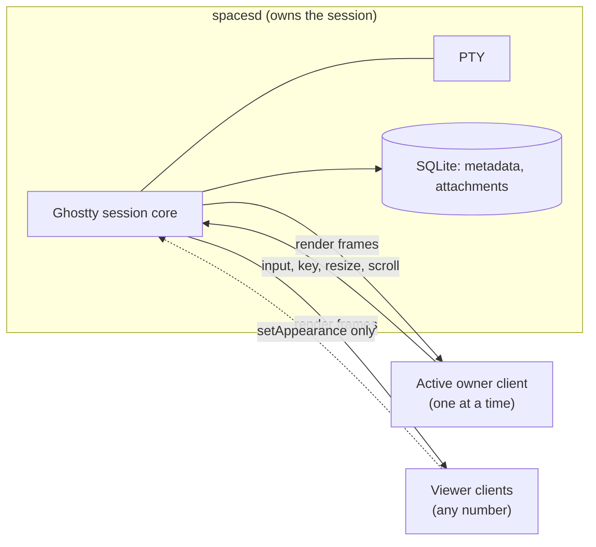
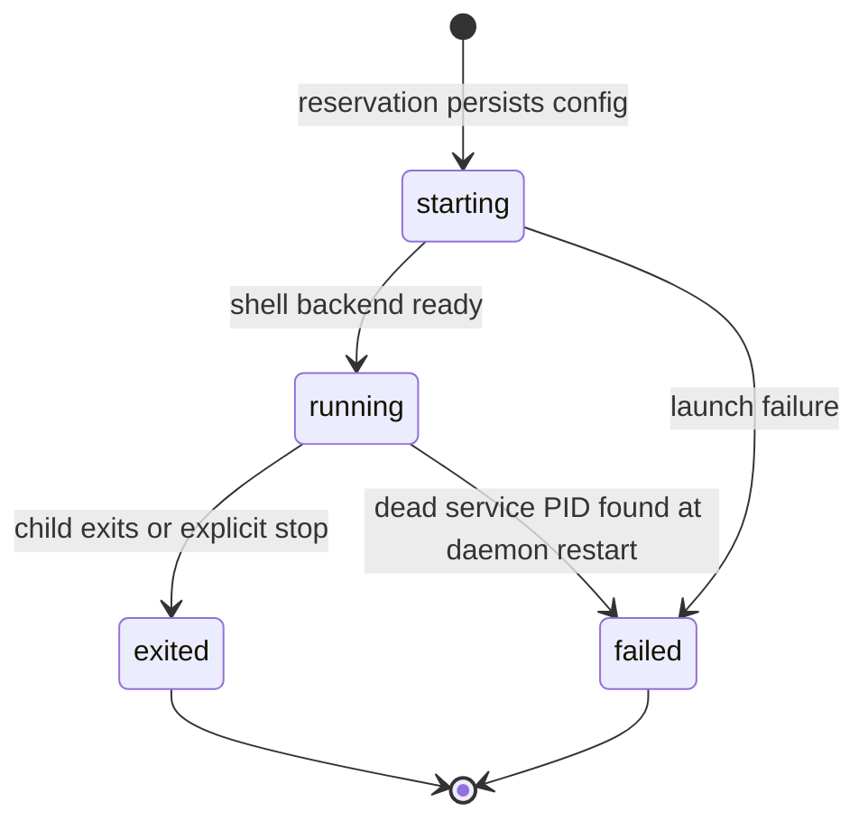
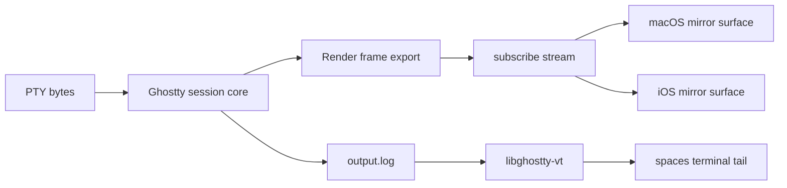

# Built-in Terminal

The built-in terminal runtime: what owns a session, what clients attach to, what is persisted, and where the Ghostty compatibility boundary sits.

| Doc | Owns |
| --- | --- |
| [spec.md](spec.md) | User-visible terminal behavior |
| [implementation.md](implementation.md) | Module boundaries, pairing, TLS, panels, focus |
| [dev.md](dev.md) | Ghostty artifact workflow, E2E harnesses, performance logging |

## Scope

- `ghostty-embedded` is the only supported backend for Spaces-owned sessions.
- Spaces consumes a forked `GhosttyKit.xcframework` because the integration depends on additive exports the upstream app does not need: raw PTY I/O, host rebinding, session-state callbacks, renderer attachment, headless sessions, render-frame export, and mirror renderer surfaces. The fork is pinned by the `apps/macos/vendor/ghostty` submodule; see [dev.md](dev.md) for the artifact workflow.
- Spaces also builds `libghostty-vt` from the same fork lineage, used only by `spaces terminal tail` and diagnostics.
- Terminal UI renders exclusively from service-published render frames. VT replay, raw output, and `output.log` are **not** part of the UI rendering path.

## Ownership Model

`spacesd` owns every built-in session — workspace terminals, process and coding-agent terminals, mobile-visible sessions, and sessions created through `spaces terminal ...`. The daemon is a per-device background executable that autostarts for installed builds and outlives `SpacesApp`.

Exactly one client holds the **active owner** attachment; only it may drive input or PTY size. Ownership transfers by explicit takeover, including across devices. Attachment state is authoritative in SQLite, not in client memory.

Clients never open the daemon's `spaces.db`. They reach launch configuration, runtime state, ownership, and render payloads through the owning device's Device API — for the local device too, over the loopback endpoint.

## Session Boundary

Canonical metadata lives in SQLite; runtime-only artifacts live on disk under `<profile-root>/runtime/terminal/sessions/<session-id>/`.

| SQLite holds | Session directory holds |
| --- | --- |
| Launch config, backend, lifetime policy, workspace ID, kind | `output.log` — append-only output, for `tail` and diagnostics |
| Runtime state, service PID, child PID, title, cwd, columns/rows | `service.log` — per-session service diagnostics |
| Known client identities and remote lease timestamps | |
| Owner and viewer attachment history | |
| Final render payload, keyed by session ID | |

Control and subscription sockets live in the hardened per-user socket root with hashed names rather than inside the session directory, because AF_UNIX paths are length-capped (see [implementation.md](implementation.md)). The profile-scoped `service-<hash>.sock` carries session creation, listing, and termination.

`TerminalControlRequest` is the flat control JSON kept for wire compatibility; `TerminalControlCommand` is the typed view over it, and it is where owner gating and takeover state-inclusion are decided rather than in scattered string checks.

| Command | Owner-gated | Notes |
| --- | --- | --- |
| `send`, `key`, `clearScreen`, `resize`, `scroll` | Yes | Only the active owner may drive the PTY |
| `attach`, `detach`, `heartbeat` | No | Attachment lifecycle |
| `takeover` | No | The one command that returns session state on success |
| `setAppearance` | No | A per-client view preference, not a mutation |

## Session Lifecycle

`TerminalSessionState` is `starting`, `running`, `exited`, or `failed`; `starting` and `running` are the interactive states. Lifetime policy is `persistent` (app-created ad hoc terminals, so they survive app quit) or `whileAttached` (reaped after the last live attachment detaches or expires).

On termination the daemon captures the render frame **before** renderer teardown, writes a final `terminated` payload to SQLite, broadcasts it to attached clients, marks attachments detached, then closes the stream and renderer. An ended session's final render is served from that payload through the Device API `state` response — there is no local on-disk mirror.

Closing a pane detaches the local client from process and coding-agent sessions while the daemon session keeps running. Closing the pane that owns an ad hoc workspace terminal asks the daemon to stop it, which it does only when a fresh foreground read shows the session's own shell at a bare prompt and no owner attachment survives the detach. For a live session, a viewer's close, and a close while any program is running, only detach; closing any pane of an ended ad hoc terminal removes it.

## Render Pipeline

The two paths never cross: `output.log` and VT replay feed only `tail` and diagnostics, never the UI.

The stream carries v2 render updates in one of three kinds. Full updates are self-contained, so a one-shot `state` fetch or a fresh subscriber can materialize the current screen with no prior history.

| Kind | Used for |
| --- | --- |
| `full` | Initial baseline, self-contained fetches, resize, termination, `input_output`, correctness resyncs |
| `delta` | Steady-state output, prompt redraws, scrollback movement — cell-run deltas plus Ghostty scroll-rectangle operations |
| `resyncRequired` | The baseline is unusable; the client must re-establish one |

Every full update records why it was not a delta — a missing or mismatched baseline, an invalid grid or scroll rectangle — which is what makes render regressions diagnosable from logs alone.

## Clients

| Client | Reaches the session via | Renders |
| --- | --- | --- |
| macOS app | Device API (loopback for local, TLS for remote) | Ghostty mirror surface from render frames |
| iOS app | Device API over pinned TLS | Ghostty mirror surface from render frames |
| `spaces terminal` CLI | Profile socket, or Device API with `--device` | Plain-text tail through the VT bridge |
| MCP tools | Same two routes, chosen by the `device` argument | Plain-text tail |

A single `DeviceTerminalSessionStateModel` owns one session client and one `subscribe` stream per session, then fans it out to the pane controller for metadata and to `RemoteGhosttySessionHost` for rendering. Local and remote panes share that one path.

`spaces terminal show` opens an owner-seeking window: it expresses ownership intent and may transfer the active owner away from another client, on this device or another.

Two Device API commands are token-authorized but deliberately **not** owner- or attachment-gated, because orchestrator agents drive sessions they never render: `sendTerminalInput` and `tailTerminalOutput`. The Device API is an internal first-party transport, not a stable public API.

Image paste (`terminalPasteImage`) is an image-only extension of the owner input boundary. The daemon validates the owner, epoch-gates the paste on the same terms as text input (the client sends the owner epoch it has cached, and a request that carries none is not epoch-gated), rejects ended sessions and payloads over 10 MiB, writes a `/tmp/spaces-paste-<uuid>.<ext>` file, and injects only that path through the same owner-gated send that protects text.

## Tail and Metadata

`spaces terminal tail` reads `output.log` and replays ANSI and full-screen output through `libghostty-vt`, using the terminal geometry persisted in SQLite so wrapping stays aligned with what was last visible.

Tail returns recent output including lines that scrolled above the current prompt, so an agent that sent a command through `sendTerminalInput` can read the result.

For sessions identified as coding agents, tail removes a faint inline completion beginning at the visible cursor before plain-text formatting, following only Ghostty-marked soft wraps. Ordinary terminal sessions do not apply this filter. Tail preserves all other screen content, including real text after the cursor and status, help, menu, and dialog rows below it.

## Scroll Rendering

Scroll stays inside the active-owner control boundary. Requests carry Ghostty scroll modifier bits for precise deltas and momentum phases, plus the latest pointer position as normalized top-left viewport coordinates. The daemon maps the normalized position through its current Ghostty surface size and scale before dispatching the scroll, so application mouse reports remain accurate across Mac and iOS display scales.

- macOS forwards AppKit trackpad and wheel deltas with the event location and current mouse modifiers, coalesced to display-frame cadence. Ghostty owns scrollback, alternate-screen behavior, application mouse reporting, momentum interpretation, and viewport state.
- iOS forwards touch-derived deltas with the latest touch location through the same coalescing, retains the lift-off location for momentum, and renders the authoritative published frame.
- Linux headless owners have only the VT viewport API, so `TerminalScrollDeltaNormalizer` reproduces Ghostty's native precise-delta behavior. macOS and iOS share one `TerminalScrollModifiers` bit encoding so the owner sees a single wire contract.

## Ghostty Compatibility Boundary

- The fork adds headless-session, render-frame, and mirror-renderer entrypoints without changing default Ghostty app behavior.
- The daemon is the only PTY and session-state owner. Clients import frames into local mirror state and may send input, resize, mouse, keyboard, binding-action, or scroll events only while their client ID and owner epoch match the active owner.
- Clients materialize v2 updates back into Ghostty mirror snapshots until the prebuilt GhosttyKit contract exposes native render-update apply calls.
- Ghostty's Sentry crash reporter is disabled in Spaces artifacts (`-Dsentry=false`). Its initialization thread reads a pointer-and-length snapshot of `environ` while `ghostty_init`'s locale setup calls `setenv` on the calling thread, which reallocates and frees that array; the resulting use-after-free segfaults the daemon and the iOS app. Spaces configures no DSN, so the reporter only writes envelopes to a local directory nothing reads — there is nothing to trade against the crash. On the daemon the failure is easy to miss, because launchd relaunches within a second and the visible symptom is every connected client losing its streams and the device appearing offline.
- Pixel streaming is not the architecture.

## Hard-Earned Learnings

Non-obvious constraints. Each names a trap and what breaks without the guard.

### Service runtime

- **Capture the render frame before renderer teardown.** Termination tears down the renderer, so a frame captured afterward is empty and the ended session shows a blank final screen.
- **A dead service PID leaves sessions stranded in `starting` or `running`.** On restart the daemon marks those failed and removes the stale `control.sock`, otherwise clients attach to a socket no process is listening on.
- **The embedded service must initialize without a display-linked render loop.** It publishes frames on demand and runs headless; depending on a display link would make daemon-hosted sessions fail with no window on screen.
- **Mark programmatic closes as terminating.** Stop and restart close windows themselves; without the marker, AppKit cleanup also fires the ad hoc close path and terminates the replacement session.
- **The default shell is platform-specific** — `/bin/zsh` on macOS, `/bin/bash` on Linux — and `forkpty` needs `libutil` linked on Linux only, where it does not live in libc.

### Rendering

- **Render revisions are monotonic and distinct from session-state revisions.** A viewport-only scrollback change advances the render revision while session state is unchanged, so gating renders on session-state revision drops scroll updates.
- **VT replay and `output.log` are not rendering fallbacks.** They exist for `tail` and diagnostics. Reaching for them when a frame is missing reintroduces the transcript-rendering path the render-frame design replaced.
- **Render frames preserve Ghostty row-wrap metadata in cell flags.** Dropping it costs native selection and link detection across soft-wrapped output, including file paths with spaces that wrap mid-path.
- **Output events carry byte counts and offsets, never raw bytes for rendering.** The counts are for ordering and diagnostics; rendering from them would resurrect incremental byte rendering.
- **Owner command submissions keep a trailing `input_output` resync after the first output chunk.** Ordinary character echo can ride the fast path, but a command's first output needs the resync or the screen drifts from the session.
- **Active owners receive screen-state-change frames.** Command output, row clears, and prompt redraws publish from the state stream rather than waiting on the next input event, which is what keeps a redrawing prompt from appearing frozen.

### Ownership and takeover

- **Ordinary resize reconciles inside the owner epoch.** It must not schedule a second bootstrap, which would blank and repaint the screen on every window drag.
- **Prefer one explicit refresh over an implicit bootstrap loop.** When an owner epoch desynchronizes after takeover, retrying the bootstrap implicitly can loop indefinitely.
- **The takeover response carries post-transfer state when it is readable.** Clients hold the takeover UI pending and issue exactly one explicit refresh when it is not, rather than polling.
- **An ended session is read-only even when stale attachment rows still name an owner.** Trusting those rows lets a client try to resize or send input to a dead PTY.
- **Only client-identified activity refreshes that client's remote lease.** Any-activity refresh would keep a disconnected client's lease alive forever.
- **An ended-session `subscribe` sends the final payload and completes.** Leaving the stream open makes stale clients report a missing live stream instead of showing the final frame.

### Device API

- **`sendTerminalInput` and `tailTerminalOutput` are token-authorized but not owner-gated.** This is deliberate: orchestrator agents drive sessions they never attach to or render. Adding an owner gate would break headless agent control.
- **`setAppearance` is not owner-gated either.** Appearance is a per-client view preference, so a viewer may send it. A shared session applies it last-writer-wins, and a same-value request is a cheap no-op.
- **Resetting all pairings regenerates the daemon TLS identity.** Every client holding the old pin fails closed until it re-pairs — correct, but it means a reset is not a locally recoverable action for remote clients.
- **Serialize outbound stream sends through the queue-confined `StreamSendSequencer`.** Enqueue and completion run on the server queue identified by a dispatch-specific key, so send ordering stays explicit across network-shaping callbacks rather than depending on callback timing.

### macOS windows

- **Owner windows dispatch edit and find command-key equivalents directly to the window controller.** Left to normal AppKit menu routing, those chords bypass the live Ghostty surface entirely.
- **`cmd+k` is a terminal-owned host action.** It clears the visible screen and scrollback without sending `Ctrl+L` as PTY input, so it does not disturb a running program.
- **Check pasteboard data length before decoding and file URL size before reading.** Image paste otherwise decodes an arbitrarily large payload into memory before the 10 MiB limit can reject it. The upload runs from an async callback so it never blocks AppKit event handling.

### Tail

- **A shell prompt's routine erase-below must not reset the tail.** Only a genuine full-screen repaint — an entire-screen clear, or a cursor-home rewrite from a status frame or full-screen app — resets to the current screen. Treating every erase as a repaint truncates exactly the command output an agent is trying to read.
- **Tail renders at most the most recent window of `output.log`,** so its cost stays bounded across a long-lived session.

### Scroll

- **A scroll that normalizes to zero rows, or that is already at a scrollback boundary, succeeds as a no-op.** Returning an error surfaces control-error noise on every trackpad flick at the top or bottom.
- **A request that omits scroll modifier bits defaults to `0`,** rather than inheriting the previous request's momentum phase.

### iOS

- **`simctl launch` delivers EOF on stdin immediately.** `GhosttyMobileAppService` repairs missing stdout and stderr descriptors and rebinds stdin to a kept-open pipe before booting the terminal runtime, or the runtime shuts down at launch.

### Overview rows

- **Resolve an ad hoc session's workspace from launch metadata before falling back to working-directory matching.** Directory matching alone misattributes a session started in a nested path.

## Validation

The terminal slice is healthy when these flows work:

- App-launched workspace terminals, process windows, and coding-agent windows attach to daemon-owned sessions and reopen across `SpacesApp` quit and relaunch without restarting the session
- Session creation through `spaces terminal create`; `list`, `send`, `key`, `tail`, `show`, and `takeover`
- Owner-scoped image paste writes a daemon-local `/tmp/spaces-paste-*` file and injects that path, leaving non-image `Ctrl+V` as ordinary input
- Owner and viewer attachment persistence, and lease expiry
- CLI `tail` transcript rendering from `output.log` with persisted geometry
- iOS attach, auto-takeover, ownership transfer back to a macOS owner, and streamed render freshness on the same session boundary
- Large-transcript iPhone takeover with a non-blank first owner frame, one bootstrap epoch, and preserved live updates
- Long-output iPhone scrollback after takeover, preserving scroll position with no stray prompt repaint rows
- Redraw-heavy churn and soak scenarios through `apps/macos/Tests/e2e.sh terminal` (see [dev.md](dev.md))
